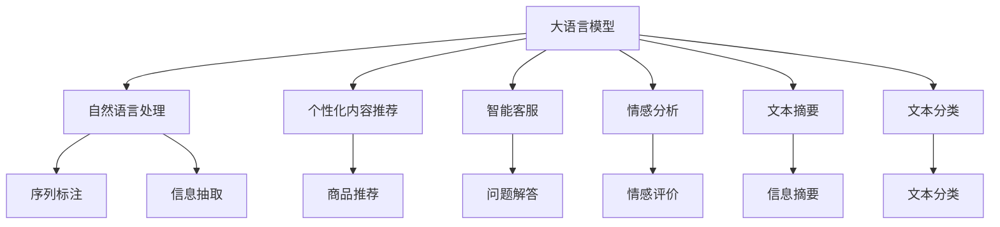

                 

# 大模型驱动的电商个性化内容营销

## 1. 背景介绍

在电商领域，个性化内容营销已成为驱动用户行为、提升销售转化的关键因素。传统的内容营销依赖于人工创作、编辑、审核等繁琐流程，难以适应快速变化的市场需求。近年来，大语言模型(如GPT-3、BERT等)在自然语言处理领域取得突破性进展，逐渐成为电商个性化内容营销的新引擎。通过大模型的自然语言生成能力，电商企业可以自动生成丰富多样、高质量的文本内容，实现个性化推荐、智能客服、智能广告等多种应用，大幅提升用户体验和运营效率。

本文章将详细探讨大模型在电商个性化内容营销中的原理、操作、应用及其前景，帮助读者深入理解这一前沿技术的应用场景和优化策略，以期为电商企业的数字化转型提供有益的参考。

## 2. 核心概念与联系

### 2.1 核心概念概述

为更好地理解大模型在电商个性化内容营销中的应用，本节将介绍几个密切相关的核心概念：

- **大语言模型(Large Language Model, LLM)**：以自回归(如GPT)或自编码(如BERT)模型为代表的大规模预训练语言模型。通过在海量无标签文本语料上进行预训练，学习通用的语言知识，具备强大的语言理解和生成能力。

- **自然语言处理(Natural Language Processing, NLP)**：研究如何让计算机理解、解释、处理人类自然语言的技术，涵盖文本分类、序列标注、信息抽取、文本生成等多个任务。

- **个性化内容推荐**：根据用户的历史行为和偏好，推荐最相关的内容，如商品、文章、广告等，提高用户满意度和转化率。

- **智能客服**：使用自然语言理解和生成技术，实现人机对话，解决用户疑问，提升服务体验。

- **情感分析**：分析用户评论、反馈等文本数据，评估用户情感倾向，指导业务决策。

- **文本摘要**：将长篇文本精炼成摘要，提高信息获取效率。

- **文本分类**：将文本归入预定义的类别，辅助内容管理和推荐。

这些核心概念之间的逻辑关系可以通过以下Mermaid流程图来展示：



这个流程图展示了大语言模型与NLP任务的关系：

1. 大语言模型通过预训练获得语言知识。
2. 自然语言处理任务对文本进行理解和生成，是大语言模型的下游任务。
3. 个性化推荐、智能客服等任务通过自然语言处理技术，实现内容生成和理解。
4. 情感分析、文本摘要、文本分类等任务则对文本进行进一步的分析和处理。

## 3. 核心算法原理 & 具体操作步骤
### 3.1 算法原理概述

大模型驱动的电商个性化内容营销，本质上是通过大模型的自然语言生成能力，对电商数据进行理解和处理，自动生成高质量的文本内容，并应用于推荐、客服、广告等环节。其核心思想是：将大语言模型视作一个强大的"内容生成器"，通过在电商数据上微调，使得模型能够生成与用户偏好高度匹配的内容，从而实现个性化推荐和智能客服等功能。

形式化地，假设电商业务的数据集为 $D=\{(x_i,y_i)\}_{i=1}^N, x_i \in \mathcal{X}, y_i \in \mathcal{Y}$，其中 $x_i$ 为用户行为数据，$y_i$ 为商品信息。定义模型 $M_{\theta}$，其中 $\theta$ 为大语言模型参数。微调的目标是找到新的模型参数 $\hat{\theta}$，使得：

$$
\hat{\theta}=\mathop{\arg\min}_{\theta} \mathcal{L}(M_{\theta},D)
$$

其中 $\mathcal{L}$ 为任务特定的损失函数，用于衡量模型预测与真实标签之间的差异。例如，对于个性化商品推荐任务，可以使用交叉熵损失函数：

$$
\ell(M_{\theta}(x_i),y_i) = -[y_i\log \hat{y}_i + (1-y_i)\log (1-\hat{y}_i)]
$$

通过梯度下降等优化算法，微调过程不断更新模型参数 $\theta$，最小化损失函数 $\mathcal{L}$，使得模型输出逼近真实标签。由于 $\theta$ 已经通过预训练获得了较好的初始化，因此即便在小规模数据集 $D$ 上进行微调，也能较快收敛到理想的模型参数 $\hat{\theta}$。

### 3.2 算法步骤详解

基于大模型的电商个性化内容营销一般包括以下几个关键步骤：

**Step 1: 准备电商数据和预训练模型**
- 收集电商数据集 $D=\{(x_i,y_i)\}_{i=1}^N$，其中 $x_i$ 为用户行为数据，$y_i$ 为商品信息。
- 选择合适的预训练语言模型 $M_{\theta}$，如GPT-3、BERT等，作为初始化参数。

**Step 2: 添加任务适配层**
- 根据具体任务，在预训练模型顶层设计合适的输出层和损失函数。例如，对于个性化推荐任务，可以在顶层添加线性分类器和交叉熵损失函数。

**Step 3: 设置微调超参数**
- 选择合适的优化算法及其参数，如 AdamW、SGD 等，设置学习率、批大小、迭代轮数等。
- 设置正则化技术及强度，包括权重衰减、Dropout、Early Stopping等。
- 确定冻结预训练参数的策略，如仅微调顶层，或全部参数都参与微调。

**Step 4: 执行梯度训练**
- 将电商数据分批次输入模型，前向传播计算损失函数。
- 反向传播计算参数梯度，根据设定的优化算法和学习率更新模型参数。
- 周期性在验证集上评估模型性能，根据性能指标决定是否触发 Early Stopping。
- 重复上述步骤直到满足预设的迭代轮数或 Early Stopping 条件。

**Step 5: 测试和部署**
- 在测试集上评估微调后模型 $M_{\hat{\theta}}$ 的性能，对比微调前后的效果。
- 使用微调后的模型对新样本进行推理预测，集成到实际的应用系统中，如个性化推荐、智能客服等。

### 3.3 算法优缺点

大模型驱动的电商个性化内容营销方法具有以下优点：

1. 快速高效。大模型通过微调即可适应特定任务，生成符合用户偏好的个性化内容，无需大量人工创作。
2. 效果显著。大模型的自然语言生成能力，使内容更加丰富、多样化，提升用户满意度。
3. 可扩展性强。大模型的通用性使其可以应用于多种电商任务，如推荐、客服、广告等。
4. 灵活性高。大模型的微调过程可结合具体业务需求，进行灵活调整和优化。

同时，该方法也存在一些局限性：

1. 依赖数据质量。电商数据的分布和标注质量直接影响微调效果，标注成本较高。
2. 模型复杂度高。大模型的参数量较大，训练和推理资源消耗高。
3. 可解释性不足。大模型的生成过程缺乏可解释性，难以理解模型决策依据。
4. 风险控制难度大。大模型的生成内容可能包含误导性或有害信息，需加强内容审核。

尽管存在这些局限性，但大模型在电商个性化内容营销中的应用已经显示出巨大的潜力，未来在不断优化和改进中，有望成为电商企业数字化转型的重要驱动力。

### 3.4 算法应用领域

基于大模型的电商个性化内容营销技术，已经在推荐系统、智能客服、广告投放等多个电商应用场景中得到广泛应用。具体而言：

- **个性化商品推荐**：通过分析用户行为数据，生成商品描述和推荐理由，使用户更容易接受推荐。
- **智能客服**：使用大模型生成回答，处理用户咨询，提升客服响应速度和效率。
- **智能广告投放**：生成广告文案，提升广告点击率和转化率。
- **情感分析**：分析用户评论，评估产品满意度，指导产品改进。

除了这些直接应用外，大模型在电商领域的潜在应用还包括数据清洗、文本摘要、内容审核等辅助性任务，进一步优化电商运营流程。

## 4. 数学模型和公式 & 详细讲解 & 举例说明

### 4.1 数学模型构建

本节将使用数学语言对大模型在电商个性化内容营销中的应用进行更加严格的刻画。

假设电商数据集为 $D=\{(x_i,y_i)\}_{i=1}^N$，其中 $x_i$ 为用户行为数据，$y_i$ 为商品信息。定义模型 $M_{\theta}$，其中 $\theta$ 为大语言模型参数。微调的目标是找到新的模型参数 $\hat{\theta}$，使得：

$$
\hat{\theta}=\mathop{\arg\min}_{\theta} \mathcal{L}(M_{\theta},D)
$$

其中 $\mathcal{L}$ 为任务特定的损失函数。例如，对于个性化推荐任务，可以使用交叉熵损失函数：

$$
\ell(M_{\theta}(x_i),y_i) = -[y_i\log \hat{y}_i + (1-y_i)\log (1-\hat{y}_i)]
$$

通过梯度下降等优化算法，微调过程不断更新模型参数 $\theta$，最小化损失函数 $\mathcal{L}$，使得模型输出逼近真实标签。

### 4.2 公式推导过程

以个性化商品推荐为例，推导交叉熵损失函数及其梯度的计算公式。

假设模型 $M_{\theta}$ 在输入 $x$ 上的输出为 $\hat{y}=M_{\theta}(x) \in [0,1]$，表示推荐商品被用户点击的概率。真实标签 $y \in \{0,1\}$。则二分类交叉熵损失函数定义为：

$$
\ell(M_{\theta}(x),y) = -[y\log \hat{y} + (1-y)\log (1-\hat{y})]
$$

将其代入经验风险公式，得：

$$
\mathcal{L}(\theta) = -\frac{1}{N}\sum_{i=1}^N [y_i\log M_{\theta}(x_i)+(1-y_i)\log(1-M_{\theta}(x_i))]
$$

根据链式法则，损失函数对参数 $\theta_k$ 的梯度为：

$$
\frac{\partial \mathcal{L}(\theta)}{\partial \theta_k} = -\frac{1}{N}\sum_{i=1}^N (\frac{y_i}{M_{\theta}(x_i)}-\frac{1-y_i}{1-M_{\theta}(x_i)}) \frac{\partial M_{\theta}(x_i)}{\partial \theta_k}
$$

其中 $\frac{\partial M_{\theta}(x_i)}{\partial \theta_k}$ 可进一步递归展开，利用自动微分技术完成计算。

在得到损失函数的梯度后，即可带入参数更新公式，完成模型的迭代优化。重复上述过程直至收敛，最终得到适应电商任务的最优模型参数 $\hat{\theta}$。

## 5. 项目实践：代码实例和详细解释说明
### 5.1 开发环境搭建

在进行电商个性化内容营销实践前，我们需要准备好开发环境。以下是使用Python进行PyTorch开发的环境配置流程：

1. 安装Anaconda：从官网下载并安装Anaconda，用于创建独立的Python环境。

2. 创建并激活虚拟环境：
```bash
conda create -n pytorch-env python=3.8 
conda activate pytorch-env
```

3. 安装PyTorch：根据CUDA版本，从官网获取对应的安装命令。例如：
```bash
conda install pytorch torchvision torchaudio cudatoolkit=11.1 -c pytorch -c conda-forge
```

4. 安装Transformers库：
```bash
pip install transformers
```

5. 安装各类工具包：
```bash
pip install numpy pandas scikit-learn matplotlib tqdm jupyter notebook ipython
```

完成上述步骤后，即可在`pytorch-env`环境中开始电商个性化内容营销实践。

### 5.2 源代码详细实现

下面我以电商商品推荐系统为例，给出使用Transformers库对GPT模型进行微调的PyTorch代码实现。

首先，定义电商商品推荐任务的数据处理函数：

```python
from transformers import GPT2Tokenizer
from torch.utils.data import Dataset
import torch

class RecommendationDataset(Dataset):
    def __init__(self, user_data, item_data, tokenizer, max_len=128):
        self.user_data = user_data
        self.item_data = item_data
        self.tokenizer = tokenizer
        self.max_len = max_len
        
    def __len__(self):
        return len(self.user_data)
    
    def __getitem__(self, item):
        user_sequence = self.user_data[item]
        item_sequence = self.item_data[item]
        
        # 将用户和商品信息拼接为一段文本
        text = user_sequence + ' ' + item_sequence
        
        # 使用分词器进行编码
        encoding = self.tokenizer(text, return_tensors='pt', max_length=self.max_len, padding='max_length', truncation=True)
        input_ids = encoding['input_ids'][0]
        attention_mask = encoding['attention_mask'][0]
        
        # 将标签编码为数字
        encoded_tags = [item2id[item] for item in item_sequence] 
        encoded_tags.extend([item2id['<PAD>']] * (self.max_len - len(encoded_tags)))
        labels = torch.tensor(encoded_tags, dtype=torch.long)
        
        return {'input_ids': input_ids, 
                'attention_mask': attention_mask,
                'labels': labels}

# 标签与id的映射
item2id = {'<PAD>': 0, 'item1': 1, 'item2': 2, 'item3': 3, ...} # 真实商品标签映射
id2item = {v: k for k, v in item2id.items()}

# 创建dataset
tokenizer = GPT2Tokenizer.from_pretrained('gpt2')
user_data = ['user1', 'user2', ...] # 用户序列
item_data = ['item1', 'item2', ...] # 商品序列

train_dataset = RecommendationDataset(user_data, item_data, tokenizer)
dev_dataset = RecommendationDataset(user_data, item_data, tokenizer)
test_dataset = RecommendationDataset(user_data, item_data, tokenizer)
```

然后，定义模型和优化器：

```python
from transformers import GPT2LMHeadModel, AdamW

model = GPT2LMHeadModel.from_pretrained('gpt2', num_labels=len(item2id))

optimizer = AdamW(model.parameters(), lr=2e-5)
```

接着，定义训练和评估函数：

```python
from torch.utils.data import DataLoader
from tqdm import tqdm
from sklearn.metrics import classification_report

device = torch.device('cuda') if torch.cuda.is_available() else torch.device('cpu')
model.to(device)

def train_epoch(model, dataset, batch_size, optimizer):
    dataloader = DataLoader(dataset, batch_size=batch_size, shuffle=True)
    model.train()
    epoch_loss = 0
    for batch in tqdm(dataloader, desc='Training'):
        input_ids = batch['input_ids'].to(device)
        attention_mask = batch['attention_mask'].to(device)
        labels = batch['labels'].to(device)
        model.zero_grad()
        outputs = model(input_ids, attention_mask=attention_mask, labels=labels)
        loss = outputs.loss
        epoch_loss += loss.item()
        loss.backward()
        optimizer.step()
    return epoch_loss / len(dataloader)

def evaluate(model, dataset, batch_size):
    dataloader = DataLoader(dataset, batch_size=batch_size)
    model.eval()
    preds, labels = [], []
    with torch.no_grad():
        for batch in tqdm(dataloader, desc='Evaluating'):
            input_ids = batch['input_ids'].to(device)
            attention_mask = batch['attention_mask'].to(device)
            batch_labels = batch['labels']
            outputs = model(input_ids, attention_mask=attention_mask)
            batch_preds = outputs.logits.argmax(dim=2).to('cpu').tolist()
            batch_labels = batch_labels.to('cpu').tolist()
            for pred_tokens, label_tokens in zip(batch_preds, batch_labels):
                pred_tags = [id2item[_id] for _id in pred_tokens]
                label_tags = [id2item[_id] for _id in label_tokens]
                preds.append(pred_tags[:len(label_tags)])
                labels.append(label_tags)
                
    print(classification_report(labels, preds))
```

最后，启动训练流程并在测试集上评估：

```python
epochs = 5
batch_size = 16

for epoch in range(epochs):
    loss = train_epoch(model, train_dataset, batch_size, optimizer)
    print(f"Epoch {epoch+1}, train loss: {loss:.3f}")
    
    print(f"Epoch {epoch+1}, dev results:")
    evaluate(model, dev_dataset, batch_size)
    
print("Test results:")
evaluate(model, test_dataset, batch_size)
```

以上就是使用PyTorch对GPT模型进行电商商品推荐系统微调的完整代码实现。可以看到，得益于Transformers库的强大封装，我们可以用相对简洁的代码完成GPT模型的加载和微调。

### 5.3 代码解读与分析

让我们再详细解读一下关键代码的实现细节：

**RecommendationDataset类**：
- `__init__`方法：初始化用户序列、商品序列、分词器等关键组件。
- `__len__`方法：返回数据集的样本数量。
- `__getitem__`方法：对单个样本进行处理，将用户和商品信息拼接为一段文本，使用分词器进行编码，得到模型所需的输入和标签。

**item2id和id2item字典**：
- 定义了商品标签与数字id之间的映射关系，用于将模型预测结果解码回真实商品标签。

**训练和评估函数**：
- 使用PyTorch的DataLoader对数据集进行批次化加载，供模型训练和推理使用。
- 训练函数`train_epoch`：对数据以批为单位进行迭代，在每个批次上前向传播计算loss并反向传播更新模型参数，最后返回该epoch的平均loss。
- 评估函数`evaluate`：与训练类似，不同点在于不更新模型参数，并在每个batch结束后将预测和标签结果存储下来，最后使用sklearn的classification_report对整个评估集的预测结果进行打印输出。

**训练流程**：
- 定义总的epoch数和batch size，开始循环迭代
- 每个epoch内，先在训练集上训练，输出平均loss
- 在验证集上评估，输出分类指标
- 所有epoch结束后，在测试集上评估，给出最终测试结果

可以看到，PyTorch配合Transformers库使得GPT微调的代码实现变得简洁高效。开发者可以将更多精力放在数据处理、模型改进等高层逻辑上，而不必过多关注底层的实现细节。

当然，工业级的系统实现还需考虑更多因素，如模型的保存和部署、超参数的自动搜索、更灵活的任务适配层等。但核心的微调范式基本与此类似。

## 6. 实际应用场景
### 6.1 个性化推荐

电商个性化推荐系统是电商内容营销的重要组成部分。传统推荐系统依赖于用户行为数据和商品标签进行推荐，难以充分理解用户潜在需求和商品语义信息。而使用大模型的自然语言生成能力，电商推荐系统可以自动生成商品描述和推荐理由，提升推荐准确性和用户满意度。

具体而言，可以收集用户浏览、购买、评论等行为数据，以及商品描述、图片等信息，进行预处理和编码。将用户行为序列和商品信息作为输入，使用大模型生成推荐理由，再将理由与商品标签匹配，最终输出推荐列表。该过程不仅能提升推荐效果，还能降低人工标注的成本和复杂度。

### 6.2 智能客服

智能客服是大模型在电商个性化内容营销中的另一重要应用。传统的客服系统依赖人工客服，存在响应慢、服务质量不稳定等问题。而使用大模型生成对话内容，可以大幅提升客服响应速度和质量。

具体而言，可以使用大模型生成对话回答，自动匹配用户咨询和回复。在对话过程中，系统可以记录用户反馈和历史聊天记录，动态调整回答策略，逐步优化对话效果。这样，电商企业可以实现24小时在线客服，为用户提供随时随地的服务支持。

### 6.3 广告投放

电商广告投放是大模型在电商个性化内容营销中的又一关键应用。传统的广告投放依赖人工创意制作和投放策略，难以覆盖广泛用户群体，效果有限。而使用大模型生成广告文案和广告素材，可以动态生成不同风格的广告内容，实现个性化投放。

具体而言，可以收集用户画像、行为数据、商品信息等，生成多条广告文案和素材。使用大模型对用户进行精准定位，动态生成个性化广告内容，提升广告点击率和转化率。该过程不仅能提升广告效果，还能显著降低人工投放的成本和复杂度。

### 6.4 未来应用展望

随着大语言模型和微调方法的不断发展，基于大模型的电商个性化内容营销技术将呈现以下几个发展趋势：

1. **模型规模持续增大**：大模型的参数量将持续增长，带来更丰富的语言知识，支撑更复杂多变的电商任务。
2. **微调方法日趋多样**：未来将涌现更多参数高效、计算高效的微调方法，在节省计算资源的同时，也能保证微调精度。
3. **持续学习成为常态**：随着数据分布的变化，大模型需要持续学习新知识，保持性能稳定。
4. **标注样本需求降低**：受启发于提示学习(Prompt-based Learning)的思路，未来的微调方法将更好地利用大模型的语言理解能力，通过更巧妙的任务描述，在更少的标注样本上实现理想的微调效果。
5. **多模态微调崛起**：多模态信息的融合，将显著提升大模型的语义理解和生成能力。
6. **知识整合能力增强**：将符号化的先验知识与神经网络模型进行融合，形成更加全面、准确的信息整合能力。

这些趋势凸显了大模型在电商个性化内容营销中的广阔前景。这些方向的探索发展，将进一步提升电商系统的智能化水平，为电商企业带来更高效的运营模式和更优质的用户体验。

## 7. 工具和资源推荐
### 7.1 学习资源推荐

为了帮助开发者系统掌握大模型在电商个性化内容营销中的应用，这里推荐一些优质的学习资源：

1. **《Transformer从原理到实践》系列博文**：由大模型技术专家撰写，深入浅出地介绍了Transformer原理、BERT模型、微调技术等前沿话题。
2. **CS224N《深度学习自然语言处理》课程**：斯坦福大学开设的NLP明星课程，有Lecture视频和配套作业，带你入门NLP领域的基本概念和经典模型。
3. **《Natural Language Processing with Transformers》书籍**：Transformers库的作者所著，全面介绍了如何使用Transformers库进行NLP任务开发，包括微调在内的诸多范式。
4. **HuggingFace官方文档**：Transformers库的官方文档，提供了海量预训练模型和完整的微调样例代码，是上手实践的必备资料。
5. **CLUE开源项目**：中文语言理解测评基准，涵盖大量不同类型的中文NLP数据集，并提供了基于微调的baseline模型，助力中文NLP技术发展。

通过对这些资源的学习实践，相信你一定能够快速掌握大模型在电商个性化内容营销的精髓，并用于解决实际的电商问题。
###  7.2 开发工具推荐

高效的开发离不开优秀的工具支持。以下是几款用于大模型在电商个性化内容营销开发的常用工具：

1. **PyTorch**：基于Python的开源深度学习框架，灵活动态的计算图，适合快速迭代研究。大部分预训练语言模型都有PyTorch版本的实现。
2. **TensorFlow**：由Google主导开发的开源深度学习框架，生产部署方便，适合大规模工程应用。同样有丰富的预训练语言模型资源。
3. **Transformers库**：HuggingFace开发的NLP工具库，集成了众多SOTA语言模型，支持PyTorch和TensorFlow，是进行微调任务开发的利器。
4. **Weights & Biases**：模型训练的实验跟踪工具，可以记录和可视化模型训练过程中的各项指标，方便对比和调优。与主流深度学习框架无缝集成。
5. **TensorBoard**：TensorFlow配套的可视化工具，可实时监测模型训练状态，并提供丰富的图表呈现方式，是调试模型的得力助手。
6. **Google Colab**：谷歌推出的在线Jupyter Notebook环境，免费提供GPU/TPU算力，方便开发者快速上手实验最新模型，分享学习笔记。

合理利用这些工具，可以显著提升大模型在电商个性化内容营销任务的开发效率，加快创新迭代的步伐。

### 7.3 相关论文推荐

大模型在电商个性化内容营销中的应用源于学界的持续研究。以下是几篇奠基性的相关论文，推荐阅读：

1. **Attention is All You Need**：提出了Transformer结构，开启了NLP领域的预训练大模型时代。
2. **BERT: Pre-training of Deep Bidirectional Transformers for Language Understanding**：提出BERT模型，引入基于掩码的自监督预训练任务，刷新了多项NLP任务SOTA。
3. **Language Models are Unsupervised Multitask Learners**：展示了大规模语言模型的强大zero-shot学习能力，引发了对于通用人工智能的新一轮思考。
4. **Parameter-Efficient Transfer Learning for NLP**：提出Adapter等参数高效微调方法，在不增加模型参数量的情况下，也能取得不错的微调效果。
5. **Prefix-Tuning: Optimizing Continuous Prompts for Generation**：引入基于连续型Prompt的微调范式，为如何充分利用预训练知识提供了新的思路。
6. **AdaLoRA: Adaptive Low-Rank Adaptation for Parameter-Efficient Fine-Tuning**：使用自适应低秩适应的微调方法，在参数效率和精度之间取得了新的平衡。

这些论文代表了大模型在电商个性化内容营销中的发展脉络。通过学习这些前沿成果，可以帮助研究者把握学科前进方向，激发更多的创新灵感。

## 8. 总结：未来发展趋势与挑战
### 8.1 总结

本文对大模型在电商个性化内容营销中的应用进行了全面系统的介绍。首先阐述了大模型和微调技术的研究背景和意义，明确了大模型在电商个性化内容营销中的重要价值。其次，从原理到实践，详细讲解了大模型微调的操作方法和关键步骤，给出了电商推荐系统的完整代码实例。同时，本文还广泛探讨了微调方法在电商推荐、客服、广告等多个电商应用场景中的应用前景，展示了微调技术的巨大潜力。此外，本文精选了微调技术的各类学习资源，力求为读者提供全方位的技术指引。

通过本文的系统梳理，可以看到，基于大模型的电商个性化内容营销方法正在成为电商企业数字化转型的重要驱动力，极大地提升了电商系统的智能化水平，为用户带来更优质的体验。未来，伴随大模型和微调方法的不断演进，相信电商系统将能够实现更加精准、高效、智能的运营模式，为电商企业带来更大的商业价值。

### 8.2 未来发展趋势

展望未来，大模型在电商个性化内容营销中将呈现以下几个发展趋势：

1. **模型规模持续增大**：大模型的参数量将持续增长，带来更丰富的语言知识，支撑更复杂多变的电商任务。
2. **微调方法日趋多样**：未来将涌现更多参数高效、计算高效的微调方法，在节省计算资源的同时，也能保证微调精度。
3. **持续学习成为常态**：随着数据分布的变化，大模型需要持续学习新知识，保持性能稳定。
4. **标注样本需求降低**：受启发于提示学习(Prompt-based Learning)的思路，未来的微调方法将更好地利用大模型的语言理解能力，通过更巧妙的任务描述，在更少的标注样本上实现理想的微调效果。
5. **多模态微调崛起**：多模态信息的融合，将显著提升大模型的语义理解和生成能力。
6. **知识整合能力增强**：将符号化的先验知识与神经网络模型进行融合，形成更加全面、准确的信息整合能力。

这些趋势凸显了大模型在电商个性化内容营销中的广阔前景。这些方向的探索发展，将进一步提升电商系统的智能化水平，为电商企业带来更高效的运营模式和更优质的用户体验。

### 8.3 面临的挑战

尽管大模型在电商个性化内容营销中已经取得了瞩目成就，但在迈向更加智能化、普适化应用的过程中，它仍面临着诸多挑战：

1. **标注成本瓶颈**：电商数据的分布和标注质量直接影响微调效果，标注成本较高。
2. **模型鲁棒性不足**：大模型面对域外数据时，泛化性能往往大打折扣。
3. **可解释性不足**：大模型的生成过程缺乏可解释性，难以理解模型决策依据。
4. **风险控制难度大**：大模型的生成内容可能包含误导性或有害信息，需加强内容审核。

尽管存在这些局限性，但大模型在电商个性化内容营销中的应用已经显示出巨大的潜力，未来在不断优化和改进中，有望成为电商企业数字化转型的重要驱动力。

### 8.4 研究展望

面对大模型在电商个性化内容营销所面临的挑战，未来的研究需要在以下几个方面寻求新的突破：

1. **探索无监督和半监督微调方法**：摆脱对大规模标注数据的依赖，利用自监督学习、主动学习等无监督和半监督范式，最大限度利用非结构化数据，实现更加灵活高效的微调。
2. **研究参数高效和计算高效的微调范式**：开发更加参数高效的微调方法，在固定大部分预训练参数的同时，只更新极少量的任务相关参数。同时优化微调模型的计算图，减少前向传播和反向传播的资源消耗，实现更加轻量级、实时性的部署。
3. **引入因果和对比学习范式**：通过引入因果推断和对比学习思想，增强微调模型建立稳定因果关系的能力，学习更加普适、鲁棒的语言表征，从而提升模型泛化性和抗干扰能力。
4. **结合因果分析和博弈论工具**：将因果分析方法引入微调模型，识别出模型决策的关键特征，增强输出解释的因果性和逻辑性。借助博弈论工具刻画人机交互过程，主动探索并规避模型的脆弱点，提高系统稳定性。
5. **纳入伦理道德约束**：在模型训练目标中引入伦理导向的评估指标，过滤和惩罚有偏见、有害的输出倾向。同时加强人工干预和审核，建立模型行为的监管机制，确保输出符合人类价值观和伦理道德。

这些研究方向的探索，必将引领大模型在电商个性化内容营销技术迈向更高的台阶，为电商企业带来更精准、高效、智能的运营模式。唯有勇于创新、敢于突破，才能不断拓展语言模型的边界，让智能技术更好地造福人类社会。

## 9. 附录：常见问题与解答

**Q1：电商数据的标注难度大，标注成本高，如何解决？**

A: 电商数据的标注难度确实较大，但可以通过以下方法缓解：
1. **无监督学习**：利用未标注数据进行预训练，再结合少样本学习技术，在少量标注数据上实现微调。
2. **主动学习**：在标注样本不足的情况下，使用主动学习算法，高效获取标注数据，提升微调效果。
3. **半监督学习**：结合少量标注数据和大量未标注数据，利用半监督学习方法，提升微调模型性能。

**Q2：大模型在电商推荐中生成的内容质量如何保证？**

A: 大模型生成的内容质量主要依赖于模型预训练和微调时的数据质量和策略选择。为了保证生成内容的质量，可以采取以下措施：
1. **数据清洗**：去除噪音数据和无效信息，提升训练数据质量。
2. **正则化**：使用L2正则、Dropout等方法，避免模型过拟合。
3. **对抗训练**：引入对抗样本，提高模型鲁棒性，减少生成内容中的错误信息。
4. **人工审核**：在模型生成的内容发布前，进行人工审核，筛选高质量内容。

**Q3：大模型在电商客服中的应用前景如何？**

A: 大模型在电商客服中的应用前景非常广阔。通过自然语言理解和生成技术，大模型可以自动生成对话回答，提高客服响应速度和质量。具体的实现方式包括：
1. **对话生成**：使用大模型生成对话回答，自动匹配用户咨询和回复。
2. **历史记录分析**：分析用户历史聊天记录，动态调整回答策略，逐步优化对话效果。
3. **多轮对话处理**：实现多轮对话管理，提升用户满意度。

通过大模型在电商客服中的应用，电商企业可以实现24小时在线客服，为用户提供随时随地的服务支持。

**Q4：大模型在电商广告投放中的应用如何？**

A: 大模型在电商广告投放中的应用非常广泛。通过自然语言生成技术，大模型可以自动生成广告文案和素材，实现个性化投放。具体的实现方式包括：
1. **广告文案生成**：使用大模型生成多条广告文案，根据用户画像和行为数据进行精准定位，生成个性化广告内容。
2. **广告素材生成**：生成不同风格的广告素材，提升广告点击率和转化率。
3. **广告效果评估**：分析用户点击和转化数据，评估广告投放效果，优化广告策略。

通过大模型在电商广告投放中的应用，电商企业可以大幅提升广告效果，同时降低人工投放的成本和复杂度。

**Q5：如何评估大模型在电商个性化内容营销中的效果？**

A: 评估大模型在电商个性化内容营销中的效果可以从以下几个方面进行：
1. **用户满意度**：通过用户反馈、评分等指标，评估内容推荐和客服回答的满意度。
2. **转化率**：分析广告投放和商品推荐的效果，评估用户行为和转化情况。
3. **点击率**：评估广告点击和推荐链接的点击率，衡量内容的相关性和吸引力。
4. **ROI**：综合考虑广告投放成本和效果，评估广告投放的ROI（投资回报率）。
5. **效果对比**：将大模型推荐或生成的内容与人工处理的内容进行对比，评估其性能提升情况。

通过综合这些指标，可以全面评估大模型在电商个性化内容营销中的效果，为模型优化和应用推广提供依据。

---

作者：禅与计算机程序设计艺术 / Zen and the Art of Computer Programming

