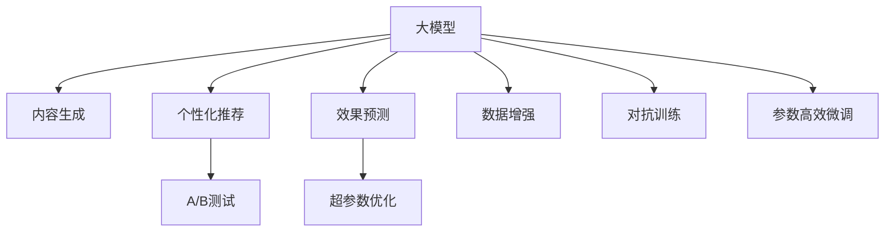

                 

# 大模型驱动的电商个性化内容营销策略生成与效果预测

## 1. 背景介绍

### 1.1 问题由来

随着电商市场的持续发展和消费者需求的多样化，内容营销已经成为了电商品牌提升用户参与度和转化率的关键手段。传统的营销策略依赖于固定的模板、关键词优化以及历史数据，难以满足用户的个性化需求。如何利用大模型驱动的个性化内容生成，并有效预测营销策略的效果，成为了电商营销的重大挑战。

### 1.2 问题核心关键点

个性化内容生成与效果预测的核心关键点在于：

- **内容生成**：利用大模型根据用户行为数据和偏好，生成个性化营销策略，如广告文案、产品推荐、视频内容等。
- **效果预测**：在生成策略后，预测其对用户行为的影响，如点击率、购买率等，以评估策略的效果。

## 2. 核心概念与联系

### 2.1 核心概念概述

本节将介绍几个与大模型驱动的电商个性化内容营销策略生成与效果预测相关的核心概念：

- **大模型**：以GPT、BERT等预训练语言模型为代表，具备强大语言理解和生成能力的模型。
- **内容生成**：根据用户数据，自动生成广告文案、产品描述等营销内容的过程。
- **个性化推荐**：利用用户行为数据，生成针对不同用户的个性化产品推荐和营销内容。
- **效果预测**：根据用户对策略的反应数据，预测策略效果的概率分布，评估策略效果。
- **A/B测试**：通过比较不同策略的效果，确定最佳营销策略。
- **超参数优化**：通过调整模型参数和训练策略，优化生成内容和预测模型的性能。

这些核心概念之间的逻辑关系可以通过以下Mermaid流程图来展示：



这个流程图展示了大模型驱动的个性化内容营销策略生成与效果预测的核心概念及其之间的关系：

1. 大模型作为核心工具，用于内容生成、个性化推荐和效果预测。
2. 内容生成和个性化推荐依赖于用户数据的输入，生成个性化营销策略。
3. 效果预测用于评估生成的策略效果，指导超参数优化和模型改进。
4. A/B测试用于比较不同策略的效果，选择最佳策略。
5. 数据增强、对抗训练和参数高效微调等技术手段用于提升模型的泛化能力和鲁棒性。

## 3. 核心算法原理 & 具体操作步骤

### 3.1 算法原理概述

大模型驱动的电商个性化内容营销策略生成与效果预测，本质上是一个基于大模型的生成和预测任务。其核心思想是：

1. **内容生成**：利用大模型学习用户数据的特征，生成个性化营销策略。
2. **效果预测**：在生成策略后，利用大模型预测其对用户行为的影响，评估策略的效果。

形式化地，假设用户数据集为 $D=\{(x_i, y_i)\}_{i=1}^N$，其中 $x_i$ 为用户行为数据，$y_i$ 为对应的营销策略效果。目标是找到最优的策略生成模型 $M_{\theta}$ 和效果预测模型 $P_{\phi}$，使得：

$$
\hat{\theta}, \hat{\phi} = \mathop{\arg\min}_{\theta, \phi} \mathcal{L}(M_{\theta}, P_{\phi}, D)
$$

其中 $\mathcal{L}$ 为损失函数，包含内容生成的损失 $L_{content}$ 和效果预测的损失 $L_{prediction}$。

通过梯度下降等优化算法，不断更新模型参数 $\theta$ 和 $\phi$，最小化损失函数 $\mathcal{L}$，使得模型输出逼近最优的生成和预测结果。

### 3.2 算法步骤详解

基于大模型的电商个性化内容营销策略生成与效果预测一般包括以下几个关键步骤：

**Step 1: 准备数据和模型**
- 收集用户行为数据，如浏览记录、点击历史、购买行为等，划分为训练集、验证集和测试集。
- 选择合适的预训练语言模型 $M_{\theta}$，如GPT、BERT等。
- 设计效果预测模型 $P_{\phi}$，如线性回归、逻辑回归等。

**Step 2: 生成个性化策略**
- 利用大模型 $M_{\theta}$ 学习用户数据的特征，生成个性化营销策略。
- 根据用户行为数据，自动生成广告文案、产品推荐、视频内容等。

**Step 3: 预测策略效果**
- 使用效果预测模型 $P_{\phi}$ 对生成的策略进行效果预测。
- 预测策略对用户行为的影响，如点击率、购买率等。

**Step 4: 优化模型参数**
- 在验证集上评估模型性能，根据性能指标决定是否触发超参数优化。
- 调整学习率、批大小、正则化强度等超参数，优化模型性能。

**Step 5: A/B测试**
- 在测试集上同时部署不同策略，比较其效果。
- 根据效果指标选择最佳策略。

**Step 6: 部署和监控**
- 将生成的策略部署到实际营销系统中。
- 实时监控策略效果，进行持续优化。

以上是基于大模型的电商个性化内容营销策略生成与效果预测的一般流程。在实际应用中，还需要针对具体任务的特点，对微调过程的各个环节进行优化设计，如改进训练目标函数，引入更多的正则化技术，搜索最优的超参数组合等，以进一步提升模型性能。

### 3.3 算法优缺点

大模型驱动的电商个性化内容营销策略生成与效果预测具有以下优点：

1. **高效生成**：大模型能够自动生成高质量的个性化营销策略，减少人工设计和审核的工作量。
2. **预测准确**：利用大模型的预测能力，可以准确评估策略的效果，指导优化。
3. **覆盖广泛**：大模型可以覆盖各种类型的营销内容，提升策略的多样性和创新性。
4. **实时调整**：大模型可以根据实时数据进行动态调整，保持策略的及时性和相关性。

同时，该方法也存在一定的局限性：

1. **数据质量依赖**：生成的策略效果依赖于用户数据的准确性和完备性。
2. **模型泛化能力**：大模型对数据分布的泛化能力有限，可能面临过拟合的风险。
3. **策略复杂性**：生成的策略可能过于复杂，难以理解和调试。
4. **资源消耗高**：大模型的计算资源消耗较大，需要高性能计算设备支持。

尽管存在这些局限性，但就目前而言，基于大模型的策略生成和效果预测方法在电商营销中已经展现了显著的优势，成为电商营销的重要手段。

### 3.4 算法应用领域

基于大模型的电商个性化内容营销策略生成与效果预测，已经在多个电商应用场景中得到广泛应用，例如：

- **广告文案生成**：根据用户行为数据，自动生成广告文案，提高广告点击率。
- **个性化推荐**：根据用户兴趣，生成个性化产品推荐，提升用户购买率。
- **视频内容制作**：利用大模型生成视频脚本和配音，丰富营销内容形式。
- **活动策划**：根据用户行为数据，生成个性化促销活动策略，提高用户参与度和转化率。

除了这些经典应用外，大模型在电商营销中的创新应用也在不断涌现，如社交媒体互动、虚拟试穿、智能客服等，为电商营销带来了全新的突破。

## 4. 数学模型和公式 & 详细讲解 & 举例说明

### 4.1 数学模型构建

本节将使用数学语言对基于大模型的电商个性化内容营销策略生成与效果预测过程进行更加严格的刻画。

假设用户行为数据为 $x$，营销策略效果为 $y$，则模型 $M_{\theta}$ 在用户数据 $x$ 上的生成结果为 $\hat{x}$，效果预测模型 $P_{\phi}$ 在用户数据 $x$ 上的预测结果为 $\hat{y}$。目标是找到最优的模型参数 $\theta$ 和 $\phi$，使得：

$$
\hat{\theta}, \hat{\phi} = \mathop{\arg\min}_{\theta, \phi} \mathcal{L}(M_{\theta}, P_{\phi}, D)
$$

其中 $\mathcal{L}$ 为损失函数，包含内容生成的损失 $L_{content}$ 和效果预测的损失 $L_{prediction}$。形式化地，我们可以定义：

$$
L_{content} = \frac{1}{N} \sum_{i=1}^N ||\hat{x}_i - x_i||^2
$$

$$
L_{prediction} = \frac{1}{N} \sum_{i=1}^N \log(P_{\phi}(y_i|\hat{x}_i))
$$

因此，整体损失函数为：

$$
\mathcal{L}(\theta, \phi) = L_{content} + \alpha L_{prediction}
$$

其中 $\alpha$ 为权重因子，用于平衡内容生成和效果预测的重要性。

### 4.2 公式推导过程

以下我们以二分类任务为例，推导内容生成和效果预测的数学模型及其梯度计算公式。

假设用户行为数据为二分类任务，$x \in \{0, 1\}$。则内容生成模型的输出为 $\hat{x}=M_{\theta}(x)$，效果预测模型的输出为 $\hat{y}=P_{\phi}(x)$。假设生成结果与用户行为数据一致，则损失函数为：

$$
L_{content} = \frac{1}{N} \sum_{i=1}^N (\hat{x}_i - x_i)^2
$$

假设预测结果与真实标签一致，则损失函数为：

$$
L_{prediction} = \frac{1}{N} \sum_{i=1}^N \log(P_{\phi}(x_i|M_{\theta}(x_i)))
$$

根据链式法则，损失函数对生成模型参数 $\theta$ 的梯度为：

$$
\frac{\partial \mathcal{L}(\theta, \phi)}{\partial \theta} = \frac{\partial L_{content}}{\partial \theta} + \alpha \frac{\partial L_{prediction}}{\partial \theta}
$$

其中：

$$
\frac{\partial L_{content}}{\partial \theta} = \frac{2}{N} \sum_{i=1}^N (x_i - \hat{x}_i) \frac{\partial M_{\theta}(x_i)}{\partial \theta}
$$

$$
\frac{\partial L_{prediction}}{\partial \theta} = \frac{1}{N} \sum_{i=1}^N \frac{\partial P_{\phi}(x_i|\hat{x}_i)}{\partial \hat{x}_i} \frac{\partial \hat{x}_i}{\partial \theta}
$$

同样，预测模型参数 $\phi$ 的梯度为：

$$
\frac{\partial \mathcal{L}(\theta, \phi)}{\partial \phi} = \frac{\partial L_{prediction}}{\partial \phi}
$$

因此，整体梯度计算公式为：

$$
\frac{\partial \mathcal{L}(\theta, \phi)}{\partial \theta} = \frac{2}{N} \sum_{i=1}^N (x_i - \hat{x}_i) \frac{\partial M_{\theta}(x_i)}{\partial \theta} + \alpha \frac{1}{N} \sum_{i=1}^N \frac{\partial P_{\phi}(x_i|\hat{x}_i)}{\partial \hat{x}_i} \frac{\partial \hat{x}_i}{\partial \theta}
$$

$$
\frac{\partial \mathcal{L}(\theta, \phi)}{\partial \phi} = \frac{1}{N} \sum_{i=1}^N \frac{\partial P_{\phi}(x_i|\hat{x}_i)}{\partial \phi}
$$

在得到损失函数的梯度后，即可带入模型更新公式，完成生成和预测模型的迭代优化。重复上述过程直至收敛，最终得到适应电商个性化营销策略生成与效果预测的最优模型参数 $\theta^*$ 和 $\phi^*$。

### 4.3 案例分析与讲解

以电商广告文案生成为例，我们可以详细分析内容生成和效果预测的过程。

假设广告文案的生成目标为提高广告点击率。用户行为数据包括历史广告点击记录、浏览记录、购买记录等。通过大模型 $M_{\theta}$ 学习这些数据的特征，自动生成广告文案。生成的广告文案输入效果预测模型 $P_{\phi}$，预测其对用户行为的影响，如点击率、购买率等。如果预测结果满足预期，则将生成的文案部署到实际广告系统中，否则进行微调。

在实际应用中，数据增强、对抗训练、参数高效微调等技术手段可以进一步提升生成和预测模型的性能。例如，通过对用户数据进行回译、近义替换等方式扩充训练集，增强模型的泛化能力；引入对抗样本训练模型，提高鲁棒性；通过微调顶层，固定底层权重不变，减少计算资源消耗。

## 5. 项目实践：代码实例和详细解释说明

### 5.1 开发环境搭建

在进行电商个性化内容营销策略生成与效果预测的实践前，我们需要准备好开发环境。以下是使用Python进行PyTorch开发的环境配置流程：

1. 安装Anaconda：从官网下载并安装Anaconda，用于创建独立的Python环境。

2. 创建并激活虚拟环境：
```bash
conda create -n pytorch-env python=3.8 
conda activate pytorch-env
```

3. 安装PyTorch：根据CUDA版本，从官网获取对应的安装命令。例如：
```bash
conda install pytorch torchvision torchaudio cudatoolkit=11.1 -c pytorch -c conda-forge
```

4. 安装Transformers库：
```bash
pip install transformers
```

5. 安装各类工具包：
```bash
pip install numpy pandas scikit-learn matplotlib tqdm jupyter notebook ipython
```

完成上述步骤后，即可在`pytorch-env`环境中开始实践。

### 5.2 源代码详细实现

下面我们以电商广告文案生成为例，给出使用Transformers库对BERT模型进行电商个性化内容生成和效果预测的PyTorch代码实现。

首先，定义广告文案生成的任务：

```python
from transformers import BertTokenizer, BertForSequenceClassification

class Ad generation Task:
    def __init__(self, tokenizer, model, device):
        self.tokenizer = tokenizer
        self.model = model
        self.device = device
```

然后，定义模型和优化器：

```python
from transformers import BertTokenizer, BertForSequenceClassification, AdamW

tokenizer = BertTokenizer.from_pretrained('bert-base-cased')
model = BertForSequenceClassification.from_pretrained('bert-base-cased', num_labels=2)
optimizer = AdamW(model.parameters(), lr=2e-5)
```

接着，定义数据预处理函数：

```python
def process_data(data, max_len):
    texts = [data[i] for i in range(len(data))]
    inputs = tokenizer(texts, return_tensors='pt', max_length=max_len, padding='max_length', truncation=True)
    labels = torch.tensor([1 if data[i] == 'clicked' else 0 for i in range(len(data))])
    return inputs, labels
```

最后，定义训练和评估函数：

```python
from torch.utils.data import DataLoader
from tqdm import tqdm
from sklearn.metrics import accuracy_score

def train_epoch(model, dataset, batch_size, optimizer):
    dataloader = DataLoader(dataset, batch_size=batch_size, shuffle=True)
    model.train()
    epoch_loss = 0
    for batch in tqdm(dataloader, desc='Training'):
        inputs, labels = batch['input_ids'], batch['labels']
        inputs, labels = inputs.to(device), labels.to(device)
        model.zero_grad()
        outputs = model(inputs)
        loss = outputs.loss
        epoch_loss += loss.item()
        loss.backward()
        optimizer.step()
    return epoch_loss / len(dataloader)

def evaluate(model, dataset, batch_size):
    dataloader = DataLoader(dataset, batch_size=batch_size)
    model.eval()
    preds, labels = [], []
    with torch.no_grad():
        for batch in tqdm(dataloader, desc='Evaluating'):
            inputs, labels = batch['input_ids'], batch['labels']
            inputs, labels = inputs.to(device), labels.to(device)
            outputs = model(inputs)
            batch_preds = outputs.logits.argmax(dim=2).to('cpu').tolist()
            batch_labels = labels.to('cpu').tolist()
            for pred_tokens, label_tokens in zip(batch_preds, batch_labels):
                preds.append(pred_tokens[:len(label_tokens)])
                labels.append(label_tokens)
    
    print('Accuracy:', accuracy_score(labels, preds))
```

最后，启动训练流程并在测试集上评估：

```python
epochs = 5
batch_size = 16

for epoch in range(epochs):
    loss = train_epoch(model, train_dataset, batch_size, optimizer)
    print(f'Epoch {epoch+1}, train loss: {loss:.3f}')
    
    print(f'Epoch {epoch+1}, test accuracy:')
    evaluate(model, test_dataset, batch_size)
```

以上就是使用PyTorch对BERT进行电商广告文案生成和效果预测的完整代码实现。可以看到，得益于Transformers库的强大封装，我们可以用相对简洁的代码完成模型的训练和评估。

### 5.3 代码解读与分析

让我们再详细解读一下关键代码的实现细节：

**Ad generation Task类**：
- `__init__`方法：初始化广告文案生成的任务，包括分词器、模型和设备等关键组件。

**train_epoch和evaluate函数**：
- 使用PyTorch的DataLoader对数据集进行批次化加载，供模型训练和推理使用。
- 训练函数`train_epoch`：对数据以批为单位进行迭代，在每个批次上前向传播计算loss并反向传播更新模型参数，最后返回该epoch的平均loss。
- 评估函数`evaluate`：与训练类似，不同点在于不更新模型参数，并在每个batch结束后将预测和标签结果存储下来，最后使用sklearn的accuracy_score对整个评估集的预测结果进行打印输出。

**process_data函数**：
- 定义数据预处理函数，将文本数据转换为模型所需的输入格式，并进行定长padding。同时，对标签进行二值化处理，方便模型训练。

在实际应用中，还需要针对具体任务进行更多的优化设计，如改进训练目标函数，引入更多的正则化技术，搜索最优的超参数组合等，以进一步提升模型性能。

## 6. 实际应用场景

### 6.1 电商广告文案生成

大模型驱动的电商广告文案生成，可以显著提高广告点击率和转化率。传统广告文案依赖人工设计，不仅耗时耗力，效果难以量化。而使用大模型，能够自动生成与用户行为高度匹配的广告文案，提升广告效果。

具体而言，可以收集用户的浏览历史、购买记录、行为意图等数据，构建广告文案生成的监督数据集。通过微调预训练语言模型，自动生成广告文案，并在测试集上评估效果。若效果不佳，则进行模型优化和数据增强，直至生成满意的广告文案。

### 6.2 个性化推荐

个性化推荐是大模型在电商领域的重要应用之一。利用大模型学习用户数据，生成个性化产品推荐，能够显著提升用户购买率和满意度。

具体实现中，可以收集用户的浏览记录、搜索历史、购买记录等数据，构建推荐系统的监督数据集。通过微调预训练语言模型，生成个性化的产品推荐，并在测试集上评估推荐效果。通过不断调整模型参数和数据集，优化推荐策略，提升用户体验。

### 6.3 视频内容制作

大模型在视频内容制作方面也有广泛应用。电商平台可以利用大模型自动生成视频脚本和配音，丰富广告和产品展示形式，吸引用户关注和购买。

具体实现中，可以收集用户的视频观看历史、搜索记录等数据，构建视频内容生成的监督数据集。通过微调预训练语言模型，自动生成视频脚本和配音，并在测试集上评估效果。通过不断调整模型参数和数据集，优化视频内容，提升用户观看体验。

### 6.4 未来应用展望

随着大模型和微调技术的不断发展，基于大模型的电商个性化内容营销策略生成与效果预测将呈现以下几个发展趋势：

1. **多模态融合**：将文本、图像、视频等多模态数据结合，生成更加全面和丰富的营销策略，提升用户体验。
2. **跨领域迁移**：将大模型的知识迁移到其他领域，如社交媒体、游戏等，拓展应用场景。
3. **实时调整**：利用实时数据动态调整模型参数，实现动态个性化推荐，提升用户粘性。
4. **跨平台协同**：将电商营销策略在多个平台（如社交媒体、搜索引擎等）上协同应用，提升整体营销效果。
5. **数据治理**：引入数据隐私保护技术，确保用户数据的安全和隐私。
6. **效果评估**：引入AI/ML模型对营销策略效果进行评估，提升策略优化效果。

以上趋势凸显了大模型在电商个性化内容营销中的巨大潜力。这些方向的探索发展，必将进一步提升电商营销的智能化水平，为电商企业带来更多的商业价值。

## 7. 工具和资源推荐

### 7.1 学习资源推荐

为了帮助开发者系统掌握大模型驱动的电商个性化内容营销策略生成与效果预测的理论基础和实践技巧，这里推荐一些优质的学习资源：

1. 《Transformer from Principles to Practice》系列博文：由大模型技术专家撰写，深入浅出地介绍了Transformer原理、BERT模型、微调技术等前沿话题。

2. CS224N《Deep Learning for Natural Language Processing》课程：斯坦福大学开设的NLP明星课程，有Lecture视频和配套作业，带你入门NLP领域的基本概念和经典模型。

3. 《Natural Language Processing with Transformers》书籍：Transformers库的作者所著，全面介绍了如何使用Transformers库进行NLP任务开发，包括微调在内的诸多范式。

4. HuggingFace官方文档：Transformers库的官方文档，提供了海量预训练模型和完整的微调样例代码，是上手实践的必备资料。

5. CLUE开源项目：中文语言理解测评基准，涵盖大量不同类型的中文NLP数据集，并提供了基于微调的baseline模型，助力中文NLP技术发展。

通过对这些资源的学习实践，相信你一定能够快速掌握大模型驱动的电商个性化内容营销策略生成与效果预测的精髓，并用于解决实际的电商问题。

### 7.2 开发工具推荐

高效的开发离不开优秀的工具支持。以下是几款用于大模型驱动的电商个性化内容营销策略生成与效果预测开发的常用工具：

1. PyTorch：基于Python的开源深度学习框架，灵活动态的计算图，适合快速迭代研究。大部分预训练语言模型都有PyTorch版本的实现。

2. TensorFlow：由Google主导开发的开源深度学习框架，生产部署方便，适合大规模工程应用。同样有丰富的预训练语言模型资源。

3. Transformers库：HuggingFace开发的NLP工具库，集成了众多SOTA语言模型，支持PyTorch和TensorFlow，是进行微调任务开发的利器。

4. Weights & Biases：模型训练的实验跟踪工具，可以记录和可视化模型训练过程中的各项指标，方便对比和调优。与主流深度学习框架无缝集成。

5. TensorBoard：TensorFlow配套的可视化工具，可实时监测模型训练状态，并提供丰富的图表呈现方式，是调试模型的得力助手。

6. Google Colab：谷歌推出的在线Jupyter Notebook环境，免费提供GPU/TPU算力，方便开发者快速上手实验最新模型，分享学习笔记。

合理利用这些工具，可以显著提升大模型驱动的电商个性化内容营销策略生成与效果预测的开发效率，加快创新迭代的步伐。

### 7.3 相关论文推荐

大模型驱动的电商个性化内容营销策略生成与效果预测的研究源于学界的持续研究。以下是几篇奠基性的相关论文，推荐阅读：

1. Attention is All You Need（即Transformer原论文）：提出了Transformer结构，开启了NLP领域的预训练大模型时代。

2. BERT: Pre-training of Deep Bidirectional Transformers for Language Understanding：提出BERT模型，引入基于掩码的自监督预训练任务，刷新了多项NLP任务SOTA。

3. Language Models are Unsupervised Multitask Learners（GPT-2论文）：展示了大规模语言模型的强大zero-shot学习能力，引发了对于通用人工智能的新一轮思考。

4. Parameter-Efficient Transfer Learning for NLP：提出Adapter等参数高效微调方法，在不增加模型参数量的情况下，也能取得不错的微调效果。

5. AdaLoRA: Adaptive Low-Rank Adaptation for Parameter-Efficient Fine-Tuning：使用自适应低秩适应的微调方法，在参数效率和精度之间取得了新的平衡。

这些论文代表了大模型驱动的电商个性化内容营销策略生成与效果预测的研究方向。通过学习这些前沿成果，可以帮助研究者把握学科前进方向，激发更多的创新灵感。

## 8. 总结：未来发展趋势与挑战

### 8.1 总结

本文对大模型驱动的电商个性化内容营销策略生成与效果预测进行了全面系统的介绍。首先阐述了大模型和微调技术在电商个性化内容营销中的研究背景和意义，明确了内容生成和效果预测在电商营销中的核心价值。其次，从原理到实践，详细讲解了生成和预测模型的数学模型和关键步骤，给出了电商广告文案生成的完整代码实例。同时，本文还广泛探讨了内容生成和效果预测在大模型在电商营销中的实际应用场景，展示了其广泛的应用前景。此外，本文精选了内容生成和效果预测的各类学习资源，力求为读者提供全方位的技术指引。

通过本文的系统梳理，可以看到，大模型驱动的电商个性化内容营销策略生成与效果预测在电商营销中已经取得了显著的成果，成为电商营销的重要手段。未来，伴随大模型和微调方法的持续演进，基于大模型的策略生成和效果预测技术必将在大数据时代大放异彩，为电商营销带来更多的商业价值。

### 8.2 未来发展趋势

展望未来，大模型驱动的电商个性化内容营销策略生成与效果预测将呈现以下几个发展趋势：

1. **多模态融合**：将文本、图像、视频等多模态数据结合，生成更加全面和丰富的营销策略，提升用户体验。
2. **跨领域迁移**：将大模型的知识迁移到其他领域，如社交媒体、游戏等，拓展应用场景。
3. **实时调整**：利用实时数据动态调整模型参数，实现动态个性化推荐，提升用户粘性。
4. **跨平台协同**：将电商营销策略在多个平台（如社交媒体、搜索引擎等）上协同应用，提升整体营销效果。
5. **数据治理**：引入数据隐私保护技术，确保用户数据的安全和隐私。
6. **效果评估**：引入AI/ML模型对营销策略效果进行评估，提升策略优化效果。

这些趋势凸显了大模型在电商个性化内容营销中的巨大潜力。这些方向的探索发展，必将进一步提升电商营销的智能化水平，为电商企业带来更多的商业价值。

### 8.3 面临的挑战

尽管大模型驱动的电商个性化内容营销策略生成与效果预测已经取得了显著的成果，但在迈向更加智能化、普适化应用的过程中，它仍面临着诸多挑战：

1. **数据质量瓶颈**：生成的策略效果依赖于用户数据的准确性和完备性。
2. **模型泛化能力**：大模型对数据分布的泛化能力有限，可能面临过拟合的风险。
3. **策略复杂性**：生成的策略可能过于复杂，难以理解和调试。
4. **资源消耗高**：大模型的计算资源消耗较大，需要高性能计算设备支持。
5. **隐私保护**：电商营销中需要处理大量的用户数据，如何保护用户隐私，防止数据滥用，是一个重要问题。
6. **效果评估**：如何准确评估策略的效果，避免误导性优化，需要更多的研究探索。

尽管存在这些挑战，但就目前而言，大模型驱动的电商个性化内容营销策略生成与效果预测在电商营销中已经展现出了显著的优势，成为电商营销的重要手段。

### 8.4 研究展望

面对大模型驱动的电商个性化内容营销策略生成与效果预测所面临的挑战，未来的研究需要在以下几个方面寻求新的突破：

1. **数据增强与对抗训练**：通过数据增强、对抗训练等技术手段，提升模型泛化能力和鲁棒性。
2. **参数高效微调**：开发更加参数高效的微调方法，如 Adapter、LoRA等，在固定大部分预训练参数的同时，只更新极少量的任务相关参数。
3. **多模态融合**：引入多模态数据融合技术，提升模型的感知能力和生成效果。
4. **实时动态调整**：开发实时动态调整模型参数的技术，实现动态个性化推荐，提升用户体验。
5. **跨平台协同**：研究跨平台协同优化的方法，提升整体营销效果。
6. **隐私保护**：引入隐私保护技术，确保用户数据的安全和隐私。

这些研究方向的探索，必将引领大模型驱动的电商个性化内容营销策略生成与效果预测技术迈向更高的台阶，为电商营销带来更多的商业价值。面向未来，大模型驱动的电商个性化内容营销策略生成与效果预测技术还需要与其他人工智能技术进行更深入的融合，如知识表示、因果推理、强化学习等，多路径协同发力，共同推动电商营销技术的进步。只有勇于创新、敢于突破，才能不断拓展大模型在电商营销中的应用边界，让智能技术更好地造福电商行业。

## 9. 附录：常见问题与解答

**Q1：电商个性化内容生成依赖于哪些关键要素？**

A: 电商个性化内容生成依赖于以下关键要素：

1. **用户行为数据**：包括用户的浏览记录、点击历史、购买记录等，用于学习用户偏好和行为模式。
2. **大模型**：具有强大语言理解和生成能力的预训练模型，如GPT、BERT等。
3. **生成目标**：明确的内容生成目标，如提高广告点击率、生成个性化推荐等。
4. **效果评估**：可靠的效果评估指标，如点击率、转化率等，用于优化生成策略。

这些要素共同构成了电商个性化内容生成的核心。只有充分获取和利用这些关键要素，才能实现高质量的个性化内容生成。

**Q2：如何评估电商个性化内容生成的效果？**

A: 电商个性化内容生成的效果评估通常包含以下几个方面：

1. **点击率**：评估广告文案或推荐内容的点击效果。
2. **转化率**：评估广告文案或推荐内容的购买转化效果。
3. **相关性**：评估生成的内容与用户兴趣的相关性。
4. **用户满意度**：通过用户反馈评估生成内容的满意度。

在评估时，可以结合A/B测试、用户调研、数据分析等方法，综合衡量生成策略的效果。同时，可以通过效果评估结果，指导模型优化和数据增强，不断提升内容生成质量。

**Q3：电商个性化内容生成的关键技术有哪些？**

A: 电商个性化内容生成的关键技术包括：

1. **数据增强**：通过回译、近义替换等方式扩充训练集，增强模型的泛化能力。
2. **对抗训练**：引入对抗样本，提高模型鲁棒性。
3. **参数高效微调**：只更新极少量的任务相关参数，减小计算资源消耗。
4. **多模态融合**：将文本、图像、视频等多模态数据结合，提升生成效果。
5. **实时动态调整**：利用实时数据动态调整模型参数，实现动态个性化推荐。
6. **隐私保护**：引入隐私保护技术，确保用户数据的安全和隐私。

这些技术手段可以显著提升电商个性化内容生成的质量和效果，实现更加智能化和个性化的电商营销。

**Q4：电商个性化内容生成面临的主要挑战是什么？**

A: 电商个性化内容生成面临的主要挑战包括：

1. **数据质量瓶颈**：生成的策略效果依赖于用户数据的准确性和完备性。
2. **模型泛化能力**：大模型对数据分布的泛化能力有限，可能面临过拟合的风险。
3. **策略复杂性**：生成的策略可能过于复杂，难以理解和调试。
4. **资源消耗高**：大模型的计算资源消耗较大，需要高性能计算设备支持。
5. **隐私保护**：电商营销中需要处理大量的用户数据，如何保护用户隐私，防止数据滥用，是一个重要问题。

尽管存在这些挑战，但通过不断探索和改进，可以逐步克服这些难题，提升电商个性化内容生成的质量和效果。

---

作者：禅与计算机程序设计艺术 / Zen and the Art of Computer Programming

