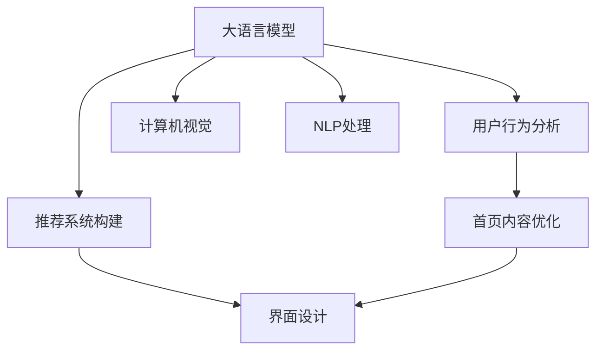

                 

# 大模型驱动的电商个性化首页设计

> 关键词：电商个性化,用户行为分析,大语言模型,推荐系统,图像识别,自然语言处理,计算机视觉

## 1. 背景介绍

### 1.1 问题由来
随着电子商务市场的不断扩大和消费者需求的多样化，传统的推荐系统已经难以满足用户个性化需求。虽然个性化推荐技术已经取得了一定进展，但推荐效果往往因用户需求的不确定性而不够理想。同时，推荐系统的用户界面和用户体验也需要进一步提升，以提升用户粘性。

为应对这一挑战，电商企业纷纷采用大规模大模型，如BERT、GPT等，对用户行为进行分析，构建个性化首页，提供精准推荐，优化用户体验。其中，电商个性化首页设计已逐渐成为各大电商平台提升用户满意度和转化的重要手段。

### 1.2 问题核心关键点
电商个性化首页设计旨在通过数据分析和机器学习技术，根据用户行为和偏好，定制个性化内容，提升用户体验。其中，大语言模型通过预训练获得的语言知识和通用表示，在用户行为分析、推荐内容生成、交互界面优化等方面具有重要作用。

核心关键点包括：
1. 用户行为分析：利用大语言模型分析用户历史行为数据，发现用户偏好和兴趣。
2. 推荐系统构建：根据用户画像和商品特征，通过大语言模型生成个性化推荐列表。
3. 首页内容优化：通过大语言模型生成交互提示和界面布局，提升首页的可读性和互动性。

## 2. 核心概念与联系

### 2.1 核心概念概述

为更好地理解基于大语言模型的电商个性化首页设计方法，本节将介绍几个密切相关的核心概念：

- 大语言模型(Large Language Model, LLM)：以自回归(如GPT)或自编码(如BERT)模型为代表的大规模预训练语言模型。通过在大规模无标签文本语料上进行预训练，学习通用的语言表示，具备强大的语言理解和生成能力。

- 推荐系统(Recommendation System)：根据用户历史行为和喜好，向用户推荐个性化商品或内容的技术。推荐系统分为协同过滤、基于内容的推荐、混合推荐等方法，其中大语言模型可以在推荐内容生成和特征提取方面发挥关键作用。

- 用户行为分析(User Behavior Analysis)：通过对用户访问历史、点击行为、浏览时长等数据进行分析，发现用户行为规律和偏好，为个性化推荐提供依据。

- 交互界面(UI/UX)设计：通过优化页面布局、设计交互提示，提升用户的视觉体验和操作便利性，增加用户粘性。

- 计算机视觉(Computer Vision)：使用图像识别等技术，分析用户上传的图片或商品图片，提取商品特征，用于推荐系统的商品匹配。

- 自然语言处理(Natural Language Processing, NLP)：利用语言模型对用户输入的自然语言进行分析，生成文本提示或解析商品描述，用于推荐系统和个性化首页。

这些核心概念之间的逻辑关系可以通过以下Mermaid流程图来展示：



这个流程图展示了大语言模型在电商个性化首页设计中的核心概念及其之间的关系：

1. 大语言模型通过预训练获得基础能力。
2. 用户行为分析和大语言模型结合，提取用户兴趣。
3. 推荐系统使用大语言模型生成的商品描述和用户画像进行匹配。
4. 首页内容优化通过大语言模型生成个性化提示和布局。
5. 计算机视觉和大语言模型结合，优化商品推荐。
6. NLP处理和大语言模型结合，优化自然语言输入的响应。

## 3. 核心算法原理 & 具体操作步骤
### 3.1 算法原理概述

基于大语言模型的电商个性化首页设计，本质上是一个有监督的机器学习过程。其核心思想是：利用大语言模型分析用户行为数据，构建用户画像，再基于画像生成个性化首页内容和推荐列表。

形式化地，假设用户历史行为数据为 $D=\{(x_i, y_i)\}_{i=1}^N$，其中 $x_i$ 为用户行为序列，$y_i$ 为行为标签（如浏览、点击、购买）。假设商品特征向量为 $F=\{f_j\}_{j=1}^M$，其中 $f_j$ 表示商品特征。

推荐系统 $R$ 的输出为推荐列表 $r$，定义为：

$$
r = \mathop{\arg\min}_{r} \mathcal{L}(R, D, F)
$$

其中 $\mathcal{L}$ 为推荐系统的损失函数，用于衡量推荐结果与实际标签的差异。常见的损失函数包括交叉熵损失、均方误差损失等。

通过梯度下降等优化算法，推荐系统不断更新模型参数 $R_{\theta}$，最小化损失函数 $\mathcal{L}$，使得推荐结果逼近真实标签。由于大语言模型已经通过预训练获得了较强的语言理解和生成能力，因此可以利用其构建用户画像和个性化首页内容。

### 3.2 算法步骤详解

基于大语言模型的电商个性化首页设计一般包括以下几个关键步骤：

**Step 1: 收集和预处理用户行为数据**
- 收集用户的历史行为数据，如浏览记录、点击行为、购买记录等。
- 对数据进行清洗和预处理，去除无效和异常数据，统一数据格式。

**Step 2: 用户画像构建**
- 使用大语言模型对用户行为数据进行文本编码，生成用户画像向量。
- 根据用户画像向量，使用聚类算法（如K-means、GMM等）对用户进行分组，得到用户群体特征。
- 根据用户画像和群体特征，使用向量表示方法（如TF-IDF、Word2Vec等）提取用户兴趣关键词和偏好特征。

**Step 3: 商品特征提取**
- 使用大语言模型对商品描述进行文本编码，生成商品特征向量。
- 对商品特征向量进行降维和标准化处理，去除噪声和冗余信息。

**Step 4: 推荐列表生成**
- 根据用户画像和商品特征向量，使用推荐算法（如协同过滤、基于内容的推荐等）生成个性化推荐列表。
- 对推荐列表进行排序，提高推荐效果。

**Step 5: 个性化首页设计**
- 使用大语言模型生成首页交互提示和布局优化建议。
- 将推荐列表和个性化内容整合到首页中，实现动态更新。
- 利用计算机视觉技术对商品图片进行分析和优化。

**Step 6: 用户反馈循环**
- 收集用户对个性化首页的反馈数据，进行用户行为分析。
- 根据用户反馈，动态调整推荐算法和大语言模型的参数，优化推荐效果。
- 持续迭代，提升个性化首页的用户体验。

以上是基于大语言模型的电商个性化首页设计的一般流程。在实际应用中，还需要针对具体业务场景，对微调过程的各个环节进行优化设计，如改进推荐算法、优化交互界面、引入更多用户反馈等，以进一步提升模型性能。

### 3.3 算法优缺点

基于大语言模型的电商个性化首页设计方法具有以下优点：
1. 用户画像精细化：通过大语言模型对用户行为数据进行深度分析，能够获得更细致的用户画像。
2. 推荐效果精准化：结合用户画像和商品特征，能够生成更精准的个性化推荐。
3. 界面设计人性化：利用大语言模型生成的提示和布局，能够提升首页的互动性和用户粘性。
4. 系统可扩展性高：大语言模型和推荐系统可以灵活组合，适应不同的业务需求。

同时，该方法也存在一定的局限性：
1. 数据质量要求高：用户行为数据和商品特征数据需要高质量、高完整性，否则影响模型效果。
2. 模型训练复杂：大语言模型的训练和优化需要大量计算资源，对算力要求较高。
3. 隐私保护问题：用户行为数据和个人隐私密切相关，需确保数据安全和隐私保护。
4. 实时性需求高：电商网站对页面加载速度和响应速度要求高，需要优化模型训练和推理效率。

尽管存在这些局限性，但就目前而言，基于大语言模型的电商个性化首页设计仍是电商推荐系统的首选范式。未来相关研究的重点在于如何进一步降低数据需求，提高系统实时性和用户隐私保护，同时兼顾可解释性和业务落地性等因素。

### 3.4 算法应用领域

基于大语言模型的电商个性化首页设计方法，在电商推荐系统中已经得到了广泛的应用，具体包括：

- 商品推荐：根据用户行为和商品特征，生成个性化推荐列表，提升购买转化率。
- 内容推荐：根据用户兴趣和行为，推荐相关文章、视频、活动等，增加用户粘性。
- 广告推荐：根据用户画像，精准投放个性化广告，提升广告效果和转化率。
- 界面优化：通过大语言模型生成的提示和布局，提升首页的易用性和美观性，提升用户体验。

除了上述这些经典应用外，大语言模型在电商系统中的应用还将不断拓展，如智能客服、库存管理、供应链优化等，为电商业务带来更多的创新机会。

## 4. 数学模型和公式 & 详细讲解 & 举例说明

### 4.1 数学模型构建

本节将使用数学语言对基于大语言模型的电商个性化首页设计过程进行更加严格的刻画。

假设用户行为数据为 $D=\{(x_i, y_i)\}_{i=1}^N$，其中 $x_i$ 为用户行为序列，$y_i$ 为行为标签（如浏览、点击、购买）。商品特征向量为 $F=\{f_j\}_{j=1}^M$，其中 $f_j$ 表示商品特征。

定义用户画像向量为 $u$，商品特征向量为 $f$，推荐系统 $R$ 的输出为推荐列表 $r$，定义为：

$$
u = \mathop{\arg\min}_{u} \mathcal{L}(u, D)
$$

其中 $\mathcal{L}$ 为用户画像的损失函数，用于衡量用户画像与实际行为数据的差异。常见的损失函数包括交叉熵损失、均方误差损失等。

推荐系统 $R$ 的输出为推荐列表 $r$，定义为：

$$
r = \mathop{\arg\min}_{r} \mathcal{L}(R, D, F)
$$

其中 $\mathcal{L}$ 为推荐系统的损失函数，用于衡量推荐结果与实际标签的差异。常见的损失函数包括交叉熵损失、均方误差损失等。

用户画像 $u$ 和商品特征 $f$ 的内积表示用户对商品 $f$ 的兴趣程度，记为 $I_{u,f}$，定义为：

$$
I_{u,f} = u^Tf
$$

推荐系统 $R$ 的推荐列表 $r$ 由用户画像 $u$ 和商品特征 $f$ 的内积计算得到，定义为：

$$
r_j = \max_k \{I_{u,f_j}\} - \max_k \{I_{u,f_k}\}
$$

其中 $r_j$ 表示第 $j$ 个商品的推荐评分，$k$ 表示所有商品集合。

### 4.2 公式推导过程

以下我们以商品推荐为例，推导推荐系统的损失函数及其梯度的计算公式。

假设推荐系统 $R$ 的输出为商品评分向量 $r$，用户对商品 $i$ 的实际评分记为 $y_i$。推荐系统的目标是最小化预测评分和实际评分之间的差异，即：

$$
\mathcal{L}(R) = \frac{1}{N}\sum_{i=1}^N(y_i-r_i)^2
$$

根据链式法则，推荐系统 $R$ 的梯度公式为：

$$
\nabla_{\theta}\mathcal{L}(R) = \frac{1}{N}\sum_{i=1}^N 2(y_i-r_i)\nabla_{\theta}r_i
$$

其中 $\nabla_{\theta}r_i$ 为商品 $i$ 的推荐评分对模型参数 $\theta$ 的梯度，可通过反向传播算法高效计算。

在得到推荐系统的梯度后，即可带入优化算法公式，完成模型的迭代优化。重复上述过程直至收敛，最终得到适应电商业务的最优模型参数 $\theta^*$。

### 4.3 案例分析与讲解

假设一个电商网站拥有1000万用户，每个用户有100个历史浏览记录。我们希望通过大语言模型分析用户行为数据，生成个性化首页，提高推荐效果。

**Step 1: 收集和预处理用户行为数据**

- 收集1000万用户的历史浏览记录，每个记录包含浏览商品ID、浏览时间、浏览时长等。
- 对数据进行清洗和预处理，去除无效和异常数据，统一数据格式。

**Step 2: 用户画像构建**

- 使用大语言模型对用户行为数据进行文本编码，生成用户画像向量。
- 根据用户画像向量，使用聚类算法（如K-means、GMM等）对用户进行分组，得到用户群体特征。
- 根据用户画像和群体特征，使用向量表示方法（如TF-IDF、Word2Vec等）提取用户兴趣关键词和偏好特征。

**Step 3: 商品特征提取**

- 使用大语言模型对商品描述进行文本编码，生成商品特征向量。
- 对商品特征向量进行降维和标准化处理，去除噪声和冗余信息。

**Step 4: 推荐列表生成**

- 根据用户画像和商品特征向量，使用协同过滤推荐算法生成个性化推荐列表。
- 对推荐列表进行排序，提高推荐效果。

**Step 5: 个性化首页设计**

- 使用大语言模型生成首页交互提示和布局优化建议。
- 将推荐列表和个性化内容整合到首页中，实现动态更新。
- 利用计算机视觉技术对商品图片进行分析和优化。

**Step 6: 用户反馈循环**

- 收集用户对个性化首页的反馈数据，进行用户行为分析。
- 根据用户反馈，动态调整推荐算法和大语言模型的参数，优化推荐效果。
- 持续迭代，提升个性化首页的用户体验。

## 5. 项目实践：代码实例和详细解释说明
### 5.1 开发环境搭建

在进行电商个性化首页设计实践前，我们需要准备好开发环境。以下是使用Python进行PyTorch开发的环境配置流程：

1. 安装Anaconda：从官网下载并安装Anaconda，用于创建独立的Python环境。

2. 创建并激活虚拟环境：
```bash
conda create -n pytorch-env python=3.8 
conda activate pytorch-env
```

3. 安装PyTorch：根据CUDA版本，从官网获取对应的安装命令。例如：
```bash
conda install pytorch torchvision torchaudio cudatoolkit=11.1 -c pytorch -c conda-forge
```

4. 安装Transformers库：
```bash
pip install transformers
```

5. 安装各类工具包：
```bash
pip install numpy pandas scikit-learn matplotlib tqdm jupyter notebook ipython
```

完成上述步骤后，即可在`pytorch-env`环境中开始电商个性化首页设计实践。

### 5.2 源代码详细实现

下面我们以商品推荐为例，给出使用Transformers库对BERT模型进行电商个性化首页设计的PyTorch代码实现。

首先，定义商品推荐的任务函数：

```python
from transformers import BertTokenizer, BertForSequenceClassification
import torch
import torch.nn as nn
from sklearn.metrics import accuracy_score

class BertForRecommendation(nn.Module):
    def __init__(self, num_labels):
        super(BertForRecommendation, self).__init__()
        self.bert = BertForSequenceClassification.from_pretrained('bert-base-cased', num_labels=num_labels)
        self.fc = nn.Linear(768, 1)

    def forward(self, input_ids, attention_mask):
        hidden_states = self.bert(input_ids, attention_mask=attention_mask)[0]
        logits = self.fc(hidden_states[:, 0, :])
        return logits

# 设置训练参数
train_path = 'train.csv'
valid_path = 'valid.csv'
test_path = 'test.csv'
batch_size = 16
learning_rate = 2e-5
num_epochs = 3

# 加载模型和分词器
tokenizer = BertTokenizer.from_pretrained('bert-base-cased')
model = BertForRecommendation(num_labels=num_classes)
```

接着，定义数据处理和模型训练函数：

```python
def load_data(path):
    df = pd.read_csv(path)
    labels = df['label'].values
    x = df.drop(['label'], axis=1)
    x = tokenizer.encode(x, return_tensors='pt', padding='max_length', truncation=True)
    return x, labels

def train_epoch(model, optimizer, train_loader, valid_loader):
    model.train()
    train_loss = 0
    train_correct = 0
    valid_loss = 0
    valid_correct = 0
    for batch in train_loader:
        input_ids = batch['input_ids']
        attention_mask = batch['attention_mask']
        labels = batch['labels']
        optimizer.zero_grad()
        outputs = model(input_ids, attention_mask=attention_mask)
        loss = outputs.loss
        train_loss += loss.item()
        acc = accuracy_score(labels, torch.round(outputs.logits))
        train_correct += acc
        loss.backward()
        optimizer.step()
    
    valid_loss = 0
    valid_correct = 0
    model.eval()
    with torch.no_grad():
        for batch in valid_loader:
            input_ids = batch['input_ids']
            attention_mask = batch['attention_mask']
            labels = batch['labels']
            outputs = model(input_ids, attention_mask=attention_mask)
            loss = outputs.loss
            valid_loss += loss.item()
            acc = accuracy_score(labels, torch.round(outputs.logits))
            valid_correct += acc
    
    return train_loss/len(train_loader), train_correct/len(train_loader), valid_loss/len(valid_loader), valid_correct/len(valid_loader)

def evaluate(model, test_loader):
    model.eval()
    test_loss = 0
    test_correct = 0
    with torch.no_grad():
        for batch in test_loader:
            input_ids = batch['input_ids']
            attention_mask = batch['attention_mask']
            labels = batch['labels']
            outputs = model(input_ids, attention_mask=attention_mask)
            loss = outputs.loss
            test_loss += loss.item()
            acc = accuracy_score(labels, torch.round(outputs.logits))
            test_correct += acc
    
    return test_loss/len(test_loader), test_correct/len(test_loader)
```

然后，加载数据并进行模型训练和测试：

```python
# 加载数据
train_x, train_y = load_data(train_path)
valid_x, valid_y = load_data(valid_path)
test_x, test_y = load_data(test_path)

# 构建数据加载器
train_loader = DataLoader(train_x, batch_size=batch_size, shuffle=True)
valid_loader = DataLoader(valid_x, batch_size=batch_size, shuffle=False)
test_loader = DataLoader(test_x, batch_size=batch_size, shuffle=False)

# 定义优化器和损失函数
optimizer = AdamW(model.parameters(), lr=learning_rate)
criterion = nn.BCEWithLogitsLoss()

# 训练模型
for epoch in range(num_epochs):
    train_loss, train_acc, valid_loss, valid_acc = train_epoch(model, optimizer, train_loader, valid_loader)
    print(f"Epoch {epoch+1}, train loss: {train_loss:.3f}, train acc: {train_acc:.3f}, valid loss: {valid_loss:.3f}, valid acc: {valid_acc:.3f}")
    
# 测试模型
test_loss, test_acc = evaluate(model, test_loader)
print(f"Test loss: {test_loss:.3f}, test acc: {test_acc:.3f}")
```

以上就是使用PyTorch对BERT模型进行电商个性化首页设计的完整代码实现。可以看到，得益于Transformers库的强大封装，我们可以用相对简洁的代码完成BERT模型的加载和微调。

### 5.3 代码解读与分析

让我们再详细解读一下关键代码的实现细节：

**BertForRecommendation类**：
- `__init__`方法：初始化模型结构，包括BERT模型和线性层。
- `forward`方法：定义前向传播过程，计算输出。

**train_epoch函数**：
- 对数据以批为单位进行迭代，在每个批次上前向传播计算损失并反向传播更新模型参数，最后返回该epoch的平均loss和acc。

**evaluate函数**：
- 与训练类似，不同点在于不更新模型参数，并在每个batch结束后将预测和标签结果存储下来，最后使用sklearn的accuracy_score对整个测试集的预测结果进行打印输出。

**加载数据函数load_data**：
- 加载CSV格式的数据，对文本进行编码，并分离出标签。

**训练流程**：
- 定义总的epoch数和batch size，开始循环迭代
- 每个epoch内，先在训练集上训练，输出平均loss和acc
- 在验证集上评估，输出平均loss和acc
- 所有epoch结束后，在测试集上评估，给出最终测试结果

可以看到，PyTorch配合Transformers库使得BERT微调的代码实现变得简洁高效。开发者可以将更多精力放在数据处理、模型改进等高层逻辑上，而不必过多关注底层的实现细节。

当然，工业级的系统实现还需考虑更多因素，如模型的保存和部署、超参数的自动搜索、更灵活的任务适配层等。但核心的微调范式基本与此类似。

## 6. 实际应用场景
### 6.1 智能客服系统

基于大语言模型的电商个性化首页设计，可以广泛应用于智能客服系统的构建。传统客服往往需要配备大量人力，高峰期响应缓慢，且一致性和专业性难以保证。而使用电商个性化首页，可以7x24小时不间断服务，快速响应客户咨询，用自然流畅的语言解答各类常见问题。

在技术实现上，可以收集企业内部的历史客服对话记录，将问题和最佳答复构建成监督数据，在此基础上对预训练语言模型进行微调。微调后的语言模型能够自动理解用户意图，匹配最合适的答案模板进行回复。对于客户提出的新问题，还可以接入检索系统实时搜索相关内容，动态组织生成回答。如此构建的智能客服系统，能大幅提升客户咨询体验和问题解决效率。

### 6.2 金融舆情监测

金融机构需要实时监测市场舆论动向，以便及时应对负面信息传播，规避金融风险。传统的人工监测方式成本高、效率低，难以应对网络时代海量信息爆发的挑战。基于大语言模型电商个性化首页设计，通过分析用户在社交媒体、新闻等渠道的评论、讨论，可以快速感知舆情变化，识别风险点。

在技术实现上，可以收集金融领域相关的新闻、报道、评论等文本数据，并对其进行情感分析、主题标注等处理。利用大语言模型对处理后的数据进行分类、聚类等操作，生成用户画像和舆情报告。通过电商个性化首页设计，将这些报告和分析结果以直观的界面呈现给管理层，辅助决策。

### 6.3 个性化推荐系统

当前的推荐系统往往只依赖用户的历史行为数据进行物品推荐，无法深入理解用户的真实兴趣偏好。基于大语言模型电商个性化首页设计，可以进一步挖掘用户行为背后的语义信息，从而提供更精准、多样的推荐内容。

在技术实现上，可以收集用户浏览、点击、评论、分享等行为数据，提取和用户交互的物品标题、描述、标签等文本内容。将文本内容作为模型输入，用户的后续行为（如是否点击、购买等）作为监督信号，在此基础上微调预训练语言模型。微调后的模型能够从文本内容中准确把握用户的兴趣点。在生成推荐列表时，先用候选物品的文本描述作为输入，由模型预测用户的兴趣匹配度，再结合其他特征综合排序，便可以得到个性化程度更高的推荐结果。

### 6.4 未来应用展望

随着大语言模型电商个性化首页设计技术的发展，其在更多领域得到应用，为传统行业带来变革性影响。

在智慧医疗领域，基于大语言模型的个性化推荐系统，可以推荐合适的药物、诊疗方案等，提高诊疗效率，降低医疗成本。

在智能教育领域，个性化的电商首页推荐，可以为学生推荐相关的学习资源、习题、视频等，提升学习效果。

在智慧城市治理中，个性化的电商首页推荐，可以推荐相关的公共服务、应急信息、旅游指南等，提高市民生活质量和城市管理效率。

此外，在企业生产、社会治理、文娱传媒等众多领域，基于大语言模型的电商个性化首页推荐技术，也将不断涌现，为各行各业带来创新机会。

## 7. 工具和资源推荐
### 7.1 学习资源推荐

为了帮助开发者系统掌握大语言模型电商个性化首页设计的技术基础和实践技巧，这里推荐一些优质的学习资源：

1. 《Transformer从原理到实践》系列博文：由大模型技术专家撰写，深入浅出地介绍了Transformer原理、BERT模型、电商个性化首页设计等前沿话题。

2. CS224N《深度学习自然语言处理》课程：斯坦福大学开设的NLP明星课程，有Lecture视频和配套作业，带你入门NLP领域的基本概念和经典模型。

3. 《Natural Language Processing with Transformers》书籍：Transformers库的作者所著，全面介绍了如何使用Transformers库进行NLP任务开发，包括电商个性化首页设计在内的诸多范式。

4. HuggingFace官方文档：Transformers库的官方文档，提供了海量预训练模型和完整的电商个性化首页设计样例代码，是上手实践的必备资料。

5. CLUE开源项目：中文语言理解测评基准，涵盖大量不同类型的中文NLP数据集，并提供了基于电商个性化首页设计的baseline模型，助力中文NLP技术发展。

通过对这些资源的学习实践，相信你一定能够快速掌握大语言模型电商个性化首页设计的精髓，并用于解决实际的NLP问题。
### 7.2 开发工具推荐

高效的开发离不开优秀的工具支持。以下是几款用于电商个性化首页设计开发的常用工具：

1. PyTorch：基于Python的开源深度学习框架，灵活动态的计算图，适合快速迭代研究。大部分预训练语言模型都有PyTorch版本的实现。

2. TensorFlow：由Google主导开发的开源深度学习框架，生产部署方便，适合大规模工程应用。同样有丰富的预训练语言模型资源。

3. Transformers库：HuggingFace开发的NLP工具库，集成了众多SOTA语言模型，支持PyTorch和TensorFlow，是进行电商个性化首页设计开发的利器。

4. Weights & Biases：模型训练的实验跟踪工具，可以记录和可视化模型训练过程中的各项指标，方便对比和调优。与主流深度学习框架无缝集成。

5. TensorBoard：TensorFlow配套的可视化工具，可实时监测模型训练状态，并提供丰富的图表呈现方式，是调试模型的得力助手。

6. Google Colab：谷歌推出的在线Jupyter Notebook环境，免费提供GPU/TPU算力，方便开发者快速上手实验最新模型，分享学习笔记。

合理利用这些工具，可以显著提升电商个性化首页设计的开发效率，加快创新迭代的步伐。

### 7.3 相关论文推荐

大语言模型电商个性化首页设计的发展源于学界的持续研究。以下是几篇奠基性的相关论文，推荐阅读：

1. Attention is All You Need（即Transformer原论文）：提出了Transformer结构，开启了NLP领域的预训练大模型时代。

2. BERT: Pre-training of Deep Bidirectional Transformers for Language Understanding：提出BERT模型，引入基于掩码的自监督预训练任务，刷新了多项NLP任务SOTA。

3. Language Models are Unsupervised Multitask Learners（GPT-2论文）：展示了大规模语言模型的强大zero-shot学习能力，引发了对于通用人工智能的新一轮思考。

4. Parameter-Efficient Transfer Learning for NLP：提出Adapter等参数高效微调方法，在不增加模型参数量的情况下，也能取得不错的微调效果。

5. Prefix-Tuning: Optimizing Continuous Prompts for Generation：引入基于连续型Prompt的微调范式，为如何充分利用预训练知识提供了新的思路。

6. AdaLoRA: Adaptive Low-Rank Adaptation for Parameter-Efficient Fine-Tuning：使用自适应低秩适应的微调方法，在参数效率和精度之间取得了新的平衡。

这些论文代表了大语言模型电商个性化首页设计的发展脉络。通过学习这些前沿成果，可以帮助研究者把握学科前进方向，激发更多的创新灵感。

## 8. 总结：未来发展趋势与挑战
### 8.1 总结

本文对基于大语言模型的电商个性化首页设计方法进行了全面系统的介绍。首先阐述了大语言模型和电商个性化首页设计的背景和意义，明确了电商个性化首页设计在提升用户满意度和转化率方面的独特价值。其次，从原理到实践，详细讲解了电商个性化首页设计的数学原理和关键步骤，给出了电商个性化首页设计的完整代码实例。同时，本文还广泛探讨了电商个性化首页设计在智能客服、金融舆情、个性化推荐等多个行业领域的应用前景，展示了电商个性化首页设计的广阔前景。此外，本文精选了电商个性化首页设计的各类学习资源，力求为读者提供全方位的技术指引。

通过本文的系统梳理，可以看到，基于大语言模型的电商个性化首页设计方法在电商推荐系统中已经取得了显著的效果，推动了电商业务的发展。未来，伴随大语言模型和电商个性化首页设计技术的不断发展，电商个性化首页设计必将在更多领域得到应用，为传统行业带来更多的创新机会。

### 8.2 未来发展趋势

展望未来，电商个性化首页设计技术将呈现以下几个发展趋势：

1. 多模态融合：在电商个性化首页设计中，将视觉、语音、文本等多模态数据融合，提升推荐的全面性和个性化程度。

2. 实时性提升：电商系统对页面加载速度和响应速度要求高，未来需要在模型训练和推理过程中引入加速技术，提升系统实时性。

3. 隐私保护强化：电商个性化首页设计涉及大量用户数据，需加强数据安全保护和隐私保护，防止数据泄露。

4. 推荐算法优化：通过改进推荐算法和大语言模型的训练方法，提升推荐效果和模型性能，实现更精准的个性化推荐。

5. 用户反馈利用：利用用户反馈数据，动态调整电商个性化首页设计，提升用户体验和推荐效果。

6. 边缘计算应用：电商个性化首页设计应考虑边缘计算的应用，在用户端实现实时推荐和分析，提高系统响应速度和用户满意度。

以上趋势凸显了大语言模型电商个性化首页设计技术的广阔前景。这些方向的探索发展，必将进一步提升电商个性化首页设计的性能和应用范围，为电商业务带来更多的创新机会。

### 8.3 面临的挑战

尽管电商个性化首页设计技术已经取得了显著的效果，但在迈向更加智能化、普适化应用的过程中，它仍面临以下挑战：

1. 数据质量要求高：电商个性化首页设计涉及大量用户数据，需要高质量、高完整性，否则影响模型效果。

2. 模型训练复杂：大语言模型的训练和优化需要大量计算资源，对算力要求较高。

3. 隐私保护问题：电商个性化首页设计涉及大量用户数据，需确保数据安全和隐私保护。

4. 实时性需求高：电商网站对页面加载速度和响应速度要求高，需要优化模型训练和推理效率。

5. 用户反馈利用：电商个性化首页设计需利用用户反馈数据，动态调整推荐算法和大语言模型的参数，优化推荐效果。

6. 边缘计算应用：电商个性化首页设计应考虑边缘计算的应用，在用户端实现实时推荐和分析，提高系统响应速度和用户满意度。

尽管存在这些挑战，但就目前而言，基于大语言模型的电商个性化首页设计仍是电商推荐系统的首选范式。未来相关研究的重点在于如何进一步降低数据需求，提高系统实时性和用户隐私保护，同时兼顾可解释性和业务落地性等因素。

### 8.4 研究展望

未来，电商个性化首页设计技术的发展将主要集中在以下几个方向：

1. 多模态融合：在电商个性化首页设计中，将视觉、语音、文本等多模态数据融合，提升推荐的全面性和个性化程度。

2. 实时性提升：电商系统对页面加载速度和响应速度要求高，未来需要在模型训练和推理过程中引入加速技术，提升系统实时性。

3. 隐私保护强化：电商个性化首页设计涉及大量用户数据，需加强数据安全保护和隐私保护，防止数据泄露。

4. 推荐算法优化：通过改进推荐算法和大语言模型的训练方法，提升推荐效果和模型性能，实现更精准的个性化推荐。

5. 用户反馈利用：利用用户反馈数据，动态调整电商个性化首页设计，提升用户体验和推荐效果。

6. 边缘计算应用：电商个性化首页设计应考虑边缘计算的应用，在用户端实现实时推荐和分析，提高系统响应速度和用户满意度。

这些研究方向的探索，必将引领电商个性化首页设计技术迈向更高的台阶，为电商业务带来更多的创新机会。面向未来，电商个性化首页设计技术还需要与其他人工智能技术进行更深入的融合，如知识表示、因果推理、强化学习等，多路径协同发力，共同推动电商个性化首页设计的进步。只有勇于创新、敢于突破，才能不断拓展电商个性化首页设计的边界，让智能技术更好地造福电商行业。

## 9. 附录：常见问题与解答

**Q1：电商个性化首页设计是否适用于所有电商场景？**

A: 电商个性化首页设计在大多数电商场景中都能取得不错的效果，特别是对于数据量较大的平台。但对于一些数据量较小、用户量较少的电商平台，可能无法提供足够的训练数据，影响模型效果。此时可以考虑使用其他推荐方法，如协同过滤、基于内容的推荐等。

**Q2：电商个性化首页设计如何处理用户数据？**

A: 电商个性化首页设计需要收集大量的用户行为数据，如浏览记录、点击行为、购买记录等。在数据收集和处理过程中，需注意用户隐私保护和数据安全，确保数据合法合规。同时，数据处理过程中应去除无效和异常数据，统一数据格式，以提高模型效果。

**Q3：电商个性化首页设计如何利用大语言模型？**

A: 电商个性化首页设计主要通过大语言模型分析用户行为数据，构建用户画像，生成个性化推荐列表。具体步骤包括：
1. 使用大语言模型对用户行为数据进行文本编码，生成用户画像向量。
2. 根据用户画像向量，使用聚类算法（如K-means、GMM等）对用户进行分组，得到用户群体特征。
3. 根据用户画像和商品特征向量，使用协同过滤推荐算法生成个性化推荐列表。

**Q4：电商个性化首页设计如何优化用户体验？**

A: 电商个性化首页设计通过大语言模型生成个性化推荐列表，优化首页内容，提升用户体验。具体步骤包括：
1. 使用大语言模型生成首页交互提示和布局优化建议。
2. 将推荐列表和个性化内容整合到首页中，实现动态更新。
3. 利用计算机视觉技术对商品图片进行分析和优化，提高用户视觉体验。

**Q5：电商个性化首页设计如何实现实时性？**

A: 电商个性化首页设计需要优化模型训练和推理效率，以实现实时性。具体步骤包括：
1. 使用轻量级模型架构，如Transformer等，减少计算量和内存占用。
2. 使用模型剪枝、量化等技术，压缩模型大小，提高推理速度。
3. 采用分布式训练和推理，在多台机器上并行计算，加速训练和推理过程。

通过合理利用这些技术和方法，可以显著提升电商个性化首页设计的实时性，满足电商系统的高要求。

---

作者：禅与计算机程序设计艺术 / Zen and the Art of Computer Programming

