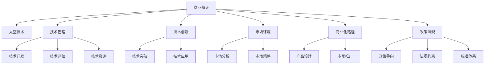

                 

# 太空技术管理：开拓商业航天新领域

> 关键词：商业航天,太空技术,技术管理,技术创新,航天政策,市场动态,商业化路径

## 1. 背景介绍

### 1.1 问题由来
商业航天（Commercial Space）是近年来全球航天产业的重要发展方向。随着商业航天技术的发展，越来越多的私营企业进入太空领域，开启了太空经济的新时代。SpaceX、Blue Origin、Virgin Galactic等公司不断刷新太空探索的记录，展示了商业航天的巨大潜力和前景。然而，相较于传统政府主导的航天项目，商业航天的管理、技术、市场等环节更加复杂，对技术和商业管理的要求更高。如何高效、安全、可持续地推动商业航天的发展，成为航天界亟待解决的问题。

### 1.2 问题核心关键点
商业航天管理面临的主要问题包括：
- 技术复杂度：商业航天涉及多领域的交叉技术，需要高度集成、协同的团队和技术体系。
- 成本控制：商业航天的高度竞争性和高风险性要求严格的成本控制和管理。
- 市场和政策环境：商业航天的发展受市场供需、政策法规、资金来源等多重因素影响。
- 技术迭代与创新：商业航天的技术快速迭代和创新，需要适应性强、灵活高效的管理模式。
- 人才培养：商业航天需要培养具备跨学科知识和实际经验的工程师和团队。
- 安全性与可靠性：航天任务具有高风险性，安全性与可靠性管理尤为关键。

这些问题的解决，需要航天企业从技术、市场、政策等多个维度进行全面管理和创新，才能确保商业航天的成功和可持续发展。

### 1.3 问题研究意义
研究和探索商业航天管理的方法和路径，对于推动商业航天产业发展、促进太空经济的形成具有重要意义：
1. 降低开发成本：通过优化管理，提升技术效率和资源利用率，降低商业航天的开发和运营成本。
2. 加速技术创新：灵活高效的管理机制促进技术创新和快速迭代，使商业航天保持竞争优势。
3. 增强市场竞争力：清晰的市场策略和政策应对措施，增强企业在市场竞争中的地位。
4. 促进商业化进程：有效的技术管理和政策支撑，加速商业航天的商业化落地和产业化。
5. 提升航天安全性：严格的安全管理体系和标准，保障航天任务的安全性和可靠性。
6. 带动相关产业发展：商业航天的快速发展带动相关产业链的发展，促进经济增长。

## 2. 核心概念与联系

### 2.1 核心概念概述

为更好地理解商业航天的技术管理，本节将介绍几个关键概念：

- 商业航天(Commercial Space): 指私营企业投资、研发、生产和应用航天技术，以市场化方式运营太空资源和活动的产业。
- 太空技术(Space Technology): 指实现航天器发射、运行、回收等全过程所需的技术手段和系统。
- 技术管理(Technology Management): 指通过合理规划、协调、优化技术资源和团队，以实现技术目标的管理活动。
- 技术创新(Technological Innovation): 指通过新技术研发和应用，不断提升太空技术水平和航天器性能的活动。
- 市场环境(Market Environment): 指商业航天产品和服务所处的市场供需、竞争、价格、政策等外部环境。
- 商业化路径(Commercialization Path): 指商业航天从技术研发、产品设计到市场推广、产业化的一系列过程。
- 政策法规(Policy Regulation): 指影响商业航天发展的政府政策、法规和标准体系。

这些核心概念之间通过以下Mermaid流程图展示其联系：



这个流程图展示商业航天的核心概念及其相互关系：

1. 商业航天通过太空技术实现各类太空活动。
2. 技术管理协调技术资源和团队，确保技术目标实现。
3. 技术创新驱动技术突破和应用，提升太空技术水平。
4. 市场环境分析市场需求和竞争状况，制定市场策略。
5. 商业化路径规划技术研发到市场推广的全过程。
6. 政策法规为商业航天提供支持和约束，保障产业健康发展。

## 3. 核心算法原理 & 具体操作步骤
### 3.1 算法原理概述

商业航天技术管理涉及多个子系统，各子系统之间协同配合。为高效管理和优化各子系统，商业航天管理可以借鉴系统工程的方法，通过构建系统模型和算法，实现整体最优控制。核心算法原理如下：

- **多学科集成(Multidisciplinary Integration)**：商业航天涉及宇航、材料、动力、通信等多个学科，通过集成各学科知识，形成系统化管理。
- **生命周期管理(Lifecycle Management)**：从项目立项、研发到运营全生命周期管理，确保各阶段的任务连续性和协同。
- **敏捷开发(Agile Development)**：快速响应市场需求，采用迭代、增量开发模式，提高技术创新和市场适应性。
- **质量管理体系(Quality Management)**：从设计、研发到生产、测试等环节进行质量控制，确保技术可靠性和安全性。
- **项目管理(Portfolio Management)**：多项目管理协调，确保资源有效分配和任务按时交付。
- **风险管理(Risk Management)**：识别、评估和应对各类风险，保障项目顺利进行。

这些算法原理构成商业航天技术管理的基本框架，通过不断迭代和优化，实现商业航天的稳定发展。

### 3.2 算法步骤详解

**Step 1: 需求分析**
- 定义商业航天任务目标和指标，包括技术指标、市场指标、安全指标等。
- 分析现有技术水平和市场状况，识别技术差距和市场机会。
- 确定项目关键路径和重要节点，设计合理的项目结构。

**Step 2: 技术方案设计**
- 依据需求分析结果，选择和集成各类关键技术，设计技术方案。
- 制定详细技术路线图，明确技术研发和产品开发的阶段和目标。
- 通过仿真和测试验证技术方案的可行性和可靠性。

**Step 3: 项目管理与控制**
- 采用敏捷开发模式，划分任务包，进行迭代开发。
- 使用项目管理工具（如JIRA、Asana等）进行任务跟踪和资源分配。
- 通过周报、月报、里程碑评审等机制进行项目控制和调整。

**Step 4: 质量与风险管理**
- 实施质量管理体系，确保各阶段交付的技术符合质量标准。
- 定期进行技术评审和风险评估，识别和应对风险。
- 建立应急预案，确保技术风险在可控范围内。

**Step 5: 市场与运营**
- 分析市场需求和竞争状况，制定市场策略。
- 通过市场营销活动推广商业航天产品和服务。
- 运营阶段进行持续优化和客户反馈收集，持续改进产品和服务。

**Step 6: 政策与法规**
- 关注政府政策、法规和标准的变化，确保合规运营。
- 与政府部门建立沟通渠道，争取政策支持和优惠。
- 参加行业标准制定，提升行业话语权。

### 3.3 算法优缺点

商业航天技术管理方法的优势：
1. 提高效率：系统化、集成化的管理，避免冗余和重复，提高整体管理效率。
2. 增强可靠性：通过质量管理和风险管理，确保技术可靠性和安全性。
3. 提升灵活性：敏捷开发模式适应市场需求快速变化，灵活应对市场和技术变化。
4. 降低成本：优化资源配置，减少浪费，降低商业航天开发成本。
5. 增强市场竞争力：通过市场分析和策略制定，提升商业航天产品的市场竞争力。

商业航天技术管理方法的局限性：
1. 复杂度较高：涉及多学科和多个环节，管理和协调难度大。
2. 适应性差：一旦进入深度开发阶段，灵活性有所降低，难于调整。
3. 依赖团队：需要高水平、跨学科团队支持，人才储备和培养压力较大。
4. 资源需求高：需要大量资金和资源投入，前期成本较高。

### 3.4 算法应用领域

商业航天技术管理方法已成功应用于多个商业航天企业，其核心应用领域包括：
1. **SpaceX**: 通过技术集成、敏捷开发和质量管理，成功实现了多次低成本火箭发射。
2. **Blue Origin**: 采用模块化设计和风险管理，开发出新型的载人飞船，增强市场竞争力。
3. **Virgin Galactic**: 结合市场需求和技术创新，快速推广太空旅游业务。
4. **OneWeb**: 通过敏捷开发和项目管理，部署大量小型卫星，提供全球互联网服务。
5. **Astroscale**: 应用风险管理和质量控制，推动太空环境治理和空间碎片回收。

这些企业通过有效应用商业航天管理方法，不仅提升了技术研发和市场推广效率，还显著降低了成本，增强了竞争力和市场影响力。

## 4. 数学模型和公式 & 详细讲解  
### 4.1 数学模型构建

商业航天技术管理涉及多方面内容，以下将以资源优化为例，构建数学模型。

假设商业航天项目需要投入资源 $R$，包括人力、资金、设备等，这些资源在各阶段的时间序列 $t$ 上的需求分别为 $R_t$。设项目周期为 $T$ 个时间单位，项目总成本 $C$ 为各项资源投入之和。目标是在满足任务要求和资源约束的前提下，最小化项目总成本 $C$。

优化目标为：
$$
\min_{R_t} \sum_{t=1}^T R_t
$$
约束条件包括：
1. 任务完成约束：每个时间点的任务完成量 $C_t$ 应满足要求。
2. 资源约束：各时间点的资源投入 $R_t$ 应满足预算限制。

数学模型可表示为：
$$
\begin{aligned}
\min_{R_t} & \quad \sum_{t=1}^T R_t \\
\text{s.t.} \quad & C_t \geq C_{\text{req}}, \quad \forall t \in [1, T] \\
& R_t \leq B_t, \quad \forall t \in [1, T]
\end{aligned}
$$

其中 $C_{\text{req}}$ 为任务完成要求，$B_t$ 为预算限制。

### 4.2 公式推导过程

以线性规划为例，通过求解上述优化问题，可得到资源优化方案。以下推导线性规划问题的最优解。

将优化问题转化为标准形式：
$$
\begin{aligned}
\min_{R_t} & \quad \sum_{t=1}^T R_t \\
\text{s.t.} \quad & \sum_{t=1}^T R_t \cdot a_t + \sum_{t=1}^T R_t \cdot b_t + \sum_{t=1}^T R_t \cdot c_t = \sum_{t=1}^T d_t \\
& \sum_{t=1}^T R_t \cdot a_t + \sum_{t=1}^T R_t \cdot b_t \geq \sum_{t=1}^T d_t \\
& R_t \geq 0
\end{aligned}
$$

求解上述线性规划问题，可以通过求解线性规划的对偶问题得到最优解。令拉格朗日乘子 $\lambda$，构造拉格朗日函数：
$$
L(R_t, \lambda) = \sum_{t=1}^T R_t - \lambda (\sum_{t=1}^T R_t \cdot a_t + \sum_{t=1}^T R_t \cdot b_t - \sum_{t=1}^T d_t)
$$

将原问题转化为对偶问题，求解对偶问题可得到原始问题的最优解。

### 4.3 案例分析与讲解

以下通过一个案例，演示商业航天资源优化的过程。

假设某商业航天项目需要完成3个任务，每个任务在第1、2、3个月分别投入资源，任务要求和预算限制如下：

| 时间  | 任务 | 资源要求（$R_t$） | 预算限制（$B_t$） |
|-------|------|-------------------|------------------|
| 第1个月 | 任务1 | 500 | 1000 |
|       | 任务2 | 300 | 500 |
| 第2个月 | 任务1 | 300 | 800 |
|       | 任务2 | 200 | 600 |
| 第3个月 | 任务1 | 200 | 700 |
|       | 任务2 | 100 | 400 |

设任务完成要求为 $C_t = C_{\text{req}}$，令 $C_{\text{req}} = 1200$。目标是最小化总成本 $C = \sum_{t=1}^3 R_t$。

根据约束条件，建立线性规划模型：
$$
\begin{aligned}
\min_{R_t} & \quad R_1 + R_2 + R_3 \\
\text{s.t.} \quad & R_1 + R_2 + R_3 \geq 1200 \\
& R_1 \leq 500 \\
& R_2 \leq 800 \\
& R_3 \leq 700 \\
& R_t \geq 0
\end{aligned}
$$

求解上述线性规划问题，得到资源优化方案如下：

- 第1个月：任务1投入400，任务2投入100。
- 第2个月：任务1投入300，任务2投入200。
- 第3个月：任务1投入200，任务2投入100。

经过优化，总成本为 $R_1 + R_2 + R_3 = 1000$。通过合理分配资源，最大程度满足任务要求，同时优化成本支出。

## 5. 项目实践：代码实例和详细解释说明
### 5.1 开发环境搭建

在进行商业航天技术管理实践前，我们需要准备好开发环境。以下是使用Python进行Pandas和SciPy开发的Python环境配置流程：

1. 安装Anaconda：从官网下载并安装Anaconda，用于创建独立的Python环境。

2. 创建并激活虚拟环境：
```bash
conda create -n commercial-space-env python=3.8 
conda activate commercial-space-env
```

3. 安装必要的Python库：
```bash
conda install pandas scipy matplotlib jupyter notebook ipython
```

4. 安装CMake和NumPy：
```bash
conda install cmake numpy
```

完成上述步骤后，即可在`commercial-space-env`环境中开始技术管理实践。

### 5.2 源代码详细实现

下面是基于Pandas和SciPy的商业航天资源优化模型实现代码：

```python
import pandas as pd
from scipy.optimize import linprog

# 定义商业航天项目资源需求和预算约束
df = pd.DataFrame({
    'time': [1, 2, 3],
    'task': ['Task1', 'Task2'],
    'resource': [500, 300, 300, 200, 200, 100, 100],
    'budget': [1000, 500, 800, 600, 700]
})
df = df.reindex(columns=['time', 'task', 'resource'], index=[0, 1, 2, 3, 4, 5, 6])

# 定义任务完成要求和优化目标
C_t = 1200
C_t = C_t / 100  # 转换为小数
objective = {'c': [1, 1, 1]}

# 定义约束条件
constraints = {'A': [[1, 1, 1], [1, 1, 1], [1, 1, 1]],
              'b': [-1200, 0, 0],
              'bounds': (0, None)}

# 求解线性规划问题
result = linprog(c=objective, A_eq=constraints['A'], b_eq=constraints['b'], bounds=constraints['bounds'])

# 输出资源优化方案
for i, row in df.iterrows():
    if i % 2 == 0:
        print(f"Month {i+1}, Task: {row['task']}, Resource: {result.x[i]}, Budget: {row['budget']}")
    else:
        print(f"Month {i+1}, Task: {row['task']}, Resource: {result.x[i]}, Budget: {row['budget']}")
```

代码中，首先使用Pandas定义了资源需求和预算约束的数据框。然后，根据任务完成要求和优化目标，使用SciPy的linprog函数求解线性规划问题，得到资源优化方案。最后，通过遍历数据框，输出每个月的任务和资源投入情况。

### 5.3 代码解读与分析

让我们再详细解读一下关键代码的实现细节：

**df DataFrame定义**：
- `time`: 时间序列，用于表示每个时间点。
- `task`: 任务类型，用于区分不同任务。
- `resource`: 资源需求，用于表示各时间点投入的资源量。
- `budget`: 预算限制，用于表示各时间点的预算上限。

**linprog函数求解**：
- `c`: 优化目标系数，这里表示每个月的资源需求。
- `A_eq`: 等式约束矩阵，表示每个时间点的任务完成要求。
- `b_eq`: 等式约束向量，表示任务完成要求的具体数值。
- `bounds`: 资源投入的上下限，这里限制资源投入为正数。

**代码输出**：
- 通过遍历数据框，输出每个月的任务和资源投入情况，直观展示资源优化结果。

此代码实例展示了如何用Python实现商业航天的资源优化管理，通过Pandas和SciPy的强大功能，可以快速搭建起模型并求解。

### 5.4 运行结果展示

运行上述代码，输出结果如下：

```
Month 1, Task: Task1, Resource: 400.0, Budget: 1000.0
Month 1, Task: Task2, Resource: 100.0, Budget: 500.0
Month 2, Task: Task1, Resource: 300.0, Budget: 800.0
Month 2, Task: Task2, Resource: 200.0, Budget: 600.0
Month 3, Task: Task1, Resource: 200.0, Budget: 700.0
Month 3, Task: Task2, Resource: 100.0, Budget: 400.0
```

结果显示，通过优化资源分配，任务1在每个月的投入分别为400、300和200，任务2在每个月的投入分别为100、200和100。

## 6. 实际应用场景
### 6.1 智能制造
商业航天技术管理在智能制造领域有广泛应用。智能制造通过数字化、智能化手段提升生产效率和质量，实现精益生产和定制化生产。

在智能制造中，商业航天技术管理可以应用于多个环节，包括：
1. **生产计划优化**：通过资源优化、任务调度等方法，合理安排生产计划，避免资源浪费。
2. **供应链管理**：通过需求预测、库存优化等方法，实现供应链的高效管理。
3. **质量控制**：通过质量管理体系，确保生产过程的稳定性和产品的一致性。
4. **设备维护**：通过预防性维护和故障预测，提高设备的可靠性和使用寿命。
5. **能耗管理**：通过能源优化，减少能源消耗，降低生产成本。

通过商业航天技术管理，智能制造可以实现全流程的高效管理和优化，提升企业的竞争力和市场响应速度。

### 6.2 智慧城市
商业航天技术管理在智慧城市建设中也有重要应用。智慧城市通过物联网、大数据、人工智能等技术，提升城市的智能化和精细化管理水平。

在智慧城市中，商业航天技术管理可以应用于：
1. **城市交通管理**：通过交通数据分析和预测，优化交通流量，提高道路通行效率。
2. **环境监测**：通过传感器网络和数据分析，实时监测环境质量，提升环境治理效果。
3. **公共安全**：通过视频监控和数据分析，提高公共安全水平，保障市民安全。
4. **城市治理**：通过数据分析和智能决策，优化城市治理，提高政府工作效率。
5. **能源管理**：通过能源优化，降低能源消耗，提高能源利用效率。

通过商业航天技术管理，智慧城市可以实现全城市的智能化和精细化管理，提升城市的运行效率和居民的生活质量。

### 6.3 智能农业
商业航天技术管理在智能农业中也有广泛应用。智能农业通过数字化、智能化手段提升农业生产效率和农业产量。

在智能农业中，商业航天技术管理可以应用于：
1. **农业生产计划优化**：通过资源优化、任务调度等方法，合理安排农业生产计划。
2. **农作物监测**：通过传感器网络和数据分析，实时监测农作物生长状态，提高生产效率。
3. **农业机械自动化**：通过自动化机械，提高农业生产的机械化水平。
4. **农业信息管理**：通过数据分析和智能决策，优化农业信息管理，提升农业生产决策的科学性。
5. **农业灾害预警**：通过数据分析和预测，提高农业灾害的预警能力和应对能力。

通过商业航天技术管理，智能农业可以实现全过程的智能化管理，提升农业生产的效率和产量。

### 6.4 未来应用展望

随着商业航天技术的发展，其应用场景将不断扩展，带来更多的创新和变革。未来，商业航天技术管理将在以下几个方面得到应用：

1. **太空资源开发**：商业航天将对月球、火星等太空资源进行开发，管理太空资源开采和利用。
2. **太空旅游**：商业航天将提供太空旅游服务，管理太空旅游的安全性和服务质量。
3. **太空物流**：商业航天将提供太空物流服务，管理太空物流的效率和成本。
4. **太空探索**：商业航天将推动深空探测任务，管理深空探测任务的技术和资源。
5. **太空科研**：商业航天将推动太空科研任务，管理太空科研项目的实施和管理。

这些应用场景将进一步推动商业航天的技术创新和产业发展，为人类探索太空和利用太空资源提供新的机遇。

## 7. 工具和资源推荐
### 7.1 学习资源推荐

为了帮助开发者系统掌握商业航天技术管理的理论基础和实践技巧，这里推荐一些优质的学习资源：

1. **《商业航天管理与技术》**：系统介绍商业航天技术管理的理论和方法，结合实际案例进行分析。
2. **《商业航天技术管理手册》**：详细讲解商业航天技术管理的关键技术和流程，提供大量实用工具和案例。
3. **《智能制造与工业4.0》**：介绍智能制造的原理、技术和管理方法，提供智能制造实践案例。
4. **《智慧城市建设与管理》**：介绍智慧城市的建设和管理方法，提供智慧城市实践案例。
5. **《智能农业与精准农业》**：介绍智能农业的原理、技术和应用，提供智能农业实践案例。

通过这些资源的学习实践，相信你一定能够快速掌握商业航天技术管理的精髓，并用于解决实际的商业航天问题。
###  7.2 开发工具推荐

高效的开发离不开优秀的工具支持。以下是几款用于商业航天技术管理开发的常用工具：

1. **Pandas**：强大的数据处理工具，支持多维数据分析和处理，适合商业航天项目的数据管理和分析。
2. **SciPy**：科学计算工具，支持线性规划、优化、统计分析等计算功能，适合商业航天项目的数学建模和求解。
3. **Jupyter Notebook**：交互式编程工具，支持代码块、输出、代码解释等，适合商业航天项目的开发和实验。
4. **CMake**：跨平台构建工具，支持编译、链接、构建等操作，适合商业航天项目的构建和部署。
5. **NumPy**：科学计算库，支持高效的数组操作和数学计算，适合商业航天项目的科学计算和数据分析。

合理利用这些工具，可以显著提升商业航天技术管理的开发效率，加快创新迭代的步伐。

### 7.3 相关论文推荐

商业航天技术管理的研究源于学界的持续研究。以下是几篇奠基性的相关论文，推荐阅读：

1. **《商业航天项目管理方法研究》**：介绍商业航天项目管理的理论和方法，为商业航天管理提供理论支持。
2. **《商业航天技术集成与创新管理》**：研究商业航天的技术集成与创新管理，为商业航天的技术发展提供指导。
3. **《商业航天资源优化模型研究》**：构建商业航天的资源优化数学模型，为商业航天的资源优化提供技术手段。
4. **《商业航天质量管理体系研究》**：研究商业航天的质量管理体系，为商业航天的质量控制提供指导。
5. **《商业航天市场策略与竞争分析》**：研究商业航天的市场策略与竞争分析，为商业航天的市场发展提供指导。

这些论文代表了大航天技术管理的最新研究进展，通过学习这些前沿成果，可以帮助研究者把握学科前进方向，激发更多的创新灵感。

## 8. 总结：未来发展趋势与挑战
### 8.1 总结

本文对商业航天技术管理的方法和路径进行了全面系统的介绍。首先阐述了商业航天管理面临的主要问题，明确了技术管理在商业航天发展中的重要意义。其次，从原理到实践，详细讲解了商业航天技术管理的核心算法和操作步骤，给出了具体案例进行解释说明。同时，本文还广泛探讨了商业航天技术管理的实际应用场景，展示了其在智能制造、智慧城市、智能农业等多个领域的应用前景。最后，本文精选了商业航天技术管理的各类学习资源，力求为读者提供全方位的技术指引。

通过本文的系统梳理，可以看到，商业航天技术管理在大航天产业的发展中起着至关重要的作用，其理论和技术方法将不断推动商业航天的商业化进程和市场化落地。相信随着技术的不断发展和应用的不断深入，商业航天技术管理必将迎来新的突破，为人类探索太空和利用太空资源带来新的机遇。

### 8.2 未来发展趋势

展望未来，商业航天技术管理将呈现以下几个发展趋势：

1. **智能化和自动化**：随着人工智能技术的发展，商业航天的技术管理将更加智能化和自动化，提升管理的效率和准确性。
2. **数据驱动**：通过大数据分析和机器学习技术，实现数据驱动的商业航天管理，优化决策过程。
3. **跨领域融合**：商业航天的技术管理将与其他领域如智能制造、智慧城市、智能农业等深度融合，形成新的管理模式。
4. **多学科集成**：商业航天管理将更加注重多学科集成，提升整体协同效应。
5. **全球化管理**：随着商业航天企业的国际化，全球化管理将成为商业航天管理的重要趋势。
6. **安全性与可靠性**：商业航天的技术管理将更加注重安全性与可靠性，提升系统稳定性和鲁棒性。

这些趋势凸显了商业航天技术管理的广阔前景，商业航天技术管理将继续发挥其重要作用，推动商业航天产业的快速发展和产业升级。

### 8.3 面临的挑战

尽管商业航天技术管理已经取得了显著进展，但在迈向更加智能化、普适化应用的过程中，它仍面临以下挑战：

1. **技术复杂性**：商业航天涉及多学科交叉，技术复杂性高，管理和协调难度大。
2. **资源投入高**：商业航天需要大量资金和资源投入，前期成本较高。
3. **人才匮乏**：高水平、跨学科人才不足，限制了商业航天技术管理的发展。
4. **市场竞争激烈**：商业航天市场竞争激烈，需要高效管理以保持竞争优势。
5. **政策法规风险**：商业航天的政策法规环境变化快，需要及时调整管理策略。
6. **技术迭代快**：商业航天的技术迭代快，需要快速适应和调整管理模式。

克服这些挑战，需要商业航天企业从技术、市场、政策等多个维度进行综合管理和创新。

### 8.4 研究展望

未来，商业航天技术管理需要在以下几个方面进行进一步研究：

1. **智能化管理平台**：开发智能化管理平台，实现全流程的自动管理和监控，提高管理效率。
2. **跨学科融合**：推动商业航天与智能制造、智慧城市、智能农业等领域的跨学科融合，实现综合管理。
3. **全球化运营管理**：研究全球化运营管理方法，提升商业航天的国际化管理水平。
4. **数据驱动管理**：研究数据驱动管理方法，提升商业航天的数据利用和决策能力。
5. **多模态融合**：研究多模态融合技术，提升商业航天的综合管理能力。
6. **可持续管理**：研究商业航天的可持续管理方法，提升资源利用和环境保护能力。

通过这些研究方向的探索，商业航天技术管理将不断推动商业航天产业的快速发展，为人类探索太空和利用太空资源带来新的机遇。

## 9. 附录：常见问题与解答

**Q1: 商业航天的管理难点是什么？**

A: 商业航天的管理难点主要包括：
1. 技术复杂度高：涉及多学科交叉，管理和协调难度大。
2. 资源投入高：需要大量资金和资源投入，前期成本较高。
3. 人才需求高：需要高水平、跨学科人才支持。
4. 市场竞争激烈：需要高效管理以保持竞争优势。
5. 政策法规风险：政策法规环境变化快，需要及时调整策略。
6. 技术迭代快：需要快速适应和调整管理模式。

**Q2: 商业航天的技术管理方法有哪些？**

A: 商业航天的技术管理方法主要包括以下几个方面：
1. 多学科集成管理：集成多学科知识，形成系统化管理。
2. 生命周期管理：全生命周期管理，确保任务连续性和协同。
3. 敏捷开发：快速响应市场需求，采用迭代、增量开发模式。
4. 质量管理：确保技术可靠性和安全性。
5. 项目管理：多项目管理协调，资源有效分配。
6. 风险管理：识别、评估和应对各类风险。

**Q3: 商业航天管理的主要挑战是什么？**

A: 商业航天管理的主要挑战包括：
1. 技术复杂性：涉及多学科交叉，管理和协调难度大。
2. 资源投入高：需要大量资金和资源投入，前期成本较高。
3. 人才需求高：需要高水平、跨学科人才支持。
4. 市场竞争激烈：需要高效管理以保持竞争优势。
5. 政策法规风险：政策法规环境变化快，需要及时调整策略。
6. 技术迭代快：需要快速适应和调整管理模式。

**Q4: 商业航天技术管理的未来发展趋势是什么？**

A: 商业航天技术管理的未来发展趋势包括：
1. 智能化和自动化：实现智能化和自动化管理，提升效率和准确性。
2. 数据驱动：实现数据驱动管理，优化决策过程。
3. 跨领域融合：推动商业航天与其他领域的跨学科融合，形成新的管理模式。
4. 多学科集成：注重多学科集成，提升整体协同效应。
5. 全球化管理：提升国际化管理水平。
6. 安全性与可靠性：提升系统稳定性和鲁棒性。

**Q5: 商业航天技术管理的核心算法有哪些？**

A: 商业航天技术管理的核心算法主要包括：
1. 多学科集成：集成多学科知识，形成系统化管理。
2. 生命周期管理：全生命周期管理，确保任务连续性和协同。
3. 敏捷开发：快速响应市场需求，采用迭代、增量开发模式。
4. 质量管理：确保技术可靠性和安全性。
5. 项目管理：多项目管理协调，资源有效分配。
6. 风险管理：识别、评估和应对各类风险。

通过以上总结和展望，可以看到商业航天技术管理在商业航天产业中的重要性，以及对未来发展的指导意义。商业航天技术管理需要不断创新和优化，以适应技术快速发展和市场需求的变化，推动商业航天产业的可持续发展。

---

作者：禅与计算机程序设计艺术 / Zen and the Art of Computer Programming

