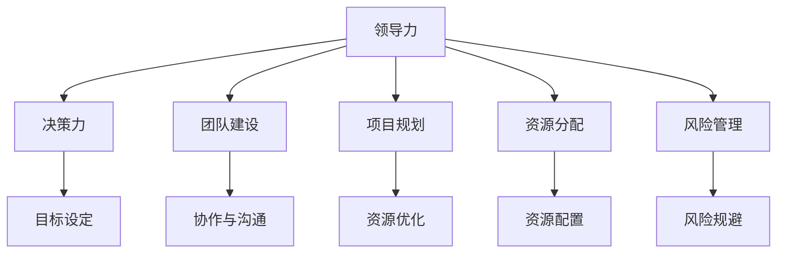

                 

# 如何从经典案例中学习管理智慧

> 关键词：管理智慧,经典案例,领导力,决策力,团队建设,项目规划,资源分配,风险管理

## 1. 背景介绍

### 1.1 问题由来

管理智慧是现代组织和领导者不可或缺的核心能力之一。无论是在企业界、非营利组织还是政府机构中，成功的管理者都必须具备高效的决策力、卓越的领导力和精妙的团队管理技巧。然而，管理的复杂性和多变性使得许多领导者常常难以应对各种挑战，容易陷入困惑和迷茫之中。

为了帮助更多的管理者提升管理能力，本章将通过经典的管理案例，深入分析其中的管理智慧，揭示背后的原理和实践技巧，以期为读者提供有益的启示和借鉴。

### 1.2 问题核心关键点

管理智慧的核心在于如何通过学习经典案例，提取其中的管理精华，应用于现实管理场景，提高个人和组织的管理水平。经典案例通常包含了丰富的管理情境、角色和决策过程，能够引发深层次的思考和反思。

具体来说，这些案例涉及以下管理关键点：

1. **领导力**：如何通过有效的领导，激励和引导团队，提升团队凝聚力和执行力。
2. **决策力**：如何基于数据分析和信息，做出科学合理的决策，避免决策失误。
3. **团队建设**：如何构建高效团队，实现成员间的协作与沟通，提升团队整体绩效。
4. **项目规划**：如何制定详细、可行的项目计划，合理分配资源，确保项目按时完成。
5. **资源分配**：如何在资源有限的情况下，做出最优的资源配置，实现组织目标。
6. **风险管理**：如何识别和应对潜在风险，确保项目和组织的稳定性。

## 2. 核心概念与联系

### 2.1 核心概念概述

为了更好地理解管理智慧的核心概念，本节将介绍几个关键的管理学理论及其相互联系：

- **领导力(Leadership)**：指领导者影响和激励下属，实现组织目标的能力。主要包括魅力型领导、变革型领导、服务型领导等。
- **决策力(Decision-Making)**：指领导者基于信息和分析，做出科学合理决策的过程。包括定性分析、定量分析、风险评估等。
- **团队建设(Team Building)**：指构建高效、协作的团队，提升团队成员的满意度和归属感。
- **项目规划(Project Planning)**：指制定详细、可行的项目计划，合理分配资源，确保项目按时完成。
- **资源分配(Resource Allocation)**：指在有限资源下，做出最优的资源配置，以实现组织目标。
- **风险管理(Risk Management)**：指识别、评估和应对潜在风险，确保组织和项目的稳定性。

这些核心概念之间的逻辑关系可以通过以下Mermaid流程图来展示：



这个流程图展示了大语言模型的核心概念及其之间的关系：

1. 领导力通过决策力实现目标设定。
2. 团队建设、项目规划、资源分配和风险管理相互支持，共同构成组织管理的各个方面。
3. 领导力和决策力是推动其他管理活动的基础，而团队建设、项目规划、资源分配和风险管理是实现组织目标的关键手段。

## 3. 核心算法原理 & 具体操作步骤
### 3.1 算法原理概述

从经典案例中学习管理智慧，本质上是一种知识迁移和应用的过程。通过对不同管理情境下的经典案例进行深入分析，提取其中的管理智慧，并将其应用于实际的管理实践中。

这种知识迁移和应用的过程，可以通过以下步骤进行：

1. **案例研究**：详细分析经典案例中的管理情境、决策过程和结果，识别其中的管理智慧。
2. **问题映射**：将管理智慧映射到现实管理场景，识别相似或相关的管理问题。
3. **策略设计**：基于管理智慧，设计出相应的管理策略和行动方案。
4. **实践验证**：在实际管理过程中，实施管理策略，并根据结果进行持续调整和优化。

### 3.2 算法步骤详解

以下是详细的算法步骤：

**Step 1: 案例选择与分析**
- 选择具有代表性的经典管理案例，如“苹果公司的乔布斯”、“华为的任正非”等。
- 详细阅读和分析案例，注意其中的管理情境、角色和决策过程。
- 识别其中的管理智慧，包括领导风格、决策方法、团队管理技巧等。

**Step 2: 问题映射与情境分析**
- 将管理智慧与现实管理情境进行映射，识别其中的相似或相关管理问题。
- 分析现实管理场景中的关键因素，如组织规模、行业特性、团队构成等。
- 评估管理智慧在不同情境下的适用性，制定相应的调整策略。

**Step 3: 策略设计与实践**
- 基于管理智慧，设计出相应的管理策略和行动方案。
- 在实际管理过程中，实施这些策略，并根据实际情况进行持续优化。
- 记录和分析管理效果，评估策略的有效性，并进一步优化。

**Step 4: 反馈与改进**
- 定期收集员工反馈，评估管理效果，识别存在的问题和改进机会。
- 根据反馈和改进需求，调整管理策略，并持续优化管理实践。
- 建立持续改进机制，形成闭环管理。

### 3.3 算法优缺点

从经典案例中学习管理智慧的方法，具有以下优点：

1. **深度反思**：通过对经典案例的深入分析，引发对管理实践的深刻反思，提升管理者的洞察力。
2. **实践指导**：经典案例中的管理智慧可以直接应用于现实管理场景，提供具体的实践指导。
3. **经验传承**：通过案例研究，积累和管理实践的经验，形成组织知识库，促进经验传承。

同时，这种方法也存在以下局限性：

1. **情境差异**：经典案例通常涉及特定的情境和背景，不一定完全适用于所有现实管理场景。
2. **主观解读**：对经典案例的解读和应用具有一定的主观性，不同管理者可能有不同的理解。
3. **单一视角**：经典案例可能过于聚焦于某些管理情境或问题，缺乏全面性。

## 4. 数学模型和公式 & 详细讲解 & 举例说明
### 4.1 数学模型构建

管理智慧的计算模型涉及多维度、多层次的管理因素，如领导力、决策力、团队建设、项目规划、资源分配和风险管理。以下是基于这些因素构建的管理智慧数学模型：

$$
\text{Management Wisdom} = f(\text{Leadership}, \text{Decision-Making}, \text{Team Building}, \text{Project Planning}, \text{Resource Allocation}, \text{Risk Management})
$$

其中，$f$表示多因素的综合映射函数，不同管理情境下权重不同，需要通过实际案例进行参数估计。

### 4.2 公式推导过程

以项目规划为例，公式推导如下：

设项目总工期为$T$，任务数量为$N$，任务完成时间分别为$t_1, t_2, ..., t_N$，任务权重分别为$w_1, w_2, ..., w_N$，则项目总完成时间为：

$$
T = \sum_{i=1}^{N} w_i t_i
$$

如果资源有限，设每种资源的供应量为$R$，任务资源需求分别为$r_1, r_2, ..., r_N$，则资源分配策略为：

$$
\text{Resource Allocation} = \arg\min_{t_i} \sum_{i=1}^{N} w_i (t_i - r_i)
$$

其中，$w_i$为任务权重，$r_i$为任务资源需求。

### 4.3 案例分析与讲解

以华为的任正非为例，分析其在团队建设和管理中的管理智慧。

任正非通过以下策略提升团队凝聚力和执行力：

1. **赋权授权**：鼓励员工自主创新，赋予基层员工更大的决策权，激发员工的积极性和创造力。
2. **共同愿景**：设立共同的企业愿景，将员工与企业目标紧密结合，形成高度共识。
3. **轮岗交流**：定期进行员工轮岗和交流，促进知识共享和跨部门合作，提升整体能力。
4. **文化建设**：倡导“华为文化”，强调诚信、团队精神和艰苦奋斗，营造积极的组织氛围。
5. **员工关怀**：关注员工成长，提供全面的职业发展路径，提高员工归属感和满意度。

这些管理策略展示了任正非在团队建设方面的智慧，值得其他管理者借鉴和应用。

## 5. 项目实践：代码实例和详细解释说明
### 5.1 开发环境搭建

在进行管理智慧实践时，通常需要使用以下开发工具和环境：

1. **项目管理工具**：如JIRA、Trello等，用于任务分配和进度跟踪。
2. **数据分析工具**：如Excel、Python等，用于数据分析和决策支持。
3. **沟通协作工具**：如Slack、微信等，用于团队沟通和信息共享。
4. **资源管理工具**：如Toggl、HackerRank等，用于资源跟踪和配置。

### 5.2 源代码详细实现

以下是一个简单的项目管理工具JIRA的Python API示例，用于获取项目任务和分配任务：

```python
from jira import JIRA

jira = JIRA('https://jira.example.com', username='username', password='password')
project_key = 'PROJ-1'

tasks = jira.search_issues('project=' + project_key)
for task in tasks:
    print(task.key + ': ' + task.fields.summary)
```

该代码使用了JIRA的Python API，获取项目PROJ-1的任务列表，并打印出每个任务的关键和总结。

### 5.3 代码解读与分析

上述代码通过JIRA的Python API，实现了对项目管理任务的获取和展示。通过类似的方法，可以进一步实现任务的分配、进度跟踪、状态更新等管理功能。

## 6. 实际应用场景

### 6.1 项目管理

管理智慧在项目管理中具有重要应用。通过学习和应用经典案例中的项目管理经验，管理者可以更好地规划和管理项目，确保项目按时完成，实现预期目标。

例如，IBM的案例展示了项目管理中的关键因素，如需求管理、进度控制和风险评估。通过借鉴IBM的项目管理经验，许多企业能够更好地应对项目复杂性，提升项目成功率。

### 6.2 人力资源管理

人力资源管理是管理智慧的重要组成部分。通过学习和应用经典案例中的人力资源管理策略，管理者可以更有效地招聘、培训和激励员工，提升员工满意度和组织绩效。

例如，谷歌的案例展示了人力资源管理中的关键要素，如人才发展、薪酬体系和文化建设。通过借鉴谷歌的人力资源管理经验，许多企业能够更好地吸引和留住人才，实现人才的最大化利用。

### 6.3 财务管理

财务管理也是管理智慧的重要应用领域。通过学习和应用经典案例中的财务管理策略，管理者可以更有效地进行成本控制、投资决策和风险管理，提升企业财务健康度。

例如，宝洁的案例展示了财务管理中的关键要素，如预算控制、成本分析和现金流管理。通过借鉴宝洁的财务管理经验，许多企业能够更好地控制成本、提升收益，实现财务目标。

### 6.4 未来应用展望

随着管理智慧研究的不断深入，其在更多领域的应用前景将更加广阔。未来，管理智慧将进一步与人工智能、大数据等技术结合，提升管理决策的科学性和智能化水平。

例如，通过大数据分析，管理者可以更全面地了解组织和员工情况，制定更科学的决策。通过人工智能，管理者可以更高效地进行资源配置和风险评估，提升管理效率。

## 7. 工具和资源推荐
### 7.1 学习资源推荐

为了帮助管理者系统掌握管理智慧的理论基础和实践技巧，这里推荐一些优质的学习资源：

1. **《管理学》系列书籍**：如《管理学原理》、《管理案例分析》等，系统介绍了管理学的基本理论和管理实践。
2. **管理类在线课程**：如Coursera、edX等平台上的管理类课程，提供系统化的管理知识学习。
3. **管理咨询公司报告**：如麦肯锡、波士顿咨询等公司的管理咨询报告，提供了丰富的管理案例和研究洞察。
4. **管理期刊和杂志**：如Harvard Business Review、MIT Sloan Management Review等，提供了前沿的管理理论和实践经验。
5. **管理论坛和社区**：如LinkedIn Management，提供了管理者交流和学习的环境。

通过这些资源的学习实践，相信管理者一定能够掌握管理智慧的核心要义，并将其应用于实际管理中。

### 7.2 开发工具推荐

高效的开发和管理工具对于提升管理智慧的实践效果至关重要。以下是几款常用的工具：

1. **项目管理工具**：如JIRA、Trello、Asana等，帮助管理者进行任务分配、进度跟踪和沟通协作。
2. **数据分析工具**：如Excel、Python、R等，帮助管理者进行数据分析和决策支持。
3. **沟通协作工具**：如Slack、微信、钉钉等，帮助管理者进行高效沟通和信息共享。
4. **资源管理工具**：如Toggl、HackerRank、Asana等，帮助管理者进行资源跟踪和配置。

这些工具的应用，可以显著提升管理效率和管理效果，助力管理者更好地实践管理智慧。

### 7.3 相关论文推荐

管理智慧的研究涉及众多领域，以下是几篇重要的论文，推荐阅读：

1. **《管理学原理》（Principles of Management）**：作者Larry E. Collins，系统介绍了管理学的基本原理和管理实践。
2. **《管理学理论的新趋势》（New Trends in Management Theory）**：作者James L. Thompson，分析了管理学理论的新趋势和发展方向。
3. **《组织行为学》（Organizational Behavior）**：作者Robert E. Katz，介绍了组织行为学中的核心概念和管理实践。
4. **《人力资源管理》（Human Resource Management）**：作者Wayne Cascio，提供了人力资源管理的系统性知识。
5. **《财务管理》（Financial Management）**：作者Eugene F. Brigham和Joel F. Houston，介绍了财务管理的核心概念和实践方法。

这些论文代表了大语言模型微调技术的发展脉络。通过学习这些前沿成果，可以帮助管理者把握学科前进方向，激发更多的创新灵感。

## 8. 总结：未来发展趋势与挑战
### 8.1 总结

本文通过经典案例，深入探讨了管理智慧的核心概念及其相互联系，揭示了其中的管理精髓。通过对这些经典案例的深入分析，管理者可以更好地理解和应用管理智慧，提升个人和组织的领导力、决策力和团队建设能力。

管理智慧的学习和实践，将有助于管理者应对复杂多变的管理情境，提升组织绩效和员工满意度，实现组织目标。通过不断的学习和实践，管理者可以逐步积累和传承管理经验，形成组织知识库，推动组织持续发展和进步。

### 8.2 未来发展趋势

展望未来，管理智慧将呈现以下几个发展趋势：

1. **跨学科融合**：管理智慧将与人工智能、大数据、区块链等新兴技术深度融合，提升管理决策的科学性和智能化水平。
2. **持续学习**：通过持续学习和持续改进，管理智慧将不断优化和升级，适应不断变化的管理情境。
3. **全球化管理**：随着全球化进程加速，管理智慧将更加注重跨文化管理和全球化视野。
4. **社会责任**：管理智慧将更加注重社会责任和可持续发展，提升组织的社会价值。
5. **个性化管理**：通过大数据分析，管理智慧将更加注重个性化管理，实现差异化的管理策略。

这些趋势凸显了管理智慧的广阔前景，为管理者提供了更多创新和突破的方向。

### 8.3 面临的挑战

尽管管理智慧的应用前景广阔，但在实践中仍面临诸多挑战：

1. **复杂多变**：管理情境复杂多变，管理者需要具备较高的适应能力和灵活性。
2. **资源有限**：管理资源有限，管理者需要优化资源配置，提高管理效率。
3. **人员差异**：团队成员背景不同，管理者需要具备有效的沟通和协作技巧。
4. **变化速度**：管理环境变化速度快，管理者需要快速应对和调整策略。
5. **数据驱动**：管理决策需要基于数据和分析，管理者需要具备数据分析能力。

管理者需要在实践中不断总结和改进，克服这些挑战，提升管理智慧的实践效果。

### 8.4 研究展望

未来的管理智慧研究需要在以下几个方面进行进一步探索：

1. **大数据与人工智能**：将大数据和人工智能技术引入管理决策，提升管理智慧的科学性和智能化水平。
2. **跨文化管理**：研究跨文化管理的理论和方法，提升全球化管理能力。
3. **社会责任与可持续发展**：研究社会责任和可持续发展的管理策略，提升组织的社会价值。
4. **个性化管理**：研究个性化管理的理论和方法，实现差异化的管理策略。
5. **创新与创业**：研究创新与创业管理的理论和方法，推动组织创新和变革。

这些研究方向的探索，将推动管理智慧的不断进步，为管理实践提供更全面、更系统、更科学的指导。

## 9. 附录：常见问题与解答

**Q1：如何选择经典案例进行学习？**

A: 选择经典案例时，应注重其代表性、普遍性和可操作性。可以从经典的管理书籍、管理案例集、管理咨询报告等来源选择案例，并结合自身管理情境进行分析和应用。

**Q2：如何评估管理智慧的实践效果？**

A: 评估管理智慧的实践效果，可以通过以下几个指标进行：员工满意度、组织绩效、项目成功率、财务健康度等。通过实际数据和反馈，评估管理策略的效果，并不断调整和优化。

**Q3：如何处理管理智慧中的复杂情境？**

A: 处理复杂情境时，应注重多维度、多层次的管理分析，制定综合性的管理策略。可以通过管理模拟、管理研讨会等方式，探讨和解决复杂管理问题。

**Q4：如何提升管理智慧的持续改进能力？**

A: 提升管理智慧的持续改进能力，可以通过以下几个途径：持续学习和培训、建立反馈机制、定期进行管理评估、建立持续改进流程等。通过不断的学习和改进，管理者可以不断提升管理智慧的水平。

**Q5：如何在跨文化管理中应用管理智慧？**

A: 在跨文化管理中应用管理智慧，应注重文化差异的理解和尊重，制定跨文化管理策略，提升全球化管理能力。可以通过文化培训、跨文化团队建设等方式，促进文化融合和管理协同。

通过上述问题的解答，相信读者能够更好地理解和应用管理智慧，提升管理实践的效果。

---

作者：禅与计算机程序设计艺术 / Zen and the Art of Computer Programming

