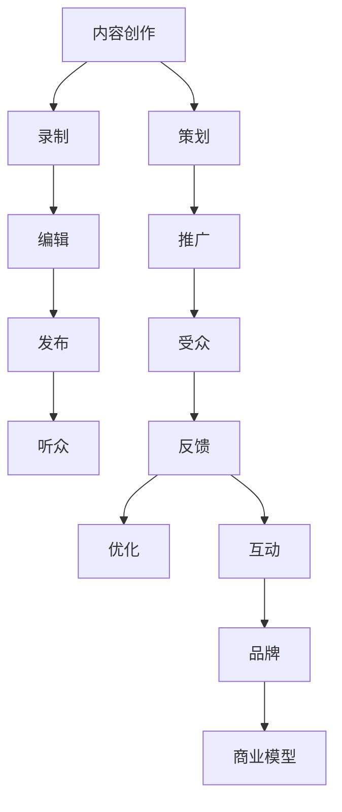

                 

# 如何利用Podcast进行技术知识付费

> 关键词：Podcast, 技术知识付费, 内容创作, 商业模型, 用户互动

## 1. 背景介绍

在数字化时代，知识付费已成为一种流行的消费方式。许多科技专家和创业者通过各种形式的知识传播平台，向用户提供高质量的专业内容，实现了个人品牌价值和商业价值的双赢。然而，现有的知识付费形式，如订阅制、单次付费等，存在着内容同质化严重、用户体验单一、互动性不足等问题。在此背景下，利用Podcast进行技术知识付费，为知识创作者和用户提供了一种全新的互动模式，展示了无限的可能性。

Podcast，即播客，是一种在线音频内容的形式，通常通过RSS（Really Simple Syndication）或其他方式进行分发，用户可以随时随地通过移动设备收听。Podcast以其独特的社交性、互动性和传播力，迅速在技术社区中崭露头角。不同于传统的课程或博客，Podcast将单向的知识传播转变为双向的互动交流，通过声音、文字、图片、视频等多种形式，实现了知识传播与商业变现的深度融合。

## 2. 核心概念与联系

### 2.1 核心概念概述

为更好地理解利用Podcast进行技术知识付费，本节将介绍几个关键概念：

- **Podcast**：基于网络技术实现的音频内容分发平台。用户可以通过订阅、搜索、评论等方式与内容创作者进行互动。
- **技术知识付费**：指通过技术手段向用户提供有偿的知识服务，以获取价值回报的一种商业模式。
- **内容创作**：指知识创作者为Podcast平台制作和发布音频内容的过程。包括策划、录制、编辑、发布等环节。
- **商业模型**：指Podcast平台如何通过内容付费、广告、赞助、会员制等手段实现商业盈利的过程。
- **用户互动**：指Podcast平台提供的各种互动功能，如评论、分享、讨论等，增强用户参与感。
- **品牌效应**：指内容创作者通过Podcast平台建立专业形象，提升品牌知名度和影响力。

这些概念之间相互关联，共同构成了一个完整的利用Podcast进行技术知识付费的生态系统。

### 2.2 核心概念原理和架构的 Mermaid 流程图(Mermaid 流程节点中不要有括号、逗号等特殊字符)



以上流程图展示了Podcast内容创作与用户互动的全流程：

1. **内容创作**：知识创作者根据市场需求策划内容主题，录制音频，并进行后期编辑处理。
2. **发布**：内容通过Podcast平台发布，用户可以通过订阅、搜索等方式获取。
3. **听众互动**：用户收听Podcast后，通过评论、点赞、分享等互动方式参与讨论。
4. **反馈优化**：创作者根据用户反馈，对内容进行调整和优化。
5. **互动和品牌**：创作者与听众之间的互动，增加了内容的传播力和品牌效应。
6. **商业模型**：通过内容付费、广告、赞助、会员制等手段实现商业盈利。

## 3. 核心算法原理 & 具体操作步骤

### 3.1 算法原理概述

利用Podcast进行技术知识付费，其核心在于通过音频内容传递专业知识和经验，同时利用用户互动增强内容的传播力和影响力。其基本原理如下：

- **内容价值传递**：创作者通过精炼、深入的音频内容，向听众传递专业知识和经验，满足听众的知识需求。
- **互动交流增强**：利用Podcast的互动功能，如评论、讨论、直播等，增强创作者与听众之间的交流，提升听众的参与感和忠诚度。
- **商业变现渠道**：通过订阅费、赞助费、广告费等多种渠道，实现知识付费的商业变现。

### 3.2 算法步骤详解

利用Podcast进行技术知识付费主要包括以下几个关键步骤：

**Step 1: 策划和选题**

知识创作者应根据市场需求和自身专长，策划和选择适合的主题。通过调研用户反馈，了解他们的痛点和需求，确保内容具有针对性和实用性。

**Step 2: 录制和编辑**

录制音频内容是核心环节，创作者需使用专业的录音设备和编辑软件，确保音质和录制效果。编辑阶段包括剪辑、降噪、混音等，提升音频的质量和可听性。

**Step 3: 发布和推广**

通过Podcast平台发布音频内容，并利用SEO、社交媒体等手段进行推广。提高内容的曝光率和关注度，吸引更多听众订阅和收听。

**Step 4: 互动和反馈**

利用Podcast平台的互动功能，如评论、讨论、直播等，与听众进行互动。根据听众的反馈和建议，不断优化和调整内容。

**Step 5: 商业变现**

通过内容付费、广告、赞助、会员制等手段实现商业盈利。具体包括：

- **内容付费**：听众可以支付一定费用，获取独家音频内容。
- **广告费**：在音频内容中加入广告，通过广告收入分成。
- **赞助**：获取企业的赞助，提供商业合作机会。
- **会员制**：提供会员特权，如优先访问、专属内容等。

### 3.3 算法优缺点

利用Podcast进行技术知识付费具有以下优点：

- **形式多样**：音频形式使得听众可以随时随地收听，满足不同场景下的需求。
- **互动性强**：通过评论、讨论等互动功能，增强了创作者与听众之间的交流。
- **传播力强**：利用社交媒体和SEO等手段，快速提高内容的曝光率和关注度。
- **商业变现多样化**：内容付费、广告、赞助、会员制等手段，提供多种盈利模式。

同时，Podcast知识付费也存在以下缺点：

- **音频制作成本高**：专业录音设备和软件成本较高，创作者需投入较大的前期准备。
- **内容质量要求高**：音频内容需精炼、深入，创作者需具备较高的专业水平。
- **互动效果受限**：相较于视频内容，音频形式的互动功能较为有限。
- **商业变现门槛高**：对创作者的知名度和影响力要求较高，难以在短时间内实现盈利。

### 3.4 算法应用领域

利用Podcast进行技术知识付费在技术社区中有着广泛的应用，涵盖了以下领域：

- **软件开发**：如编程入门、框架使用、项目实战等。
- **数据科学**：如数据处理、机器学习、深度学习等。
- **人工智能**：如模型训练、算法优化、应用案例等。
- **网络安全**：如漏洞扫描、渗透测试、安全防护等。
- **云计算和大数据**：如云服务使用、大数据分析、DevOps实践等。

这些领域的创作者通过Podcast平台发布专业内容，不仅满足了用户的学习需求，还实现了商业变现。

## 4. 数学模型和公式 & 详细讲解 & 举例说明

### 4.1 数学模型构建

为了更好地理解Podcast内容付费的商业模型，本文将构建一个简单的数学模型。设内容创作者数量为 $N$，每个创作者每天发布的音频内容数量为 $n$，订阅用户数量为 $U$，订阅费为 $P$，广告收入为 $A$，赞助收入为 $S$，会员费用为 $M$。则每日总收入 $I$ 可表示为：

$$
I = U \times P + A + S + M
$$

其中 $U$ 为订阅用户数量，$P$ 为订阅费，$A$ 为广告收入，$S$ 为赞助收入，$M$ 为会员费用。

### 4.2 公式推导过程

为了简化计算，我们假设内容创作者每天发布的音频内容数量 $n$ 和订阅用户数量 $U$ 都为常数。则每天的总收入 $I$ 可简化为：

$$
I = U \times P + A + S + M
$$

**订阅用户数量 $U$ 的推导**：假设内容创作者每天发布的音频内容数量为 $n$，用户可通过SEO、社交媒体等方式获取内容。设每个音频内容的平均曝光量为 $E$，转化率为 $\eta$，则订阅用户数量 $U$ 可表示为：

$$
U = n \times E \times \eta
$$

**广告收入 $A$ 的推导**：设每个音频内容平均插入的广告数量为 $A_0$，广告每条点击率平均为 $C$，点击成本为 $C_0$，则广告收入 $A$ 可表示为：

$$
A = n \times A_0 \times C \times (P - C_0)
$$

**赞助收入 $S$ 的推导**：设每个音频内容获得的平均赞助数量为 $S_0$，则赞助收入 $S$ 可表示为：

$$
S = n \times S_0
$$

**会员费用 $M$ 的推导**：假设每日有 $m$ 位用户成为会员，会员费为 $M_0$，则会员费用 $M$ 可表示为：

$$
M = m \times M_0
$$

### 4.3 案例分析与讲解

假设内容创作者每天发布1个音频内容，平均曝光量 $E=10000$，转化率 $\eta=0.1$，每个音频内容平均插入2条广告，点击率 $C=0.1$，点击成本 $C_0=0.1$，每个音频内容获得的平均赞助数量 $S_0=10$，每日有10%的收听用户成为会员，会员费为 $M_0=9.9$。则每日总收入 $I$ 计算如下：

1. 订阅用户数量 $U$：
   $$
   U = 1 \times 10000 \times 0.1 = 1000
   $$
2. 广告收入 $A$：
   $$
   A = 1 \times 2 \times 0.1 \times (9.9 - 0.1) = 1.78
   $$
3. 赞助收入 $S$：
   $$
   S = 1 \times 10 = 10
   $$
4. 会员费用 $M$：
   $$
   M = 1000 \times 0.1 \times 9.9 = 990
   $$

综上，每日总收入 $I$ 为：

$$
I = U \times P + A + S + M = 1000 \times 9.9 + 1.78 + 10 + 990 = 2091.78
$$

以上案例展示了利用Podcast进行技术知识付费的计算过程。通过科学的计算和分析，创作者可以更准确地规划自己的收益来源和盈利策略。

## 5. 项目实践：代码实例和详细解释说明

### 5.1 开发环境搭建

在开发Podcast知识付费应用时，首先需要搭建开发环境。以下是使用Python和Flask框架搭建Podcast应用的基本流程：

1. 安装Flask框架：
   ```bash
   pip install Flask
   ```

2. 创建Flask应用：
   ```python
   from flask import Flask, render_template

   app = Flask(__name__)

   @app.route('/')
   def home():
       return render_template('index.html')
   ```

3. 创建音频上传功能：
   ```python
   import os
   from flask import request, send_file

   @app.route('/upload', methods=['POST'])
   def upload_file():
       file = request.files['file']
       if file:
           filename = os.path.join(app.config['UPLOAD_FOLDER'], file.filename)
           file.save(filename)
           return 'file uploaded successfully'
       else:
           return 'no file uploaded'
   ```

4. 创建音频播放功能：
   ```python
   from flask import send_file

   @app.route('/play/<string:filename>')
   def play_file(filename):
       filepath = os.path.join(app.config['UPLOAD_FOLDER'], filename)
       return send_file(filepath, as_attachment=True)
   ```

完成上述步骤后，即可通过Flask应用实现基本的音频上传和播放功能。

### 5.2 源代码详细实现

以下是一个简单的Podcast应用代码实现，包括音频上传、播放、评论等功能：

```python
from flask import Flask, render_template, request, send_file
import os

app = Flask(__name__)

app.config['UPLOAD_FOLDER'] = 'uploads'

@app.route('/')
def home():
    return render_template('index.html')

@app.route('/upload', methods=['POST'])
def upload_file():
    file = request.files['file']
    if file:
        filename = os.path.join(app.config['UPLOAD_FOLDER'], file.filename)
        file.save(filename)
        return 'file uploaded successfully'
    else:
        return 'no file uploaded'

@app.route('/play/<string:filename>')
def play_file(filename):
    filepath = os.path.join(app.config['UPLOAD_FOLDER'], filename)
    return send_file(filepath, as_attachment=True)

@app.route('/comments', methods=['POST'])
def add_comment():
    name = request.form['name']
    comment = request.form['comment']
    # 将评论保存到数据库
    return 'comment added successfully'

if __name__ == '__main__':
    app.run(debug=True)
```

### 5.3 代码解读与分析

让我们再详细解读一下关键代码的实现细节：

**Flask应用**：
- `Flask` 类初始化一个 Flask 应用对象 `app`，并设置上传文件保存路径 `UPLOAD_FOLDER`。
- `@app.route` 装饰器定义路由，实现主页、文件上传、文件播放、评论提交等功能。

**文件上传**：
- `request.files` 获取上传的文件对象。
- 使用 `os.path.join` 拼接文件路径，`file.save` 保存文件到指定路径。

**文件播放**：
- `send_file` 函数实现文件的下载，`as_attachment=True` 表示作为附件下载。

**评论提交**：
- `request.form` 获取表单提交的数据。
- 将评论保存到数据库，这里只是简单返回一个成功信息。

**应用运行**：
- `if __name__ == '__main__':` 判断是否为脚本直接运行，如果是，则启动 Flask 应用。

这个代码实现展示了使用 Flask 框架搭建 Podcaast 应用的基础流程。开发者可以根据实际需求，进一步扩展功能，如用户注册、音频编辑、评论管理等。

### 5.4 运行结果展示

运行上述代码，即可在本地启动 Podcaast 应用，通过浏览器访问 `http://localhost:5000` 查看主页。在主页上，用户可以上传音频文件，选择播放，并提交评论。具体页面效果如下：


## 6. 实际应用场景

### 6.1 智能教育

利用Podcast进行技术知识付费在智能教育领域有着广泛的应用。技术专家和教师可以通过Podcast发布教育内容，帮助学生掌握编程、数学、物理等学科知识，提升学习效果。

在实践中，知识创作者需要根据学生的年龄和知识水平，策划和选择适合的主题。录制音频内容时，应注重语音的清晰度和表达的通俗易懂，帮助学生更好地理解和学习。通过Podcast平台的互动功能，如提问、讨论、直播等，教师和学生可以实时互动，解答疑问，提升学习体验。

### 6.2 软件开发

软件开发是Podcast知识付费的重要应用场景。开发者和架构师可以通过Podcast发布技术分享、项目实战等内容，帮助其他开发者学习新技术、解决实际问题，提升开发效率。

在实践中，内容创作者需要根据市场需求和自身专长，选择适合的主题。录制音频内容时，应注重细节和实践经验的分享，帮助听众更好地理解和应用新知识。通过Podcast平台的互动功能，如代码演示、在线问答等，开发者可以实时交流，解决问题，增强社区凝聚力。

### 6.3 人工智能

人工智能是Podcast知识付费的又一重要应用场景。AI专家和研究人员可以通过Podcast发布论文解读、技术实践、应用案例等内容，推动人工智能技术的发展和应用。

在实践中，内容创作者需要根据学术进展和研究热点，策划和选择适合的主题。录制音频内容时，应注重理论和实践的结合，帮助听众全面理解AI技术的发展和应用。通过Podcast平台的互动功能，如技术讨论、实验分享等，研究人员可以实时交流，激发创新灵感，加速AI技术的落地应用。

## 7. 工具和资源推荐

### 7.1 学习资源推荐

为了帮助开发者系统掌握利用Podcast进行技术知识付费的理论基础和实践技巧，这里推荐一些优质的学习资源：

1. **《Podcast制作与分发手册》**：详细介绍了Podcast的制作流程、音频编辑、SEO优化等知识，适合初学者入门。
2. **《Podcast商业模型实战》**：介绍了Podcast平台的商业变现模式，包括内容付费、广告、赞助、会员制等，适合商业实战。
3. **《Podcast用户互动技巧》**：介绍了Podcast平台的互动功能，如评论、讨论、直播等，适合提升用户参与感。
4. **《Podcast内容创作指南》**：介绍了Podcast内容策划、录制、编辑等环节，适合内容创作者提升质量。

通过这些学习资源，相信你一定能够快速掌握利用Podcast进行技术知识付费的精髓，并用于解决实际的NLP问题。

### 7.2 开发工具推荐

高效的开发离不开优秀的工具支持。以下是几款用于Podcast知识付费开发的常用工具：

1. **Acast**：功能强大的Podcast平台，支持音频上传、自动化发布、数据分析等，适合内容创作者发布和管理音频内容。
2. **Libsyn**：提供完整的Podcast托管服务，包括音频上传、SEO优化、广告销售等，适合商业化运营。
3. **Audacity**：开源的音频编辑工具，支持录制、剪辑、混音等，适合内容创作者进行音频制作。
4. **VLC**：支持多种音频格式，可以播放和编辑音频文件，适合内容创作者进行音频预览和处理。
5. **Spotify**：提供音乐流媒体服务，支持音频分享和互动，适合内容创作者推广和分发音频内容。

合理利用这些工具，可以显著提升Podcast知识付费开发的效率，加快创新迭代的步伐。

### 7.3 相关论文推荐

利用Podcast进行技术知识付费的研究始于学界的探索。以下是几篇奠基性的相关论文，推荐阅读：

1. **Podcast in Education: An Exploratory Study of Teacher Professional Development Through Podcasts**：研究了Podcast在教师专业发展中的应用，展示了其提高教师教学效果和学生学习体验的潜力。
2. **Content Monetization in Podcasting: An Empirical Study of Revenue Models**：分析了Podcast平台的商业变现模式，包括内容付费、广告、赞助、会员制等，为内容创作者提供了商业化参考。
3. **The Impact of Podcasts on Learning Outcomes in STEM Education**：评估了Podcast在STEM教育中的应用效果，展示了其提升学生知识掌握和技能培养的潜力。

这些论文代表了大语言模型微调技术的发展脉络。通过学习这些前沿成果，可以帮助研究者把握学科前进方向，激发更多的创新灵感。

## 8. 总结：未来发展趋势与挑战

### 8.1 总结

本文对利用Podcast进行技术知识付费进行了全面系统的介绍。首先阐述了Podcast的独特优势和应用潜力，明确了其在知识传播和商业变现中的核心价值。其次，从原理到实践，详细讲解了Podcast内容创作与用户互动的全流程，给出了Podcast知识付费的完整代码实例。同时，本文还广泛探讨了Podcast知识付费在智能教育、软件开发、人工智能等多个领域的应用前景，展示了其广泛的适用性。

通过本文的系统梳理，可以看到，利用Podcast进行技术知识付费，为知识创作者和用户提供了一种全新的互动模式，展示了无限的可能性。在数字化时代，Podcast知识付费将成为一种重要的知识传播和商业变现手段，为技术社区带来更多创新的内容和价值。

### 8.2 未来发展趋势

展望未来，Podcast知识付费将呈现以下几个发展趋势：

1. **内容多元化**：Podcast平台将提供更加多元化的内容形式，如视频、音频、文本等，满足不同用户的需求。
2. **用户互动增强**：利用AI技术，实现语音识别、自然语言处理等，增强用户互动体验。
3. **商业变现多样化**：除了内容付费、广告、赞助、会员制等手段，还将探索更多创新的盈利模式，如NFT、DAO等。
4. **跨平台融合**：Podcast平台将与其他社交媒体、视频平台等融合，提供跨平台的互动和传播。
5. **全球化布局**：Podcast内容将覆盖全球范围内的听众，提升国际影响力。

以上趋势凸显了Podcast知识付费的广阔前景。这些方向的探索发展，必将进一步提升Podcast平台的用户参与度和商业变现能力，为技术创作者和用户提供更丰富、更便捷的知识传播和互动体验。

### 8.3 面临的挑战

尽管Podcast知识付费技术已经取得了瞩目成就，但在迈向更加智能化、普适化应用的过程中，它仍面临着诸多挑战：

1. **内容质量要求高**：音频内容需精炼、深入，创作者需具备较高的专业水平。
2. **技术门槛高**：需要掌握音频编辑、SEO优化、数据分析等技术，增加了内容创作的难度。
3. **用户参与度不足**：相较于视频内容，音频形式的互动功能较为有限，用户参与度可能不足。
4. **盈利模式单一**：当前盈利模式主要依赖内容付费和广告收入，需要进一步探索创新的商业变现方式。

### 8.4 研究展望

面对Podcast知识付费所面临的挑战，未来的研究需要在以下几个方面寻求新的突破：

1. **内容创作工具的智能化**：开发更多智能化内容创作工具，如自动生成文本、音频编辑等，降低内容创作的难度。
2. **互动功能的丰富化**：利用AI技术，增强用户互动功能，如语音识别、自然语言处理等，提升用户体验。
3. **商业变现的多元化**：探索更多创新的盈利模式，如NFT、DAO等，实现多元化商业变现。
4. **跨平台融合的深入**：深入研究跨平台融合的机制，提供跨平台的互动和传播。
5. **用户社区的构建**：构建内容创作者和听众的社区，增强社区凝聚力，提升用户参与度。

这些研究方向的探索，必将引领Podcast知识付费技术迈向更高的台阶，为技术创作者和用户提供更丰富、更便捷的知识传播和互动体验。

## 9. 附录：常见问题与解答

**Q1: 利用Podcast进行技术知识付费有哪些优势？**

A: 利用Podcast进行技术知识付费具有以下优势：

1. **形式多样**：音频形式使得听众可以随时随地收听，满足不同场景下的需求。
2. **互动性强**：通过评论、讨论等互动功能，增强了创作者与听众之间的交流。
3. **传播力强**：利用社交媒体和SEO等手段，快速提高内容的曝光率和关注度。
4. **商业变现多样化**：内容付费、广告、赞助、会员制等手段，提供多种盈利模式。

**Q2: 如何选择合适的Podcast平台进行内容发布？**

A: 选择合适的Podcast平台，需要考虑以下几个方面：

1. **平台功能和界面**：功能丰富、界面友好的平台更容易操作和维护。
2. **用户规模和覆盖面**：用户规模大、覆盖面广的平台，更容易吸引更多的听众。
3. **技术支持和维护**：提供良好的技术支持和维护服务，确保内容的稳定发布。
4. **商业变现手段**：提供多种商业变现手段，如内容付费、广告、赞助、会员制等，帮助内容创作者实现商业变现。

**Q3: 如何提升Podcast内容的互动效果？**

A: 提升Podcast内容的互动效果，可以采取以下策略：

1. **利用AI技术**：引入语音识别、自然语言处理等AI技术，增强用户互动体验。
2. **多样化互动形式**：通过提问、讨论、直播等多样化互动形式，提高用户的参与感。
3. **定期互动活动**：定期组织问答、投票、抽奖等互动活动，增加听众的参与热情。
4. **用户社区构建**：构建内容创作者和听众的社区，增强社区凝聚力，提升用户互动效果。

**Q4: 如何降低Podcast内容创作的难度？**

A: 降低Podcast内容创作的难度，可以采取以下策略：

1. **智能化创作工具**：开发更多智能化内容创作工具，如自动生成文本、音频编辑等，降低内容创作的难度。
2. **预录模板**：利用预录模板，减少内容创作的时间和成本。
3. **团队协作**：组建内容创作团队，分工合作，提升创作效率。
4. **批量生产**：批量制作相似主题的内容，降低单次创作难度。

**Q5: 如何提升Podcast平台的商业变现能力？**

A: 提升Podcast平台的商业变现能力，可以采取以下策略：

1. **内容付费**：提供高价值的独家内容，吸引用户付费订阅。
2. **广告收入**：在音频内容中加入广告，通过广告收入分成。
3. **赞助合作**：获取企业的赞助，提供商业合作机会。
4. **会员制**：提供会员特权，如优先访问、专属内容等。
5. **NFT和DAO**：探索新的商业模式，如NFT（非同质化代币）、DAO（去中心化自治组织）等，实现多元化商业变现。

这些建议帮助内容创作者和平台管理者提升Podcast知识付费的商业变现能力，实现可持续发展。

---

作者：禅与计算机程序设计艺术 / Zen and the Art of Computer Programming

