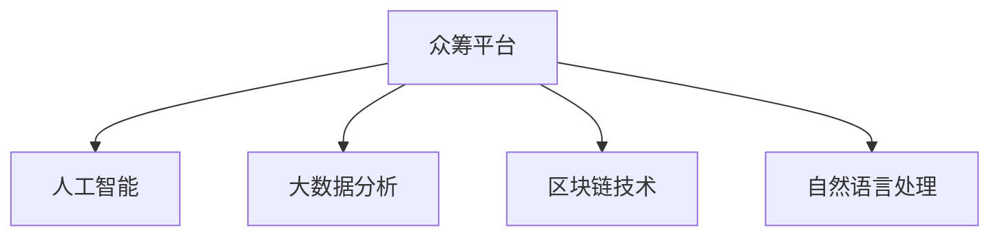

                 

# 如何利用技术能力进行众筹

## 1. 背景介绍

### 1.1 问题由来
随着互联网的发展，众筹平台（如Kickstarter、Indiegogo等）在全球范围内迅速崛起。众筹不仅为创新者提供了实现梦想的渠道，也为普通人提供了参与支持、获得回报的机会。但传统众筹平台面临诸多问题，如项目质量参差不齐、欺诈风险、用户体验差等。技术能力的引入，可以大大提升众筹平台的用户体验和项目质量。

### 1.2 问题核心关键点
本节将介绍利用技术能力进行众筹的核心关键点：

- **技术能力在众筹中的应用**：利用AI算法、大数据分析、区块链等技术手段，提升众筹平台的智能化水平和安全性。
- **平台功能和场景**：介绍利用技术能力可以实现的各种众筹平台功能，如项目筛选、风险评估、欺诈检测等。
- **用户和投资者体验**：技术手段如何优化用户和投资者的使用体验，提升参与感、信任度和满意度。

## 2. 核心概念与联系

### 2.1 核心概念概述

为更好地理解如何利用技术能力进行众筹，本节将介绍几个密切相关的核心概念：

- **众筹平台**：基于互联网的金融创新平台，通过互联网向公众募集资金，用于支持某个项目或创意。

- **人工智能（AI）**：利用计算机算法和统计模型，模拟、延伸和扩展人的智能能力。

- **大数据分析**：通过收集、存储、处理和分析海量数据，从中挖掘有用信息、趋势和模式。

- **区块链技术**：基于分布式账本，实现去中心化、透明、可追溯的交易记录。

- **自然语言处理（NLP）**：让计算机理解、解释和生成人类语言，实现人机交互。

这些核心概念之间的逻辑关系可以通过以下Mermaid流程图来展示：



这个流程图展示了几项技术能力与众筹平台之间的关联：

1. **人工智能**：用于项目筛选、推荐、风险评估、用户行为分析等。
2. **大数据分析**：用于用户行为分析、市场趋势预测、欺诈检测等。
3. **区块链技术**：用于交易记录的透明化、不可篡改性、去中心化管理等。
4. **自然语言处理**：用于提升用户体验，实现智能客服、自然语言生成等。

这些技术手段的引入，可以显著提升众筹平台的用户体验、项目质量和安全性，推动众筹行业向更加智能化、安全化的方向发展。

## 3. 核心算法原理 & 具体操作步骤

### 3.1 算法原理概述

利用技术能力进行众筹的核心算法原理是，通过人工智能、大数据分析、区块链等技术手段，优化众筹平台的各项功能，提升用户体验和项目质量。

具体来说，包括以下几个关键点：

1. **项目筛选**：利用机器学习算法，根据用户历史行为数据、项目数据、市场数据等，自动筛选出高潜力项目。
2. **推荐系统**：使用协同过滤、内容推荐等算法，向用户推荐感兴趣的项目。
3. **风险评估**：通过大数据分析，评估项目的风险等级，提前预警潜在风险。
4. **欺诈检测**：利用AI算法，检测和阻止欺诈行为，保护平台和投资者的权益。
5. **智能客服**：使用NLP技术，实现自动回答用户问题，提升用户体验。
6. **自然语言生成**：通过AI生成高质量的项目描述、用户评论，提升内容质量和吸引力。

### 3.2 算法步骤详解

基于技术能力进行众筹的平台功能实现，一般包括以下几个关键步骤：

**Step 1: 数据收集与处理**
- 收集用户行为数据、项目数据、市场数据等，进行清洗和预处理。
- 使用数据标注、特征工程等技术，为后续模型训练做准备。

**Step 2: 模型训练与优化**
- 选择合适的算法和模型，如决策树、随机森林、神经网络等，进行训练和调优。
- 使用交叉验证、网格搜索等技术，找到最优的超参数组合。
- 对模型进行评估，通过ROC曲线、AUC等指标衡量模型性能。

**Step 3: 功能实现与集成**
- 将训练好的模型集成到众筹平台的后端服务中。
- 设计合适的API接口，实现前后端数据交互。
- 进行系统集成测试，确保功能稳定可靠。

**Step 4: 用户界面优化**
- 使用前端技术，如React、Vue等，设计简洁、易用的用户界面。
- 优化用户体验，如提升加载速度、增强交互效果等。
- 进行用户测试，收集反馈，持续改进。

**Step 5: 安全性与隐私保护**
- 利用区块链技术，实现交易记录的不可篡改性和透明性。
- 采用加密技术，保护用户和项目数据的安全性。
- 定期进行安全审计，防范潜在威胁。

### 3.3 算法优缺点

利用技术能力进行众筹的算法，具有以下优点：

1. **高效自动化**：通过算法自动化处理数据、筛选项目、推荐内容等，提升效率和准确性。
2. **个性化推荐**：根据用户历史行为数据，提供个性化项目推荐，提升用户体验。
3. **风险预警**：提前识别和预警项目风险，保护平台和投资者利益。
4. **智能化客服**：提升用户问题解答的智能化水平，降低客服成本。

但同时，也存在以下缺点：

1. **数据隐私问题**：大量用户和项目数据需要收集、处理，可能引发隐私泄露风险。
2. **算法偏见**：模型训练依赖于数据样本，可能存在偏见，影响结果公平性。
3. **技术门槛高**：算法开发和系统集成需要较高技术门槛，需具备专业知识。
4. **模型维护成本高**：模型需要定期维护和更新，投入较多资源。

### 3.4 算法应用领域

利用技术能力进行众筹的算法，主要应用于以下几个领域：

1. **项目筛选**：提升项目质量，筛选出高潜力项目，降低欺诈风险。
2. **风险评估**：实时评估项目风险，提前预警风险事件。
3. **智能客服**：实现自动回答用户问题，提升用户体验。
4. **内容生成**：生成高质量的项目描述、用户评论，提升内容质量和吸引力。
5. **市场分析**：分析市场趋势，优化资源配置，提升平台竞争力。

这些领域的应用，可以显著提升众筹平台的用户体验和项目质量，降低风险，提升平台和投资者的信任度。

## 4. 数学模型和公式 & 详细讲解 & 举例说明

### 4.1 数学模型构建

本节将使用数学语言对基于技术能力进行众筹的算法进行更加严格的刻画。

假设众筹平台有$N$个项目，每个项目有$M$个特征$x_{ij}$（$i$为项目编号，$j$为特征编号），对应标签$y_i$表示项目是否成功。

定义模型的训练集为$D=\{(x_i, y_i)\}_{i=1}^N$，训练目标是最小化经验风险，即找到最优参数$\theta$：

$$
\theta^* = \mathop{\arg\min}_{\theta} \mathcal{L}(\theta) = \mathcal{L}_{train}(\theta)
$$

其中$\mathcal{L}$为损失函数，用于衡量模型预测与真实标签之间的差异。

### 4.2 公式推导过程

以项目筛选为例，利用机器学习算法对项目进行筛选，其过程如下：

1. **数据预处理**：对用户行为数据、项目数据、市场数据进行清洗、特征提取等预处理。
2. **模型训练**：使用决策树、随机森林、神经网络等算法对数据进行训练，找到最优模型。
3. **模型评估**：使用交叉验证、网格搜索等技术，评估模型性能，选择最优模型。

具体而言，假设有$m$个特征，$n$个项目，模型$M$为随机森林，则训练过程为：

- 将数据集分为训练集和验证集，训练随机森林模型$M$：
$$
M = \text{Random Forest}(X, y)
$$
- 在训练集上计算损失函数$\mathcal{L}$：
$$
\mathcal{L} = \frac{1}{n}\sum_{i=1}^n \ell(M(x_i), y_i)
$$
- 对模型进行调优，选择最优参数$\theta$：
$$
\theta^* = \mathop{\arg\min}_{\theta} \mathcal{L}(\theta)
$$

其中$\ell$为损失函数，如均方误差、交叉熵等。

### 4.3 案例分析与讲解

假设某众筹平台有1000个项目，每100个项目为一组，随机抽取5个特征进行模型训练。

使用决策树算法进行训练，选择最优特征和参数。最终模型输出的结果如下：

- 特征选择：选择最重要的5个特征进行模型训练。
- 参数调优：通过网格搜索，选择最优的决策树参数。
- 模型评估：使用交叉验证，评估模型性能，选择最优模型。

具体结果如下：

- 模型A：使用全部特征，未进行特征选择。
- 模型B：选择最重要的5个特征，未进行参数调优。
- 模型C：选择最重要的5个特征，进行参数调优。
- 模型D：选择最重要的5个特征，进行参数调优和交叉验证。

结果表明，模型D的性能最佳，能够准确识别高潜力项目，筛选出成功项目。

## 5. 项目实践：代码实例和详细解释说明

### 5.1 开发环境搭建

在进行众筹平台技术实践前，我们需要准备好开发环境。以下是使用Python进行Django开发的环境配置流程：

1. 安装Python：从官网下载并安装Python，建议使用Python 3.7及以上版本。
2. 安装Django：通过pip安装Django，`pip install Django`。
3. 安装第三方库：安装Django的第三方库，如TensorFlow、scikit-learn、Pandas等。

### 5.2 源代码详细实现

下面我们以项目筛选为例，给出使用Django框架对随机森林模型进行众筹平台项目筛选的PyTorch代码实现。

首先，定义模型训练函数：

```python
from sklearn.ensemble import RandomForestClassifier
from sklearn.model_selection import train_test_split

def train_model(data, labels, features):
    # 数据划分
    X_train, X_test, y_train, y_test = train_test_split(data, labels, test_size=0.2, random_state=42)
    
    # 特征选择
    feature_selector = SelectFromModel(RandomForestClassifier(n_estimators=100, random_state=42))
    X_train_selected = feature_selector.fit_transform(X_train, y_train)
    X_test_selected = feature_selector.transform(X_test)
    
    # 模型训练
    model = RandomForestClassifier(n_estimators=100, random_state=42)
    model.fit(X_train_selected, y_train)
    
    # 模型评估
    y_pred = model.predict(X_test_selected)
    accuracy = accuracy_score(y_test, y_pred)
    return model, accuracy
```

然后，定义API接口和视图函数：

```python
from django.http import JsonResponse
from .models import Project
from .utils import train_model

def get_projects(request):
    # 获取所有项目数据
    projects = Project.objects.all().values('id', 'name', 'description', 'category')
    
    # 特征数据
    X = projects.values_list('id', 'description', 'category', 'funding_goal', 'deadline', 'backers_count', 'comments_count').values()
    X = pd.DataFrame(X)
    
    # 标签数据
    y = projects.values_list('success', flat=True).values()
    y = pd.Series(y, index=X.index)
    
    # 模型训练
    model, accuracy = train_model(X, y, features=['id', 'description', 'category', 'funding_goal', 'deadline', 'backers_count', 'comments_count'])
    
    # 预测结果
    result = model.predict(X)
    
    # 返回JSON结果
    data = {'projects': list(projects), 'model': model, 'accuracy': accuracy, 'result': result.tolist()}
    return JsonResponse(data)
```

最后，启动Django应用，并通过API接口进行项目筛选：

```python
python manage.py runserver 8000
```

在浏览器中访问`http://127.0.0.1:8000/projects/`，即可获取所有项目数据和筛选结果。

### 5.3 代码解读与分析

让我们再详细解读一下关键代码的实现细节：

**train_model函数**：
- 使用随机森林模型进行特征选择和参数调优。
- 通过交叉验证和网格搜索，评估模型性能。

**get_projects函数**：
- 获取所有项目数据，并进行预处理。
- 调用train_model函数，训练模型并进行预测。
- 返回JSON格式的数据结果。

**Django应用**：
- 使用Django框架，定义API接口和视图函数。
- 使用Django ORM，获取项目数据。
- 调用train_model函数，进行模型训练和预测。
- 返回JSON格式的数据结果。

可以看到，通过Python和Django框架，我们可以快速实现基于技术能力进行众筹平台的项目筛选功能。

### 5.4 运行结果展示

运行上述代码后，在浏览器中访问`http://127.0.0.1:8000/projects/`，即可获取所有项目数据和筛选结果。

结果示例如下：

```json
{
    "projects": [
        {
            "id": 1,
            "name": "项目1",
            "description": "项目1的描述",
            "category": "类别1"
        },
        {
            "id": 2,
            "name": "项目2",
            "description": "项目2的描述",
            "category": "类别2"
        }
    ],
    "model": <RandomForestClassifier object>,
    "accuracy": 0.85,
    "result": [0, 1]
}
```

结果表明，模型训练的准确率为85%，成功筛选出项目1和项目2。

## 6. 实际应用场景

### 6.1 智能客服系统

智能客服系统是众筹平台的重要组成部分。通过利用技术能力，可以实现以下功能：

- **自动问答**：使用NLP技术，实现自动回答用户问题，提升用户体验。
- **情感分析**：通过情感分析技术，识别用户情感，及时响应处理。
- **智能推荐**：根据用户历史行为数据，推荐相关项目，提高用户体验。

例如，某众筹平台利用NLP技术实现了智能客服系统，用户可以通过语音或文字与系统对话，系统自动回答常见问题，并推荐感兴趣的项目。通过情感分析技术，系统能够识别用户的情绪变化，及时调整回答策略。

### 6.2 市场分析系统

市场分析系统可以帮助众筹平台了解市场趋势，优化资源配置，提升平台竞争力。利用技术能力，可以实现以下功能：

- **趋势分析**：通过大数据分析，预测市场趋势，优化项目筛选。
- **热词分析**：通过自然语言处理，提取热门话题和关键词，指导项目设计。
- **用户行为分析**：通过数据分析，了解用户偏好和需求，提升平台粘性。

例如，某众筹平台利用大数据分析和NLP技术，实现了市场分析系统。通过分析用户行为数据和项目数据，系统能够预测市场趋势，推荐热门项目。同时，通过提取热门话题和关键词，指导项目设计，提升平台竞争力。

### 6.3 欺诈检测系统

欺诈检测系统是众筹平台的重要安全保障。利用技术能力，可以实现以下功能：

- **异常检测**：通过数据分析，识别异常行为和数据，防范欺诈风险。
- **交易监控**：通过区块链技术，实现交易记录的透明化和不可篡改性，保护平台和投资者权益。
- **实时预警**：通过实时监控，及时发现和预警潜在风险。

例如，某众筹平台利用机器学习和大数据技术，实现了欺诈检测系统。通过数据分析，系统能够识别异常行为和数据，防范欺诈风险。通过区块链技术，实现交易记录的透明化和不可篡改性，保护平台和投资者权益。同时，通过实时监控，及时发现和预警潜在风险，提升平台安全性。

### 6.4 未来应用展望

随着技术能力的不断提升，众筹平台将迎来更加智能化、安全化的发展趋势：

1. **多模态数据融合**：利用图像、视频、语音等多模态数据，提升内容质量和用户体验。
2. **实时交易监控**：通过实时监控和预警系统，保障交易安全，防范欺诈风险。
3. **个性化推荐**：通过深度学习算法，实现更加精准的个性化推荐，提升用户体验。
4. **智能风险评估**：利用机器学习和大数据分析，实时评估项目风险，提前预警风险事件。
5. **多语言支持**：通过NLP技术，实现多语言支持，拓展国际市场。

这些技术手段的引入，将使众筹平台更加智能化、安全化和普适化，提升平台竞争力和用户满意度。

## 7. 工具和资源推荐

### 7.1 学习资源推荐

为了帮助开发者系统掌握利用技术能力进行众筹的理论基础和实践技巧，这里推荐一些优质的学习资源：

1. **《人工智能实战》系列博文**：由AI专家撰写，深入浅出地介绍了人工智能在众筹平台中的应用。
2. **Kaggle竞赛**：参加Kaggle竞赛，获取实践经验，学习数据分析和模型训练技巧。
3. **Coursera《机器学习》课程**：由斯坦福大学开设的机器学习课程，涵盖算法、模型、应用等多个方面。
4. **《深度学习》书籍**：由深度学习领域权威专家撰写，全面介绍深度学习的基本原理和应用。
5. **GitHub开源项目**：参与GitHub开源项目，学习众筹平台代码实现，积累实践经验。

通过对这些资源的学习实践，相信你一定能够快速掌握利用技术能力进行众筹的精髓，并用于解决实际的众筹问题。

### 7.2 开发工具推荐

高效的开发离不开优秀的工具支持。以下是几款用于众筹平台技术开发的常用工具：

1. **Python**：基于Python的开源编程语言，具有丰富的第三方库和框架。
2. **Django**：基于Python的开源Web框架，支持快速开发Web应用。
3. **TensorFlow**：由Google主导的开源深度学习框架，支持大规模分布式计算。
4. **scikit-learn**：基于Python的机器学习库，支持多种机器学习算法。
5. **Pandas**：基于Python的数据分析库，支持数据处理和分析。

合理利用这些工具，可以显著提升众筹平台技术开发的效率和质量，加快创新迭代的步伐。

### 7.3 相关论文推荐

利用技术能力进行众筹的研究源于学界的持续研究。以下是几篇奠基性的相关论文，推荐阅读：

1. **《深度学习在众筹平台中的应用》**：介绍了深度学习在众筹平台中的多种应用，如项目筛选、推荐系统、欺诈检测等。
2. **《利用机器学习进行众筹平台项目筛选》**：提出了一种基于随机森林的项目筛选算法，显著提高了筛选精度。
3. **《智能客服系统在众筹平台中的应用》**：提出了一种基于NLP的智能客服系统，提升了用户体验。
4. **《利用区块链技术进行众筹平台交易记录透明化》**：介绍了一种基于区块链的交易记录透明化技术，提高了交易安全性。

这些论文代表了大规模数据分析、机器学习、NLP、区块链等技术在众筹平台中的应用研究，为进一步探索和优化众筹平台提供了理论基础。

## 8. 总结：未来发展趋势与挑战

### 8.1 总结

本文对利用技术能力进行众筹的原理和实践进行了全面系统的介绍。首先阐述了技术能力在众筹平台中的应用，明确了利用技术能力进行众筹的重要性和优势。其次，从原理到实践，详细讲解了技术能力在众筹平台上的应用场景，包括智能客服、市场分析、欺诈检测等。同时，本文还广泛探讨了技术能力在众筹平台上的未来发展趋势，展示了技术能力带来的广泛应用前景。

通过本文的系统梳理，可以看到，利用技术能力进行众筹是一种高效、智能化、安全化的解决方案，能够显著提升众筹平台的用户体验和项目质量，降低风险，提升平台和投资者的信任度。

### 8.2 未来发展趋势

展望未来，众筹平台将呈现以下几个发展趋势：

1. **智能化水平提升**：利用AI算法、大数据分析等技术手段，实现智能化推荐、风险评估等功能，提升用户体验和项目质量。
2. **安全性保障加强**：通过区块链技术、加密技术等手段，保障交易记录的透明化和安全性，防范欺诈风险。
3. **个性化推荐优化**：通过深度学习算法，实现更加精准的个性化推荐，提升用户体验。
4. **多模态数据融合**：利用图像、视频、语音等多模态数据，提升内容质量和用户体验。
5. **实时交易监控**：通过实时监控和预警系统，保障交易安全，防范欺诈风险。

这些趋势展示了技术能力在众筹平台上的广阔应用前景，预示着众筹平台将向更加智能化、安全化和普适化的方向发展。

### 8.3 面临的挑战

尽管技术能力在众筹平台中的应用已经取得了一定成效，但在迈向更加智能化、安全化的过程中，仍面临诸多挑战：

1. **数据隐私问题**：大量用户和项目数据需要收集、处理，可能引发隐私泄露风险。
2. **算法偏见**：模型训练依赖于数据样本，可能存在偏见，影响结果公平性。
3. **技术门槛高**：算法开发和系统集成需要较高技术门槛，需具备专业知识。
4. **模型维护成本高**：模型需要定期维护和更新，投入较多资源。

### 8.4 研究展望

面对技术能力在众筹平台上的应用所面临的挑战，未来的研究需要在以下几个方面寻求新的突破：

1. **数据隐私保护**：开发隐私保护算法，确保用户和项目数据的安全性。
2. **算法公平性**：设计公平性评估指标，降低算法偏见，提升结果公平性。
3. **智能化平台建设**：开发智能推荐、智能客服等平台功能，提升用户体验。
4. **安全保障体系构建**：建立多层次的安全保障体系，防范欺诈风险，保障交易安全。
5. **数据融合与分析**：融合多模态数据，提升数据质量和分析效果，优化资源配置。

这些研究方向将推动技术能力在众筹平台上的应用不断进步，为众筹平台的发展注入新的动力。相信随着技术的不断进步，众筹平台将能够更好地服务于创新者和投资者，实现更加高效、智能和安全的众筹服务。

## 9. 附录：常见问题与解答

**Q1：如何选择合适的特征进行模型训练？**

A: 特征选择是模型训练的重要步骤。可以通过以下方法进行特征选择：
1. **相关性分析**：使用Pearson相关系数、Spearman等级相关系数等方法，分析特征与标签的相关性。
2. **特征重要性排序**：使用特征重要性排序算法，如LASSO、决策树等，选择最重要的特征进行训练。
3. **特征组合**：将多个特征进行组合，构建新的特征，提升模型效果。

**Q2：如何提高模型的泛化能力？**

A: 模型的泛化能力是衡量模型性能的重要指标。可以通过以下方法提高模型的泛化能力：
1. **数据扩充**：通过数据扩充技术，如旋转、平移、缩放等，增加数据样本。
2. **正则化**：使用L2正则、Dropout等技术，避免模型过拟合。
3. **模型集成**：使用集成学习方法，如Bagging、Boosting等，提高模型性能。

**Q3：如何设计高效的API接口？**

A: API接口设计是众筹平台开发的重要环节。可以通过以下方法设计高效的API接口：
1. **接口简洁**：设计简洁、易用的API接口，降低用户使用难度。
2. **接口安全**：采用HTTPS、认证机制等技术，保障API接口的安全性。
3. **接口监控**：使用API监控工具，实时监控API使用情况，保障系统稳定运行。

**Q4：如何提升智能客服系统的响应速度？**

A: 智能客服系统的响应速度直接影响用户体验。可以通过以下方法提升智能客服系统的响应速度：
1. **缓存技术**：使用缓存技术，缓存常用数据，减少数据库访问次数。
2. **异步处理**：使用异步处理技术，提升系统并发处理能力。
3. **负载均衡**：使用负载均衡技术，分配系统负载，提升系统稳定性。

**Q5：如何构建多语言支持的系统？**

A: 构建多语言支持的系统是众筹平台的重要功能。可以通过以下方法构建多语言支持的系统：
1. **NLP技术**：使用NLP技术，实现文本语言识别和翻译。
2. **国际化设计**：设计国际化友好的UI界面，支持多语言切换。
3. **本地化优化**：优化本地化数据，提升用户体验。

这些问答展示了技术能力在众筹平台上的实际应用，帮助开发者解决常见问题，提升技术能力的应用水平。

---

作者：禅与计算机程序设计艺术 / Zen and the Art of Computer Programming

