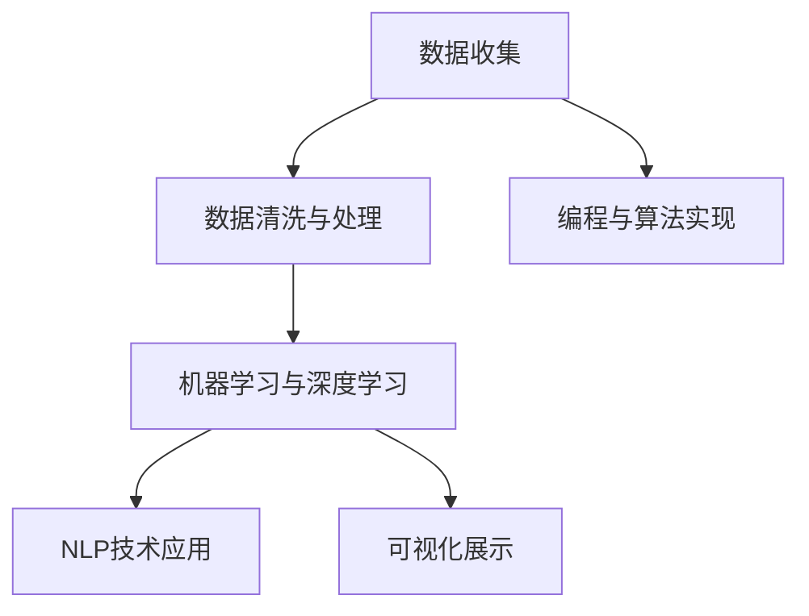

                 

# 如何利用技术能力进行内容创作

在信息爆炸的时代，内容创作已经成为了一种核心竞争力。无论是个人博主、自媒体、企业媒体，还是社交平台，高质量、有创意的内容都成为了吸引用户、提升影响力的关键。然而，内容的创作不仅仅需要天马行空的创意，更需要技术和工具的支撑。本文将深入探讨如何利用技术能力进行内容创作，帮助创作者掌握内容创作的新范式，提升创作效率和内容质量。

## 1. 背景介绍

### 1.1 问题由来

随着互联网和移动互联网的普及，内容创作形式和工具日益丰富。从传统的新闻媒体到个人博客，再到社交媒体，内容创作成为了用户连接世界、表达自我的一种重要方式。然而，内容创作的门槛也在不断提高，尤其是对于技术含量高的内容，如数据分析报告、科学论文、技术文章等，需要创作者具备深厚的专业知识和技术储备。

技术工具的不断发展，为内容创作提供了新的可能性。无论是数据分析、机器学习、自然语言处理等技术，还是自动化工具、编程语言、可视化软件等，都可以帮助创作者更加高效地进行内容创作。然而，技术工具的引入也需要创作者具备相应的技术能力和知识背景。

### 1.2 问题核心关键点

内容创作涉及以下几个关键点：

- **技术工具的选择**：不同的内容创作需要不同的技术工具，选择适合的工具可以提高创作效率和质量。
- **数据获取与处理**：高质量的内容往往需要大量的数据支持，如何获取、清洗和处理数据是关键。
- **算法与模型应用**：数据分析、机器学习等技术可以辅助创作者进行内容创作，提升内容的深度和广度。
- **编程技能与代码实现**：技术内容创作需要具备编程能力，能够实现数据处理、模型训练等算法过程。
- **可视化与展示**：将复杂的数据、算法结果通过可视化工具展示，可以增强内容的可读性和吸引力。

## 2. 核心概念与联系

### 2.1 核心概念概述

为更好地理解利用技术能力进行内容创作的方法，本节将介绍几个密切相关的核心概念：

- **数据分析(Analytics)**：通过收集、清洗和分析数据，获取有价值的信息和洞见，为内容创作提供数据支撑。
- **机器学习与深度学习(Machine Learning & Deep Learning)**：基于统计学方法，训练模型以自动化数据处理和模式识别，提升内容创作的质量和效率。
- **自然语言处理(Natural Language Processing, NLP)**：使计算机能够理解、处理和生成自然语言，为技术文章、翻译、问答等内容的创作提供支持。
- **编程与算法实现**：使用编程语言实现数据处理、模型训练等算法过程，为内容创作提供技术保障。
- **可视化(Visualization)**：通过图表、图像等形式展示数据和算法结果，使内容更加直观、易懂。

这些核心概念之间的逻辑关系可以通过以下Mermaid流程图来展示：



这个流程图展示了大语言模型微调的各个环节：

1. 数据收集：获取相关的数据资源。
2. 数据清洗与处理：对数据进行预处理，去除噪音，填补缺失值。
3. 机器学习与深度学习：利用模型进行数据分析，提取特征，生成洞见。
4. 编程与算法实现：将数据处理、模型训练等过程用代码实现，形成可重复的数据处理流程。
5. NLP技术应用：将自然语言处理技术应用于文本分析、文本生成等任务。
6. 可视化展示：将分析结果、模型输出等用图表、图像展示出来，增强内容的可读性和吸引力。

## 3. 核心算法原理 & 具体操作步骤

### 3.1 算法原理概述

内容创作的本质是通过对数据和信息的处理、分析和呈现，形成有价值的内容。利用技术能力进行内容创作，可以大大提升创作效率和内容质量。以下是几种常用的技术手段：

- **数据分析**：利用统计学方法，对数据进行分析和预测，生成有洞见的内容。
- **机器学习与深度学习**：通过训练模型，自动化数据分析和特征提取，生成高质量的内容。
- **自然语言处理**：利用NLP技术，自动生成文本、回答问题、翻译等，提升内容创作的速度和质量。
- **编程与算法实现**：通过编程实现数据分析、模型训练等过程，形成可重复的数据处理流程。
- **可视化展示**：将数据、模型输出等用图表、图像展示出来，增强内容的可读性和吸引力。

### 3.2 算法步骤详解

下面以一个具体的例子——利用机器学习进行数据分析和内容创作——来详细讲解其具体的操作步骤：

#### 3.2.1 数据收集

首先，需要收集与内容创作相关的数据资源。这些数据可以来自不同的渠道，如公开数据库、API接口、社交媒体等。例如，如果你要创作一篇关于股票市场趋势的文章，可以从金融网站获取股票历史数据、新闻报道等。

#### 3.2.2 数据清洗与处理

收集到的数据往往需要经过清洗和处理，去除噪音和缺失值，使其更适合进行分析。例如，在处理股票数据时，可能需要去除异常值、处理缺失值、对数据进行归一化处理等。

#### 3.2.3 特征提取与模型训练

利用机器学习算法，对清洗后的数据进行特征提取和模型训练。例如，可以使用时间序列分析模型（如ARIMA、LSTM等）对股票数据进行趋势预测，或者使用分类算法（如随机森林、梯度提升树等）对股票分类进行分析。

#### 3.2.4 结果分析与内容创作

根据模型训练的结果，进行内容创作。例如，如果股票趋势预测模型显示某只股票将上涨，可以围绕该预测结果进行内容创作，生成相关的分析文章、投资建议等。

#### 3.2.5 可视化展示

最后，将分析结果、模型输出等通过可视化工具展示出来，增强内容的可读性和吸引力。例如，可以使用Matplotlib、Seaborn等库生成股票走势图、分类结果饼图等。

### 3.3 算法优缺点

利用技术能力进行内容创作，可以显著提升创作效率和内容质量，但同时也存在一些缺点：

- **技术门槛高**：需要具备一定的编程能力和统计学知识，对初学者来说有一定的门槛。
- **数据依赖性强**：内容创作的质量高度依赖于数据的质量和数量，数据获取和处理需要大量的时间和资源。
- **算法复杂度高**：部分复杂的数据分析、模型训练等算法，需要较长的训练时间和较大的计算资源。
- **内容缺乏深度**：如果过度依赖技术工具，可能会忽视内容的深度和创意性，降低内容的价值。

尽管存在这些缺点，但技术手段在内容创作中的应用仍然是必不可少的。只有在技术和创意之间找到平衡，才能创作出既有深度又有吸引力的内容。

### 3.4 算法应用领域

利用技术能力进行内容创作的范式已经在多个领域得到了应用，例如：

- **金融领域**：利用数据分析和机器学习技术，生成股票市场分析、投资建议等内容。
- **医疗领域**：利用自然语言处理技术，生成疾病诊断、治疗建议等内容。
- **科技领域**：利用机器学习算法，生成技术趋势分析、新技术介绍等内容。
- **社交媒体**：利用数据挖掘和机器学习技术，生成内容推荐、用户画像等内容。

除了这些领域，技术手段在内容创作中的应用还在不断扩展，未来将会有更多的创新场景出现。

## 4. 数学模型和公式 & 详细讲解 & 举例说明

### 4.1 数学模型构建

本节将使用数学语言对利用技术手段进行内容创作的过程进行更加严格的刻画。

假设内容创作的数据集为 $D=\{(x_i, y_i)\}_{i=1}^N$，其中 $x_i$ 为输入特征，$y_i$ 为输出结果。我们的目标是找到函数 $f(x)$，使得 $f(x)$ 能够最大化对 $y_i$ 的预测能力，即最小化预测误差 $\epsilon$。

常用的机器学习模型包括线性回归、逻辑回归、决策树、随机森林、梯度提升树等。以线性回归模型为例，目标函数可以表示为：

$$
\min_{\theta} \frac{1}{2N} \sum_{i=1}^N (y_i - f(x_i; \theta))^2
$$

其中 $f(x; \theta)$ 表示模型对输入特征 $x_i$ 的预测结果，$\theta$ 为模型参数。

### 4.2 公式推导过程

以线性回归为例，推导模型的求解过程。

根据目标函数，最小化预测误差的梯度为：

$$
\nabla_{\theta} \frac{1}{2N} \sum_{i=1}^N (y_i - f(x_i; \theta))^2 = -\frac{1}{N} \sum_{i=1}^N (y_i - f(x_i; \theta)) x_i
$$

通过求解上述梯度，可以得到模型参数 $\theta$ 的值。具体的求解过程如下：

1. 初始化模型参数 $\theta_0$。
2. 迭代求解，直到收敛：
   $$
   \theta_{t+1} = \theta_t - \eta \nabla_{\theta} \mathcal{L}(\theta_t)
   $$
   其中 $\eta$ 为学习率，$\mathcal{L}(\theta_t)$ 为损失函数。

### 4.3 案例分析与讲解

以金融领域的数据分析为例，展示利用机器学习进行内容创作的流程。

假设我们想要预测某只股票在未来一个月的涨跌情况，可以通过收集该股票的历史数据、市场指数、宏观经济数据等作为输入特征 $x$，股票涨跌情况 $y$ 作为输出结果。使用线性回归模型对历史数据进行训练，得到预测模型 $f(x; \theta)$。将最新的市场数据输入模型，得到预测结果，生成关于未来一个月股票趋势的预测文章。

## 5. 项目实践：代码实例和详细解释说明

### 5.1 开发环境搭建

在进行内容创作的项目实践前，我们需要准备好开发环境。以下是使用Python进行数据分析和机器学习开发的环境配置流程：

1. 安装Anaconda：从官网下载并安装Anaconda，用于创建独立的Python环境。

2. 创建并激活虚拟环境：
```bash
conda create -n analytics-env python=3.8 
conda activate analytics-env
```

3. 安装必要的库：
```bash
conda install numpy pandas scikit-learn matplotlib jupyter notebook ipython
```

4. 安装机器学习库：
```bash
conda install scikit-learn
```

5. 安装可视化库：
```bash
conda install matplotlib seaborn
```

完成上述步骤后，即可在`analytics-env`环境中开始数据分析和机器学习开发。

### 5.2 源代码详细实现

这里我们以一个具体的例子——利用线性回归模型进行股票市场趋势预测——来展示完整的代码实现。

```python
import pandas as pd
import numpy as np
import matplotlib.pyplot as plt
from sklearn.linear_model import LinearRegression
from sklearn.metrics import mean_squared_error

# 加载股票数据
df = pd.read_csv('stock_data.csv')
x = df[['open', 'high', 'low', 'volume']]  # 输入特征
y = df['close']  # 输出结果

# 标准化数据
x_scaled = (x - x.mean()) / x.std()

# 划分训练集和测试集
train_size = int(len(x_scaled) * 0.8)
train_x = x_scaled[:train_size]
train_y = y[:train_size]
test_x = x_scaled[train_size:]
test_y = y[train_size:]

# 训练模型
model = LinearRegression()
model.fit(train_x, train_y)

# 预测并评估
preds = model.predict(test_x)
rmse = np.sqrt(mean_squared_error(test_y, preds))
print(f'RMSE: {rmse:.2f}')

# 可视化结果
plt.plot(test_x, test_y, label='Actual')
plt.plot(test_x, preds, label='Predicted')
plt.legend()
plt.show()
```

### 5.3 代码解读与分析

让我们再详细解读一下关键代码的实现细节：

- **数据加载**：使用Pandas库加载股票数据，并将其分为输入特征 $x$ 和输出结果 $y$。
- **数据标准化**：对输入特征进行标准化处理，以避免特征量纲不一致对模型训练的影响。
- **数据划分**：将数据集划分为训练集和测试集，以便进行模型训练和评估。
- **模型训练**：使用LinearRegression模型进行训练，最小化预测误差。
- **预测和评估**：在测试集上使用训练好的模型进行预测，并计算预测误差的均方根误差（RMSE）。
- **可视化结果**：使用Matplotlib库生成实际值和预测值对比图，直观展示模型效果。

可以看到，利用Python进行数据分析和机器学习任务开发，代码实现简洁高效。开发者可以将更多精力放在数据处理、模型选择等高层逻辑上，而不必过多关注底层的实现细节。

当然，工业级的系统实现还需考虑更多因素，如数据接口、数据清洗、模型调优、可视化展示等。但核心的算法和数据处理流程基本与此类似。

## 6. 实际应用场景

### 6.1 智能推荐系统

利用技术能力进行内容创作的范式，已经广泛应用于智能推荐系统中。传统的推荐系统往往只依赖用户的历史行为数据进行物品推荐，无法深入理解用户的真实兴趣偏好。基于数据分析和机器学习的内容创作技术，可以更好地挖掘用户行为背后的语义信息，从而提供更精准、多样的推荐内容。

在实践中，可以收集用户浏览、点击、评论、分享等行为数据，提取和用户交互的物品标题、描述、标签等文本内容。将文本内容作为模型输入，用户的后续行为（如是否点击、购买等）作为监督信号，在此基础上训练模型。训练好的模型能够从文本内容中准确把握用户的兴趣点。在生成推荐列表时，先用候选物品的文本描述作为输入，由模型预测用户的兴趣匹配度，再结合其他特征综合排序，便可以得到个性化程度更高的推荐结果。

### 6.2 新闻内容生产

利用技术能力进行内容创作的范式，也为新闻内容生产提供了新的解决方案。传统的新闻内容生产往往依赖于记者手动编写和编辑，耗时长、成本高，且易受记者个人水平和主观偏见的影响。基于数据分析和自然语言处理的内容创作技术，可以自动化生成新闻摘要、报道、分析等内容，提高内容生产的速度和质量。

在实践中，可以收集新闻数据、事件数据等，使用自然语言处理技术进行文本分析、情感分析、事件抽取等任务。利用数据分析技术，对新闻事件进行趋势预测、热点话题挖掘等。结合两者，可以生成新闻摘要、报道、分析等内容，提高新闻内容的时效性和深度。

### 6.3 广告内容优化

利用技术能力进行内容创作的范式，也为广告内容优化提供了新的方法。传统的广告内容制作往往依赖于经验和直觉，难以达到精准投放和效果评估。基于数据分析和机器学习的内容创作技术，可以自动化生成广告文案、设计广告图像等，提升广告内容的吸引力和转化率。

在实践中，可以收集用户的浏览行为、点击行为、购买行为等数据，使用数据分析技术进行用户画像、兴趣分析等。利用机器学习技术，对广告效果进行建模和预测，优化广告文案和设计。结合两者，可以生成更加精准、有吸引力的广告内容，提高广告投放的效果。

### 6.4 未来应用展望

随着数据分析和机器学习技术的发展，基于技术能力进行内容创作的范式将得到更广泛的应用。未来，将在更多领域带来变革性影响：

- **教育领域**：利用数据分析和自然语言处理技术，生成教育内容、评估学生学习效果等，提升教育质量和公平性。
- **医疗领域**：利用数据分析和机器学习技术，生成医学知识库、辅助诊断等，提升医疗服务的智能化水平。
- **市场营销**：利用数据分析和机器学习技术，生成营销内容、优化广告投放等，提高市场竞争力和客户满意度。
- **城市管理**：利用数据分析和机器学习技术，生成城市规划方案、优化交通管理等，提升城市管理的智能化水平。

总之，利用技术能力进行内容创作，将为内容生产带来新的变革，为各行各业带来更多创新和机遇。

## 7. 工具和资源推荐

### 7.1 学习资源推荐

为了帮助开发者系统掌握利用技术能力进行内容创作的方法，这里推荐一些优质的学习资源：

1. **《Python数据科学手册》**：一本经典的Python数据分析书籍，全面介绍了Python在数据分析和机器学习中的应用。
2. **《机器学习实战》**：一本系统讲解机器学习算法和实践的书籍，包含大量案例和代码实现。
3. **《深度学习入门》**：一本通俗易懂、深入浅出的深度学习入门书籍，适合初学者学习。
4. **Coursera《机器学习》课程**：斯坦福大学开设的机器学习课程，由Andrew Ng教授主讲，包含视频和作业。
5. **Kaggle竞赛平台**：一个数据科学和机器学习竞赛平台，提供大量实际问题的数据集和解决方案。

通过对这些资源的学习实践，相信你一定能够掌握利用技术能力进行内容创作的精髓，并用于解决实际的问题。

### 7.2 开发工具推荐

高效的开发离不开优秀的工具支持。以下是几款用于内容创作开发的常用工具：

1. **Jupyter Notebook**：一个免费的交互式编程环境，支持Python、R、JavaScript等多种语言，适合数据分析和机器学习任务开发。
2. **Matplotlib**：一个Python数据可视化库，支持绘制各种类型的图表，方便展示数据和模型结果。
3. **Seaborn**：一个基于Matplotlib的Python数据可视化库，支持更高级的统计图表和数据分布展示。
4. **Scikit-learn**：一个Python机器学习库，包含多种机器学习算法和工具，方便进行数据分析和模型训练。
5. **TensorFlow**：一个Google开源的深度学习框架，支持分布式训练和部署，适合大规模深度学习任务开发。

合理利用这些工具，可以显著提升内容创作和分析的效率，加快创新迭代的步伐。

### 7.3 相关论文推荐

利用技术能力进行内容创作的技术不断发展，以下是几篇奠基性的相关论文，推荐阅读：

1. **《Grokking Linear Algebra》**：一本介绍线性代数的书籍，适合初学者学习。
2. **《The Elements of Statistical Learning》**：一本介绍统计学方法的书籍，包含多种统计分析和建模技术。
3. **《Deep Learning》**：一本介绍深度学习算法的书籍，包含大量实例和代码实现。
4. **《Natural Language Processing with Python》**：一本介绍自然语言处理技术的书籍，适合Python初学者学习。
5. **《Pattern Recognition and Machine Learning》**：一本介绍模式识别和机器学习的书籍，包含多种算法和应用实例。

这些论文代表了大语言模型微调技术的发展脉络。通过学习这些前沿成果，可以帮助研究者把握学科前进方向，激发更多的创新灵感。

## 8. 总结：未来发展趋势与挑战

### 8.1 总结

本文对利用技术能力进行内容创作的方法进行了全面系统的介绍。首先阐述了数据分析和机器学习在内容创作中的应用背景和意义，明确了技术手段在内容创作中的独特价值。其次，从原理到实践，详细讲解了数据分析和机器学习的数学模型和算法流程，给出了内容创作任务开发的完整代码实例。同时，本文还广泛探讨了技术手段在智能推荐、新闻生产、广告优化等多个行业领域的应用前景，展示了技术范式的巨大潜力。此外，本文精选了数据分析和机器学习技术的各类学习资源，力求为读者提供全方位的技术指引。

通过本文的系统梳理，可以看到，利用技术能力进行内容创作已经成为一种重要的创作方式，显著提升了创作效率和内容质量。未来，伴随着技术的不断演进，内容创作的方式和工具将不断创新，为内容创作者带来更多机遇和挑战。

### 8.2 未来发展趋势

展望未来，利用技术能力进行内容创作的趋势将呈现以下几个方向：

1. **自动化水平提高**：随着数据分析和机器学习技术的不断进步，内容创作的自动化水平将不断提高。更多复杂的数据分析、模型训练等任务将被自动化，内容创作者将从重复性劳动中解放出来，专注于创意和内容设计。
2. **跨领域融合加深**：未来的内容创作将更多地结合不同领域的技术和知识，形成跨领域的内容创作范式。例如，将自然语言处理技术与图像处理、音频处理等技术结合，生成更加丰富和多元的内容。
3. **实时化水平提升**：随着实时数据处理和实时机器学习技术的发展，内容创作的实时化水平将不断提高。基于实时数据和模型，可以生成更具时效性和针对性的内容。
4. **多模态融合加强**：未来的内容创作将更多地结合不同模态的数据和信息，形成多模态的内容创作范式。例如，结合文本、图像、音频等多种模态的数据，生成更加丰富和多元的内容。
5. **智能辅助增强**：未来的内容创作将更多地利用人工智能辅助工具，如自然语言生成(NLG)、智能编辑等，提高内容创作的效率和质量。

以上趋势凸显了利用技术能力进行内容创作的广阔前景。这些方向的探索发展，必将进一步提升内容创作的效率和质量，为各行各业带来更多创新和机遇。

### 8.3 面临的挑战

尽管利用技术能力进行内容创作技术已经取得了瞩目成就，但在迈向更加智能化、普适化应用的过程中，它仍面临着诸多挑战：

1. **技术门槛高**：需要具备一定的编程能力和统计学知识，对初学者来说有一定的门槛。
2. **数据依赖性强**：内容创作的质量高度依赖于数据的质量和数量，数据获取和处理需要大量的时间和资源。
3. **算法复杂度高**：部分复杂的数据分析、模型训练等算法，需要较长的训练时间和较大的计算资源。
4. **内容缺乏深度**：如果过度依赖技术工具，可能会忽视内容的深度和创意性，降低内容的价值。

尽管存在这些挑战，但技术手段在内容创作中的应用仍然是必不可少的。只有在技术和创意之间找到平衡，才能创作出既有深度又有吸引力的内容。

### 8.4 研究展望

面对利用技术能力进行内容创作所面临的挑战，未来的研究需要在以下几个方面寻求新的突破：

1. **降低技术门槛**：开发更加易用的工具和框架，降低内容创作者的技术门槛。
2. **优化数据处理流程**：研究更高效的数据清洗和处理技术，提升数据处理的速度和质量。
3. **简化算法实现**：开发更加简洁易用的算法实现方式，降低算法实现的难度。
4. **提升内容质量**：结合人工智能辅助工具，提升内容的创意性和深度。
5. **优化实时处理能力**：研究实时数据处理和实时机器学习技术，提高内容创作的实时化水平。

这些研究方向的探索，必将引领内容创作技术迈向更高的台阶，为内容创作者带来更多机遇和挑战。相信随着技术的不断演进，内容创作的方式和工具将不断创新，为内容创作者带来更多机遇和挑战。

## 9. 附录：常见问题与解答

**Q1：数据分析和机器学习在内容创作中有哪些具体应用？**

A: 数据分析和机器学习在内容创作中有很多具体应用，例如：
1. **数据可视化**：利用图表、图像等形式展示数据和模型结果，使内容更加直观、易懂。
2. **文本分析**：利用自然语言处理技术，分析文本情感、主题、关键词等，生成有洞见的内容。
3. **趋势预测**：利用时间序列分析等方法，预测股票、商品、产品等未来趋势，生成相关内容。
4. **用户画像**：利用数据分析技术，分析用户行为和兴趣，生成个性化推荐内容。

**Q2：内容创作中如何选择合适的数据分析工具？**

A: 选择合适的数据分析工具需要考虑以下几个因素：
1. **数据类型**：不同类型的数据适合不同的工具，例如数值数据适合Python、R等编程语言，文本数据适合NLTK、SpaCy等自然语言处理库。
2. **数据规模**：大数据集适合使用Hadoop、Spark等分布式计算工具，小数据集适合使用Pandas等单机工具。
3. **功能需求**：不同的工具具有不同的功能，例如Pandas适合数据清洗和处理，Scikit-learn适合机器学习算法，TensorFlow适合深度学习算法。

**Q3：如何利用技术手段提升内容创作的效率？**

A: 利用技术手段提升内容创作的效率可以从以下几个方面入手：
1. **自动化数据处理**：使用Python等编程语言自动化数据清洗、特征提取等任务，提高数据处理的速度和质量。
2. **机器学习算法**：使用机器学习算法自动化数据分析和特征提取，生成有洞见的内容。
3. **智能辅助工具**：利用自然语言生成(NLG)、智能编辑等工具，提高内容创作的效率和质量。
4. **实时数据处理**：利用实时数据处理和机器学习技术，生成具有时效性的内容。
5. **多模态数据融合**：结合不同模态的数据和信息，生成更加丰富和多元的内容。

**Q4：内容创作中需要注意哪些伦理和安全问题？**

A: 内容创作中需要注意以下几个伦理和安全问题：
1. **数据隐私**：确保用户数据的安全和隐私，不泄露用户隐私信息。
2. **偏见和歧视**：避免算法和内容中出现偏见和歧视，确保内容公平公正。
3. **版权问题**：确保内容的版权合法，不侵犯他人版权。
4. **算法透明性**：提高算法的透明性，确保内容创作的可解释性。
5. **用户权益保护**：确保用户权益，不误导用户，不进行虚假宣传。

---

作者：禅与计算机程序设计艺术 / Zen and the Art of Computer Programming

