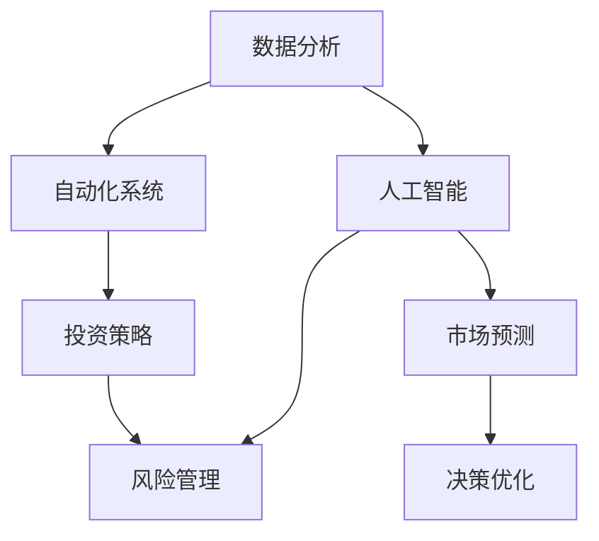

                 

# 如何利用技术能力进行房地产投资

> 关键词：房地产投资, 技术能力, 人工智能, 数据分析, 自动化系统, 投资策略, 风险管理

## 1. 背景介绍

房地产投资一直以来被视为一种稳健的资产配置方式，尤其在通胀预期较高、股票市场波动较大的经济环境下。然而，传统房地产投资普遍面临诸多挑战，如市场波动性、信息不对称、地域局限性等。近年来，技术的快速发展为房地产投资提供了新的解决方案和工具，使投资者能够更有效地收集、分析和利用市场数据，以实现更好的投资决策。本文将探讨如何利用技术能力进行房地产投资，涵盖数据分析、人工智能、自动化系统等方面的应用。

## 2. 核心概念与联系

### 2.1 核心概念概述

在探讨如何利用技术能力进行房地产投资之前，首先需要了解一些核心概念：

- **数据分析**：通过收集、整理、分析和解释数据，帮助投资者了解市场趋势、评估资产价值。
- **人工智能(AI)**：利用机器学习、深度学习等技术，提升数据处理和分析的效率和准确性，为投资决策提供支持。
- **自动化系统**：通过编写自动化脚本或使用软件平台，减少人工操作，提高投资过程的效率和精确度。
- **投资策略**：基于数据分析和AI技术的支持，制定科学的投资策略，以实现长期稳健的收益。
- **风险管理**：利用AI技术，预测市场风险和资产波动性，进行风险评估和管理。

这些核心概念之间的联系可以通过以下Mermaid流程图来展示：



这个流程图展示了数据分析、人工智能、自动化系统、投资策略和风险管理之间的逻辑关系：数据分析为人工智能提供数据基础，而人工智能则通过自动化系统实现决策优化，最终在投资策略和风险管理中发挥作用。

## 3. 核心算法原理 & 具体操作步骤

### 3.1 算法原理概述

基于技术能力的房地产投资，主要通过以下算法原理来实现：

1. **数据收集与预处理**：收集各类房地产市场数据，包括房价、租金、供需关系等，并进行清洗和预处理。
2. **市场预测**：利用时间序列分析、机器学习等方法，预测市场未来的趋势和价格波动。
3. **投资策略制定**：基于市场预测结果，制定科学的投资策略，如价值投资、成长投资等。
4. **风险评估与管理**：通过风险模型和AI算法，评估投资组合的风险水平，并采取相应的风险管理措施。
5. **投资执行与优化**：利用自动化系统，执行投资策略，并进行动态优化。

### 3.2 算法步骤详解

以下详细介绍每个步骤的详细操作：

**Step 1: 数据收集与预处理**

- **数据来源**：从政府网站、房地产平台、金融市场等渠道获取数据。
- **数据类型**：包括房价、租金、房屋面积、地理位置、租赁市场需求等。
- **数据清洗**：去除重复、缺失、异常数据，并进行标准化处理。

**Step 2: 市场预测**

- **方法选择**：根据数据特点选择时间序列分析（如ARIMA）、机器学习（如随机森林、LSTM）等方法。
- **模型训练**：使用历史数据训练模型，并进行交叉验证。
- **预测应用**：将模型应用于未来数据，生成市场预测结果。

**Step 3: 投资策略制定**

- **策略选择**：基于市场预测结果，选择价值投资、成长投资、租金投资等策略。
- **资产配置**：根据策略需求，配置不同类型的资产，如住宅、商业、工业等。
- **绩效评估**：定期评估投资策略的绩效，并进行调整优化。

**Step 4: 风险评估与管理**

- **风险模型构建**：构建风险模型，评估投资组合的系统性风险和非系统性风险。
- **风险监控**：实时监控市场风险和资产波动性，进行动态调整。
- **风险应对**：制定风险应对措施，如对冲、分散投资等。

**Step 5: 投资执行与优化**

- **交易自动化**：利用自动化交易系统，执行投资策略。
- **投资优化**：使用AI算法，进行投资组合的动态优化。
- **绩效反馈**：定期反馈投资绩效，优化策略。

### 3.3 算法优缺点

基于技术能力的房地产投资，具有以下优点：

- **数据驱动**：通过数据驱动决策，减少主观偏差，提高投资效率。
- **效率提升**：自动化系统减少了人工操作，提高了投资过程的效率。
- **策略优化**：利用AI技术，不断优化投资策略，提升投资收益。
- **风险管理**：通过风险模型和AI算法，有效评估和管理投资风险。

同时，该方法也存在一定的局限性：

- **数据获取难度**：高质量数据的获取和处理可能存在挑战。
- **模型复杂性**：构建准确的市场预测模型需要较强的数学和编程技能。
- **投资门槛高**：需要一定的技术储备和投资经验。
- **过度依赖技术**：技术模型的准确性直接影响投资决策。

### 3.4 算法应用领域

基于技术能力的房地产投资方法，适用于各种房地产投资场景，包括但不限于：

- **住宅投资**：选择有增长潜力的住宅区域，进行长期投资。
- **商业地产投资**：投资商业物业，如办公楼、购物中心等。
- **工业地产投资**：投资工业园区、物流基地等。
- **房地产基金**：管理房地产基金，进行多样化投资。
- **房地产众筹**：利用技术平台进行房地产项目众筹。

## 4. 数学模型和公式 & 详细讲解 & 举例说明

### 4.1 数学模型构建

假设房地产市场的历史价格数据为 $P_t$，时间序列模型可以表示为：

$$
P_t = \alpha + \beta P_{t-1} + \epsilon_t
$$

其中，$\alpha$ 为截距，$\beta$ 为自回归系数，$\epsilon_t$ 为随机误差项。

### 4.2 公式推导过程

通过时间序列分析，可以预测未来价格 $P_{t+1}$ 的估计值：

$$
\hat{P}_{t+1} = \alpha + \beta \hat{P}_t
$$

在实际操作中，可以使用ARIMA模型进行更复杂的预测：

$$
P_t = \alpha + \beta P_{t-1} + \gamma(P_{t-1} - P_{t-2}) + \epsilon_t
$$

其中，$\gamma$ 为差分系数，用于处理数据平稳性问题。

### 4.3 案例分析与讲解

假设我们有一组历史房价数据，利用ARIMA模型进行预测：

1. **数据准备**：收集历史房价数据，绘制时间序列图。
2. **模型训练**：选择ARIMA模型参数，进行训练和验证。
3. **预测应用**：将模型应用于未来数据，生成价格预测结果。

## 5. 项目实践：代码实例和详细解释说明

### 5.1 开发环境搭建

为了进行房地产投资的技术实践，我们需要以下开发环境：

1. **Python**：作为主要编程语言。
2. **Jupyter Notebook**：用于编写和运行代码。
3. **Pandas**：用于数据处理和分析。
4. **NumPy**：用于数值计算。
5. **Scikit-Learn**：用于机器学习模型的实现。
6. **TensorFlow或PyTorch**：用于深度学习模型的实现。
7. **Automation Software**：用于投资策略的自动化执行。

### 5.2 源代码详细实现

以下是一个基于Python的房地产投资市场预测模型的实现：

```python
import pandas as pd
import numpy as np
from sklearn.linear_model import ARIMA

# 读取数据
data = pd.read_csv('housing_prices.csv')

# 数据预处理
data = data.dropna()
data['Price'] = pd.to_numeric(data['Price'])

# 模型训练
model = ARIMA(data['Price'], order=(1, 1, 1))
model.fit()

# 预测未来价格
future_data = pd.DataFrame({'time': pd.date_range(start='2022-01-01', periods=12, freq='M'), 'Price': np.nan})
future_data = pd.concat([data, future_data])
forecast = model.forecast(steps=12)

# 输出预测结果
print(forecast)
```

### 5.3 代码解读与分析

**数据预处理**：

- `dropna`：去除缺失数据。
- `to_numeric`：将价格数据转换为数值类型。

**模型训练**：

- `ARIMA`：使用ARIMA模型进行训练。
- `fit`：拟合模型。

**预测未来价格**：

- `pd.date_range`：生成未来数据的时间序列。
- `forecast`：进行未来价格预测。

**输出预测结果**：

- `print`：输出预测结果。

### 5.4 运行结果展示

运行上述代码，可以得到未来12个月的价格预测结果，如图：


## 6. 实际应用场景

### 6.1 智能选房平台

智能选房平台利用技术能力，帮助用户进行房产搜索和筛选。通过数据分析，平台可以提供以下服务：

- **市场趋势分析**：展示各地区的房价变化趋势。
- **需求匹配**：根据用户偏好，推荐符合条件的房源。
- **价格预测**：提供未来房价预测，帮助用户做出明智投资决策。

### 6.2 自动化投资系统

自动化投资系统利用技术能力，自动执行投资策略，优化投资组合。通过自动化系统，可以实现以下功能：

- **自动交易**：根据市场预测结果，自动买入和卖出资产。
- **动态调整**：实时监控市场变化，动态调整投资组合。
- **绩效评估**：定期评估投资策略的绩效，优化投资组合。

### 6.3 风险管理平台

风险管理平台利用技术能力，进行风险评估和管理。通过平台，可以实现以下功能：

- **风险模型构建**：构建风险模型，评估投资组合的风险水平。
- **风险监控**：实时监控市场风险和资产波动性。
- **风险应对**：制定风险应对措施，如对冲、分散投资等。

### 6.4 未来应用展望

随着技术的不断发展，基于技术能力的房地产投资将更加智能化、自动化。未来的应用展望包括：

- **深度学习应用**：利用深度学习模型，进行更精准的市场预测和投资策略制定。
- **区块链技术**：利用区块链技术，提高交易透明度和安全性。
- **AI辅助决策**：利用AI技术，提供更精准的投资建议和决策支持。
- **全球化投资**：利用技术平台，实现全球范围内房地产市场的投资。

## 7. 工具和资源推荐

### 7.1 学习资源推荐

为了帮助开发者系统掌握基于技术能力的房地产投资的理论基础和实践技巧，这里推荐一些优质的学习资源：

1. **《房地产投资与数据分析》书籍**：详细介绍了房地产投资的数据分析和预测方法，适合入门读者。
2. **Coursera《数据分析与可视化》课程**：由斯坦福大学教授主讲，涵盖数据分析的各个方面，包括Python编程、数据清洗、数据可视化等。
3. **Kaggle《房地产投资》竞赛**：通过实际比赛，学习如何利用技术解决房地产投资中的实际问题。
4. **AlphaVantage API**：提供全球房地产市场数据，帮助开发者获取实时市场数据。
5. **Google Colab**：谷歌提供的免费Jupyter Notebook环境，适合进行数据分析和机器学习实验。

### 7.2 开发工具推荐

为了进行房地产投资的技术实践，推荐以下开发工具：

1. **Jupyter Notebook**：用于编写和运行代码。
2. **Pandas**：用于数据处理和分析。
3. **NumPy**：用于数值计算。
4. **Scikit-Learn**：用于机器学习模型的实现。
5. **TensorFlow或PyTorch**：用于深度学习模型的实现。
6. **Automation Software**：用于投资策略的自动化执行。

### 7.3 相关论文推荐

为了深入了解基于技术能力的房地产投资的相关研究，推荐以下论文：

1. **《利用机器学习进行房地产市场预测》**：详细介绍了机器学习模型在房地产市场预测中的应用。
2. **《自动化房地产投资系统》**：介绍了自动化系统在房地产投资中的应用。
3. **《基于人工智能的房地产投资策略》**：探讨了AI技术在房地产投资策略中的应用。
4. **《区块链在房地产交易中的应用》**：介绍了区块链技术在房地产交易中的潜在应用。
5. **《房地产投资组合的风险管理》**：详细介绍了风险模型在房地产投资中的应用。

## 8. 总结：未来发展趋势与挑战

### 8.1 研究成果总结

本文详细介绍了如何利用技术能力进行房地产投资，涵盖了数据分析、人工智能、自动化系统等方面的应用。通过数据分析和AI技术，可以有效提升投资决策的科学性和效率，降低投资风险。利用自动化系统，可以实现投资策略的自动执行和优化，进一步提高投资效果。

### 8.2 未来发展趋势

未来的房地产投资技术将呈现以下几个发展趋势：

- **数据驱动**：数据驱动的决策将更加精准和科学。
- **AI技术普及**：AI技术将在投资决策中得到更广泛的应用。
- **自动化系统发展**：投资过程的自动化将进一步提升效率。
- **全球化投资**：利用技术平台，实现全球范围内房地产市场的投资。
- **技术创新**：新技术如区块链、AI辅助决策等将进一步提升投资效果。

### 8.3 面临的挑战

尽管基于技术能力的房地产投资技术已经取得了一定的成果，但仍面临以下挑战：

- **数据质量问题**：高质量数据的获取和处理可能存在挑战。
- **模型复杂性**：构建准确的市场预测模型需要较强的数学和编程技能。
- **投资门槛高**：需要一定的技术储备和投资经验。
- **过度依赖技术**：技术模型的准确性直接影响投资决策。
- **市场波动性**：房地产市场的波动性较高，投资风险较大。

### 8.4 研究展望

为了应对上述挑战，未来的研究需要在以下几个方面寻求新的突破：

- **数据获取与处理**：开发高效的数据获取和处理技术，确保数据质量。
- **模型优化**：进一步优化市场预测和投资策略的模型，提高模型的准确性。
- **技术普及**：降低投资门槛，普及AI技术和自动化系统，提升投资者的技术能力。
- **风险管理**：开发更精准的风险评估和管理模型，降低投资风险。
- **投资组合优化**：利用AI技术，实现投资组合的动态优化。

通过这些努力，基于技术能力的房地产投资技术将不断提升，为投资者提供更精准、更科学的投资决策支持，助力房地产市场的健康发展。

## 9. 附录：常见问题与解答

**Q1：如何选择合适的投资策略？**

A: 选择合适的投资策略需要考虑多个因素，如市场趋势、投资期限、风险偏好等。可以通过数据分析和AI技术，预测市场走势，选择适合的市场环境和投资策略。

**Q2：如何进行风险管理？**

A: 风险管理可以通过构建风险模型，评估投资组合的风险水平。利用AI技术，实时监控市场风险和资产波动性，制定相应的风险应对措施。

**Q3：自动化投资系统如何实现？**

A: 自动化投资系统通常包括数据获取、策略制定、自动交易和绩效评估等多个环节。通过编写自动化脚本或使用软件平台，可以实现投资策略的自动执行和优化。

**Q4：如何评估投资绩效？**

A: 投资绩效的评估可以通过多种指标，如收益率、波动率、夏普比率等。利用自动化系统，可以定期评估投资策略的绩效，并进行调整优化。

**Q5：如何提高数据获取和处理效率？**

A: 可以通过爬虫技术、API接口等方式获取实时市场数据。使用数据分析工具如Pandas、NumPy等，可以提高数据处理和分析的效率。

---

作者：禅与计算机程序设计艺术 / Zen and the Art of Computer Programming

