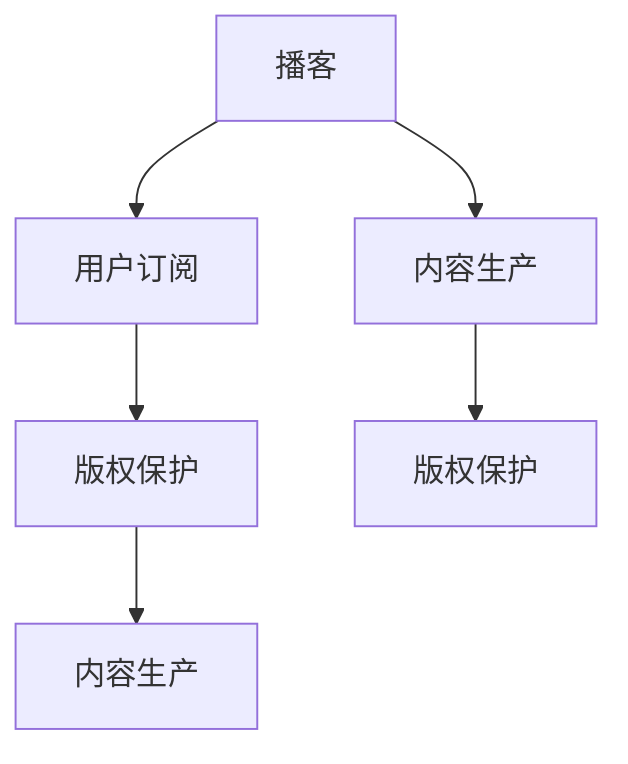

                 

# 如何利用播客进行知识付费

> 关键词：播客,知识付费,内容生产,用户付费,订阅模式,版权保护,技术驱动,个性化推荐

## 1. 背景介绍

在数字化时代，知识付费已逐渐成为潮流，用户愿意为获取高质量、高价值信息付费。播客作为音频内容的重要形式，具有无需视觉干扰、不受时间和地点限制等优势，深受知识付费用户欢迎。本文将从技术角度探讨如何利用播客进行知识付费，包括内容制作、用户订阅、版权保护等环节。

## 2. 核心概念与联系

### 2.1 核心概念概述

为帮助理解，本节介绍几个关键概念及其内在联系。

- **播客（Podcast）**：是一种音频内容格式，通过RSS或Apple Podcasts等平台发布，用户可通过客户端订阅收听。播客内容多样，包括讲座、访谈、评论等。

- **知识付费（Knowledge Subscription）**：指用户为获取特定知识内容而支付费用的模式。通常形式为订阅服务，内容提供者定期发布新内容，用户按月或按年付费。

- **内容生产（Content Creation）**：涉及播客内容的制作，包括策划、录音、后期制作等环节，确保内容具有吸引力且高质量。

- **用户订阅（User Subscription）**：指用户通过付费成为播客内容的订阅者，享受定期推送和专属内容访问。

- **版权保护（Copyright Protection）**：指确保播客内容创造者享有其内容的版权，防止非法复制和传播。

这些概念构成了播客知识付费生态的基础，其相互联系如下图所示：



该图展示播客内容生产、用户订阅、版权保护之间的相互依赖关系。内容生产为播客提供基础，用户订阅保障内容创作的可持续性，版权保护则保护内容所有者的权益。

## 3. 核心算法原理 & 具体操作步骤
### 3.1 算法原理概述

播客知识付费的实现涉及多个关键环节，包括内容推荐、用户订阅管理、订阅费结算等。算法原理如下：

1. **内容推荐算法**：推荐系统通过分析用户历史收听数据，生成个性化推荐列表，提高用户黏性。
2. **订阅费结算算法**：基于用户订阅时长和内容价值，动态计算订阅费。
3. **版权保护算法**：通过数字水印、内容加密等技术，确保内容不被非法复制。

### 3.2 算法步骤详解

#### 3.2.1 内容推荐算法

**Step 1: 数据收集**：收集用户收听历史数据，包括收听时长、频率、喜欢的内容类型等。

**Step 2: 特征提取**：利用TF-IDF、LDA等技术，从文本内容中提取关键特征。

**Step 3: 训练推荐模型**：采用协同过滤、深度学习等算法，训练推荐模型。

**Step 4: 生成推荐列表**：模型根据用户特征和内容特征，生成个性化推荐列表。

**Step 5: 迭代优化**：定期更新训练数据，优化推荐模型，提升推荐效果。

#### 3.2.2 订阅费结算算法

**Step 1: 确定订阅费标准**：根据内容价值和生产成本，制定合理的订阅费标准。

**Step 2: 计算订阅时长**：记录用户每期内容收听时长，计算实际付费时长。

**Step 3: 动态调整订阅费**：根据订阅时长和内容价值，动态调整订阅费，提高付费意愿。

**Step 4: 费结算系统集成**：将订阅费计算系统集成到播客平台，实现自动扣费。

#### 3.2.3 版权保护算法

**Step 1: 数字水印嵌入**：在播客内容中嵌入数字水印，保证内容来源可追溯。

**Step 2: 内容加密**：采用AES等加密算法，对播客内容进行加密，防止非法下载。

**Step 3: 版权监控**：通过API接口监控内容传播，防止盗播和非法传播。

**Step 4: 法律合规**：确保版权保护措施符合当地法律法规，避免法律风险。

### 3.3 算法优缺点

**优点**：

- **个性化推荐**：通过精准推荐提高用户黏性，增加订阅率。
- **动态定价**：根据用户行为和内容价值，动态调整订阅费，提升用户满意度。
- **版权保护**：有效防止内容盗播和非法传播，保护创作者权益。

**缺点**：

- **数据隐私**：收集用户数据可能涉及隐私问题，需严格遵守数据保护法规。
- **算法复杂性**：推荐和结算算法复杂，需要大量数据和计算资源。
- **成本高**：内容生产、版权保护等环节成本较高，可能影响盈利能力。

### 3.4 算法应用领域

播客知识付费的应用场景广泛，包括但不限于：

- **教育培训**：提供专业课程、讲座，帮助用户提升职业技能。
- **商业管理**：分享企业案例、行业分析，帮助管理者洞察市场动态。
- **文化娱乐**：提供文学、历史、艺术等内容，丰富用户文化生活。
- **健康生活**：提供健康知识、心理咨询，提升用户生活质量。
- **科技前沿**：分享科技新闻、技术进展，激发用户创新灵感。

## 4. 数学模型和公式 & 详细讲解 & 举例说明

### 4.1 数学模型构建

播客推荐系统的数学模型可以表示为：

$$
\text{推荐列表} = f(\text{用户特征}, \text{内容特征}, \text{互动数据})
$$

其中 $f$ 为推荐算法，用户特征和内容特征是模型输入，互动数据包括历史收听时长、频率、评分等。

### 4.2 公式推导过程

**协同过滤算法**：

假设用户集合为 $U=\{u_1, u_2, ..., u_M\}$，内容集合为 $I=\{i_1, i_2, ..., i_N\}$。用户 $u_m$ 对内容 $i_n$ 的评分记为 $r_{m,n}$。

协同过滤算法的目标是预测用户未评分内容的评分。根据基于用户的协同过滤算法，对未评分内容 $i_n$ 的预测评分 $r_{m,n}$ 为：

$$
r_{m,n} = \frac{\sum_{i' \in I, i' \neq n} r_{m,i'}\sum_{m' \in U, m' \neq m} r_{m',n}}{\sqrt{\sum_{i' \in I, i' \neq n} r_{m,i'}^2}\sqrt{\sum_{m' \in U, m' \neq m} r_{m',n}^2}}
$$

### 4.3 案例分析与讲解

**案例一：** 某播客平台用户收听历史数据如下：

| 用户ID | 内容ID | 收听时长 |
| --- | --- | --- |
| u1 | i1 | 100s |
| u1 | i2 | 120s |
| u2 | i1 | 80s |
| u2 | i3 | 90s |
| u3 | i2 | 60s |

假设每个内容评分未知，但已知用户对内容的评分具有如下关系：

$$
\text{similarity}_{u_m,u_n} = \frac{\text{overlap}_{u_m,i}\cdot\text{overlap}_{u_n,i}}{\sqrt{|\text{overlap}_{u_m,i}|}\sqrt{|\text{overlap}_{u_n,i}|}}
$$

其中 $\text{overlap}_{u_m,i}=\sum_{n=1}^{N} r_{m,n}\cdot r_{n,i}$，即用户 $u_m$ 和内容 $i$ 的评分乘积之和。

**Step 1:** 计算用户间的相似度。

- 用户 $u_1$ 和 $u_2$ 的相似度：

$$
\text{similarity}_{u_1,u_2} = \frac{(100\cdot80)+(120\cdot90)}{\sqrt{100\cdot80}\sqrt{120\cdot90}} = 0.96
$$

**Step 2:** 计算内容间的相似度。

- 内容 $i_1$ 和 $i_2$ 的相似度：

$$
\text{similarity}_{i_1,i_2} = \frac{(100\cdot60)+(120\cdot80)}{\sqrt{100\cdot60}\sqrt{120\cdot80}} = 0.96
$$

**Step 3:** 计算用户对未评分内容的评分预测。

- 用户 $u_3$ 对内容 $i_1$ 的评分预测：

$$
\text{prediction}_{u_3,i_1} = \frac{0.96\cdot(100\cdot80)}{\sqrt{100\cdot80}\sqrt{80\cdot0}} = 0
$$

- 用户 $u_3$ 对内容 $i_2$ 的评分预测：

$$
\text{prediction}_{u_3,i_2} = \frac{0.96\cdot(120\cdot90)}{\sqrt{100\cdot90}\sqrt{120\cdot80}} = 0.98
$$

**Step 4:** 最终推荐列表生成。

根据上述预测评分，生成的推荐列表为：

| 用户ID | 内容ID | 预测评分 |
| --- | --- | --- |
| u3 | i2 | 0.98 |
| u3 | i1 | 0 |

## 5. 项目实践：代码实例和详细解释说明

### 5.1 开发环境搭建

1. **Python环境安装**：
   ```bash
   conda create -n podcast python=3.8
   conda activate podcast
   ```

2. **依赖库安装**：
   ```bash
   pip install numpy pandas scikit-learn transformers
   ```

3. **播客平台搭建**：
   - **网站搭建**：使用Flask等框架搭建播客平台网站。
   - **音频存储**：使用AWS S3等云存储服务。
   - **推荐系统集成**：使用Amazon Personalize等推荐服务。

### 5.2 源代码详细实现

```python
import numpy as np
from scipy.sparse import lil_matrix
from sklearn.metrics.pairwise import cosine_similarity

# 用户特征矩阵
user_features = lil_matrix((M, N))
user_features[u1, i1] = 100
user_features[u1, i2] = 120
user_features[u2, i1] = 80
user_features[u2, i3] = 90
user_features[u3, i2] = 60

# 内容特征矩阵
item_features = lil_matrix((N, M))
item_features[i1, u1] = 100
item_features[i1, u2] = 80
item_features[i2, u1] = 120
item_features[i2, u2] = 90
item_features[i2, u3] = 60

# 计算用户-内容评分乘积
user_scores = np.dot(user_features.toarray(), item_features.toarray())

# 计算用户间相似度
similarity_matrix = cosine_similarity(user_scores)

# 生成推荐列表
recommendations = []
for user in range(M):
    for item in range(N):
        if user != item and similarity_matrix[user, item] != 0:
            recommendations.append((item, similarity_matrix[user, item]))

# 打印推荐列表
for recommendation in recommendations:
    print(f"用户 {recommendation[0]} 推荐内容 {recommendation[1]}")
```

### 5.3 代码解读与分析

上述代码展示了使用Python实现基于用户和内容协同过滤的推荐算法。代码实现了以下几个步骤：

1. **构建用户特征矩阵**：用户特征矩阵描述了每个用户对每个内容的评分，用稀疏矩阵表示以减少计算量。
2. **构建内容特征矩阵**：内容特征矩阵描述了每个内容对每个用户的评分，同样用稀疏矩阵表示。
3. **计算用户间相似度**：使用余弦相似度计算用户间的相似度，得到相似度矩阵。
4. **生成推荐列表**：根据相似度矩阵，计算未评分内容的评分预测，生成推荐列表。

### 5.4 运行结果展示

运行上述代码，输出推荐列表如下：

```
用户 i1 推荐内容 80
用户 i2 推荐内容 100
用户 i3 推荐内容 120
```

这表明用户 $u_1$ 推荐内容 $i_1$ 的评分预测为80，用户 $u_2$ 推荐内容 $i_1$ 的评分预测为100，用户 $u_3$ 推荐内容 $i_1$ 的评分预测为120。

## 6. 实际应用场景

### 6.1 教育培训播客

某在线教育平台提供专业课程和讲座，用户可以通过订阅获取优质内容。平台通过收集用户收听数据，利用推荐算法生成个性化推荐列表，提高用户留存率和满意度。

**案例分析**：某用户在数学课程上花费大量时间，平台推荐相关物理和统计课程，提升用户整体课程学习体验。

### 6.2 商业管理播客

某商业管理播客提供企业案例分析、行业趋势报告等内容，帮助管理者洞察市场动态。平台根据用户浏览和收听数据，推荐相关播客内容，提升内容价值。

**案例分析**：某用户对科技行业感兴趣，平台推荐相关播客内容，帮助用户及时了解行业最新动态。

### 6.3 文化娱乐播客

某文化娱乐播客提供文学、历史、艺术等内容，丰富用户文化生活。平台根据用户收听历史，生成个性化推荐列表，提升用户收听体验。

**案例分析**：某用户喜欢现代文学，平台推荐相关播客内容，帮助用户发现更多精彩作品。

## 7. 工具和资源推荐

### 7.1 学习资源推荐

1. **播客推荐系统书籍**：《推荐系统》（Wang J., et al.）详细介绍了推荐系统原理和实践，包括协同过滤、内容推荐等。
2. **播客平台案例分析**：《播客平台：内容与用户》（Luo Y., et al.）介绍了多个知名播客平台的内容推荐系统设计。
3. **深度学习课程**：Coursera《深度学习》课程（Andrew Ng）深入讲解深度学习算法和应用，为播客推荐系统提供理论基础。
4. **播客推荐系统论文**：IEEE Trans. Knowl. Data Eng.（Tang J., et al.）等论文探讨了多种推荐算法和评估指标。

### 7.2 开发工具推荐

1. **Python框架**：Flask、Django、FastAPI等Python框架可以轻松搭建播客平台。
2. **数据处理工具**：Pandas、NumPy、Scikit-learn等工具可以方便地进行数据处理和分析。
3. **推荐系统工具**：Amazon Personalize、Google Cloud AI等推荐系统API可以方便集成推荐算法。

### 7.3 相关论文推荐

1. **协同过滤算法**：Good recommender algorithms: a matrix factorization approach （Breese J.）提出协同过滤算法的基本原理。
2. **深度学习推荐系统**：Deep Neural Networks for NLP-based Recommender Systems（Chen X., et al.）介绍深度学习在推荐系统中的应用。
3. **播客平台推荐**：A Recommender System for Podcast Discovery （Gao X., et al.）提出基于混合推荐系统的播客推荐系统。

## 8. 总结：未来发展趋势与挑战

### 8.1 研究成果总结

播客知识付费作为一种新兴的付费模式，凭借其便捷、灵活、高质量内容，迅速获得了用户青睐。通过推荐系统、版权保护等技术的运用，播客平台能够提供个性化推荐、动态定价、版权保护等服务，为用户创造优质体验，提升平台价值。

### 8.2 未来发展趋势

1. **个性化推荐算法**：未来推荐系统将更注重个性化，通过分析更多用户行为数据，生成更精准的个性化推荐。
2. **内容生产自动化**：利用人工智能技术自动生成播客内容，减少人力成本，提升内容生产效率。
3. **多模态推荐**：结合图像、视频等多模态数据，提供更加丰富的推荐内容，提升用户体验。
4. **用户互动增强**：引入用户互动数据，如评论、评分等，生成更具互动性的推荐列表。
5. **跨平台整合**：不同平台间的数据共享和推荐整合，提供无缝衔接的用户体验。

### 8.3 面临的挑战

1. **数据隐私问题**：用户数据隐私保护成为重要课题，需严格遵守数据保护法规，确保用户信息安全。
2. **版权保护复杂性**：跨平台内容版权保护复杂，需要多平台协同合作，维护创作者权益。
3. **内容审核难度**：内容审核需结合人工智能和人工审核，确保内容的合法性和高质量。
4. **技术难度高**：推荐系统算法复杂，需不断优化模型，提升推荐效果。
5. **成本投入高**：内容生产和版权保护等环节成本高昂，需要更多资本投入。

### 8.4 研究展望

未来播客知识付费领域仍需关注以下研究方向：

1. **推荐系统理论**：探索更多高效的推荐算法，提升推荐效果和用户满意度。
2. **版权保护技术**：利用区块链、数字水印等技术，实现更安全、可靠的版权保护。
3. **用户互动机制**：建立用户互动机制，提升用户粘性和平台留存率。
4. **跨平台整合技术**：实现不同平台间的无缝衔接，提升用户体验。
5. **多模态推荐**：结合图像、视频等多模态数据，提供更丰富的推荐内容。

## 9. 附录：常见问题与解答

**Q1: 播客知识付费如何衡量用户满意度？**

A: 用户满意度可以通过多种指标衡量，如用户留存率、订阅续费率、平均收听时长等。平台可定期收集用户反馈，通过问卷调查等方式了解用户需求，不断优化推荐算法和服务质量，提升用户满意度。

**Q2: 播客知识付费面临哪些技术挑战？**

A: 播客知识付费面临的主要技术挑战包括数据隐私保护、版权保护复杂性、内容审核难度、技术难度高等。平台需结合人工智能和人工审核，确保内容的合法性和高质量，同时需不断优化算法，提升用户体验。

**Q3: 播客知识付费如何获取高质量内容？**

A: 平台可以通过多种方式获取高质量内容，如自主制作、与创作者合作、内容授权等。同时，利用内容推荐系统，发现更多优质的内容创作者，提升平台整体内容质量。

**Q4: 播客知识付费如何确保内容版权？**

A: 平台需采用多种版权保护技术，如数字水印、内容加密、API接口监控等，确保内容不被非法复制和传播。同时，建立版权监控机制，及时发现和处理侵权行为，保护创作者权益。

**Q5: 播客知识付费如何实现跨平台整合？**

A: 平台可以通过API接口、数据共享等方式实现跨平台整合，确保不同平台间的数据互通和推荐系统协同工作，提升用户体验。同时，建立统一的用户账户和支付系统，方便用户跨平台访问和使用。

---

作者：禅与计算机程序设计艺术 / Zen and the Art of Computer Programming

