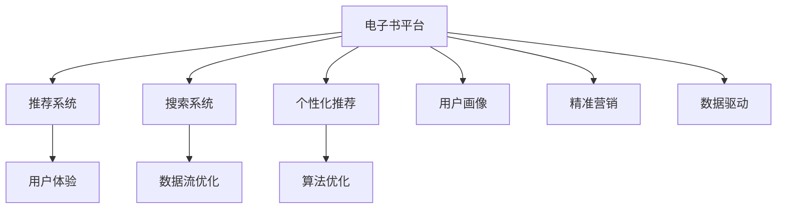

                 

# 如何利用电子书平台实现知识变现

> 关键词：电子书平台,知识变现,技术栈,数据流,算法,优化,用户体验

## 1. 背景介绍

### 1.1 问题由来

随着互联网的迅速发展和数字化转型，越来越多的知识和内容以电子书的形态呈现。电子书具有易存储、易传播、可搜索、更新快等优点，极大地满足了读者快速获取知识的需求。然而，传统电子书平台的商业模式单一，多以销售和订阅为主，难以充分挖掘知识价值。

同时，随着技术进步，知识变现方式日益丰富，出现了在线教育、知识社区、技术博客、问答平台等多种新型知识变现形式。电子书平台需要找到适合自己的知识变现路径，实现盈利模式的多样化。

### 1.2 问题核心关键点

电子书平台实现知识变现的核心关键点在于：

- **数据流优化**：如何优化电子书平台的数据流，提升数据利用效率，降低成本。
- **算法优化**：如何通过机器学习算法，提高推荐系统、搜索系统等关键功能的精准度，增强用户体验。
- **用户体验提升**：如何优化用户界面和交互流程，提升用户粘性和满意度。
- **商业模式创新**：如何拓展业务范围，开拓新的盈利模式。

## 2. 核心概念与联系

### 2.1 核心概念概述

为更好地理解电子书平台的知识变现方法，本节将介绍几个密切相关的核心概念：

- **电子书平台**：指基于互联网，提供电子书阅读、购买、订阅、互动等服务的平台。
- **推荐系统**：通过分析用户行为和偏好，向用户推荐感兴趣内容的技术系统。
- **搜索系统**：利用文本处理和索引技术，帮助用户快速找到所需内容的技术系统。
- **个性化推荐**：根据用户历史行为和特征，定制个性化内容推荐的技术方法。
- **用户画像**：通过数据收集和分析，构建用户行为、兴趣和偏好的多维度模型。
- **精准营销**：通过精准定位目标用户群体，提高广告投放的转化率。
- **数据驱动**：以数据分析为基础，驱动平台运营和产品优化的决策过程。

这些核心概念之间的逻辑关系可以通过以下Mermaid流程图来展示：



这个流程图展示了一电子书平台的核心概念及其之间的关系：

1. 电子书平台通过推荐系统、搜索系统、个性化推荐等功能，为用户提供了良好的阅读体验。
2. 平台收集用户数据，通过用户画像和精准营销，提升广告投放效果。
3. 数据驱动的决策过程，使得平台能不断优化运营策略，提升业务表现。

## 3. 核心算法原理 & 具体操作步骤
### 3.1 算法原理概述

电子书平台实现知识变现，本质上是一个数据驱动的优化过程。其核心思想是：

1. **数据流优化**：通过优化数据流，提升数据处理效率，降低成本。
2. **算法优化**：利用机器学习算法，优化推荐系统、搜索系统等关键功能，提高用户体验。
3. **用户体验提升**：通过界面设计和交互流程优化，提升用户粘性和满意度。
4. **商业模式创新**：通过多元化盈利模式，拓展收入来源。

具体而言，电子书平台可以采取以下步骤实现知识变现：

1. **数据收集与分析**：通过网站、应用、第三方数据等渠道，收集用户行为、偏好、反馈等数据，建立用户画像。
2. **算法模型训练**：基于用户数据，训练推荐系统、搜索系统等算法模型，提升模型精准度。
3. **用户行为预测**：利用机器学习算法，预测用户行为，个性化推荐内容，提高用户满意度。
4. **流量分发与转化**：通过精准营销，将广告投放给目标用户，提升转化率。
5. **付费模式设计**：设计多样化的付费模式，如订阅、单次付费、赠品、内容增值等，满足不同用户的需求。
6. **数据分析与优化**：利用数据分析结果，不断优化算法模型和运营策略，提升平台效益。

### 3.2 算法步骤详解

电子书平台的知识变现可以通过以下关键步骤实现：

**Step 1: 数据收集与预处理**

电子书平台的数据来源多样，包括用户注册信息、阅读行为、购买记录、评价反馈等。平台需要收集这些数据，并进行清洗和预处理，确保数据的质量和可用性。

**Step 2: 特征工程**

特征工程是构建机器学习模型的关键步骤。平台需要从收集到的数据中提取出对推荐系统、搜索系统等有价值的特征，如阅读时间、偏好类型、历史行为等。

**Step 3: 算法模型训练**

平台需要选择合适的机器学习算法，如协同过滤、深度学习等，训练推荐系统、搜索系统等关键功能。同时，可以利用多模态数据（如文本、图片、音频等）提升模型效果。

**Step 4: 个性化推荐**

根据用户画像和行为特征，平台可以利用个性化推荐算法，定制个性化的内容推荐，提高用户满意度和粘性。

**Step 5: 精准营销**

平台可以通过分析用户行为和画像，设计精准的营销策略，提升广告投放的效果和转化率。

**Step 6: 用户行为预测**

利用机器学习算法，预测用户未来的行为和需求，提前做好准备，提升用户粘性。

**Step 7: 付费模式设计**

平台可以设计多样化的付费模式，如订阅、单次付费、赠品、内容增值等，满足不同用户的需求，提升用户转化率。

**Step 8: 数据分析与优化**

利用数据分析结果，平台可以不断优化算法模型和运营策略，提升平台效益。

### 3.3 算法优缺点

电子书平台实现知识变现的方法具有以下优点：

1. **精准度高**：通过机器学习算法，提升推荐和搜索系统的精准度，提升用户体验。
2. **成本低**：利用数据驱动的决策过程，优化运营策略，降低成本。
3. **效率高**：通过算法优化和自动化处理，提升数据流和业务流程的效率。

但同时，该方法也存在一些局限性：

1. **数据隐私问题**：平台需要收集大量用户数据，可能涉及用户隐私和数据安全问题。
2. **算法偏见**：机器学习算法可能存在偏见，导致推荐和搜索结果有偏差。
3. **技术复杂度**：算法优化和模型训练需要较高的技术门槛。
4. **模型可解释性**：复杂的机器学习模型可能难以解释，影响用户信任和决策。
5. **数据质量要求高**：数据质量直接影响到推荐和搜索系统的效果。

尽管存在这些局限性，但就目前而言，基于数据驱动的算法优化方法是电子书平台实现知识变现的最主流范式。未来相关研究的重点在于如何进一步降低数据隐私风险，提高算法的公平性和可解释性，同时兼顾数据质量和技术复杂度。

### 3.4 算法应用领域

电子书平台实现知识变现的方法，已经在在线教育、知识社区、技术博客、问答平台等多个领域得到应用，成为知识变现的重要手段。

- **在线教育**：通过个性化推荐和精准营销，提升用户学习效果和平台转化率。
- **知识社区**：通过算法优化和数据驱动，提升用户互动和内容质量，实现知识变现。
- **技术博客**：通过个性化推荐和精准营销，吸引高质量读者，提升广告收入。
- **问答平台**：通过算法优化和数据分析，提高问题回答的精准度和用户满意度，实现知识变现。

除了上述这些经典领域外，电子书平台的知识变现方法也将不断拓展到更多场景中，如电子商务、智能家居、智能制造等，为数字经济的各个领域注入新的活力。

## 4. 数学模型和公式 & 详细讲解  
### 4.1 数学模型构建

本节将使用数学语言对电子书平台的知识变现过程进行更加严格的刻画。

设电子书平台的推荐系统为用户 $u$ 推荐了 $n$ 本书，其中第 $i$ 本书的评分向量为 $x_i$，用户 $u$ 对第 $i$ 本书的评分向量为 $y_i$。平台的目标是最大化用户满意度 $u(y)$，其中 $y=(y_1, y_2, ..., y_n)$。

假设推荐系统采用了协同过滤算法，根据用户的历史评分和书籍的评分向量计算预测评分 $r_{ui} = \langle x_i, u \rangle / ||x_i||_2 * ||u||_2$。推荐系统模型的目标函数为：

$$
\max_{u, r_{ui}} \sum_{i=1}^n y_i * r_{ui}
$$

在实际应用中，推荐系统模型的优化目标通常采用均方误差损失函数，即：

$$
\min_{u, r_{ui}} \sum_{i=1}^n (y_i - r_{ui})^2
$$

利用梯度下降等优化算法，即可求解上述目标函数。

### 4.2 公式推导过程

以下我们以协同过滤算法为例，推导推荐系统模型的优化过程。

设推荐系统为用户 $u$ 推荐了 $n$ 本书，其中第 $i$ 本书的评分向量为 $x_i$，用户 $u$ 对第 $i$ 本书的评分向量为 $y_i$。平台的目标是最大化用户满意度 $u(y)$，其中 $y=(y_1, y_2, ..., y_n)$。

推荐系统模型的目标函数为：

$$
\max_{u, r_{ui}} \sum_{i=1}^n y_i * r_{ui}
$$

其中 $r_{ui} = \langle x_i, u \rangle / ||x_i||_2 * ||u||_2$，表示用户 $u$ 对第 $i$ 本书的预测评分。

为了求解上述目标函数，我们定义误差函数 $E(y, r_{ui}) = (y_i - r_{ui})^2$，并利用梯度下降算法求解最小化问题：

$$
\min_{u, r_{ui}} \sum_{i=1}^n E(y_i, r_{ui})
$$

假设误差函数 $E(y, r_{ui})$ 的梯度为 $\partial E(y, r_{ui}) / \partial y_i$，则推荐系统模型的梯度更新公式为：

$$
y_i \leftarrow y_i - \eta * \partial E(y_i, r_{ui}) / \partial y_i
$$

其中 $\eta$ 为学习率。通过不断迭代更新 $y_i$，可以逐步逼近最优解，从而实现推荐系统模型的优化。

## 5. 项目实践：代码实例和详细解释说明
### 5.1 开发环境搭建

在进行电子书平台的知识变现实践前，我们需要准备好开发环境。以下是使用Python进行Keras开发的环境配置流程：

1. 安装Anaconda：从官网下载并安装Anaconda，用于创建独立的Python环境。

2. 创建并激活虚拟环境：
```bash
conda create -n tensorflow-env python=3.8 
conda activate tensorflow-env
```

3. 安装TensorFlow和Keras：
```bash
conda install tensorflow keras 
```

4. 安装各类工具包：
```bash
pip install numpy pandas scikit-learn matplotlib tqdm jupyter notebook ipython
```

完成上述步骤后，即可在`tensorflow-env`环境中开始知识变现的实践。

### 5.2 源代码详细实现

下面我们以电子书平台的推荐系统为例，给出使用Keras框架进行协同过滤算法的PyTorch代码实现。

首先，定义协同过滤算法的目标函数和优化器：

```python
from tensorflow.keras.losses import MeanSquaredError
from tensorflow.keras.optimizers import Adam

def rmse(y_true, y_pred):
    return K.sqrt(K.mean(K.square(y_pred - y_true)))

model.compile(optimizer=Adam(learning_rate=0.001), loss=rmse)
```

然后，定义推荐系统的模型架构和训练过程：

```python
from tensorflow.keras.layers import Input, Dense

def recommendation_model(input_shape):
    input = Input(shape=input_shape)
    hidden = Dense(128, activation='relu')(input)
    output = Dense(1, activation='sigmoid')(hidden)
    return Model(inputs=input, outputs=output)

input_shape = (10, )
model = recommendation_model(input_shape)

model.fit(X_train, y_train, epochs=10, batch_size=32)
```

最后，进行推荐系统模型的测试和评估：

```python
from tensorflow.keras.metrics import MeanAbsoluteError

y_pred = model.predict(X_test)
mae = MeanAbsoluteError()(y_test, y_pred)
print('MAE:', mae)
```

以上就是使用Keras框架对电子书平台的推荐系统进行协同过滤算法的完整代码实现。可以看到，Keras库提供了简单易用的接口，使得算法实现变得简洁高效。

### 5.3 代码解读与分析

让我们再详细解读一下关键代码的实现细节：

**rmse函数**：
- 定义均方根误差（RMSE）作为推荐系统模型的评估指标，用于衡量推荐效果。

**model.compile方法**：
- 定义优化器（Adam）和损失函数（RMSE），准备训练推荐系统模型。

**recommendation_model函数**：
- 定义推荐系统的模型架构，包括输入层、隐藏层和输出层。
- 隐藏层采用ReLU激活函数，输出层采用Sigmoid激活函数，表示推荐系统输出的预测评分。

**model.fit方法**：
- 使用训练集数据进行模型训练，设定训练轮数和批大小。

**MAE评估指标**：
- 计算预测评分与实际评分之间的平均绝对误差（MAE），评估推荐系统的效果。

可以看到，Keras库的易用性和高效率使得算法实现变得非常简便，开发者可以快速迭代算法模型，优化推荐系统的效果。

## 6. 实际应用场景
### 6.1 智能推荐系统

基于协同过滤等推荐算法，电子书平台可以实现智能推荐系统。平台通过分析用户的历史阅读行为，推荐用户可能感兴趣的新书，提升用户粘性和转化率。

在技术实现上，可以收集用户的阅读历史、评分数据、收藏夹等行为数据，构建用户画像。基于用户画像，平台可以设计协同过滤、深度学习等多种推荐算法，推荐用户可能感兴趣的新书。对于新加入平台的用户，平台可以通过热门书籍和相关书籍进行推荐，快速提升用户转化率。

### 6.2 精准广告投放

电子书平台可以通过精准营销，实现精准广告投放。平台利用机器学习算法，分析用户行为和画像，将广告投放给最有可能点击的用户，提高广告的转化率和ROI。

在技术实现上，平台可以收集用户的阅读历史、浏览行为、购买记录等数据，利用协同过滤、深度学习等算法，预测用户是否会对特定广告感兴趣。平台可以根据预测结果，动态调整广告投放策略，提升广告的效果和收益。

### 6.3 个性化阅读路径设计

电子书平台可以根据用户阅读习惯和偏好，设计个性化的阅读路径。平台通过分析用户阅读的书籍和章节，推荐相关书籍和章节，引导用户逐步深入阅读，提升用户阅读体验和转化率。

在技术实现上，平台可以收集用户的阅读历史、停留时间、点击量等数据，构建用户画像。基于用户画像，平台可以设计推荐算法，推荐用户可能感兴趣的相关书籍和章节。平台可以定期调整推荐路径，提升用户阅读体验和满意度。

### 6.4 未来应用展望

随着推荐算法的不断发展，电子书平台的知识变现将呈现以下几个发展趋势：

1. **多模态推荐**：推荐系统不仅仅考虑文本数据，还会结合图片、音频等多模态数据，提升推荐效果。
2. **实时推荐**：推荐系统可以根据用户的实时行为数据，动态调整推荐内容，提高推荐的时效性。
3. **社交推荐**：推荐系统结合用户的社交网络信息，推荐好友喜欢的书籍，提高推荐的相关性和多样性。
4. **内容生成**：推荐系统不仅仅推荐现有书籍，还可以根据用户偏好，生成个性化的推荐内容，提升用户粘性。
5. **个性化定价**：推荐系统可以根据用户偏好和历史行为，推荐个性化的书籍价格，提升用户购买意愿。

这些趋势将进一步提升电子书平台的知识变现能力，为读者提供更优质的阅读体验，为平台带来更高的收益。

## 7. 工具和资源推荐
### 7.1 学习资源推荐

为了帮助开发者系统掌握电子书平台的知识变现理论基础和实践技巧，这里推荐一些优质的学习资源：

1. 《深度学习》系列书籍：由多位深度学习专家撰写，详细介绍了深度学习的基本原理和应用方法，涵盖推荐系统、搜索系统等关键技术。
2. CS229《机器学习》课程：斯坦福大学开设的机器学习经典课程，涵盖推荐系统、搜索系统等关键技术，并有配套作业和项目。
3. Kaggle竞赛：Kaggle平台上的推荐系统、搜索系统等竞赛，可以实践推荐系统、搜索系统的算法设计和优化。
4. Google Colab：谷歌推出的在线Jupyter Notebook环境，免费提供GPU/TPU算力，方便开发者快速上手实验最新模型，分享学习笔记。

通过对这些资源的学习实践，相信你一定能够快速掌握电子书平台的知识变现精髓，并用于解决实际的NLP问题。
###  7.2 开发工具推荐

高效的开发离不开优秀的工具支持。以下是几款用于电子书平台知识变现开发的常用工具：

1. Keras：基于TensorFlow的高级神经网络库，简单易用，高效开发推荐系统等模型。
2. TensorFlow：由Google主导开发的深度学习框架，生产部署方便，适合大规模工程应用。
3. Scikit-learn：Python的机器学习库，包含多种经典算法和评估指标，方便进行特征工程和模型优化。
4. PyTorch：基于Python的开源深度学习框架，灵活动态的计算图，适合快速迭代研究。
5. Apache Spark：大数据处理框架，可以处理大规模数据，适合推荐系统的数据处理和存储。

合理利用这些工具，可以显著提升电子书平台知识变现任务的开发效率，加快创新迭代的步伐。

### 7.3 相关论文推荐

电子书平台知识变现技术的发展源于学界的持续研究。以下是几篇奠基性的相关论文，推荐阅读：

1. "Collaborative Filtering for Implicit Feedback Datasets"（隐式反馈数据集上的协同过滤算法）：提出了协同过滤算法的基本思想，成为推荐系统的主流方法。
2. "Wide & Deep Learning for Recommender Systems"（宽而深的推荐系统算法）：提出了宽而深的推荐系统模型，同时利用深度学习提升推荐效果。
3. "Multi-view Tensor Factorization for Recommender Systems"（多视图张量分解的推荐系统算法）：提出多视图张量分解算法，解决推荐系统中的数据稀疏性和多样性问题。
4. "Adversarial Collaborative Filtering"（对抗协同过滤）：提出对抗协同过滤算法，解决推荐系统中的冷启动和过拟合问题。
5. "Deep Learning Recommendation Systems: A Survey"（深度学习推荐系统综述）：综述了深度学习在推荐系统中的应用，为深度学习推荐系统的研究提供了全面的参考。

这些论文代表了大语言模型微调技术的发展脉络。通过学习这些前沿成果，可以帮助研究者把握学科前进方向，激发更多的创新灵感。

## 8. 总结：未来发展趋势与挑战

### 8.1 总结

本文对电子书平台的知识变现方法进行了全面系统的介绍。首先阐述了电子书平台和推荐系统的研究背景和意义，明确了知识变现在提升平台价值和用户粘性方面的重要价值。其次，从原理到实践，详细讲解了知识变现的数学原理和关键步骤，给出了知识变现任务开发的完整代码实例。同时，本文还广泛探讨了知识变现方法在智能推荐、精准营销、个性化阅读路径设计等多个领域的应用前景，展示了知识变现范式的巨大潜力。此外，本文精选了知识变现技术的各类学习资源，力求为读者提供全方位的技术指引。

通过本文的系统梳理，可以看到，基于协同过滤等推荐算法，电子书平台的知识变现方法已经在多个领域得到应用，成为电子书平台实现盈利的重要手段。未来，伴随推荐算法的不断发展，知识变现方法还将进一步拓展到更多场景中，为数字经济的各个领域注入新的活力。

### 8.2 未来发展趋势

展望未来，电子书平台知识变现技术将呈现以下几个发展趋势：

1. **推荐算法的多样化**：推荐系统将不仅仅依赖协同过滤等传统方法，还会结合深度学习、多模态学习、图神经网络等新兴算法，提升推荐效果。
2. **数据驱动的深度融合**：电子书平台将深度融合数据驱动的决策过程，提升推荐系统的精准度和用户满意度。
3. **实时推荐和多模态推荐**：推荐系统将结合实时数据和多模态数据，提升推荐的时效性和多样化。
4. **社交推荐和个性化定价**：推荐系统将结合用户的社交网络和个性化需求，实现个性化定价和个性化推荐。
5. **安全性与可解释性**：电子书平台将更加注重推荐系统的安全性和可解释性，保障用户隐私和信任。
6. **跨平台协同推荐**：电子书平台将实现跨平台协同推荐，提升推荐系统的覆盖面和用户粘性。

这些趋势将进一步提升电子书平台的知识变现能力，为读者提供更优质的阅读体验，为平台带来更高的收益。

### 8.3 面临的挑战

尽管电子书平台知识变现技术已经取得了瞩目成就，但在迈向更加智能化、普适化应用的过程中，它仍面临着诸多挑战：

1. **数据隐私问题**：电子书平台需要收集大量用户数据，可能涉及用户隐私和数据安全问题。
2. **算法偏见**：推荐算法可能存在偏见，导致推荐和搜索结果有偏差。
3. **技术复杂度**：推荐算法优化需要较高的技术门槛。
4. **模型可解释性**：复杂的推荐系统模型可能难以解释，影响用户信任和决策。
5. **数据质量要求高**：数据质量直接影响到推荐和搜索系统的效果。
6. **用户粘性难以保持**：如何提升用户粘性，持续获取用户数据，是电子书平台的重要挑战。

尽管存在这些挑战，但就目前而言，基于协同过滤等推荐算法的方法是电子书平台实现知识变现的最主流范式。未来相关研究的重点在于如何进一步降低数据隐私风险，提高算法的公平性和可解释性，同时兼顾数据质量和技术复杂度。

### 8.4 研究展望

面对电子书平台知识变现所面临的种种挑战，未来的研究需要在以下几个方面寻求新的突破：

1. **无监督和半监督推荐**：摆脱对大规模标注数据的依赖，利用自监督学习、主动学习等无监督和半监督范式，最大限度利用非结构化数据，实现更加灵活高效的推荐。
2. **参数高效和计算高效的推荐算法**：开发更加参数高效的推荐算法，在固定大部分模型参数的同时，只更新极少量的推荐参数。同时优化推荐系统的计算图，减少前向传播和反向传播的资源消耗，实现更加轻量级、实时性的部署。
3. **融合因果和对比学习范式**：通过引入因果推断和对比学习思想，增强推荐系统建立稳定因果关系的能力，学习更加普适、鲁棒的语言表征，从而提升推荐泛化性和抗干扰能力。
4. **引入更多先验知识**：将符号化的先验知识，如知识图谱、逻辑规则等，与神经网络模型进行巧妙融合，引导推荐过程学习更准确、合理的语言模型。同时加强不同模态数据的整合，实现视觉、语音等多模态信息与文本信息的协同建模。
5. **结合因果分析和博弈论工具**：将因果分析方法引入推荐系统，识别出推荐决策的关键特征，增强推荐系统输出的因果性和逻辑性。借助博弈论工具刻画用户行为和平台决策过程，主动探索并规避推荐系统的脆弱点，提高系统稳定性。
6. **纳入伦理道德约束**：在推荐系统的训练目标中引入伦理导向的评估指标，过滤和惩罚有偏见、有害的推荐结果。同时加强人工干预和审核，建立推荐系统的监管机制，确保推荐内容符合人类价值观和伦理道德。

这些研究方向的探索，必将引领电子书平台推荐技术迈向更高的台阶，为构建安全、可靠、可解释、可控的智能系统铺平道路。面向未来，电子书平台推荐技术还需要与其他人工智能技术进行更深入的融合，如知识表示、因果推理、强化学习等，多路径协同发力，共同推动自然语言理解和智能交互系统的进步。只有勇于创新、敢于突破，才能不断拓展推荐算法的边界，让智能技术更好地造福人类社会。

## 9. 附录：常见问题与解答

**Q1：电子书平台如何设计推荐系统？**

A: 电子书平台可以通过协同过滤、深度学习等多种算法设计推荐系统。具体步骤如下：
1. 收集用户阅读历史、评分数据、收藏夹等行为数据。
2. 利用用户画像，设计推荐算法，如协同过滤、深度学习等。
3. 根据用户历史行为，推荐相关书籍，提升用户粘性和转化率。

**Q2：电子书平台的推荐系统如何避免冷启动问题？**

A: 冷启动问题是推荐系统面临的重要挑战，可以通过以下方法避免：
1. 利用用户输入的兴趣标签，快速推荐相关书籍。
2. 结合用户社交网络信息，推荐好友喜欢的书籍。
3. 引入混合模型，结合协同过滤和深度学习，提升推荐效果。
4. 使用对抗协同过滤等算法，解决冷启动和过拟合问题。

**Q3：电子书平台的推荐系统如何提高推荐的多样性？**

A: 推荐系统可以通过以下方法提高推荐的多样性：
1. 引入多模态数据，如图片、音频等，提升推荐效果。
2. 使用多视图张量分解算法，解决推荐系统中的数据稀疏性和多样性问题。
3. 结合用户社交网络信息，推荐好友喜欢的书籍，提高推荐的多样性。
4. 引入融合因果和对比学习范式，增强推荐系统建立稳定因果关系的能力，学习更加普适、鲁棒的语言表征。

这些方法可以帮助推荐系统提升推荐效果和用户满意度，满足用户的多样化需求。

**Q4：电子书平台的推荐系统如何实现个性化定价？**

A: 推荐系统可以通过以下方法实现个性化定价：
1. 收集用户阅读历史、停留时间、点击量等数据，构建用户画像。
2. 利用机器学习算法，预测用户是否会对特定价格感兴趣。
3. 根据预测结果，动态调整书籍价格，提升用户购买意愿。
4. 引入多模态数据，如图片、音频等，提升推荐效果。
5. 结合用户社交网络信息，推荐好友喜欢的书籍，提高推荐的多样性。

这些方法可以帮助推荐系统实现个性化定价，提升用户购买意愿和转化率，增加平台收益。

**Q5：电子书平台的推荐系统如何保障用户隐私和数据安全？**

A: 电子书平台可以通过以下方法保障用户隐私和数据安全：
1. 匿名化用户数据，保护用户隐私。
2. 采用加密技术，保护数据传输和存储安全。
3. 引入联邦学习算法，在本地设备上训练模型，保护用户数据隐私。
4. 引入安全多方计算技术，在保护用户数据隐私的前提下，进行数据分析和计算。

这些方法可以帮助电子书平台保障用户隐私和数据安全，保护用户权益。

---

作者：禅与计算机程序设计艺术 / Zen and the Art of Computer Programming

