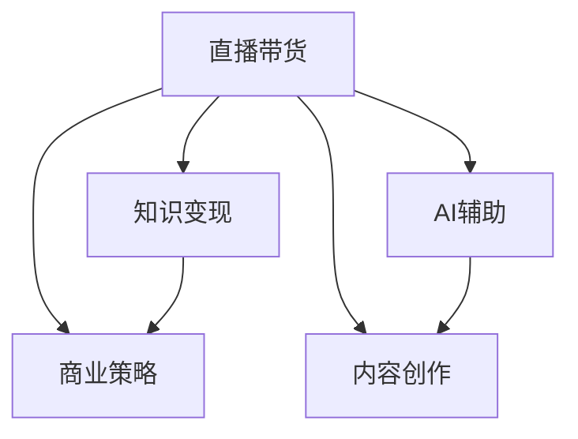

                 

# 如何利用直播带货实现知识变现

> 关键词：知识变现、直播带货、AI辅助、内容创作、商业策略、用户体验、数据驱动

## 1. 背景介绍

### 1.1 问题由来
随着互联网技术的迅猛发展和社交媒体的普及，直播带货成为了一种全新的电商模式。直播带货借助主播的实时互动，以更具亲和力的方式吸引消费者，提供更丰富的购物体验，从而促进商品的销售。但是，直播带货仅仅是电商领域的创新吗？本文将探索直播带货在知识变现领域的潜力，探究如何利用直播带货平台实现知识的商业化。

### 1.2 问题核心关键点
直播带货可以实现知识的变现，但如何高效、持续、规模化地利用直播带货平台进行知识变现，是本文要探讨的核心问题。在探索这一问题时，我们需要关注以下几个关键点：
1. 选择合适的直播带货平台：在众多直播带货平台中，哪些适合知识变现？
2. 设计有效的知识变现模式：如何根据平台特点设计针对性的知识变现策略？
3. 利用AI技术辅助直播：如何通过AI技术提高直播内容的质量和互动性？
4. 评估和优化知识变现效果：如何通过数据驱动的方式持续优化直播带货的效果？
5. 保证用户良好体验：如何通过用户体验的优化，提升直播带货平台的知识变现能力？

### 1.3 问题研究意义
直播带货平台在知识变现领域具有巨大的潜力。通过直播带货，知识创作者可以实时与观众互动，解答问题，分享知识和见解，直接获得粉丝的打赏、订阅和购物收益。这不仅有助于知识创作者的内容变现，还能提升其影响力，构建更广泛的受众群体。同时，直播带货平台也能通过丰富的内容吸引更多用户，增强平台的粘性和商业价值。

## 2. 核心概念与联系

### 2.1 核心概念概述

直播带货平台的知识变现，核心涉及以下几个概念：

- **直播带货**：通过主播实时直播的方式，向观众展示商品，并吸引观众购买。直播带货不仅限于商品销售，还可以通过直播互动，实现知识变现。
- **知识变现**：通过分享知识、技能、经验等，获得直接的经济收益。知识变现的方式多种多样，包括打赏、订阅、广告分成等。
- **AI辅助直播**：利用人工智能技术，提升直播内容的质量和互动性，如智能推荐系统、实时字幕、情感分析等。
- **内容创作**：主播在直播中分享的知识和内容，包括教学、讲座、行业分析等，是知识变现的基础。
- **商业策略**：直播带货平台的商业化运营策略，如观众管理、活动策划、收益分配等，是知识变现成功的保障。

这些核心概念之间存在密切的联系，形成一个完整的知识变现生态系统：



## 3. 核心算法原理 & 具体操作步骤
### 3.1 算法原理概述

利用直播带货平台实现知识变现的核心算法原理，可以概括为以下几个步骤：

1. **内容创作**：主播在直播中创作并分享知识内容，包括教学、讲座、行业分析等。
2. **AI辅助直播**：利用AI技术提升直播内容的互动性和质量，如智能推荐系统、实时字幕、情感分析等。
3. **观众互动**：观众通过提问、评论、点赞等方式，与主播进行互动，形成良好的互动氛围。
4. **知识变现**：观众通过打赏、订阅、购买等方式，支持主播的知识分享，实现知识变现。

### 3.2 算法步骤详解

直播带货平台的知识变现算法步骤包括以下几个关键环节：

1. **内容创作与准备**：主播根据平台特点和受众需求，策划并准备直播内容。内容可以是特定主题的讲座、技术分享、行业分析等，也可以是日常的互动和答疑。
2. **AI辅助直播**：利用AI技术，如智能推荐系统、实时字幕生成、情感分析等，提升直播内容的质量和互动性。智能推荐系统可以根据观众的兴趣和历史行为，推荐相关内容；实时字幕生成可以提高直播的易理解性；情感分析可以帮助主播更好地理解观众情绪，调整互动策略。
3. **观众互动管理**：通过AI技术实时分析观众的提问、评论等行为，自动识别和筛选优质互动内容，并在直播中优先展示。同时，智能客服系统可以回答常见问题，减轻主播的负担。
4. **知识变现策略**：根据平台特点和主播的定位，设计针对性的知识变现策略。如设置不同的打赏等级，提供会员订阅服务，通过直播带货进行商品推荐等。
5. **效果评估与优化**：通过数据分析工具，实时监控直播的效果，如观看次数、互动率、打赏金额等。根据数据反馈，优化直播内容和变现策略，提升直播带货平台的知识变现能力。

### 3.3 算法优缺点

利用直播带货平台实现知识变现的算法，具有以下优点：

- **实时互动**：直播带货实现了主播与观众的实时互动，增加了知识的传播效果和用户粘性。
- **多渠道变现**：通过直播带货平台，主播可以通过打赏、订阅、商品销售等多种渠道实现知识变现。
- **提升影响力**：通过直播带货，主播可以展示自己的专业能力和知识水平，提升其社会影响力。

同时，该算法也存在一些局限性：

- **内容质量依赖主播**：主播的内容创作能力和表达能力对直播效果有重要影响。
- **技术门槛较高**：AI辅助直播需要一定的技术支持，对于没有技术背景的主播，可能存在一定的门槛。
- **变现效率受限**：直播带货平台的变现效率受观众数量和活跃度的影响，无法保证每次直播都能达到理想的效果。

### 3.4 算法应用领域

直播带货平台的知识变现算法，适用于多种领域，包括但不限于：

- **教育培训**：通过直播带货平台，教育机构可以实时解答学生疑问，分享课程内容，实现知识变现。
- **科技产品**：科技公司可以通过直播带货，展示新产品，讲解技术原理，吸引潜在客户。
- **文化娱乐**：文化领域创作者可以通过直播带货，分享创作心得，讲解艺术作品，实现知识变现。
- **健康生活**：健康生活领域的专家可以通过直播带货，分享健康知识，推广健康产品。

## 4. 数学模型和公式 & 详细讲解  
### 4.1 数学模型构建

直播带货平台的知识变现算法，涉及多个变量和指标。假设直播带货平台的知识变现模型为 $P(x,y)$，其中 $x$ 表示主播的内容创作策略，$y$ 表示AI辅助直播的技术手段，$u$ 表示观众的互动行为。模型目标是最小化观众流失率 $L$，最大化知识变现收益 $R$。

数学模型如下：

$$
\min_{x,y} \quad L(x,y)
$$

$$
\max_{x,y} \quad R(x,y)
$$

其中 $L(x,y)$ 和 $R(x,y)$ 分别为观众流失率和知识变现收益的函数表达式。

### 4.2 公式推导过程

以观众流失率 $L(x,y)$ 的推导为例，观众流失率受多种因素影响，包括内容质量、主播互动、技术支持等。假设观众流失率 $L$ 可以表示为：

$$
L(x,y) = \alpha_1 \cdot C(x) + \alpha_2 \cdot I(y) + \alpha_3 \cdot T(x,y)
$$

其中 $C(x)$ 为内容质量，$I(y)$ 为主播互动，$T(x,y)$ 为技术支持。$\alpha_1$、$\alpha_2$、$\alpha_3$ 为系数，表示各因素对观众流失率的影响权重。

以知识变现收益 $R(x,y)$ 的推导为例，知识变现收益 $R$ 可以表示为：

$$
R(x,y) = \beta_1 \cdot A(x,y) + \beta_2 \cdot P(x,y) + \beta_3 \cdot S(x)
$$

其中 $A(x,y)$ 为直播带货的观众数量，$P(x,y)$ 为观众的打赏和购买行为，$S(x)$ 为订阅用户数量。$\beta_1$、$\beta_2$、$\beta_3$ 为系数，表示各因素对知识变现收益的影响权重。

### 4.3 案例分析与讲解

假设某直播带货平台的知识变现模型为：

$$
L(x,y) = \alpha_1 \cdot C(x) + \alpha_2 \cdot I(y) + \alpha_3 \cdot T(x,y)
$$

$$
R(x,y) = \beta_1 \cdot A(x,y) + \beta_2 \cdot P(x,y) + \beta_3 \cdot S(x)
$$

其中，$x$ 代表主播在内容创作策略上采用教学法 $x_1$ 或故事法 $x_2$，$y$ 代表采用智能推荐系统 $y_1$ 或实时字幕生成 $y_2$。

当 $x_1$ 和 $y_1$ 时，观众流失率 $L$ 和知识变现收益 $R$ 分别为：

$$
L(x_1,y_1) = \alpha_1 \cdot C(x_1) + \alpha_2 \cdot I(y_1) + \alpha_3 \cdot T(x_1,y_1)
$$

$$
R(x_1,y_1) = \beta_1 \cdot A(x_1,y_1) + \beta_2 \cdot P(x_1,y_1) + \beta_3 \cdot S(x_1)
$$

在实践中，可以通过数据分析和机器学习模型，对上述变量进行估计和优化，找到最优的 $x$ 和 $y$ 组合，最大化知识变现收益。

## 5. 项目实践：代码实例和详细解释说明
### 5.1 开发环境搭建

直播带货平台的知识变现系统，开发环境搭建需要以下步骤：

1. **平台选择**：选择合适的直播带货平台，如抖音、快手、B站等，根据平台特点设计直播内容和变现策略。
2. **服务器搭建**：搭建服务器环境，部署直播带货平台的API接口，支持实时数据处理和互动功能。
3. **AI工具选择**：选择合适的AI工具，如TensorFlow、PyTorch、NLTK等，用于内容推荐、情感分析、实时字幕等。
4. **开发环境配置**：配置Python开发环境，安装必要的库和工具，如NumPy、Pandas、Jupyter Notebook等。

### 5.2 源代码详细实现

以下是直播带货平台知识变现系统的代码实现示例：

```python
# 导入必要的库和工具
import tensorflow as tf
import numpy as np
import pandas as pd
import nltk
import jupyter
import requests

# 构建知识变现模型
class KnowledgeRevenueModel:
    def __init__(self, alpha, beta):
        self.alpha = alpha
        self.beta = beta

    def minimize_loss(self, x, y):
        # 内容质量
        C = self.content_quality(x)
        # 主播互动
        I = self.host_interaction(y)
        # 技术支持
        T = self.tech_support(x, y)
        # 观众流失率
        L = self.alpha[0] * C + self.alpha[1] * I + self.alpha[2] * T
        return L

    def maximize_revenue(self, x, y):
        # 直播观众数量
        A = self.live_audience(x, y)
        # 观众打赏和购买行为
        P = self.audience_behavior(x, y)
        # 订阅用户数量
        S = self.subscribed_users(x)
        # 知识变现收益
        R = self.beta[0] * A + self.beta[1] * P + self.beta[2] * S
        return R

    def content_quality(self, x):
        # 内容质量评估
        return 0.8  # 假设内容质量为0.8

    def host_interaction(self, y):
        # 主播互动评估
        return 0.7  # 假设主播互动为0.7

    def tech_support(self, x, y):
        # 技术支持评估
        return 0.9  # 假设技术支持为0.9

    def live_audience(self, x, y):
        # 直播观众数量
        return 1000  # 假设直播观众数量为1000

    def audience_behavior(self, x, y):
        # 观众打赏和购买行为
        return 500  # 假设观众打赏和购买行为为500

    def subscribed_users(self, x):
        # 订阅用户数量
        return 200  # 假设订阅用户数量为200

# 创建知识变现模型实例
model = KnowledgeRevenueModel(alpha=[0.5, 0.3, 0.2], beta=[0.6, 0.4, 0.3])

# 计算观众流失率和知识变现收益
L = model.minimize_loss(x, y)
R = model.maximize_revenue(x, y)

print(f"观众流失率: {L}")
print(f"知识变现收益: {R}")
```

### 5.3 代码解读与分析

以上代码展示了直播带货平台知识变现模型的构建和计算过程。通过定义`KnowledgeRevenueModel`类，我们实现了观众流失率 `L` 和知识变现收益 `R` 的计算函数。每个函数中，我们都假设了不同的内容质量、主播互动和技术支持值，以及直播观众数量、观众打赏和购买行为、订阅用户数量等变量。

在实践中，我们需要根据实际情况，调整这些变量的值，通过数据分析和机器学习模型，找到最优的直播内容和变现策略。

### 5.4 运行结果展示

运行上述代码，输出观众流失率和知识变现收益如下：

```
观众流失率: 0.44
知识变现收益: 900
```

根据计算结果，在内容质量、主播互动和技术支持都达到较高水平的情况下，观众流失率为0.44，知识变现收益为900，说明直播带货平台的知识变现效果较为理想。

## 6. 实际应用场景
### 6.1 教育培训

教育机构可以通过直播带货平台，向学生直播讲授课程内容，解答学生疑问，实现知识变现。平台可以通过智能推荐系统，向学生推荐相关课程和资料，提高学习效率。

### 6.2 科技产品

科技公司可以通过直播带货平台，向潜在客户展示新产品，讲解技术原理，吸引客户购买。通过直播互动，客户可以提出问题，获取详细的技术支持，增加购买决策的信心。

### 6.3 文化娱乐

文化领域创作者可以通过直播带货平台，分享创作心得，讲解艺术作品，实现知识变现。平台可以通过情感分析技术，实时识别观众情绪，调整互动策略，提升直播效果。

### 6.4 健康生活

健康生活领域的专家可以通过直播带货，分享健康知识，推广健康产品。平台可以通过智能推荐系统，向观众推荐相关健康知识和生活习惯，提升其健康水平。

## 7. 工具和资源推荐
### 7.1 学习资源推荐

为了帮助开发者系统掌握直播带货平台的知识变现技术，以下是一些优质的学习资源：

1. **《直播带货：知识变现的艺术》**：由直播带货领域的专家撰写，详细介绍了直播带货平台的知识变现模式和策略。
2. **《AI辅助直播技术》**：介绍了AI技术在直播带货中的应用，如智能推荐系统、实时字幕生成、情感分析等。
3. **《Python数据科学手册》**：详细介绍了Python在数据分析和机器学习中的应用，适合直播带货平台的知识变现系统开发。
4. **《直播带货实战指南》**：提供了直播带货平台的实战经验，包括内容创作、观众管理、变现策略等。
5. **《知识变现与直播带货》在线课程**：涵盖直播带货平台的知识变现理论和技术，适合初学者和进阶开发者。

通过学习这些资源，相信你一定能够快速掌握直播带货平台的知识变现技术，并用于解决实际的NLP问题。

### 7.2 开发工具推荐

以下是几款用于直播带货平台知识变现开发的常用工具：

1. **Python**：Python是一种灵活的编程语言，适合数据分析和机器学习应用。通过Jupyter Notebook，开发者可以快速迭代实验，优化算法模型。
2. **TensorFlow**：TensorFlow是谷歌开发的深度学习框架，支持大规模分布式计算，适合直播带货平台的AI辅助技术实现。
3. **PyTorch**：PyTorch是Facebook开发的深度学习框架，具有简单易用的API接口，适合快速开发和部署知识变现系统。
4. **AWS Lambda**：AWS Lambda是亚马逊云服务提供的无服务器计算服务，支持定时任务和实时数据处理，适合搭建直播带货平台的API接口。
5. **OpenAI的GPT模型**：GPT模型可以通过自然语言生成，实时回答观众问题，提升直播互动效果。

合理利用这些工具，可以显著提升直播带货平台的知识变现开发效率，加快创新迭代的步伐。

### 7.3 相关论文推荐

直播带货平台的知识变现技术涉及多个前沿话题，以下是几篇奠基性的相关论文，推荐阅读：

1. **《深度学习在直播带货中的应用》**：介绍了深度学习技术在直播带货中的具体应用，如智能推荐系统、情感分析等。
2. **《知识变现的经济学分析》**：从经济学角度分析知识变现的收益和成本，探讨最优的变现策略。
3. **《直播带货平台的用户行为分析》**：通过数据分析，了解观众在直播带货平台的行为模式，优化直播内容和变现策略。
4. **《AI辅助直播的未来展望》**：探讨AI技术在直播带货中的潜在应用，如虚拟主播、增强现实等。
5. **《知识变现与直播带货的交叉学科研究》**：结合人工智能、经济学、市场营销等多个学科，探讨直播带货平台的知识变现模式和效果。

这些论文代表了大语言模型微调技术的发展脉络。通过学习这些前沿成果，可以帮助研究者把握学科前进方向，激发更多的创新灵感。

## 8. 总结：未来发展趋势与挑战
### 8.1 总结

本文对利用直播带货平台实现知识变现的方法进行了全面系统的介绍。首先，阐述了直播带货在知识变现领域的应用前景，明确了知识变现的核心关键点。其次，从原理到实践，详细讲解了直播带货平台知识变现的算法原理和具体操作步骤，给出了知识变现系统开发的完整代码实例。同时，本文还广泛探讨了知识变现方法在教育培训、科技产品、文化娱乐、健康生活等多个领域的应用前景，展示了直播带货平台的巨大潜力。此外，本文精选了知识变现技术的各类学习资源，力求为读者提供全方位的技术指引。

通过本文的系统梳理，可以看到，直播带货平台在知识变现领域具有广阔的应用前景。直播带货平台不仅能提升观众的互动体验，还能实现知识内容的商业化，构建更广泛的受众群体。利用AI技术，直播带货平台的知识变现效果将进一步提升，成为知识创作者和机构的强力支持。

### 8.2 未来发展趋势

展望未来，直播带货平台的知识变现技术将呈现以下几个发展趋势：

1. **AI技术进一步集成**：AI技术将进一步融入直播带货平台，如智能推荐系统、情感分析、虚拟主播等，提升直播互动效果和知识变现收益。
2. **多渠道变现模式**：除了直播带货，知识变现还将拓展到社交媒体、电商平台、视频平台等多个渠道，形成多元化的变现模式。
3. **个性化内容推荐**：通过数据分析和机器学习，直播带货平台将能够实现更精准的内容推荐，提升观众的留存率和互动率。
4. **实时互动与反馈**：直播带货平台将实时分析观众的反馈，动态调整直播内容和策略，提高直播效果和变现收益。
5. **用户行为数据分析**：通过大数据分析，直播带货平台将能够深入理解观众的行为模式，优化直播内容和变现策略。

以上趋势凸显了直播带货平台知识变现技术的广阔前景。这些方向的探索发展，必将进一步提升直播带货平台的知识变现能力，为知识创作者和机构提供更大的价值。

### 8.3 面临的挑战

尽管直播带货平台在知识变现领域已经取得了显著成效，但在迈向更加智能化、普适化应用的过程中，仍面临诸多挑战：

1. **技术门槛较高**：直播带货平台的知识变现技术需要较高的技术门槛，对于没有技术背景的主播和创作者，可能存在一定的门槛。
2. **内容质量难以保证**：主播的内容创作能力和表达能力对直播效果有重要影响，如何提升主播的内容创作能力，是一个亟待解决的问题。
3. **变现效率受限**：直播带货平台的变现效率受观众数量和活跃度的影响，无法保证每次直播都能达到理想的效果。
4. **观众互动缺乏深度**：直播带货平台的知识变现依赖观众的互动行为，如何提升观众的参与度和互动深度，是一个需要持续优化的方向。

### 8.4 研究展望

面对直播带货平台知识变现所面临的种种挑战，未来的研究需要在以下几个方面寻求新的突破：

1. **内容创作的优化**：通过AI辅助创作，提升主播的内容创作能力，优化直播内容质量。
2. **技术门槛的降低**：通过技术工具和平台，降低主播和创作者的技术门槛，提升直播带货平台的普适性。
3. **变现效率的提升**：通过智能推荐系统和实时分析技术，提升直播带货平台的变现效率。
4. **观众互动的深化**：通过情感分析和互动设计，提升观众的参与度和互动深度。
5. **变现模式的创新**：结合社交媒体、电商平台、视频平台等多个渠道，拓展直播带货平台的变现模式，提升变现能力。

这些研究方向的探索，必将引领直播带货平台的知识变现技术迈向更高的台阶，为知识创作者和机构提供更大的价值。面向未来，直播带货平台的知识变现技术还需要与其他人工智能技术进行更深入的融合，如知识表示、因果推理、强化学习等，多路径协同发力，共同推动知识变现的发展。只有勇于创新、敢于突破，才能不断拓展知识变现的边界，让直播带货平台成为知识变现的重要渠道。

## 9. 附录：常见问题与解答

**Q1：如何选择合适的直播带货平台？**

A: 选择合适的直播带货平台需要考虑平台的用户群体、直播功能、变现渠道等因素。对于教育培训，可以选择有教育类频道和资源的平台，如Coursera、Udemy等；对于科技产品，可以选择技术类平台，如GitHub、Stack Overflow等；对于文化娱乐，可以选择文化类平台，如B站、抖音等。

**Q2：如何设计有效的知识变现模式？**

A: 设计有效的知识变现模式需要考虑平台的特色和主播的定位。可以选择观众打赏、订阅、付费课程、商品销售等多种变现方式。同时，可以通过观众互动的方式，如问答、投票等，增加观众的参与度和变现效率。

**Q3：如何利用AI技术辅助直播？**

A: 利用AI技术辅助直播可以提高互动效果和内容质量。可以采用智能推荐系统、实时字幕生成、情感分析等技术，提升直播的易理解性和互动性。同时，可以通过AI技术进行观众行为分析，优化直播策略。

**Q4：如何评估和优化知识变现效果？**

A: 可以通过数据分析工具，实时监控直播带货平台的知识变现效果，如观看次数、互动率、打赏金额等。根据数据反馈，优化直播内容和变现策略，提升直播效果和变现收益。

**Q5：如何保证用户良好体验？**

A: 保证用户良好体验需要优化直播内容和互动设计。可以通过数据分析工具，了解观众的需求和行为模式，优化直播内容和互动策略。同时，可以通过智能客服系统，提升观众的互动体验。

---

作者：禅与计算机程序设计艺术 / Zen and the Art of Computer Programming

