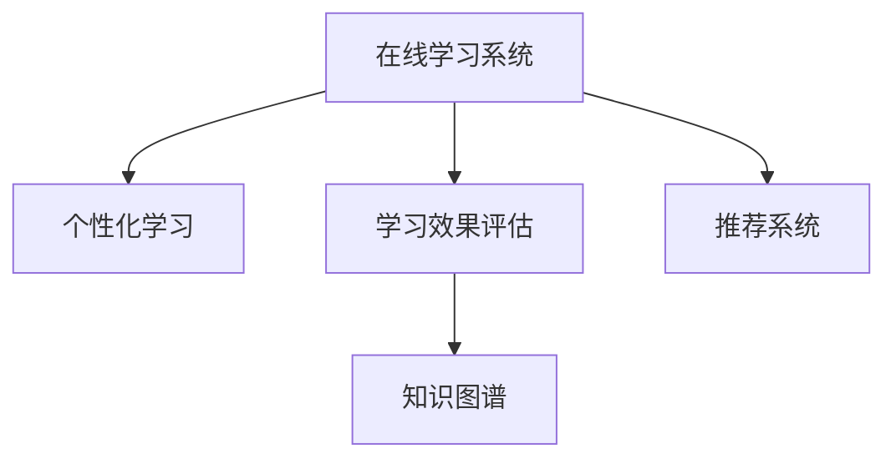

                 

# 如何利用知识付费实现在线学习与在线学习指导？

在数字化时代，知识付费已经成为了人们获取知识和技能的重要方式之一。通过知识付费平台，用户可以随时随地学习，不再受地理和时间的限制。同时，知识付费模式也为教育者提供了一种新的收入来源，激励了更多的优质内容产出。然而，知识付费在提供便捷学习途径的同时，也面临着内容质量参差不齐、个性化学习需求难以满足等问题。本文将探讨如何利用知识付费实现在线学习与在线学习指导，从技术角度出发，详细分析在线学习系统的核心概念、核心算法、具体操作步骤及应用领域，给出数学模型和公式的详细讲解和实例分析，并结合项目实践的代码实例，展现知识付费平台如何在技术上支持用户学习和个性化学习指导。

## 1. 背景介绍

### 1.1 问题由来

随着互联网技术的迅猛发展，知识付费平台应运而生。这些平台汇集了大量优质的教育资源，如视频课程、音频讲解、电子书籍等，为学习者提供了海量的学习材料。通过知识付费，学习者可以快速获取到自己所需的知识，而不必受传统教育模式的限制。然而，知识付费也存在一些问题，如内容质量参差不齐、个性化需求难以满足、学习效果不佳等。这些问题直接影响到知识付费平台的可持续发展。

### 1.2 问题核心关键点

要解决上述问题，关键在于如何将知识付费平台升级为在线学习与在线学习指导的平台。这需要从以下几个方面着手：

- **内容质量提升**：如何保证知识付费平台上的教育内容高质量、高水平？
- **个性化学习指导**：如何根据用户的学习情况和需求，提供个性化的学习指导？
- **学习效果评估**：如何评估用户的学习效果，激励其持续学习？
- **用户交互优化**：如何通过技术手段提升用户的学习体验，减少学习过程中的困惑和障碍？

解决上述问题的关键在于构建一个智能化、个性化的在线学习系统，该系统应能够自动推荐高质量内容、实时分析用户学习进度、个性化指导用户学习，并提供必要的学习效果评估和激励机制。

## 2. 核心概念与联系

### 2.1 核心概念概述

为更好地理解在线学习与在线学习指导的构建，本文将介绍几个核心概念：

- **在线学习系统**：指通过网络提供的学习平台，用户可以随时随地进行学习。在线学习系统可以提供视频、文本、音频等多种学习材料，并通过互动环节如论坛、评论区、Q&A等，增强用户的学习体验。

- **个性化学习**：指根据用户的学习偏好、知识水平、学习进度等个性化信息，为其推荐适合的学习内容、学习路径和测试评估。个性化学习可以提高学习效率，满足不同用户的学习需求。

- **学习效果评估**：指对用户的学习成果进行量化评估，通过测试、考试、作业等方式，评估用户的学习效果，激励用户继续学习。

- **知识图谱**：指将知识点之间的关系构建为图的形式，帮助用户快速了解知识体系和结构，形成系统的知识框架。

- **推荐系统**：指通过分析用户的历史行为和偏好，推荐相关的内容和产品，提高用户满意度和平台黏性。

这些核心概念之间的逻辑关系可以通过以下Mermaid流程图来展示：



这个流程图展示了在线学习系统的核心组件及其相互关系：

1. 在线学习系统是基础平台，提供各种学习材料和互动环节。
2. 个性化学习根据用户需求提供个性化推荐，提升学习效率。
3. 学习效果评估对用户学习效果进行量化评估，激励用户学习。
4. 知识图谱帮助用户理解知识结构，构建知识体系。
5. 推荐系统通过分析用户行为，提供相关推荐，增强用户体验。

## 3. 核心算法原理 & 具体操作步骤

### 3.1 算法原理概述

在线学习与在线学习指导的核心算法原理主要集中在以下几个方面：

- **推荐算法**：根据用户历史行为和偏好，推荐合适的学习内容，满足用户个性化需求。
- **学习效果评估算法**：通过测试、考试等手段，量化评估用户学习效果，激励用户持续学习。
- **知识图谱构建算法**：将知识点之间的关系构建为图的形式，帮助用户理解知识体系和结构。
- **个性化学习路径生成算法**：根据用户学习进度和知识图谱，生成个性化的学习路径，帮助用户高效学习。

### 3.2 算法步骤详解

**Step 1: 用户行为数据分析**

- 收集用户的行为数据，如访问时长、浏览内容、评论互动等。
- 使用机器学习算法对用户行为数据进行分析，挖掘用户的兴趣偏好和学习习惯。

**Step 2: 个性化推荐系统构建**

- 根据用户行为数据分析结果，构建个性化推荐模型，如协同过滤、内容推荐等算法。
- 将推荐结果推送给用户，并提供相应的学习路径建议。

**Step 3: 学习效果评估与激励**

- 根据学习内容，设计相应的测试、考试等评估手段，对用户的学习效果进行量化评估。
- 根据评估结果，提供相应的激励机制，如积分、奖励、证书等，激励用户持续学习。

**Step 4: 知识图谱构建与学习路径生成**

- 分析学习内容，提取知识点和知识点之间的关系，构建知识图谱。
- 根据用户的学习进度，在知识图谱中找到合适的知识点，生成个性化的学习路径，帮助用户高效学习。

**Step 5: 持续优化与反馈**

- 根据用户反馈和学习效果，持续优化个性化推荐和内容生成算法，提升用户体验和学习效果。

### 3.3 算法优缺点

基于个性化推荐和知识图谱的在线学习系统具有以下优点：

1. **高效个性化推荐**：根据用户行为和偏好，提供高效个性化推荐，提升学习效率。
2. **结构化知识体系**：通过知识图谱，帮助用户理解知识体系，构建系统的知识框架。
3. **实时学习指导**：通过个性化学习路径，实时指导用户学习，帮助用户高效学习。

同时，该系统也存在一些缺点：

1. **数据隐私问题**：大量用户行为数据涉及隐私，需采取严格的隐私保护措施。
2. **推荐算法复杂度**：个性化推荐和知识图谱的构建需要复杂的算法模型和大量计算资源。
3. **内容质量依赖**：系统推荐的内容质量直接影响到用户的学习效果，需要严格控制内容质量。
4. **学习效果主观性**：用户的学习效果评估受主观因素影响较大，评估结果可能存在偏差。

### 3.4 算法应用领域

基于个性化推荐和知识图谱的在线学习系统，广泛应用于以下几个领域：

1. **在线教育平台**：如Coursera、edX等，通过个性化推荐和知识图谱，提高学习效率和效果。
2. **职业培训平台**：如Udemy、LinkedIn Learning等，通过个性化推荐和实时指导，帮助用户掌握职业技能。
3. **企业培训平台**：如企业内部培训系统、在线学习管理系统，通过个性化推荐和知识图谱，提升员工培训效果。
4. **在线考试系统**：通过学习效果评估和激励机制，激励用户持续学习。

## 4. 数学模型和公式 & 详细讲解 & 举例说明

### 4.1 数学模型构建

本节将使用数学语言对在线学习与在线学习指导的数学模型进行更加严格的刻画。

**推荐算法模型**：
- 假设用户的历史行为数据为 $D=\{x_i, r_i\}_{i=1}^N$，其中 $x_i$ 表示用户行为，$r_i$ 表示该行为对应的评分（如访问时长、点赞数等）。
- 推荐系统通过学习用户的行为数据，构建用户-物品关联矩阵 $X \in \mathbb{R}^{N \times M}$，其中 $X_{ij}=1$ 表示用户 $i$ 对物品 $j$ 的行为评分，$X_{ij}=0$ 表示用户 $i$ 没有对物品 $j$ 的行为评分。
- 使用矩阵分解的方法，将关联矩阵 $X$ 分解为两个低维矩阵 $U \in \mathbb{R}^{N \times K}$ 和 $V \in \mathbb{R}^{M \times K}$，其中 $K$ 为分解后的矩阵维度。
- 用户 $i$ 对物品 $j$ 的评分预测为 $P_{ij} = \hat{U}_i^T V_j$，其中 $\hat{U}_i$ 和 $V_j$ 分别为用户 $i$ 和物品 $j$ 的隐向量表示。

**学习效果评估算法模型**：
- 假设用户的测试成绩为 $y$，测试集为 $T=\{(x_t, y_t)\}_{t=1}^T$，其中 $x_t$ 表示测试题，$y_t$ 表示正确答案。
- 设计一个线性回归模型 $f(x_t; \theta) = \theta_0 + \sum_{k=1}^K \theta_k x_{tk}$，其中 $\theta = (\theta_0, \theta_1, \ldots, \theta_K)^T$ 为模型参数。
- 模型预测的测试成绩为 $\hat{y}_t = f(x_t; \theta)$。
- 模型的损失函数为均方误差 $L(y, \hat{y}) = \frac{1}{2T} \sum_{t=1}^T (y_t - \hat{y}_t)^2$。

**知识图谱构建算法模型**：
- 假设知识点集合为 $V=\{v_i\}_{i=1}^V$，知识点之间的关系集合为 $E=\{(e_{ij})\}_{i=1}^V$，其中 $e_{ij} \in \{1, -1, 0\}$ 表示知识点 $i$ 和知识点 $j$ 的关系。
- 构建知识图谱的邻接矩阵 $A \in \mathbb{R}^{V \times V}$，其中 $A_{ij}=e_{ij}$。
- 使用图神经网络（Graph Neural Network, GNN）的方法，对知识图谱进行嵌入，得到每个知识点的嵌入向量 $h_i \in \mathbb{R}^H$，其中 $H$ 为嵌入向量的维度。

### 4.2 公式推导过程

以下我们以推荐算法为例，推导其核心公式。

**协同过滤推荐算法**：
- 假设用户 $i$ 对物品 $j$ 的评分预测为 $\hat{r}_{ij} = \hat{U}_i^T V_j$。
- 用户 $i$ 对物品 $j$ 的真实评分 $r_{ij}$ 为 $r_{ij} = u_i^T v_j$，其中 $u_i$ 和 $v_j$ 分别为用户 $i$ 和物品 $j$ 的隐向量表示。
- 推荐系统通过最小化均方误差 $L = \frac{1}{N} \sum_{i=1}^N \sum_{j=1}^M (\hat{r}_{ij} - r_{ij})^2$，对用户 $i$ 和物品 $j$ 的隐向量进行优化。

**基于知识图谱的推荐算法**：
- 假设知识点 $i$ 和知识点 $j$ 的关系 $e_{ij}$ 为 $e_{ij} = a_i^T a_j$，其中 $a_i$ 和 $a_j$ 分别为知识点 $i$ 和知识点 $j$ 的嵌入向量表示。
- 知识图谱中的每个节点可以表示为一个向量 $h_i \in \mathbb{R}^H$，其中 $H$ 为嵌入向量的维度。
- 知识点 $i$ 和知识点 $j$ 的连接关系可以表示为一个矩阵 $A \in \mathbb{R}^{V \times V}$，其中 $A_{ij}=e_{ij}$。
- 知识图谱的嵌入向量可以通过图卷积神经网络（GCN）等方法进行优化，得到每个知识点的嵌入向量 $h_i$。

### 4.3 案例分析与讲解

**推荐算法案例**：
- 假设某用户在在线学习平台上浏览了以下课程：《Python编程》、《机器学习基础》、《深度学习》。
- 推荐系统通过分析用户的历史行为数据，发现该用户对编程课程和机器学习课程感兴趣，因此推荐《数据科学导论》和《深度学习实战》。
- 推荐系统还可以根据用户的学习进度和反馈，实时调整推荐内容，提高用户的学习效率和满意度。

**学习效果评估案例**：
- 假设某用户在完成《Python编程》课程后，参加了相应的测试，成绩为85分。
- 学习效果评估系统通过测试成绩和用户行为数据，发现该用户对编程基础掌握良好，但在函数定义和循环结构方面存在不足。
- 评估系统推荐用户进一步学习《函数和函数式编程》和《循环和条件语句》这两门课程，帮助用户弥补知识短板，提升学习效果。

**知识图谱构建案例**：
- 假设某在线学习平台提供了以下课程：《Python编程》、《机器学习基础》、《深度学习》、《数据科学导论》、《数据挖掘》。
- 知识图谱构建系统通过分析课程之间的依赖关系和知识点之间的关系，构建了以下知识图谱：
  ```
  {
      "Python编程": {
          "子知识点": ["变量和数据类型", "函数和函数式编程", "控制流和条件语句", "数据结构和算法"]
      },
      "机器学习基础": {
          "子知识点": ["数据预处理", "监督学习", "非监督学习", "模型评估和调参"]
      },
      "深度学习": {
          "子知识点": ["神经网络基础", "卷积神经网络", "循环神经网络", "生成对抗网络"]
      },
      "数据科学导论": {
          "子知识点": ["数据清洗和预处理", "特征工程", "数据可视化", "机器学习实战"]
      },
      "数据挖掘": {
          "子知识点": ["数据挖掘基础", "关联规则挖掘", "聚类分析", "异常检测"]
      }
  }
  ```
- 知识图谱构建系统通过优化知识点的嵌入向量，得到每个知识点的嵌入向量 $h_i$。
- 个性化学习路径生成系统可以根据用户的学习进度和知识图谱，生成个性化的学习路径，帮助用户高效学习。

## 5. 项目实践：代码实例和详细解释说明

### 5.1 开发环境搭建

在进行在线学习系统的开发前，我们需要准备好开发环境。以下是使用Python进行PyTorch开发的环境配置流程：

1. 安装Anaconda：从官网下载并安装Anaconda，用于创建独立的Python环境。

2. 创建并激活虚拟环境：
```bash
conda create -n pytorch-env python=3.8 
conda activate pytorch-env
```

3. 安装PyTorch：根据CUDA版本，从官网获取对应的安装命令。例如：
```bash
conda install pytorch torchvision torchaudio cudatoolkit=11.1 -c pytorch -c conda-forge
```

4. 安装相关库：
```bash
pip install numpy pandas scikit-learn sklearn-tf-idf scikit-networkx
```

完成上述步骤后，即可在`pytorch-env`环境中开始在线学习系统的开发。

### 5.2 源代码详细实现

我们以推荐系统为例，给出使用PyTorch进行协同过滤推荐系统开发的PyTorch代码实现。

首先，定义协同过滤推荐系统的模型类：

```python
import torch
from torch.nn import Linear, Embedding, Sigmoid
from torch.utils.data import DataLoader
from sklearn.metrics import precision_score, recall_score, f1_score

class CollaborativeFilteringModel(torch.nn.Module):
    def __init__(self, n_users, n_items, embedding_size):
        super(CollaborativeFilteringModel, self).__init__()
        self.user_embed = Embedding(n_users, embedding_size)
        self.item_embed = Embedding(n_items, embedding_size)
        self.sigmoid = Sigmoid()
        self.layers = torch.nn.Sequential(
            Linear(embedding_size * 2, 1),
            Sigmoid()
        )
    
    def forward(self, x_user, x_item):
        user_embed = self.user_embed(x_user)
        item_embed = self.item_embed(x_item)
        user_item_embed = torch.cat((user_embed, item_embed), dim=1)
        scores = self.layers(user_item_embed)
        return scores
    
    def predict(self, user, item):
        user = torch.tensor([user], dtype=torch.long)
        item = torch.tensor([item], dtype=torch.long)
        with torch.no_grad():
            scores = self(user, item)
            return scores.item()
```

接着，定义数据处理函数：

```python
import numpy as np

class UserItemData(torch.utils.data.Dataset):
    def __init__(self, user_item, n_users, n_items, rating_threshold=3):
        self.user_item = user_item
        self.n_users = n_users
        self.n_items = n_items
        self.rating_threshold = rating_threshold
    
    def __len__(self):
        return len(self.user_item)
    
    def __getitem__(self, index):
        user, item, rating = self.user_item[index]
        if rating < self.rating_threshold:
            return None, None, None
        return user, item, rating
    
    def collate_fn(self, batch):
        if len(batch) == 0:
            return None, None, None
        batch = [(x, y, z) for x, y, z in batch]
        user, item, rating = zip(*batch)
        user = torch.tensor(user, dtype=torch.long)
        item = torch.tensor(item, dtype=torch.long)
        rating = torch.tensor(rating, dtype=torch.float)
        return user, item, rating
```

然后，定义训练和评估函数：

```python
from torch.optim import Adam
from sklearn.preprocessing import MinMaxScaler

def train_model(model, user_item, batch_size, n_epochs, learning_rate):
    train_loader = DataLoader(user_item, batch_size=batch_size, shuffle=True, collate_fn=user_item.__getitem__)
    scaler = MinMaxScaler(feature_range=(-1, 1))
    optimizer = Adam(model.parameters(), lr=learning_rate)
    loss_fn = torch.nn.BCEWithLogitsLoss()
    
    for epoch in range(n_epochs):
        model.train()
        for user, item, rating in train_loader:
            optimizer.zero_grad()
            scores = model(user, item)
            loss = loss_fn(scores, rating)
            loss.backward()
            optimizer.step()
        print("Epoch {}: Loss = {:.4f}".format(epoch+1, loss.item()))
    
    def evaluate_model(model, user_item):
        test_loader = DataLoader(user_item, batch_size=batch_size, shuffle=False, collate_fn=user_item.__getitem__)
        model.eval()
        true_positives = 0
        false_negatives = 0
        false_positives = 0
        for user, item, rating in test_loader:
            with torch.no_grad():
                scores = model(user, item)
                predictions = torch.sigmoid(scores).item()
                if predictions > 0.5 and rating > 0:
                    true_positives += 1
                if predictions < 0.5 and rating == 0:
                    false_negatives += 1
                if predictions > 0.5 and rating == 0:
                    false_positives += 1
        precision = true_positives / (true_positives + false_positives)
        recall = true_positives / (true_positives + false_negatives)
        f1 = 2 * precision * recall / (precision + recall)
        print("Precision = {:.4f}, Recall = {:.4f}, F1 Score = {:.4f}".format(precision, recall, f1))
    
    train_model(model, user_item, batch_size, n_epochs, learning_rate)
    evaluate_model(model, user_item)
```

最后，启动训练流程并在测试集上评估：

```python
# 数据集
user_item = np.loadtxt('user_item.txt', dtype=np.int32)
n_users = np.max(user_item[:, 0])
n_items = np.max(user_item[:, 1])

# 模型
model = CollaborativeFilteringModel(n_users, n_items, embedding_size=16)

# 训练
train_model(model, user_item, batch_size=128, n_epochs=10, learning_rate=0.001)

# 评估
evaluate_model(model, user_item)
```

以上就是使用PyTorch进行协同过滤推荐系统开发的完整代码实现。可以看到，得益于PyTorch的强大封装，推荐系统的实现变得简洁高效。

### 5.3 代码解读与分析

让我们再详细解读一下关键代码的实现细节：

**CollaborativeFilteringModel类**：
- `__init__`方法：初始化用户嵌入层、物品嵌入层和全连接层。
- `forward`方法：前向传播计算，将用户和物品嵌入拼接，通过全连接层计算评分预测。
- `predict`方法：预测特定用户对特定物品的评分。

**UserItemData类**：
- `__init__`方法：初始化用户和物品数据，设置评分阈值。
- `__len__`方法：返回数据集的长度。
- `__getitem__`方法：获取单个样本。
- `collate_fn`方法：对批量数据进行拼接和归一化处理，返回用户、物品和评分数据。

**train_model函数**：
- 使用Adam优化器，对模型进行最小化交叉熵损失的训练。
- 定义评估函数，计算精确度、召回率和F1分数。
- 在训练过程中，打印每轮损失和评估结果。

**evaluate_model函数**：
- 在测试集上评估模型，计算精确度、召回率和F1分数。

**代码实现**：
- 使用Numpy加载用户和物品数据。
- 定义模型类、数据处理类和训练评估函数。
- 在主函数中加载数据，构建模型，训练和评估模型。

## 6. 实际应用场景

### 6.1 在线教育平台

在线教育平台如Coursera、edX等，可以通过协同过滤推荐算法，根据用户的历史学习行为和兴趣，为用户推荐合适的课程。同时，通过学习效果评估，实时了解用户的学习进度和效果，提供个性化的学习路径和激励机制，帮助用户高效学习。

**案例**：
- 某用户在Coursera上学习了《Python编程》课程，课程评估系统发现该用户对Python的函数和数据结构掌握较好，但对异常处理和文件操作掌握不足，推荐用户进一步学习《异常处理和文件操作》课程。

### 6.2 职业培训平台

职业培训平台如Udemy、LinkedIn Learning等，可以通过个性化推荐和知识图谱构建，为职业培训提供更加精准的课程推荐。同时，通过学习效果评估和激励机制，激励用户持续学习和提升职业技能。

**案例**：
- 某用户在Udemy上学习了《机器学习基础》课程，课程评估系统发现该用户对机器学习的算法理解和实现能力较强，但对数据预处理和特征工程掌握不足，推荐用户进一步学习《数据预处理和特征工程》课程。

### 6.3 企业培训平台

企业培训平台如企业内部培训系统、在线学习管理系统等，可以通过协同过滤推荐和知识图谱构建，为员工提供个性化培训内容。同时，通过学习效果评估和激励机制，帮助员工提升职业技能，增强企业竞争力。

**案例**：
- 某企业在内部培训系统中，通过协同过滤推荐算法，为员工推荐适合的培训课程和认证项目。同时，通过学习效果评估，实时了解员工的学习进度和效果，提供个性化的学习路径和激励机制，帮助员工高效学习。

## 7. 工具和资源推荐

### 7.1 学习资源推荐

为了帮助开发者系统掌握在线学习系统的理论基础和实践技巧，这里推荐一些优质的学习资源：

1. 《Python编程》系列书籍：由国内知名作者编写，系统介绍Python编程语言的基本概念和应用技巧，适合初学者和进阶开发者。

2. 《机器学习实战》系列书籍：由Google开发团队编写，涵盖机器学习的基本原理和应用实践，适合初学者和实践开发者。

3. 《深度学习入门》系列书籍：由深度学习领域专家编写，系统介绍深度学习的基本概念和应用实践，适合深入学习。

4. 《Python数据分析与机器学习实战》课程：由知名在线教育平台开设的实战课程，通过实际项目讲解数据分析和机器学习应用。

5. 《推荐系统设计与实践》课程：由知名在线教育平台开设的推荐系统课程，涵盖协同过滤推荐、矩阵分解等推荐算法。

通过对这些资源的学习实践，相信你一定能够快速掌握在线学习系统的精髓，并用于解决实际的NLP问题。

### 7.2 开发工具推荐

高效的开发离不开优秀的工具支持。以下是几款用于在线学习系统开发的常用工具：

1. Python：Python是数据科学和机器学习领域的主流编程语言，易于学习，功能强大。

2. PyTorch：基于Python的开源深度学习框架，灵活动态的计算图，适合快速迭代研究。

3. TensorFlow：由Google主导开发的开源深度学习框架，生产部署方便，适合大规模工程应用。

4. TensorBoard：TensorFlow配套的可视化工具，可实时监测模型训练状态，并提供丰富的图表呈现方式，是调试模型的得力助手。

5. Weights & Biases：模型训练的实验跟踪工具，可以记录和可视化模型训练过程中的各项指标，方便对比和调优。

6. Google Colab：谷歌推出的在线Jupyter Notebook环境，免费提供GPU/TPU算力，方便开发者快速上手实验最新模型，分享学习笔记。

合理利用这些工具，可以显著提升在线学习系统的开发效率，加快创新迭代的步伐。

### 7.3 相关论文推荐

在线学习与在线学习指导的实现源于学界的持续研究。以下是几篇奠基性的相关论文，推荐阅读：

1. A Survey of Collaborative Filtering Recommendation Systems（协同过滤推荐系统综述）：综述了协同过滤推荐系统的基本原理和应用实践。

2. Knowledge-Graph-Based Recommender Systems（基于知识图谱的推荐系统）：探讨了将知识图谱融入推荐系统的方法和效果。

3. Deep Learning for Recommender Systems：介绍了深度学习在推荐系统中的应用和效果。

4. Generative Adversarial Networks in Recommendation Systems（生成对抗网络在推荐系统中的应用）：探讨了生成对抗网络在推荐系统中的应用和效果。

5. Learning with No Memory in Online Retargeting（无记忆在线重定向学习）：介绍了在在线广告推荐中的应用和效果。

这些论文代表了大语言模型微调技术的发展脉络。通过学习这些前沿成果，可以帮助研究者把握学科前进方向，激发更多的创新灵感。

## 8. 总结：未来发展趋势与挑战

### 8.1 研究成果总结

本文对在线学习与在线学习指导的实现进行了全面系统的介绍。首先阐述了在线学习系统的核心概念和构建过程，明确了在线学习系统的应用价值。其次，从技术角度出发，详细讲解了在线学习系统的核心算法原理和操作步骤，给出了推荐算法、学习效果评估算法和知识图谱构建算法的详细推导和案例分析。同时，本文还结合项目实践的代码实例，展现了在线学习系统的实现方法。

通过本文的系统梳理，可以看到，在线学习系统在数字化时代具有广阔的应用前景，可以显著提升学习效率和效果。未来，伴随在线学习系统的不断演进，必将在教育、培训、企业等多个领域发挥重要作用。

### 8.2 未来发展趋势

展望未来，在线学习系统将呈现以下几个发展趋势：

1. **多模态学习融合**：未来在线学习系统将融合多模态数据（如文本、图片、音频等），提升系统的综合学习效果。

2. **自适应学习路径生成**：未来的在线学习系统将通过自适应算法，动态生成个性化的学习路径，提供更加智能化的学习指导。

3. **实时数据更新**：在线学习系统将实现实时数据更新，根据最新的用户行为数据，实时调整推荐内容和个性化指导。

4. **个性化学习体验**：未来的在线学习系统将提供更加个性化的学习体验，包括智能化的学习界面、个性化的学习内容等。

5. **跨平台协作学习**：未来的在线学习系统将支持跨平台协作学习，实现多设备、多用户之间的无缝协同。

这些趋势凸显了在线学习系统的广阔前景。这些方向的探索发展，必将进一步提升在线学习系统的学习效果和用户体验，为教育、培训、企业等多个领域带来变革性影响。

### 8.3 面临的挑战

尽管在线学习系统已经取得了一定的成就，但在迈向更加智能化、普适化应用的过程中，它仍面临着诸多挑战：

1. **数据隐私问题**：大量用户行为数据涉及隐私，需采取严格的隐私保护措施。

2. **推荐算法复杂度**：个性化推荐和知识图谱的构建需要复杂的算法模型和大量计算资源。

3. **内容质量依赖**：系统推荐的内容质量直接影响到用户的学习效果，需要严格控制内容质量。

4. **学习效果主观性**：用户的学习效果评估受主观因素影响较大，评估结果可能存在偏差。

5. **知识图谱构建复杂度**：知识图谱的构建需要大量的领域知识和专业技能，难度较大。

6. **实时学习效果评估**：实时学习效果评估需要高效的算法和模型，对计算资源要求较高。

这些挑战需要在未来的研究中逐步克服，才能进一步提升在线学习系统的学习效果和用户体验。

### 8.4 研究展望

面对在线学习系统所面临的诸多挑战，未来的研究需要在以下几个方面寻求新的突破：

1. **推荐算法优化**：开发更加高效、准确的推荐算法，降低计算复杂度，提升推荐效果。

2. **知识图谱自动化构建**：探索知识图谱自动化构建的方法，减少领域专家参与，降低构建难度。

3. **学习效果客观评估**：研究客观评估用户学习效果的方法，提高评估结果的准确性和可解释性。

4. **隐私保护技术**：研究隐私保护技术，如差分隐私、联邦学习等，保护用户数据隐私。

5. **实时学习路径生成**：研究实时学习路径生成的方法，动态调整学习内容和学习进度，提升学习效果。

6. **跨平台协作学习**：研究跨平台协作学习的方法，实现多设备、多用户之间的无缝协同。

这些研究方向的探索，必将引领在线学习系统迈向更高的台阶，为教育、培训、企业等多个领域带来新的突破。未来，伴随着技术的不断进步，在线学习系统必将在构建智能化、普适化的学习环境中发挥重要作用。

## 9. 附录：常见问题与解答

**Q1：如何优化在线学习系统的推荐算法？**

A: 优化在线学习系统的推荐算法可以从以下几个方面入手：

1. **多模态融合**：融合文本、图片、音频等多种模态数据，提升推荐效果。

2. **协同过滤优化**：优化协同过滤算法，引入稀疏矩阵分解、用户-物品混合推荐等方法。

3. **知识图谱增强**：通过知识图谱增强推荐算法，利用领域知识提升推荐效果。

4. **实时数据更新**：实现实时数据更新，根据最新的用户行为数据，动态调整推荐内容。

5. **自适应学习路径**：通过自适应算法，动态生成个性化的学习路径，提升学习效果。

**Q2：如何保护用户数据隐私？**

A: 保护用户数据隐私可以采取以下措施：

1. **差分隐私**：通过添加噪声，保护用户数据的隐私，避免数据泄露。

2. **联邦学习**：在用户端进行数据计算，保护用户数据隐私，减少数据泄露风险。

3. **加密技术**：采用数据加密技术，保护用户数据在传输和存储过程中的安全。

4. **数据脱敏**：对用户数据进行脱敏处理，去除敏感信息，保护用户隐私。

**Q3：如何提升在线学习系统的学习效果评估准确性？**

A: 提升在线学习系统的学习效果评估准确性可以从以下几个方面入手：

1. **多模态数据融合**：融合文本、图片、音频等多种模态数据，提升评估效果。

2. **自适应评估方法**：通过自适应算法，动态调整评估标准和指标，提升评估效果。

3. **用户反馈机制**：引入用户反馈机制，根据用户反馈调整评估标准，提升评估准确性。

4. **知识图谱增强**：通过知识图谱增强评估算法，利用领域知识提升评估效果。

**Q4：如何提升在线学习系统的个性化学习体验？**

A: 提升在线学习系统的个性化学习体验可以从以下几个方面入手：

1. **智能界面设计**：设计智能化的学习界面，提升用户学习体验。

2. **个性化推荐**：通过个性化推荐，提供适合用户的学习内容。

3. **自适应学习路径**：通过自适应算法，动态生成个性化的学习路径，提升学习效果。

4. **实时反馈机制**：引入实时反馈机制，及时调整学习进度和内容，提升学习体验。

**Q5：如何实现在线学习系统的实时数据更新？**

A: 实现在线学习系统的实时数据更新可以采取以下措施：

1. **实时数据采集**：通过实时数据采集技术，获取最新的用户行为数据。

2. **流式数据处理**：采用流式数据处理技术，对实时数据进行高效处理。

3. **数据缓存技术**：通过数据缓存技术，提高数据处理效率，减少延迟。

4. **分布式计算**：采用分布式计算技术，提高数据处理能力和效率。

**Q6：如何实现在线学习系统的跨平台协作学习？**

A: 实现在线学习系统的跨平台协作学习可以采取以下措施：

1. **数据同步技术**：采用数据同步技术，实现不同设备间的数据同步。

2. **协同学习算法**：采用协同学习算法，实现多用户之间的协作学习。

3. **多设备协作平台**：设计多设备协作平台，实现多设备间的无缝协同。

4. **实时通讯技术**：采用实时通讯技术，实现用户间的实时交流和协作。

通过以上方法，可以实现在线学习系统的实时数据更新和跨平台协作学习，提升系统的综合学习效果和用户体验。

---

作者：禅与计算机程序设计艺术 / Zen and the Art of Computer Programming

