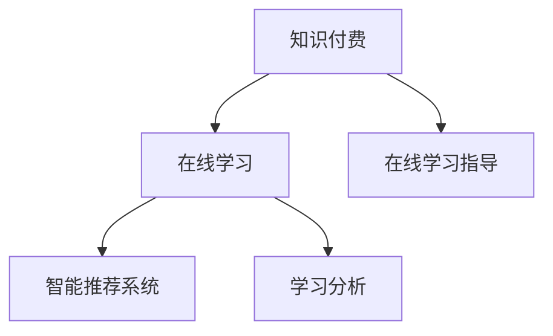

                 

## 1. 背景介绍

### 1.1 问题由来

在数字化时代，知识获取的方式发生了深刻变化。传统的线下课堂逐渐向线上化、个性化和互动化转变。在这种背景下，知识付费作为一种新兴的在线学习模式，通过付费订阅或按需购买的方式，为学习者提供了高效率、高质量的教育资源。但伴随着知识付费的普及，如何确保学习效果的最大化、提高在线学习指导的精准性和有效性，成为了一个亟待解决的问题。

### 1.2 问题核心关键点

在线学习的核心在于知识的传递和交流，而在线学习指导则更强调学习路径的规划、学习内容的个性化推荐和学习效果的反馈。本文旨在探讨如何利用知识付费机制，实现更加精准和有效的在线学习与指导，提升学习者的知识掌握水平和应用能力。

## 2. 核心概念与联系

### 2.1 核心概念概述

为更好地理解如何利用知识付费实现在线学习与指导，本节将介绍几个关键概念：

- 知识付费：指通过付费形式获取知识或服务的商业模式，常见于在线课程、咨询问答、阅读平台等。
- 在线学习：指利用互联网技术，通过视频、文本、音频等多种形式，实现知识的学习和交流。
- 在线学习指导：指通过教师、助教或AI技术，对在线学习者提供学习路径规划、学习内容推荐、学习效果评估等辅助服务，以提高学习效率和效果。
- 智能推荐系统：利用机器学习技术，根据用户的行为和偏好，自动推荐个性化的学习内容。
- 学习分析（Learning Analytics）：通过收集和分析学习者的行为数据，提供学习效果的评估和反馈，指导学习者调整学习策略。

这些核心概念之间的逻辑关系可以通过以下Mermaid流程图来展示：



这个流程图展示出在线学习与知识付费、在线学习指导、智能推荐系统、学习分析之间的联系：

1. 知识付费是保障在线学习质量的前提，它提供了高质量的教育资源。
2. 在线学习是知识传递的主要方式，通过多样化的教学手段，提供灵活、便捷的学习体验。
3. 在线学习指导通过个性化推荐和智能分析，提升了学习的针对性和效果。
4. 智能推荐系统利用算法，优化学习资源的推荐，提高学习者的满意度。
5. 学习分析通过数据驱动，评估学习效果，指导学习者调整学习策略，优化学习路径。

## 3. 核心算法原理 & 具体操作步骤

### 3.1 算法原理概述

利用知识付费实现在线学习与指导，本质上是一个结合了在线教育、机器学习、数据分析等多领域技术的应用场景。其核心算法原理包括：

1. **用户行为建模**：通过分析学习者的在线行为数据，建立用户画像，了解其学习偏好和需求。
2. **推荐算法**：利用协同过滤、基于内容的推荐、深度学习等算法，生成个性化的学习内容推荐列表。
3. **学习效果评估**：结合学习分析技术，通过数据收集和分析，评估学习者的学习效果，生成学习报告和反馈。
4. **学习路径规划**：根据学习者的学习进度和效果，动态调整学习路径，优化学习体验。

### 3.2 算法步骤详解

基于上述算法原理，实现在线学习与指导的步骤如下：

**Step 1: 数据收集与处理**

- 收集学习者的在线行为数据，包括观看视频时长、练习题目完成情况、阅读笔记等。
- 收集学习内容的相关数据，如视频时长、知识点的难易程度、题目难度等。
- 数据清洗和预处理，去除噪声和冗余信息，保证数据的质量和完整性。

**Step 2: 用户画像建立**

- 利用聚类、关联规则挖掘等技术，从行为数据中提取用户的兴趣、偏好和学习能力等特征。
- 建立用户画像，为后续的个性化推荐和路径规划提供依据。

**Step 3: 推荐系统设计**

- 选择合适的推荐算法，如协同过滤、基于内容的推荐、深度学习等，生成个性化学习内容推荐列表。
- 结合领域专家的知识，调整推荐算法参数，优化推荐效果。

**Step 4: 学习效果评估**

- 根据学习目标，设计评估指标，如掌握程度、应用能力、学习时间等。
- 通过学习分析技术，收集和分析学习者的行为数据，生成学习报告和反馈。

**Step 5: 学习路径规划**

- 根据学习者的学习进度和效果，动态调整学习路径，推荐适合的课程和资料。
- 结合学习效果评估，优化学习路径，确保学习者能够高效掌握知识。

**Step 6: 反馈与调整**

- 收集学习者的反馈，持续优化推荐算法和学习路径。
- 定期更新学习内容，保持平台的知识新鲜度。

### 3.3 算法优缺点

利用知识付费实现在线学习与指导的方法具有以下优点：

1. 个性化推荐：通过个性化的内容推荐，提升学习者学习的针对性和效率。
2. 学习效果评估：通过学习分析，及时了解学习者的学习效果，提供反馈和建议。
3. 灵活性高：在线学习打破了时间和空间的限制，提供了灵活的学习方式。

同时，该方法也存在以下局限性：

1. 数据隐私：学习者行为数据的收集和处理涉及隐私问题，需要确保数据的安全和合规。
2. 依赖技术：推荐算法和分析模型的效果依赖于技术实现，可能存在误推荐和分析偏差。
3. 知识更新：在线学习平台的知识库需要不断更新，保持与最新知识的同步。

尽管存在这些局限性，但就目前而言，利用知识付费机制实现在线学习与指导，仍是大势所趋，具有广泛的应用前景。

### 3.4 算法应用领域

利用知识付费实现在线学习与指导的方法，在多个领域得到了广泛应用：

- **教育培训**：为学生提供个性化学习资源和指导，提升学习效果。
- **职业技能提升**：为企业员工提供在线课程和指导，提升职业技能。
- **知识普及与传播**：利用知识付费平台，传播专业知识，普及科学文化。
- **健康管理**：提供在线健康课程和指导，帮助用户管理健康。

## 4. 数学模型和公式 & 详细讲解 & 举例说明

### 4.1 数学模型构建

本节将使用数学语言对利用知识付费实现在线学习与指导的过程进行更加严格的刻画。

假设学习者为 $U$，课程为 $C$，视频为 $V$，学习路径为 $P$，学习效果为 $E$。用 $U_{i,j}$ 表示学习者 $i$ 对课程 $j$ 的评分，$C_{j,k}$ 表示课程 $j$ 包含知识点 $k$ 的数量，$V_{j,v}$ 表示课程 $j$ 的视频时长，$P_{i,j,k}$ 表示学习者 $i$ 在课程 $j$ 上学习知识点 $k$ 的进度，$E_{i,j,k}$ 表示学习者 $i$ 在课程 $j$ 上学习知识点 $k$ 的掌握程度。

### 4.2 公式推导过程

以下我们以推荐算法为例，推导基于协同过滤的个性化推荐公式。

设 $U$ 为学习者集合，$C$ 为课程集合，$R_{U,C}$ 为学习者和课程的评分矩阵。定义用户 $i$ 对课程 $j$ 的评分 $r_{i,j}$ 为 $r_{i,j}=\frac{U_{i,j}}{\sqrt{s_{i}+1}\sqrt{s_{j}+1}}$，其中 $s_{i}$ 和 $s_{j}$ 分别为用户 $i$ 和课程 $j$ 的平均评分。

基于用户相似度的协同过滤推荐算法，根据公式：

$$
R_{U,C} \approx U_i\Phi(C)S\Phi^T(C)
$$

计算用户 $i$ 对课程 $j$ 的预测评分 $r_{i,j}'$。其中，$\Phi(C)$ 为课程的特征矩阵，$S$ 为用户相似度矩阵，$\Phi^T(C)$ 为其转置矩阵。

### 4.3 案例分析与讲解

以在线教育平台Coursera为例，分析其如何利用知识付费机制实现在线学习与指导：

- **数据收集与处理**：Coursera 收集学习者的课程浏览记录、视频观看时长、作业提交情况等数据。通过数据清洗和预处理，去除噪声和冗余信息，确保数据质量。
- **用户画像建立**：Coursera 利用协同过滤算法，分析学习者的行为数据，提取其学习偏好和兴趣。通过聚类分析，生成用户画像，为个性化推荐提供依据。
- **推荐系统设计**：Coursera 使用协同过滤和基于内容的推荐算法，生成个性化学习内容推荐列表。结合专家知识，调整算法参数，优化推荐效果。
- **学习效果评估**：Coursera 通过学习分析技术，收集和分析学习者的行为数据，生成学习报告和反馈。结合课程进度和掌握程度，动态调整学习路径。
- **学习路径规划**：Coursera 根据学习者的学习进度和效果，动态调整学习路径，推荐适合的课程和资料。结合学习效果评估，优化学习路径，确保学习者高效掌握知识。
- **反馈与调整**：Coursera 收集学习者的反馈，持续优化推荐算法和学习路径。定期更新课程内容，保持平台的知识新鲜度。

## 5. 项目实践：代码实例和详细解释说明

### 5.1 开发环境搭建

在进行在线学习与指导的实践前，我们需要准备好开发环境。以下是使用Python进行PyTorch开发的环境配置流程：

1. 安装Anaconda：从官网下载并安装Anaconda，用于创建独立的Python环境。

2. 创建并激活虚拟环境：
```bash
conda create -n pytorch-env python=3.8 
conda activate pytorch-env
```

3. 安装PyTorch：根据CUDA版本，从官网获取对应的安装命令。例如：
```bash
conda install pytorch torchvision torchaudio cudatoolkit=11.1 -c pytorch -c conda-forge
```

4. 安装Tensorflow：
```bash
pip install tensorflow
```

5. 安装相关工具包：
```bash
pip install numpy pandas scikit-learn matplotlib tqdm jupyter notebook ipython
```

完成上述步骤后，即可在`pytorch-env`环境中开始实践。

### 5.2 源代码详细实现

这里我们以在线课程推荐系统为例，给出使用PyTorch和Tensorflow实现个性化推荐的具体代码实现。

首先，定义推荐模型和用户行为数据：

```python
import torch
import tensorflow as tf
from tensorflow.keras.layers import Input, Embedding, Dense, Dot
from tensorflow.keras.models import Model

# 定义模型输入和输出
user_input = Input(shape=(1,), name='user')
course_input = Input(shape=(1,), name='course')
user_embed = Embedding(input_dim=100, output_dim=10)(user_input)
course_embed = Embedding(input_dim=100, output_dim=10)(course_input)
dot_product = Dot(axes=(1, 1))([user_embed, course_embed])

# 定义预测评分输出
predictions = Dense(1, activation='sigmoid')(dot_product)
model = Model(inputs=[user_input, course_input], outputs=predictions)
```

然后，定义推荐系统的训练和评估：

```python
# 准备训练数据
user_data = np.array([[1], [2], [3], [4]], dtype=np.float32)
course_data = np.array([[1], [2], [3], [4]], dtype=np.float32)
labels = np.array([[1], [0], [0], [0]], dtype=np.float32)

# 编译模型
model.compile(optimizer=tf.keras.optimizers.Adam(learning_rate=0.01),
              loss='binary_crossentropy',
              metrics=['accuracy'])

# 训练模型
model.fit([user_data, course_data], labels, epochs=10, batch_size=32)

# 评估模型
test_data = np.array([[5], [6], [7], [8]], dtype=np.float32)
test_labels = np.array([[0], [0], [1], [0]], dtype=np.float32)
model.evaluate([test_data, test_data], test_labels)
```

最后，使用训练好的模型进行预测推荐：

```python
# 预测推荐结果
recommendation = model.predict([[1], [5]])
print(recommendation)
```

以上就是使用PyTorch和Tensorflow实现在线课程推荐系统的完整代码实现。可以看到，利用深度学习技术，可以高效地实现个性化推荐，提升学习者的学习体验。

### 5.3 代码解读与分析

让我们再详细解读一下关键代码的实现细节：

**模型定义**：
- 使用Embedding层将用户和课程的ID映射到向量空间，得到用户和课程的嵌入表示。
- 使用Dot层计算用户和课程的向量点积，得到预测评分。
- 使用Dense层将预测评分转化为0-1之间的概率值，用于判断课程是否被推荐。

**训练与评估**：
- 准备训练数据，包含用户ID、课程ID和标签。
- 使用Adam优化器进行模型训练，损失函数为二分类交叉熵。
- 使用测试数据评估模型性能，计算准确率。

**推荐预测**：
- 使用训练好的模型，输入用户ID和课程ID，预测推荐结果。

可以看到，通过代码实现，我们能够高效地利用深度学习技术，生成个性化的学习资源推荐，提升学习者的学习效果。

## 6. 实际应用场景

### 6.1 教育培训

在线教育平台利用知识付费机制，为学生提供个性化学习资源和指导，极大地提升了学习效果。

以Coursera为例，通过收集学生的课程浏览记录、视频观看时长、作业提交情况等数据，利用协同过滤和基于内容的推荐算法，生成个性化的课程推荐列表。结合学习效果评估和动态调整学习路径，帮助学生高效掌握知识。

### 6.2 职业技能提升

企业利用知识付费机制，为员工提供在线课程和指导，提升职业技能。

例如，某在线技能培训平台利用数据挖掘和推荐算法，根据员工的工作背景、职业发展需求和学习效果，推荐适合的课程和学习路径。通过智能推荐和个性化指导，帮助员工提升职业技能，增强企业竞争力。

### 6.3 知识普及与传播

知识付费平台利用知识付费机制，传播专业知识，普及科学文化。

如得到App通过免费课程和付费课程的结合，吸引用户订阅。利用用户行为数据分析，推荐用户感兴趣的高质量课程，提升知识传播的广度和深度。

### 6.4 未来应用展望

随着技术的不断发展，知识付费机制将进一步拓展其应用场景，带来更多的创新应用。

- **健康管理**：在线健康平台通过知识付费，为健康管理提供个性化指导和课程。结合健康数据分析，优化学习路径，提升健康管理效果。
- **家庭教育**：在线教育平台利用知识付费，为家长提供家庭教育指导和课程。通过个性化推荐，帮助家长更好地辅导孩子。
- **终身学习**：在线学习平台通过知识付费，为终身学习者提供系统化的学习资源。结合学习效果评估和动态调整学习路径，帮助学习者不断提升自身素质。

## 7. 工具和资源推荐

### 7.1 学习资源推荐

为了帮助开发者系统掌握在线学习与指导的理论基础和实践技巧，这里推荐一些优质的学习资源：

1. 《推荐系统实战》系列博文：由推荐系统专家撰写，深入浅出地介绍了推荐算法的原理、实现和优化。

2. Coursera《推荐系统》课程：由斯坦福大学开设的推荐系统课程，涵盖推荐算法的理论和实践。

3. 《深度学习》书籍：Ian Goodfellow、Yoshua Bengio和Aaron Courville合著，全面介绍了深度学习的基础和应用，包括推荐系统。

4. Weights & Biases：模型训练的实验跟踪工具，可以记录和可视化模型训练过程中的各项指标，方便对比和调优。与主流深度学习框架无缝集成。

5. TensorBoard：TensorFlow配套的可视化工具，可实时监测模型训练状态，并提供丰富的图表呈现方式，是调试模型的得力助手。

通过对这些资源的学习实践，相信你一定能够快速掌握在线学习与指导的精髓，并用于解决实际的NLP问题。

### 7.2 开发工具推荐

高效的开发离不开优秀的工具支持。以下是几款用于在线学习与指导开发的常用工具：

1. PyTorch：基于Python的开源深度学习框架，灵活动态的计算图，适合快速迭代研究。大部分推荐算法都有PyTorch版本的实现。

2. TensorFlow：由Google主导开发的开源深度学习框架，生产部署方便，适合大规模工程应用。同样有丰富的推荐算法资源。

3. Keras：基于TensorFlow的高层API，易于上手，适合快速构建推荐系统。

4. Scikit-learn：基于Python的机器学习库，提供了大量的推荐算法和工具。

5. Scrapy：Python爬虫框架，用于收集和清洗数据，为推荐系统提供数据支持。

合理利用这些工具，可以显著提升在线学习与指导任务的开发效率，加快创新迭代的步伐。

### 7.3 相关论文推荐

在线学习与指导技术的发展源于学界的持续研究。以下是几篇奠基性的相关论文，推荐阅读：

1. Item-Based Collaborative Filtering（即协同过滤）：提出了基于用户行为的协同过滤算法，开启了推荐系统的发展历程。

2. Contextual Bandits for Learning in Dynamic Environments：研究了动态环境下的上下文强化的推荐算法，为实时推荐提供了理论基础。

3. Adaptive Personalization through Multiple Recommender Systems：提出了多推荐器系统（Multiple Recommender Systems）的概念，结合多个推荐器提高推荐效果。

4. Learning from Delayed Feedback Using Multi-Armed Bandits：研究了延迟反馈下的推荐系统优化算法，解决了推荐算法中的实时性问题。

5. Multi-View Matrix Factorization for Recommender Systems：提出了多视图矩阵分解（Multi-View Matrix Factorization），提高了推荐系统的泛化能力。

这些论文代表了大数据推荐系统的发展脉络。通过学习这些前沿成果，可以帮助研究者把握学科前进方向，激发更多的创新灵感。

## 8. 总结：未来发展趋势与挑战

### 8.1 总结

本文对利用知识付费实现在线学习与指导的方法进行了全面系统的介绍。首先阐述了在线学习与指导的研究背景和意义，明确了知识付费在提升在线学习效果方面的独特价值。其次，从原理到实践，详细讲解了在线学习与指导的数学原理和关键步骤，给出了在线学习与指导任务开发的完整代码实例。同时，本文还广泛探讨了在线学习与指导方法在教育培训、职业技能提升、知识普及与传播等多个行业领域的应用前景，展示了知识付费机制的广泛潜力。最后，本文精选了在线学习与指导技术的各类学习资源，力求为读者提供全方位的技术指引。

通过本文的系统梳理，可以看到，利用知识付费机制实现在线学习与指导，已经成为NLP领域的重要应用方向，极大地拓展了在线教育的发展边界，为知识传播和终身学习提供了新的技术路径。未来，伴随在线学习与指导技术的持续演进，相信知识付费机制将在更多领域得到应用，为传统行业数字化转型升级提供新的技术路径。

### 8.2 未来发展趋势

展望未来，在线学习与指导技术将呈现以下几个发展趋势：

1. 数据驱动：随着数据的不断积累和分析技术的发展，在线学习与指导将更加依赖数据驱动，通过深度学习和大数据分析，实现更加精准和个性化的推荐。

2. 多模态融合：未来的在线学习与指导将不仅仅是文本数据，还将结合图像、视频、语音等多模态数据，实现更加全面和立体的推荐和指导。

3. 实时互动：在线学习与指导将更加注重实时互动，结合自然语言处理技术，提供智能客服和智能辅导，提升学习者的体验。

4. 跨领域协同：在线学习与指导将与其他AI技术协同发展，如知识图谱、深度强化学习等，实现更加复杂和智能的推荐和指导。

5. 自适应学习：未来的在线学习与指导将更加注重自适应，根据学习者的实时反馈和行为数据，动态调整学习路径和内容，提升学习效果。

6. 深度生成：在线学习与指导将结合生成对抗网络（GAN）等生成技术，实现更加智能和个性化的推荐和指导。

这些趋势凸显了在线学习与指导技术的广阔前景。这些方向的探索发展，必将进一步提升在线学习与指导的性能和应用范围，为知识传播和终身学习提供新的技术路径。

### 8.3 面临的挑战

尽管在线学习与指导技术已经取得了瞩目成就，但在迈向更加智能化、普适化应用的过程中，它仍面临着诸多挑战：

1. 数据隐私：在线学习与指导涉及大量的用户数据，如何确保数据的安全和隐私保护，将是重要的研究课题。
2. 推荐算法：推荐算法的效果依赖于数据的质量和算法的优化，如何提高推荐算法的精度和鲁棒性，是重要的研究方向。
3. 学习效果评估：在线学习与指导的效果评估需要结合多维度数据，如何构建科学有效的评估指标，是亟待解决的问题。
4. 个性化推荐：如何高效地实现个性化推荐，满足不同用户的多样化需求，是未来需要重点研究的方向。
5. 技术适配：在线学习与指导技术需要与其他AI技术协同工作，如何实现技术适配和集成，是重要的实践问题。

尽管存在这些挑战，但在线学习与指导技术的发展前景广阔，相信伴随技术的不断进步，这些挑战终将一一被克服，在线学习与指导必将在构建智能学习生态中扮演越来越重要的角色。

### 8.4 研究展望

面对在线学习与指导技术面临的挑战，未来的研究需要在以下几个方面寻求新的突破：

1. 引入更多领域知识：结合其他领域的知识，如心理学、教育学等，优化推荐算法和学习路径，提升学习效果。

2. 引入自适应机制：利用自适应学习算法，动态调整学习路径和内容，实现自适应学习，提升学习者的自主学习能力。

3. 引入生成技术：结合生成对抗网络（GAN）等生成技术，生成个性化的学习资源和指导，提升学习体验。

4. 引入元学习：利用元学习算法，提升模型的泛化能力和自适应能力，实现更加智能的推荐和指导。

5. 引入伦理和公平性：在推荐算法中引入伦理和公平性约束，避免偏见和歧视，确保推荐结果的公正性和可靠性。

这些研究方向的探索，必将引领在线学习与指导技术迈向更高的台阶，为知识传播和终身学习提供新的技术路径。

## 9. 附录：常见问题与解答

**Q1: 在线学习与指导的核心难点是什么？**

A: 在线学习与指导的核心难点主要在于以下几个方面：
1. 数据隐私：在线学习与指导需要收集大量的用户数据，如何确保数据的安全和隐私保护，是首要的难题。
2. 推荐算法：推荐算法的精度和鲁棒性直接影响学习效果，如何优化算法，提高推荐效果，是重要的研究方向。
3. 学习效果评估：如何构建科学有效的评估指标，准确评估学习效果，指导学习者调整学习策略，是亟待解决的问题。

**Q2: 如何选择合适的推荐算法？**

A: 选择合适的推荐算法需要综合考虑以下几个因素：
1. 数据类型：根据数据类型选择合适的算法，如基于内容的推荐、协同过滤、深度学习等。
2. 数据规模：根据数据规模选择合适的算法，如小型数据集可以选择基于逻辑的推荐，大型数据集可以选择基于深度学习的推荐。
3. 实时性要求：根据实时性要求选择合适的算法，如基于协同过滤的推荐算法适合实时推荐，基于矩阵分解的推荐算法适合离线推荐。

**Q3: 如何优化在线学习与指导的推荐系统？**

A: 优化在线学习与指导的推荐系统可以从以下几个方面入手：
1. 数据质量：确保数据质量，去除噪声和冗余信息，提高推荐算法的准确性。
2. 算法优化：优化推荐算法，如引入自适应机制、多模态融合等，提升推荐效果。
3. 用户反馈：收集用户反馈，持续优化推荐算法，提升用户体验。

**Q4: 在线学习与指导的推荐系统如何处理长尾问题？**

A: 在线学习与指导的推荐系统处理长尾问题可以从以下几个方面入手：
1. 长尾数据处理：对长尾数据进行特殊处理，如增加正则化、引入注意力机制等，提升长尾数据的推荐效果。
2. 小样本学习：利用小样本学习技术，对长尾数据进行推荐，提高推荐的泛化能力。
3. 冷启动处理：对新用户和新数据进行冷启动处理，利用转移学习和预训练等技术，快速提升推荐效果。

这些问题的解答，相信能为你提供一定的指导和帮助，助你在在线学习与指导的实践中，取得更好的效果和成就。

---

作者：禅与计算机程序设计艺术 / Zen and the Art of Computer Programming

