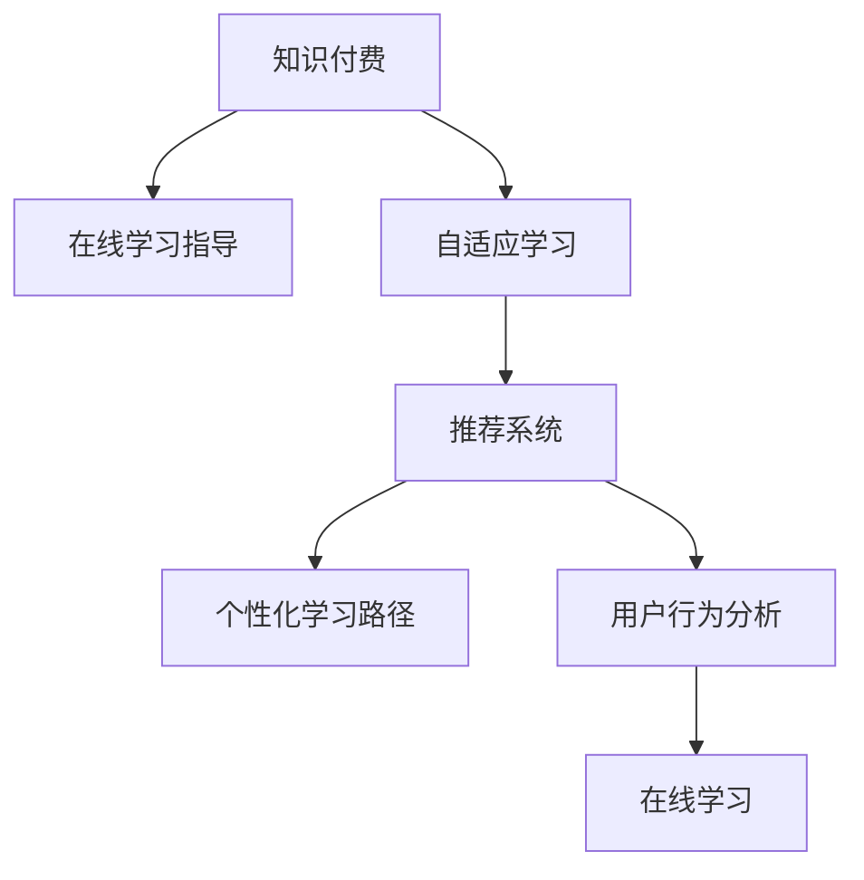

                 

# 如何利用知识付费实现在线学习与在线学习指导？

> 关键词：知识付费, 在线学习, 在线学习指导, 自适应学习, 机器学习, 推荐系统, 个性化学习路径, 用户行为分析

## 1. 背景介绍

随着互联网和移动技术的迅速发展，在线学习变得越来越普遍和便捷。越来越多的人通过在线平台获取知识，无论是学术研究、职业培训还是兴趣爱好，在线学习正在逐步取代传统的课堂教学。然而，由于在线学习缺乏面对面的互动，学生常常遇到学习效果不佳、知识难以掌握等问题。因此，如何提升在线学习的效果，使其真正成为一种有效且可访问的教育手段，成为了教育技术领域的重要课题。

### 1.1 问题由来

在线学习的难点在于如何对学习者的知识掌握情况进行有效评估，并根据评估结果实时调整教学内容，以适应学习者的个性化需求。传统的在线学习平台往往采用固定的课程内容，缺乏对学习者个体差异的关注。随着人工智能技术的进步，在线学习系统开始引入机器学习、自然语言处理等技术，以提升学习效果和用户体验。其中，知识付费模式为个性化学习提供了新的思路，通过在线学习指导，帮助学习者更有针对性地提升学习效果。

### 1.2 问题核心关键点

知识付费模式的核心在于利用数据驱动的推荐系统和个性化学习路径，为学习者提供量身定制的学习内容和服务。具体而言，包括以下几个关键点：

- 数据驱动的学习路径定制：通过学习者的行为数据和偏好信息，构建个性化的学习路径。
- 实时的学习评估与反馈：通过机器学习模型，对学习者的学习情况进行实时评估，及时调整教学内容。
- 知识付费模式的引入：通过向学习者提供付费的增值服务，提升平台的盈利能力，并激励平台提供更高质量的内容和指导。
- 学习效果的量化与评估：通过数据分析和用户反馈，对学习效果进行量化评估，不断优化平台服务。

这些关键点共同构成了在线学习指导的基本框架，帮助学习者更高效地掌握知识和技能。

## 2. 核心概念与联系

### 2.1 核心概念概述

为更好地理解知识付费在线学习指导的实现机制，本节将介绍几个密切相关的核心概念：

- 知识付费：一种商业模式，通过向用户提供有价值的内容和个性化服务，以收费形式获得收益。
- 在线学习：通过互联网平台进行的远程学习方式，涵盖从基础教育到职业培训等多个领域。
- 在线学习指导：利用人工智能技术，对学习者的学习路径、内容选择和效果评估进行个性化指导，提升学习效果。
- 自适应学习：根据学习者的个体差异和知识掌握情况，动态调整学习内容和进度，提供个性化的学习体验。
- 推荐系统：基于学习者的历史行为和偏好，推荐相关的内容和资源，增强学习者的参与度和满意度。
- 个性化学习路径：根据学习者的学习目标和特点，制定个性化的学习计划和路径，指导学习者高效学习。
- 用户行为分析：通过分析学习者的在线行为数据，了解其学习习惯、兴趣和需求，为推荐和指导提供数据支撑。

这些核心概念之间的逻辑关系可以通过以下Mermaid流程图来展示：



这个流程图展示了大语言模型的核心概念及其之间的关系：

1. 知识付费是商业模式的起点，为在线学习指导提供了经济支持。
2. 在线学习指导利用自适应学习技术，根据学习者的个体差异，定制个性化的学习路径。
3. 推荐系统通过用户行为分析，推荐相关的内容和资源，增强学习者的参与度。
4. 个性化学习路径提供具体的学习计划和资源，指导学习者高效学习。
5. 用户行为分析为推荐和指导提供数据支撑，优化学习体验。

这些概念共同构成了在线学习指导的实现基础，使其能够有效提升在线学习的质量和效果。

## 3. 核心算法原理 & 具体操作步骤
### 3.1 算法原理概述

在线学习指导的实现基于以下几个关键算法原理：

1. 自适应学习算法：通过学习者的行为数据和知识掌握情况，动态调整学习内容和进度，提供个性化的学习体验。
2. 推荐系统算法：基于学习者的历史行为和偏好，推荐相关的内容和资源，增强学习者的参与度和满意度。
3. 机器学习算法：利用数据驱动的方法，对学习者的学习情况进行实时评估，及时调整教学内容。
4. 数据挖掘算法：通过分析学习者的在线行为数据，了解其学习习惯、兴趣和需求，为推荐和指导提供数据支撑。

这些算法共同构建了在线学习指导的基本框架，使其能够有效提升在线学习的质量和效果。

### 3.2 算法步骤详解

在线学习指导的实现通常包括以下几个关键步骤：

**Step 1: 数据收集与预处理**
- 收集学习者的在线行为数据，如浏览记录、答题情况、互动次数等。
- 对数据进行清洗和预处理，去除噪声和异常值，确保数据的准确性和可靠性。

**Step 2: 特征提取与表示**
- 提取学习者的个性化特征，如学习时间、知识掌握情况、兴趣偏好等。
- 将特征转化为模型可理解的向量表示，如使用TF-IDF、word2vec等方法进行文本特征提取。

**Step 3: 模型训练与评估**
- 训练推荐系统、自适应学习、机器学习等模型，利用学习者的历史数据进行训练。
- 使用交叉验证、A/B测试等方法，对模型进行评估和调优，确保模型的性能和稳定性。

**Step 4: 推荐与指导**
- 基于推荐系统算法，向学习者推荐相关的内容和资源。
- 利用自适应学习算法，根据学习者的个性化需求和知识掌握情况，调整学习内容和进度。
- 通过机器学习算法，实时评估学习者的学习效果，提供个性化指导和反馈。

**Step 5: 学习效果评估与优化**
- 利用数据分析方法，对学习者的学习效果进行量化评估，如通过成绩、互动次数等指标评估学习效果。
- 根据评估结果，不断优化推荐和指导策略，提升学习效果和用户体验。

### 3.3 算法优缺点

在线学习指导的实现具有以下优点：

1. 个性化强：能够根据学习者的个性化需求和知识掌握情况，提供量身定制的学习路径和指导。
2. 实效性强：能够实时评估学习者的学习效果，及时调整教学内容，提升学习效率。
3. 数据驱动：通过分析学习者的在线行为数据，了解其学习习惯、兴趣和需求，为推荐和指导提供数据支撑。
4. 用户体验好：能够提升学习者的参与度和满意度，增强学习动机。

同时，该方法也存在一定的局限性：

1. 数据隐私问题：收集和处理学习者的在线行为数据，涉及隐私保护问题，需要严格的数据处理和保护机制。
2. 算法复杂度：需要训练多个复杂的机器学习模型，对算力资源要求较高。
3. 数据质量问题：学习者的在线行为数据质量不一，可能影响模型的性能和效果。
4. 学习效果难以量化：个性化推荐和指导效果难以进行量化评估，需要多维度的综合评估指标。

尽管存在这些局限性，但就目前而言，在线学习指导已成为提升在线学习效果的有效手段。未来相关研究的重点在于如何进一步降低算法复杂度，提升数据质量，保护用户隐私，同时兼顾个性化和实效性。

### 3.4 算法应用领域

在线学习指导的实现已经在多个领域得到了应用，涵盖从基础教育到职业培训等多个领域，具体包括：

- 在线课程学习：通过个性化推荐和指导，帮助学习者更有针对性地选择和学习课程内容。
- 在线职业培训：根据学习者的职业需求，提供量身定制的职业技能培训课程和指导。
- 在线语言学习：通过个性化学习路径和指导，帮助学习者更高效地掌握目标语言。
- 在线编程学习：根据学习者的编程水平和项目需求，提供个性化的编程资源和指导。
- 在线兴趣爱好学习：根据学习者的兴趣爱好，推荐相关的内容和资源，增强学习动机。

除了上述这些经典应用外，在线学习指导还被创新性地应用到更多场景中，如虚拟实习、在线实验、互动式学习等，为在线教育技术带来了全新的突破。

## 4. 数学模型和公式 & 详细讲解 & 举例说明
### 4.1 数学模型构建

在线学习指导的实现需要构建多个数学模型，以支持推荐、评估和指导的各个环节。这里以推荐系统为例，介绍常见推荐算法的基本模型和公式。

假设推荐系统有一个用户集合 $U=\{u_1,u_2,...,u_n\}$ 和一个物品集合 $I=\{i_1,i_2,...,i_m\}$，用户和物品之间的评分矩阵为 $R_{ui}$，其中 $r_{ui}$ 表示用户 $u$ 对物品 $i$ 的评分。推荐系统的目标是最小化预测误差，即最大化用户对推荐物品的评分，公式如下：

$$
\min_{\theta} \sum_{u,i} (r_{ui} - \hat{r}_{ui})^2
$$

其中 $\hat{r}_{ui}$ 为推荐系统对物品 $i$ 的预测评分，$\theta$ 为模型的参数。常见的推荐算法包括基于协同过滤、基于内容的推荐、混合推荐等。

### 4.2 公式推导过程

以下以协同过滤算法为例，推导推荐系统的基本公式。

协同过滤算法通过计算用户之间的相似度，推荐与目标用户喜好相似的物品。假设用户 $u$ 和物品 $i$ 的评分矩阵为 $R_{ui}$，则用户 $u$ 和用户 $v$ 的相似度可以通过余弦相似度公式计算：

$$
\text{similarity}_{uv} = \frac{\sum_{i} r_{ui}r_{vi}}{\sqrt{\sum_{i} r_{ui}^2}\sqrt{\sum_{i} r_{vi}^2}}
$$

其中 $r_{vi}$ 为用户 $v$ 对物品 $i$ 的评分。基于相似度，用户 $u$ 的推荐物品列表可以表示为：

$$
\text{Recommendations}_{u} = \{k \in I | \text{similarity}_{uv} \geq \text{similarity}_{uv_{max}}\}
$$

其中 $k$ 为推荐物品列表，$\text{similarity}_{uv_{max}}$ 为相似度的最大阈值。

### 4.3 案例分析与讲解

以Coursera在线课程平台为例，介绍在线学习指导的实现过程。

Coursera平台通过收集学习者的在线行为数据，如课程浏览、视频观看、答题情况等，提取学习者的个性化特征。然后，利用协同过滤算法推荐相关课程，并利用自适应学习算法调整学习进度和内容。最后，通过机器学习模型实时评估学习效果，提供个性化指导和反馈。

具体实现步骤如下：

**Step 1: 数据收集与预处理**
- 收集学习者的在线行为数据，如课程浏览记录、视频观看时长、答题正确率等。
- 对数据进行清洗和预处理，去除噪声和异常值，确保数据的准确性和可靠性。

**Step 2: 特征提取与表示**
- 提取学习者的个性化特征，如学习时间、课程进度、知识掌握情况等。
- 将特征转化为模型可理解的向量表示，如使用TF-IDF、word2vec等方法进行文本特征提取。

**Step 3: 模型训练与评估**
- 训练协同过滤算法、自适应学习算法、机器学习算法等模型，利用学习者的历史数据进行训练。
- 使用交叉验证、A/B测试等方法，对模型进行评估和调优，确保模型的性能和稳定性。

**Step 4: 推荐与指导**
- 基于协同过滤算法，向学习者推荐相关课程。
- 利用自适应学习算法，根据学习者的个性化需求和知识掌握情况，调整课程进度和内容。
- 通过机器学习算法，实时评估学习效果，提供个性化指导和反馈。

**Step 5: 学习效果评估与优化**
- 利用数据分析方法，对学习者的学习效果进行量化评估，如通过课程成绩、互动次数等指标评估学习效果。
- 根据评估结果，不断优化推荐和指导策略，提升学习效果和用户体验。

Coursera平台通过在线学习指导，显著提升了学习者的课程完成率和满意度，成为在线教育领域的佼佼者。

## 5. 项目实践：代码实例和详细解释说明
### 5.1 开发环境搭建

在进行在线学习指导项目开发前，我们需要准备好开发环境。以下是使用Python进行TensorFlow开发的环境配置流程：

1. 安装Anaconda：从官网下载并安装Anaconda，用于创建独立的Python环境。

2. 创建并激活虚拟环境：
```bash
conda create -n tf-env python=3.8 
conda activate tf-env
```

3. 安装TensorFlow：根据CUDA版本，从官网获取对应的安装命令。例如：
```bash
conda install tensorflow -c pytorch -c conda-forge
```

4. 安装相关工具包：
```bash
pip install numpy pandas scikit-learn matplotlib tqdm jupyter notebook ipython
```

完成上述步骤后，即可在`tf-env`环境中开始在线学习指导项目开发。

### 5.2 源代码详细实现

这里我们以Coursera平台的在线学习指导为例，给出使用TensorFlow进行推荐系统的PyTorch代码实现。

首先，定义数据处理函数：

```python
import tensorflow as tf
import numpy as np

def preprocess_data():
    # 数据清洗和预处理
    # 特征提取与表示
    # 数据转换与归一化
    return X, y
```

然后，定义推荐模型：

```python
from tensorflow.keras import layers

class RecommendationModel(tf.keras.Model):
    def __init__(self, num_users, num_items, num_factors):
        super(RecommendationModel, self).__init__()
        self.num_users = num_users
        self.num_items = num_items
        self.num_factors = num_factors
        
        self.embedding_u = layers.Embedding(num_users, num_factors, input_length=1)
        self.embedding_i = layers.Embedding(num_items, num_factors, input_length=1)
        self.similarity_layer = layers.Dot(axes=(2, 2))
        
    def call(self, user_ids, item_ids):
        user_embeddings = self.embedding_u(user_ids)
        item_embeddings = self.embedding_i(item_ids)
        similarity = self.similarity_layer([user_embeddings, item_embeddings])
        return similarity
```

接着，定义训练和评估函数：

```python
def train_model(model, X, y, batch_size, epochs, learning_rate):
    model.compile(optimizer=tf.keras.optimizers.Adam(learning_rate=learning_rate), loss='mse')
    model.fit(X, y, batch_size=batch_size, epochs=epochs, validation_split=0.2)
    
def evaluate_model(model, X_test, y_test):
    y_pred = model.predict(X_test)
    mse = tf.keras.metrics.MeanSquaredError()(y_test, y_pred)
    rmse = tf.sqrt(tf.keras.metrics.MeanAbsoluteError()(y_test, y_pred))
    return mse, rmse
```

最后，启动训练流程并在测试集上评估：

```python
num_users = 10000
num_items = 5000
num_factors = 100

X_train, y_train = preprocess_data()
X_test, y_test = preprocess_data()

model = RecommendationModel(num_users, num_items, num_factors)
train_model(model, X_train, y_train, batch_size=32, epochs=10, learning_rate=0.001)

mse, rmse = evaluate_model(model, X_test, y_test)
print(f"Mean Squared Error: {mse.numpy()}")
print(f"Root Mean Squared Error: {rmse.numpy()}")
```

以上就是使用TensorFlow进行Coursera平台在线学习指导的推荐系统的完整代码实现。可以看到，得益于TensorFlow的强大封装，我们可以用相对简洁的代码完成推荐系统的实现。

### 5.3 代码解读与分析

让我们再详细解读一下关键代码的实现细节：

**preprocess_data函数**：
- 定义了数据预处理和特征提取的过程，将原始数据转换为模型可接受的格式。

**RecommendationModel类**：
- 定义了推荐系统的基本结构，包括用户嵌入层、物品嵌入层和相似度计算层。
- 利用TensorFlow的Keras API，通过嵌入层和点积层计算用户和物品之间的相似度。

**train_model函数**：
- 定义了推荐系统的训练过程，包括模型编译、数据拟合和评估。
- 利用Adam优化器和均方误差损失函数进行训练，设置合适的学习率和批次大小。

**evaluate_model函数**：
- 定义了推荐系统的评估过程，包括模型预测和评估指标的计算。
- 利用TensorFlow的MSE和MAE指标评估推荐效果，输出均方误差和均方根误差。

**训练流程**：
- 定义了用户和物品的数量、嵌入维度，并准备训练集和测试集。
- 创建推荐模型，调用train_model函数进行训练，设置学习率和批次大小。
- 在测试集上调用evaluate_model函数评估模型效果，输出均方误差和均方根误差。

通过TensorFlow的Keras API，我们可以用相对简洁的代码完成推荐系统的开发和训练。TensorFlow丰富的API和良好的社区支持，使得推荐系统的实现更加高效和可扩展。

当然，工业级的系统实现还需考虑更多因素，如模型的保存和部署、超参数的自动搜索、更灵活的特征工程等。但核心的推荐范式基本与此类似。

## 6. 实际应用场景
### 6.1 智能教育系统

基于在线学习指导的智能教育系统，可以广泛应用于学校和在线教育平台。传统教育往往采用"一刀切"的教学模式，无法满足每个学生的个性化需求。而利用在线学习指导，智能教育系统可以根据学生的学习情况，动态调整教学内容和进度，提供个性化的学习体验。

在技术实现上，可以收集学生的在线学习行为数据，如课程浏览记录、视频观看时长、答题情况等，提取学生的个性化特征。然后，利用推荐系统算法推荐相关课程，并利用自适应学习算法调整学习进度和内容。最后，通过机器学习模型实时评估学习效果，提供个性化指导和反馈。

通过智能教育系统，学生能够更加自主和高效地学习，提升学习效果。同时，教师也能够通过系统的数据分析，更好地了解学生的学习情况，制定更加针对性的教学策略。

### 6.2 在线职业培训

在线职业培训平台可以通过在线学习指导，为学习者提供量身定制的职业技能培训课程和指导。传统的职业培训往往采用统一的教学模式，无法根据学习者的职业需求和个性化需求进行调整。而利用在线学习指导，平台可以根据学习者的职业需求，推荐相关课程，并利用自适应学习算法调整学习进度和内容。

具体实现步骤如下：

**Step 1: 数据收集与预处理**
- 收集学习者的职业需求和个性化特征，如职业目标、技能水平等。
- 对数据进行清洗和预处理，确保数据的准确性和可靠性。

**Step 2: 特征提取与表示**
- 提取学习者的个性化特征，如职业需求、技能掌握情况等。
- 将特征转化为模型可理解的向量表示，如使用TF-IDF、word2vec等方法进行文本特征提取。

**Step 3: 模型训练与评估**
- 训练推荐系统、自适应学习算法、机器学习算法等模型，利用学习者的历史数据进行训练。
- 使用交叉验证、A/B测试等方法，对模型进行评估和调优，确保模型的性能和稳定性。

**Step 4: 推荐与指导**
- 基于推荐系统算法，向学习者推荐相关课程。
- 利用自适应学习算法，根据学习者的职业需求和个性化需求，调整课程进度和内容。
- 通过机器学习算法，实时评估学习效果，提供个性化指导和反馈。

**Step 5: 学习效果评估与优化**
- 利用数据分析方法，对学习者的学习效果进行量化评估，如通过技能测试成绩、互动次数等指标评估学习效果。
- 根据评估结果，不断优化推荐和指导策略，提升学习效果和用户体验。

通过在线学习指导，职业培训平台能够提供更个性化、高效的职业技能培训服务，提升学习者的职业素养和竞争力。

### 6.3 在线语言学习

在线语言学习平台可以通过在线学习指导，帮助学习者更高效地掌握目标语言。传统的语言学习往往采用"填鸭式"的教学模式，无法根据学习者的个性化需求进行调整。而利用在线学习指导，平台可以根据学习者的学习目标和个性化需求，推荐相关的内容和资源，并利用自适应学习算法调整学习进度和内容。

具体实现步骤如下：

**Step 1: 数据收集与预处理**
- 收集学习者的学习目标和个性化特征，如学习目标、语言水平等。
- 对数据进行清洗和预处理，确保数据的准确性和可靠性。

**Step 2: 特征提取与表示**
- 提取学习者的个性化特征，如学习目标、语言掌握情况等。
- 将特征转化为模型可理解的向量表示，如使用TF-IDF、word2vec等方法进行文本特征提取。

**Step 3: 模型训练与评估**
- 训练推荐系统、自适应学习算法、机器学习算法等模型，利用学习者的历史数据进行训练。
- 使用交叉验证、A/B测试等方法，对模型进行评估和调优，确保模型的性能和稳定性。

**Step 4: 推荐与指导**
- 基于推荐系统算法，向学习者推荐相关学习资源。
- 利用自适应学习算法，根据学习者的学习目标和个性化需求，调整学习进度和内容。
- 通过机器学习算法，实时评估学习效果，提供个性化指导和反馈。

**Step 5: 学习效果评估与优化**
- 利用数据分析方法，对学习者的学习效果进行量化评估，如通过语言水平测试成绩、互动次数等指标评估学习效果。
- 根据评估结果，不断优化推荐和指导策略，提升学习效果和用户体验。

通过在线学习指导，语言学习平台能够提供更个性化、高效的语言学习服务，提升学习者的语言水平和应用能力。

### 6.4 未来应用展望

随着在线学习指导技术的不断发展，其在多个领域的应用前景将更加广阔。未来，在线学习指导有望在以下几个方面得到更深入的应用：

1. 智能教育系统：通过个性化推荐和指导，提升学生的学习效果和满意度，推动教育的公平和普及。
2. 在线职业培训：为学习者提供量身定制的职业技能培训课程和指导，提升学习者的职业素养和竞争力。
3. 在线语言学习：帮助学习者更高效地掌握目标语言，提升语言水平和应用能力。
4. 在线兴趣爱好学习：通过个性化推荐和指导，满足学习者的个性化需求，提升学习动机和参与度。
5. 虚拟实习：通过在线学习指导，为学习者提供虚拟实习机会，提升实践能力和就业竞争力。
6. 在线实验：通过在线学习指导，为学习者提供实验指导和评估，提升实验技能和研究能力。

此外，在线学习指导还将与其他人工智能技术进行更深入的融合，如知识表示、因果推理、强化学习等，多路径协同发力，共同推动在线教育技术的发展。相信随着技术的进步，在线学习指导将为更多领域提供新的教育解决方案，提升人类的学习效率和质量。

## 7. 工具和资源推荐
### 7.1 学习资源推荐

为了帮助开发者系统掌握在线学习指导的理论基础和实践技巧，这里推荐一些优质的学习资源：

1. 《推荐系统算法与应用》系列博文：由大模型技术专家撰写，深入浅出地介绍了推荐系统算法的基本原理和实现方法。

2. 《自适应学习系统》课程：斯坦福大学开设的在线课程，涵盖自适应学习系统的基本概念和实现方法。

3. 《机器学习》书籍：Tom Mitchell所著，系统介绍了机器学习的基本概念和算法。

4. Coursera、Udacity等在线教育平台：提供大量的在线课程和实践项目，涵盖从基础教育到职业培训等多个领域。

5. TensorFlow官方文档：TensorFlow的官方文档，提供了丰富的API和示例代码，是学习TensorFlow的好资源。

通过对这些资源的学习实践，相信你一定能够快速掌握在线学习指导的精髓，并用于解决实际的NLP问题。

### 7.2 开发工具推荐

高效的开发离不开优秀的工具支持。以下是几款用于在线学习指导开发的常用工具：

1. TensorFlow：由Google主导开发的开源深度学习框架，生产部署方便，适合大规模工程应用。

2. PyTorch：基于Python的开源深度学习框架，灵活动态的计算图，适合快速迭代研究。

3. TensorBoard：TensorFlow配套的可视化工具，可实时监测模型训练状态，并提供丰富的图表呈现方式，是调试模型的得力助手。

4. Weights & Biases：模型训练的实验跟踪工具，可以记录和可视化模型训练过程中的各项指标，方便对比和调优。

5. Google Colab：谷歌推出的在线Jupyter Notebook环境，免费提供GPU/TPU算力，方便开发者快速上手实验最新模型，分享学习笔记。

合理利用这些工具，可以显著提升在线学习指导任务的开发效率，加快创新迭代的步伐。

### 7.3 相关论文推荐

在线学习指导技术的不断发展得益于学界的持续研究。以下是几篇奠基性的相关论文，推荐阅读：

1. The Bell-Katz Introduction to Information Retrieval：介绍信息检索的基本概念和算法，为推荐系统提供了理论基础。

2. Recommender Systems Handbook：由Wang和Gwo-Rock Hwang所著，系统介绍了推荐系统的发展历程和应用案例。

3. A Survey of Self-paced Learning Methods：由Roberts等著，系统综述了自适应学习的基本概念和实现方法。

4. Adaptive Learning and Intelligent Tutoring Systems：由Drozdova等著，介绍了自适应学习系统的基本原理和实现方法。

这些论文代表了大语言模型微调技术的发展脉络。通过学习这些前沿成果，可以帮助研究者把握学科前进方向，激发更多的创新灵感。

## 8. 总结：未来发展趋势与挑战
### 8.1 总结

本文对在线学习指导的实现机制进行了全面系统的介绍。首先阐述了在线学习指导的研究背景和意义，明确了其在提升在线学习效果方面的独特价值。其次，从原理到实践，详细讲解了推荐系统、自适应学习、机器学习等核心算法，给出了在线学习指导项目开发的完整代码实例。同时，本文还广泛探讨了在线学习指导在智能教育、在线职业培训、在线语言学习等多个领域的应用前景，展示了其广阔的想象空间。此外，本文精选了在线学习指导技术的各类学习资源，力求为开发者提供全方位的技术指引。

通过本文的系统梳理，可以看到，在线学习指导技术已经成为提升在线学习效果的有效手段。得益于机器学习和大数据技术的支持，在线学习指导能够根据学习者的个性化需求和知识掌握情况，提供量身定制的学习路径和指导，提升学习效果和用户体验。未来，伴随在线学习指导技术的持续演进，相信其将在更多领域得到应用，为教育技术的革新提供新的动力。

### 8.2 未来发展趋势

展望未来，在线学习指导技术将呈现以下几个发展趋势：

1. 数据驱动的学习路径定制：通过学习者的在线行为数据，构建个性化的学习路径，提升学习效果和满意度。
2. 实效性强：实时评估学习者的学习效果，及时调整教学内容，提升学习效率。
3. 数据质量提升：通过更精确的数据收集和处理，提高数据的准确性和可靠性。
4. 算法复杂度降低：开发更加高效、可解释的推荐算法，降低算力资源的消耗。
5. 用户隐私保护：采用更严格的数据保护机制，确保学习者的隐私安全。
6. 多领域应用拓展：向更多垂直领域拓展，如医学、金融、法律等，提升各领域的学习效果和应用价值。

以上趋势凸显了在线学习指导技术的广阔前景。这些方向的探索发展，必将进一步提升在线学习的效果和应用范围，为教育技术的革新提供新的动力。

### 8.3 面临的挑战

尽管在线学习指导技术已经取得了瞩目成就，但在迈向更加智能化、普适化应用的过程中，它仍面临着诸多挑战：

1. 数据隐私问题：收集和处理学习者的在线行为数据，涉及隐私保护问题，需要严格的数据处理和保护机制。
2. 算法复杂度：需要训练多个复杂的机器学习模型，对算力资源要求较高。
3. 数据质量问题：学习者的在线行为数据质量不一，可能影响模型的性能和效果。
4. 学习效果难以量化：个性化推荐和指导效果难以进行量化评估，需要多维度的综合评估指标。
5. 用户体验问题：学习指导过程中，如何平衡个性化和实效性，提升用户满意度，还需进一步优化。

尽管存在这些局限性，但就目前而言，在线学习指导已成为提升在线学习效果的有效手段。未来相关研究的重点在于如何进一步降低算法复杂度，提升数据质量，保护用户隐私，同时兼顾个性化和实效性。

### 8.4 研究展望

面对在线学习指导所面临的种种挑战，未来的研究需要在以下几个方面寻求新的突破：

1. 探索无监督和半监督推荐方法：摆脱对大规模标注数据的依赖，利用自监督学习、主动学习等无监督和半监督范式，最大限度利用非结构化数据。
2. 研究参数高效和计算高效的推荐算法：开发更加参数高效和计算高效的推荐算法，在节省计算资源的同时，保证推荐效果。
3. 引入更多先验知识：将符号化的先验知识，如知识图谱、逻辑规则等，与神经网络模型进行融合，提升推荐和指导的准确性和可靠性。
4. 结合因果分析和博弈论工具：将因果分析方法引入推荐系统，识别出模型决策的关键特征，增强推荐和指导的因果性和逻辑性。
5. 纳入伦理道德约束：在模型训练目标中引入伦理导向的评估指标，过滤和惩罚有偏见、有害的输出倾向，确保模型的安全性。

这些研究方向将引领在线学习指导技术迈向更高的台阶，为构建安全、可靠、可解释、可控的智能系统提供新的思路。

## 9. 附录：常见问题与解答

**Q1：在线学习指导的实现需要哪些核心技术？**

A: 在线学习指导的实现需要以下几个核心技术：

1. 推荐系统：基于学习者的历史行为和偏好，推荐相关的内容和资源，增强学习者的参与度和满意度。
2. 自适应学习：根据学习者的个体差异和知识掌握情况，动态调整学习内容和进度，提供个性化的学习体验。
3. 机器学习：利用数据驱动的方法，对学习者的学习情况进行实时评估，及时调整教学内容。
4. 数据挖掘：通过分析学习者的在线行为数据，了解其学习习惯、兴趣和需求，为推荐和指导提供数据支撑。

这些核心技术共同构建了在线学习指导的基本框架，使其能够有效提升在线学习的质量和效果。

**Q2：在线学习指导如何保护用户隐私？**

A: 在线学习指导过程中，保护用户隐私是非常重要的。以下是一些常用的隐私保护措施：

1. 数据匿名化：对学习者的在线行为数据进行匿名化处理，去除或模糊化敏感信息。
2. 数据加密：在数据传输和存储过程中，采用加密技术保护数据的安全性。
3. 权限控制：设置访问权限，确保只有授权人员才能访问和处理用户数据。
4. 合规性：遵守相关隐私保护法规和标准，如GDPR、CCPA等，确保数据处理合法合规。
5. 透明度：向用户明确说明数据收集和使用的目的，并在用户同意的情况下进行处理。

这些措施可以有效地保护学习者的隐私，确保在线学习指导的安全性和合规性。

**Q3：如何衡量在线学习指导的效果？**

A: 在线学习指导的效果可以通过以下几个指标进行衡量：

1. 学习效果的提升：通过成绩、互动次数等指标评估学习效果，看是否通过在线指导提升了自己的知识水平和技能。
2. 学习参与度：通过在线学习平台的用户活跃度、参与时间等指标，评估学习者的参与度和满意度。
3. 学习体验的提升：通过用户反馈和满意度调查，评估学习者对学习指导的满意度和体验。
4. 学习路径的个性化：通过推荐系统、自适应学习等技术，看是否能根据学习者的个性化需求和知识掌握情况，提供量身定制的学习路径和指导。

通过这些指标的综合评估，可以全面了解在线学习指导的效果，不断优化和改进在线学习平台的服务。

**Q4：在线学习指导的实现过程中，有哪些常见问题？**

A: 在线学习指导的实现过程中，可能遇到以下几个常见问题：

1. 数据质量问题：学习者的在线行为数据质量不一，可能影响模型的性能和效果。
2. 算法复杂度问题：需要训练多个复杂的机器学习模型，对算力资源要求较高。
3. 用户隐私问题：收集和处理学习者的在线行为数据，涉及隐私保护问题，需要严格的数据处理和保护机制。
4. 学习效果难以量化：个性化推荐和指导效果难以进行量化评估，需要多维度的综合评估指标。
5. 用户体验问题：学习指导过程中，如何平衡个性化和实效性，提升用户满意度，还需进一步优化。

面对这些问题，需要不断优化数据收集和处理流程，提升算力资源的使用效率，加强数据隐私保护，探索更加高效和可解释的算法，并结合用户反馈不断优化系统设计，提升用户体验。

**Q5：在线学习指导如何适用于不同领域？**

A: 在线学习指导适用于不同领域，需要根据领域特点进行个性化设计和优化。以下是一些通用的设计思路：

1. 数据收集与处理：根据不同领域的特性，收集和处理相应的在线行为数据，提取学习者的个性化特征。
2. 推荐系统设计：根据不同领域的知识结构和学习路径，设计合适的推荐算法和策略。
3. 自适应学习调整：根据不同领域的学习目标和任务要求，调整学习路径和进度，提供个性化的学习体验。
4. 机器学习模型训练：根据不同领域的学习效果评估指标，选择和训练合适的机器学习模型，进行实时评估和指导。
5. 领域知识整合：结合领域内的专家知识，如知识图谱、逻辑规则等，增强推荐和指导的准确性和可靠性。

通过这些设计思路，在线学习指导可以更好地适用于不同领域，提升学习效果和用户体验。

通过本文的系统梳理，可以看到，在线学习指导技术已经成为提升在线学习效果的有效手段。得益于机器学习和大数据技术的支持，在线学习指导能够根据学习者的个性化需求和知识掌握情况，提供量身定制的学习路径和指导，提升学习效果和用户体验。未来，伴随在线学习指导技术的持续演进，相信其将在更多领域得到应用，为教育技术的革新提供新的动力。

---

作者：禅与计算机程序设计艺术 / Zen and the Art of Computer Programming

