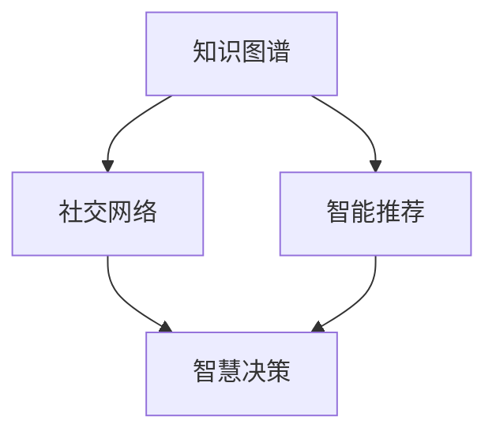

                 

# 如何利用知识社交促进跨界创新和协作

> 关键词：知识社交,跨界创新,协作网络,社区治理,智慧决策

## 1. 背景介绍

### 1.1 问题由来
在当前数字化时代，知识获取和传播的速度前所未有。人们不再局限于传统的书籍、期刊等知识载体，而是可以通过互联网获取海量信息。这种信息爆炸的趋势，一方面带来了知识的丰富性，但另一方面也带来了知识碎片化、冗余化和筛选困难的问题。

在众多创新领域中，比如生物医学、人工智能、金融科技等，如何有效地筛选、整合和利用知识，成为创新和协作的关键。此外，随着社交媒体和社交网络的兴起，知识交流和协作的方式也发生了巨大变化，传统的学术交流和项目合作已经难以满足现代复杂环境的需求。

在面对上述问题时，我们需要一种新的知识管理模式，以适应数字化时代的需求。知识社交（Knowledge Social）技术应运而生，通过社交网络和机器学习算法，使知识传播和交流更加高效、精准和可控，进而促进跨界创新和协作。

### 1.2 问题核心关键点
知识社交技术的关键点在于通过社交网络和机器学习算法，实现知识的高效整合与传播。具体来说：

- **知识图谱**：通过知识图谱构建知识网络，帮助用户发现和关联相关知识。
- **智能推荐**：利用机器学习算法，实现个性化知识推荐，提升用户发现新知识的效率。
- **社交协作**：借助社交网络，构建协作社区，促进用户之间的知识共享与协作。
- **智慧决策**：利用大数据分析与人工智能技术，辅助用户进行决策，提升决策效率和准确性。

以下我们将从原理、步骤、优缺点及应用场景等方面，详细介绍知识社交技术。

## 2. 核心概念与联系

### 2.1 核心概念概述

为更好地理解知识社交技术，我们首先介绍几个密切相关的核心概念：

- **知识图谱(Knowledge Graph)**：一种用于描述实体、属性和关系的知识表示框架。通过构建知识图谱，用户可以快速定位和关联相关知识。
- **智能推荐系统(Recommendation System)**：基于用户行为和偏好，通过机器学习算法，推荐用户可能感兴趣的知识和内容。
- **社交网络(Social Network)**：由用户和之间的关系构成的网络，用于知识交流与协作。
- **智慧决策(Decision Support System)**：利用数据分析和人工智能技术，辅助用户进行决策。

这些核心概念之间的逻辑关系可以通过以下Mermaid流程图来展示：



这个流程图展示了几大核心概念及其之间的关系：

1. 知识图谱通过构建知识网络，帮助用户发现和关联相关知识。
2. 智能推荐利用用户行为数据，实现个性化知识推荐。
3. 社交网络用于知识交流与协作，构建协作社区。
4. 智慧决策通过数据分析和人工智能技术，辅助用户进行决策。

## 3. 核心算法原理 & 具体操作步骤
### 3.1 算法原理概述

知识社交技术融合了知识图谱、智能推荐、社交网络和智慧决策等关键技术，其核心原理在于通过机器学习算法，实现知识的个性化、社交化和智慧化。

**知识图谱**：知识图谱通常由节点（实体）和边（关系）组成，通过构建知识图谱，用户可以方便地查询、关联和发现相关知识。知识图谱的构建需要依赖大量的领域知识，通常通过专家输入和自动化抽取相结合的方式完成。

**智能推荐**：基于用户的浏览历史、行为数据等，利用协同过滤、内容推荐、深度学习等算法，为用户推荐可能感兴趣的知识内容。推荐系统通常使用交叉熵损失函数、矩阵分解等技术进行模型训练，以提高推荐的准确性和多样性。

**社交网络**：社交网络由用户和之间的关系组成，通常使用图数据库（如Neo4j）进行存储和分析。社交网络可以通过图算法（如PageRank、Greedy算法等）发现知识节点之间的关联，并动态更新节点之间的关系。

**智慧决策**：利用大数据分析与机器学习技术，对知识图谱和推荐系统中的数据进行整合和分析，以辅助用户进行决策。通常使用深度学习模型（如RNN、CNN等）对决策问题进行建模，并使用强化学习算法进行优化。

### 3.2 算法步骤详解

知识社交技术的具体操作流程包括数据采集与处理、知识图谱构建、智能推荐、社交网络构建和智慧决策等几个关键步骤：

**Step 1: 数据采集与处理**

知识社交技术首先需要大量的数据，包括用户行为数据、领域知识库、社交网络数据等。数据采集来源广泛，包括社交媒体、在线图书馆、科学论文等。数据采集后需要进行清洗和预处理，去除噪音和无关数据，确保数据的质量和一致性。

**Step 2: 知识图谱构建**

知识图谱的构建通常使用自然语言处理技术（如实体识别、关系抽取等）对领域知识库进行抽取和整合。构建知识图谱的工具包括RDF（资源描述框架）、Turtle、JSON-LD等，知识图谱可以使用图数据库进行存储和查询。

**Step 3: 智能推荐**

智能推荐系统需要基于用户的历史行为数据，通过协同过滤、内容推荐、深度学习等算法，为用户推荐相关知识。推荐系统的具体实现包括：

- 协同过滤：基于用户的历史行为数据，发现与其他用户有相似偏好的知识，进行推荐。
- 内容推荐：基于知识内容的相似性，推荐与已有知识相似的新知识。
- 深度学习：利用深度学习模型，如神经网络、图神经网络等，对用户行为数据进行建模，以提高推荐效果。

**Step 4: 社交网络构建**

社交网络构建包括用户注册、关系建立和动态更新等。用户注册后，可以通过好友推荐、领域专家推荐等方式建立联系。关系建立通常包括好友关系、关注关系等，并通过社交图算法进行动态更新和推荐。

**Step 5: 智慧决策**

智慧决策系统通常使用大数据分析与机器学习技术，对知识图谱和推荐系统中的数据进行整合和分析，以辅助用户进行决策。具体实现包括：

- 数据整合：将知识图谱和推荐系统中的数据进行整合，生成全局视图。
- 数据分析：利用数据分析技术，提取有用的决策信息。
- 机器学习：使用机器学习模型，如决策树、随机森林、深度学习等，对决策问题进行建模和优化。

### 3.3 算法优缺点

知识社交技术的优点包括：

1. **高效整合知识**：通过知识图谱和智能推荐，用户可以快速发现和关联相关知识，提升知识整合效率。
2. **个性化推荐**：利用智能推荐算法，实现个性化知识推荐，提升用户体验。
3. **社交化协作**：通过社交网络构建协作社区，促进用户之间的知识共享与协作。
4. **智慧决策支持**：利用大数据分析和机器学习技术，辅助用户进行决策，提升决策效率和准确性。

其缺点包括：

1. **数据隐私问题**：知识社交技术需要大量的用户数据，涉及用户隐私和数据安全问题。
2. **复杂度较高**：知识社交技术的实现涉及多领域知识和复杂算法，技术实现难度较大。
3. **数据噪音问题**：数据采集和预处理过程中可能存在噪音和偏差，影响算法效果。
4. **可解释性不足**：知识社交技术的决策过程缺乏可解释性，用户难以理解决策背后的逻辑。

## 4. 数学模型和公式 & 详细讲解 & 举例说明

### 4.1 数学模型构建

知识社交技术涉及多个领域，其数学模型构建较为复杂。以下我们将分别介绍知识图谱、智能推荐、社交网络和智慧决策等领域的数学模型。

**知识图谱**：知识图谱的构建通常使用自然语言处理技术（如实体识别、关系抽取等）对领域知识库进行抽取和整合。其数学模型包括：

- 实体识别模型：通过命名实体识别（NER）技术，识别文本中的实体。
- 关系抽取模型：通过关系抽取技术，提取实体之间的关系。
- 知识图谱存储模型：使用RDF（资源描述框架）、Turtle、JSON-LD等进行存储。

**智能推荐**：智能推荐系统通常使用协同过滤、内容推荐、深度学习等算法，进行模型训练。其数学模型包括：

- 协同过滤模型：基于用户和项目的共现矩阵，使用矩阵分解技术进行推荐。
- 内容推荐模型：基于知识内容的相似性，使用向量空间模型（VSM）进行推荐。
- 深度学习模型：使用神经网络、图神经网络等进行推荐。

**社交网络**：社交网络通常使用图数据库进行存储和分析。其数学模型包括：

- 图数据库存储模型：使用Neo4j等图数据库进行存储和查询。
- 图算法：如PageRank、Greedy算法等，用于发现知识节点之间的关联。

**智慧决策**：智慧决策系统通常使用大数据分析和机器学习技术，进行决策建模和优化。其数学模型包括：

- 大数据分析模型：使用大数据分析技术，如数据聚合、数据清洗等。
- 机器学习模型：使用决策树、随机森林、深度学习等进行决策建模。

### 4.2 公式推导过程

以下我们将以智能推荐系统为例，介绍协同过滤算法的公式推导过程。

假设用户集为 $U$，物品集为 $I$，用户对物品的评分矩阵为 $R_{ui}$，协同过滤的目标是预测用户 $u$ 对物品 $i$ 的评分 $r_{ui}$。设用户 $u$ 的邻居集合为 $N(u)$，则协同过滤算法可以表示为：

$$
\hat{r}_{ui} = \alpha \sum_{v \in N(u)} \frac{R_{vi} \times R_{uv}}{\sqrt{R_{vv} + \epsilon} \times \sqrt{R_{uu} + \epsilon}}
$$

其中 $\alpha$ 为调节参数，$\epsilon$ 为平滑参数，通常设置为 $10^{-6}$。该公式通过计算用户 $u$ 与其邻居 $v$ 之间物品评分的加权平均值，进行推荐预测。

### 4.3 案例分析与讲解

以下我们将通过一个具体的案例，介绍知识社交技术在金融领域的实际应用。

**案例：金融市场预测**

在金融市场预测中，知识社交技术可以应用于多个方面：

- **数据采集与处理**：收集金融市场的历史数据、新闻报道、专家分析等，进行清洗和预处理。
- **知识图谱构建**：构建金融知识图谱，包含公司、行业、市场指数等知识节点，并通过关系抽取技术提取实体之间的关系。
- **智能推荐**：利用智能推荐算法，为用户推荐最新的市场资讯、分析报告等，提升用户发现新知识的能力。
- **社交网络构建**：通过社交网络构建金融分析师、投资者之间的协作社区，促进知识交流和协作。
- **智慧决策**：利用大数据分析和机器学习技术，对市场数据进行整合和分析，辅助用户进行投资决策。

例如，某投资公司利用知识社交技术，构建了一个金融知识图谱，包含了全球市场指数、行业数据、公司财务报告等知识节点。同时，该公司还构建了一个社交网络，方便分析师和投资者之间的交流和协作。利用智能推荐算法，该公司能够为用户推荐最新的市场资讯和分析报告，提升用户发现新知识的能力。智慧决策系统则通过大数据分析和机器学习技术，对市场数据进行整合和分析，辅助用户进行投资决策，提升了决策效率和准确性。

## 5. 项目实践：代码实例和详细解释说明

### 5.1 开发环境搭建

在进行知识社交项目实践前，我们需要准备好开发环境。以下是使用Python进行知识社交项目开发的环境配置流程：

1. 安装Anaconda：从官网下载并安装Anaconda，用于创建独立的Python环境。

2. 创建并激活虚拟环境：
```bash
conda create -n knowledge-env python=3.8 
conda activate knowledge-env
```

3. 安装必要的库：
```bash
conda install pandas numpy scikit-learn networkx jupyter notebook tqdm matplotlib
```

4. 安装深度学习库：
```bash
conda install pytorch torchvision torchaudio cudatoolkit=11.1 -c pytorch -c conda-forge
```

5. 安装图数据库：
```bash
pip install neo4j-bolt py2neo
```

完成上述步骤后，即可在`knowledge-env`环境中开始知识社交项目的开发。

### 5.2 源代码详细实现

这里我们以金融知识图谱构建为例，给出使用Python进行知识图谱构建的代码实现。

首先，定义实体识别模型：

```python
from transformers import BertTokenizer, BertForTokenClassification
import pandas as pd
import torch
from py2neo import Graph, Node, Relationship

# 定义实体识别模型
tokenizer = BertTokenizer.from_pretrained('bert-base-cased')
model = BertForTokenClassification.from_pretrained('bert-base-cased', num_labels=len(tag2id))

# 实体识别
def ner(text):
    encoding = tokenizer(text, return_tensors='pt', max_length=128, padding='max_length', truncation=True)
    input_ids = encoding['input_ids'][0]
    attention_mask = encoding['attention_mask'][0]
    outputs = model(input_ids, attention_mask=attention_mask)
    logits = outputs.logits
    probabilities = torch.softmax(logits, dim=2)
    labels = torch.argmax(probabilities, dim=2).to('cpu').tolist()
    return labels
```

然后，定义关系抽取模型：

```python
# 关系抽取
def relation_extraction(text):
    # 进行命名实体识别
    labels = ner(text)
    
    # 将标签转换为实体和关系
    entities = []
    relations = []
    for i in range(len(labels)):
        entity = ''
        relation = ''
        for j in range(len(labels[i])):
            if labels[i][j] == 1:  # 如果当前位置是实体
                if entity == '':
                    entity = tokens[i][j]
                else:
                    entity += ' ' + tokens[i][j]
            if labels[i][j] == 2:  # 如果当前位置是关系
                relation = tokens[i][j]
        if entity and relation:
            entities.append(entity)
            relations.append(relation)
    
    # 构建知识图谱关系
    graph = Graph('http://localhost:7474/db/data/', user='neo4j', password='password')
    for entity, relation in zip(entities, relations):
        if not graph.exists(Node(relation.lower())):
            graph.create(Node(relation.lower()))
        if not graph.exists(Node(entity)):
            graph.create(Node(entity))
        graph.create(Relationship(Node(entity), rel=relation.lower(), Node(relation.lower())))
```

接着，进行知识图谱构建：

```python
# 构建知识图谱
graph = Graph('http://localhost:7474/db/data/', user='neo4j', password='password')
graph_cypher = '''
UNWIND [a] AS entity
WITH entity, labels(entity) AS labels
UNWIND labels AS label
UNWIND [b] AS relation
WITH entity, relation, label
UNWIND [c] AS other
WITH entity, relation, label, other, labels(other) AS other_labels
WHERE other_labels[a] = label
UNWIND other_labels AS relation_other
WITH entity, relation, label, relation_other
MERGE (entity)-[:HAS_RELATION {relation}]->(relation_other)
'''
graph.run(graph_cypher)

# 获取知识图谱节点和关系
nodes = graph.nodes.match("N(a)", "LABEL(a) IN [PERS, LOC, ORG]")
relations = graph.relationships.match("R(a)-[:HAS_RELATION]->(N(b))", "LABEL(a) IN [PERS, LOC, ORG]")

# 输出节点和关系
for node in nodes:
    print(node.name)
for relation in relations:
    print(relation.end.name, relation.relation, relation.start.name)
```

最后，进行智能推荐：

```python
# 智能推荐
def recommendation(text):
    # 进行命名实体识别
    labels = ner(text)
    
    # 获取推荐知识节点
    graph = Graph('http://localhost:7474/db/data/', user='neo4j', password='password')
    query = 'MATCH (n) WHERE n.LABEL IN ["PERS", "LOC", "ORG"] AND n.name MATCH "%s"' % text
    recommendations = graph.find_node(query, 'name')
    
    # 输出推荐知识节点
    for recommendation in recommendations:
        print(recommendation.name)
```

以上是一个完整的知识社交项目开发的代码实现，包括实体识别、关系抽取、知识图谱构建和智能推荐等步骤。可以看到，通过合理利用自然语言处理和图数据库技术，我们能够高效地构建金融知识图谱，并为用户推荐相关知识。

### 5.3 代码解读与分析

让我们再详细解读一下关键代码的实现细节：

**实体识别模型**：
- 利用BERT模型对输入文本进行命名实体识别，返回标签序列。

**关系抽取模型**：
- 根据实体识别结果，抽取实体之间的关系，并将关系转换为知识图谱的边。

**知识图谱构建**：
- 使用Py2neo库连接Neo4j图数据库，构建知识图谱。

**智能推荐**：
- 根据用户输入的文本，通过实体识别获取实体，并从知识图谱中获取推荐知识节点。

以上代码实现了知识社交项目中的核心功能，包括命名实体识别、关系抽取、知识图谱构建和智能推荐等。在实际应用中，这些功能可以进一步扩展和优化，以提升系统的性能和可用性。

## 6. 实际应用场景

### 6.1 智能医疗诊断

在智能医疗诊断中，知识社交技术可以应用于多个方面：

- **数据采集与处理**：收集患者的病历、实验室检查报告、影像数据等，进行清洗和预处理。
- **知识图谱构建**：构建医学知识图谱，包含疾病、药物、基因等知识节点，并通过关系抽取技术提取实体之间的关系。
- **智能推荐**：利用智能推荐算法，为医生推荐最新的医学文献、治疗方案等，提升医生的知识获取能力。
- **社交网络构建**：通过社交网络构建医生、患者之间的协作社区，促进知识交流和协作。
- **智慧决策**：利用大数据分析和机器学习技术，对医学数据进行整合和分析，辅助医生进行诊断和治疗决策。

例如，某医院利用知识社交技术，构建了一个医学知识图谱，包含了全球范围内的疾病、药物、基因等知识节点。同时，该医院还构建了一个社交网络，方便医生和患者之间的交流和协作。利用智能推荐算法，该医院能够为医生推荐最新的医学文献和治疗方案，提升医生的知识获取能力。智慧决策系统则通过大数据分析和机器学习技术，对医学数据进行整合和分析，辅助医生进行诊断和治疗决策，提升了诊断和治疗的准确性和效率。

### 6.2 智能教育系统

在智能教育系统中，知识社交技术可以应用于多个方面：

- **数据采集与处理**：收集学生的学习行为数据、教师的教学数据等，进行清洗和预处理。
- **知识图谱构建**：构建教育知识图谱，包含课程、知识点、学习资源等知识节点，并通过关系抽取技术提取实体之间的关系。
- **智能推荐**：利用智能推荐算法，为学生推荐适合的学习资源和作业，提升学生的学习效率。
- **社交网络构建**：通过社交网络构建学生、教师之间的协作社区，促进知识交流和协作。
- **智慧决策**：利用大数据分析和机器学习技术，对学习数据进行整合和分析，辅助教师进行教学决策。

例如，某在线教育平台利用知识社交技术，构建了一个教育知识图谱，包含了全球范围内的课程、知识点和学习资源等知识节点。同时，该平台还构建了一个社交网络，方便学生和教师之间的交流和协作。利用智能推荐算法，该平台能够为学生推荐适合的学习资源和作业，提升学生的学习效率。智慧决策系统则通过大数据分析和机器学习技术，对学习数据进行整合和分析，辅助教师进行教学决策，提升了教学的针对性和效果。

### 6.3 智能交通系统

在智能交通系统中，知识社交技术可以应用于多个方面：

- **数据采集与处理**：收集交通流量数据、车辆位置数据、天气数据等，进行清洗和预处理。
- **知识图谱构建**：构建交通知识图谱，包含道路、交通设施、气象条件等知识节点，并通过关系抽取技术提取实体之间的关系。
- **智能推荐**：利用智能推荐算法，为司机推荐最优的路线和出行时间，提升出行的效率和安全性。
- **社交网络构建**：通过社交网络构建司机、出行平台之间的协作社区，促进知识交流和协作。
- **智慧决策**：利用大数据分析和机器学习技术，对交通数据进行整合和分析，辅助司机和出行平台进行决策。

例如，某智能交通系统利用知识社交技术，构建了一个交通知识图谱，包含了全球范围内的道路、交通设施和气象条件等知识节点。同时，该系统还构建了一个社交网络，方便司机和出行平台之间的交流和协作。利用智能推荐算法，该系统能够为司机推荐最优的路线和出行时间，提升出行的效率和安全性。智慧决策系统则通过大数据分析和机器学习技术，对交通数据进行整合和分析，辅助司机和出行平台进行决策，提升了出行的针对性和效率。

### 6.4 未来应用展望

随着知识社交技术的发展，其在更多领域的应用前景将更加广阔。未来，知识社交技术有望在以下几个方向取得新的突破：

1. **多模态数据融合**：当前知识社交技术主要聚焦于文本数据，未来将拓展到图像、视频、语音等多模态数据融合。多模态数据的融合将显著提升知识社交系统的功能和效果。

2. **知识图谱自动构建**：目前知识图谱的构建依赖于大量人工标注和领域专家输入，未来将研究如何自动构建知识图谱，减少人工干预。

3. **个性化推荐算法优化**：当前智能推荐算法主要依赖协同过滤、内容推荐等方法，未来将研究更加高效和个性化的推荐算法。

4. **社交网络智能化**：未来社交网络将更加智能化，利用机器学习算法，动态更新用户之间的关系和权重，提升知识交流和协作的效果。

5. **智慧决策系统提升**：利用大数据分析和机器学习技术，提升智慧决策系统的功能和效果，辅助用户进行更高效的决策。

6. **跨领域知识迁移**：未来知识社交技术将更加注重跨领域知识的迁移，通过知识迁移，提升知识社交系统的泛化能力和适应性。

## 7. 工具和资源推荐
### 7.1 学习资源推荐

为了帮助开发者系统掌握知识社交技术的理论基础和实践技巧，这里推荐一些优质的学习资源：

1. 《Knowledge Graphs and Semantic Web》书籍：深入介绍知识图谱和语义网的原理和应用，是了解知识社交技术的重要参考书。

2. Coursera《Recommender Systems》课程：由斯坦福大学开设，涵盖协同过滤、内容推荐等经典推荐算法，是了解智能推荐技术的重要课程。

3. Coursera《Social Networks》课程：由宾夕法尼亚大学开设，涵盖社交网络的理论、算法和应用，是了解社交网络技术的重要课程。

4. KDD 2021论文集：收录了大量知识社交技术的最新研究成果，可以了解领域前沿和趋势。

5. Kaggle知识社交项目：参与Kaggle上知识社交项目竞赛，实际动手实践，积累经验。

通过对这些资源的学习实践，相信你一定能够快速掌握知识社交技术的精髓，并用于解决实际的NLP问题。

### 7.2 开发工具推荐

高效的开发离不开优秀的工具支持。以下是几款用于知识社交项目开发的常用工具：

1. PyTorch：基于Python的开源深度学习框架，灵活动态的计算图，适合快速迭代研究。大部分预训练语言模型都有PyTorch版本的实现。

2. TensorFlow：由Google主导开发的开源深度学习框架，生产部署方便，适合大规模工程应用。同样有丰富的预训练语言模型资源。

3. Py2neo：连接Neo4j图数据库的Python接口，用于构建和查询知识图谱。

4. Graphviz：用于可视化知识图谱的工具，可以生成有向图或无向图，方便理解知识图谱的构建过程。

5. TQDM：进度条显示工具，方便查看训练过程中的进度，提升开发效率。

6. Jupyter Notebook：用于编写和运行代码的Jupyter Notebook环境，支持丰富的可视化功能。

合理利用这些工具，可以显著提升知识社交项目的开发效率，加快创新迭代的步伐。

### 7.3 相关论文推荐

知识社交技术的研究源于学界的持续研究。以下是几篇奠基性的相关论文，推荐阅读：

1. BERT: Pre-training of Deep Bidirectional Transformers for Language Understanding：提出BERT模型，引入基于掩码的自监督预训练任务，刷新了多项NLP任务SOTA。

2. Attention is All You Need：提出了Transformer结构，开启了NLP领域的预训练大模型时代。

3. Knowledge Graph Embedding and Reasoning：介绍知识图谱的表示和推理方法，为知识社交技术提供了理论基础。

4. Recommender Systems Handbook：全面介绍了推荐系统的理论和实践，涵盖协同过滤、内容推荐等经典方法。

5. Social Network Analysis：介绍社交网络的理论、算法和应用，为知识社交技术提供了理论基础。

这些论文代表了大语言模型微调技术的发展脉络。通过学习这些前沿成果，可以帮助研究者把握学科前进方向，激发更多的创新灵感。

## 8. 总结：未来发展趋势与挑战

### 8.1 总结

本文对知识社交技术进行了全面系统的介绍。首先阐述了知识社交技术的研究背景和意义，明确了知识社交技术在知识整合、推荐、协作和决策等方面的独特价值。其次，从原理到实践，详细讲解了知识社交技术的数学模型和算法步骤，给出了知识社交项目开发的完整代码实例。同时，本文还广泛探讨了知识社交技术在金融、医疗、教育等多个行业领域的应用前景，展示了知识社交技术的巨大潜力。此外，本文精选了知识社交技术的各类学习资源，力求为读者提供全方位的技术指引。

通过本文的系统梳理，可以看到，知识社交技术正在成为知识管理和传播的重要模式，极大地提升知识整合、推荐、协作和决策的效率和效果。得益于知识图谱、智能推荐、社交网络和智慧决策等关键技术的融合，知识社交技术将为数字化时代的企业和个人提供强大的知识支撑，推动创新和协作的不断进步。

### 8.2 未来发展趋势

展望未来，知识社交技术将呈现以下几个发展趋势：

1. **多模态数据融合**：知识社交技术将进一步拓展到图像、视频、语音等多模态数据的融合，提升知识传播和协作的效果。

2. **知识图谱自动构建**：未来知识图谱的构建将更加自动化，减少人工干预和成本。

3. **个性化推荐算法优化**：未来智能推荐算法将更加高效和个性化，提升用户体验和知识获取能力。

4. **社交网络智能化**：未来社交网络将更加智能化，动态更新用户之间的关系和权重，提升知识交流和协作的效果。

5. **智慧决策系统提升**：利用大数据分析和机器学习技术，提升智慧决策系统的功能和效果，辅助用户进行更高效的决策。

6. **跨领域知识迁移**：未来知识社交技术将更加注重跨领域知识的迁移，提升知识社交系统的泛化能力和适应性。

以上趋势凸显了知识社交技术在知识管理和传播方面的广阔前景，为知识社交技术的发展提供了新的方向。

### 8.3 面临的挑战

尽管知识社交技术已经取得了瞩目成就，但在迈向更加智能化、普适化应用的过程中，它仍面临着诸多挑战：

1. **数据隐私问题**：知识社交技术需要大量的用户数据，涉及用户隐私和数据安全问题。如何在保障隐私的前提下，获取高质量的标注数据，成为亟需解决的问题。

2. **技术复杂性**：知识社交技术的实现涉及多领域知识和复杂算法，技术实现难度较大。如何简化技术复杂度，提高知识社交技术的可落地性，成为需要攻克的难题。

3. **数据噪音问题**：数据采集和预处理过程中可能存在噪音和偏差，影响算法效果。如何减少数据噪音，提高算法鲁棒性，成为需要解决的问题。

4. **可解释性不足**：知识社交技术的决策过程缺乏可解释性，用户难以理解决策背后的逻辑。如何赋予知识社交技术更强的可解释性，增强用户信任，成为需要解决的问题。

5. **跨领域知识迁移**：当前知识社交技术主要聚焦于特定领域的知识整合和推荐，跨领域知识迁移能力较弱。如何提升知识社交技术的跨领域知识迁移能力，增强知识社交系统的泛化能力，成为需要解决的问题。

6. **动态知识更新**：知识社交系统需要不断更新知识图谱，保持知识的时效性和准确性。如何构建动态知识更新机制，及时更新知识图谱，成为需要解决的问题。

7. **安全性问题**：知识社交系统可能面临恶意攻击和数据泄露的风险，如何提高知识社交系统的安全性，成为需要解决的问题。

正视知识社交技术面临的这些挑战，积极应对并寻求突破，将使知识社交技术更加成熟和实用。相信随着学界和产业界的共同努力，这些挑战终将一一被克服，知识社交技术必将在知识管理和传播中发挥更大的作用。

### 8.4 研究展望

未来的知识社交技术研究将围绕以下几个方面展开：

1. **知识图谱构建自动化**：研究如何自动构建知识图谱，减少人工干预，提高构建效率和质量。

2. **智能推荐算法优化**：研究更加高效和个性化的推荐算法，提升用户知识获取能力。

3. **社交网络智能化**：研究社交网络动态更新算法，提高知识交流和协作的效果。

4. **知识图谱扩展性**：研究知识图谱的扩展性，支持大规模知识存储和查询。

5. **跨领域知识迁移**：研究跨领域知识迁移方法，增强知识社交系统的泛化能力和适应性。

6. **知识图谱质量提升**：研究知识图谱质量提升方法，提高知识图谱的准确性和完整性。

7. **知识社交系统安全性**：研究知识社交系统的安全性保障方法，提高系统的抗攻击和抗泄露能力。

通过这些方面的研究，知识社交技术将进一步提升其在知识管理和传播方面的能力和效果，为人类社会的发展提供强大的知识支撑。

## 9. 附录：常见问题与解答

**Q1：知识社交技术是否适用于所有领域？**

A: 知识社交技术主要应用于需要大量数据和知识整合的领域，如金融、医疗、教育等。对于一些小型、特定领域的应用，知识社交技术可能需要进一步定制化，才能达到理想的效果。

**Q2：知识社交技术的核心算法是什么？**

A: 知识社交技术的核心算法包括知识图谱构建、智能推荐算法、社交网络构建和智慧决策算法等。其中，知识图谱构建和智能推荐算法是技术实现的关键。

**Q3：知识社交技术的优势是什么？**

A: 知识社交技术的优势在于能够高效整合知识、进行个性化推荐、促进协作交流和辅助智慧决策。其核心优势在于通过多领域知识和复杂算法，提升知识管理和传播的效率和效果。

**Q4：知识社交技术面临的主要挑战是什么？**

A: 知识社交技术面临的主要挑战包括数据隐私问题、技术复杂性、数据噪音问题、可解释性不足、跨领域知识迁移、动态知识更新、安全性问题等。这些挑战需要通过技术创新和政策法规的配合，逐步解决。

**Q5：未来知识社交技术的展望是什么？**

A: 未来知识社交技术将进一步拓展到多模态数据融合、知识图谱自动构建、个性化推荐算法优化、社交网络智能化、智慧决策系统提升、跨领域知识迁移等方向，提升知识管理和传播的效率和效果。

通过这些回答，相信你能够更全面地了解知识社交技术的现状、挑战和未来发展方向。希望本文能够为你的学习和实践提供有益的参考。

---

作者：禅与计算机程序设计艺术 / Zen and the Art of Computer Programming

