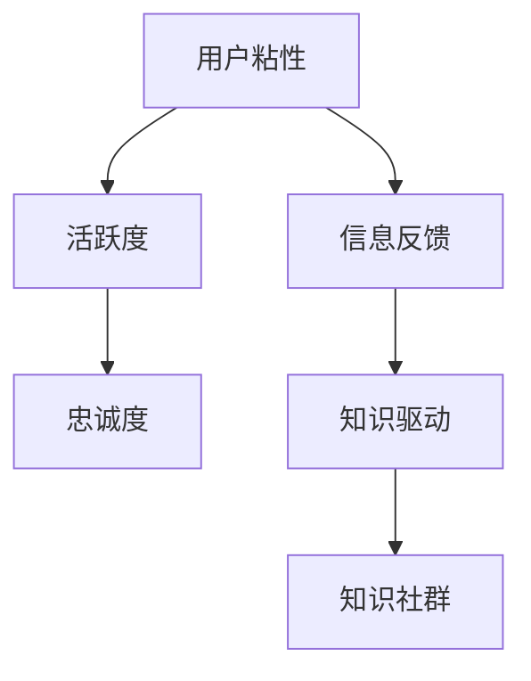

                 

# 如何利用知识社群实现用户的长期运营

## 1. 背景介绍

在互联网快速发展的今天，用户运营成为了企业竞争的核心。然而，传统的内容发布和社区运营模式往往难以满足用户日益增长的需求，导致用户流失率高，忠诚度低。面对这一挑战，企业开始探索利用知识社群，通过知识共享、互动交流等方式实现用户的长期运营。

知识社群（Knowledge Community），即基于共同知识兴趣和目标的在线社区，为用户提供了一个交流、学习和共享的平台。知识社群的成员不仅是消费者，更是知识创造者和分享者。他们通过交流讨论、解决疑问、协作创作等方式，实现知识的积累和传承。

企业利用知识社群进行用户运营，可以大幅度提升用户粘性、活跃度和忠诚度。此外，知识社群的开放性和互动性也为品牌提供了一个高效的信息反馈渠道，有助于企业深入理解用户需求，快速迭代产品和服务，实现双赢。

本文将系统介绍如何利用知识社群实现用户的长期运营，包括核心概念、实现步骤、算法原理、具体案例以及未来展望。

## 2. 核心概念与联系

### 2.1 核心概念概述

为更好地理解知识社群在用户运营中的作用，本节将介绍几个核心概念及其相互联系：

- 知识社群（Knowledge Community）：基于共同知识兴趣和目标的在线社区，成员通过知识分享和互动，实现知识的积累和传承。
- 用户粘性（User Sticking）：用户在社区中长时间留存并频繁参与互动的行为表现。
- 活跃度（Activity）：用户在社区中积极贡献内容、参与讨论、完成学习等行为指标。
- 忠诚度（Loyalty）：用户对社区和品牌的长期依赖与信任，表现为其持续使用社区服务的长期行为。
- 信息反馈（Feedback Loop）：社区成员与企业之间的互动反馈机制，用于指导产品迭代和优化。
- 知识驱动（Knowledge-Driven）：社区运营以知识分享和互动为核心，激发用户的主动学习和交流。

这些概念之间相互关联，共同构成了知识社群用户运营的基础框架。通过设计合理的社区结构，设置有效的激励机制，可以有效提升用户粘性、活跃度和忠诚度，实现用户的长期运营。

### 2.2 核心概念原理和架构的 Mermaid 流程图



这个流程图展示了知识社群用户运营的核心概念及其相互联系：

1. **用户粘性**：是用户长期运营的基石。通过激励机制、互动平台等方式，提升用户留存时间。
2. **活跃度**：是在社区中积极参与的表现。通过设置合理任务、提供奖励等方式，激发用户参与热情。
3. **忠诚度**：是长期依赖与信任的体现。通过社区服务质量的持续提升，建立用户信任。
4. **信息反馈**：是用户行为与企业反馈的互动机制。通过定期调研、用户评论等方式，了解用户需求。
5. **知识驱动**：是社区运营的核心动力。通过知识分享、互动交流，实现知识积累和传承。
6. **知识社群**：是实现以上目标的平台。通过精心设计社区结构，实现知识驱动的用户运营。

## 3. 核心算法原理 & 具体操作步骤

### 3.1 算法原理概述

知识社群用户运营的核心在于通过知识共享、互动交流等方式，实现用户的长期粘性、活跃度和忠诚度提升。其基本算法原理可概括为以下几个方面：

1. **知识共享机制**：利用知识发布、问答、评论等功能，激励用户分享和传播知识。
2. **互动交流机制**：通过评论、点赞、分享等互动方式，促进社区成员之间的交流。
3. **激励机制**：设置积分、勋章、排名等激励措施，激发用户参与的积极性。
4. **社区服务质量提升**：通过持续优化社区功能、内容推荐、搜索排序等，提升用户满意度。
5. **知识驱动**：通过社区运营以知识为核心，激发用户的主动学习和交流。

### 3.2 算法步骤详解

基于以上原理，知识社群用户运营的一般步骤如下：

**Step 1: 设计社区结构**

- 定义社区主题和子主题。根据用户需求和兴趣，设计社区的核心主题和子主题，并确定其内容边界。
- 设计社区功能模块。根据用户行为需求，设计知识发布、问答、讨论、课程等模块，并提供丰富的互动功能。
- 设置激励机制。设计积分、勋章、排名等激励措施，引导用户积极参与。

**Step 2: 用户接入和引导**

- 优化用户注册流程。简化注册步骤，提供多渠道注册选项，减少用户流失。
- 提供社区引导内容。为新用户提供社区介绍、使用教程、知识库等引导内容，帮助用户快速上手。

**Step 3: 知识共享和互动**

- 激励知识发布。设置知识发布奖励，鼓励用户分享专业知识和经验。
- 促进互动交流。通过评论、点赞、分享等方式，增强社区成员之间的互动。
- 组织社区活动。定期举办线上线下活动，如主题讨论、知识竞赛、专家讲座等，增强社区凝聚力。

**Step 4: 激励和反馈**

- 设置积分和勋章。根据用户参与行为，给予积分和勋章奖励，激励用户长期参与。
- 提供排行榜。设置用户排行榜，鼓励用户竞争与合作。
- 收集用户反馈。通过问卷调查、用户评论等方式，了解用户需求，及时调整社区运营策略。

**Step 5: 持续优化和迭代**

- 收集用户数据。利用大数据分析，了解用户行为和偏好，制定优化策略。
- 持续优化社区功能。根据用户反馈和行为数据，持续优化社区功能、内容推荐和搜索排序等。
- 引入新功能和扩展。定期引入新功能和扩展，保持社区的活力和创新性。

### 3.3 算法优缺点

知识社群用户运营具有以下优点：

1. **用户粘性提升**：通过知识共享和互动交流，增强用户留存时间。
2. **活跃度提高**：激励机制和互动方式，激发用户积极参与。
3. **忠诚度增强**：高质量的社区服务，建立用户信任和依赖。
4. **信息反馈高效**：用户反馈渠道畅通，有助于产品迭代和优化。

同时，该方法也存在一定的局限性：

1. **运营成本高**：知识社群需要持续投入人力和资源进行维护和优化。
2. **内容质量参差不齐**：用户发布内容质量良莠不齐，需要进行审核和筛选。
3. **社区运营难度大**：需要灵活应对用户行为和需求变化，进行动态调整。

尽管存在这些局限性，但知识社群作为一种新兴的用户运营模式，其开放性和互动性带来的用户粘性、活跃度和忠诚度的提升，仍然备受企业青睐。

### 3.4 算法应用领域

知识社群用户运营方法广泛应用于知识付费平台、教育培训、技术社区等多个领域：

- **知识付费平台**：如知乎、得到等，通过知识分享和互动，实现用户的长期运营。
- **教育培训**：如Coursera、Udacity等，通过在线课程和社区互动，提升用户参与度和满意度。
- **技术社区**：如GitHub、Stack Overflow等，通过技术交流和协作，增强用户粘性和活跃度。

## 4. 数学模型和公式 & 详细讲解 & 举例说明

### 4.1 数学模型构建

知识社群用户运营的数学模型可简化为以下形式：

$$
\text{用户粘性} = \text{知识共享度} \times \text{互动交流度} \times \text{激励度} + \text{社区服务质量}
$$

其中，知识共享度、互动交流度和激励度分别衡量用户在知识社群中分享知识、交流互动和参与激励的积极性。社区服务质量则通过用户满意度、功能完善度、内容推荐准确性等指标进行衡量。

### 4.2 公式推导过程

以上数学模型可以进一步分解为：

$$
\text{用户粘性} = \sum_{i=1}^n a_i \times \text{行为评分}_i + \text{服务评分}
$$

其中，$a_i$ 表示行为评分对用户粘性的权重，服务评分则表示社区服务质量对用户粘性的影响。行为评分和服务评分可以分别通过用户行为数据和调查问卷等手段进行量化计算。

例如，对于问答社区，行为评分可以定义为：

$$
\text{行为评分} = \frac{\text{问题数} + \text{答案数}}{\text{注册时间} + \text{活跃天数}}
$$

该公式表示用户在问答社区中的活跃程度，问题数和答案数越多，活跃时间越长，行为评分越高，用户粘性越强。

### 4.3 案例分析与讲解

以知乎为例，知乎是一个知识付费平台，通过知识分享和互动，实现用户长期运营。其用户粘性、活跃度和忠诚度提升的策略包括：

1. **知识共享机制**：知乎通过设置问题、回答激励机制，鼓励用户分享专业知识和经验。通过知识帖的点赞、评论等功能，促进知识传播。

2. **互动交流机制**：知乎通过评论、点赞、分享等互动方式，增强社区成员之间的交流。通过关注机制，建立用户之间的联系。

3. **激励机制**：知乎设置积分、勋章、排名等激励措施，引导用户积极参与。积分用于兑换礼品、优惠券等，勋章用于表彰优秀用户，排名用于鼓励竞争与合作。

4. **社区服务质量提升**：知乎通过持续优化社区功能、内容推荐、搜索排序等，提升用户满意度。定期举办主题讨论、知识竞赛、专家讲座等活动，增强社区凝聚力。

通过这些策略，知乎实现了用户长期粘性、活跃度和忠诚度的提升，成为知识付费领域的重要平台。

## 5. 项目实践：代码实例和详细解释说明

### 5.1 开发环境搭建

在进行知识社群用户运营的实践时，我们需要准备好开发环境。以下是使用Python进行Flask开发的环境配置流程：

1. 安装Anaconda：从官网下载并安装Anaconda，用于创建独立的Python环境。

2. 创建并激活虚拟环境：
```bash
conda create -n flask-env python=3.8 
conda activate flask-env
```

3. 安装Flask：
```bash
pip install Flask
```

4. 安装Flask-RESTful：
```bash
pip install Flask-RESTful
```

5. 安装Flask-Admin：
```bash
pip install Flask-Admin
```

6. 安装SQLAlchemy：
```bash
pip install SQLAlchemy
```

7. 安装Flask-Security：
```bash
pip install Flask-Security
```

完成上述步骤后，即可在`flask-env`环境中开始知识社群用户运营的开发实践。

### 5.2 源代码详细实现

我们以一个简单的问答社区为例，实现知识共享和互动功能。以下是一个Flask应用的基本代码框架：

```python
from flask import Flask, render_template, request
from flask_restful import Resource, Api
from flask_admin import Admin
from flask_sqlalchemy import SQLAlchemy
from flask_security import Security, SQLAlchemyUserDatastore, UserMixin, RoleMixin, login_required

app = Flask(__name__)
app.config['SQLALCHEMY_DATABASE_URI'] = 'sqlite:///questions.db'
db = SQLAlchemy(app)
api = Api(app)
admin = Admin(app, name='admin', template_mode='bootstrap3')

# 定义模型
class User(db.Model, UserMixin):
    id = db.Column(db.Integer, primary_key=True)
    email = db.Column(db.String(255), unique=True)
    password = db.Column(db.String(255))
    active = db.Column(db.Boolean())
    confirmed_at = db.Column(db.DateTime())

class Role(db.Model, RoleMixin):
    id = db.Column(db.Integer(), primary_key=True)
    name = db.Column(db.String(80), unique=True)

class Question(db.Model):
    id = db.Column(db.Integer, primary_key=True)
    title = db.Column(db.String(255))
    content = db.Column(db.Text)
    user_id = db.Column(db.Integer, db.ForeignKey('user.id'))
    created_at = db.Column(db.DateTime())
    updated_at = db.Column(db.DateTime())

# 用户认证
user_datastore = SQLAlchemyUserDatastore(db, User, Role)
user_datastore.create_all()

# 安全认证
Security(app, user_datastore)

# 路由
class Questions(Resource):
    def get(self):
        return {'questions': [q.title for q in Question.query.all()]}
    
    def post(self):
        title = request.form['title']
        content = request.form['content']
        user = User.get(current_user.id)
        question = Question(title=title, content=content, user=user)
        db.session.add(question)
        db.session.commit()
        return {'message': 'Question posted successfully'}

api.add_resource(Questions, '/questions')

# 管理后台
class AdminPanel(Admin):
    pass

admin.add_view(AdminPanel)

if __name__ == '__main__':
    app.run(debug=True)
```

以上代码实现了基本的问答社区功能，包括用户注册、登录、发布问题、获取问题列表等。在实际应用中，还需要加入互动功能、激励机制、数据统计等功能，才能实现完整的知识社群用户运营。

### 5.3 代码解读与分析

让我们再详细解读一下关键代码的实现细节：

**Flask应用**：
- 首先，通过Flask创建一个Web应用，并配置SQLAlchemy数据库连接。
- 定义用户、角色和问题模型，用于存储用户、问题和评论数据。
- 创建Flask-Admin管理后台，方便管理员对数据进行管理和监控。

**用户认证**：
- 使用Flask-Security进行用户认证，设置SQLAlchemy数据源，实现用户注册、登录、注册用户数据存储等功能。
- 通过User数据模型，记录用户的基本信息，如用户名、密码、邮箱等。
- 通过Role数据模型，实现用户的角色管理，如管理员、普通用户等。

**路由和API**：
- 定义GET和POST请求的路由，实现获取问题列表和发布问题的功能。
- 使用Flask-RESTful框架，实现API接口，方便前端调用。

**管理后台**：
- 通过Flask-Admin创建管理后台，方便管理员对问题数据进行管理和监控。
- 设置管理后台的名称和模板模式，确保管理员界面美观。

以上代码实现了一个简单的问答社区，满足了基本的知识共享和互动需求。在实际应用中，还可以进一步扩展功能，如评论、点赞、讨论、课程等模块，实现更加完善的社区运营。

## 6. 实际应用场景

### 6.1 智能客服系统

知识社群在智能客服系统中也有广泛应用。传统的客服系统往往依赖人工客服，无法实现7x24小时不间断服务。而知识社群可以通过在线问答、知识库等方式，提升客户自助服务能力，降低人工客服压力。

在知识社群中，客户可以通过搜索知识库、参与在线问答等方式解决常见问题，同时也可以通过发布新问题、参与讨论等方式获取专业解答。通过这种方式，企业可以有效提升客户自助服务能力，降低人工客服成本，提升客户满意度。

### 6.2 企业知识库

知识社群在企业知识库中也有重要应用。传统知识库往往以文档形式存储企业内部知识，难以实现知识共享和传承。而知识社群可以通过在线讨论、知识共享等方式，促进企业内部知识的积累和传播。

在知识社群中，企业员工可以通过在线论坛、知识共享等方式，分享和传播内部知识。通过这种方式，企业可以有效提升员工的知识水平和技能，促进企业内部的知识积累和传承，提升企业竞争力。

### 6.3 教育培训

知识社群在教育培训中也有广泛应用。传统的教育培训往往依赖线下课程和教学，难以实现大规模、灵活的教育方式。而知识社群可以通过在线课程、讨论等方式，实现大规模、灵活的教育培训。

在知识社群中，教育培训机构可以通过在线课程、讨论、问答等方式，为学员提供灵活的学习方式。学员可以通过在线论坛、知识共享等方式，获取学习资源和帮助。通过这种方式，教育培训机构可以有效提升教学质量和效率，满足学员的学习需求。

### 6.4 未来应用展望

随着知识社群技术的不断发展，其在用户运营中的应用将更加广泛。未来，知识社群可以应用于更多场景，如智慧医疗、智能制造、智慧城市等，为各行各业带来变革性影响。

在智慧医疗领域，知识社群可以通过在线问答、专家讨论等方式，提供医疗咨询和支持，提升医疗服务的智能化水平。

在智能制造领域，知识社群可以通过在线论坛、知识共享等方式，促进工程师之间的交流和协作，提升产品设计和生产的效率和质量。

在智慧城市治理中，知识社群可以通过在线讨论、知识共享等方式，提升城市管理智能化水平，增强城市治理能力。

## 7. 工具和资源推荐

### 7.1 学习资源推荐

为了帮助开发者系统掌握知识社群用户运营的理论基础和实践技巧，这里推荐一些优质的学习资源：

1. 《Web应用程序开发实践》系列博文：由Flask官方社区撰写，深入浅出地介绍了Flask应用的开发方法和技巧。

2. 《Flask Web开发实战》书籍：Flask官方文档，详细介绍了Flask框架的用法，涵盖路由、API、用户认证等各个方面。

3. 《Flask-Admin文档》：Flask-Admin官方文档，提供了丰富的管理后台功能实现方法和示例。

4. 《Flask-Security文档》：Flask-Security官方文档，提供了用户认证和权限管理的实现方法和示例。

5. 《Flask-RESTful文档》：Flask-RESTful官方文档，提供了RESTful API的实现方法和示例。

通过对这些资源的学习实践，相信你一定能够快速掌握Flask应用的开发技巧，实现知识社群用户运营。

### 7.2 开发工具推荐

高效的开发离不开优秀的工具支持。以下是几款用于知识社群开发推荐的工具：

1. PyCharm：一款功能强大的Python IDE，提供了丰富的代码编辑器和调试工具，支持Flask应用开发。

2. Visual Studio Code：一款轻量级的代码编辑器，支持Flask应用开发，具备丰富的插件和扩展。

3. Git：一款版本控制系统，适合版本控制和协作开发。

4. Docker：一款容器化平台，方便应用部署和扩展。

5. Kubernetes：一款容器编排平台，支持应用集群和扩展。

6. Jenkins：一款持续集成工具，支持应用构建和部署。

合理利用这些工具，可以显著提升知识社群应用的开发效率，加快创新迭代的步伐。

### 7.3 相关论文推荐

知识社群用户运营的研究源于学界的持续研究。以下是几篇奠基性的相关论文，推荐阅读：

1. "Online Communities as Knowledge Sharing Mechanisms"：这篇论文讨论了在线社区在知识共享机制中的应用，为知识社群用户运营提供了理论基础。

2. "Social Media and Online Communities: Potential and Impact on Lifelong Learning"：这篇论文讨论了社交媒体和在线社区在终身学习中的应用，为知识社群用户运营提供了实践指导。

3. "Knowledge Sharing in Online Communities: The Role of Social Networks"：这篇论文讨论了社交网络在知识共享中的应用，为知识社群用户运营提供了新的思路。

4. "User Engagement Strategies in Online Learning Communities"：这篇论文讨论了在线学习社区的用户参与策略，为知识社群用户运营提供了实际案例。

这些论文代表了大语言模型微调技术的发展脉络。通过学习这些前沿成果，可以帮助研究者把握学科前进方向，激发更多的创新灵感。

## 8. 总结：未来发展趋势与挑战

### 8.1 总结

本文对知识社群用户运营方法进行了全面系统的介绍。首先阐述了知识社群在用户运营中的重要作用，明确了知识社群用户运营的目标和意义。其次，从原理到实践，详细讲解了知识社群用户运营的数学模型、算法步骤和具体案例，给出了知识社群用户运营的完整代码实例。同时，本文还广泛探讨了知识社群在智能客服、企业知识库、教育培训等多个行业领域的应用前景，展示了知识社群用户运营的广阔前景。

通过本文的系统梳理，可以看到，知识社群作为一种新兴的用户运营模式，其开放性和互动性带来的用户粘性、活跃度和忠诚度的提升，仍然备受企业青睐。未来，知识社群有望在更多领域得到应用，为各行各业带来变革性影响。

### 8.2 未来发展趋势

展望未来，知识社群用户运营技术将呈现以下几个发展趋势：

1. **社区规模扩大**：随着知识社群的不断成熟和完善，社区规模将不断扩大，涵盖更多用户和领域。

2. **功能模块丰富**：知识社群将引入更多功能模块，如直播、视频、AR/VR等，提升用户体验。

3. **多渠道融合**：知识社群将与更多渠道融合，如社交媒体、电子邮件、APP等，实现多渠道互动。

4. **数据驱动优化**：通过大数据分析和机器学习技术，优化知识社群的用户运营策略，提升运营效果。

5. **个性化推荐**：利用推荐系统，为用户推荐个性化的内容和学习资源，提升用户满意度和参与度。

6. **知识创新**：知识社群将成为知识创新的重要平台，促进知识共享和传承，激发更多创新灵感。

以上趋势凸显了知识社群用户运营技术的广阔前景。这些方向的探索发展，必将进一步提升知识社群用户粘性、活跃度和忠诚度，实现用户的长期运营。

### 8.3 面临的挑战

尽管知识社群用户运营技术已经取得了显著成就，但在迈向更加智能化、普适化应用的过程中，它仍面临着诸多挑战：

1. **用户行为多样**：不同用户的需求和行为差异较大，需要灵活设计社区结构和运营策略。
2. **运营成本高**：知识社群需要持续投入人力和资源进行维护和优化，运营成本较高。
3. **内容质量控制**：用户发布内容质量良莠不齐，需要进行审核和筛选。
4. **社区管理难度大**：需要灵活应对用户行为和需求变化，进行动态调整。

尽管存在这些挑战，但知识社群作为一种新兴的用户运营模式，其开放性和互动性带来的用户粘性、活跃度和忠诚度的提升，仍然备受企业青睐。相信随着技术的不断进步和应用场景的拓展，知识社群用户运营技术将不断成熟，成为用户运营的重要手段。

### 8.4 研究展望

面对知识社群用户运营所面临的挑战，未来的研究需要在以下几个方面寻求新的突破：

1. **引入更多元化的用户需求**：设计更加多样化的知识社群结构和运营策略，满足不同用户的需求。
2. **优化内容质量控制机制**：通过机器学习和大数据技术，优化内容审核和筛选机制，提升内容质量。
3. **实现多渠道互动**：引入更多渠道，如社交媒体、电子邮件、APP等，实现多渠道互动，提升用户参与度。
4. **引入知识驱动的运营策略**：通过知识共享和互动，激发用户的主动学习和交流，提升社区运营效果。
5. **建立社区管理机制**：建立社区管理机制，规范用户行为，维护社区秩序。

这些研究方向的探索，必将引领知识社群用户运营技术迈向更高的台阶，为构建安全、可靠、可解释、可控的智能系统铺平道路。面向未来，知识社群用户运营技术还需要与其他人工智能技术进行更深入的融合，如知识表示、因果推理、强化学习等，多路径协同发力，共同推动自然语言理解和智能交互系统的进步。只有勇于创新、敢于突破，才能不断拓展知识社群的边界，让智能技术更好地造福人类社会。

## 9. 附录：常见问题与解答

**Q1：知识社群如何引入更多用户？**

A: 知识社群可以通过多种方式引入更多用户，如社交媒体推广、搜索引擎优化、邮件营销等。还可以通过邀请机制、奖励机制等方式，激励用户邀请朋友加入社区。

**Q2：如何提高知识社群的用户参与度？**

A: 知识社群可以通过多种方式提高用户参与度，如发布高质量内容、设置激励机制、组织线上线下活动等。还可以通过定期调研、用户评论等方式，了解用户需求，及时调整社区运营策略。

**Q3：知识社群如何管理用户行为？**

A: 知识社群可以通过设置社区规则、用户行为规范等方式，规范用户行为。还可以利用机器学习技术，识别并处理违规行为，维护社区秩序。

**Q4：知识社群如何优化内容质量？**

A: 知识社群可以通过设置内容审核机制、用户反馈机制等方式，优化内容质量。还可以利用机器学习和大数据技术，自动筛选高质量内容，提升社区内容质量。

**Q5：知识社群如何提升用户满意度？**

A: 知识社群可以通过优化社区功能、内容推荐、搜索排序等，提升用户满意度。还可以通过定期调研、用户评论等方式，了解用户需求，及时调整社区运营策略。

通过本文的系统梳理，可以看到，知识社群作为一种新兴的用户运营模式，其开放性和互动性带来的用户粘性、活跃度和忠诚度的提升，仍然备受企业青睐。未来，知识社群有望在更多领域得到应用，为各行各业带来变革性影响。面对知识社群用户运营所面临的挑战，未来的研究需要在更多方向寻求新的突破，不断优化社区结构和运营策略，提升用户满意度和参与度，实现用户的长期运营。

