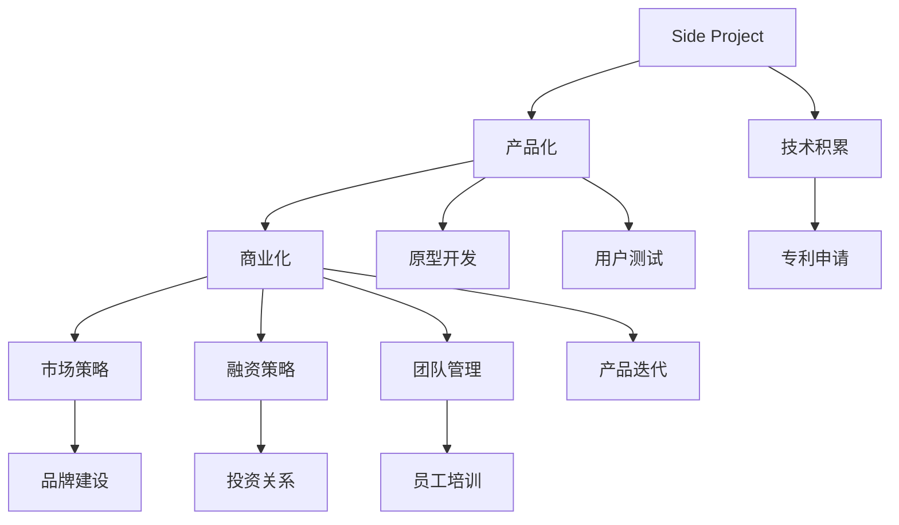

                 

# 如何将Side Project转化为估值上亿的创业公司

> 关键词：创业公司,Side Project,商业化,产品化,市场策略

## 1. 背景介绍

### 1.1 问题由来
在科技创业领域， Side Project 是一个常见的概念。它通常指的是创业者在主要项目之外的次要项目，旨在探索新思路、积累经验或进行个人兴趣的发挥。Side Project 对于技术人才来说并不陌生，从开发一个简单的工具应用到构建一个完整的软件产品，Side Project 承载了创新和商业化的潜力。但将 Side Project 转化为一个估值上亿的创业公司，则需要深度思考和精妙操作。

### 1.2 问题核心关键点
将 Side Project 转化为估值上亿的创业公司，关键在于以下几个核心点：

1. **创新能力**：原创性和创新性是吸引投资者的核心要素。
2. **市场洞察**：准确判断市场需求和趋势，使产品能够满足市场需要。
3. **产品化**：将创新的想法转化为可用的产品，具有市场竞争力。
4. **商业化策略**：制定有效的商业模式，能够产生持续的收入。
5. **团队建设**：组建具有高素质、富有活力的团队，推动产品落地。
6. **资源整合**：有效整合资源，如资金、技术、市场等，推动公司快速成长。

### 1.3 问题研究意义
研究如何将 Side Project 转化为估值上亿的创业公司，对创业者、投资者和行业从业者具有重要意义：

1. **帮助创业者提升成功率**：明确转化路径，提高 Side Project 的商业化成功率。
2. **助力投资者精准投资**：提供清晰的评估标准，帮助投资者识别潜在的高价值创业公司。
3. **推动行业发展**：提供实际案例和操作指南，促进整个科技行业的繁荣发展。

## 2. 核心概念与联系

### 2.1 核心概念概述

为更好地理解从 Side Project 到创业公司的转化过程，本节将介绍几个关键概念：

- **Side Project**：指创业者在主要项目之外，进行技术实验、探索新思路的次要项目。
- **创业公司**：指一群创业者通过技术创新和商业运作，打造具有市场价值的产品和服务，期望实现商业成功的组织。
- **产品化**：将创意和设计转化为具体的、可用的产品。
- **商业化**：制定商业模式，使产品具有市场竞争力和盈利能力。
- **市场策略**：针对市场环境，制定有效的营销和销售策略，推动产品普及。
- **融资策略**：通过风险投资、天使投资等方式，获得必要的资金支持。
- **团队管理**：合理配置人力资源，提高团队效率和士气。

### 2.2 核心概念原理和架构的 Mermaid 流程图



这个流程图展示了从 Side Project 到创业公司转化的关键步骤：

1. **技术积累**：在 Side Project 阶段积累技术经验。
2. **产品化**：将技术转化为具体的、可用的产品。
3. **商业化**：制定商业模式，使产品具有市场竞争力。
4. **市场策略**：根据市场需求，制定有效的营销和销售策略。
5. **融资策略**：通过各种渠道获得必要的资金支持。
6. **团队管理**：合理配置人力资源，提高团队效率和士气。
7. **持续迭代**：根据市场反馈不断优化产品。

## 3. 核心算法原理 & 具体操作步骤

### 3.1 算法原理概述

将 Side Project 转化为创业公司的过程，本质上是将技术创新和商业运作相结合，从研发到市场的过程。这一过程需要通过一系列的决策和操作来实现。

- **产品创意与设计**：确定产品功能和商业模式。
- **市场调研与需求分析**：分析市场需求和用户行为。
- **原型开发与测试**：构建产品原型并进行用户测试。
- **商业模式设计**：确定产品的盈利模式和定价策略。
- **市场推广与销售**：推广产品并实现销售转化。
- **融资与投资关系**：获得必要的资金支持并建立投资关系。
- **团队建设与管理**：组建团队并合理配置人力资源。

### 3.2 算法步骤详解

将 Side Project 转化为创业公司的详细步骤：

1. **项目立项与团队组建**：明确项目目标，组建具有高素质、富有活力的团队。
2. **市场调研与需求分析**：通过问卷调查、竞品分析等方式，收集市场需求和用户痛点。
3. **技术方案设计**：根据市场需求，设计合适的技术方案和产品原型。
4. **产品原型开发**：构建最小可行产品（MVP），实现核心功能。
5. **用户测试与反馈**：邀请目标用户进行测试，收集反馈并优化产品。
6. **商业模式设计**：确定产品的盈利模式，如广告、订阅、交易等。
7. **市场推广与销售**：制定市场策略并进行推广，实现产品销售转化。
8. **融资与投资关系**：通过风险投资、天使投资等方式，获得必要的资金支持。
9. **持续迭代与优化**：根据市场反馈，不断优化产品，提升用户体验和市场竞争力。

### 3.3 算法优缺点

**优点**：

1. **灵活创新**：Side Project 提供了一个创新的空间，可灵活探索新技术和新思路。
2. **资源共享**：可以利用主项目的技术和市场资源，降低创业成本。
3. **快速迭代**：Side Project 可以更快地进行产品迭代和优化。
4. **市场验证**：通过小规模验证，降低商业风险。

**缺点**：

1. **资源有限**：Side Project 的资源往往有限，难以大规模推广。
2. **技术风险**：新技术的实验存在较大风险，可能无法达到预期效果。
3. **团队不稳定性**：团队成员可能同时兼顾多个项目，影响工作效果。
4. **市场定位不清**：侧重点可能不够清晰，难以精确切入市场。

### 3.4 算法应用领域

将 Side Project 转化为创业公司的算法，在多个领域都具有广泛的应用：

1. **初创企业**：帮助初创企业快速将技术创意转化为市场产品，实现商业化。
2. **技术创业者**：提供从技术创新到市场推广的全流程指导。
3. **产品转型**：指导已有企业通过技术创新进行产品转型，提升市场竞争力。
4. **行业应用**：应用于各类行业，如医疗、教育、金融等，推动产业数字化转型。

## 4. 数学模型和公式 & 详细讲解 & 举例说明

### 4.1 数学模型构建

本节将使用数学语言对 Side Project 到创业公司的转化过程进行更严格的刻画。

设Side Project的初始投资为 $I$，市场潜在用户数量为 $U$，用户转化率为 $c$，平均客单价为 $P$，单用户获取成本为 $C_A$，销售边际成本为 $C_M$，预期利润率为 $R$。

**市场潜力模型**：
$$
U = \frac{I}{c \cdot P}
$$

**用户获取成本模型**：
$$
C_A = \frac{I}{c \cdot U}
$$

**预期收入模型**：
$$
E = U \cdot P \cdot c \cdot R
$$

**预期成本模型**：
$$
C = I + C_A \cdot U + C_M \cdot E
$$

**预期利润模型**：
$$
\pi = E - C
$$

### 4.2 公式推导过程

推导如下：

1. **市场潜力模型**：
   - $I$ 为初始投资，$P$ 为平均客单价，$c$ 为用户转化率，$U$ 为潜在用户数量。
   $$
   U = \frac{I}{c \cdot P}
   $$

2. **用户获取成本模型**：
   - $U$ 为潜在用户数量，$C_A$ 为用户获取成本。
   $$
   C_A = \frac{I}{c \cdot U}
   $$

3. **预期收入模型**：
   - $U$ 为潜在用户数量，$P$ 为平均客单价，$c$ 为用户转化率，$R$ 为预期利润率。
   $$
   E = U \cdot P \cdot c \cdot R
   $$

4. **预期成本模型**：
   - $I$ 为初始投资，$C_A$ 为用户获取成本，$C_M$ 为销售边际成本，$E$ 为预期收入。
   $$
   C = I + C_A \cdot U + C_M \cdot E
   $$

5. **预期利润模型**：
   - $E$ 为预期收入，$C$ 为预期成本。
   $$
   \pi = E - C
   $$

### 4.3 案例分析与讲解

以医疗诊断 App 为例，分析其 Side Project 到创业公司的转化过程。

1. **项目立项与团队组建**：
   - 初期投资 $I=100万，市场潜在用户数量 $U=100万，用户转化率 $c=10\%$，平均客单价 $P=500元，单用户获取成本 $C_A=500元，销售边际成本 $C_M=30元，预期利润率 $R=30\%$。

2. **市场调研与需求分析**：
   - 通过问卷调查和竞品分析，确定市场需求，用户对在线医疗诊断需求旺盛。

3. **技术方案设计**：
   - 设计基于深度学习模型的医疗诊断 App，实现智能诊断、症状提醒等功能。

4. **产品原型开发**：
   - 构建 MVP 版本，实现核心功能，并进行用户测试。

5. **用户测试与反馈**：
   - 邀请部分用户进行测试，收集反馈，优化产品界面和功能。

6. **商业模式设计**：
   - 确定广告+订阅的模式，用户可以选择免费版或付费版。

7. **市场推广与销售**：
   - 通过线上线下渠道推广，吸引用户使用并转化。

8. **融资与投资关系**：
   - 通过风险投资，获得必要资金支持，建立投资关系。

9. **持续迭代与优化**：
   - 根据市场反馈，持续优化产品，提升用户体验和市场竞争力。

## 5. 项目实践：代码实例和详细解释说明

### 5.1 开发环境搭建

在进行 Side Project 到创业公司转化的实践前，我们需要准备好开发环境。以下是使用Python进行PyTorch开发的环境配置流程：

1. 安装Anaconda：从官网下载并安装Anaconda，用于创建独立的Python环境。

2. 创建并激活虚拟环境：
```bash
conda create -n pytorch-env python=3.8 
conda activate pytorch-env
```

3. 安装PyTorch：根据CUDA版本，从官网获取对应的安装命令。例如：
```bash
conda install pytorch torchvision torchaudio cudatoolkit=11.1 -c pytorch -c conda-forge
```

4. 安装各类工具包：
```bash
pip install numpy pandas scikit-learn matplotlib tqdm jupyter notebook ipython
```

完成上述步骤后，即可在`pytorch-env`环境中开始项目实践。

### 5.2 源代码详细实现

这里我们以医疗诊断 App 为例，给出使用Transformers库对BERT模型进行微调的PyTorch代码实现。

首先，定义医疗诊断任务的数据处理函数：

```python
from transformers import BertTokenizer
from torch.utils.data import Dataset
import torch

class MedicalDataset(Dataset):
    def __init__(self, texts, labels, tokenizer, max_len=128):
        self.texts = texts
        self.labels = labels
        self.tokenizer = tokenizer
        self.max_len = max_len
        
    def __len__(self):
        return len(self.texts)
    
    def __getitem__(self, item):
        text = self.texts[item]
        label = self.labels[item]
        
        encoding = self.tokenizer(text, return_tensors='pt', max_length=self.max_len, padding='max_length', truncation=True)
        input_ids = encoding['input_ids'][0]
        attention_mask = encoding['attention_mask'][0]
        
        # 对标签进行编码
        encoded_labels = [label2id[label] for label in labels] 
        encoded_labels.extend([label2id['O']] * (self.max_len - len(encoded_labels)))
        labels = torch.tensor(encoded_labels, dtype=torch.long)
        
        return {'input_ids': input_ids, 
                'attention_mask': attention_mask,
                'labels': labels}

# 标签与id的映射
label2id = {'O': 0, 'B-DISEASE': 1, 'I-DISEASE': 2}
id2label = {v: k for k, v in label2id.items()}

# 创建dataset
tokenizer = BertTokenizer.from_pretrained('bert-base-cased')

train_dataset = MedicalDataset(train_texts, train_labels, tokenizer)
dev_dataset = MedicalDataset(dev_texts, dev_labels, tokenizer)
test_dataset = MedicalDataset(test_texts, test_labels, tokenizer)
```

然后，定义模型和优化器：

```python
from transformers import BertForTokenClassification, AdamW

model = BertForTokenClassification.from_pretrained('bert-base-cased', num_labels=len(label2id))

optimizer = AdamW(model.parameters(), lr=2e-5)
```

接着，定义训练和评估函数：

```python
from torch.utils.data import DataLoader
from tqdm import tqdm
from sklearn.metrics import classification_report

device = torch.device('cuda') if torch.cuda.is_available() else torch.device('cpu')
model.to(device)

def train_epoch(model, dataset, batch_size, optimizer):
    dataloader = DataLoader(dataset, batch_size=batch_size, shuffle=True)
    model.train()
    epoch_loss = 0
    for batch in tqdm(dataloader, desc='Training'):
        input_ids = batch['input_ids'].to(device)
        attention_mask = batch['attention_mask'].to(device)
        labels = batch['labels'].to(device)
        model.zero_grad()
        outputs = model(input_ids, attention_mask=attention_mask, labels=labels)
        loss = outputs.loss
        epoch_loss += loss.item()
        loss.backward()
        optimizer.step()
    return epoch_loss / len(dataloader)

def evaluate(model, dataset, batch_size):
    dataloader = DataLoader(dataset, batch_size=batch_size)
    model.eval()
    preds, labels = [], []
    with torch.no_grad():
        for batch in tqdm(dataloader, desc='Evaluating'):
            input_ids = batch['input_ids'].to(device)
            attention_mask = batch['attention_mask'].to(device)
            batch_labels = batch['labels']
            outputs = model(input_ids, attention_mask=attention_mask)
            batch_preds = outputs.logits.argmax(dim=2).to('cpu').tolist()
            batch_labels = batch_labels.to('cpu').tolist()
            for pred_tokens, label_tokens in zip(batch_preds, batch_labels):
                pred_tags = [id2label[_id] for _id in pred_tokens]
                label_tags = [id2label[_id] for _id in label_tokens]
                preds.append(pred_tags[:len(label_tags)])
                labels.append(label_tags)
                
    print(classification_report(labels, preds))
```

最后，启动训练流程并在测试集上评估：

```python
epochs = 5
batch_size = 16

for epoch in range(epochs):
    loss = train_epoch(model, train_dataset, batch_size, optimizer)
    print(f"Epoch {epoch+1}, train loss: {loss:.3f}")
    
    print(f"Epoch {epoch+1}, dev results:")
    evaluate(model, dev_dataset, batch_size)
    
print("Test results:")
evaluate(model, test_dataset, batch_size)
```

以上就是使用PyTorch对BERT进行医疗诊断任务微调的完整代码实现。可以看到，得益于Transformers库的强大封装，我们可以用相对简洁的代码完成BERT模型的加载和微调。

### 5.3 代码解读与分析

让我们再详细解读一下关键代码的实现细节：

**MedicalDataset类**：
- `__init__`方法：初始化文本、标签、分词器等关键组件。
- `__len__`方法：返回数据集的样本数量。
- `__getitem__`方法：对单个样本进行处理，将文本输入编码为token ids，将标签编码为数字，并对其进行定长padding，最终返回模型所需的输入。

**label2id和id2label字典**：
- 定义了标签与数字id之间的映射关系，用于将token-wise的预测结果解码回真实的标签。

**训练和评估函数**：
- 使用PyTorch的DataLoader对数据集进行批次化加载，供模型训练和推理使用。
- 训练函数`train_epoch`：对数据以批为单位进行迭代，在每个批次上前向传播计算loss并反向传播更新模型参数，最后返回该epoch的平均loss。
- 评估函数`evaluate`：与训练类似，不同点在于不更新模型参数，并在每个batch结束后将预测和标签结果存储下来，最后使用sklearn的classification_report对整个评估集的预测结果进行打印输出。

**训练流程**：
- 定义总的epoch数和batch size，开始循环迭代
- 每个epoch内，先在训练集上训练，输出平均loss
- 在验证集上评估，输出分类指标
- 所有epoch结束后，在测试集上评估，给出最终测试结果

可以看到，PyTorch配合Transformers库使得BERT微调的代码实现变得简洁高效。开发者可以将更多精力放在数据处理、模型改进等高层逻辑上，而不必过多关注底层的实现细节。

当然，工业级的系统实现还需考虑更多因素，如模型的保存和部署、超参数的自动搜索、更灵活的任务适配层等。但核心的微调范式基本与此类似。

## 6. 实际应用场景

### 6.1 智能客服系统

基于大语言模型微调的对话技术，可以广泛应用于智能客服系统的构建。传统客服往往需要配备大量人力，高峰期响应缓慢，且一致性和专业性难以保证。而使用微调后的对话模型，可以7x24小时不间断服务，快速响应客户咨询，用自然流畅的语言解答各类常见问题。

在技术实现上，可以收集企业内部的历史客服对话记录，将问题和最佳答复构建成监督数据，在此基础上对预训练对话模型进行微调。微调后的对话模型能够自动理解用户意图，匹配最合适的答案模板进行回复。对于客户提出的新问题，还可以接入检索系统实时搜索相关内容，动态组织生成回答。如此构建的智能客服系统，能大幅提升客户咨询体验和问题解决效率。

### 6.2 金融舆情监测

金融机构需要实时监测市场舆论动向，以便及时应对负面信息传播，规避金融风险。传统的人工监测方式成本高、效率低，难以应对网络时代海量信息爆发的挑战。基于大语言模型微调的文本分类和情感分析技术，为金融舆情监测提供了新的解决方案。

具体而言，可以收集金融领域相关的新闻、报道、评论等文本数据，并对其进行主题标注和情感标注。在此基础上对预训练语言模型进行微调，使其能够自动判断文本属于何种主题，情感倾向是正面、中性还是负面。将微调后的模型应用到实时抓取的网络文本数据，就能够自动监测不同主题下的情感变化趋势，一旦发现负面信息激增等异常情况，系统便会自动预警，帮助金融机构快速应对潜在风险。

### 6.3 个性化推荐系统

当前的推荐系统往往只依赖用户的历史行为数据进行物品推荐，无法深入理解用户的真实兴趣偏好。基于大语言模型微调技术，个性化推荐系统可以更好地挖掘用户行为背后的语义信息，从而提供更精准、多样的推荐内容。

在实践中，可以收集用户浏览、点击、评论、分享等行为数据，提取和用户交互的物品标题、描述、标签等文本内容。将文本内容作为模型输入，用户的后续行为（如是否点击、购买等）作为监督信号，在此基础上微调预训练语言模型。微调后的模型能够从文本内容中准确把握用户的兴趣点。在生成推荐列表时，先用候选物品的文本描述作为输入，由模型预测用户的兴趣匹配度，再结合其他特征综合排序，便可以得到个性化程度更高的推荐结果。

### 6.4 未来应用展望

随着大语言模型微调技术的发展，基于微调范式将在更多领域得到应用，为传统行业带来变革性影响。

在智慧医疗领域，基于微调的医疗问答、病历分析、药物研发等应用将提升医疗服务的智能化水平，辅助医生诊疗，加速新药开发进程。

在智能教育领域，微调技术可应用于作业批改、学情分析、知识推荐等方面，因材施教，促进教育公平，提高教学质量。

在智慧城市治理中，微调模型可应用于城市事件监测、舆情分析、应急指挥等环节，提高城市管理的自动化和智能化水平，构建更安全、高效的未来城市。

此外，在企业生产、社会治理、文娱传媒等众多领域，基于大模型微调的人工智能应用也将不断涌现，为NLP技术带来了全新的突破。相信随着预训练模型和微调方法的不断进步，NLP技术将在更广阔的应用领域大放异彩。

## 7. 工具和资源推荐

### 7.1 学习资源推荐

为了帮助开发者系统掌握Side Project转化为创业公司的理论基础和实践技巧，这里推荐一些优质的学习资源：

1. 《创业之路：从 Side Project 到估值上亿的创业公司》系列博文：由技术专家撰写，深入浅出地介绍了从Side Project到创业公司的转化过程，包括项目立项、团队组建、产品化、商业化等各个环节。

2. 《创业指导手册》课程：多所知名高校和创业孵化器联合开发的在线课程，涵盖创业项目策划、融资策略、市场推广等各个方面。

3. 《从0到1：打造一家有价值的创业公司》书籍：著名投资人兼创业者Paul Graham的经典著作，深入分析了创业公司的成功因素和失败教训。

4. 《商业模式画布》工具：用于构建和优化商业模式的工具，帮助你系统化思考产品、用户、渠道、收入等各个环节。

5. Lean Startup：Eric Ries提出的创业方法论，强调快速迭代、数据驱动、持续验证的重要性。

通过对这些资源的学习实践，相信你一定能够快速掌握Side Project到创业公司的转化路径，并用于解决实际的创业问题。

### 7.2 开发工具推荐

高效的开发离不开优秀的工具支持。以下是几款用于Side Project到创业公司转化的常用工具：

1. PyTorch：基于Python的开源深度学习框架，灵活动态的计算图，适合快速迭代研究。大部分预训练语言模型都有PyTorch版本的实现。

2. TensorFlow：由Google主导开发的开源深度学习框架，生产部署方便，适合大规模工程应用。同样有丰富的预训练语言模型资源。

3. Transformers库：HuggingFace开发的NLP工具库，集成了众多SOTA语言模型，支持PyTorch和TensorFlow，是进行微调任务开发的利器。

4. Weights & Biases：模型训练的实验跟踪工具，可以记录和可视化模型训练过程中的各项指标，方便对比和调优。与主流深度学习框架无缝集成。

5. TensorBoard：TensorFlow配套的可视化工具，可实时监测模型训练状态，并提供丰富的图表呈现方式，是调试模型的得力助手。

6. Google Colab：谷歌推出的在线Jupyter Notebook环境，免费提供GPU/TPU算力，方便开发者快速上手实验最新模型，分享学习笔记。

合理利用这些工具，可以显著提升Side Project到创业公司转化的开发效率，加快创新迭代的步伐。

### 7.3 相关论文推荐

Side Project转化为创业公司的研究源于学界的持续研究。以下是几篇奠基性的相关论文，推荐阅读：

1. "What Makes an Entrepreneur?"：对创业者特质和创业成功因素的研究，帮助理解创业项目的立项和团队组建。

2. "The Lean Startup"：Eric Ries的著作，强调快速迭代和数据驱动，提供了实用的创业方法论。

3. "Customer Relationship Management"：探讨如何通过客户关系管理提升创业公司的销售转化和客户保留。

4. "Business Model Generation"：详细介绍了商业模式画布工具的使用方法，帮助构建和优化商业模型。

5. "From Idea to Product"：哈佛商学院的课程，涵盖从产品创意到市场推广的全流程指导。

这些论文代表了大语言模型微调技术的发展脉络。通过学习这些前沿成果，可以帮助研究者把握学科前进方向，激发更多的创新灵感。

## 8. 总结：未来发展趋势与挑战

### 8.1 总结

本文对Side Project转化为创业公司的过程进行了全面系统的介绍。首先阐述了Side Project到创业公司的转化背景和意义，明确了转化路径的关键点。其次，从原理到实践，详细讲解了转化的数学模型和关键步骤，给出了微调任务开发的完整代码实例。同时，本文还广泛探讨了微调方法在多个行业领域的应用前景，展示了微调范式的巨大潜力。此外，本文精选了微调技术的各类学习资源，力求为读者提供全方位的技术指引。

通过本文的系统梳理，可以看到，将Side Project转化为创业公司需要全面考虑技术、市场、商业等多个方面，不断迭代优化。只有从创意、设计、测试、推广等多个环节进行系统化操作，才能最大限度地发挥Side Project的潜力，实现商业成功。

### 8.2 未来发展趋势

展望未来，Side Project转化为创业公司的趋势将呈现以下几个发展方向：

1. **创新技术融合**：结合区块链、人工智能、物联网等新技术，提升产品的创新性和竞争力。
2. **全球市场拓展**：利用跨境电商、国际物流等工具，扩展市场范围，实现全球化运营。
3. **绿色可持续发展**：注重环境和社会责任，推动绿色科技创新和可持续发展。
4. **产品差异化**：通过独特的用户体验和个性化定制，打造差异化产品，满足用户多元化需求。
5. **服务生态构建**：构建完整的生态系统，包括产品、服务、社区等多个方面，提升用户粘性和忠诚度。
6. **数据驱动决策**：利用大数据和AI技术，优化运营决策，提高市场响应速度。

这些趋势凸显了Side Project转化为创业公司的广阔前景。未来的创业公司将通过技术创新和商业模式创新，不断提升产品的市场竞争力，满足不同用户群体的需求。

### 8.3 面临的挑战

尽管Side Project转化为创业公司在技术创新和市场拓展上具有巨大潜力，但在迈向成功的过程中，仍面临以下挑战：

1. **市场风险**：市场需求变化快，新产品难以快速切入市场。
2. **资金不足**：创业初期资金链紧张，融资困难。
3. **团队协作**：多部门协同难度大，需要高效的项目管理和沟通。
4. **法律合规**：涉及数据隐私、知识产权等多个法律问题，需严格合规。
5. **技术迭代**：技术更新快，需不断迭代优化产品。
6. **竞争压力**：市场竞争激烈，需快速响应市场变化。

只有正视这些挑战，不断优化策略和操作，才能将Side Project成功转化为估值上亿的创业公司。

### 8.4 研究展望

面对Side Project转化为创业公司所面临的挑战，未来的研究需要在以下几个方面寻求新的突破：

1. **快速迭代和数据驱动**：利用数据科学和机器学习技术，进行快速市场验证和迭代优化。
2. **多元化融资渠道**：探索风险投资、众筹、预付费等多元化融资方式，解决资金瓶颈。
3. **协作平台和工具**：开发高效的项目管理和协作平台，促进团队协作。
4. **法律合规和安全**：加强数据隐私保护和知识产权保护，确保合法合规。
5. **技术框架优化**：构建可扩展、可复用的技术框架，加速产品开发。
6. **用户体验设计**：深入研究用户体验设计，提升产品易用性和用户体验。

这些研究方向将引领Side Project转化为创业公司走向更高的台阶，为实现商业成功提供科学方法。

## 9. 附录：常见问题与解答

**Q1：Side Project到创业公司的转化过程需要多久？**

A: 将Side Project转化为创业公司是一个复杂的过程，具体时间取决于项目规模、团队实力、市场环境等多个因素。一般来说，从概念验证到商业化运营，可能需要1-2年甚至更长时间。重要的是不断迭代优化，持续验证市场。

**Q2：如何选择市场切入点？**

A: 选择市场切入点需要综合考虑以下几个因素：
1. **市场需求**：选择具有广泛市场需求的产品。
2. **竞争态势**：分析竞争对手，找到差异化竞争点。
3. **资源优势**：利用团队技术和资源优势，选择可快速落地的产品。
4. **用户痛点**：针对用户痛点，提供解决方案。
5. **商业模式**：确定盈利模式和定价策略，确保可持续盈利。

**Q3：如何组建高效团队？**

A: 组建高效团队需要以下几点：
1. **明确目标**：团队成员需对目标有共同理解。
2. **角色分工**：根据成员能力，合理分工，明确职责。
3. **激励机制**：建立有效的激励机制，激发团队动力。
4. **沟通协作**：建立高效的沟通协作渠道，确保信息流畅。
5. **持续学习**：团队需不断学习和适应新技术和新市场变化。

**Q4：如何应对市场风险？**

A: 应对市场风险需采取以下措施：
1. **快速迭代**：不断测试和优化产品，快速响应市场变化。
2. **数据驱动**：利用数据分析，优化市场策略。
3. **多元化渠道**：利用多渠道推广，分散风险。
4. **灵活调整**：根据市场反馈，灵活调整产品策略。
5. **用户反馈**：重视用户反馈，持续改进产品。

**Q5：如何确保法律合规？**

A: 确保法律合规需注意以下几点：
1. **了解法规**：熟悉相关法律法规，避免法律风险。
2. **数据保护**：加强数据隐私保护，确保用户数据安全。
3. **知识产权**：明确知识产权归属，避免侵权风险。
4. **合规审核**：建立合规审核机制，确保合规操作。
5. **法律顾问**：聘请法律顾问，提供专业法律支持。

---

作者：禅与计算机程序设计艺术 / Zen and the Art of Computer Programming

