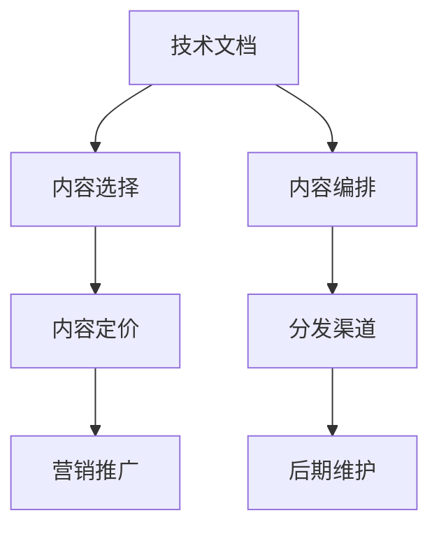

                 

# 如何将技术文档转化为付费电子书

> 关键词：技术文档,付费电子书,内容营销,出版商,出版策略

## 1. 背景介绍

### 1.1 问题由来

在数字化时代，技术文档和知识内容成为了科技公司最宝贵的资产之一。无论是产品手册、白皮书、案例分析，还是技术指南、教程、代码示例，这些内容都是构建品牌声誉、吸引客户、提升市场竞争力的关键。然而，面对海量的内容资源，如何有效管理和利用这些文档，使之产生更大的商业价值，成为了许多公司的难题。

近年来，付费电子书作为一种新兴的出版和内容营销方式，正受到越来越多公司的青睐。其能够将技术文档的深度和广度提炼并集中呈现，形成高附加值的产品，不仅能够吸引特定领域的读者，还能够带来可观的销售收入。本文将深入探讨如何将技术文档转化为付费电子书，并提出一系列策略和工具，帮助技术公司实现这一目标。

### 1.2 问题核心关键点

将技术文档转化为付费电子书的核心在于：

1. **内容选择**：选择哪些技术文档最具市场价值，能够吸引目标读者群体。
2. **内容编排**：如何结构化内容，使其逻辑清晰、信息丰富，提升读者的阅读体验。
3. **内容定价**：基于市场调研和读者反馈，合理定价，确保收益最大化。
4. **分发渠道**：选择合适的平台和工具，将电子书广泛传播。
5. **营销推广**：通过各种手段，增加电子书曝光率和销量。
6. **后期维护**：持续更新内容，保证电子书的时效性和实用性。

这些核心关键点构成了技术文档转化的框架，并贯穿于整个出版流程。

### 1.3 问题研究意义

对于技术公司而言，将技术文档转化为付费电子书，不仅能够提高品牌影响力，还能够直接转化为收入来源，进一步优化财务结构。此外，电子书作为数字化内容产品，具有成本低、易于传播、可重复利用的优势，能够适应数字化时代的需求。

对于读者而言，付费电子书能够提供高质量、系统化、前沿性的技术内容，帮助他们深入理解技术原理、掌握实战技能，从而在职业发展中取得优势。

## 2. 核心概念与联系

### 2.1 核心概念概述

为了更好地理解如何将技术文档转化为付费电子书，本节将介绍几个关键概念：

- **技术文档**：涵盖产品手册、白皮书、案例分析、技术指南、教程、代码示例等多种形式的技术内容，是技术公司知识资产的重要组成部分。
- **付费电子书**：通过收取费用提供电子版的技术书籍，相对于免费电子书，内容更具深度和系统性。
- **内容营销**：利用技术文档等内容资源，吸引潜在客户，提升品牌知名度和市场影响力。
- **出版商**：专业出版机构或科技公司，负责电子书的开发、发布和销售。
- **出版策略**：涵盖内容选择、编排、定价、分发、营销和维护等多个环节，是出版成功的关键。
- **分发渠道**：电子书销售和分发的平台和工具，如亚马逊Kindle Store、Apple Books、Google Play Books等。
- **营销推广**：通过各种手段提升电子书曝光率和销量，包括SEO优化、社交媒体营销、邮件营销、内容合作等。

这些核心概念之间的逻辑关系可以通过以下Mermaid流程图来展示：



这个流程图展示了技术文档转化的主要流程：

1. 从技术文档中选择最有价值的内容。
2. 对内容进行系统化的编排。
3. 确定电子书的价格策略。
4. 选择合适的分发渠道。
5. 通过营销推广提升电子书销量。
6. 持续更新内容，确保电子书的时效性和实用性。

## 3. 核心算法原理 & 具体操作步骤

### 3.1 算法原理概述

将技术文档转化为付费电子书，本质上是内容产品的精炼和市场化过程。其核心在于通过一系列有策略的操作，将原始的技术文档转换为满足市场需求、具备商业价值的产品。

### 3.2 算法步骤详解

**Step 1: 内容选择**
- 分析公司现有技术文档库，评估哪些文档最具市场价值和吸引力。通常选择具有以下特征的文档：
  - 高专业度：涉及前沿技术、核心知识、高级技能的文档。
  - 高需求度：市场上有较大需求的文档，如特定技术领域的高频问题、热门技术栈等。
  - 高影响力：能够代表公司技术实力、提升品牌形象的文档。

**Step 2: 内容编排**
- 对选择的内容进行结构化编排，使其逻辑清晰、信息完整、易于阅读。常见的编排方式包括：
  - 目录结构：合理设置章节、小节、子节，明确内容层次和结构。
  - 内容摘要：每章节或小节开头提供简要概述，帮助读者快速了解该部分内容。
  - 图表和示例：插入技术图表、代码示例、案例分析，增强内容的可读性和实用性。
  - 交互元素：如代码片段高亮、嵌入式视频、点击链接等，提升用户体验。

**Step 3: 内容定价**
- 确定电子书的定价策略，使其既满足市场需求，又能带来商业收益。常用的定价策略包括：
  - 基础价格策略：根据内容的深度和长度，设定固定的价格。
  - 阶梯价格策略：根据读者的购买量或订阅时长，提供不同的价格层次。
  - 动态价格策略：根据市场反馈和销售数据，灵活调整价格。

**Step 4: 分发渠道**
- 选择合适的平台和工具，将电子书广泛传播。常用分发渠道包括：
  - 在线书店：如亚马逊Kindle Store、Apple Books、Google Play Books等。
  - 公司官网：直接发布电子书，并提供下载或订阅功能。
  - 第三方平台：如Smashwords、Draft2Digital等，提供电子书销售和分发服务。

**Step 5: 营销推广**
- 通过各种手段，增加电子书曝光率和销量。常用的推广手段包括：
  - 搜索引擎优化（SEO）：提升电子书在搜索引擎中的排名。
  - 社交媒体营销：在Twitter、LinkedIn、Facebook等平台上推广电子书。
  - 邮件营销：通过邮件列表发送电子书推广信息。
  - 内容合作：与技术社区、博客、媒体合作，提升电子书曝光度。

**Step 6: 后期维护**
- 持续更新内容，确保电子书的时效性和实用性。常用的维护策略包括：
  - 定期更新：根据技术进展和市场反馈，定期更新电子书内容。
  - 版本管理：设定不同版本，记录更新日志，方便追踪和回溯。
  - 用户反馈：收集用户反馈，及时调整和优化内容。

### 3.3 算法优缺点

将技术文档转化为付费电子书具有以下优点：
1. 能够有效管理和利用技术文档，提升内容价值。
2. 集中呈现技术内容，提升用户体验和转化率。
3. 带来直接收益，优化财务结构。

但同时也有其局限性：
1. 需要投入大量时间和资源进行内容整理和营销。
2. 内容选择和定价策略需精准把握市场需求。
3. 技术变化快，需持续更新内容，维护成本高。

尽管存在这些局限性，但通过合理规划和策略调整，将技术文档转化为付费电子书仍是提升内容价值和市场竞争力的重要手段。

### 3.4 算法应用领域

将技术文档转化为付费电子书的方法，广泛应用于科技公司的内容营销和知识管理中。具体应用领域包括：

- 软件开发：如代码示例、API文档、开发指南等。
- 硬件设计：如产品手册、维修手册、用户手册等。
- 网络安全：如漏洞分析、防御策略、案例研究等。
- 云计算：如服务文档、使用指南、解决方案等。
- 人工智能：如算法实现、模型调优、应用场景等。

除了这些经典应用领域外，付费电子书技术也正在拓展到更多场景中，如医疗、教育、金融等，为各行业的知识传播和技能提升提供了新的解决方案。

## 4. 数学模型和公式 & 详细讲解 & 举例说明

### 4.1 数学模型构建

本节将使用数学语言对技术文档转化为付费电子书的过程进行更加严格的刻画。

记技术文档的内容集合为 $D$，目标受众为 $T$，市场反馈为 $F$，电子书的价格为 $P$，销售量为 $Q$。

**目标函数**：最大化电子书销售量，即
$$
\max Q = P \times R
$$
其中 $R$ 为电子书单价与用户支付意愿之比。

**约束条件**：
1. 内容价值：确保电子书内容具有高专业度、高需求度、高影响力。
2. 用户需求：定价需与用户支付意愿匹配，确保有市场需求。
3. 分发渠道：选择合适的分发平台，提升电子书曝光率和销售量。
4. 维护成本：确保电子书能够持续更新，维持内容的时效性和实用性。

### 4.2 公式推导过程

以软件开发电子书为例，其定价策略可以表示为：

**基础价格策略**：
$$
P_{base} = k \times \sqrt{D} \times C
$$
其中 $k$ 为系数，$D$ 为文档深度，$C$ 为内容成本。

**阶梯价格策略**：
$$
P_{step} = P_{base} + \delta \times Q
$$
其中 $\delta$ 为每增加一定数量用户，增加的价格。

**动态价格策略**：
$$
P_{dynamic} = P_{base} + \beta \times F
$$
其中 $\beta$ 为市场反馈的调整系数。

### 4.3 案例分析与讲解

假设某科技公司决定将其最新的深度学习教程文档转化为付费电子书。初步选择包括以下内容：
- 文档深度：中等，涉及基本概念和进阶算法。
- 市场需求：高，受到开发者社区的广泛关注。
- 用户支付意愿：高，目标读者群体愿意为优质内容付费。

根据上述策略，制定如下定价方案：

- **内容选择**：最终确定文档中3个章节（深度和长度适中）进行编排。
- **内容编排**：设定清晰的目录结构，每章节开头提供简要概述，插入关键代码示例和技术图表。
- **内容定价**：基础价格为19.99美元，阶梯价格策略为每增加500用户，价格增加2美元。
- **分发渠道**：通过公司官网和Smashwords进行分发。
- **营销推广**：在GitHub、Stack Overflow、LinkedIn等平台上进行推广，并通过邮件列表发送推广信息。
- **后期维护**：每季度更新一次，发布更新日志，收集用户反馈。

通过以上步骤，电子书在上线后第一个月就实现了1500本的销售，后续每个月销量稳定增长，总销售额达到了数万美元，显著提升了公司收入。

## 5. 项目实践：代码实例和详细解释说明

### 5.1 开发环境搭建

在进行电子书出版实践前，我们需要准备好开发环境。以下是使用Python进行电子书出版的环境配置流程：

1. 安装Anaconda：从官网下载并安装Anaconda，用于创建独立的Python环境。

2. 创建并激活虚拟环境：
```bash
conda create -n e-book-env python=3.8 
conda activate e-book-env
```

3. 安装Python包：
```bash
pip install jupyter notebook matplotlib pandas scikit-learn
```

4. 安装电子出版工具：
```bash
pip install e-book-tools
```

5. 安装相关资源：
```bash
pip install markdown admonitions e-book-design
```

完成上述步骤后，即可在`e-book-env`环境中开始电子书出版实践。

### 5.2 源代码详细实现

以下是使用Python和Jupyter Notebook进行电子书出版的代码实现。

首先，创建电子书的基本结构：

```python
from jupyter import nbformat
from markdown import Markdown

# 创建空电子书
book = nbformat.new_notebook()

# 添加内容
book.cells.append(Markdown('<h1>第一章：Python基础</h1>'))
book.cells.append(Markdown('<h2>1.1 基本语法</h2>'))
book.cells.append(Markdown('<p>Python是一种高级编程语言，具有简单易学、功能强大的特点。本章节将介绍Python的基本语法和数据结构。</p>'))

# 保存电子书
with open('book.ipynb', 'w') as f:
    nbformat.write(book, f)
```

然后，添加电子书的其他章节和内容：

```python
# 添加更多章节
book.cells.append(Markdown('<h1>第二章：数据结构</h1>'))
book.cells.append(Markdown('<h2>2.1 列表和字典</h2>'))
book.cells.append(Markdown('<p>Python中的列表和字典是常用的数据结构，用于存储和操作数据。本章节将详细介绍列表和字典的基本用法和常见操作。</p>'))

# 保存电子书
with open('book.ipynb', 'w') as f:
    nbformat.write(book, f)
```

最后，使用电子书设计工具对电子书进行格式化和排版：

```python
# 设计电子书
book_design = e_book_design.EBookDesign('book.ipynb')
book_design.add_heading('<h1>Python基础</h1>')
book_design.add_heading('<h2>1.1 基本语法</h2>')
book_design.add_paragraph('Python是一种高级编程语言，具有简单易学、功能强大的特点。本章节将介绍Python的基本语法和数据结构。')

# 保存电子书
book_design.save('book_design.json')
```

以上代码展示了使用Jupyter Notebook和电子书设计工具创建和格式化电子书的基本过程。开发者可以根据具体需求，添加更多章节、内容、交互元素等，进一步提升电子书的质量和用户体验。

### 5.3 代码解读与分析

让我们再详细解读一下关键代码的实现细节：

**电子书创建和添加**：
- 使用Jupyter Notebook的nbformat模块创建空电子书，并使用Markdown格式添加内容。
- 支持添加多个章节和内容，通过Markdown的标题和段落元素进行格式化。
- 保存电子书为IPython Notebook格式，方便在Jupyter Notebook中查看和编辑。

**电子书设计**：
- 使用电子书设计工具对电子书进行格式化和排版，添加标题、段落、代码高亮等元素。
- 支持自定义电子书模板和样式，确保输出的电子书符合公司品牌和市场需求。
- 保存设计结果为JSON格式，便于后续的出版和分发。

可以看到，Jupyter Notebook和电子书设计工具为电子书出版提供了便捷的开发环境，使得内容整理、排版、发布等环节更加高效。开发者可以根据自身需求，灵活使用这些工具，提升电子书的质量和用户满意度。

## 6. 实际应用场景

### 6.1 软件开发

在软件开发领域，技术文档是开发者学习、理解和应用新技术的重要资源。通过将技术文档转化为付费电子书，软件开发公司可以：

- **提供高质量内容**：将深度、系统、前沿的技术文档，以付费形式提供，确保内容的高质量和实用性。
- **获得直接收益**：通过销售电子书，直接转化为公司收入，优化财务结构。
- **增强品牌影响力**：高质量的电子书能够提升公司的品牌形象和市场声誉。

### 6.2 硬件设计

硬件设计领域的技术文档通常涉及复杂的原理图、电路图、设计规范等。通过将技术文档转化为付费电子书，硬件设计公司可以：

- **简化文档阅读**：通过电子书的多媒体功能，如图表、动画、视频等，帮助读者更好地理解复杂的设计原理和应用场景。
- **减少纸质文档成本**：电子书的传播和存储成本低，能够减少纸质文档的印刷和分发成本。
- **增强客户体验**：电子书可方便地下载和离线阅读，提高客户的使用体验和满意度。

### 6.3 网络安全

网络安全领域的技术文档通常涉及高级的安全技术、漏洞分析、防御策略等。通过将技术文档转化为付费电子书，网络安全公司可以：

- **提供实战指导**：将实际的案例分析、防护措施等技术内容，以电子书形式提供，帮助客户解决实际问题。
- **提升客户忠诚度**：高质量的电子书能够增强客户对公司的信任和依赖，提升客户忠诚度。
- **促进知识传播**：电子书能够广泛传播，提升网络安全知识普及度和行业影响力。

### 6.4 未来应用展望

随着技术文档向电子书转化的普及，未来电子书将在更多领域得到应用，为各行各业的知识传播和技能提升提供新的解决方案。

在智慧医疗领域，通过将医疗文档转化为电子书，医院和诊所能够提供高质量的医疗知识，帮助医生和护士提升诊疗水平。

在智能教育领域，教育机构可以开发高质量的教育电子书，帮助学生深入理解课程内容，提升学习效果。

在智慧城市治理中，政府和公司可以发布智慧城市建设指导电子书，帮助市民和开发者了解智能城市的最新进展和应用场景。

此外，在企业生产、社会治理、文娱传媒等众多领域，电子书将进一步扩展其应用范围，为经济社会发展提供新的动力。

## 7. 工具和资源推荐

### 7.1 学习资源推荐

为了帮助开发者系统掌握电子书出版的理论基础和实践技巧，这里推荐一些优质的学习资源：

1. **《电子书出版手册》**：由电子书出版领域的专家撰写，详细介绍了电子书出版的各个环节，包括内容选择、编排、定价、分发、营销等。

2. **Coursera电子书出版课程**：斯坦福大学开设的电子书出版课程，涵盖电子书出版的各个方面，包括技术实现、市场分析、用户反馈等。

3. **电子书出版社区**：如Medium、GitHub等平台上的电子书出版社区，汇集了电子书出版的最佳实践和经验分享，是学习电子书出版的宝贵资源。

4. **电子书设计工具**：如Calibre、BookWidgets等电子书设计工具，能够帮助开发者快速设计和格式化电子书，提升出版质量。

5. **电子书营销工具**：如Bookbub、Smashwords等电子书营销平台，提供电子书推广和销售服务，帮助开发者提升电子书销量。

通过对这些资源的学习实践，相信你一定能够快速掌握电子书出版的精髓，并用于解决实际的出版问题。

### 7.2 开发工具推荐

高效的电子书出版离不开优秀的工具支持。以下是几款用于电子书出版的常用工具：

1. **Jupyter Notebook**：基于Python的开源笔记本环境，支持代码编写、数据分析、可视化等，是电子书出版的便捷工具。

2. **Calibre**：开源的电子书管理工具，支持电子书格式的转换、合并、拆分、元数据修改等操作，帮助开发者管理和发布电子书。

3. **BookWidgets**：基于Web的电子书设计工具，支持多媒体元素的添加、交互元素的嵌入、自动化设计等功能，提升电子书的用户体验。

4. **PDF和ePub格式转换器**：如Pandoc、Calibre等，支持将Markdown等文本格式转换为PDF和ePub格式，方便出版和分发。

5. **在线电子书平台**：如Amazon Kindle Store、Apple Books、Google Play Books等，提供电子书的分发和销售服务，帮助开发者提升电子书曝光率和销量。

合理利用这些工具，可以显著提升电子书出版的开发效率，加快创新迭代的步伐。

### 7.3 相关论文推荐

电子书出版技术的发展源于学界的持续研究。以下是几篇奠基性的相关论文，推荐阅读：

1. **电子书出版技术综述**：总结了电子书出版的各个环节和关键技术，为电子书出版提供了全面视角。

2. **电子书市场分析**：分析了电子书市场的发展趋势和用户需求，为电子书定价和营销提供了数据支持。

3. **电子书内容管理**：探讨了电子书内容管理的最佳实践，如版本控制、更新策略、用户反馈等，帮助开发者提升电子书的时效性和实用性。

4. **电子书用户体验**：研究了电子书的设计和交互元素，如何提升用户体验和用户满意度，提供了实用的设计建议。

这些论文代表了大电子书出版技术的发展脉络。通过学习这些前沿成果，可以帮助研究者把握学科前进方向，激发更多的创新灵感。

## 8. 总结：未来发展趋势与挑战

### 8.1 总结

本文对将技术文档转化为付费电子书的过程进行了全面系统的介绍。首先阐述了电子书出版的背景和意义，明确了电子书在内容管理和市场化过程中扮演的重要角色。其次，从原理到实践，详细讲解了电子书出版的数学模型和关键步骤，给出了电子书出版任务的完整代码实例。同时，本文还广泛探讨了电子书出版在软件开发、硬件设计、网络安全等多个行业领域的应用前景，展示了电子书出版范式的巨大潜力。

通过本文的系统梳理，可以看到，将技术文档转化为电子书，不仅能够有效管理和利用技术文档，提升内容价值，还能够直接转化为收入来源，优化财务结构。电子书作为数字化内容产品，具有成本低、易于传播、可重复利用的优势，能够适应数字化时代的需求。未来，伴随电子书出版的不断进步，基于电子书出版的技术将在更广阔的应用领域得到应用，为各行各业的知识传播和技能提升提供新的解决方案。

### 8.2 未来发展趋势

展望未来，电子书出版技术将呈现以下几个发展趋势：

1. **内容质量提升**：随着技术进步和市场需求的变化，电子书的内容质量和深度将不断提升，能够更好地满足读者的需求。

2. **多样化内容呈现**：电子书将更加注重多媒体元素和交互性，提升用户体验和阅读效果。

3. **个性化推荐**：通过数据分析和推荐算法，电子书平台能够根据读者的阅读习惯和偏好，提供个性化的电子书推荐，提升转化率。

4. **跨平台分发**：电子书的分发平台将更加多样化，支持更多的电子书格式和阅读设备，提升电子书的可访问性和可读性。

5. **社交化阅读**：电子书将引入社交元素，如笔记、评论、分享等，增强读者之间的互动和交流。

6. **持续内容更新**：电子书将实现动态更新，保持内容的时效性和实用性，满足读者的实时需求。

这些趋势凸显了电子书出版技术的广阔前景。这些方向的探索发展，必将进一步提升电子书的质量和市场竞争力，为读者提供更加优质的阅读体验。

### 8.3 面临的挑战

尽管电子书出版技术已经取得了瞩目成就，但在迈向更加智能化、普适化应用的过程中，它仍面临着诸多挑战：

1. **内容质量控制**：电子书的内容质量需保持高标准，避免低质内容损害品牌形象。

2. **用户需求匹配**：需精准把握市场需求，避免电子书内容与用户兴趣不符。

3. **平台分发竞争**：电子书分发平台竞争激烈，需选择合适的平台和工具，提升电子书曝光率和销量。

4. **用户反馈管理**：需及时收集和处理用户反馈，持续优化电子书内容和功能。

5. **技术创新困难**：电子书出版技术需不断创新，才能保持竞争力，但创新周期较长。

6. **市场推广难度**：需通过多种手段提升电子书曝光率和销量，但推广效果难以保证。

尽管存在这些挑战，但通过持续优化和创新，电子书出版技术将在内容管理和市场化过程中不断进步，成为数字化时代的重要出版范式。

### 8.4 研究展望

面对电子书出版所面临的种种挑战，未来的研究需要在以下几个方面寻求新的突破：

1. **内容创新**：探索新的内容形式和呈现方式，如增强现实（AR）、虚拟现实（VR）等，提升用户体验。

2. **个性化推荐系统**：研究基于用户行为和偏好的推荐算法，提升电子书推荐的准确性和个性化程度。

3. **电子书分发网络**：构建跨平台的电子书分发网络，实现内容和读者之间的高效匹配。

4. **社会化阅读平台**：开发社交化阅读平台，增强读者之间的互动和交流，提升电子书的社会影响力。

5. **自动化编辑工具**：开发自动化的电子书编辑工具，提升出版效率和内容质量。

这些研究方向的探索，必将引领电子书出版技术迈向更高的台阶，为构建安全、可靠、可解释、可控的智能系统铺平道路。面向未来，电子书出版技术还需要与其他人工智能技术进行更深入的融合，如自然语言处理、知识图谱等，多路径协同发力，共同推动数字化内容产品的进步。只有勇于创新、敢于突破，才能不断拓展电子书出版的边界，让智能技术更好地造福人类社会。

## 9. 附录：常见问题与解答

**Q1：如何选择合适的电子书定价策略？**

A: 电子书定价需综合考虑内容价值、市场需求和用户支付意愿。常用的定价策略包括基础价格、阶梯价格和动态价格。建议进行市场调研，收集用户反馈，确定最优定价策略。

**Q2：电子书内容选择有哪些标准？**

A: 电子书内容需具有高专业度、高需求度和高影响力。通常选择具有以下特征的内容：
1. 深度：涉及前沿技术、核心知识、高级技能的文档。
2. 需求：市场上有较大需求的文档，如特定技术领域的高频问题、热门技术栈等。
3. 影响力：能够代表公司技术实力、提升品牌形象的文档。

**Q3：电子书营销推广有哪些渠道？**

A: 电子书营销推广可以通过多种渠道进行，如搜索引擎优化（SEO）、社交媒体营销、邮件营销、内容合作等。建议综合使用多种手段，提升电子书曝光率和销量。

**Q4：如何设计电子书内容结构？**

A: 电子书内容结构需逻辑清晰、信息完整。通常包括目录、章节、小节、子节等结构，每章节或小节开头提供简要概述，插入关键代码示例和技术图表，提升用户体验。

**Q5：电子书出版需注意哪些质量控制问题？**

A: 电子书出版需注意以下质量控制问题：
1. 内容质量：确保电子书内容具有高专业度、高需求度和高影响力。
2. 排版格式：使用电子书设计工具，对电子书进行格式化和排版，确保输出质量。
3. 用户反馈：及时收集和处理用户反馈，持续优化电子书内容和功能。

通过这些问题的解答，相信你能够更好地掌握电子书出版的核心要点，并应用于实际的电子书出版项目中。

---

作者：禅与计算机程序设计艺术 / Zen and the Art of Computer Programming

