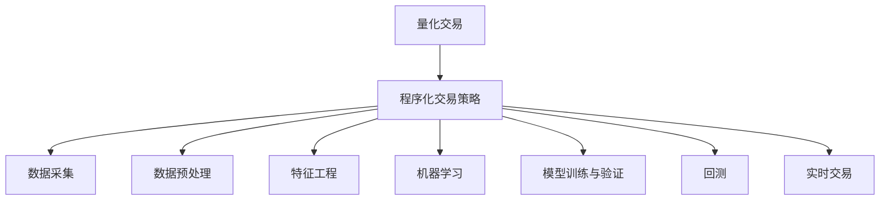

                 

# 如何将编程技能应用于量化交易

## 1. 背景介绍

### 1.1 问题由来

量化交易（Quantitative Trading）是利用计算机算法进行证券交易的一种方法，它通过数学模型、统计分析和计算机编程来寻找交易机会，从而实现高效率和高收益。随着计算机技术、数学模型、数据科学的发展，量化交易已成为全球金融市场的重要组成部分。然而，传统的量化交易主要依赖于数学和统计学模型，对编程技能的需求相对较少。但随着技术的进步，特别是人工智能、机器学习等算法的应用，量化交易对编程技能的要求也在逐步提高。

### 1.2 问题核心关键点

量化交易的核心在于通过算法模型对市场数据进行分析，并据此做出交易决策。程序化交易策略的设计和实现离不开编程技能，从数据采集、预处理、特征工程到模型训练、验证和部署，每一步都需要编程技术的支持。此外，量化交易系统的开发和维护也需要强大的编程能力，以便及时响应市场变化，持续优化交易策略。

## 2. 核心概念与联系

### 2.1 核心概念概述

为更好地理解将编程技能应用于量化交易的方法，本节将介绍几个关键概念及其相互之间的联系：

- 量化交易（Quantitative Trading）：通过计算机算法对市场数据进行分析，以制定交易策略的一种交易方法。
- 程序化交易策略（Algorithmic Trading Strategy）：基于编程实现的交易策略，通常由一系列数学模型和统计方法组成。
- 数据采集（Data Collection）：从不同的数据源获取市场数据，如股票价格、交易量、市场情绪等。
- 数据预处理（Data Preprocessing）：对原始数据进行清洗、归一化、去噪等处理，以提高数据质量。
- 特征工程（Feature Engineering）：根据交易策略需要，从原始数据中提取和构建新的特征，如技术指标、交易量等。
- 机器学习（Machine Learning）：通过训练模型，利用历史数据预测市场走势，自动生成交易信号。
- 模型训练与验证（Model Training and Validation）：使用历史数据训练模型，并根据验证集数据评估模型性能，调整参数以优化模型。
- 回测（Backtesting）：使用历史数据模拟交易策略的表现，以评估策略的有效性和风险。
- 实时交易（Real-time Trading）：在实际市场环境下执行程序化交易策略，以获取实际收益。

这些核心概念之间的逻辑关系可以通过以下Mermaid流程图来展示：



这个流程图展示出量化交易的核心流程：

1. 量化交易基于程序化交易策略。
2. 程序化交易策略的实现离不开数据采集、预处理和特征工程。
3. 机器学习模型用于预测市场走势，生成交易信号。
4. 模型训练与验证是评估和优化模型性能的关键步骤。
5. 回测用于模拟策略的表现，评估策略的有效性。
6. 实时交易将策略应用于实际市场，获取收益。

这些概念共同构成了量化交易的完整流程，其中编程技能贯穿始终，起到了关键作用。

## 3. 核心算法原理 & 具体操作步骤

### 3.1 算法原理概述

将编程技能应用于量化交易，核心在于利用算法和模型对市场数据进行分析，以制定和优化交易策略。常用的算法和模型包括：

- 技术分析算法：如移动平均线、相对强弱指数等，用于识别价格趋势和反转点。
- 统计分析算法：如ARIMA、VAR等，用于建模时间序列数据，预测价格变化。
- 机器学习算法：如随机森林、支持向量机等，用于从历史数据中挖掘模式和关系。
- 深度学习算法：如卷积神经网络、循环神经网络等，用于处理高维数据，预测未来趋势。
- 强化学习算法：如Q-learning、策略梯度等，用于学习最优交易策略。

这些算法和模型需要通过编程实现，进行数据处理、特征提取、模型训练和策略部署。

### 3.2 算法步骤详解

基于编程技能的量化交易主要包括以下几个关键步骤：

**Step 1: 数据采集与预处理**

- 从证券交易所、财经网站、金融数据库等数据源获取历史价格、交易量、新闻等市场数据。
- 对数据进行清洗、归一化、去噪等处理，以提高数据质量。

**Step 2: 特征工程**

- 根据交易策略需要，从原始数据中提取和构建新的特征，如技术指标、交易量等。
- 使用编程技术实现特征工程，构建多维特征向量，为后续建模提供输入数据。

**Step 3: 模型训练与验证**

- 选择合适的算法和模型，构建预测市场走势的模型。
- 使用历史数据训练模型，并根据验证集数据评估模型性能，调整参数以优化模型。

**Step 4: 回测**

- 使用历史数据模拟交易策略的表现，以评估策略的有效性和风险。
- 编程实现回测流程，计算策略在不同市场环境下的表现，进行风险分析。

**Step 5: 实时交易**

- 将训练好的模型和交易策略应用于实际市场，执行交易操作。
- 使用编程技术实现实时交易系统，持续监控市场动态，调整策略参数。

### 3.3 算法优缺点

基于编程技能的量化交易具有以下优点：

- 灵活性高：编程技术允许灵活设计交易策略，适应不同的市场环境和需求。
- 自动化高：通过编程实现自动化交易，减少人为干预，提高交易效率和一致性。
- 可扩展性高：编程技术便于模块化设计和扩展，可以逐步加入新的功能和数据源。

同时，该方法也存在一定的局限性：

- 数据依赖性强：模型的准确性高度依赖于数据质量，数据缺失和噪声会严重影响结果。
- 算法复杂度高：复杂算法模型的训练和验证需要大量计算资源，对计算能力有较高要求。
- 模型可解释性差：许多先进算法如深度学习模型的黑盒特性，难以解释其决策过程。
- 实时性要求高：实时交易系统需要快速响应市场变化，对系统架构和计算速度有高要求。

尽管存在这些局限性，但就目前而言，基于编程技能的量化交易方法仍是大规模应用的主流范式。未来相关研究的重点在于如何进一步提高算法的可解释性和鲁棒性，同时兼顾实时性和计算效率。

### 3.4 算法应用领域

基于编程技能的量化交易方法在金融市场已有广泛应用，覆盖了股票、期货、外汇等众多领域。以下是几个典型应用场景：

- 股票交易：使用技术分析和统计模型预测股票价格走势，生成买卖信号，进行交易。
- 期货交易：利用机器学习模型预测期货价格变化，进行套期保值或投机。
- 外汇交易：使用算法策略捕捉外汇市场的波动，进行高频交易或套利。
- 量化对冲：构建多资产组合，利用算法优化对冲策略，降低风险。
- 高频交易：使用高频算法策略进行超短期的证券交易，获取微小的利润。
- 风险管理：利用算法识别市场风险点，进行风险规避和资金管理。

此外，量化交易方法也被创新性地应用于量化组合、量化研究、量化风控等诸多领域，为金融市场带来新的发展方向。

## 4. 数学模型和公式 & 详细讲解 & 举例说明

### 4.1 数学模型构建

本节将使用数学语言对量化交易中常用的算法和模型进行详细讲解。

### 4.2 公式推导过程

以下我们以移动平均线（Moving Average）算法为例，推导其实现过程。

移动平均线是一种常用的技术分析算法，用于识别价格趋势和反转点。其原理在于计算一段时间内的平均价格，以平滑价格波动，从而识别价格趋势。假设某股票的价格序列为 $p_1, p_2, \ldots, p_t$，计算其 $n$ 日移动平均线 $MA_t$ 的公式为：

$$
MA_t = \frac{1}{n} \sum_{i=1}^n p_{t-i+1}
$$

对于某个具体的 $t$ 天，其移动平均线 $MA_t$ 即为当天价格的 $n$ 日滑动平均。

### 4.3 案例分析与讲解

假设我们希望构建一个 20 日移动平均线，用于识别股票价格趋势。具体步骤如下：

1. 计算历史价格的滑动平均值，生成新的价格序列。
2. 根据新序列计算每天的移动平均线。
3. 根据移动平均线判断当前价格的趋势。

假设某天股票价格为 $p_t = 100$，前 20 天股票价格序列为 $p_{t-1}, p_{t-2}, \ldots, p_{t-20}$，则其 20 日移动平均线为：

$$
MA_t = \frac{p_{t-1} + p_{t-2} + \ldots + p_{t-20}}{20}
$$

根据该公式，可以计算出每天的移动平均线，并通过比较当前价格与移动平均线的关系，判断价格趋势。

## 5. 项目实践：代码实例和详细解释说明

### 5.1 开发环境搭建

在进行量化交易开发前，我们需要准备好开发环境。以下是使用Python进行量化交易开发的环境配置流程：

1. 安装Anaconda：从官网下载并安装Anaconda，用于创建独立的Python环境。

2. 创建并激活虚拟环境：
```bash
conda create -n qtrading-env python=3.8 
conda activate qtrading-env
```

3. 安装必要的Python包：
```bash
conda install pandas numpy scikit-learn matplotlib statsmodels
pip install ta
```

4. 安装第三方库：
```bash
conda install quantConnect
pip install pynquant
```

完成上述步骤后，即可在`qtrading-env`环境中开始量化交易开发。

### 5.2 源代码详细实现

以下是使用Python和QuantConnect平台进行量化交易开发的示例代码：

```python
from quantconnect import brokerage
from quantconnect.research.python import alpha_model, trading_library
import pandas as pd
import numpy as np
import ta

# 设置API密钥
brokerage.Brokerage LibAccount credentials.json

# 定义策略类
class QuantTradingAlphaModel(alpha_model.AlphaModel):
    def initialize(self):
        self.data = self.add_data([pd.read_csv('data.csv'), pd.read_csv('technical_indicators.csv')])
        
        # 获取历史数据
        self.close_prices = self.data.history(period = '1D', fields = 'close')
        self.volume = self.data.history(period = '1D', fields = 'volume')
        
        # 计算移动平均线
        self.ma = ta.MA(self.close_prices, timeperiod = 20)
        
        # 定义买入和卖出策略
        self.buy_signal = self.ma.close < self.close_prices
        self.sell_signal = self.ma.close > self.close_prices
        
    def update(self):
        # 判断是否执行交易
        if self.buy_signal:
            self.order(self.data.buy())
        if self.sell_signal:
            self.order(self.data.sell())
```

### 5.3 代码解读与分析

让我们再详细解读一下关键代码的实现细节：

**QuantTradingAlphaModel类**：
- `initialize`方法：在策略开始时，初始化策略所需的数据和计算结果。
- `close_prices`和`volume`属性：获取历史收盘价和交易量数据，作为计算移动平均线的输入。
- `ma`属性：计算20日移动平均线，并用于生成买卖信号。
- `buy_signal`和`sell_signal`属性：根据移动平均线和当前价格的关系，判断是否执行买入和卖出操作。

**交易信号的判断**：
- 根据移动平均线和当前价格的关系，判断是否执行买入或卖出操作。如果移动平均线低于当前价格，则买入；如果移动平均线高于当前价格，则卖出。

**交易操作的执行**：
- 在`update`方法中，根据判断结果，调用`order`函数执行买入或卖出操作。

### 5.4 运行结果展示

运行上述代码，可以在QuantConnect平台上实时监测策略的表现。通过回测功能，可以查看策略在不同市场环境下的收益和风险。

```python
from qclib import backtest

# 进行回测
backtest_result = backtest.simulate(qcstrategy)
print('回测结果：', backtest_result)
```

## 6. 实际应用场景

### 6.1 高频交易

高频交易（High-Frequency Trading, HFT）是量化交易的一种形式，主要利用计算机算法进行超短期的证券交易，获取微小的利润。高频交易通常使用算法策略进行交易决策，例如，基于移动平均线、均差法等技术分析方法，进行高频买入卖出。

### 6.2 股票市场对冲

量化对冲（Quantitative Hedging）是一种利用算法策略进行资产组合管理和风险管理的量化方法。对冲策略通常基于统计分析或机器学习模型，以优化资产配置，降低风险。例如，可以利用股票价格的时间序列数据，构建ARIMA模型，预测价格变化，进行资产组合的动态调整。

### 6.3 外汇市场套利

外汇市场套利（Forex Arbitrage）是量化交易的一种重要形式，通过利用不同货币间的汇率差异，进行套利交易，获取利润。套利策略通常使用高频算法或时间序列模型，捕捉汇率变化，进行实时交易。

### 6.4 多资产组合管理

多资产组合管理（Portfolio Management）是量化交易的一种常见应用，通过构建多资产组合，优化风险收益比。组合管理策略通常基于统计分析和机器学习模型，例如，可以利用夏普比率、最大回撤等指标，优化资产配置，降低风险。

## 7. 工具和资源推荐

### 7.1 学习资源推荐

为了帮助开发者系统掌握量化交易的理论基础和实践技巧，这里推荐一些优质的学习资源：

1. 《Python量化交易实战》：一本详细介绍量化交易算法和实现方法的书籍，涵盖从基础到高级的多种量化策略。
2. 《量化投资入门与实战》：一本系统介绍量化交易概念和工具的书籍，帮助初学者快速上手。
3. 《量化投资原理与策略》：一本全面介绍量化交易的原理和策略的书籍，深入浅出地讲解了量化交易的各个环节。
4. 量化交易社区：如CQuant、AlgoTrading等，提供了丰富的量化交易资源和交流平台。
5. 量化交易论坛：如QuantConnect论坛、CQuant论坛等，提供了大量的量化交易实战经验分享。

通过对这些资源的学习实践，相信你一定能够快速掌握量化交易的精髓，并用于解决实际的金融问题。

### 7.2 开发工具推荐

高效的开发离不开优秀的工具支持。以下是几款用于量化交易开发的常用工具：

1. Python：作为量化交易开发的主流语言，Python具有丰富的科学计算库和数据处理能力。
2. QuantConnect：一个用于量化交易开发的开源平台，提供了实时的股票、期货等市场数据，并支持多种算法策略。
3. AlgoTrading：一个跨平台的量化交易开发框架，支持多种编程语言和数据源。
4. TA-Lib：一个开源的技术分析库，提供了多种技术分析函数，用于生成和处理技术指标。
5. QuantLib：一个开源的量化金融库，提供了丰富的金融建模和计算功能。
6. QuantConnect研究：提供了多种量化交易算法和模型的实现示例。

合理利用这些工具，可以显著提升量化交易开发的效率，加快创新迭代的步伐。

### 7.3 相关论文推荐

量化交易技术的发展源于学界的持续研究。以下是几篇奠基性的相关论文，推荐阅读：

1. High-Frequency Trading: A Tutorial（第6版）：由著名量化交易专家哈维·冈萨雷斯·伊基巴尔撰写，介绍了高频交易的核心算法和策略。
2. Algorithmic Trading: Strategies and Technology（第2版）：由马克·莫斯撰写，全面介绍了量化交易的算法和策略。
3. Quantitative Hedging: Introduction to Quantitative Finance and Model Building（第2版）：由伊曼纽尔·达马、吉恩·拉布撰写，介绍了量化对冲的原理和策略。
4. Machine Learning in Finance：这是一个关于机器学习在金融领域应用的综述性论文集，涵盖了量化交易、风险管理等多个方面。
5. Deep Learning in Finance：这是一个关于深度学习在金融领域应用的综述性论文集，探讨了深度学习算法在量化交易中的应用。

这些论文代表了大量化交易技术的发展脉络。通过学习这些前沿成果，可以帮助研究者把握学科前进方向，激发更多的创新灵感。

## 8. 总结：未来发展趋势与挑战

### 8.1 总结

本文对基于编程技能的量化交易方法进行了全面系统的介绍。首先阐述了量化交易的背景和意义，明确了量化交易对编程技能的需求和重要性。其次，从原理到实践，详细讲解了量化交易的各个环节，给出了量化交易开发的完整代码实例。同时，本文还广泛探讨了量化交易方法在高频交易、对冲策略、外汇市场套利、多资产组合管理等多个领域的应用前景，展示了量化交易方法的广泛应用。此外，本文精选了量化交易技术的各类学习资源，力求为读者提供全方位的技术指引。

通过本文的系统梳理，可以看到，基于编程技能的量化交易方法正在成为金融市场的重要工具，极大地提升了交易的效率和准确性。未来，伴随量化交易技术的不断演进，算法和模型的复杂性将进一步提高，对编程技能的要求也将更加严格。只有不断学习和实践，才能应对未来市场的挑战，取得更好的交易效果。

### 8.2 未来发展趋势

展望未来，量化交易技术将呈现以下几个发展趋势：

1. 算法复杂度提升：随着数据规模的增加和算法的迭代，量化交易算法将更加复杂和高效。深度学习、强化学习等先进算法将逐渐应用于交易策略的优化和执行。
2. 数据多样化应用：量化交易将更多地利用大数据技术，从多维度、多模态的数据中挖掘信息，提升策略的准确性。例如，将新闻、舆情、气象数据等非结构化数据纳入策略模型。
3. 模型可解释性增强：随着模型复杂度的提升，可解释性差的模型将难以满足监管和市场的要求。未来，需要更多可解释性强、决策透明的量化模型。
4. 实时性要求提高：高频交易和实时对冲策略对交易速度和响应速度有更高要求。分布式计算、大数据处理等技术将进一步优化交易系统的实时性。
5. 跨领域融合加强：量化交易将更多地与其他金融技术（如区块链、加密货币、金融科技）结合，形成跨领域的技术生态。
6. 算法公平性和伦理性：随着算法在金融市场中的广泛应用，公平性和伦理性的问题将更加突出。需要引入更多的公平性和透明性保障机制。

以上趋势凸显了量化交易技术的广阔前景。这些方向的探索发展，必将进一步提升量化交易系统的性能和应用范围，为金融市场带来新的发展方向。

### 8.3 面临的挑战

尽管量化交易技术已经取得了显著成就，但在迈向更加智能化、普适化应用的过程中，它仍面临着诸多挑战：

1. 数据依赖性强：模型的准确性高度依赖于数据质量，数据缺失和噪声会严重影响结果。
2. 算法复杂度高：复杂算法模型的训练和验证需要大量计算资源，对计算能力有较高要求。
3. 模型可解释性差：许多先进算法如深度学习模型的黑盒特性，难以解释其决策过程。
4. 实时性要求高：高频交易和实时对冲策略对交易速度和响应速度有更高要求，分布式计算、大数据处理等技术需要进一步优化。
5. 监管和合规要求：量化交易需要在监管合规的框架下运行，算法公平性和透明性问题需更多关注。
6. 风险控制问题：量化交易算法在市场极端情况下的鲁棒性问题需进一步解决。

尽管存在这些挑战，但通过不断改进算法、优化数据处理、提升计算效率、加强监管合规，量化交易技术仍将发挥重要作用，为金融市场带来新的机遇。

### 8.4 研究展望

面向未来，量化交易技术还需要在以下几个方面进行进一步的探索：

1. 探索新的量化交易算法：如基于深度学习的算法，结合强化学习的策略，优化交易决策。
2. 加强数据的多样化和高质量：除了历史价格数据外，还需要利用新闻、舆情、气象等多维度数据，增强策略的鲁棒性。
3. 提升模型的可解释性：通过可视化、因果分析等技术，提升模型的可解释性和透明性。
4. 探索跨领域融合：将量化交易技术与区块链、金融科技等新兴技术结合，拓展应用场景。
5. 加强风险管理：构建量化风险管理体系，评估算法在市场极端情况下的表现，优化风险控制策略。
6. 推进监管合规：引入更多的公平性、透明性保障机制，满足监管和合规要求。

这些研究方向的探索，必将引领量化交易技术迈向更高的台阶，为金融市场带来新的变革。只有勇于创新、敢于突破，才能不断拓展量化交易的边界，让量化交易技术更好地服务于金融市场。

## 9. 附录：常见问题与解答

**Q1: 量化交易对编程技能有哪些基本要求？**

A: 量化交易对编程技能有较高的要求，包括以下几个方面：
1. 熟悉Python、C++等编程语言，具备基本编程能力。
2. 熟练掌握数据结构、算法、数据库等基础知识。
3. 了解金融市场基础知识，掌握财务、统计等基本概念。
4. 掌握常用的金融数据分析库和工具，如pandas、numpy、ta-lib等。
5. 熟悉量化交易平台和工具，如QuantConnect、AlgoTrading等。

**Q2: 如何进行量化交易策略的回测？**

A: 量化交易策略的回测通常包括以下步骤：
1. 获取历史数据，包括价格、交易量等市场数据。
2. 加载并处理数据，生成多维特征向量。
3. 构建策略模型，并进行参数优化。
4. 在回测环境中，模拟交易策略的表现。
5. 分析策略的收益和风险，评估策略的有效性。

**Q3: 量化交易策略的参数优化有哪些方法？**

A: 量化交易策略的参数优化通常包括以下方法：
1. 网格搜索：遍历不同参数组合，找到最优参数。
2. 随机搜索：随机生成参数组合，筛选最优解。
3. 贝叶斯优化：利用先验知识，优化参数搜索过程。
4. 遗传算法：模拟自然选择过程，优化参数组合。
5. 梯度优化：通过梯度下降等方法，优化参数搜索。

**Q4: 量化交易策略的实时交易系统有哪些关键技术？**

A: 量化交易策略的实时交易系统需要考虑以下几个关键技术：
1. 高频交易：使用高频算法进行实时交易，需要优化数据传输和计算速度。
2. 算法优化：优化算法性能，提高交易速度和效率。
3. 容错性设计：设计容错性强的系统架构，应对网络中断、数据丢失等异常情况。
4. 数据管理：实时监控数据流，进行数据缓存和备份，保障数据完整性。
5. 策略更新：实现策略的动态调整和优化，提升策略适应性。

**Q5: 量化交易策略的性能评估有哪些指标？**

A: 量化交易策略的性能评估通常包括以下指标：
1. 收益率（Return）：策略在回测期间的平均收益率。
2. 最大回撤（Max Drawdown）：策略在回测期间的最大亏损幅度。
3. 夏普比率（Sharpe Ratio）：策略的风险调整收益率。
4. 信息比率（Information Ratio）：策略的收益与追踪误差之比。
5. 交易次数（Number of Trades）：策略的交易频率。
6. 交易滑点（Trade Slippage）：策略的交易成本和滑点费用。

总之，量化交易技术的应用前景广阔，对编程技能的要求也在不断提高。只有不断学习和实践，才能应对未来市场的挑战，取得更好的交易效果。

