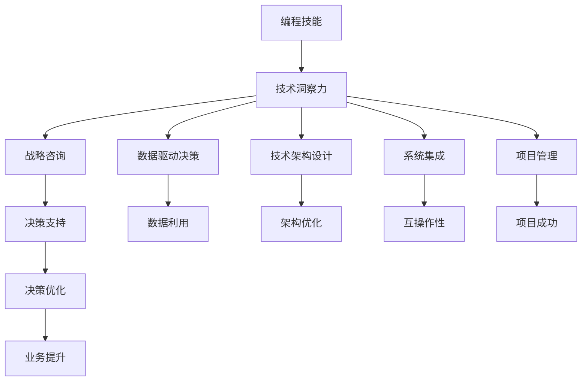

                 

# 如何将编程技能转化为高管咨询服务

> 关键词：编程技能, 高管咨询, 技术转移, 战略转型, 组织优化, 数据驱动, 技术架构设计, 系统集成, 项目管理, 技术战略规划

## 1. 背景介绍

在快速发展的数字化时代，技术变革不断推动各行各业转型升级，企业高管需要更加重视技术对业务的影响，并及时调整战略以应对市场变化。然而，部分高管在理解技术层面的专业性和实际操作上可能存在障碍，这时候，将编程技能转化为高管咨询服务就显得尤为重要。本文将详细介绍如何将编程技能转化为高效、有价值的高管咨询服务，帮助企业制定科学、稳健的战略，提升企业的数字化转型能力。

### 1.1 问题由来

数字化浪潮正席卷全球，企业加速向智能化、信息化、数字化的方向转型。越来越多的企业认识到，信息技术的深度融入能显著提升企业核心竞争力，从而在市场竞争中占据有利地位。同时，企业高管也越来越重视技术带来的战略性变革机会。

然而，尽管许多企业拥有先进的技术平台和团队，但很多高管在理解技术语言和实际操作上仍存在短板。他们往往难以从技术和业务交叉的视角，准确把握技术在战略和运营中的应用价值，导致技术投入与业务目标之间的脱节。

### 1.2 问题核心关键点

将编程技能转化为高管咨询服务的核心关键点在于：
- **理解业务需求**：准确把握企业高管的需求和挑战。
- **技术洞察力**：利用编程技能对技术进行深入理解。
- **战略思考**：将技术洞察力转化为可行的战略建议。
- **决策支持**：提供基于数据和技术支持的决策支持。
- **沟通能力**：具备良好的沟通技巧，将复杂的技术问题转化为高管易于理解的商业洞见。

### 1.3 问题研究意义

将编程技能转化为高管咨询服务，对于加速企业的数字化转型，提升企业的市场竞争力具有重要意义：

1. **战略支持**：通过深入的技术洞察力，提供科学、可行、有效的战略建议，帮助企业抓住技术变革带来的商业机遇。
2. **决策优化**：基于数据和技术支持的决策将更加客观、精准，避免因对技术理解不足导致的错误决策。
3. **组织优化**：通过技术咨询服务，优化企业的技术架构，提高技术资源的利用率，减少重复建设。
4. **文化融合**：加强企业内部技术的透明度，推动企业文化的数字化转型，培养技术创新人才。
5. **市场竞争力**：技术的深度融入将显著提升企业的核心竞争力，增强市场地位。

## 2. 核心概念与联系

### 2.1 核心概念概述

为更好地理解如何将编程技能转化为高管咨询服务，本节将介绍几个密切相关的核心概念：

- **编程技能**：编写、调试、优化代码的能力，涉及算法设计、数据结构、软件工程等方面的知识。
- **技术洞察力**：深入理解技术的本质、发展趋势、应用场景，具备将复杂技术问题转化为简明业务洞见的能力。
- **战略咨询**：基于对企业内外部环境的综合分析，为企业的战略制定提供建议，帮助企业实现业务目标。
- **数据驱动决策**：以数据为基础，通过分析、建模等手段，辅助企业进行决策，提高决策的准确性和效率。
- **技术架构设计**：设计合理、高效的技术架构，确保系统的可扩展性、可维护性、可兼容性。
- **系统集成**：通过技术手段，实现不同系统和应用之间的互操作性，提升系统整体的效能。
- **项目管理**：规划、执行、控制项目的各个环节，确保项目按时、按质、按预算完成。
- **技术战略规划**：对企业未来的技术方向和路径进行规划，制定长期技术发展战略。

这些核心概念之间的逻辑关系可以通过以下Mermaid流程图来展示：



这个流程图展示了编程技能转化为高管咨询服务的关键步骤：

1. 编程技能为基础，通过技术洞察力对企业环境进行深入分析。
2. 基于洞察力，进行战略咨询和数据驱动决策。
3. 设计技术架构和系统集成，提升技术资源利用效率。
4. 通过项目管理，确保项目顺利实施。
5. 制定技术战略规划，引领企业长期发展。

## 3. 核心算法原理 & 具体操作步骤
### 3.1 算法原理概述

将编程技能转化为高管咨询服务的核心算法原理主要包括以下几个方面：

1. **需求分析**：深入了解企业高管的需求和挑战，通过技术洞察力对问题进行细化。
2. **技术评估**：基于对现有技术的理解，评估不同技术方案的优缺点，提出可行的技术解决方案。
3. **战略规划**：结合企业业务目标，设计长期技术战略规划，确保技术发展的可持续性。
4. **项目管理**：制定详细项目管理计划，监督项目实施进度，确保项目按时完成。
5. **决策支持**：提供基于数据的决策支持，帮助企业高管进行科学决策。

### 3.2 算法步骤详解

将编程技能转化为高管咨询服务的步骤可以概括为以下五个步骤：

**Step 1: 需求分析**

- **高管访谈**：与企业高管进行深入访谈，了解他们在技术应用上的需求和痛点。
- **场景调研**：通过调研企业内部业务流程和应用系统，收集业务需求和技术需求。
- **问题识别**：识别企业内部存在的主要问题，分析问题的根本原因。

**Step 2: 技术评估**

- **技术调研**：搜集相关技术信息，理解不同技术方案的优劣。
- **方案比对**：对比多个技术方案的性能指标，如可扩展性、兼容性、安全性等。
- **可行性分析**：评估技术方案的实施成本、难度、风险等，提出初步的技术解决方案。

**Step 3: 战略规划**

- **战略制定**：结合企业业务目标和当前技术水平，制定长期技术战略规划。
- **路线图规划**：设计详细的技术发展路线图，明确技术升级的步骤和时间节点。
- **资源配置**：根据战略规划，配置技术和人力资源，确保资源到位。

**Step 4: 项目管理**

- **项目管理计划**：制定详细的项目管理计划，明确项目的目标、范围、进度、资源、风险等。
- **进度监控**：实时监控项目进展情况，及时调整项目计划，确保项目顺利推进。
- **风险管理**：识别和评估项目风险，制定风险应对策略，减少项目风险。

**Step 5: 决策支持**

- **数据采集**：通过数据分析和建模，收集并分析关键数据，支撑决策。
- **模拟预测**：使用预测模型和仿真工具，评估技术方案的实施效果，提供决策依据。
- **报告撰写**：将技术洞察力、战略建议、数据支持整合为报告，供企业高管参考。

### 3.3 算法优缺点

将编程技能转化为高管咨询服务的算法具有以下优点：
1. **数据驱动**：通过数据分析和技术洞察，提供基于事实的决策支持，避免主观判断。
2. **技术权威**：利用编程技能，深入理解技术本质，提出更符合技术发展趋势的解决方案。
3. **战略深度**：结合企业业务目标，设计长期技术战略规划，确保技术应用的有益性和可实施性。
4. **管理效率**：通过项目管理，确保项目按时、按质、按预算完成，提高项目管理效率。

同时，该算法也存在以下缺点：
1. **时间成本高**：需求分析和技术评估需要大量时间和精力，可能影响咨询速度。
2. **需求理解难度**：理解高管需求和业务场景复杂，需要较强的沟通和分析能力。
3. **技术变革风险**：技术方案的选择和实施可能带来一定的变革风险，需要慎重考虑。
4. **资源配置**：技术方案的实施需要大量资源，包括人力、资金等，可能存在资源限制。

### 3.4 算法应用领域

将编程技能转化为高管咨询服务的算法在以下领域具有广泛的应用：

- **企业战略规划**：制定企业的数字化转型战略，如智慧城市、工业互联网等。
- **业务流程优化**：提升企业内部的业务流程效率，如ERP系统、CRM系统等。
- **技术架构升级**：优化企业现有的技术架构，提升系统性能和可扩展性。
- **数据治理和分析**：制定数据治理方案，提升企业的数据分析和应用能力。
- **云计算迁移**：帮助企业将现有应用系统迁移到云端，提升系统的稳定性和安全性。
- **区块链应用**：设计和实施区块链技术解决方案，提升企业的区块链应用能力。

## 4. 数学模型和公式 & 详细讲解 & 举例说明
### 4.1 数学模型构建

本节将使用数学语言对将编程技能转化为高管咨询服务的过程进行更加严格的刻画。

假设企业面临的主要问题为 $P$，技术方案集为 $\mathcal{T}$，企业战略目标为 $G$。设 $F$ 为需求分析结果，$E$ 为技术评估结果，$S$ 为战略规划结果，$P$ 为项目管理结果，$D$ 为决策支持结果。则可以将问题转化如下数学模型：

$$
\begin{aligned}
&\maximize \quad G \\
&\text{Subject to} \\
&P = F \cap E \cap S \cap P \\
&D = P \cap S \cap D \\
&F \text{由需求分析得到} \\
&E \text{由技术评估得到} \\
&S \text{由战略规划得到} \\
&P \text{由项目管理得到} \\
&D \text{由决策支持得到}
\end{aligned}
$$

这个数学模型描述了从需求分析到项目管理再到决策支持的全过程，每个步骤都依赖于前一个步骤的输出。

### 4.2 公式推导过程

以数据驱动决策为例，推导数据分析与决策支持的数学模型。

假设企业的关键业务指标为 $K$，通过数据分析得到的数据集为 $D_k$，数据分析模型为 $M_k$。则决策支持的目标是找到最符合企业战略目标的业务指标 $K^*$。具体来说，可以利用以下数学模型：

$$
\begin{aligned}
&\minimize \quad \sum_{k \in K} \text{Loss}(M_k(D_k), K^*) \\
&\text{Subject to} \\
&K^* \in G \\
&M_k \text{为数据分析模型}
\end{aligned}
$$

其中，$\text{Loss}$ 表示模型 $M_k$ 在数据集 $D_k$ 上的损失函数，用于衡量模型预测与真实数据之间的差异。目标是最小化模型预测与真实数据的差异，同时保证模型输出符合企业战略目标 $G$。

### 4.3 案例分析与讲解

**案例1: 智慧城市建设**

某地方政府希望利用智慧城市技术提升城市管理水平和市民生活体验。通过需求分析，明确了智慧城市的关键应用场景，如智能交通、智慧医疗、智能安防等。在技术评估阶段，评估了多种技术方案，包括云计算、大数据、物联网等。经过战略规划，确定了以云计算为核心的智慧城市架构，设计了详细的数据治理和分析流程。在项目管理阶段，制定了详细的项目计划，确保各项技术方案按时推进。最后，通过数据分析和建模，支撑决策支持，确保智慧城市建设按照既定目标实施。

**案例2: 企业数字化转型**

某大型制造企业希望通过数字化转型提升生产效率和市场竞争力。通过需求分析，了解了企业内部的生产流程和业务系统，发现了信息化水平低下的问题。在技术评估阶段，评估了ERP系统、MES系统、CRM系统等解决方案，选择了ERP系统作为主抓手，进行数字化转型。经过战略规划，确定了系统的设计方案，设计了详细的数据治理流程。在项目管理阶段，制定了详细的ERP项目计划，确保项目按时推进。最后，通过数据分析和建模，支撑决策支持，确保ERP系统建设按照既定目标实施。

## 5. 项目实践：代码实例和详细解释说明
### 5.1 开发环境搭建

在进行咨询项目实践前，我们需要准备好开发环境。以下是使用Python进行数据分析和建模的环境配置流程：

1. 安装Anaconda：从官网下载并安装Anaconda，用于创建独立的Python环境。

2. 创建并激活虚拟环境：
```bash
conda create -n data-env python=3.8 
conda activate data-env
```

3. 安装相关Python包：
```bash
pip install pandas numpy matplotlib seaborn jupyter notebook
```

4. 安装R语言：
```bash
conda install r-essentials
```

5. 配置Jupyter Notebook：
```bash
jupyter notebook --ip 0.0.0.0
```

完成上述步骤后，即可在`data-env`环境中开始数据分析和建模实践。

### 5.2 源代码详细实现

下面我们以企业数字化转型项目为例，给出使用Python和R语言进行数据分析和建模的代码实现。

首先，导入相关Python和R语言包：

```python
import pandas as pd
import numpy as np
import matplotlib.pyplot as plt
import seaborn as sns
from rpy2.robjects import pandas2ri
```

然后，读取企业数据集：

```python
data = pd.read_csv('data.csv')
```

接着，进行数据清洗和预处理：

```python
# 数据清洗
data.dropna(inplace=True)
data.drop_duplicates(inplace=True)

# 数据预处理
data['ERP_Score'] = (data['ERP_Score'] - data['ERP_Score'].mean()) / data['ERP_Score'].std()
```

然后，使用R语言进行数据分析和建模：

```r
library(ggplot2)
library(dplyr)
library(caret)

# 数据可视化
ggplot(data, aes(x=ERP_Score, y=Profit)) + geom_point() + geom_smooth(method="lm")
```

最后，进行决策支持分析：

```python
# 决策支持
from sklearn.linear_model import LinearRegression
X = data[['ERP_Score']]
y = data['Profit']
model = LinearRegression()
model.fit(X, y)
predict_profit = model.predict(X)
```

以上代码实现展示了使用Python和R语言进行数据分析和建模的基本步骤。在实际项目中，还需要根据具体情况进行更深入的数据处理和模型构建。

### 5.3 代码解读与分析

让我们再详细解读一下关键代码的实现细节：

**读取数据集**：
- `pd.read_csv`方法用于读取CSV格式的数据文件，将其转换为Pandas数据框。

**数据清洗**：
- `dropna`方法用于去除包含缺失值的数据行。
- `drop_duplicates`方法用于去除重复数据行。
- `data['ERP_Score'] = ...` 用于标准化数据，将ERP分数转化为标准分数，便于后续的决策支持分析。

**数据可视化**：
- `ggplot`方法用于创建数据可视化图表，`geom_point`和`geom_smooth`方法用于添加数据点和回归线。

**决策支持分析**：
- `LinearRegression`方法用于建立线性回归模型。
- `fit`方法用于训练模型，`predict`方法用于预测利润。

可以看到，Python和R语言在数据分析和建模方面各具优势，能够互相补充，结合使用，实现高效的数据分析和决策支持。

## 6. 实际应用场景

### 6.1 智能制造

在智能制造领域，通过编程技能转化为高管咨询服务的算法，可以提升企业的生产效率和市场竞争力。企业可以通过数字化转型，实现生产线的智能化、自动化、信息化，从而提高产品质量、降低成本、提升市场响应速度。

具体应用场景包括：
- **数字化生产线管理**：利用物联网、工业互联网等技术，实现生产线的实时监控和优化。
- **设备健康预测**：通过数据分析和机器学习，预测设备故障和维护需求，减少设备停机时间。
- **供应链优化**：利用数据分析和可视化工具，优化供应链管理，提高供应链效率。

### 6.2 智慧金融

在智慧金融领域，通过编程技能转化为高管咨询服务的算法，可以提升企业的风险控制能力和客户服务水平。企业可以通过数字化转型，实现金融业务的智能化、高效化，从而降低风险、提升服务质量。

具体应用场景包括：
- **智能风险评估**：通过大数据分析，评估贷款和投资的风险，提高风控决策的准确性。
- **智能客服系统**：利用自然语言处理和机器学习，实现智能客服和智能投顾，提升客户服务体验。
- **智能投研分析**：利用大数据分析工具，进行投资分析和市场预测，提高投研效率和决策质量。

### 6.3 智慧医疗

在智慧医疗领域，通过编程技能转化为高管咨询服务的算法，可以提升医疗服务的效率和质量。企业可以通过数字化转型，实现医疗服务的智能化、个性化、信息化，从而提高医疗服务的效率和质量。

具体应用场景包括：
- **电子病历系统**：利用大数据分析，实现电子病历的智能化管理，提升医生的工作效率。
- **智能诊断辅助**：通过人工智能技术，实现智能诊断和辅助决策，提高诊断准确性。
- **健康管理**：利用大数据分析，实现健康数据的智能化管理，提升健康管理水平。

### 6.4 未来应用展望

随着技术的不断发展和深入应用，将编程技能转化为高管咨询服务的算法将在更多领域得到应用，为各行各业带来变革性影响。

1. **智慧城市**：通过编程技能转化为高管咨询服务的算法，实现智慧城市的高效管理，提升城市治理水平和市民生活体验。
2. **智能交通**：利用人工智能和物联网技术，实现智能交通的智能化管理，提高交通效率和安全水平。
3. **智慧农业**：通过大数据分析和物联网技术，实现智慧农业的智能化管理，提高农业生产效率和质量。
4. **智慧教育**：利用人工智能和大数据分析技术，实现智慧教育的个性化教学和高效管理，提升教育质量和公平性。
5. **智慧旅游**：通过物联网和人工智能技术，实现智慧旅游的智能化管理，提升旅游体验和服务质量。

## 7. 工具和资源推荐
### 7.1 学习资源推荐

为了帮助开发者系统掌握将编程技能转化为高管咨询服务的理论基础和实践技巧，这里推荐一些优质的学习资源：

1. **《数据科学实战》**：详细介绍了数据分析和建模的各个环节，通过案例分析，展示如何将编程技能转化为实际的商业应用。
2. **《机器学习实战》**：介绍了机器学习算法和应用，通过丰富的案例，展示如何利用编程技能解决实际问题。
3. **《Python数据科学手册》**：介绍了Python在数据分析和建模中的应用，通过详细的代码实例，展示如何使用Python进行数据处理和建模。
4. **《R语言实战》**：介绍了R语言在数据分析和建模中的应用，通过丰富的案例，展示如何使用R语言进行数据处理和建模。
5. **《数据可视化实战》**：介绍了数据可视化的各个环节，通过实际案例，展示如何将数据分析结果可视化，提供决策支持。

通过对这些资源的学习实践，相信你一定能够快速掌握将编程技能转化为高管咨询服务的精髓，并用于解决实际的商业问题。

### 7.2 开发工具推荐

高效的开发离不开优秀的工具支持。以下是几款用于编程技能转化为高管咨询服务开发的常用工具：

1. **Jupyter Notebook**：免费的在线Jupyter Notebook环境，方便开发者进行交互式编程和数据分析。
2. **R Studio**：R语言的免费IDE，支持R语言的开发、调试和数据可视化。
3. **PyCharm**：Python开发环境，提供了丰富的编程支持和数据可视化功能。
4. **Tableau**：数据可视化工具，支持多维度数据分析和数据可视化，提供决策支持。
5. **Power BI**：微软推出的数据可视化工具，支持数据整合、可视化和分析，提供决策支持。
6. **Alteryx**：企业级的数据分析和自动化工具，支持多种数据源的数据整合、可视化和分析，提供决策支持。

合理利用这些工具，可以显著提升将编程技能转化为高管咨询服务的开发效率，加快创新迭代的步伐。

### 7.3 相关论文推荐

将编程技能转化为高管咨询服务的研究源于学界的持续研究。以下是几篇奠基性的相关论文，推荐阅读：

1. **《数据科学在商业决策中的应用》**：介绍了数据科学在商业决策中的应用，通过案例分析，展示了数据科学对商业决策的实际影响。
2. **《大数据技术在企业中的应用》**：介绍了大数据技术在企业中的应用，通过实际案例，展示了大数据技术对企业管理的实际影响。
3. **《人工智能在企业管理中的应用》**：介绍了人工智能技术在企业管理中的应用，通过案例分析，展示了人工智能对企业管理的影响。
4. **《数据驱动的商业决策》**：介绍了数据驱动决策的理论基础和方法，通过案例分析，展示了数据驱动决策的实际应用。
5. **《智慧城市建设的技术与应用》**：介绍了智慧城市建设的技术与应用，通过案例分析，展示了智慧城市对城市管理的影响。

这些论文代表了大数据和人工智能在商业决策中的应用趋势，通过学习这些前沿成果，可以帮助研究者把握学科前进方向，激发更多的创新灵感。

## 8. 总结：未来发展趋势与挑战

### 8.1 研究成果总结

本文对将编程技能转化为高管咨询服务的算法进行了全面系统的介绍。首先阐述了算法的研究背景和意义，明确了编程技能转化为高管咨询服务的独特价值。其次，从原理到实践，详细讲解了算法的数学模型和关键步骤，给出了算法实践的完整代码实例。同时，本文还广泛探讨了算法在智能制造、智慧金融、智慧医疗等多个领域的应用前景，展示了算法的巨大潜力。

### 8.2 未来发展趋势

展望未来，将编程技能转化为高管咨询服务的算法将呈现以下几个发展趋势：

1. **数据规模增大**：随着数据采集和处理技术的进步，企业将拥有更多的数据资源，为算法的应用提供了更大的空间。
2. **技术手段多样**：未来将出现更多的数据处理和分析技术，如深度学习、自然语言处理、图形数据库等，提升算法的效果和应用范围。
3. **跨领域融合**：随着技术的不断发展，算法的应用将更加广泛，跨领域的融合将成为新的趋势。
4. **人工智能的普及**：人工智能技术的普及将使更多企业具备编程技能，提升管理决策的科学性。
5. **云计算的应用**：云计算技术将为算法的应用提供更强大的计算能力和资源支持，降低算法的实施成本。

### 8.3 面临的挑战

尽管将编程技能转化为高管咨询服务的算法已经取得了不小的进展，但在迈向更加智能化、普适化应用的过程中，它仍面临诸多挑战：

1. **数据隐私和安全**：企业数据涉及商业机密和用户隐私，如何在保证数据安全的前提下进行数据分析和建模，是一个重要的挑战。
2. **数据质量问题**：数据的不完整、不准确和不一致，可能会影响算法的效果，需要提出有效的数据清洗和处理策略。
3. **技术和业务结合**：企业高管对技术的理解不足，可能影响技术的实施和应用效果，需要提供更加直观和易懂的解决方案。
4. **算法的复杂性**：部分算法模型复杂，需要投入大量时间和精力进行调试和优化，增加实施难度。
5. **算法的透明性**：算法模型的黑盒特性，可能导致其输出结果难以解释，影响决策的可信度。

### 8.4 研究展望

面对将编程技能转化为高管咨询服务所面临的挑战，未来的研究需要在以下几个方面寻求新的突破：

1. **数据治理**：提出有效的数据治理策略，确保数据的质量和安全。
2. **算法优化**：研究和开发更加高效的算法，降低实施难度和复杂性。
3. **算法透明性**：开发更加透明的算法，提高其输出的可解释性和可信度。
4. **技术普及**：提升企业高管的科技素养，加强技术与业务的结合。
5. **跨领域应用**：探索跨领域的应用场景，推动技术在不同领域的普及和应用。

## 9. 附录：常见问题与解答

**Q1：如何提高企业高管的科技素养？**

A: 提高企业高管的科技素养，需要从以下几个方面入手：
- **培训课程**：定期组织技术培训课程，邀请专家讲授最新技术趋势和应用案例。
- **技术交流**：建立企业内部技术交流平台，鼓励高管参与技术讨论和项目评审。
- **技术试点**：选择试点项目，让高管亲身体验技术实施的全过程，提升对技术的理解。

**Q2：如何确保数据隐私和安全？**

A: 确保数据隐私和安全，需要从以下几个方面入手：
- **数据加密**：对敏感数据进行加密处理，防止数据泄露。
- **访问控制**：设置严格的访问控制策略，限制对敏感数据的访问权限。
- **数据匿名化**：对敏感数据进行匿名化处理，防止数据关联和识别。

**Q3：如何选择适合企业的数据分析工具？**

A: 选择适合企业的数据分析工具，需要考虑以下几个因素：
- **数据源**：根据数据源的特点选择合适的工具，如SQL数据库、NoSQL数据库、大数据平台等。
- **数据处理能力**：根据数据处理需求选择合适的工具，如分布式计算框架、数据可视化工具等。
- **技术成熟度**：选择成熟、稳定的工具，避免因技术问题影响项目的实施和应用效果。

**Q4：如何提高算法的透明性和可解释性？**

A: 提高算法的透明性和可解释性，需要从以下几个方面入手：
- **算法可视化**：通过可视化工具，展示算法的内部运作过程，提高透明性。
- **特征重要性分析**：通过特征重要性分析，解释算法的决策依据，提高可解释性。
- **模型解释工具**：使用模型解释工具，提供算法的解释结果，增强决策的可信度。

通过这些措施，可以进一步提升将编程技能转化为高管咨询服务的算法的科学性和可信度，助力企业成功转型。

---

作者：禅与计算机程序设计艺术 / Zen and the Art of Computer Programming

