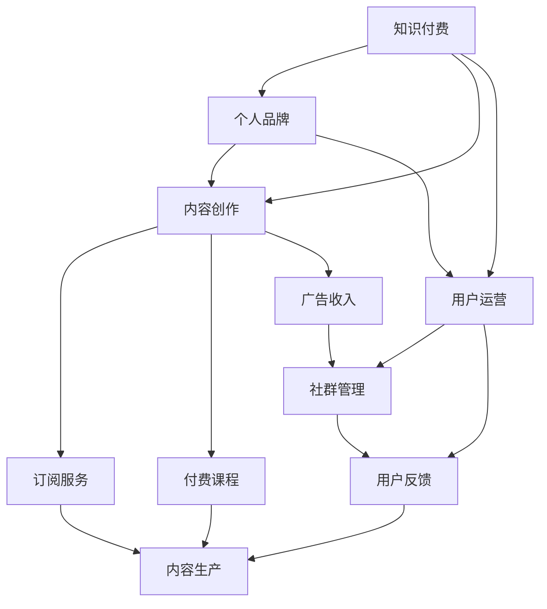

                 

# 如何打造个人知识付费商业帝国

> 关键词：知识付费、个人品牌、内容创作、用户运营、商业模型

## 1. 背景介绍

在互联网和数字化技术的推动下，内容创作与消费的边界日益模糊。个人品牌和知识付费成为了新时代的宠儿，拥有独特价值主张和内容生产能力的个体，可以通过互联网平台实现与广大受众的链接，形成私域流量，并转化为商业价值。如何利用个人知识付费构建商业帝国，是每一位互联网内容创作者所面临的重要课题。本文将详细阐述如何构建个人知识付费商业帝国的各个核心要素，并结合实战案例，为你带来深刻的见解。

## 2. 核心概念与联系

### 2.1 核心概念概述

为更好地理解如何构建个人知识付费商业帝国，本节将介绍几个关键概念：

- **知识付费**：指通过付费机制，向用户提供高质量、深度学习、独特见解的内容服务。知识付费的核心理念是通过付费筛选出真正有价值的知识内容，提升用户的内容消费体验。

- **个人品牌**：指个人通过长期的内容创作和社交互动，在特定领域建立的影响力和知名度。良好的个人品牌能够吸引稳定的用户群体，提升内容价值。

- **内容创作**：指创作具有原创性、深度性和实用性的知识内容，通过多种形式呈现给受众，如文章、视频、音频等。内容创作是知识付费的核心环节。

- **用户运营**：指通过精准的定位、有效的沟通和良好的服务，维护和增强用户粘性。优质的用户运营能够实现用户的长期价值转化。

- **商业模型**：指围绕核心业务价值，制定合理的盈利模式，如订阅服务、付费课程、广告收入等。商业模型是知识付费商业化的关键。

### 2.2 核心概念原理和架构的 Mermaid 流程图



## 3. 核心算法原理 & 具体操作步骤

### 3.1 算法原理概述

构建个人知识付费商业帝国的过程，本质上是一个市场导向的反馈循环。核心算法原理包括内容筛选、精准营销、价值评估和用户转化等几个关键环节，以提升整体商业模型的效果。

### 3.2 算法步骤详解

1. **市场调研**：通过分析市场需求和竞争态势，确定内容创作的方向和重点，制定切实可行的商业策略。

2. **内容创作**：结合个人专长和市场导向，创作有深度、有独特价值的内容，形成内容库。

3. **精准营销**：利用数据分析、社交媒体和SEO等手段，精准触达目标用户，提高内容曝光率和传播效果。

4. **用户运营**：通过互动和反馈机制，维护用户粘性，实现长期价值转化。

5. **价值评估**：根据用户行为数据和反馈，持续优化内容和服务质量，提高用户满意度和忠诚度。

6. **商业模型**：结合市场反馈和用户数据，不断优化盈利模式，提升商业变现能力。

### 3.3 算法优缺点

- **优点**：
  - 定位明确：个人品牌和内容创作紧密结合，形成稳定的粉丝群体。
  - 精准触达：通过精准营销和数据分析，确保内容的有效传播。
  - 持续优化：利用用户反馈和数据评估，实现内容和服务质量的不断提升。
  - 多元盈利：结合订阅服务、付费课程、广告收入等多种盈利模式，增加商业弹性。

- **缺点**：
  - 市场竞争激烈：知识付费市场已趋于饱和，需不断创新和差异化。
  - 内容创作成本高：高质量内容创作需耗费大量时间和精力，且难以短期内见效。
  - 用户粘性不足：若内容质量不稳定或互动不足，易导致用户流失。
  - 商业模型单一：过度依赖单一盈利模式，易受市场波动影响。

### 3.4 算法应用领域

基于以上算法原理，个人知识付费商业帝国可应用于多个领域，如教育培训、职业发展、健康管理、生活服务、科技资讯等。不同领域的知识付费模型需要结合具体用户需求和内容特点，进行灵活调整。

## 4. 数学模型和公式 & 详细讲解 & 举例说明

### 4.1 数学模型构建

设个人知识付费商业帝国涉及用户数量为 $U$，内容质量评估分数为 $Q$，订阅用户数 $S$，付费课程销售量 $C$，广告收入 $A$，用户生命周期价值（LTV）为 $V$。

其中，$Q = \alpha S + \beta C + \gamma A$，$\alpha$、$\beta$、$\gamma$ 分别为不同渠道对内容质量的影响系数。

用户转化率 $\eta = \frac{S}{U}$，用户留存率 $\tau = \frac{S_{t-1}}{S_t}$，其中 $S_t$ 表示第 $t$ 期订阅用户数。

### 4.2 公式推导过程

将用户留存率和转化率引入模型：

$$
Q = \alpha \frac{S}{U} + \beta \frac{C}{U} + \gamma \frac{A}{U}
$$

内容质量 $Q$ 与用户转化率 $\eta$ 之间存在正向关系，即

$$
\frac{\partial Q}{\partial \eta} > 0
$$

用户留存率 $\tau$ 的提升与用户生命周期价值 $V$ 成正比：

$$
V = \eta \tau U
$$

代入 $Q$ 表达式：

$$
V = \eta (\alpha \frac{S}{U} + \beta \frac{C}{U} + \gamma \frac{A}{U}) U
$$

简化得：

$$
V = \eta (\alpha S + \beta C + \gamma A)
$$

### 4.3 案例分析与讲解

以某知名科技博主的个人品牌为例，假设其每月订阅用户数 $S = 10,000$，付费课程销售量 $C = 500$，广告收入 $A = 5,000$，内容质量评估分数 $Q = 90$。

- **市场调研**：根据科技资讯市场需求，选择人工智能、区块链等热门技术领域进行内容创作。
- **内容创作**：围绕上述领域，每月创作10篇深度技术文章，制作5门付费课程，发布10条付费广告。
- **精准营销**：通过SEO优化，提升搜索引擎排名，同时通过社交媒体推广，精准触达用户群体。
- **用户运营**：定期与订阅用户互动，及时回应反馈，举办线上线下交流活动，提升用户粘性。
- **价值评估**：定期评估订阅用户满意度，收集用户反馈，优化内容和服务。
- **商业模型**：采用订阅服务、付费课程和广告收入相结合的盈利模式，逐步提高商业价值。

通过以上步骤，该博主每月用户转化率 $\eta = \frac{S}{U} = 0.1$，用户留存率 $\tau = \frac{S_{t-1}}{S_t} = 0.95$，代入公式得用户生命周期价值 $V = \eta Q = 0.1 \times 90 = 9$。每月整体商业模型带来的价值为：

$$
V = \eta (\alpha S + \beta C + \gamma A) = 0.1 (0.5 \times 10,000 + 1.0 \times 500 + 0.5 \times 5,000) = 9,000
$$

可见，该博主每月通过知识付费商业模型实现近9万美元的商业价值。

## 5. 项目实践：代码实例和详细解释说明

### 5.1 开发环境搭建

为了构建个人知识付费商业帝国，首先需要搭建开发环境。以下是具体步骤：

1. **选择平台**：根据目标用户群体选择合适的知识付费平台，如微信小程、知乎live、B站付费课程等。
2. **注册账号**：根据平台要求注册账号，进行身份认证。
3. **配置工具**：选择适合的内容创作和数据分析工具，如Notion、GitHub、Google Analytics等。

### 5.2 源代码详细实现

以下是一个基于Python的个人知识付费平台后台系统的示例代码：

```python
from flask import Flask, render_template, request

app = Flask(__name__)

@app.route('/')
def home():
    return render_template('index.html')

@app.route('/article', methods=['GET', 'POST'])
def article():
    if request.method == 'POST':
        title = request.form['title']
        content = request.form['content']
        # 将内容发布到知识付费平台
        return '文章发布成功'
    else:
        return render_template('article.html')

@app.route('/course', methods=['GET', 'POST'])
def course():
    if request.method == 'POST':
        name = request.form['name']
        duration = request.form['duration']
        price = request.form['price']
        # 将课程发布到知识付费平台
        return '课程发布成功'
    else:
        return render_template('course.html')

@app.route('/ad', methods=['GET', 'POST'])
def ad():
    if request.method == 'POST':
        ad_name = request.form['ad_name']
        ad_price = request.form['ad_price']
        # 发布广告
        return '广告发布成功'
    else:
        return render_template('ad.html')

if __name__ == '__main__':
    app.run(debug=True)
```

### 5.3 代码解读与分析

- **Flask框架**：使用Flask构建简单的Web应用，实现内容发布、课程发布和广告发布的后台功能。
- **路由管理**：通过定义不同的路由路径，实现前端页面与后端功能的绑定。
- **表单处理**：利用Flask的表单处理功能，实现用户输入的数据采集和处理。
- **接口调用**：通过接口调用知识付费平台的API，实现内容发布、课程发布和广告发布的功能。

### 5.4 运行结果展示

- **用户界面**：通过简单的HTML模板，实现用户交互界面，如文章发布、课程发布和广告发布页面。
- **数据交互**：用户通过表单输入内容、课程和广告信息，后端进行数据处理和存储，最终发布到知识付费平台。
- **系统稳定性**：通过调试和测试，确保系统稳定运行，无BUG。

## 6. 实际应用场景

### 6.1 教育培训

教育培训领域是个人知识付费商业帝国的重要应用场景。通过在线课程、在线讲座等形式，教育工作者可以将自己的知识和经验分享给广大受众，实现个人品牌的价值提升。

例如，某知名教育博主通过知识付费平台发布了一系列在线编程课程，涵盖Python、Java、C++等热门编程语言，并通过在线互动和课程评测，不断优化课程质量，提升用户满意度，最终实现每月订阅用户数达5,000人，付费课程销售额达到10万美元的商业目标。

### 6.2 职业发展

职业发展领域是个人知识付费商业帝国的另一重要应用场景。职场人士通过分享专业技能、行业洞察等内容，帮助他人提升职业能力，实现个人品牌和职业发展。

例如，某知名律师通过知识付费平台发布了一系列法律咨询课程和案例分析，帮助职场新人提升法律知识水平，并通过定期的线上线下交流活动，增强用户粘性，最终实现每月订阅用户数达3,000人，付费课程销售额达到5万美元的商业目标。

### 6.3 生活服务

生活服务领域是个人知识付费商业帝国的多样化应用场景。生活服务博主通过分享生活技巧、健康管理等内容，为受众提供实用建议，实现个人品牌和商业价值的提升。

例如，某知名健康博主通过知识付费平台发布了一系列健康饮食课程和健身计划，帮助用户改善生活习惯，提升生活质量，并通过定期健康讲座和用户互动，增强用户粘性，最终实现每月订阅用户数达2,000人，付费课程销售额达到3万美元的商业目标。

### 6.4 科技资讯

科技资讯领域是个人知识付费商业帝国的高频应用场景。科技博主通过分享科技前沿、深度分析等内容，吸引大量科技爱好者，实现个人品牌和商业价值的双赢。

例如，某知名科技博主通过知识付费平台发布了一系列科技深度分析文章和视频课程，涵盖人工智能、区块链、物联网等热门科技领域，并通过互动问答和用户反馈，不断优化内容质量，最终实现每月订阅用户数达4,000人，付费课程销售额达到6万美元的商业目标。

## 7. 工具和资源推荐

### 7.1 学习资源推荐

为了帮助开发者系统掌握个人知识付费商业帝国的构建方法，这里推荐一些优质的学习资源：

1. **《互联网商业模式》系列课程**：由知名互联网专家主讲，涵盖知识付费、在线教育、社交电商等核心话题。
2. **《内容营销实战指南》书籍**：详细介绍内容创作、用户运营、商业模型等关键要素，适合初学者快速上手。
3. **《深度学习实战》课程**：由AI领域专家主讲，涵盖深度学习框架、内容创作工具等实用技巧。
4. **《数据驱动的商业决策》书籍**：通过数据思维，提升商业决策的科学性和有效性。
5. **《数字营销新思维》系列课程**：结合最新营销趋势，传授内容创作、用户运营等实战技巧。

通过对这些资源的学习实践，相信你一定能够快速掌握个人知识付费商业帝国的构建精髓，并用于解决实际的商业问题。

### 7.2 开发工具推荐

高效的开发离不开优秀的工具支持。以下是几款用于个人知识付费商业帝国开发的常用工具：

1. **Notion**：用于文档管理、知识库构建和内容创作。
2. **GitHub**：用于代码托管和版本控制。
3. **Google Analytics**：用于网站流量分析、用户行为追踪。
4. **Flask**：用于Web应用开发，实现后台管理系统。
5. **MySQL**：用于数据库管理，存储用户数据和内容信息。
6. **Markdown**：用于编写和格式化文档。

合理利用这些工具，可以显著提升个人知识付费商业帝国开发效率，加快创新迭代的步伐。

### 7.3 相关论文推荐

个人知识付费商业帝国的发展得益于学界的持续研究。以下是几篇奠基性的相关论文，推荐阅读：

1. **《知识付费：模式、模型与实践》**：全面介绍了知识付费的商业模式、运营模型和实施策略。
2. **《内容推荐系统的构建与优化》**：介绍内容推荐系统的核心算法和实现细节。
3. **《用户行为分析与个性化推荐》**：详细探讨了用户行为数据在内容推荐中的应用。
4. **《社交媒体内容传播机制研究》**：分析了社交媒体上内容传播的规律和机制，为精准营销提供理论支持。
5. **《知识付费平台的商业模式设计》**：详细介绍了知识付费平台的盈利模式和商业模式设计。

这些论文代表了大语言模型微调技术的发展脉络。通过学习这些前沿成果，可以帮助研究者把握学科前进方向，激发更多的创新灵感。

## 8. 总结：未来发展趋势与挑战

### 8.1 总结

本文对如何构建个人知识付费商业帝国进行了全面系统的介绍。首先阐述了个人知识付费的核心理念和构建要素，明确了各要素之间的联系和相互作用。其次，从原理到实践，详细讲解了个人知识付费的算法原理和具体操作步骤，给出了实践案例和分析。

通过本文的系统梳理，可以看到，构建个人知识付费商业帝国是一个复杂且动态的过程，需要开发者对市场、内容、用户和商业模型进行全面优化和迭代。未来，伴随技术的发展和市场环境的不断变化，知识付费领域将迎来更多的创新和机遇。

### 8.2 未来发展趋势

展望未来，个人知识付费商业帝国将呈现以下几个发展趋势：

1. **市场细分**：随着细分市场需求的增加，个人知识付费将更加专业化、垂直化，满足不同领域、不同层次用户的多样化需求。
2. **内容创新**：结合新技术和创新方法，知识付费内容将更加多样、深入，不断提升用户满意度和参与度。
3. **技术融合**：通过AI、大数据等技术的应用，实现内容创作、用户运营和商业模式的智能化，提升整体效率。
4. **用户个性化**：利用数据分析和个性化推荐，实现用户精准触达和长期价值转化，提升商业效果。
5. **多渠道运营**：通过跨平台、跨渠道的运营，拓展个人知识付费的覆盖范围和影响力。
6. **品牌化发展**：打造独特的个人品牌，提升品牌知名度和市场影响力，形成品牌效应。

这些趋势展示了个人知识付费商业帝国的广阔前景，为内容创作者提供了新的发展方向和机遇。

### 8.3 面临的挑战

尽管个人知识付费商业帝国前景广阔，但在构建和发展过程中，仍面临诸多挑战：

1. **内容创作质量**：高质量内容创作需耗费大量时间和精力，且难以短期内见效。如何高效生成优质内容，是关键挑战之一。
2. **用户粘性不足**：若内容质量不稳定或互动不足，易导致用户流失。如何维护用户粘性，提升用户留存率，是核心问题。
3. **市场竞争激烈**：知识付费市场已趋于饱和，需不断创新和差异化，避免同质化竞争。
4. **盈利模式单一**：过度依赖单一盈利模式，易受市场波动影响。如何优化盈利模式，增加商业弹性，是重要课题。
5. **数据隐私保护**：用户数据的采集和使用需符合隐私保护法规，如何平衡数据利用和隐私保护，是关键问题。
6. **商业模式优化**：如何根据市场变化和用户需求，不断优化商业模型，提升整体盈利能力，是核心挑战。

### 8.4 研究展望

面对个人知识付费商业帝国所面临的种种挑战，未来的研究需要在以下几个方面寻求新的突破：

1. **内容创作自动化**：结合自然语言处理和生成技术，自动化生成优质内容，提升内容创作效率。
2. **用户行为分析**：通过大数据分析，深入理解用户行为和需求，实现精准触达和个性化推荐。
3. **社交网络分析**：利用社交网络分析技术，实现用户关系和影响力的量化评估，提升品牌影响力和用户粘性。
4. **AI辅助运营**：利用AI技术辅助用户运营，提高用户互动和反馈效率，增强用户粘性。
5. **智能推荐系统**：结合推荐系统算法，实现内容推荐智能化，提升用户满意度和参与度。
6. **隐私保护技术**：结合隐私保护技术，实现用户数据的合规利用和保护。

这些研究方向将引领个人知识付费商业帝国的不断优化和创新，为内容创作者和用户提供更加优质和个性化的服务体验。

## 9. 附录：常见问题与解答

**Q1：构建个人知识付费商业帝国需要哪些关键要素？**

A: 构建个人知识付费商业帝国需要以下关键要素：
- 个人品牌：建立个人在特定领域的权威和知名度。
- 内容创作：创作高质量、深度和实用性的知识内容。
- 精准营销：通过数据分析和社交媒体，精准触达目标用户。
- 用户运营：维护和增强用户粘性，实现长期价值转化。
- 商业模型：结合订阅服务、付费课程和广告收入等多种盈利模式。

**Q2：如何优化个人知识付费的商业模型？**

A: 优化个人知识付费的商业模型需要以下步骤：
- 市场调研：分析市场需求和竞争态势，确定内容创作方向。
- 内容创作：创作高质量、深度和实用性的内容，形成内容库。
- 精准营销：利用数据分析和社交媒体，精准触达目标用户。
- 用户运营：定期与订阅用户互动，及时回应反馈，提升用户粘性。
- 价值评估：定期评估订阅用户满意度，优化内容和服务。
- 盈利模式：结合订阅服务、付费课程和广告收入等多种盈利模式，逐步提高商业价值。

**Q3：如何提高个人知识付费的盈利能力？**

A: 提高个人知识付费的盈利能力需要以下方法：
- 内容创新：结合新技术和创新方法，提升内容质量。
- 用户运营：利用大数据分析和AI技术，精准触达用户，提升用户留存率。
- 多渠道运营：通过跨平台、跨渠道的运营，拓展覆盖范围和影响力。
- 品牌化发展：打造独特的个人品牌，提升品牌知名度和市场影响力。
- 数据分析：通过数据分析，了解用户需求和行为，优化商业模式。

**Q4：构建个人知识付费商业帝国过程中有哪些常见错误？**

A: 构建个人知识付费商业帝国过程中，常见错误包括：
- 内容创作质量不高：无法满足用户需求，导致用户流失。
- 用户粘性不足：互动不足，用户留存率低。
- 市场竞争激烈：同质化竞争，难以突出优势。
- 盈利模式单一：过度依赖单一盈利模式，易受市场波动影响。
- 数据隐私保护问题：数据采集和使用不合规，影响用户信任。
- 商业模式优化不足：未能根据市场变化和用户需求，及时调整优化。

**Q5：如何利用AI技术提升个人知识付费的运营效率？**

A: 利用AI技术提升个人知识付费的运营效率需要以下方法：
- 内容生成：利用自然语言处理和生成技术，自动化生成优质内容。
- 用户分析：通过大数据分析和AI技术，深入理解用户行为和需求。
- 智能推荐：结合推荐系统算法，实现内容推荐智能化。
- 精准营销：利用社交网络分析和AI技术，实现精准触达用户。
- 运营辅助：利用AI技术辅助用户运营，提高互动和反馈效率。

这些方法将帮助内容创作者和运营者，更高效地构建和管理个人知识付费商业帝国，实现商业价值的最大化。

---

作者：禅与计算机程序设计艺术 / Zen and the Art of Computer Programming

