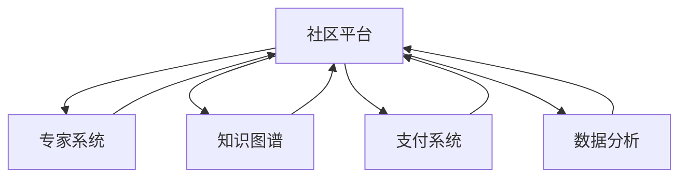

                 

# 如何打造知识付费的问答社区

## 1. 背景介绍

在互联网技术飞速发展的今天，知识付费已经成为在线教育与知识分享的重要组成部分。从音频、视频到文字，从知识付费平台到知识付费内容，形式多样，内容丰富。其中，问答社区作为一种即时互动的问答形式，凭借其高效、便捷、实时的特点，成为知识付费领域的新宠。

### 1.1 问题由来
问答社区最早起源于Web2.0时代的知识分享平台如Yahoo! Answers和Quora等。随着社交媒体的兴起，微信问答、知乎问答等社交问答平台也逐渐兴起。然而，这些问答平台更多是免费的服务形式，不具备商业变现的能力。

问答社区的兴起也催生了“知识付费”这一新的盈利模式。传统的付费知识服务主要是通过课程、图书等形式，而知识付费问答社区则是通过专家在线答疑的形式，借助技术手段，将免费问答与付费服务相结合，将知识付费的具体场景细化到知识问答的具体服务之中。

### 1.2 问题核心关键点
当前，打造知识付费问答社区的核心关键点如下：

1. **社区设计**：设计高效的社区平台，能够承载大规模的问答需求，并提供用户便捷的访问方式。
2. **专家管理**：引入高质量的专家，提升社区内容质量，增加用户粘性。
3. **商业变现**：建立有效的商业模式，使社区能够持续运营并实现盈利。
4. **用户体验**：提升用户体验，保持社区活跃度，增强用户粘性。
5. **数据分析**：通过数据分析，理解用户行为，优化社区运营策略。

## 2. 核心概念与联系

### 2.1 核心概念概述

为了更好地理解知识付费问答社区的打造过程，下面对相关核心概念进行详细阐述。

1. **社区平台**：在线问答社区是建立在互联网上的虚拟社区，用于汇聚专家和用户，通过问答形式进行知识交流。
2. **专家系统**：为社区引入高质量的专家，通过专家的知识和经验提供高质量的问答服务。
3. **知识图谱**：将问答内容结构化，便于知识的存储、检索和传播。
4. **支付系统**：为社区建立支付系统，实现专家与用户的商业变现。
5. **数据分析**：通过数据分析，提升社区的运营效率和用户体验。

### 2.2 核心概念原理和架构的 Mermaid 流程图



这个流程图展示了知识付费问答社区的核心架构，各模块相互依赖，协同工作，共同支撑社区的运行。

## 3. 核心算法原理 & 具体操作步骤

### 3.1 算法原理概述

知识付费问答社区的打造，需要解决两个主要问题：

1. **高效匹配问题与专家**：用户提问后，如何高效匹配到合适的专家，并通知专家。
2. **支付与分成**：用户提问后，如何通过支付系统，将支付的报酬支付给专家，并进行分成。

### 3.2 算法步骤详解

#### 3.2.1 匹配算法

**步骤1：用户提问**

用户提交问题后，系统需要将问题进行初步处理，包括去除敏感词、关键词提取等。

**步骤2：专家推荐**

系统将处理后的问题，根据关键词进行匹配，推荐与问题最相关的专家，以及专家对相关问题的回答质量。

**步骤3：专家选择**

专家根据推荐结果选择是否回答用户的问题。如果专家选择了回答问题，系统会通知用户，并为其准备回答内容。

**步骤4：回答审核**

系统对专家提供的回答进行审核，如果回答内容质量未达标，将驳回回答，要求专家重新回答。

**步骤5：回答发布**

审核通过的回答，将发布在用户提问的页面中，供用户查看。

#### 3.2.2 支付与分成算法

**步骤1：用户支付**

用户选择问题，并向专家发起支付请求。系统验证用户支付渠道的有效性，确认支付成功。

**步骤2：专家收款**

系统将支付的报酬划入专家的账户中，并按照约定进行分成。

**步骤3：交易记录**

系统记录每次交易的详情，包括用户、专家、支付金额、分成比例等。

**步骤4：收益统计**

系统对专家的收益进行统计，生成收益报表，并按月向专家发放收益。

### 3.3 算法优缺点

**优点：**

1. **高效匹配**：利用关键词匹配算法，能够快速将问题与相关专家进行匹配。
2. **支付便捷**：支付系统保障了专家的收益，降低了交易成本。
3. **分成透明**：收益统计与分成透明，能够提升专家的信任度。
4. **灵活运营**：可以根据市场需求，灵活调整匹配和分成的策略。

**缺点：**

1. **匹配准确性**：关键词匹配算法需要不断优化，才能确保匹配的准确性。
2. **支付安全性**：支付系统需要高度安全，以保障用户和专家的利益。
3. **收益分配**：需要合理设置分成比例，以激发专家的积极性。

### 3.4 算法应用领域

知识付费问答社区的应用领域广泛，包括但不限于以下领域：

1. **教育培训**：提供在线教育课程，解决用户学习难题。
2. **技术支持**：为企业提供技术支持，提升技术水平。
3. **咨询策划**：为个人和企业提供咨询服务，帮助制定决策方案。
4. **健康医疗**：提供健康医疗咨询，帮助用户解决健康问题。
5. **生活服务**：提供生活服务咨询，解决日常生活问题。

## 4. 数学模型和公式 & 详细讲解 & 举例说明

### 4.1 数学模型构建

假设问答社区有$N$个用户，每个用户有$m$个问题，问题需要匹配到$K$个专家，每个专家需要回答$q$个问题，专家和问题之间按照时间优先级排序，得到专家问题队列，每个问题有$p$个答案，每个答案有$v$个详细解释。

1. **用户问题处理模型**
   $P_{i} = (T_i, C_i, D_i)$
   - $T_i$：用户提问时间。
   - $C_i$：问题内容。
   - $D_i$：问题描述。

2. **专家问题匹配模型**
   $E_j = (T_j, P_j)$
   - $T_j$：专家在线时间。
   - $P_j = (P_{j_1}, P_{j_2}, ..., P_{j_q})$：专家正在处理的$j$个问题队列。

3. **支付与分成模型**
   $T_k = (S_k, I_k)$
   - $S_k$：专家收益分成比例。
   - $I_k$：专家每次回答问题的收益。

4. **收益统计模型**
   $B = (P_i, E_j, T_k)$
   - $P_i$：用户提问数据。
   - $E_j$：专家回答数据。
   - $T_k$：专家收益数据。

### 4.2 公式推导过程

#### 匹配算法公式

$M = \min \left( \frac{P_i \cdot E_j}{m \cdot q} \right)$

其中：
- $P_i$：用户问题数据。
- $E_j$：专家问题队列数据。
- $m$：用户提问数量。
- $q$：专家处理问题数量。

$M$：匹配度。

#### 支付与分成公式

$I_k = P_i \cdot S_k$

其中：
- $P_i$：用户支付金额。
- $S_k$：专家收益分成比例。

### 4.3 案例分析与讲解

以一个简单的问答社区为例，假设社区有1000个用户，每个用户有5个问题，100个专家，每个专家回答10个问题。假设每个问题的收益为10元，专家的收益分成比例为5%。

根据匹配算法公式：

- 用户i的提问与专家j的匹配度为 $M_{i,j} = \min \left( \frac{5}{100 \cdot 10} \right) = \min \left( \frac{1}{200} \right) = 0.005$

- 如果专家j选择了回答，则通知用户i，进行回答审核。

- 假设专家j审核通过回答，则将10元报酬划入专家账户，并按照5%分成。

- 专家j每次回答问题的收益为 $I_j = 10 \cdot 5\% = 0.5$

通过支付与分成公式，系统记录每次交易详情，生成收益报表，每月向专家发放收益。

## 5. 项目实践：代码实例和详细解释说明

### 5.1 开发环境搭建

**开发语言**：Python

**开发框架**：Django、Flask

**数据库**：MySQL、PostgreSQL

**服务器**：AWS、阿里云、腾讯云

### 5.2 源代码详细实现

**步骤1：用户问题处理**

```python
# 用户问题模型定义
class UserQuestion(models.Model):
    user = models.ForeignKey(User, on_delete=models.CASCADE)
    question_text = models.TextField()
    question_desc = models.TextField()
    question_time = models.DateTimeField(auto_now_add=True)
    # 其他模型字段
```

**步骤2：专家问题匹配**

```python
# 专家问题队列模型定义
class ExpertQuestionQueue(models.Model):
    expert = models.ForeignKey(Expert, on_delete=models.CASCADE)
    question = models.ForeignKey(UserQuestion, on_delete=models.CASCADE)
    question_time = models.DateTimeField(auto_now_add=True)
    # 其他模型字段
```

**步骤3：支付与分成**

```python
# 支付记录模型定义
class PaymentRecord(models.Model):
    user = models.ForeignKey(User, on_delete=models.CASCADE)
    expert = models.ForeignKey(Expert, on_delete=models.CASCADE)
    payment_amount = models.DecimalField(max_digits=10, decimal_places=2)
    split_ratio = models.DecimalField(max_digits=5, decimal_places=2)
    payment_time = models.DateTimeField(auto_now_add=True)
    # 其他模型字段
```

**步骤4：收益统计**

```python
# 专家收益统计模型定义
class ExpertEarnings(models.Model):
    expert = models.ForeignKey(Expert, on_delete=models.CASCADE)
    earnings = models.DecimalField(max_digits=10, decimal_places=2)
    # 其他模型字段
```

### 5.3 代码解读与分析

**代码结构**：
1. **用户问题模型**：存储用户的提问数据，包括用户ID、问题文本、问题描述、提问时间等。
2. **专家问题队列模型**：存储专家正在处理的问题队列，包括专家ID、问题ID、问题处理时间等。
3. **支付记录模型**：存储用户支付数据，包括用户ID、专家ID、支付金额、分成比例、支付时间等。
4. **专家收益统计模型**：存储专家的收益数据，包括专家ID、收益、支付时间等。

**代码实现**：
1. **用户问题处理**：在用户提交问题后，根据用户ID、问题文本、问题描述、提问时间等信息，创建UserQuestion模型实例。
2. **专家问题匹配**：在专家选择回答问题后，根据专家ID、问题ID、问题处理时间等信息，创建ExpertQuestionQueue模型实例。
3. **支付与分成**：在系统确认支付后，根据用户ID、专家ID、支付金额、分成比例等信息，创建PaymentRecord模型实例。
4. **收益统计**：根据专家ID、收益等信息，创建ExpertEarnings模型实例。

### 5.4 运行结果展示

在实际操作中，用户提交问题后，系统自动匹配专家，专家选择回答问题后，系统记录回答时间，并在回答审核通过后通知用户，同时更新支付记录和收益统计。系统界面展示用户提问、专家回答、支付记录和收益统计等数据。

## 6. 实际应用场景

### 6.1 教育培训

在教育培训领域，知识付费问答社区可以提供个性化的学习支持，用户可以随时提问学习中遇到的问题，获得专家的实时解答，提高学习效果。

### 6.2 技术支持

企业可以建立知识付费问答社区，将技术专家引入社区，解答技术问题，提高企业技术水平，降低技术支持成本。

### 6.3 咨询策划

个人和企业可以借助知识付费问答社区，获得专业的咨询策划服务，帮助制定决策方案，提升决策准确性。

### 6.4 健康医疗

在健康医疗领域，用户可以随时提问健康问题，专家可以提供科学的健康建议，提高用户的健康水平。

### 6.5 生活服务

社区可以提供多种生活服务的咨询服务，如房产、装修、美食、旅行等，帮助用户解决生活难题。

## 7. 工具和资源推荐

### 7.1 学习资源推荐

1. **《Python网络爬虫开发实战》**：通过这本书，可以学习如何搭建社区平台，爬取数据。
2. **《深度学习框架TensorFlow》**：通过这本书，可以学习如何使用TensorFlow搭建模型。
3. **《自然语言处理入门》**：通过这本书，可以学习如何处理自然语言文本。
4. **《分布式系统架构设计》**：通过这本书，可以学习如何设计分布式系统，提升社区性能。

### 7.2 开发工具推荐

1. **Django**：用于搭建社区平台，支持RESTful API。
2. **Flask**：用于搭建社区API，支持快速开发。
3. **MySQL**：用于存储社区数据，支持高并发读写。
4. **Redis**：用于缓存社区数据，提升查询效率。
5. **Elasticsearch**：用于存储和搜索社区数据，支持大规模数据处理。

### 7.3 相关论文推荐

1. **《深度学习与问答系统》**：介绍深度学习在问答系统中的应用。
2. **《知识图谱与问答系统》**：介绍知识图谱在问答系统中的应用。
3. **《多轮对话系统》**：介绍多轮对话在问答系统中的应用。

## 8. 总结：未来发展趋势与挑战

### 8.1 研究成果总结

本文对知识付费问答社区的打造过程进行了详细的分析，涉及社区平台、专家管理、知识图谱、支付系统、数据分析等核心模块，并结合实际案例进行了讲解。

### 8.2 未来发展趋势

未来，知识付费问答社区将呈现以下几个发展趋势：

1. **社区规模化**：随着技术的进步，社区可以承载更多的用户和专家，提升社区活跃度。
2. **知识图谱化**：利用知识图谱技术，将问答内容结构化，提升知识传播效率。
3. **支付系统升级**：支付系统将更安全、便捷，提升用户体验。
4. **数据分析深入**：通过数据分析，更准确地理解用户行为，优化社区运营策略。
5. **AI技术应用**：引入AI技术，提升匹配准确性，提升回答质量。

### 8.3 面临的挑战

尽管知识付费问答社区具备诸多优势，但在实际运营中仍面临以下挑战：

1. **专家管理**：需要引入高质量的专家，提升社区内容质量。
2. **匹配准确性**：需要优化匹配算法，提升匹配准确性。
3. **支付安全性**：需要保证支付系统安全，保护用户和专家利益。
4. **收益分配**：需要合理设置分成比例，激发专家积极性。

### 8.4 研究展望

未来，知识付费问答社区的发展方向如下：

1. **个性化推荐**：通过个性化推荐算法，提升用户对社区的粘性。
2. **智能匹配**：利用AI技术，提升匹配准确性，提升回答质量。
3. **知识图谱应用**：利用知识图谱技术，提升问答系统的知识整合能力。
4. **社区互动**：通过社区互动功能，提升用户参与度。

## 9. 附录：常见问题与解答

**Q1：如何提升匹配算法的准确性？**

A: 可以通过引入机器学习算法，对关键词进行优化，提高匹配准确性。

**Q2：如何保证支付系统的安全性？**

A: 可以引入第三方支付平台，采用多重加密技术，保证支付安全。

**Q3：如何优化收益分成比例？**

A: 可以通过数据分析，了解专家的收益期望，调整分成比例，激发专家积极性。

**Q4：如何提升社区活跃度？**

A: 可以通过增加互动功能，提升用户参与度。

**Q5：如何提升专家管理效率？**

A: 可以通过智能推荐系统，提升专家匹配效率。

---

作者：禅与计算机程序设计艺术 / Zen and the Art of Computer Programming

