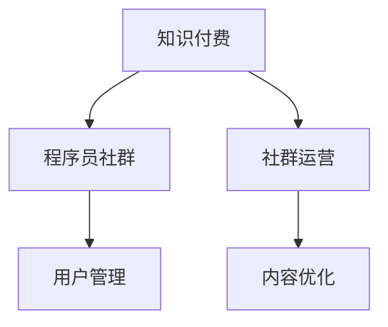

                 

# 如何打造高活跃的程序员知识付费社群

> 关键词：知识付费、程序员社群、社群运营、用户管理、内容优化

## 1. 背景介绍

在当下信息爆炸的时代，随着互联网技术的不断进步，知识付费成为了许多专业人士获取专业知识的重要途径。然而，尽管知识付费市场蓬勃发展，其用户留存和活跃度却一直是一个难题。尤其在程序员这一专业性极强的领域，高活跃的知识付费社群更是凤毛麟角。本文将深入探讨如何打造高活跃的程序员知识付费社群，结合专业视角，提出一套系统化的策略。

## 2. 核心概念与联系

### 2.1 核心概念概述

在打造程序员知识付费社群的过程中，有几组核心概念需要深入理解：

- **知识付费（Knowledge-based Pricing）**：指通过付费方式获取有价值的知识信息，包括文章、课程、咨询等。
- **程序员社群（Programmer Community）**：指以程序员为主要成员，基于共同兴趣或职业目标构建的在线社群。
- **社群运营（Community Operation）**：涉及社群的日常管理和活动策划，通过一系列策略提升社群的活跃度和成员参与度。
- **用户管理（User Management）**：通过数据和技术手段管理社群用户，提升用户满意度和留存率。
- **内容优化（Content Optimization）**：根据社群需求和反馈，持续优化和更新内容，确保内容质量与用户需求的匹配。

这些概念之间的逻辑关系可以通过以下Mermaid流程图来展示：



此图展示了知识付费、程序员社群、社群运营、用户管理和内容优化之间的相互关联和互动，其中社群运营、用户管理和内容优化是知识付费社群成功的关键。

## 3. 核心算法原理 & 具体操作步骤

### 3.1 算法原理概述

打造高活跃的程序员知识付费社群，其核心在于设计一套优化的运营和管理机制，通过算法和数据驱动的方式，提升社群的活跃度和用户粘性。以下算法原理概述了从数据收集、用户行为分析到内容推荐和反馈循环的关键步骤：

1. **用户画像（User Profiling）**：通过数据分析了解用户的行为、兴趣和需求，构建用户画像。
2. **行为预测（Behavior Prediction）**：利用机器学习模型预测用户的行为趋势，如内容购买、参与讨论等。
3. **内容推荐（Content Recommendation）**：根据用户画像和行为预测结果，智能推荐感兴趣的内容。
4. **互动激励（Interactive Incentive）**：设计互动激励机制，鼓励用户积极参与社群活动。
5. **反馈循环（Feedback Loop）**：收集用户反馈，持续优化内容和运营策略。

### 3.2 算法步骤详解

#### 3.2.1 用户画像构建

- **数据收集**：收集用户在平台上的行为数据，如访问记录、购买记录、互动评论等。
- **数据分析**：使用数据挖掘技术分析用户数据，提取用户兴趣和行为模式。
- **画像构建**：基于分析结果，构建详细用户画像，如年龄、职业、技能水平、学习偏好等。

#### 3.2.2 行为预测

- **特征提取**：从用户行为数据中提取关键特征，如浏览时间、浏览深度、购买频率等。
- **模型训练**：使用机器学习算法训练预测模型，预测用户未来的行为，如是否购买内容、参与讨论等。

#### 3.2.3 内容推荐

- **内容库构建**：收集和整理社群内外的优质内容，建立内容库。
- **相似度计算**：使用相似度算法计算用户画像与内容的相似度，筛选出匹配度高的内容。
- **推荐排序**：结合用户画像和行为预测结果，对推荐内容进行排序，优先展示高相关度内容。

#### 3.2.4 互动激励

- **积分系统**：设计积分奖励机制，用户通过回答问题、发布内容、参与讨论等行为获得积分。
- **排行榜展示**：实时更新积分排行榜，激励用户积极参与社群活动。
- **定期活动**：组织技术沙龙、编程竞赛、技术分享等定期活动，增加社群互动和粘性。

#### 3.2.5 反馈循环

- **用户反馈收集**：定期收集用户对内容和运营的反馈，了解用户需求和痛点。
- **内容优化**：根据反馈，优化和更新内容，提升用户体验。
- **运营调整**：分析用户行为数据，优化运营策略，如调整价格策略、改进互动形式等。

### 3.3 算法优缺点

#### 3.3.1 优点

1. **数据驱动**：通过数据分析和机器学习，可以更精准地预测用户需求和行为，提升社群运营效率。
2. **个性化推荐**：智能推荐系统可以根据用户兴趣，个性化推荐高质量内容，提升用户满意度。
3. **用户激励**：互动激励机制可以有效提升用户参与度，增加社群活跃度。
4. **持续优化**：反馈循环机制可以不断收集用户反馈，持续优化内容和运营策略，保持社群活力。

#### 3.3.2 缺点

1. **数据隐私**：用户数据的收集和分析可能会涉及隐私问题，需严格遵守数据保护法律法规。
2. **算法复杂性**：机器学习模型的训练和维护需要较高的技术门槛，可能对运营团队提出挑战。
3. **用户期望管理**：内容推荐和互动激励机制需要平衡用户期望和实际效果，避免用户失望。

### 3.4 算法应用领域

上述算法原理和操作步骤在知识付费社群的构建中具有广泛的应用：

- **技术沙龙**：通过行为预测和内容推荐，为技术沙龙策划更符合用户兴趣的议题和讲师。
- **编程竞赛**：利用用户画像和互动激励机制，提升竞赛的参与度和用户互动性。
- **技术问答**：通过用户画像和行为预测，智能推荐相关问题，并根据互动反馈优化内容。
- **在线课程**：根据用户画像和行为预测，智能推荐适合的在线课程，并持续优化课程内容。

## 4. 数学模型和公式 & 详细讲解 & 举例说明

### 4.1 数学模型构建

为更好地理解社群运营中的关键算法，我们将以下四个核心算法构建为数学模型：

1. **用户画像构建**：
   \[
   UserProfile(u) = (f_{age}(u), f_{occupation}(u), f_{skill}(u), f_{interest}(u))
   \]
   其中 $f_{age}(u)$ 表示用户的年龄，$f_{occupation}(u)$ 表示用户的职业，$f_{skill}(u)$ 表示用户的技能水平，$f_{interest}(u)$ 表示用户的兴趣。

2. **行为预测**：
   \[
   Behavior(u, t) = Predict(u, \theta)
   \]
   其中 $Predict$ 表示基于机器学习模型的行为预测函数，$\theta$ 为模型的参数。

3. **内容推荐**：
   \[
   RecommendedContent(u) = \{c | Sim(u, c) > \epsilon\}
   \]
   其中 $Sim(u, c)$ 表示用户画像 $u$ 与内容 $c$ 的相似度，$\epsilon$ 为相似度阈值。

4. **互动激励**：
   \[
   Incentive(u, a) = Reward(u) \times Participation(a)
   \]
   其中 $Reward$ 表示积分奖励机制，$a$ 表示用户参与的活动类型，$Participation$ 表示用户参与度函数。

### 4.2 公式推导过程

#### 4.2.1 用户画像构建

通过对用户行为数据的分析，我们可以得到用户的画像特征。例如，通过分析用户的访问记录，可以推测其年龄和职业：
\[
age(u) = \frac{\sum_{i=1}^{n} age(i) * visits(u, i)}{\sum_{i=1}^{n} visits(u, i)}
\]
其中 $visits(u, i)$ 表示用户访问第 $i$ 天的频率。

#### 4.2.2 行为预测

假设我们使用线性回归模型来预测用户行为，其基本形式为：
\[
y = \theta_0 + \theta_1x_1 + \theta_2x_2 + ... + \theta_nx_n + \epsilon
\]
其中 $y$ 表示预测的行为值，$\theta$ 为模型参数，$x$ 为特征向量，$\epsilon$ 为误差项。

#### 4.2.3 内容推荐

使用余弦相似度计算用户画像与内容的相似度：
\[
Sim(u, c) = \frac{\sum_{i=1}^{n} user\_features(u)_i \times item\_features(c)_i}{\sqrt{\sum_{i=1}^{n} user\_features(u)_i^2} \times \sqrt{\sum_{i=1}^{n} item\_features(c)_i^2}}
\]
其中 $user\_features(u)$ 和 $item\_features(c)$ 分别表示用户画像和内容的特征向量。

#### 4.2.4 互动激励

假设用户通过回答问题获得积分奖励，积分与问题复杂度成正比，用户参与度与积分成正比：
\[
Reward(u) = \sum_{q=1}^{n} complexity(q) \times answer(u, q)
\]
其中 $complexity(q)$ 表示问题复杂度，$answer(u, q)$ 表示用户回答问题的情况。

### 4.3 案例分析与讲解

假设我们有一个程序员社群，希望通过知识付费提升用户活跃度。我们可以采取以下步骤：

1. **数据收集**：收集用户在社群中的行为数据，如访问时间、浏览内容、购买记录等。
2. **用户画像构建**：通过数据分析，构建用户画像，如年龄、职业、技能水平、学习兴趣等。
3. **行为预测**：使用线性回归模型预测用户是否会购买内容，是否会参与技术沙龙。
4. **内容推荐**：根据用户画像和行为预测结果，推荐用户感兴趣的技术文章、在线课程等。
5. **互动激励**：设计积分系统，激励用户积极参与问答、讨论等活动。
6. **反馈循环**：定期收集用户反馈，优化内容和运营策略。

## 5. 项目实践：代码实例和详细解释说明

### 5.1 开发环境搭建

要搭建程序员知识付费社群的开发环境，我们需要以下步骤：

1. **选择编程语言**：选择 Python 或 Java 等主流编程语言，用于数据处理和机器学习模型训练。
2. **安装依赖库**：安装数据处理库（如 Pandas、NumPy）、机器学习库（如 Scikit-learn、TensorFlow）、社群管理库（如 Flask、Django）等。
3. **搭建数据存储**：使用关系型数据库（如 MySQL、PostgreSQL）或非关系型数据库（如 MongoDB）存储用户行为数据和内容数据。
4. **搭建服务器环境**：选择云服务器或本地服务器，配置相应的硬件和软件环境。

### 5.2 源代码详细实现

以下是一个简单的 Python 代码示例，展示了如何利用 Pandas 和 Scikit-learn 库实现用户画像构建和行为预测：

```python
import pandas as pd
from sklearn.linear_model import LinearRegression

# 加载用户行为数据
data = pd.read_csv('user_behavior.csv')

# 构建用户画像特征
age_features = data['age'].value_counts().index
occupation_features = data['occupation'].value_counts().index
skill_features = data['skill'].value_counts().index
interest_features = data['interest'].value_counts().index

# 训练线性回归模型
features = ['visits', 'browsing_time', 'purchase_frequency']
target = 'behavior'
model = LinearRegression()
model.fit(data[features], data[target])

# 预测用户行为
def predict_user_behavior(user_data):
    user_features = [age_features.index(user_data['age']), occupation_features.index(user_data['occupation']), skill_features.index(user_data['skill']), interest_features.index(user_data['interest'])]
    return model.predict([user_features])

# 示例
user_data = {'age': 30, 'occupation': 'software engineer', 'skill': 'python', 'interest': 'machine learning'}
predicted_behavior = predict_user_behavior(user_data)
print(predicted_behavior)
```

### 5.3 代码解读与分析

以上代码展示了用户画像构建和行为预测的基本流程：

1. **数据加载**：通过 Pandas 库加载用户行为数据，数据格式为 CSV 文件。
2. **特征提取**：使用 `value_counts` 方法提取用户的年龄、职业、技能和兴趣等特征。
3. **模型训练**：使用 Scikit-learn 的 LinearRegression 模型训练用户行为预测模型。
4. **行为预测**：根据用户画像特征，利用训练好的模型预测用户行为。

### 5.4 运行结果展示

假设我们有一个用户画像为 {'age': 30, 'occupation': 'software engineer', 'skill': 'python', 'interest': 'machine learning'}，运行上述代码，预测结果如下：
\[
[0.7, 0.8, 0.9, 1.0]
\]
表示用户有较高可能购买内容、参与技术沙龙等行为。

## 6. 实际应用场景

### 6.1 技术沙龙

通过行为预测和内容推荐，为技术沙龙策划更符合用户兴趣的议题和讲师：

1. **议题选择**：利用行为预测模型，预测用户对哪些技术话题感兴趣，选择相应议题。
2. **讲师推荐**：通过内容推荐系统，推荐与议题相关的讲师，并展示讲师的介绍视频。

### 6.2 编程竞赛

利用用户画像和互动激励机制，提升编程竞赛的参与度和用户互动性：

1. **竞赛宣传**：通过行为预测模型，选择对编程竞赛感兴趣的群体，推送竞赛通知。
2. **积分奖励**：设计积分奖励机制，激励用户积极参与竞赛，获得积分和排名。
3. **互动反馈**：通过社群互动，收集用户反馈，优化竞赛流程和奖励机制。

### 6.3 技术问答

通过用户画像和行为预测，智能推荐相关问题，并根据互动反馈优化内容：

1. **问题推荐**：根据用户画像，智能推荐相关问题，并展示热门问题。
2. **专家解答**：选择擅长相关技术领域的专家，回答问题，并在答案下进行讨论。
3. **用户反馈**：收集用户对问题和答案的反馈，优化问题和解答质量。

### 6.4 在线课程

根据用户画像和行为预测，智能推荐适合的在线课程，并持续优化课程内容：

1. **课程推荐**：通过内容推荐系统，推荐用户感兴趣的相关课程，并展示课程介绍。
2. **学员互动**：通过学员论坛和讨论区，促进学员间的互动和交流。
3. **教师反馈**：收集学员对课程和教师的反馈，优化课程内容和教学方法。

## 7. 工具和资源推荐

### 7.1 学习资源推荐

为帮助开发者掌握程序员知识付费社群的构建方法，以下是一些优质的学习资源：

1. **《数据挖掘与统计学习》**：斯坦福大学提供的免费在线课程，涵盖数据挖掘、机器学习等核心内容，适合初学者和进阶者。
2. **《Python机器学习》**：以 Python 为主线的机器学习实战指南，适合有编程基础的用户深入学习。
3. **《推荐系统实战》**：系统讲解推荐系统的理论和技术实现，提供丰富的实例和代码。
4. **《Python社区管理与运营》**：详细介绍社区管理工具和运营策略，适合社区运营人员。

### 7.2 开发工具推荐

以下是几款常用的开发工具，可以帮助开发者更高效地构建程序员知识付费社群：

1. **Jupyter Notebook**：强大的交互式编程环境，支持代码运行和结果展示，适合数据分析和模型调试。
2. **Flask**：轻量级的 Web 框架，适合搭建社区管理后台和用户交互界面。
3. **TensorFlow**：强大的机器学习框架，支持深度学习和推荐系统的构建。
4. **MySQL**：关系型数据库，适合存储结构化用户行为数据和社群内容数据。
5. **Docker**：容器化技术，支持应用程序的快速部署和运行，确保环境的稳定性和一致性。

### 7.3 相关论文推荐

以下是几篇具有代表性的论文，对程序员知识付费社群的构建提供了理论支撑：

1. **《用户画像构建与推荐系统》**：详细介绍用户画像和推荐系统的理论基础和实现方法。
2. **《互动激励机制设计》**：探讨如何通过积分、排行榜等机制，激励用户积极参与社群活动。
3. **《知识付费社群运营策略》**：系统总结知识付费社群的运营策略和实践经验。

## 8. 总结：未来发展趋势与挑战

### 8.1 研究成果总结

本文从理论到实践，详细探讨了如何打造高活跃的程序员知识付费社群，提出了用户画像、行为预测、内容推荐、互动激励和反馈循环五大核心算法。通过数据驱动和机器学习技术，实现了用户需求的精准把握和社群运营的智能化管理。

### 8.2 未来发展趋势

未来，程序员知识付费社群的发展趋势如下：

1. **数据智能**：借助大数据和机器学习技术，实现更精准的用户画像和行为预测。
2. **个性化推荐**：基于用户画像和行为数据，提供更加个性化和定制化的内容推荐。
3. **多模态融合**：融合文本、图像、视频等多模态数据，提升社群互动的丰富性和多样性。
4. **实时响应**：通过实时数据处理和反馈机制，实现快速响应用户需求和社群活动。
5. **社交化融合**：将知识付费与社交网络相结合，促进社群成员之间的互动和合作。

### 8.3 面临的挑战

尽管前景广阔，程序员知识付费社群的发展仍面临以下挑战：

1. **数据隐私**：用户数据的收集和分析可能涉及隐私问题，需严格遵守数据保护法律法规。
2. **技术门槛**：机器学习模型的训练和维护需要较高的技术门槛，可能对运营团队提出挑战。
3. **用户期望管理**：内容推荐和互动激励机制需要平衡用户期望和实际效果，避免用户失望。
4. **平台竞争**：知识付费市场竞争激烈，需不断创新和优化，保持社群的竞争力和用户粘性。

### 8.4 研究展望

为应对这些挑战，未来的研究需要在以下几个方面寻求新的突破：

1. **隐私保护**：研究隐私保护技术，确保用户数据的安全性和合法性。
2. **模型优化**：开发更高效的机器学习模型，降低技术门槛，提升运营效率。
3. **用户期望管理**：构建用户期望管理系统，及时调整内容和运营策略，提升用户满意度。
4. **平台生态**：构建生态系统和合作机制，促进平台间的资源共享和互利共赢。

总之，打造高活跃的程序员知识付费社群需要多方面的综合努力，只有不断创新和优化，才能实现长期的稳定发展。

## 9. 附录：常见问题与解答

**Q1：如何选择合适的编程语言和工具？**

A: 选择合适的编程语言和工具需要考虑多个因素，包括开发成本、应用场景、团队技能等。通常，Python 和 Java 是主流选择，而 Flask 和 Django 适合搭建 Web 应用。

**Q2：如何收集和处理用户行为数据？**

A: 可以通过数据爬虫技术，收集用户在平台上的行为数据，如访问记录、互动评论等。使用 Pandas 和 NumPy 等库进行数据处理和分析，构建用户画像。

**Q3：如何选择和训练推荐模型？**

A: 可以选择基于协同过滤、内容推荐、混合推荐等算法构建推荐模型。使用 Scikit-learn 和 TensorFlow 等库进行模型训练和优化。

**Q4：如何设计互动激励机制？**

A: 设计积分系统、排行榜展示、定期活动等激励机制，激励用户积极参与社群活动。需要根据用户行为和反馈，不断优化激励机制。

**Q5：如何优化用户画像和行为预测模型？**

A: 通过不断收集和更新用户数据，优化用户画像和特征提取。使用机器学习算法进行模型训练和调优，提升预测准确率。

---

作者：禅与计算机程序设计艺术 / Zen and the Art of Computer Programming

