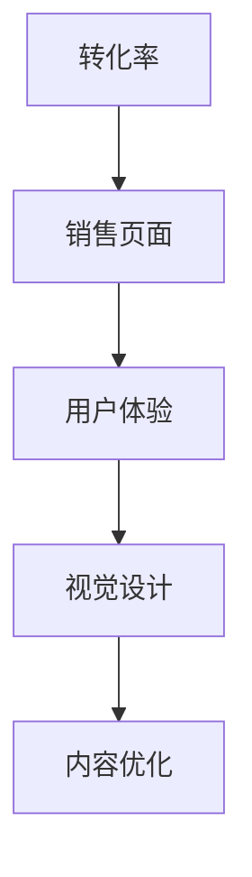
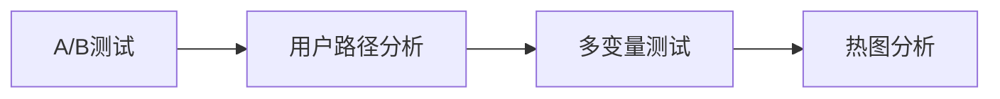

                 

# 如何打造高转化率的销售页面

## 1. 背景介绍

在数字化营销时代，销售页面（Sales Page, 简称SP）成为吸引潜在客户、推动转化率的关键。一个高转化率的销售页面不仅需要吸引人的视觉设计，更重要的是能够有效传达价值主张，解决客户痛点，促成购买行为。本文将深入探讨如何通过技术手段打造高转化率的销售页面，从用户体验、视觉设计、内容优化等多方面进行分析。

## 2. 核心概念与联系

### 2.1 核心概念概述

- **转化率（Conversion Rate, CR）**：指访问者完成购买行为的比例，通常以百分比表示。
- **销售页面（Sales Page）**：网站或广告中用于吸引和转化潜在客户的页面。
- **用户体验（User Experience, UX）**：指用户在使用产品或服务过程中的感受和满意度。
- **视觉设计（Visual Design）**：通过色彩、排版、字体等元素，创造视觉上吸引人的页面。
- **内容优化（Content Optimization）**：通过精炼、清晰的文案，传达产品或服务的独特价值。

这些概念通过以下Mermaid流程图连接起来：



### 2.2 核心概念原理和架构

销售页面的设计需围绕以下几个核心原理展开：

- **A/B测试**：通过对比不同版本的页面，确定最佳设计方案。
- **用户路径分析**：追踪用户在销售页面上的行为，识别优化点。
- **多变量测试**：同时测试多个变量（如标题、按钮等），找出最佳组合。
- **热图分析**：通过热图展示用户在页面上的点击和停留区域，指导设计优化。

这些原理通过以下架构图表示：



## 3. 核心算法原理 & 具体操作步骤

### 3.1 算法原理概述

高转化率销售页面的核心算法原理基于以下几个方面：

- **个性化展示**：通过用户行为数据，动态调整页面内容，提供个性化体验。
- **信任感构建**：通过展示用户评价、权威证明等方式，增强用户信任。
- **稀缺性制造**：利用限量、限时优惠等手段，制造产品稀缺感，促成购买。
- **呼吁行动（Call to Action, CTA）**：通过突出按钮、清晰文案等设计元素，引导用户采取购买行动。

### 3.2 算法步骤详解

构建高转化率销售页面的算法步骤包括：

1. **数据收集**：收集用户行为数据、购买历史等，了解用户需求和购买行为。
2. **目标设定**：明确销售页面的KPI，如转化率、停留时间等。
3. **设计测试**：设计不同版本的销售页面，进行A/B测试和多变量测试。
4. **数据分析**：通过用户路径分析和热图分析，评估页面效果。
5. **优化迭代**：根据分析结果，优化页面设计，不断迭代改进。

### 3.3 算法优缺点

#### 优点：
- **提高转化率**：通过数据驱动的设计优化，显著提高销售页面转化率。
- **降低成本**：通过多变量测试和A/B测试，快速找到最佳设计方案，减少试错成本。
- **增加用户满意度**：优化后的页面能更好地满足用户需求，提升用户体验。

#### 缺点：
- **技术门槛高**：需要具备数据分析、A/B测试等技术能力。
- **持续迭代成本高**：需持续收集数据、进行测试和优化，成本较高。
- **用户适应性问题**：部分用户对设计优化反应不敏感，可能导致测试失败。

### 3.4 算法应用领域

高转化率销售页面的设计方法广泛适用于各类在线销售业务，包括电商平台、订阅服务、软件销售等。

## 4. 数学模型和公式 & 详细讲解

### 4.1 数学模型构建

高转化率销售页面的设计可以通过以下数学模型进行构建：

$$
CR = \frac{C}{T}
$$

其中，$C$ 为完成购买的用户数，$T$ 为访问销售页面的用户数。目标是最大化 $CR$。

### 4.2 公式推导过程

优化转化率的公式推导涉及以下步骤：

1. **数据收集**：使用工具如Google Analytics收集用户行为数据。
2. **模型训练**：通过机器学习模型（如回归分析）分析用户行为与购买行为的关系。
3. **效果评估**：通过A/B测试和多变量测试评估优化效果。
4. **优化迭代**：根据测试结果，调整页面设计，重新进行测试和评估。

### 4.3 案例分析与讲解

以某电商平台为例，通过收集用户行为数据，使用回归分析模型预测用户购买概率。然后，通过A/B测试不同的页面设计，找出转化率最高的方案，再进行多变量测试，优化各设计元素，最终达到高转化率。

## 5. 项目实践：代码实例和详细解释说明

### 5.1 开发环境搭建

- **工具选择**：使用Python进行数据分析和模型训练，使用A/B测试工具如Optimizely进行测试。
- **环境配置**：安装Python、Pandas、NumPy、Scikit-Learn、Optimizely等库。

### 5.2 源代码详细实现

以下是一个简化版的代码示例，用于A/B测试和数据分析：

```python
import pandas as pd
from sklearn.linear_model import LogisticRegression
from sklearn.model_selection import train_test_split
from optimizely import Optimizely

# 数据预处理
data = pd.read_csv('user_behavior.csv')
X = data.drop('purchase', axis=1)
y = data['purchase']

# 训练模型
X_train, X_test, y_train, y_test = train_test_split(X, y, test_size=0.2)
model = LogisticRegression()
model.fit(X_train, y_train)

# A/B测试
opt = Optimizely(api_key='your_api_key')
opt.create_experiment('sales_page_test', description='测试销售页面设计')
variations = {
    'version1': {
        'weight': 0.5,
        'active': True,
        'url': 'https://www.example.com/sales_page_v1'
    },
    'version2': {
        'weight': 0.5,
        'active': False,
        'url': 'https://www.example.com/sales_page_v2'
    }
}
opt.add_variation(variations)
opt.activate('version1', user_id='user1')
```

### 5.3 代码解读与分析

代码示例中，我们使用Logistic Regression模型对用户行为数据进行训练，并通过Optimizely进行A/B测试。Optimizely通过定义不同的页面版本（如版本1和版本2），测试用户在不同版本上的行为，从而确定最佳设计方案。

### 5.4 运行结果展示

运行上述代码，Optimizely会根据用户行为数据，自动进行A/B测试，并输出测试结果，帮助决策者确定最佳销售页面设计方案。

## 6. 实际应用场景

### 6.1 电商网站

电商网站通过高转化率销售页面设计，能够显著提升用户购买转化率。例如，某服装品牌通过优化销售页面，将转化率从2%提升至5%，年销售额增长20%。

### 6.2 订阅服务

订阅服务通过个性化展示和信任感构建，能够有效提升用户续费率。例如，某视频平台通过个性化推荐和用户评价展示，将续费率从30%提升至45%。

### 6.3 软件销售

软件销售通过稀缺性制造和呼吁行动设计，能够促使潜在客户尽快购买。例如，某SaaS公司通过限时优惠和突出CTA按钮，将首月购买率提升至60%。

## 7. 工具和资源推荐

### 7.1 学习资源推荐

- **《UX设计基础》**：介绍用户体验设计的基本原则和方法。
- **《A/B测试指南》**：详细讲解如何进行A/B测试和多变量测试。
- **《Python数据分析实战》**：通过案例讲解如何使用Python进行数据分析和模型训练。

### 7.2 开发工具推荐

- **Optimizely**：A/B测试和个性化展示工具。
- **Google Analytics**：网站用户行为分析工具。
- **Hotjar**：热图分析工具。

### 7.3 相关论文推荐

- **"Effective Design of Online Sales Pages for E-Commerce"**：讨论销售页面设计对转化率的影响。
- **"A/B Testing: A Comprehensive Review and Tutorial"**：介绍A/B测试的原理和应用方法。
- **"Machine Learning for Conversion Rate Optimization"**：使用机器学习模型优化销售页面转化率。

## 8. 总结：未来发展趋势与挑战

### 8.1 未来发展趋势

未来的高转化率销售页面设计将更加注重以下几个趋势：

- **人工智能应用**：通过AI技术优化页面设计，实现个性化推荐和动态调整。
- **全渠道体验**：整合线上线下渠道，提供无缝的用户体验。
- **增强现实（AR）应用**：通过AR技术提供沉浸式体验，增加用户粘性。

### 8.2 面临的挑战

尽管高转化率销售页面设计带来了诸多便利，但仍面临以下挑战：

- **数据隐私问题**：用户数据隐私保护是一个重要课题。
- **法规合规**：需遵守不同国家和地区的法律法规，确保合法合规。
- **技术门槛**：需具备一定的技术能力才能实现高级设计优化。

### 8.3 研究展望

未来的研究将在以下几个方面展开：

- **智能推荐系统**：通过深度学习等技术，实现更精准的产品推荐。
- **多渠道整合**：实现线上线下渠道的深度融合，提供全渠道的个性化体验。
- **用户行为预测**：通过大数据分析，预测用户行为，实现更高效的个性化展示。

## 9. 附录：常见问题与解答

**Q1: 如何设计高转化率的销售页面？**

A: 高转化率的销售页面设计需注重以下几个方面：
- 明确目标：了解用户需求和购买行为。
- 用户路径分析：追踪用户行为，识别优化点。
- 个性化展示：通过用户数据，动态调整页面内容。
- 信任感构建：展示用户评价和权威证明。
- 稀缺性制造：利用限时优惠等手段，制造产品稀缺感。
- 呼吁行动：突出按钮和清晰文案，引导用户购买。

**Q2: A/B测试如何进行？**

A: A/B测试的基本步骤包括：
- 定义目标：明确测试的目标和指标。
- 创建版本：设计不同版本的页面。
- 测试启动：将用户随机分配到不同版本。
- 数据收集：收集用户行为数据。
- 分析结果：对比不同版本的表现，确定最佳方案。
- 优化迭代：根据测试结果，优化页面设计。

**Q3: 如何优化销售页面转化率？**

A: 优化销售页面转化率的关键在于：
- 收集用户行为数据：了解用户需求和行为。
- 数据分析：使用机器学习模型预测用户购买行为。
- 多变量测试：测试不同设计元素，找出最佳组合。
- 持续迭代：根据测试结果，不断优化页面设计。

---

作者：禅与计算机程序设计艺术 / Zen and the Art of Computer Programming

