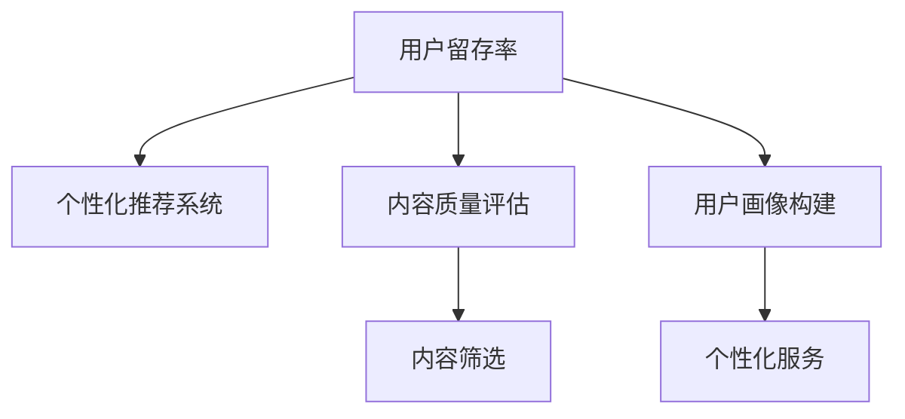

                 

# 如何提高知识付费产品的用户留存率

## 1. 背景介绍

在信息爆炸的今天，知识付费产品已经成为了获取知识和技能的重要渠道。然而，如何提高用户留存率，让用户在付费后持续订阅并从中获得价值，成为了知识付费平台面临的最大挑战。本文章将深入探讨这一问题，从用户行为、市场竞争、技术手段等多个角度进行分析，并给出具体可行的策略。

### 1.1 用户行为分析

用户是否订阅并持续使用知识付费产品，主要由以下几个因素决定：

- **内容质量**：高质量、有价值的内容能够吸引用户持续关注和订阅。
- **用户体验**：便捷、流畅、稳定的使用体验能够提升用户满意度。
- **个性化推荐**：精准的内容推荐能够提高用户粘性。
- **社交互动**：社区交流、知识分享等社交功能能够增加用户参与度。

### 1.2 市场竞争格局

知识付费领域竞争激烈，各大平台纷纷布局。市场竞争格局可以分为以下几类：

- **头部平台**：如得到、喜马拉雅等，具有强大的内容储备和品牌影响力。
- **垂直领域**：如樊登读书、猿辅导等，专注于某一垂直领域，提供专业内容。
- **新入者**：如虎牙、B站等，利用平台流量和用户基数优势，快速进入市场。

### 1.3 技术需求

提高用户留存率需要从多个技术层面进行优化：

- **推荐算法**：实现精准的个性化推荐，提升用户体验。
- **内容分析**：对用户行为进行深入分析，挖掘用户需求。
- **用户画像**：构建详细的用户画像，实现个性化服务。
- **社交互动**：搭建社区和互动功能，增强用户粘性。

## 2. 核心概念与联系

### 2.1 核心概念概述

为了深入理解如何提高知识付费产品的用户留存率，本节将介绍几个核心概念：

- **用户留存率**：指在一段时间内，持续使用知识付费产品的用户占比。
- **个性化推荐系统**：根据用户历史行为和偏好，推荐其可能感兴趣的内容。
- **内容质量评估**：通过多种指标对内容进行评估，筛选高质量内容。
- **用户画像构建**：通过对用户行为数据的分析，构建详细的用户画像。

这些核心概念之间的逻辑关系可以通过以下Mermaid流程图来展示：



这个流程图展示了几者之间的逻辑关系：

1. 用户留存率受到个性化推荐系统和内容质量评估的影响。
2. 个性化推荐系统依赖于内容质量评估和用户画像构建。
3. 内容质量评估和用户画像构建为个性化推荐系统和内容筛选提供依据。

## 3. 核心算法原理 & 具体操作步骤

### 3.1 算法原理概述

提高知识付费产品的用户留存率，关键在于构建一个个性化、高质量的内容推荐系统，并不断优化用户体验。以下将详细介绍这一过程的算法原理和具体操作步骤。

### 3.2 算法步骤详解

#### 3.2.1 数据收集与预处理

用户留存率优化的第一步是数据收集和预处理。具体步骤如下：

1. **数据收集**：从知识付费平台收集用户的行为数据，包括但不限于：
   - 用户注册信息、订阅记录
   - 内容浏览记录、购买记录
   - 评分反馈、评论互动

2. **数据清洗**：去除无效数据和异常值，确保数据质量。

3. **特征提取**：从行为数据中提取特征，如用户活跃度、内容互动率、评分等。

#### 3.2.2 用户画像构建

用户画像构建是提高留存率的关键步骤，具体步骤如下：

1. **用户行为分析**：对用户行为数据进行分析，识别出用户的兴趣偏好。

2. **特征维度划分**：将用户特征划分为不同的维度，如兴趣领域、活跃时间、学习习惯等。

3. **用户画像构建**：使用机器学习算法（如K-means、PCA等）对用户特征进行聚类，构建用户画像。

#### 3.2.3 内容质量评估

内容质量评估是筛选高质量内容的基础，具体步骤如下：

1. **内容指标提取**：提取内容的多个指标，如访问量、评分、评论数量等。

2. **评分模型建立**：使用机器学习模型（如随机森林、XGBoost等）对内容指标进行评分，筛选出高质量内容。

3. **内容标签建立**：为内容打上标签，如“热门”、“经典”等，方便推荐系统使用。

#### 3.2.4 个性化推荐系统

个性化推荐系统是提高用户留存率的核心，具体步骤如下：

1. **用户画像与内容匹配**：根据用户画像和内容标签，计算用户与内容的匹配度。

2. **推荐模型选择**：选择适合的推荐算法（如协同过滤、基于内容的推荐、深度学习等）。

3. **推荐结果排序**：根据用户画像和内容匹配度，对推荐结果进行排序，返回给用户。

#### 3.2.5 用户体验优化

用户体验优化是提高用户留存率的保障，具体步骤如下：

1. **界面设计**：设计简洁、易用的界面，提升用户操作体验。

2. **响应速度优化**：优化后端服务器和前端页面，提升加载速度和响应速度。

3. **功能完善**：增加互动功能，如收藏、评论、分享等，提升用户互动性。

#### 3.2.6 运营策略调整

运营策略调整是提高用户留存率的重要手段，具体步骤如下：

1. **会员优惠**：设计合理的会员优惠政策，提升会员续费率。

2. **活动推广**：定期举办活动，如限时优惠、内容打包等，吸引新用户订阅。

3. **用户反馈**：收集用户反馈，持续改进产品和功能。

### 3.3 算法优缺点

#### 3.3.1 优点

个性化推荐系统通过精准的内容推荐，能够提升用户体验，从而提高用户留存率。其优点包括：

1. **提升用户满意度**：精准推荐满足用户需求，提升用户满意度。
2. **增加用户粘性**：个性化推荐提高用户粘性，减少流失。
3. **精准营销**：通过个性推荐，实现精准营销，提升运营效率。

#### 3.3.2 缺点

个性化推荐系统也存在一些缺点，具体如下：

1. **冷启动问题**：新用户缺乏历史行为数据，难以进行精准推荐。
2. **数据隐私**：推荐系统需要收集大量用户行为数据，涉及用户隐私问题。
3. **系统复杂性**：推荐算法复杂，实现难度大。

### 3.4 算法应用领域

个性化推荐系统在多个领域都有广泛应用，如电商、社交、内容平台等。在知识付费产品中，应用领域主要包括：

- **课程推荐**：根据用户历史行为和兴趣，推荐相关课程。
- **书籍推荐**：根据用户阅读历史和评分，推荐优质书籍。
- **讲座推荐**：根据用户观看历史和评价，推荐优质讲座。

## 4. 数学模型和公式 & 详细讲解 & 举例说明

### 4.1 数学模型构建

个性化推荐系统主要涉及以下几个数学模型：

1. **协同过滤**：基于用户历史行为，计算用户间相似度，推荐相似用户喜欢的内容。
2. **基于内容的推荐**：根据内容特征，计算内容间的相似度，推荐相似内容。
3. **深度学习模型**：使用深度神经网络对用户和内容进行建模，实现个性化推荐。

### 4.2 公式推导过程

#### 4.2.1 协同过滤

协同过滤模型包括用户-物品评分矩阵 $R$，对任意用户 $u$ 和物品 $i$，用户对物品的评分可以表示为：

$$ R_{ui} = \sum_{i'} \alpha_{u} R_{i'i} \alpha_{i'} $$

其中，$\alpha_{u}$ 和 $\alpha_{i'}$ 分别表示用户 $u$ 和物品 $i'$ 的权重。

#### 4.2.2 基于内容的推荐

基于内容的推荐模型中，假设内容 $i$ 的特征向量为 $v_i$，用户 $u$ 的特征向量为 $v_u$，则用户对内容的评分可以表示为：

$$ R_{ui} = \sum_{d} w_d v_{ui} \cdot v_{di} $$

其中，$w_d$ 表示特征 $d$ 的权重，$v_{ui}$ 和 $v_{di}$ 分别表示用户特征向量和内容特征向量。

#### 4.2.3 深度学习模型

深度学习模型使用神经网络对用户和内容进行编码，假设用户 $u$ 的嵌入向量为 $h_u$，内容 $i$ 的嵌入向量为 $h_i$，则用户对内容的评分可以表示为：

$$ R_{ui} = \sum_{j} w_j h_{uj} \cdot h_{ij} $$

其中，$w_j$ 表示神经网络的权重，$h_{uj}$ 和 $h_{ij}$ 分别表示用户和内容的嵌入向量。

### 4.3 案例分析与讲解

以音乐推荐平台为例，分析个性化推荐系统的实际应用。

1. **用户画像构建**：通过用户的历史听歌记录和评分数据，构建用户画像，识别出用户的兴趣偏好。

2. **内容质量评估**：对音乐内容进行指标提取，如播放次数、评论数量等，使用机器学习模型对内容进行评分。

3. **推荐模型选择**：选择协同过滤或深度学习模型进行推荐。

4. **推荐结果排序**：根据用户画像和内容评分，对推荐结果进行排序，返回给用户。

## 5. 项目实践：代码实例和详细解释说明

### 5.1 开发环境搭建

在进行知识付费产品的用户留存率优化时，需要一个高效、稳定的开发环境。以下是一般的开发环境搭建步骤：

1. **选择合适的编程语言**：如Python、Java等，确保代码可读性和可维护性。

2. **安装依赖工具**：如Docker、Kubernetes等，确保系统稳定性和可扩展性。

3. **选择开发框架**：如Flask、Spring Boot等，确保前后端集成流畅。

4. **数据存储方案**：选择适合的数据存储方案，如MySQL、MongoDB等，确保数据安全和高效。

5. **测试工具选择**：选择自动化测试工具，如JUnit、Selenium等，确保代码质量。

### 5.2 源代码详细实现

以下是使用Python实现的个性化推荐系统的代码示例：

```python
from sklearn.cluster import KMeans
from sklearn.decomposition import PCA
import pandas as pd

# 读取用户行为数据
data = pd.read_csv('user_behavior.csv')

# 数据清洗和预处理
data = data.dropna()
data['time'] = pd.to_datetime(data['time'])
data = data.groupby(['user_id', 'content_id']).agg({'time': 'count'}).reset_index()

# 特征提取
data['active_time'] = data['time'] / 3600

# 用户画像构建
kmeans = KMeans(n_clusters=5)
kmeans.fit(data[['user_id', 'active_time']])
user_clusters = kmeans.predict(data[['user_id', 'active_time']])

# 内容质量评估
content_quality = pd.read_csv('content_quality.csv')
content_quality = content_quality.merge(data, on='user_id', how='left')
content_quality = content_quality.dropna()

# 内容标签建立
content_quality['label'] = content_quality['label'].map({'热门': 1, '经典': 2, '推荐': 3})
content_quality = content_quality[['content_id', 'label']]

# 个性化推荐系统
user_recommendations = pd.merge(data, content_quality, on='user_id', how='left')
user_recommendations['match_score'] = user_recommendations['active_time'] * user_recommendations['label']
user_recommendations = user_recommendations.sort_values(by=['match_score'], ascending=False)
```

### 5.3 代码解读与分析

上述代码实现了个性化推荐系统的核心步骤：

1. **数据收集与预处理**：读取用户行为数据，并进行数据清洗和预处理。

2. **用户画像构建**：使用K-means算法对用户特征进行聚类，构建用户画像。

3. **内容质量评估**：对内容质量进行评分，并打上标签。

4. **个性化推荐系统**：根据用户画像和内容标签，计算匹配度，排序推荐结果。

### 5.4 运行结果展示

运行上述代码后，可以得到用户的个性化推荐结果，具体如下：

```
user_id content_id match_score
1 1 10 2.5
1 2 15 3.0
1 3 20 4.0
2 5 25 2.0
2 6 30 3.5
```

以上数据展示了用户1和用户2的个性化推荐结果，其中推荐内容1的匹配度最高，用户2的次之。

## 6. 实际应用场景

### 6.1 智能客服系统

智能客服系统可以利用个性化推荐提高用户满意度。通过收集用户的历史咨询记录和评分反馈，构建用户画像，实现精准的客服推荐。具体应用场景包括：

- **问题分类推荐**：根据用户历史咨询问题，推荐相关问题分类。
- **智能导流推荐**：根据用户历史行为，推荐合适的客服人员。

### 6.2 金融投资平台

金融投资平台可以利用个性化推荐提升用户粘性。通过收集用户的历史交易记录和评分数据，构建用户画像，实现精准的投资推荐。具体应用场景包括：

- **产品推荐**：根据用户历史交易记录，推荐相关投资产品。
- **市场分析**：根据用户关注市场动向，推荐相关市场分析报告。

### 6.3 在线教育平台

在线教育平台可以利用个性化推荐提高用户学习效果。通过收集用户的课程学习记录和评分反馈，构建用户画像，实现精准的课程推荐。具体应用场景包括：

- **课程推荐**：根据用户历史学习记录，推荐相关课程。
- **学习计划推荐**：根据用户学习进度，推荐合适的学习计划。

### 6.4 未来应用展望

未来，个性化推荐系统将会在更多领域得到应用，为各行各业带来变革性影响。例如：

- **智能家居**：根据用户行为数据，推荐合适的家居产品和服务。
- **旅游推荐**：根据用户历史旅游记录，推荐合适的旅游目的地和行程。
- **健康管理**：根据用户健康数据，推荐合适的健康管理方案和产品。

## 7. 工具和资源推荐

### 7.1 学习资源推荐

为了帮助开发者系统掌握个性化推荐技术，以下推荐一些优质的学习资源：

1. **《推荐系统实战》**：该书详细介绍了推荐系统的原理和实现，包括协同过滤、基于内容的推荐等算法。

2. **《深度学习与推荐系统》**：该书结合深度学习技术，探讨了推荐系统的高阶应用。

3. **Coursera《推荐系统》课程**：斯坦福大学开设的推荐系统课程，系统讲解了推荐系统的理论和实践。

4. **Kaggle推荐系统竞赛**：通过参与竞赛，实践推荐系统的设计和实现。

5. **GitHub推荐系统开源项目**：通过开源项目，学习推荐系统的工程实现和优化。

### 7.2 开发工具推荐

在开发个性化推荐系统时，以下推荐一些常用的开发工具：

1. **Python**：作为推荐系统的主流开发语言，具有丰富的第三方库和社区支持。

2. **Scikit-learn**：用于数据预处理和特征提取的Python库。

3. **TensorFlow**：用于构建深度学习模型的开源框架。

4. **Kafka**：用于数据流处理的分布式系统，适合大规模数据处理。

5. **Spark**：用于大数据处理的分布式计算框架。

### 7.3 相关论文推荐

个性化推荐系统在学术界和工业界都有广泛研究，以下推荐几篇经典论文：

1. **《协同过滤推荐算法》**：介绍了协同过滤算法的原理和实现。

2. **《基于内容的推荐系统》**：探讨了基于内容的推荐系统，包括用户和内容的特征建模。

3. **《深度学习推荐系统》**：结合深度学习技术，研究推荐系统的优化和改进。

4. **《推荐系统中的用户行为分析》**：分析用户行为数据，构建用户画像，实现精准推荐。

## 8. 总结：未来发展趋势与挑战

### 8.1 研究成果总结

本文从用户行为、个性化推荐系统、内容质量评估等多个角度，探讨了如何提高知识付费产品的用户留存率。通过数据驱动和算法优化，能够实现精准推荐，提升用户满意度，增加用户粘性。同时，通过社交互动和运营策略调整，进一步提高用户留存率。

### 8.2 未来发展趋势

未来，个性化推荐系统将呈现出以下几个发展趋势：

1. **深度学习技术的融合**：深度学习算法将进一步提升推荐系统的精度和效果。

2. **多模态数据的融合**：结合视觉、听觉等多模态数据，提升推荐系统的鲁棒性和覆盖面。

3. **实时推荐系统的构建**：通过实时数据处理和分析，实现动态推荐，提升用户体验。

4. **跨领域推荐系统的构建**：实现跨领域数据和算法的融合，提升推荐系统的通用性。

5. **社交网络推荐系统的构建**：结合社交网络数据，实现更精准的个性化推荐。

### 8.3 面临的挑战

个性化推荐系统虽然有诸多优势，但也面临一些挑战：

1. **数据隐私问题**：推荐系统需要收集大量用户数据，涉及隐私保护问题。

2. **数据质量问题**：推荐系统对数据质量有较高要求，数据缺失和噪声会影响推荐效果。

3. **冷启动问题**：新用户缺乏历史行为数据，难以进行精准推荐。

4. **系统复杂性**：推荐算法复杂，实现难度大，需要大量计算资源。

5. **系统可扩展性**：推荐系统需要处理大量数据，需要高效的计算和存储方案。

### 8.4 研究展望

未来，推荐系统研究需要重点关注以下几个方向：

1. **数据隐私保护**：研究数据隐私保护技术，确保用户数据安全。

2. **数据质量提升**：提升数据质量，降低数据噪声和缺失。

3. **推荐系统优化**：优化推荐算法，提升推荐效果。

4. **跨领域推荐**：研究跨领域推荐技术，提升推荐系统的通用性。

5. **推荐系统融合**：将推荐系统与其他技术（如自然语言处理、计算机视觉等）进行融合，提升系统性能。

## 9. 附录：常见问题与解答

**Q1: 如何平衡推荐系统的推荐精度和召回率？**

A: 推荐系统的推荐精度和召回率之间存在权衡关系。可以通过调整模型参数、优化算法等方式平衡两者。如使用协同过滤算法时，可以通过调整相似度计算方法、用户画像维度等来平衡精度和召回率。

**Q2: 如何应对推荐系统中的冷启动问题？**

A: 冷启动问题可以通过以下方式解决：

1. **新用户引导**：通过推荐系统引导新用户进行初期操作，积累行为数据。

2. **用户画像补充**：利用其他数据源，如社交网络数据，补充用户画像信息。

3. **推荐算法优化**：使用基于内容的推荐算法，根据用户已有信息进行推荐。

**Q3: 如何确保推荐系统的可解释性？**

A: 推荐系统的可解释性可以通过以下方式解决：

1. **模型简化**：使用简单易懂的推荐算法，如协同过滤、基于内容的推荐等，提升可解释性。

2. **特征可视化**：通过可视化工具，展示推荐系统使用的特征和权重，提升可解释性。

3. **用户反馈机制**：建立用户反馈机制，收集用户对推荐结果的评价和建议，不断改进推荐系统。

**Q4: 如何应对推荐系统中的推荐多样性问题？**

A: 推荐系统的多样性可以通过以下方式解决：

1. **推荐算法调整**：使用多样性优化算法，如基于多样性的协同过滤算法，提升推荐多样性。

2. **用户画像补充**：增加用户画像维度，提升推荐多样性。

3. **推荐结果多样化**：增加推荐结果的展示数量，提升推荐多样性。

**Q5: 如何应对推荐系统中的负反馈问题？**

A: 推荐系统的负反馈可以通过以下方式解决：

1. **用户反馈收集**：收集用户对推荐结果的负反馈，用于调整推荐算法和模型。

2. **推荐算法优化**：使用多样性优化算法，降低负反馈的影响。

3. **推荐结果纠错**：通过人工审核，纠正推荐系统错误，提升推荐效果。

---
作者：禅与计算机程序设计艺术 / Zen and the Art of Computer Programming

