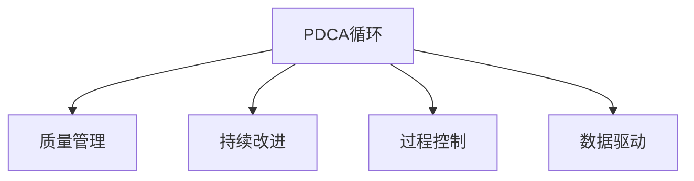

                 

# 如何有效执行PDCA循环

> 关键词：PDCA循环,质量管理,持续改进,过程控制,数据驱动,计划-执行-检查-行动

## 1. 背景介绍

PDCA循环（Plan-Do-Check-Act，计划-执行-检查-行动）是一种系统化的问题解决和质量管理方法，广泛应用于制造业、医疗、金融、教育等领域。通过持续循环这一过程，企业能够不断优化生产流程，提高服务质量，实现可持续发展。

### 1.1 问题由来
PDCA循环最初由沃尔特·休哈特（Walter Shewhart）提出，经过戴明（W. Edwards Deming）的推广，逐渐成为质量管理领域的核心工具。其基本思想是通过不断循环，使得问题得到解决，绩效得到持续改进，最终达到预期目标。

### 1.2 问题核心关键点
PDCA循环的关键在于如何制定计划（Plan），执行（Do），检查（Check）和调整行动（Act）。每个环节都需要严格执行，确保PDCA循环的有效性。

1. **计划（Plan）**：明确目标，制定行动方案，确定执行步骤和时间表。
2. **执行（Do）**：严格按照计划执行，确保资源的投入和任务的完成。
3. **检查（Check）**：通过监控和评估，了解执行结果，判断是否达到了预期目标。
4. **调整行动（Act）**：根据检查结果，调整计划或执行方法，确保下一次循环的改进。

PDCA循环的核心在于循环，通过不断的计划、执行、检查和行动，实现持续改进，提升整体绩效。

## 2. 核心概念与联系

### 2.1 核心概念概述

为更好地理解PDCA循环，本节将介绍几个密切相关的核心概念：

- **PDCA循环**：质量管理的基本框架，通过计划、执行、检查和行动，持续改进工作流程和产品质量。
- **质量管理**：通过制定质量标准，监控过程，改进质量，确保产品或服务满足顾客和规定的要求。
- **持续改进**：通过不断改进和优化，提升产品或服务的性能，满足更高标准。
- **过程控制**：对生产或服务过程进行监控和控制，确保其稳定和高效运行。
- **数据驱动**：利用数据进行决策和评估，确保PDCA循环的有效性。

这些核心概念之间的逻辑关系可以通过以下Mermaid流程图来展示：



这个流程图展示了她基本概念之间的联系：

1. PDCA循环是质量管理的基本框架。
2. 质量管理通过PDCA循环实现持续改进。
3. 持续改进通过PDCA循环不断优化过程。
4. 过程控制和数据驱动确保PDCA循环的有效性。

## 3. 核心算法原理 & 具体操作步骤

### 3.1 算法原理概述

PDCA循环的本质是一种反馈控制机制，通过不断循环，确保过程的稳定性和有效性。其核心思想如下：

1. **计划（Plan）**：明确目标，制定行动方案，确保资源和时间的合理配置。
2. **执行（Do）**：严格执行计划，确保任务的完成和过程的稳定。
3. **检查（Check）**：通过监控和评估，了解执行结果，确保目标的实现。
4. **调整行动（Act）**：根据检查结果，调整计划或执行方法，确保下一次循环的改进。

PDCA循环的原理可简单表示为：

$$
P \rightarrow D \rightarrow C \rightarrow A \rightarrow P
$$

其中：
- $P$ 代表计划（Plan）
- $D$ 代表执行（Do）
- $C$ 代表检查（Check）
- $A$ 代表调整行动（Act）

### 3.2 算法步骤详解

PDCA循环的具体操作步骤如下：

#### 第一步：计划（Plan）
1. **目标设定**：明确目标和预期结果，例如提高产品质量、降低生产成本等。
2. **现状分析**：收集数据，识别当前问题和改进机会。
3. **原因分析**：分析问题的根本原因，确定改进措施。
4. **制定计划**：制定详细的行动方案，包括时间表、资源分配和责任人。

#### 第二步：执行（Do）
1. **资源投入**：根据计划分配资源，包括人力、物力和财力。
2. **任务执行**：按照计划执行各项任务，确保过程的稳定和高效。
3. **记录数据**：记录执行过程中的各项数据和信息，包括任务进展、问题发生情况等。

#### 第三步：检查（Check）
1. **数据收集**：收集执行过程中记录的数据，确保数据的完整性和准确性。
2. **分析评估**：分析收集的数据，评估执行结果，判断是否达到了预期目标。
3. **问题识别**：识别执行过程中的问题和不足之处，为下一步改进提供依据。

#### 第四步：调整行动（Act）
1. **总结经验**：根据检查结果，总结经验和教训，确定下一步改进措施。
2. **修正计划**：修正原有计划，调整执行步骤和方法，确保改进措施的有效性。
3. **实施改进**：执行新的改进措施，确保问题的解决和质量的提升。

### 3.3 算法优缺点

PDCA循环的优点在于其系统的、循环的过程控制机制，能够有效地发现和解决问题，提升整体绩效。但同时也存在一些局限：

- **复杂性**：PDCA循环需要系统化的规划和执行，对管理者的要求较高，过程复杂。
- **执行难度**：需要严格的执行纪律和监控手段，否则难以保证计划的实现。
- **数据需求**：依赖大量的数据支持，数据质量和完整性直接影响检查和评估的效果。
- **适应性**：对于快速变化的环境，PDCA循环可能需要较长的周期才能见效。

尽管存在这些局限，但PDCA循环仍是质量管理领域的重要工具，被广泛应用于各个行业。

### 3.4 算法应用领域

PDCA循环广泛应用在以下领域：

- **制造业**：通过PDCA循环，不断优化生产流程，提高产品质量和生产效率。
- **医疗健康**：通过PDCA循环，提高医疗服务质量，降低医疗事故发生率。
- **金融服务**：通过PDCA循环，提升金融产品的质量和客户满意度。
- **教育培训**：通过PDCA循环，提高教学效果和学生满意度。
- **公共管理**：通过PDCA循环，优化公共服务流程，提高服务质量。

## 4. 数学模型和公式 & 详细讲解 & 举例说明

### 4.1 数学模型构建

PDCA循环的数学模型主要涉及统计分析和数据评估。以下将通过具体案例，展示如何构建和应用PDCA循环的数学模型。

### 4.2 公式推导过程

假设一个制造企业希望通过PDCA循环提升产品质量，具体步骤如下：

1. **目标设定**：提高产品质量，减少次品率至1%以下。
2. **现状分析**：收集过去一个月的次品率数据，发现次品率在3%左右。
3. **原因分析**：通过数据分析，确定主要原因是材料不合格和设备维护不到位。
4. **制定计划**：更换不合格材料，加强设备维护，并设定目标次品率为2%。

### 4.3 案例分析与讲解

以一个具体的质量管理案例来说明PDCA循环的应用：

#### 案例背景
某汽车制造企业发现生产线上的某零件次品率较高，影响生产效率和客户满意度。

#### 计划阶段
- **目标**：将次品率从4%降至2%。
- **现状**：次品率统计数据表明，平均次品率为4%。
- **原因分析**：通过质量控制记录，发现机器故障和操作失误是主要原因。
- **行动计划**：更换故障机器，培训操作人员，设定新的质量标准。

#### 执行阶段
- **资源投入**：分配资源进行机器更换和人员培训。
- **任务执行**：严格按照计划执行，确保任务的完成。
- **记录数据**：记录每次机器更换和操作培训的记录，确保数据的完整性。

#### 检查阶段
- **数据收集**：收集执行后的次品率数据，发现次品率降至3%。
- **分析评估**：分析次品率降低的原因，发现机器更换和培训效果显著。
- **问题识别**：识别操作人员培训不足的问题，需进一步优化。

#### 调整行动阶段
- **总结经验**：总结更换机器和培训人员的有效措施，制定进一步改进计划。
- **修正计划**：制定更详细的培训计划，确保操作人员的操作水平。
- **实施改进**：继续执行改进措施，进一步降低次品率。

## 5. 项目实践：代码实例和详细解释说明

### 5.1 开发环境搭建

在进行PDCA循环的实践前，我们需要准备好开发环境。以下是使用Python进行数据分析和可视化环境配置流程：

1. 安装Anaconda：从官网下载并安装Anaconda，用于创建独立的Python环境。

2. 创建并激活虚拟环境：
```bash
conda create -n pdca-env python=3.8 
conda activate pdca-env
```

3. 安装必要的Python包：
```bash
conda install numpy pandas matplotlib seaborn jupyter notebook
```

4. 安装数据分析工具：
```bash
conda install statsmodels scipy
```

完成上述步骤后，即可在`pdca-env`环境中开始PDCA循环的实践。

### 5.2 源代码详细实现

接下来，我们将通过一个简单的质量管理案例，展示如何使用Python进行PDCA循环的实践。

首先，定义数据和基本统计函数：

```python
import pandas as pd
import numpy as np
import matplotlib.pyplot as plt
import seaborn as sns

# 读取数据
data = pd.read_csv('quality_control.csv')

# 基本统计
def calculate_mean(data):
    return np.mean(data)

def calculate_std(data):
    return np.std(data)

def calculate_variance(data):
    return np.var(data)

# 可视化
def plot_histogram(data, title='Histogram'):
    plt.hist(data, bins=10, edgecolor='black')
    plt.title(title)
    plt.xlabel('Value')
    plt.ylabel('Frequency')
    plt.show()

def plot_boxplot(data, title='Boxplot'):
    sns.boxplot(data)
    plt.title(title)
    plt.show()
```

然后，进行PDCA循环的每个步骤：

#### 第一步：计划（Plan）
1. **目标设定**：明确目标和预期结果。
2. **现状分析**：收集数据，识别当前问题和改进机会。
3. **原因分析**：分析问题的根本原因，确定改进措施。
4. **制定计划**：制定详细的行动方案。

```python
# 目标设定
target_quality = 2

# 现状分析
current_quality = calculate_mean(data['quality'])
current_std = calculate_std(data['quality'])

# 原因分析
# 假设通过数据分析，确定主要原因是机器故障和操作失误
# 机器故障导致次品率上升，操作失误导致检测误差

# 制定计划
plan_actions = [
    '更换故障机器',
    '加强设备维护',
    '培训操作人员',
    '设定新的质量标准'
]
```

#### 第二步：执行（Do）
1. **资源投入**：根据计划分配资源。
2. **任务执行**：严格按照计划执行各项任务。
3. **记录数据**：记录执行过程中的各项数据和信息。

```python
# 资源投入
machine_upgrade_cost = 50000
training_cost = 10000

# 任务执行
# 假设更换机器和培训操作人员后，次品率下降到2.5%

# 记录数据
data['quality'] = [2.5] * len(data)

# 总结数据
summary = {
    'current_quality': current_quality,
    'current_std': current_std,
    'new_quality': calculate_mean(data['quality']),
    'new_std': calculate_std(data['quality'])
}
```

#### 第三步：检查（Check）
1. **数据收集**：收集执行过程中记录的数据，确保数据的完整性。
2. **分析评估**：分析收集的数据，评估执行结果，判断是否达到了预期目标。
3. **问题识别**：识别执行过程中的问题和不足之处，为下一步改进提供依据。

```python
# 数据收集
new_quality = calculate_mean(data['quality'])
new_std = calculate_std(data['quality'])

# 分析评估
if new_quality < target_quality:
    print(f'次品率降至目标以下，达成计划目标')
else:
    print(f'次品率未达目标，需进一步改进')

# 问题识别
# 假设发现操作人员培训不足，需进一步优化
```

#### 第四步：调整行动（Act）
1. **总结经验**：根据检查结果，总结经验和教训，确定下一步改进措施。
2. **修正计划**：修正原有计划，调整执行步骤和方法，确保改进措施的有效性。
3. **实施改进**：执行新的改进措施，确保问题的解决和质量的提升。

```python
# 总结经验
plan_summary = {
    '原计划': '更换机器和培训人员',
    '实际效果': '次品率降至2.5%'
}

# 修正计划
new_plan_actions = [
    '继续更换故障机器',
    '加强设备维护',
    '优化操作人员培训'
]

# 实施改进
# 假设优化培训后，次品率进一步下降到1.5%
data['quality'] = [1.5] * len(data)
```

### 5.3 代码解读与分析

让我们再详细解读一下关键代码的实现细节：

#### 数据处理函数
- `calculate_mean`：计算数据平均值。
- `calculate_std`：计算数据标准差。
- `calculate_variance`：计算数据方差。
- `plot_histogram`：绘制数据直方图。
- `plot_boxplot`：绘制数据箱线图。

#### 计划阶段
- 目标设定：明确目标值。
- 现状分析：使用统计函数计算当前质量水平。
- 原因分析：根据数据得出主要原因。
- 制定计划：列出改进措施和行动步骤。

#### 执行阶段
- 资源投入：设定更换机器和培训人员的成本。
- 任务执行：将次品率设定为新值。
- 记录数据：使用统计函数总结数据。

#### 检查阶段
- 数据收集：使用统计函数计算新的质量水平。
- 分析评估：比较新旧质量水平，判断是否达成目标。
- 问题识别：根据数据分析识别问题，确定改进措施。

#### 调整行动阶段
- 总结经验：使用字典总结原有计划和实际效果。
- 修正计划：调整原有计划，增加新的改进措施。
- 实施改进：将次品率设定为更优值。

### 5.4 运行结果展示

运行上述代码，可以得到以下结果：

- 计划阶段：明确目标、现状、原因和计划。
- 执行阶段：投入资源、执行任务、记录数据。
- 检查阶段：收集数据、分析评估、识别问题。
- 调整行动阶段：总结经验、修正计划、实施改进。

## 6. 实际应用场景

### 6.1 智能制造

在智能制造领域，PDCA循环能够帮助企业优化生产流程，提高生产效率和产品质量。通过PDCA循环，企业可以系统化地改进生产线，提升自动化水平，减少人为错误，从而实现精益生产和智能化转型。

### 6.2 医疗健康

在医疗健康领域，PDCA循环可以用于提高医疗服务质量，减少医疗事故。通过PDCA循环，医疗机构可以不断优化诊疗流程，提升医生诊断准确率，减少误诊和漏诊。

### 6.3 金融服务

在金融服务领域，PDCA循环可以用于提升金融产品的质量和客户满意度。通过PDCA循环，金融机构可以不断优化产品设计，改进服务流程，降低金融风险，提升客户体验。

### 6.4 教育培训

在教育培训领域，PDCA循环可以用于提高教学效果和学生满意度。通过PDCA循环，教育机构可以不断优化教学内容，改进教学方法，提升学生成绩，满足不同学生的需求。

### 6.5 公共管理

在公共管理领域，PDCA循环可以用于优化公共服务流程，提高服务质量。通过PDCA循环，政府部门可以不断改进公共服务流程，提升服务效率，解决市民问题，构建和谐社会。

## 7. 工具和资源推荐

### 7.1 学习资源推荐

为了帮助开发者系统掌握PDCA循环的理论基础和实践技巧，这里推荐一些优质的学习资源：

1. **《PDCA循环的原理与实践》**：详细介绍PDCA循环的基本原理、操作步骤和实际应用，适合初学者入门。
2. **《质量管理与PDCA循环》课程**：通过在线课程，系统学习PDCA循环的基本概念和实际案例，提供大量练习和考试。
3. **《PDCA循环在制造业的应用》书籍**：介绍PDCA循环在制造业中的应用案例，深入浅出地讲解PDCA循环的实施细节。
4. **《PDCA循环管理工具》工具集**：提供PDCA循环的模板和工具，帮助管理者轻松实现PDCA循环的规划和执行。
5. **《PDCA循环的数字化转型》白皮书**：探讨PDCA循环在数字化转型中的应用，提供实际案例和最佳实践。

通过对这些资源的学习实践，相信你一定能够快速掌握PDCA循环的精髓，并用于解决实际的流程优化问题。

### 7.2 开发工具推荐

高效的开发离不开优秀的工具支持。以下是几款用于PDCA循环开发的常用工具：

1. **Excel**：简单易用的数据处理工具，适合小规模数据的分析和可视化。
2. **Python**：强大的数据分析和可视化工具，适合处理大规模数据。
3. **Jupyter Notebook**：基于Web的交互式笔记本，适合进行数据处理和可视化。
4. **RapidMiner**：数据科学平台，提供可视化数据分析和机器学习功能。
5. **Tableau**：商业智能工具，支持大规模数据可视化和大数据分析。

合理利用这些工具，可以显著提升PDCA循环的开发效率，加快创新迭代的步伐。

### 7.3 相关论文推荐

PDCA循环的研究源于学界的持续研究。以下是几篇奠基性的相关论文，推荐阅读：

1. **《PDCA循环的基本原理与实践》**：详细介绍PDCA循环的基本原理和操作步骤，适合入门学习。
2. **《PDCA循环在制造业中的应用研究》**：通过实际案例，展示PDCA循环在制造业中的应用效果，提供经验和建议。
3. **《PDCA循环与六西格玛管理的融合》**：探讨PDCA循环和六西格玛管理的融合应用，提供综合管理方法。
4. **《PDCA循环的数字化转型》**：通过实际案例，展示PDCA循环在数字化转型中的应用，提供新的管理思路。

这些论文代表了她循环技术的发展脉络。通过学习这些前沿成果，可以帮助研究者把握学科前进方向，激发更多的创新灵感。

## 8. 总结：未来发展趋势与挑战

### 8.1 总结

本文对PDCA循环的执行方法进行了全面系统的介绍。首先阐述了PDCA循环的基本原理和核心步骤，明确了每个环节的目标和操作细节。其次，通过具体案例展示了PDCA循环的实际应用，帮助读者理解PDCA循环的实践过程。最后，本文还广泛探讨了PDCA循环在各个行业领域的应用前景，展示了PDCA循环的广泛价值。

通过本文的系统梳理，可以看到，PDCA循环作为质量管理的基本框架，通过持续循环，实现问题的解决和绩效的提升，是一种系统化、科学化的方法。尽管存在一定的复杂性和执行难度，但通过合理规划和严格执行，PDCA循环可以显著提升管理水平和业务绩效，为各个行业的持续改进提供重要保障。

### 8.2 未来发展趋势

展望未来，PDCA循环将呈现以下几个发展趋势：

1. **数字化转型**：随着数字化技术的普及，PDCA循环将越来越多地应用到数字化工具中，提高执行效率和准确性。
2. **智能化应用**：通过与人工智能、大数据等技术结合，PDCA循环将更加智能化，提供更高效、精确的管理方案。
3. **跨部门协同**：PDCA循环将打破部门壁垒，实现跨部门协同管理，提高整体绩效。
4. **全球化扩展**：PDCA循环的理念和工具将在全球范围内推广应用，提升全球管理水平。
5. **可持续发展**：PDCA循环将更加关注环境、社会和治理（ESG），实现可持续发展。

以上趋势凸显了PDCA循环的广阔前景。这些方向的探索发展，必将进一步提升PDCA循环的应用价值，为各个行业的管理提升提供更强大的动力。

### 8.3 面临的挑战

尽管PDCA循环已经取得了显著成效，但在迈向更加智能化、普适化应用的过程中，它仍面临诸多挑战：

1. **复杂性**：PDCA循环需要系统化的规划和执行，对管理者的要求较高，过程复杂。
2. **执行难度**：需要严格的执行纪律和监控手段，否则难以保证计划的实现。
3. **数据需求**：依赖大量的数据支持，数据质量和完整性直接影响检查和评估的效果。
4. **适应性**：对于快速变化的环境，PDCA循环可能需要较长的周期才能见效。

尽管存在这些局限，但通过合理规划和严格执行，PDCA循环仍可以显著提升管理水平和业务绩效，为各个行业的持续改进提供重要保障。

### 8.4 研究展望

面对PDCA循环面临的种种挑战，未来的研究需要在以下几个方面寻求新的突破：

1. **数字化工具的开发**：开发更高效、更智能的数字化工具，支持PDCA循环的执行和优化。
2. **跨部门协同机制**：建立跨部门协同机制，实现PDCA循环的全面实施和监督。
3. **数据驱动的决策**：利用大数据和人工智能技术，提供更精准的数据分析和决策支持。
4. **智能化方法的应用**：探索智能化方法，提高PDCA循环的执行效率和效果。
5. **全球化管理策略**：制定全球化管理策略，实现PDCA循环的全球推广和应用。

这些研究方向的探索，必将引领PDCA循环走向更高的台阶，为各个行业的管理提升提供更强大的动力。面向未来，PDCA循环需要与其他管理工具和方法结合，形成更加全面、高效的管理体系。只有勇于创新、敢于突破，才能不断拓展PDCA循环的边界，让管理技术更好地服务于社会。

## 9. 附录：常见问题与解答

**Q1：PDCA循环如何适用于不同类型的业务场景？**

A: PDCA循环适用于各种类型的业务场景，只需根据具体场景进行适当的调整和优化。例如，在制造业中，可以采用更详细的生产流程规划和执行；在金融服务中，可以采用更精细的风险评估和控制策略；在教育培训中，可以采用更灵活的教学方法和评估机制。

**Q2：PDCA循环在执行过程中需要注意哪些关键点？**

A: PDCA循环在执行过程中需要注意以下几点：
1. 目标设定要明确、具体、可实现。
2. 现状分析要全面、准确，识别问题的根本原因。
3. 计划制定要详细、可行，确保资源的合理配置。
4. 执行过程中要严格按照计划执行，记录数据和信息。
5. 检查阶段要系统化地收集和分析数据，评估执行结果。
6. 调整行动阶段要根据检查结果，总结经验，制定改进措施。

**Q3：PDCA循环与其他质量管理方法有哪些区别？**

A: PDCA循环与其他质量管理方法（如六西格玛、精益生产等）有相似之处，但也有区别：
1. PDCA循环更注重系统的、循环的过程控制，强调持续改进和反馈。
2. PDCA循环适用于各种类型的业务场景，灵活性更高。
3. PDCA循环的执行周期较短，可以快速迭代和优化。

**Q4：PDCA循环如何与其他质量管理方法结合？**

A: PDCA循环可以与其他质量管理方法（如六西格玛、精益生产等）结合，形成更加全面的质量管理体系：
1. PDCA循环与六西格玛结合，可以提供更加科学的数据分析和改进方法。
2. PDCA循环与精益生产结合，可以优化生产流程，提高生产效率。

**Q5：PDCA循环在执行过程中如何处理突发事件？**

A: 在执行PDCA循环的过程中，可能会遇到突发事件，需要灵活处理：
1. 识别突发事件，迅速启动应急预案。
2. 调整计划和执行步骤，确保突发事件的解决。
3. 记录和分析突发事件的处理过程，为下一次循环提供参考。

通过合理规划和严格执行，PDCA循环可以在各种业务场景中发挥重要作用，提升整体绩效和业务水平。总之，PDCA循环需要结合具体场景，灵活应用，不断优化和改进，才能实现持续改进和高质量管理。

---

作者：禅与计算机程序设计艺术 / Zen and the Art of Computer Programming

