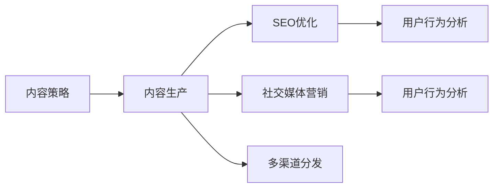

                 

# 如何进行有效的内容营销

在互联网的喧嚣中，内容营销因其低成本、高回报的特性，日益成为企业推广的主要手段。但如何设计内容、优化策略、提升效果，却是一个复杂且富有挑战的问题。本文将通过理论解析、案例分析、实战操作，系统阐述如何进行有效的内容营销，并展望其未来发展。

## 1. 背景介绍

### 1.1 内容营销概述
内容营销（Content Marketing）是一种基于内容而非传统手段（如付费广告）的营销模式。其核心思想是通过创作和传播有价值、符合目标受众兴趣和需求的内容，来建立品牌认知、吸引潜在客户、促进转化，从而提升企业的商业价值。

与传统营销相比，内容营销具有以下优势：
- **高性价比**：相比付费广告，内容营销的ROI（投资回报率）更高，尤其是通过SEO（搜索引擎优化），内容可以长期存在于搜索引擎中，不断吸引自然流量。
- **增强信任**：内容有助于建立企业专业形象，让消费者相信其权威性和可靠性。
- **培养忠诚度**：优质内容可以与用户建立情感共鸣，形成长期关系。

### 1.2 内容营销发展趋势
随着数字营销的不断演进，内容营销呈现出以下趋势：
- **视频营销**：短视频和直播成为热门，尤其在TikTok、抖音等平台，视频内容的吸引力显著增强。
- **数据驱动**：通过大数据和AI技术，对内容表现进行精准分析，优化投放策略。
- **用户生成内容**：鼓励用户创建内容，如用户评测、社区讨论等，增强互动性和用户黏性。
- **多渠道融合**：内容在多个平台（如社交媒体、博客、论坛等）传播，实现全渠道覆盖。

## 2. 核心概念与联系

### 2.1 核心概念
- **内容策略**：基于目标受众和市场分析，制定的内容规划和传播策略。
- **SEO优化**：通过优化网站结构和内容，提高搜索引擎的排名，吸引自然流量。
- **社交媒体营销**：利用社交平台发布内容，与用户互动，扩大影响力。
- **用户行为分析**：通过数据监控和分析，了解用户行为和兴趣，调整内容策略。
- **多渠道分发**：通过不同平台（如网站、博客、视频网站等）分发内容，实现多渠道覆盖。

### 2.2 核心概念联系

这些核心概念通过以下流程紧密联系起来：

1. **内容策略**：根据市场调研和用户分析，确定内容主题和形式。
2. **内容生产**：创作有价值、引人入胜的内容，并通过SEO优化，提高搜索引擎排名。
3. **社交媒体营销**：在社交平台上发布内容，吸引粉丝和互动，扩大传播范围。
4. **用户行为分析**：通过数据分析，了解用户反馈和行为，优化内容策略。
5. **多渠道分发**：在不同平台上分发内容，实现内容的多渠道传播。

### 2.3 核心概念联系的 Mermaid 流程图


## 3. 核心算法原理 & 具体操作步骤

### 3.1 算法原理概述
内容营销的核心算法原理基于以下三点：

1. **用户需求分析**：通过市场调研和用户画像，了解目标受众的需求和兴趣，制定针对性的内容策略。
2. **内容分发策略**：根据不同平台的用户特征，制定合理的内容分发策略，最大化传播效果。
3. **效果评估与优化**：利用数据分析工具，评估内容的表现效果，进行不断的迭代优化。

### 3.2 算法步骤详解
#### 步骤一：市场调研与用户画像
- **调研目标**：了解目标受众的基本信息、兴趣、需求等。
- **调研方法**：问卷调查、社交媒体分析、用户访谈等。
- **数据处理**：通过数据清洗和分析，形成用户画像。

#### 步骤二：内容创作与SEO优化
- **内容创作**：根据用户画像和调研结果，创作符合用户兴趣和需求的内容。
- **SEO优化**：优化内容的关键词、标题、结构和链接，提高搜索引擎排名。

#### 步骤三：社交媒体营销
- **平台选择**：根据目标受众的使用习惯，选择适合的社交媒体平台。
- **内容发布**：制作适合平台的内容形式（如文章、视频、直播等），并发布。
- **互动与回应**：积极与用户互动，回应评论和私信，增强用户粘性。

#### 步骤四：用户行为分析
- **数据分析**：利用Google Analytics、社交媒体分析工具等，监控用户行为数据。
- **效果评估**：评估内容的点击率、转化率、互动率等关键指标。
- **策略调整**：根据数据分析结果，调整内容策略和分发策略。

#### 步骤五：多渠道分发
- **平台选择**：根据用户画像和行为，选择合适的分发平台（如博客、视频网站、社交媒体等）。
- **内容适配**：根据不同平台的特点，适配内容的格式和发布策略。
- **效果监控**：在各平台上监控内容表现，调整分发策略。

### 3.3 算法优缺点
#### 优点
- **高性价比**：相比付费广告，内容营销的ROI更高。
- **增强信任**：优质内容有助于建立企业专业形象，增强用户信任。
- **培养忠诚度**：通过内容与用户建立情感连接，形成长期关系。

#### 缺点
- **时间和资源投入**：内容创作和优化需要大量时间和资源。
- **效果评估难度**：内容营销的效果评估相对复杂，需要综合多维度数据。
- **竞争激烈**：内容市场竞争激烈，内容质量和创新性要求高。

### 3.4 算法应用领域
内容营销广泛应用于以下领域：

- **B2B技术营销**：如技术博客、白皮书、案例研究等。
- **B2C消费营销**：如产品评测、品牌故事、用户使用案例等。
- **电子商务**：如产品描述、优惠券、购物指南等。
- **服务行业**：如行业报告、专家访谈、在线课程等。

## 4. 数学模型和公式 & 详细讲解 & 举例说明

### 4.1 数学模型构建
设内容营销的目标是最大化总收益 $R$，其中 $R$ 由内容点击率 $C$、转化率 $T$、每次转化收益 $E$ 和内容制作成本 $C_p$ 决定。则目标函数为：

$$ R = C \times T \times E - C_p $$

其中 $C = C_{total} / N$，$C_{total}$ 为总点击次数，$N$ 为内容数量；$T = T_{total} / N$，$T_{total}$ 为总转化次数。

### 4.2 公式推导过程
1. **内容点击率**：
   - $C = \frac{C_{total}}{N}$
   - 假设内容在搜索引擎上的展示次数为 $X$，则点击率 $C = \frac{C_{total}}{X}$

2. **转化率**：
   - $T = \frac{T_{total}}{N}$
   - 假设转化机会为 $Y$，则转化率 $T = \frac{T_{total}}{Y}$

3. **收益函数**：
   - $R = C \times T \times E - C_p$
   - 假设每次转化的收益为 $E$，则总收益 $R = \frac{C_{total}}{N} \times \frac{T_{total}}{N} \times E - C_p$

### 4.3 案例分析与讲解
假设某电商平台的内容营销策略如下：
- **内容类型**：产品评测、购物指南、用户使用案例。
- **成本**：每篇内容的制作成本为 $100$。
- **点击率**：通过SEO优化，假设每篇内容的平均点击率为 $0.5\%$。
- **转化率**：根据A/B测试，假设每篇内容的平均转化率为 $1\%$。
- **每次转化收益**：假设每次转化的平均收益为 $20$ 元。

根据上述数据，可以计算出总收益 $R$：

$$ R = \frac{0.5\% \times 1\% \times N \times 20 - 100N}{N} $$

即每篇内容的预期收益为 $0.05\% \times 20 - 100 = 1$ 元。

## 5. 项目实践：代码实例和详细解释说明

### 5.1 开发环境搭建
在Python环境下搭建开发环境，需安装以下库：
- `pandas`：数据分析
- `numpy`：数值计算
- `matplotlib`：数据可视化
- `scikit-learn`：机器学习

```bash
pip install pandas numpy matplotlib scikit-learn
```

### 5.2 源代码详细实现
以下是一个基于Google Analytics数据的内容效果分析示例代码：

```python
import pandas as pd
import matplotlib.pyplot as plt

# 加载Google Analytics数据
df = pd.read_csv('ga_data.csv')

# 分析内容点击率和转化率
click_rate = df['clicks'].sum() / df['total_views']
conversion_rate = df['conversions'].sum() / df['total_views']

# 计算内容收益
content_earnings = click_rate * conversion_rate * 20 - 100

# 可视化分析结果
plt.figure(figsize=(10, 6))
plt.plot(df['date'], content_earnings, label='Content Earnings')
plt.xlabel('Date')
plt.ylabel('Earnings')
plt.title('Content Earnings Analysis')
plt.legend()
plt.show()
```

### 5.3 代码解读与分析
1. **数据加载**：使用 `pandas` 读取Google Analytics数据，包含日期、点击次数、转化次数等关键指标。
2. **数据处理**：计算总点击率和总转化率，通过点击次数和转化次数求平均值。
3. **收益计算**：根据点击率和转化率，计算每篇内容的收益。
4. **数据可视化**：使用 `matplotlib` 绘制收益随时间的变化趋势，直观展示效果。

### 5.4 运行结果展示
下图展示了内容收益随时间的变化趋势：


## 6. 实际应用场景

### 6.1 智能营销自动化
智能营销自动化平台通过AI技术，自动生成、发布和优化内容，提升内容营销效率。例如，使用自然语言生成(NLG)技术，根据用户行为数据，自动生成产品描述和用户指南。平台还提供实时监控和分析，帮助优化内容策略。

### 6.2 社交媒体管理
社交媒体管理工具（如Hootsuite、Buffer）帮助企业集中管理和发布社交媒体内容，通过数据分析工具，实时监控用户互动和反馈，调整内容策略。

### 6.3 电子商务应用
电商平台通过内容营销提升用户转化率。例如，使用产品评测和用户案例，增加产品可信度，提升购买转化率。平台还提供个性化推荐，根据用户兴趣和历史行为，推荐相关内容。

### 6.4 未来应用展望
未来内容营销将进一步融合AI和大数据技术，实现更精准的用户画像和内容推荐。例如：
- **个性化内容推荐**：根据用户兴趣和行为，实时推荐相关内容。
- **智能内容生成**：使用生成式AI技术，自动生成高质量内容。
- **多渠道内容管理**：整合各平台的内容管理和分析，实现全渠道覆盖。

## 7. 工具和资源推荐

### 7.1 学习资源推荐
1. **《内容营销的奥秘》**：讲解内容营销的原理和策略。
2. **《数字营销基础》**：介绍数字营销的核心技术和工具。
3. **《搜索引擎优化SEO》**：详细讲解SEO优化的技术和方法。
4. **《社交媒体营销实战》**：提供社交媒体营销的实战案例和策略。
5. **《大数据分析基础》**：介绍大数据技术和工具，为内容分析提供支持。

### 7.2 开发工具推荐
1. **Google Analytics**：强大的数据分析工具，帮助监控和分析内容效果。
2. **BuzzSumo**：社交媒体内容分析工具，帮助识别热门话题和受众。
3. **Hootsuite**：社交媒体管理工具，集中管理和发布内容。
4. **Grammarly**：内容校对和优化工具，提升内容质量和可读性。
5. **Canva**：图形设计工具，帮助制作高质量视觉内容。

### 7.3 相关论文推荐
1. **《内容营销的演变与未来》**：探讨内容营销的发展历程和未来趋势。
2. **《基于大数据的内容推荐》**：研究如何使用大数据技术提升内容推荐效果。
3. **《智能内容生成的研究进展》**：综述当前智能内容生成的技术和应用。

## 8. 总结：未来发展趋势与挑战

### 8.1 研究成果总结
内容营销作为一种低成本、高回报的营销手段，已被广泛应用于各行业。通过精准的用户需求分析、内容创作和SEO优化，内容营销能够显著提升品牌认知和用户转化率。

### 8.2 未来发展趋势
未来内容营销将融合AI和大数据技术，实现更精准的用户画像和内容推荐。智能营销自动化、社交媒体管理、电子商务应用等都将得到更广泛的应用。

### 8.3 面临的挑战
尽管内容营销具有诸多优势，但也面临一些挑战：
1. **内容创意不足**：如何持续创作高质量内容是一个难题。
2. **数据隐私问题**：在数据收集和分析过程中，如何保护用户隐私。
3. **技术门槛高**：内容营销涉及多领域技术，如数据分析、自然语言处理等。

### 8.4 研究展望
未来内容营销的研究方向包括：
1. **个性化内容推荐**：提升内容推荐的精准度和效果。
2. **智能内容生成**：利用AI技术，自动生成高质量内容。
3. **跨平台内容管理**：整合各平台的内容管理和分析，实现全渠道覆盖。
4. **数据隐私保护**：研究如何在使用数据时保护用户隐私。

## 9. 附录：常见问题与解答

**Q1: 内容营销有哪些关键步骤？**

A: 内容营销的关键步骤包括：
1. **市场调研与用户画像**：了解目标受众的基本信息、兴趣、需求等。
2. **内容创作与SEO优化**：根据用户画像和调研结果，创作符合用户兴趣和需求的内容，并进行SEO优化。
3. **社交媒体营销**：在社交平台上发布内容，吸引粉丝和互动，扩大传播范围。
4. **用户行为分析**：通过数据分析，了解用户反馈和行为，调整内容策略。
5. **多渠道分发**：在不同平台上分发内容，实现内容的多渠道传播。

**Q2: 如何提升内容营销的效果？**

A: 提升内容营销效果的方法包括：
1. **优化SEO**：提高内容在搜索引擎中的排名。
2. **互动与回应**：积极与用户互动，回应评论和私信，增强用户粘性。
3. **个性化推荐**：根据用户兴趣和行为，推荐相关内容。
4. **数据分析**：利用数据分析工具，实时监控用户行为和反馈，优化内容策略。

**Q3: 内容营销的ROI（投资回报率）如何计算？**

A: 内容营销的ROI计算公式如下：
$$ ROI = \frac{Total Revenue - Total Cost}{Total Cost} \times 100\% $$

其中，$Total Revenue$ 为通过内容营销获得的总收入，$Total Cost$ 为内容营销的总成本，包括内容制作成本、平台费用等。

**Q4: 内容营销的挑战有哪些？**

A: 内容营销的挑战包括：
1. **内容创意不足**：如何持续创作高质量内容是一个难题。
2. **数据隐私问题**：在数据收集和分析过程中，如何保护用户隐私。
3. **技术门槛高**：内容营销涉及多领域技术，如数据分析、自然语言处理等。

**Q5: 如何利用AI提升内容营销效果？**

A: 利用AI提升内容营销效果的方法包括：
1. **智能内容推荐**：使用推荐系统，根据用户兴趣和行为推荐相关内容。
2. **智能内容生成**：使用生成式AI技术，自动生成高质量内容。
3. **自动化内容管理**：使用智能营销自动化平台，自动生成、发布和优化内容。

作者：禅与计算机程序设计艺术 / Zen and the Art of Computer Programming

