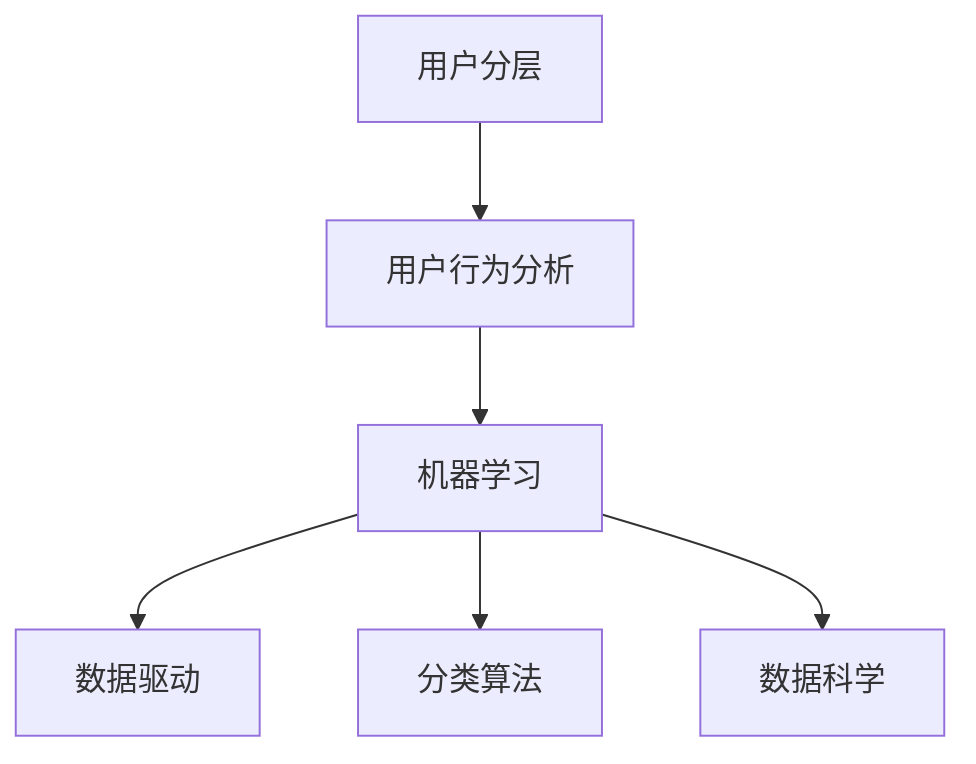

                 

# 如何进行有效的用户分层

> 关键词：用户分层,数据驱动,用户行为分析,机器学习,分类算法,数据科学,市场细分

## 1. 背景介绍

### 1.1 问题由来
在当今数字化时代，企业为了提升用户满意度和销售额，普遍采用“用户分层”策略，即将用户分成不同的群体，并为每个群体提供定制化的产品和服务。这种方法可以大大提升营销的精准度和效果。然而，传统的用户分层方法往往依赖于人工标注和领域专家知识，存在主观性高、成本大、难以扩展等问题。

### 1.2 问题核心关键点
为了解决这些问题，基于机器学习的用户分层方法应运而生。这些方法通过分析用户行为数据，自动识别用户特征和模式，实现客观、高效、自动化的用户分层。

### 1.3 问题研究意义
对企业而言，有效的用户分层能够：
1. 提升用户粘性和忠诚度，增加重复消费率。
2. 精准投放广告和营销，减少无效曝光和广告浪费。
3. 优化产品和服务，提高用户体验和满意度。
4. 发现潜在的市场机会，拓展新的业务增长点。

本文将详细介绍基于机器学习的方法，通过自动化、数据驱动的方式，实现有效的用户分层。

## 2. 核心概念与联系

### 2.1 核心概念概述

为了更好地理解用户分层的核心概念和其内部联系，我们将介绍以下关键概念：

- **用户分层(User Segmentation)**：根据用户特征将用户分为不同的群体，每个群体内具有相似的行为和需求。
- **用户行为分析(User Behavior Analysis)**：通过分析用户在平台上的行为数据，挖掘用户的兴趣和偏好。
- **机器学习(Machine Learning)**：基于数据驱动的方法，训练模型自动分类用户。
- **数据驱动(Data-Driven)**：利用数据自动发现和总结规律，而不是依赖人工直觉和经验。
- **分类算法(Classification Algorithms)**：如K-Means、决策树、随机森林、支持向量机、神经网络等，用于自动区分和分组用户。
- **数据科学(Data Science)**：结合统计学、数据挖掘、机器学习等技术，解决实际问题。

这些概念之间的逻辑关系可以通过以下Mermaid流程图来展示：



这个流程图展示出用户分层的核心流程：首先通过用户行为分析获得用户特征数据，然后应用机器学习算法，采用数据驱动的方式，利用分类算法对用户进行分层。数据科学则是在整个过程中提供数据分析和模型构建的基础支撑。

## 3. 核心算法原理 & 具体操作步骤
### 3.1 算法原理概述

基于机器学习的用户分层方法，本质上是将用户行为数据作为特征输入，训练分类器将用户自动分组。其核心思想是：根据用户行为特征的不同，将用户划分成不同的群体，每个群体内部特征相似，群体之间特征差异显著。

形式化地，假设用户集合为 $U=\{u_1, u_2, ..., u_n\}$，每个用户行为特征可以表示为 $x_i \in \mathcal{X}$。用户分层的过程可以表示为：

$$
\{S_1, S_2, ..., S_k\} = \mathop{\arg\min}_{\{S_i\}} \mathcal{L}(S_i, D)
$$

其中，$\{S_i\}$ 为 $k$ 个不同的用户群体，$D=\{(x_1, y_1), (x_2, y_2), ..., (x_n, y_n)\}$ 为标注好的用户行为数据集，$y_i \in \{1, 2, ..., k\}$ 表示用户 $u_i$ 属于第 $y_i$ 个群体。目标是最小化损失函数 $\mathcal{L}$，使得每个用户被分配到与其特征最接近的群体中。

### 3.2 算法步骤详解

基于机器学习的用户分层一般包括以下几个关键步骤：

**Step 1: 数据准备与特征工程**

- 收集用户行为数据，包括点击、浏览、购买、评分等行为。
- 对原始数据进行清洗和预处理，如去噪、缺失值处理、标准化等。
- 进行特征工程，提取有意义的特征。

**Step 2: 数据探索与可视化**

- 对用户行为数据进行探索性分析，如计算均值、方差、分布等。
- 使用数据可视化工具，如Matplotlib、Seaborn等，展示数据特征和分布。

**Step 3: 模型选择与训练**

- 选择合适的分类算法，如K-Means、决策树、随机森林、支持向量机等。
- 将用户行为数据划分为训练集和验证集，使用训练集对模型进行训练。
- 在验证集上评估模型性能，如准确率、召回率、F1分数等。

**Step 4: 模型调优与优化**

- 根据验证集性能，调整模型参数，如学习率、迭代次数、正则化强度等。
- 尝试不同的模型和算法，选择最优模型。

**Step 5: 用户分层与应用**

- 使用训练好的模型对所有用户进行分组，获得用户分层的群体标签。
- 根据用户分层结果，进行个性化推荐、广告投放、产品优化等应用。

### 3.3 算法优缺点

基于机器学习的用户分层方法具有以下优点：
1. 自动化和客观性强。减少了人工标注和主观判断的误差，提升分层的精度和效率。
2. 可扩展性强。适用于大规模数据和用户群体，能够灵活应对不同的业务场景。
3. 可解释性强。通过特征分析和模型训练，可以揭示用户分层的内在规律。

同时，该方法也存在一定的局限性：
1. 数据质量要求高。用户行为数据需具有较高的完整性和准确性，否则会影响分层结果。
2. 数据维度限制。数据特征数量和类型需适中，避免维度灾难。
3. 特征工程难度大。需要设计有意义的特征，提取高质量的特征信息。
4. 模型选择困难。需选择合适的算法和参数，避免过拟合和欠拟合。

尽管存在这些局限性，但就目前而言，基于机器学习的用户分层方法仍是大数据时代的主流范式。未来相关研究的方向在于如何进一步优化特征工程和模型选择，同时兼顾数据质量和模型可解释性。

### 3.4 算法应用领域

基于机器学习的方法已广泛应用于多个行业和领域，如电商、金融、医疗、媒体等。以下是几个典型的应用场景：

- **电商行业**：电商平台通过分析用户浏览、购买、评价等行为数据，自动将用户分为高价值客户、高潜力客户、低活跃客户等不同群体，以实现个性化推荐和精准营销。
- **金融行业**：金融机构利用用户的投资行为和信用数据，自动分层客户，制定差异化的营销策略和风险控制措施。
- **医疗行业**：医院通过分析患者的健康记录和就诊行为，自动分层患者群体，提供个性化的治疗方案和健康管理服务。
- **媒体行业**：媒体公司利用用户观看、互动、订阅等行为数据，自动将用户分为重度用户、轻度用户、新用户等，实现内容推荐和广告投放优化。

此外，用户分层还被创新性地应用到更多领域中，如智能家居、智慧城市、智能制造等，为行业智能化转型提供了新的技术支撑。

## 4. 数学模型和公式 & 详细讲解 & 举例说明
### 4.1 数学模型构建

以下我们将使用数学语言对基于机器学习用户分层的核心算法进行更加严格的刻画。

记用户集合为 $U=\{u_1, u_2, ..., u_n\}$，每个用户行为特征可以表示为 $x_i \in \mathcal{X}$，其中 $\mathcal{X}$ 为特征空间。用户分层的目标是将用户分为 $k$ 个不同的群体 $S_1, S_2, ..., S_k$，每个群体的特征向量 $c_i$ 满足：

$$
c_i = \mathop{\arg\min}_{c} \sum_{x_j \in S_i} ||x_j - c||^2
$$

其中，$||.||$ 为特征向量到中心的欧几里得距离。目标是最小化所有用户到群体重心的距离总和。

### 4.2 公式推导过程

以下我们以K-Means算法为例，推导用户分层的数学模型。

K-Means算法的目标是最小化所有样本到簇中心的距离平方和：

$$
\mathcal{L} = \sum_{i=1}^n ||x_i - \mu_i||^2
$$

其中，$\mu_i$ 为第 $i$ 个簇的中心。目标是最小化上述损失函数，即：

$$
\mathop{\arg\min}_{\{\mu_i\}} \mathcal{L}
$$

通过梯度下降等优化算法，求解最优的簇中心 $\{\mu_i\}$。具体步骤如下：

1. 随机初始化 $k$ 个簇中心 $\mu_1, \mu_2, ..., \mu_k$。
2. 对每个样本 $x_i$，计算其到每个簇中心的距离，分配到距离最近的簇中。
3. 更新每个簇的中心 $\mu_i$，使其为簇内样本的均值：
   $$
   \mu_i = \frac{1}{|S_i|} \sum_{x_j \in S_i} x_j
   $$
4. 重复步骤2和3，直到簇中心不再发生变化或达到预设的迭代次数。

通过上述过程，K-Means算法将用户分为 $k$ 个不同的群体，每个群体的特征向量 $c_i$ 为簇中心。

### 4.3 案例分析与讲解

以下以电商行业为例，展示如何使用K-Means算法进行用户分层。

假设电商公司收集了用户浏览、购买、评分等行为数据，准备将其用户分为高价值客户、高潜力客户和低活跃客户等不同群体。步骤如下：

1. **数据准备**：收集用户行为数据，并进行清洗和预处理，如去噪、缺失值处理、标准化等。
2. **特征工程**：提取有意义的特征，如浏览时长、购买频次、评分平均值等。
3. **数据探索**：使用Matplotlib、Seaborn等工具，展示特征的分布情况和相关性。
4. **模型选择**：选择K-Means算法，设置簇数为3。
5. **模型训练**：将用户行为数据作为特征输入，使用K-Means算法训练模型，获得最优的簇中心。
6. **用户分层**：对所有用户进行簇分配，获得用户分层的群体标签。
7. **应用优化**：根据用户分层结果，进行个性化推荐、广告投放、产品优化等应用。

在实际应用中，还需根据具体情况进行调整和优化，如调整簇数、尝试不同的特征组合、调整初始簇中心等，以提升分层效果。

## 5. 项目实践：代码实例和详细解释说明
### 5.1 开发环境搭建

在进行用户分层实践前，我们需要准备好开发环境。以下是使用Python进行Scikit-learn开发的Python环境配置流程：

1. 安装Anaconda：从官网下载并安装Anaconda，用于创建独立的Python环境。

2. 创建并激活虚拟环境：
```bash
conda create -n sklearn-env python=3.8 
conda activate sklearn-env
```

3. 安装Scikit-learn：
```bash
pip install scikit-learn
```

4. 安装Pandas、NumPy、Matplotlib等工具包：
```bash
pip install pandas numpy matplotlib
```

完成上述步骤后，即可在`sklearn-env`环境中开始用户分层实践。

### 5.2 源代码详细实现

我们以K-Means算法为例，给出使用Scikit-learn库对用户行为数据进行分层的Python代码实现。

```python
from sklearn.cluster import KMeans
from sklearn.datasets import make_blobs
import numpy as np
import pandas as pd
import matplotlib.pyplot as plt

# 生成随机数据
X, y = make_blobs(n_samples=100, n_features=2, centers=3, cluster_std=0.5, random_state=0)

# 使用K-Means进行用户分层
kmeans = KMeans(n_clusters=3, random_state=0)
kmeans.fit(X)

# 可视化用户分层结果
plt.scatter(X[:, 0], X[:, 1], c=kmeans.labels_)
plt.show()
```

以上代码展示了使用Scikit-learn库的K-Means算法进行用户分层的完整代码实现。可以看到，使用Scikit-learn库进行用户分层非常简洁高效，开发者可以将更多精力放在数据处理和模型优化上。

### 5.3 代码解读与分析

让我们再详细解读一下关键代码的实现细节：

**数据生成**：
- `make_blobs`函数生成随机数据集，包含3个簇，每个簇100个样本，每个样本2个特征。

**K-Means训练**：
- `KMeans`类设置簇数为3，使用`fit`方法对数据进行训练。

**可视化展示**：
- `scatter`方法将数据点可视化，根据K-Means分层的簇标签进行颜色编码。

可以看到，使用Scikit-learn库可以轻松实现用户分层，且代码简洁易懂。同时，Scikit-learn库提供了丰富的机器学习算法和工具，方便进行模型选择和优化。

当然，工业级的系统实现还需考虑更多因素，如模型的保存和部署、超参数的自动搜索、更灵活的任务适配层等。但核心的用户分层范式基本与此类似。

## 6. 实际应用场景
### 6.1 电商行业

电商行业通过用户分层实现个性化推荐和精准营销，提升用户体验和销售额。用户行为数据包括浏览记录、购买历史、评分反馈等。通过K-Means等算法，自动将用户分为高价值客户、高潜力客户和低活跃客户，从而进行有针对性的推荐和营销。

具体应用场景包括：
- 个性化推荐：根据用户历史行为，推荐相关商品，提升点击率和转化率。
- 精准营销：对不同客户群体进行差异化营销，提升广告投放效果和ROI。
- 客户管理：根据用户分层结果，制定不同客户群体的新用户获取策略和流失干预措施。

### 6.2 金融行业

金融行业利用用户行为数据进行风险评估和客户管理。用户行为数据包括投资记录、交易历史、信用评分等。通过K-Means等算法，自动将客户分为高风险客户、中风险客户和低风险客户，从而制定不同的风险控制策略和客户服务方案。

具体应用场景包括：
- 风险评估：对不同客户群体进行风险评估，制定差异化的贷款和投资策略。
- 客户管理：根据用户分层结果，进行差异化的客户服务和流失干预措施。
- 反欺诈检测：通过用户行为数据分析，识别异常交易和欺诈行为。

### 6.3 医疗行业

医疗行业通过用户行为数据进行健康管理和治疗方案推荐。用户行为数据包括健康记录、就诊历史、药物使用等。通过K-Means等算法，自动将患者分为慢性病高风险患者、亚健康人群和健康人群，从而进行有针对性的健康管理和治疗方案推荐。

具体应用场景包括：
- 健康管理：根据患者分层结果，制定个性化的健康管理方案，提升患者健康水平。
- 治疗方案推荐：根据患者分层结果，推荐合适的治疗方案，提高治疗效果。
- 患者随访：对不同患者群体进行差异化的随访和干预措施，提升患者满意度和遵医行为。

### 6.4 未来应用展望

随着数据量和计算能力的不断提升，基于机器学习的用户分层方法将不断成熟和扩展。未来可能的方向包括：

1. **多模态数据融合**：结合用户的多模态数据，如行为数据、社交数据、语音数据等，进行更全面和深入的用户分层。
2. **实时动态调整**：基于用户的实时行为数据，进行动态调整和分层，提升分层的精度和时效性。
3. **跨领域应用**：将用户分层方法应用于更多行业和领域，提升不同场景下的用户体验和业务效果。
4. **联邦学习**：通过分布式计算和数据隐私保护技术，进行跨企业、跨平台的用户分层，提升数据的共享和利用效率。
5. **因果推理**：结合因果推理方法，提升用户分层的解释性和可信度，揭示用户行为背后的因果关系。

这些方向的探索发展，将使得用户分层方法更加高效、智能和普适，推动人工智能技术在各行业的应用和落地。

## 7. 工具和资源推荐
### 7.1 学习资源推荐

为了帮助开发者系统掌握用户分层的理论基础和实践技巧，这里推荐一些优质的学习资源：

1. **《Python机器学习》**：适合初学者学习，介绍了机器学习的基本概念和常用算法。
2. **《数据科学实战》**：详细介绍了数据驱动的方法论和常用工具，涵盖数据清洗、特征工程、模型选择等环节。
3. **Coursera《机器学习》课程**：由斯坦福大学Andrew Ng教授主讲的经典课程，涵盖机器学习的核心算法和应用。
4. **Kaggle**：数据科学竞赛平台，提供大量真实业务数据和案例，实践用户分层的技术。
5. **Scikit-learn官方文档**：详细介绍了Scikit-learn库的使用方法和常用算法，是用户分层的实战指南。

通过对这些资源的学习实践，相信你一定能够快速掌握用户分层的精髓，并用于解决实际的业务问题。

### 7.2 开发工具推荐

高效的开发离不开优秀的工具支持。以下是几款用于用户分层开发的常用工具：

1. **Jupyter Notebook**：免费且易用的交互式编程环境，支持多种语言，适合快速迭代和实验。
2. **Scikit-learn**：Python数据挖掘和机器学习库，提供丰富的算法和工具，方便进行用户分层。
3. **Matplotlib**和**Seaborn**：数据可视化工具，方便展示用户行为数据的分布和特征。
4. **TensorFlow**和**PyTorch**：深度学习框架，适用于大规模用户分层数据的处理和分析。
5. **WeChat Work**和**DingTalk**：企业协作工具，方便进行用户行为数据的收集和分析。

合理利用这些工具，可以显著提升用户分层的开发效率，加快创新迭代的步伐。

### 7.3 相关论文推荐

用户分层的相关研究始于20世纪80年代，近年来随着数据科学和机器学习的发展，取得了长足进步。以下是几篇奠基性的相关论文，推荐阅读：

1. **《聚类分析：一种新的数据分析方法》**：经典的聚类分析教材，介绍K-Means算法和其应用。
2. **《基于机器学习的用户分层方法》**：综述文章，总结了机器学习在用户分层中的各类方法和应用。
3. **《分布式聚类算法》**：研究分布式计算下的聚类算法，提升用户分层的效率和可扩展性。
4. **《多模态数据聚类》**：探索结合多模态数据的用户分层方法，提升分层的全面性和准确性。
5. **《因果推理在用户分层中的应用》**：探索因果推理方法在用户分层中的应用，提升分层的解释性和可信度。

这些论文代表了大数据时代用户分层的最新进展，通过学习这些前沿成果，可以帮助研究者把握学科前进方向，激发更多的创新灵感。

## 8. 总结：未来发展趋势与挑战
### 8.1 总结

本文对基于机器学习的用户分层方法进行了全面系统的介绍。首先阐述了用户分层的背景和意义，明确了机器学习在用户分层中的作用。其次，从原理到实践，详细讲解了用户分层的数学模型和操作步骤，给出了完整的代码实例。同时，本文还广泛探讨了用户分层方法在电商、金融、医疗等多个行业领域的应用前景，展示了用户分层范式的巨大潜力。此外，本文精选了用户分层的各类学习资源，力求为读者提供全方位的技术指引。

通过本文的系统梳理，可以看到，基于机器学习的方法在大数据时代成为用户分层的核心范式，极大地提升了分层的精度和效率。未来，伴随技术不断进步，用户分层方法将在更多行业得到应用，为智能化转型提供新的技术支撑。

### 8.2 未来发展趋势

展望未来，用户分层技术将呈现以下几个发展趋势：

1. **自动化程度提升**：随着自动化工具和算法的不断完善，用户分层将变得更加自动化和智能化。
2. **数据融合与应用**：结合多模态数据，提升用户分层的全面性和准确性。
3. **实时动态调整**：基于用户的实时行为数据，进行动态调整和分层，提升分层的时效性和精度。
4. **跨领域应用扩展**：将用户分层方法应用于更多行业和领域，提升不同场景下的用户体验和业务效果。
5. **隐私保护与数据安全**：结合数据隐私保护技术，进行跨企业、跨平台的用户分层，提升数据的共享和利用效率。

这些趋势将使得用户分层方法更加高效、智能和普适，推动人工智能技术在各行业的应用和落地。

### 8.3 面临的挑战

尽管用户分层技术已经取得了瞩目成就，但在迈向更加智能化、普适化应用的过程中，它仍面临着诸多挑战：

1. **数据质量与完整性**：用户行为数据需具有较高的完整性和准确性，否则会影响分层结果。
2. **特征工程复杂度**：需要设计有意义的特征，提取高质量的特征信息，避免维度灾难。
3. **模型选择与优化**：需选择合适的算法和参数，避免过拟合和欠拟合，提升模型的泛化能力。
4. **隐私保护与数据安全**：需要确保用户数据的隐私和安全，避免数据泄露和滥用。
5. **计算资源需求高**：用户分层需要处理大规模数据，对计算资源需求较高。

尽管存在这些挑战，但用户分层技术的前景仍然广阔。未来需不断优化数据质量、提升特征工程能力、优化模型选择，同时注重隐私保护和数据安全，才能真正实现用户分层的智能化和普适化。

### 8.4 研究展望

未来研究应关注以下几个方向：

1. **自适应学习与实时调整**：结合强化学习和在线学习技术，实现用户分层的动态调整和优化。
2. **因果推理与可解释性**：结合因果推理方法，提升用户分层的解释性和可信度，揭示用户行为背后的因果关系。
3. **多模态数据融合**：结合多模态数据，提升用户分层的全面性和准确性，增强分层的鲁棒性。
4. **联邦学习与跨平台协作**：结合联邦学习技术，进行跨企业、跨平台的用户分层，提升数据的共享和利用效率。
5. **个性化推荐与精准营销**：结合个性化推荐和精准营销技术，提升用户体验和业务效果，实现用户分层与业务目标的紧密结合。

这些方向的研究将进一步推动用户分层技术的发展，提升其在各行业的应用效果，推动人工智能技术的智能化转型。

## 9. 附录：常见问题与解答

**Q1：用户分层需要多少数据？**

A: 用户分层的数据需求取决于分层的精度和业务目标。通常情况下，需要至少几千个样本进行训练和验证，以保证分层的准确性。在电商、金融等业务场景中，数据量可能需要在几万到几十万个不等。

**Q2：用户分层的特征工程有哪些关键步骤？**

A: 用户分层的特征工程包括以下关键步骤：
1. 数据清洗与预处理：去除噪声、处理缺失值、标准化等。
2. 特征提取与选择：提取有意义的特征，如浏览时长、购买频次、评分平均值等。
3. 特征变换与降维：进行特征变换，如PCA降维、特征归一化等。
4. 特征组合与特征交叉：组合特征、构造特征交叉等，提升特征的表达能力。

**Q3：用户分层算法有哪些常见问题？**

A: 用户分层算法常见的有以下问题：
1. 过拟合与欠拟合：需选择合适的模型和参数，避免过拟合和欠拟合。
2. 簇数选择问题：需选择合适的簇数，避免簇数过多或过少。
3. 数据分布不均：需处理不同簇内样本数量差异较大的情况。
4. 实时性问题：需优化算法，提升分层的实时性和效率。

**Q4：用户分层的算法有哪些？**

A: 用户分层的算法有以下几种：
1. K-Means：经典的聚类算法，适用于简单分布的数据。
2. 层次聚类：通过构建树形结构进行聚类，适用于复杂分布的数据。
3. DBSCAN：基于密度的聚类算法，适用于处理异常值和噪声数据。
4. 谱聚类：通过谱分解进行聚类，适用于高维数据的聚类。
5. 核聚类：通过核函数进行聚类，适用于非线性数据的聚类。

**Q5：用户分层后如何进行应用优化？**

A: 用户分层后，可以进行以下应用优化：
1. 个性化推荐：根据用户分层结果，推荐相关商品或内容，提升用户体验。
2. 精准营销：对不同客户群体进行差异化营销，提升广告投放效果和ROI。
3. 客户管理：根据用户分层结果，制定不同客户群体的新用户获取策略和流失干预措施。

总之，用户分层需要开发者根据具体业务场景，不断迭代和优化模型、数据和算法，方能得到理想的效果。

---

作者：禅与计算机程序设计艺术 / Zen and the Art of Computer Programming

