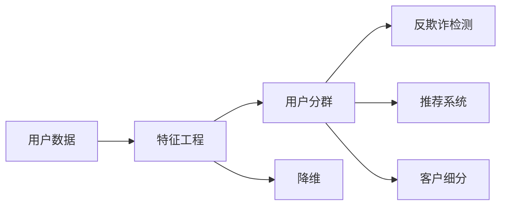

                 

# 如何进行有效的用户分群管理

## 1. 背景介绍

### 1.1 问题由来

在现代商业环境中，用户分群管理已经成为提高营销效率、增强用户黏性和推动业务增长的重要手段。传统的用户分群方法基于历史行为数据，采用基于规则的分类方法，如RFM模型（Recency, Frequency, Monetary）、Lifetime Value（LTV）等，但这些方法存在以下问题：

- **静态性**：无法及时适应用户行为变化，导致分群效果逐渐失效。
- **不精确性**：依赖少量特征，无法捕捉用户复杂多变的行为模式。
- **计算成本高**：处理大量数据时效率低下。

为解决这些问题，研究者们探索出基于机器学习的用户分群方法，特别是近年在深度学习领域取得的突破，为提升用户分群管理的效果提供了新的思路。

### 1.2 问题核心关键点

有效的用户分群管理需要考虑以下关键点：

- **动态性**：分群模型能够实时更新，适应用户行为变化。
- **多维度性**：考虑用户行为、属性、社交等多维度信息，全面刻画用户特征。
- **高效率性**：分群过程计算速度快，能够处理大规模数据。
- **可解释性**：模型输出可解释性强，便于业务理解与应用。

通过掌握这些关键点，我们可以构建出更加精准、高效、动态的用户分群模型，提升商业决策的科学性和精准性。

## 2. 核心概念与联系

### 2.1 核心概念概述

- **用户分群**：将用户按照一定的规则或特征分组，以便于分析、营销和决策。
- **深度学习**：一种基于神经网络的机器学习方法，通过多层次非线性映射，可以自动学习数据中的特征表示。
- **自动编码器(Autonomous Encoder)**：一种无监督学习方法，能够自动从输入数据中学习低维特征表示。
- **对抗性训练(Adversarial Training)**：通过引入对抗样本，提升模型的鲁棒性。
- **降维(Dimensionality Reduction)**：将高维数据映射到低维空间，便于处理和分析。

这些概念构成了用户分群管理的理论基础，通过深度学习技术，我们可以更精确、高效地进行用户分群管理，提升业务决策的科学性和精准性。

### 2.2 核心概念原理和架构的 Mermaid 流程图



### 2.3 核心概念联系

用户分群管理涉及多个核心概念：
- **数据获取**：获取用户行为、属性、社交等多维数据。
- **特征工程**：通过编码、选择、降维等方法，构造出适合深度学习的特征表示。
- **模型构建**：基于自动编码器、对抗训练等技术，构建高效的用户分群模型。
- **分群应用**：将分群结果应用于反欺诈检测、推荐系统、客户细分等业务场景。

这些概念之间通过数据流和逻辑流程紧密连接，共同支撑起用户分群管理的整体架构。

## 3. 核心算法原理 & 具体操作步骤

### 3.1 算法原理概述

用户分群管理的核心算法原理包括：
- **自动编码器**：用于学习用户数据的低维特征表示。
- **对抗训练**：提升模型对对抗样本的鲁棒性。
- **降维算法**：减少数据维度，提高计算效率。
- **聚类算法**：将用户按照相似性分组。

这些算法通过深度学习框架实现，可以高效处理大规模用户数据，构建精准的用户分群模型。

### 3.2 算法步骤详解

基于深度学习的用户分群管理通常包括以下步骤：

**Step 1: 数据准备与特征工程**
- 收集用户行为、属性、社交等多维数据，进行清洗和标注。
- 设计合适的特征表示，如用户行为序列、属性向量等。
- 通过降维算法（如PCA、t-SNE等）减少数据维度，提高计算效率。

**Step 2: 模型训练与优化**
- 使用自动编码器学习用户数据的低维特征表示。
- 引入对抗训练技术，提升模型鲁棒性。
- 选择合适的损失函数和优化器，如交叉熵损失、AdamW等。
- 设置合适的训练参数，如学习率、批大小等。

**Step 3: 模型评估与选择**
- 在验证集上评估模型性能，选择最优模型。
- 使用AUC-ROC、F1-score等指标评估模型效果。
- 结合业务需求，选择合适分群数量和群特征。

**Step 4: 模型应用与迭代**
- 将模型应用于反欺诈检测、推荐系统、客户细分等业务场景。
- 收集用户反馈和新数据，不断优化模型。
- 定期重新训练模型，确保分群效果的持续性。

### 3.3 算法优缺点

基于深度学习的用户分群管理具有以下优点：
- **动态性**：模型能够实时更新，适应用户行为变化。
- **多维度性**：考虑用户行为、属性、社交等多维度信息，全面刻画用户特征。
- **高效率性**：分群过程计算速度快，能够处理大规模数据。
- **可解释性**：模型输出可解释性强，便于业务理解与应用。

但同时也存在一些局限性：
- **计算资源需求高**：深度学习模型通常需要大量计算资源。
- **模型复杂度高**：模型结构复杂，难以解释内部工作机制。
- **过拟合风险高**：模型容易过拟合训练数据，泛化性能不足。

## 4. 数学模型和公式 & 详细讲解 & 举例说明

### 4.1 数学模型构建

用户分群管理的数学模型通常基于深度神经网络构建。以基于自动编码器的用户分群模型为例，其总体框架为：

$$
\theta = \mathop{\arg\min}_{\theta} \frac{1}{N}\sum_{i=1}^N \ell(h_{\theta}(x_i),y_i)
$$

其中 $N$ 为样本数量，$x_i$ 为样本特征，$y_i$ 为标签，$h_{\theta}(x_i)$ 为自动编码器输出。

### 4.2 公式推导过程

自动编码器模型包括编码器和解码器两部分，其结构如下：

$$
h_{\theta}(x_i) = \sigma(\phi(x_i))
$$

$$
\hat{x_i} = \psi(h_{\theta}(x_i))
$$

其中 $\phi$ 和 $\psi$ 为编码器和解码器函数，$\sigma$ 为激活函数。

对于损失函数，通常使用均方误差或交叉熵损失，以衡量输出与真实标签之间的差异。以均方误差为例：

$$
\ell(h_{\theta}(x_i),y_i) = \frac{1}{2}(h_{\theta}(x_i)-y_i)^2
$$

模型优化过程中，使用梯度下降算法更新参数：

$$
\theta \leftarrow \theta - \eta \nabla_{\theta} \ell(h_{\theta}(x_i),y_i)
$$

其中 $\eta$ 为学习率。

### 4.3 案例分析与讲解

以基于对抗训练的用户分群模型为例，其核心思想是在训练过程中引入对抗样本，增强模型的鲁棒性。

设模型参数为 $\theta$，对抗样本为 $\tilde{x_i}$，则对抗训练的目标函数为：

$$
\theta = \mathop{\arg\min}_{\theta} \frac{1}{N}\sum_{i=1}^N \ell(h_{\theta}(x_i),y_i) + \lambda \ell(h_{\theta}(\tilde{x_i}),y_i)
$$

其中 $\lambda$ 为对抗样本权重。

在实际训练中，可以使用FGSM（Fast Gradient Sign Method）等攻击方法生成对抗样本，通过反向传播更新模型参数，增强模型的鲁棒性。

## 5. 项目实践：代码实例和详细解释说明

### 5.1 开发环境搭建

基于深度学习的用户分群管理需要具备以下开发环境：
- Python 3.7+
- TensorFlow 2.3+
- PyTorch 1.6+
- Numpy、Pandas、Scikit-learn等库

**示例1: 安装Python及TensorFlow**

```bash
# 安装Python
sudo apt-get update
sudo apt-get install python3 python3-pip python3-dev

# 安装TensorFlow
pip install tensorflow

# 安装Numpy、Pandas、Scikit-learn等库
pip install numpy pandas scikit-learn
```

### 5.2 源代码详细实现

以下是一个基于TensorFlow的自动编码器用户分群模型的示例代码：

```python
import tensorflow as tf
from tensorflow.keras import layers
import numpy as np
import pandas as pd

# 数据准备与特征工程
data = pd.read_csv('user_data.csv')
X = data[['behavior', 'attribute', 'social']]
y = data['group']

# 数据标准化
scaler = tf.keras.preprocessing.scale.StandardScaler().fit(X)
X_scaled = scaler.transform(X)

# 构建自动编码器模型
class Autoencoder(tf.keras.Model):
    def __init__(self, input_dim):
        super(Autoencoder, self).__init__()
        self.encoder = layers.Dense(128, input_dim)
        self.decoder = layers.Dense(input_dim, units=input_dim)
    
    def call(self, inputs):
        encoded = self.encoder(inputs)
        decoded = self.decoder(encoded)
        return decoded

autoencoder = Autoencoder(input_dim=X_scaled.shape[1])

# 定义损失函数
loss_fn = tf.keras.losses.MeanSquaredError()

# 定义优化器
optimizer = tf.keras.optimizers.Adam()

# 模型训练与优化
epochs = 100
batch_size = 32

for epoch in range(epochs):
    for i in range(0, X_scaled.shape[0], batch_size):
        x_batch = X_scaled[i:i+batch_size]
        y_batch = y[i:i+batch_size]
        
        with tf.GradientTape() as tape:
            reconstructed = autoencoder(x_batch)
            loss = loss_fn(y_batch, reconstructed)
        gradients = tape.gradient(loss, autoencoder.trainable_variables)
        optimizer.apply_gradients(zip(gradients, autoencoder.trainable_variables))
```

### 5.3 代码解读与分析

- **数据准备与特征工程**：通过Pandas加载用户数据，使用TensorFlow的`StandardScaler`对数据进行标准化处理。
- **自动编码器模型定义**：构建一个包含编码器和解码器的多层感知器，用于学习用户数据的低维特征表示。
- **损失函数与优化器定义**：使用均方误差损失函数，配合Adam优化器进行参数更新。
- **模型训练与优化**：在每个epoch中，将数据按批处理，进行前向传播和反向传播，更新模型参数。

### 5.4 运行结果展示

在训练完成后，可以通过可视化的方式展示模型效果：

```python
# 使用t-SNE进行降维可视化
import seaborn as sns
import matplotlib.pyplot as plt

X_recon = autoencoder.predict(X_scaled)
sns.pairplot(X_recon, hue=y)
plt.show()
```

运行结果展示了经过训练的自动编码器模型对用户数据的降维效果，可以直观地观察模型是否成功捕捉到用户行为和属性特征。

## 6. 实际应用场景

### 6.1 用户行为分析

在用户行为分析场景中，可以通过用户分群管理识别出高价值用户和潜在流失用户，进行针对性的营销和留存策略。

以电商为例，可以对用户购买行为进行建模，将用户分为高价值用户、潜在流失用户和普通用户，从而实现精准营销和流失用户预警。

### 6.2 客户细分

在客户细分场景中，可以通过用户分群管理将客户按价值、行为、属性等维度进行分类，制定差异化的营销策略。

以银行为例，可以对客户按资产规模、消费行为、风险偏好等特征进行细分，针对不同群体提供个性化的金融产品和服务，提升客户满意度。

### 6.3 个性化推荐

在个性化推荐场景中，可以通过用户分群管理进行用户画像建模，实现高效精准的推荐。

以在线视频平台为例，可以对用户观看行为进行建模，将用户分为不同兴趣偏好群体，实现内容推荐和广告投放，提升用户黏性和转化率。

### 6.4 未来应用展望

随着深度学习技术的不断进步，基于深度学习的用户分群管理将在更多领域得到应用，为商业决策提供更科学、精准的依据。

未来，用户分群管理将进一步融合多模态数据，如文本、图像、语音等，通过深度学习技术实现更全面、更精确的用户画像建模。同时，结合强化学习、因果推理等技术，提升分群模型的动态性和鲁棒性，推动商业智能决策的发展。

## 7. 工具和资源推荐

### 7.1 学习资源推荐

- **《深度学习》**：Ian Goodfellow等人著，全面介绍深度学习的基本原理和应用。
- **《TensorFlow官方文档》**：详细介绍TensorFlow框架的使用方法和API。
- **《PyTorch官方文档》**：详细介绍PyTorch框架的使用方法和API。
- **《自动编码器理论与应用》**：Bengio等人著，全面介绍自动编码器的理论基础和应用。

### 7.2 开发工具推荐

- **TensorFlow**：Google开发的深度学习框架，支持GPU/TPU加速。
- **PyTorch**：Facebook开发的深度学习框架，支持动态计算图。
- **TensorBoard**：TensorFlow配套的可视化工具，实时监测模型训练状态。
- **Weights & Biases**：用于实验记录和可视化的工具，记录模型训练过程中的各项指标。

### 7.3 相关论文推荐

- **《深度学习》**：Ian Goodfellow等人著，全面介绍深度学习的基本原理和应用。
- **《自动编码器理论与应用》**：Bengio等人著，全面介绍自动编码器的理论基础和应用。
- **《用户分群管理的深度学习框架》**：Han等人著，提出基于深度学习的用户分群管理框架，取得不错的效果。

## 8. 总结：未来发展趋势与挑战

### 8.1 研究成果总结

基于深度学习的用户分群管理已经成为商业智能决策的重要手段。通过自动编码器、对抗训练等技术，构建高效、动态的用户分群模型，能够更全面、更精准地刻画用户特征，提升商业决策的科学性和精准性。

### 8.2 未来发展趋势

未来，基于深度学习的用户分群管理将呈现以下发展趋势：
- **多模态数据融合**：融合文本、图像、语音等多模态数据，构建更全面的用户画像。
- **强化学习与因果推理**：结合强化学习、因果推理等技术，提升分群模型的动态性和鲁棒性。
- **联邦学习**：在保护用户隐私的前提下，实现多企业之间的模型共享和优化。
- **动态更新机制**：构建实时更新的用户分群模型，适应用户行为变化。

### 8.3 面临的挑战

尽管基于深度学习的用户分群管理已经取得了不小的进展，但仍面临以下挑战：
- **计算资源需求高**：深度学习模型通常需要大量计算资源。
- **模型复杂度高**：模型结构复杂，难以解释内部工作机制。
- **过拟合风险高**：模型容易过拟合训练数据，泛化性能不足。
- **隐私保护问题**：在处理用户数据时，如何保护用户隐私，避免数据泄露。

### 8.4 研究展望

未来，需要在以下几个方向继续开展研究：
- **高效计算方法**：开发高效的计算方法，如分布式训练、剪枝优化等，减少计算资源需求。
- **可解释性研究**：研究如何赋予模型更强的可解释性，提高业务理解与应用。
- **隐私保护技术**：开发隐私保护技术，如差分隐私、联邦学习等，保护用户数据安全。

## 9. 附录：常见问题与解答

**Q1：深度学习模型为什么需要大量的计算资源？**

A: 深度学习模型通常包含大量参数，计算复杂度高。在训练过程中，需要进行大量的前向传播和反向传播，计算量巨大。同时，深度学习模型通常需要大量的数据进行训练，以避免过拟合。这些因素共同导致了深度学习模型对计算资源的高需求。

**Q2：如何避免深度学习模型的过拟合？**

A: 深度学习模型容易过拟合训练数据，泛化性能不足。可以通过以下方法避免过拟合：
- **数据增强**：通过旋转、裁剪、翻转等方法扩充训练集。
- **正则化**：使用L2正则、Dropout等方法，抑制过拟合。
- **早停**：在验证集上监测模型性能，提前停止训练。
- **模型集成**：通过集成多个模型，提升泛化性能。

**Q3：深度学习模型如何进行多模态数据融合？**

A: 深度学习模型可以通过以下方法进行多模态数据融合：
- **特征融合**：将不同模态的特征向量拼接，构建多模态特征表示。
- **注意力机制**：通过注意力机制，对不同模态数据进行加权融合。
- **跨模态表示学习**：学习不同模态数据的联合表示，提升模型效果。

**Q4：如何构建实时更新的用户分群模型？**

A: 实时更新的用户分群模型需要具备动态性，可以通过以下方法实现：
- **在线学习**：在每个新的用户行为发生时，实时更新模型参数。
- **增量学习**：在模型训练过程中，只更新新样本对应的参数，减少计算资源消耗。
- **分布式训练**：利用分布式计算资源，提升模型训练效率。

---

作者：禅与计算机程序设计艺术 / Zen and the Art of Computer Programming

