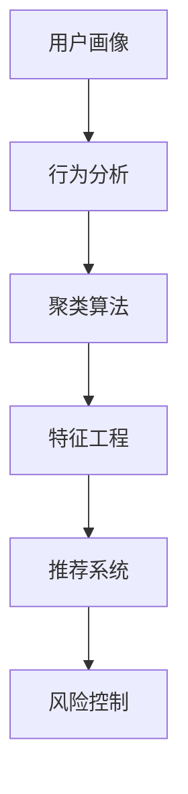

                 

# 如何进行有效的用户分群管理

> 关键词：用户分群, 数据分析, 用户画像, 行为分析, 聚类算法, 特征工程, 推荐系统, 风险控制

## 1. 背景介绍

在当今数字化时代，企业不仅关注产品的研发和销售，更注重对用户的理解和运营。通过有效的用户分群管理，企业可以更精准地定位用户需求，提供个性化的产品和服务，从而提升用户体验和忠诚度，增加收益。用户分群指的是将用户按照特定的特征进行分组，形成具有相似属性的用户群体。分群管理的目的是识别不同用户群体的需求、行为和特征，以便企业能够针对性地设计产品和营销策略。

### 1.1 用户分群的重要性

用户分群在企业管理中具有重要的战略意义，主要体现在以下几个方面：

- **精准营销**：通过对用户的特征和行为进行分析，企业能够更加精准地进行广告投放和推广，提升广告效率和ROI。
- **个性化服务**：基于用户分群的结果，企业可以提供更符合用户需求的个性化产品和服务，提升用户满意度和留存率。
- **风险控制**：通过分析高风险用户群体，企业能够提前采取措施，降低违约、流失等风险，保障业务稳定。
- **运营优化**：用户分群能够帮助企业优化运营策略，如产品定位、服务流程等，提升整体运营效率。

### 1.2 用户分群的主要挑战

尽管用户分群具有重要意义，但在实际操作中，企业也面临诸多挑战：

- **数据复杂性**：用户数据来源广泛，包括点击行为、购买记录、社交互动等，数据量巨大且质量参差不齐。
- **用户行为的多样性**：用户的行为模式和偏好千差万别，难以通过单一特征进行有效分群。
- **分群的准确性**：分群结果的准确性直接影响后续分析和决策，如何确保分群结果的可靠性和可解释性是关键问题。
- **模型选择与优化**：选择适当的分群算法，并根据实际数据和业务需求进行优化，是分群管理的重要环节。

## 2. 核心概念与联系

### 2.1 核心概念概述

为了更好地理解用户分群管理的核心概念，下面将介绍几个关键术语及其相互联系：

- **用户画像**：通过分析用户数据，构建用户多维度的特征描述，形成用户画像。用户画像是用户分群的基础。
- **行为分析**：对用户的点击、浏览、购买等行为进行分析，提取有价值的特征，用于用户分群。
- **聚类算法**：一种无监督学习算法，通过将用户划分为具有相似特征的群体，实现用户分群。常见的聚类算法包括K-Means、层次聚类、DBSCAN等。
- **特征工程**：将原始数据转化为更有用的特征表示，提高模型性能和分群效果。
- **推荐系统**：通过用户分群结果，构建推荐模型，为用户提供个性化推荐服务。
- **风险控制**：基于用户分群结果，分析高风险用户群体，提前采取风险控制措施。

这些核心概念之间的逻辑关系可以通过以下Mermaid流程图来展示：



这个流程图展示出用户分群管理的核心流程：首先构建用户画像，然后进行行为分析，利用聚类算法对用户进行分群，接着通过特征工程提高分群效果，最后基于分群结果构建推荐系统和风险控制模型，实现个性化服务和风险管理。

## 3. 核心算法原理 & 具体操作步骤

### 3.1 算法原理概述

用户分群管理的核心算法是基于聚类算法的用户分群方法。聚类算法是一种无监督学习算法，通过将数据集中的样本划分为若干个群体，每个群体内的样本具有相似的特征。在用户分群中，聚类算法通过分析用户的多种行为特征和属性，将用户分为不同的群体，从而实现用户分群的目标。

常见的聚类算法包括K-Means、层次聚类、DBSCAN等。其中，K-Means算法是最常用的一种聚类算法，其基本思想是将数据集分为K个簇，每个簇内样本之间的距离最小，簇间距离最大。

### 3.2 算法步骤详解

以下是基于K-Means算法的用户分群步骤：

**Step 1: 数据预处理**

- 收集用户数据，包括基本信息（如年龄、性别、地域等）、行为数据（如点击记录、购买记录等）。
- 对数据进行清洗，处理缺失值和异常值，确保数据的完整性和一致性。

**Step 2: 特征工程**

- 选择合适的特征，如用户基本信息、行为频率、消费金额等。
- 对原始数据进行特征提取和变换，如将连续数据离散化、归一化等。
- 对特征进行筛选和降维，去除噪声和冗余特征，提升模型性能。

**Step 3: 确定聚类数目**

- 选择合适的聚类数目K，K值过大或过小都会影响聚类效果。
- 可以使用Elbow方法、Gap统计量等方法，选择最优的K值。

**Step 4: 执行K-Means算法**

- 随机选择K个样本作为初始聚类中心。
- 计算每个样本到每个聚类中心的距离，将样本分配到距离最近的簇中。
- 更新每个簇的聚类中心，计算新簇的中心。
- 重复迭代，直到簇中心不再变化或达到预设的迭代次数。

**Step 5: 评估聚类效果**

- 使用轮廓系数、平均失真度等指标，评估聚类效果。
- 通过可视化聚类结果，查看聚类分群的效果和合理性。

**Step 6: 分群结果应用**

- 根据聚类结果，将用户分为不同的群体。
- 对不同群体的用户进行差异化分析，如个性化推荐、风险控制等。

### 3.3 算法优缺点

基于聚类算法的用户分群方法具有以下优点：

- **高效性**：聚类算法是一种无监督学习方法，不需要大量标注数据。
- **灵活性**：可以处理多种类型的数据，适用于不同规模和类型的数据集。
- **可解释性**：聚类结果具有可视化性和直观性，易于理解和解释。

同时，聚类算法也存在一些局限性：

- **对初始值敏感**：聚类结果对初始聚类中心的选取敏感，不同的初始值可能导致不同的聚类结果。
- **聚类数目选择困难**：K值的选择需要经验或优化算法，选择不当可能导致聚类效果不佳。
- **维度灾难**：对于高维数据，聚类算法容易陷入局部最优解，难以找到最优解。

### 3.4 算法应用领域

用户分群方法在多个领域都有广泛应用，主要包括以下几个方面：

- **电子商务**：通过用户分群，实现个性化推荐、优惠券发放等，提升用户购物体验和满意度。
- **金融**：根据用户分群结果，进行风险评估和信贷审批，降低违约风险。
- **医疗**：根据患者分群结果，提供个性化治疗方案，提升治疗效果。
- **社交媒体**：通过用户分群，实现内容推荐、广告定向投放等，提升用户互动和广告效果。
- **旅游**：根据用户分群结果，提供个性化旅游推荐，提升旅游体验和转化率。

## 4. 数学模型和公式 & 详细讲解 & 举例说明

### 4.1 数学模型构建

基于K-Means算法的用户分群模型，可以从以下几个方面进行数学建模：

- **数据表示**：将用户数据表示为n维特征向量$x_i$，其中$i=1,2,\dots,n$。
- **聚类中心**：每个簇的中心点表示为$\mu_k$，其中$k=1,2,\dots,K$。
- **距离度量**：使用欧几里得距离或曼哈顿距离等度量样本到簇中心的距离。
- **聚类准则**：常用的聚类准则包括簇内平方和最小（SSE）、簇间距离最大化等。

### 4.2 公式推导过程

以下是K-Means算法的数学公式推导过程：

1. **初始化聚类中心**：随机选择K个样本作为初始聚类中心$\mu_k$，其中$k=1,2,\dots,K$。

2. **分配样本到簇**：对每个样本$x_i$，计算到每个簇中心的距离$d_{ik}$，将样本分配到距离最近的簇中。

3. **更新聚类中心**：对于每个簇$C_k$，计算其聚类中心$\mu_k$，更新为簇内样本的均值。

4. **重复迭代**：重复步骤2和步骤3，直到聚类中心不再变化或达到预设的迭代次数。

具体的公式推导如下：

**分配样本到簇**：

$$
d_{ik} = \sqrt{\sum_{j=1}^{n}(x_{ij}-\mu_{kj})^2}
$$

**更新聚类中心**：

$$
\mu_k = \frac{1}{|C_k|}\sum_{i \in C_k}x_i
$$

### 4.3 案例分析与讲解

假设某电商网站有10万名用户，数据包括用户的年龄、性别、购买次数、购买金额等特征。为了进行用户分群，我们首先进行数据预处理和特征工程，选择年龄、性别、购买次数和购买金额作为特征。然后使用K-Means算法进行聚类，设置聚类数目为5。

在初始化聚类中心时，随机选择5个样本作为初始聚类中心。然后对每个样本计算到每个簇中心的距离，将样本分配到距离最近的簇中。接着，更新每个簇的聚类中心，计算新簇的中心点。重复迭代直到簇中心不再变化。

最终，将用户分为5个群体，每个群体的用户特征和行为特征相似，可以用于个性化推荐和风险控制。

## 5. 项目实践：代码实例和详细解释说明

### 5.1 开发环境搭建

在进行用户分群管理的项目实践前，我们需要准备好开发环境。以下是使用Python进行K-Means分群开发的环境配置流程：

1. 安装Anaconda：从官网下载并安装Anaconda，用于创建独立的Python环境。

2. 创建并激活虚拟环境：
```bash
conda create -n clustering-env python=3.8 
conda activate clustering-env
```

3. 安装必要的库：
```bash
conda install numpy pandas scikit-learn matplotlib
```

4. 安装K-Means算法库：
```bash
pip install sklearn
```

完成上述步骤后，即可在`clustering-env`环境中开始项目实践。

### 5.2 源代码详细实现

以下是使用Python和Scikit-learn库实现基于K-Means算法的用户分群代码：

```python
import numpy as np
from sklearn.cluster import KMeans
from sklearn.datasets import make_blobs
import matplotlib.pyplot as plt

# 生成随机数据
X, _ = make_blobs(n_samples=1000, centers=5, random_state=42)

# 初始化KMeans模型
kmeans = KMeans(n_clusters=5, random_state=42)

# 训练模型
kmeans.fit(X)

# 可视化聚类结果
plt.scatter(X[:, 0], X[:, 1], c=kmeans.labels_)
plt.scatter(kmeans.cluster_centers_[:, 0], kmeans.cluster_centers_[:, 1], marker='*', s=200, linewidths=3, color='red')
plt.show()
```

### 5.3 代码解读与分析

让我们再详细解读一下关键代码的实现细节：

**make_blobs函数**：
- 用于生成随机数据集，其中`n_samples`指定样本数量，`centers`指定簇中心数量，`random_state`指定随机数种子。

**KMeans模型**：
- 使用Scikit-learn库中的KMeans模型，设置聚类数目为5，使用随机数种子42进行初始化。

**训练模型**：
- 使用`fit`方法训练模型，将数据集X作为输入，聚类数目为5。

**可视化聚类结果**：
- 使用`scatter`方法绘制聚类结果，其中第一个参数指定数据点的x坐标，第二个参数指定数据点的y坐标，第三个参数指定聚类标签。
- 使用`scatter`方法绘制簇中心，其中第一个参数指定簇中心的x坐标，第二个参数指定簇中心的y坐标，第三个参数指定簇中心的形状和大小，第四个参数指定簇中心的线宽，第五个参数指定簇中心的颜色。

**运行结果展示**：
- 通过可视化聚类结果，可以看出K-Means算法能够将数据集分为5个簇，每个簇的中心点明确，簇内数据点距离中心点较近，簇间距离较大。

## 6. 实际应用场景

### 6.1 电商平台个性化推荐

在电商平台中，用户分群管理可以用于个性化推荐系统。通过分析用户的购买行为、浏览记录和评分数据，将用户分为不同的群体，针对每个群体进行差异化推荐。例如，对于喜欢购买高端产品的用户群体，推荐高端商品；对于喜欢购买性价比高的用户群体，推荐优惠商品。通过个性化推荐，提升用户购买率和满意度。

### 6.2 金融领域风险控制

在金融领域，用户分群管理可以用于风险控制和信贷审批。通过分析用户的收入水平、消费记录和信用评分，将用户分为高风险和低风险群体，针对不同群体采取不同的信贷审批策略。例如，对于高风险用户，提高审批门槛，降低贷款额度；对于低风险用户，简化审批流程，提高审批效率。通过风险控制，降低违约率和金融风险。

### 6.3 医疗领域个性化治疗

在医疗领域，用户分群管理可以用于个性化治疗方案设计。通过分析患者的病情、治疗历史和基因数据，将患者分为不同的群体，针对每个群体制定个性化的治疗方案。例如，对于癌症患者，根据基因突变情况，选择不同的化疗方案；对于心脏病患者，根据心电图数据，选择不同的治疗药物。通过个性化治疗，提升治疗效果和患者满意度。

### 6.4 社交媒体内容推荐

在社交媒体中，用户分群管理可以用于内容推荐和广告定向投放。通过分析用户的兴趣爱好、社交互动和行为数据，将用户分为不同的群体，针对每个群体推荐相关内容。例如，对于喜欢新闻的用户群体，推荐新闻内容；对于喜欢娱乐的用户群体，推荐视频和图片。通过内容推荐，提升用户互动和广告效果。

## 7. 工具和资源推荐

### 7.1 学习资源推荐

为了帮助开发者系统掌握用户分群管理的理论基础和实践技巧，这里推荐一些优质的学习资源：

1. **《Python数据分析与机器学习实战》**：由Python社区知名专家撰写，系统讲解数据分析和机器学习的基本概念和实践技巧，包括用户分群管理。

2. **《用户画像与分群》**：介绍用户画像和分群管理的理论基础和应用方法，涵盖数据收集、特征工程、聚类算法等多个方面。

3. **Kaggle用户分群竞赛**：Kaggle平台上有许多用户分群竞赛，通过实际项目练习，可以更快掌握用户分群管理的技巧。

4. **Coursera《数据分析和统计》课程**：由知名大学开设的在线课程，涵盖数据分析和统计的基本方法和应用，是学习用户分群管理的理想选择。

5. **GitHub用户分群管理项目**：GitHub上有许多开源用户分群管理项目，可以参考代码实现和文档说明，快速上手实践。

通过对这些资源的学习实践，相信你一定能够快速掌握用户分群管理的精髓，并用于解决实际的业务问题。

### 7.2 开发工具推荐

高效的开发离不开优秀的工具支持。以下是几款用于用户分群管理开发的常用工具：

1. **Jupyter Notebook**：开源的交互式笔记本，适合进行数据分析和机器学习项目开发，提供丰富的代码编辑和数据可视化功能。

2. **PyCharm**：功能强大的Python IDE，支持代码自动补全、调试、测试等功能，适合进行复杂的项目开发。

3. **Tableau**：数据可视化工具，支持将用户分群结果进行可视化展示，方便分析和理解。

4. **Python爬虫工具**：如Scrapy、BeautifulSoup等，用于收集和清洗用户数据，确保数据质量。

5. **Git版本控制工具**：如Git、GitHub等，用于版本控制和协作开发，确保项目的可追溯性和协作性。

合理利用这些工具，可以显著提升用户分群管理的开发效率，加快创新迭代的步伐。

### 7.3 相关论文推荐

用户分群管理的研究始于学术界的持续研究。以下是几篇奠基性的相关论文，推荐阅读：

1. **K-Means: A methodology for clustering in pattern recognition**：K-Means算法的基础论文，介绍了K-Means算法的原理和步骤。

2. **A Density-Based Algorithm for Discovering Clusters in Large Spatial Databases with Noise**：DBSCAN算法的基础论文，介绍了DBSCAN算法的原理和步骤。

3. **Customer Segmentation Based on Fuzzy Clustering Algorithm**：介绍了基于模糊聚类的用户分群方法，适用于处理数据中的噪声和不确定性。

4. **An Improved K-means Clustering Algorithm for Data Mining**：介绍了一种改进的K-Means算法，适用于处理高维数据和大规模数据集。

5. **Personalized Medicine Using Clustering Algorithms**：介绍了聚类算法在个性化医疗中的应用，展示了聚类算法在患者分群中的潜在价值。

这些论文代表了大用户分群管理的发展脉络。通过学习这些前沿成果，可以帮助研究者把握学科前进方向，激发更多的创新灵感。

## 8. 总结：未来发展趋势与挑战

### 8.1 总结

本文对基于K-Means算法的用户分群方法进行了全面系统的介绍。首先阐述了用户分群管理的重要性，明确了用户分群在企业管理中的应用价值。其次，从原理到实践，详细讲解了用户分群管理的数学原理和关键步骤，给出了用户分群任务开发的完整代码实例。同时，本文还广泛探讨了用户分群方法在电商、金融、医疗等多个行业领域的应用前景，展示了用户分群管理的巨大潜力。

通过本文的系统梳理，可以看到，基于K-Means算法的用户分群方法在实际应用中具有重要意义，帮助企业在用户管理中实现精准定位和个性化服务，提升用户满意度和运营效率。未来，伴随算法的不断优化和业务需求的拓展，用户分群管理将面临更多挑战和机遇，需持续探索和创新。

### 8.2 未来发展趋势

展望未来，用户分群管理将呈现以下几个发展趋势：

1. **数据融合与交叉**：用户数据来源广泛，包括点击记录、购买记录、社交互动等，未来需要将多种数据进行融合，实现更全面、深入的用户画像构建。

2. **实时分群与动态更新**：用户行为和偏好随时变化，未来需要实现实时分群，动态更新用户群体，提升分群结果的时效性和准确性。

3. **多模态数据处理**：用户行为不仅限于文本和数值数据，还包括图像、语音、视频等多模态数据。未来需要将多模态数据进行融合，实现更全面、深入的用户分群。

4. **深度学习与模型融合**：用户分群管理不仅仅依赖传统的聚类算法，未来的发展方向是结合深度学习、图神经网络等技术，提升分群模型的性能和可解释性。

5. **联邦学习与隐私保护**：用户数据隐私保护成为重要问题，未来需要采用联邦学习等技术，在不泄露用户隐私的情况下，实现用户分群管理。

以上趋势凸显了用户分群管理的广阔前景。这些方向的探索发展，必将进一步提升用户分群管理的性能和应用范围，为企业管理提供更智能、更精准的用户分析工具。

### 8.3 面临的挑战

尽管用户分群管理已经取得了瞩目成就，但在迈向更加智能化、普适化应用的过程中，它仍面临诸多挑战：

1. **数据质量与完整性**：用户数据来源广泛，质量参差不齐，数据清洗和预处理工作繁琐。如何确保数据的质量和完整性，是用户分群管理的重要挑战。

2. **模型性能与可解释性**：用户分群模型的复杂度提升，但如何提升模型的性能和可解释性，使分群结果更可信、可理解，仍需进一步研究。

3. **多模态数据处理**：多模态数据的融合和处理，需要新的方法和技术，才能有效利用多种数据源进行用户分群。

4. **隐私保护与合规性**：用户数据的隐私保护成为重要问题，如何在使用数据进行用户分群时，确保数据的安全和合规，需制定严格的隐私保护措施。

5. **模型部署与运维**：分群模型在大规模应用中的部署和运维，需要考虑算力、资源、成本等问题，如何实现高效的模型部署和运维，是用户分群管理的重要环节。

以上挑战需要不断探索和解决，才能使用户分群管理真正落地应用，成为企业管理中的重要工具。

### 8.4 研究展望

面对用户分群管理所面临的挑战，未来的研究需要在以下几个方面寻求新的突破：

1. **数据融合与预处理**：开发新的数据融合和预处理算法，提升数据质量和完整性，确保用户分群结果的可靠性。

2. **模型优化与可解释性**：结合深度学习和图神经网络等技术，提升用户分群模型的性能和可解释性，使分群结果更可信、可理解。

3. **多模态数据处理**：开发新的多模态数据融合和处理方法，有效利用多种数据源进行用户分群，提升分群效果。

4. **隐私保护与合规性**：制定严格的数据隐私保护措施，确保用户数据的安全和合规，同时提升用户信任度。

5. **模型部署与运维**：开发高效模型部署和运维工具，实现用户分群模型的快速部署和稳定运维，提升业务效率。

这些研究方向的探索，必将引领用户分群管理技术迈向更高的台阶，为企业管理提供更智能、更精准的用户分析工具，促进企业管理智能化和数据化。总之，用户分群管理需要从数据、模型、工程、业务等多个维度协同发力，才能真正实现数据驱动的智能管理。

