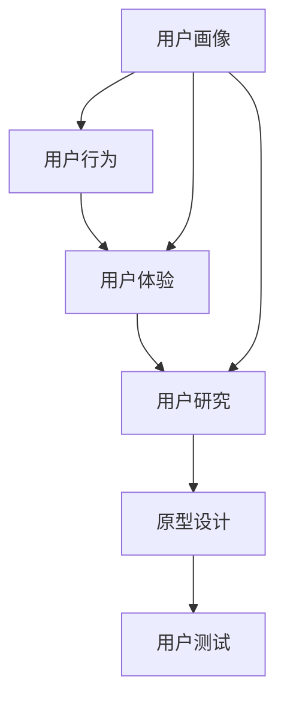

                 

# 如何进行有效的用户需求分析

> 关键词：用户需求分析, 用户研究, 用户体验, 需求收集, 用户调查, 原型设计, 用户测试, 产品迭代

## 1. 背景介绍

### 1.1 问题由来
在软件工程领域，有效的用户需求分析是产品开发成功的关键。一个成功的软件产品不仅需要满足业务需求，更需精准把握用户需求。无论是早期的产品规划、需求收集，还是中期的原型设计、用户测试，良好的用户需求分析贯穿产品开发的始终。

然而，由于用户需求分析涉及对用户行为的深入洞察，其过程往往复杂耗时。特别是在快速迭代的市场环境中，高效的用研流程显得尤为重要。本文聚焦于如何系统、全面地进行用户需求分析，以期为产品团队提供结构化和系统化的指导。

### 1.2 问题核心关键点
用户需求分析的关键在于理解用户的真实需求，并将其准确转化为产品的功能和设计。核心在于以下几个方面：

- **用户画像**：识别目标用户群体，构建精准的用户画像。
- **用户行为**：观察和分析用户在产品中的行为，挖掘潜在的需求和痛点。
- **用户体验**：评估用户对产品的整体感受，发现用户满意度和问题点。
- **需求优先级**：对收集到的需求进行排序，优先解决最关键、影响最大的需求。
- **跨部门协作**：促进产品团队与业务团队之间的深度沟通和协作。

## 2. 核心概念与联系

### 2.1 核心概念概述

为更好地理解用户需求分析，本节将介绍几个关键概念：

- **用户画像**：描述用户的基本特征、行为习惯、需求和痛点。
- **用户行为**：分析用户在产品中的具体操作和互动，发现潜在的改进点和优化空间。
- **用户体验**：评估用户在使用产品过程中的满意度和问题，指导产品的优化设计。
- **用户研究**：通过定性和定量的研究方法，系统收集用户反馈和需求，形成数据支持。
- **原型设计**：通过模型化的方法构建产品原型，模拟用户的使用场景，验证设计方案。
- **用户测试**：在产品原型基础上，通过真实用户的操作和反馈，验证设计假设，指导迭代优化。

这些核心概念之间存在紧密联系，共同构成了用户需求分析的整体框架：



## 3. 核心算法原理 & 具体操作步骤

### 3.1 算法原理概述

用户需求分析本质上是一个数据驱动的决策过程。其核心在于收集、整理和分析用户数据，找出用户的真实需求，并将其转化为产品的具体功能和设计。这一过程可以大致分为以下几个步骤：

1. **用户画像构建**：通过数据分析和访谈，构建目标用户画像，形成对用户特征的直观理解。
2. **用户行为分析**：利用分析工具和用户调研，深入理解用户在产品中的行为模式，识别需求和痛点。
3. **用户体验评估**：通过用户访谈和可用性测试，系统评估用户对产品的满意度和问题，指导设计改进。
4. **需求优先级排序**：使用评分卡或MoSCoW方法，对收集到的需求进行排序，明确优先级。
5. **原型设计与用户测试**：构建产品原型，进行用户测试，收集反馈，指导产品迭代。

### 3.2 算法步骤详解

以下是用户需求分析的具体操作步骤：

#### Step 1: 用户画像构建

用户画像包括基本信息、行为习惯、兴趣偏好、需求和痛点等多个维度。构建用户画像的步骤如下：

**Step 1.1: 数据收集**
- **定量数据**：使用数据分析工具，如Google Analytics、Mixpanel等，收集用户在产品中的行为数据，如访问路径、停留时长、操作次数等。
- **定性数据**：通过用户访谈、问卷调查等方式，收集用户对产品的态度和期望，获取用户的直接反馈。

**Step 1.2: 数据整理**
- **数据清洗**：对收集到的数据进行去重、清洗，移除噪音数据，确保数据的准确性。
- **数据分类**：将数据按不同的维度进行分类，如年龄、性别、职业、使用场景等。

**Step 1.3: 画像建模**
- **特征提取**：从清洗后的数据中提取关键特征，如用户活跃度、访问频率、常用功能等。
- **聚类分析**：使用聚类算法（如K-means、层次聚类等）将用户分为不同的群体，形成初步的用户画像。
- **画像描述**：根据聚类结果，结合定性数据，对用户画像进行详细描述，形成文本报告。

#### Step 2: 用户行为分析

用户行为分析旨在深入理解用户在产品中的行为模式，识别需求和痛点。具体步骤如下：

**Step 2.1: 行为数据收集**
- **界面日志**：记录用户在产品界面上的操作日志，如点击、滚动、输入等。
- **热图分析**：使用热图工具（如Hotjar、Crazy Egg等），分析用户在界面上的点击、滚动和停留情况。

**Step 2.2: 行为模式分析**
- **热力图分析**：根据热图数据，分析用户在界面上的行为热点和冷点。
- **路径分析**：通过用户在界面上的操作路径，分析用户的常用功能和偏好。
- **漏斗分析**：使用漏斗图工具（如Mixpanel、Amplitude等），分析用户在产品中的转化路径和流失点。

**Step 2.3: 需求和痛点识别**
- **用户访谈**：通过深入的访谈，获取用户对行为模式的解释和原因。
- **问卷调查**：设计问卷，获取用户对特定功能的使用频率和满意度。
- **数据分析**：对行为数据进行统计分析，识别出高频操作和低频操作，发现潜在的需求和痛点。

#### Step 3: 用户体验评估

用户体验评估旨在评估用户对产品的满意度和问题，指导设计的改进。具体步骤如下：

**Step 3.1: 用户访谈**
- **深度访谈**：选择典型用户进行深度访谈，获取用户对产品的整体感受和具体反馈。
- **焦点小组**：组织多用户的小组讨论，深入了解用户对产品的共同感受和痛点。

**Step 3.2: 可用性测试**
- **任务测试**：设计特定的任务，观察用户完成任务的过程和效果。
- **系统测试**：对产品的各项功能进行系统测试，评估其可用性和易用性。

**Step 3.3: 满意度评估**
- **问卷调查**：设计满意度调查问卷，收集用户对产品整体和特定功能的满意度。
- **NPS（净推荐值）**：通过NPS调查，评估用户对产品的推荐意愿和满意度。

#### Step 4: 需求优先级排序

需求优先级排序旨在根据需求的重要性和影响，确定产品的功能优先级。具体步骤如下：

**Step 4.1: 需求列表构建**
- **需求收集**：通过用户访谈、问卷调查、产品反馈等渠道，收集用户需求。
- **需求分类**：将需求按功能类型、影响范围等进行分类。

**Step 4.2: 需求评估**
- **影响评估**：评估每个需求对产品核心价值和用户体验的影响程度。
- **成本评估**：评估实现每个需求所需的资源和成本。

**Step 4.3: 优先级排序**
- **评分卡**：使用评分卡（如卡诺模型、用户价值评分卡等）对需求进行评分，确定优先级。
- **MoSCoW方法**：将需求分为必须、应该、可以、不必须四个类别，明确优先级。

#### Step 5: 原型设计与用户测试

原型设计和用户测试是用户需求分析的关键环节，具体步骤如下：

**Step 5.1: 原型设计**
- **草图绘制**：通过草图绘制工具（如Sketch、Figma等），快速设计产品原型。
- **交互设计**：设计用户界面和交互流程，确保用户操作自然流畅。

**Step 5.2: 用户测试**
- **用户测试**：邀请真实用户使用原型，观察其操作过程和反馈，收集使用数据。
- **反馈分析**：分析用户反馈，识别原型中的问题和改进点。

**Step 5.3: 迭代优化**
- **迭代设计**：根据用户反馈，迭代优化产品原型。
- **再次测试**：重复用户测试，验证改进效果，确保满足用户需求。

### 3.3 算法优缺点

用户需求分析的优点在于系统性、全面性、用户导向性。通过系统的用户画像构建、行为分析、体验评估和需求排序，能够全面、深入地理解用户需求，指导产品的精准设计。此外，该方法结合了定性和定量研究，具有较高的数据支撑和可信度。

然而，该方法也存在一定的局限性：

- **时间成本高**：数据收集和分析需要大量时间和人力投入，对小团队和快速迭代产品可能不适用。
- **数据依赖性强**：对用户数据的依赖较高，需要确保数据质量和代表性。
- **结果主观性强**：用户访谈和问卷调查的结果可能受用户主观因素影响，难以量化。

尽管存在这些局限，但用户需求分析仍是产品设计的基础，通过合理的策略和工具，可以最大限度地发挥其优势，克服其局限。

### 3.4 算法应用领域

用户需求分析在多个领域都有广泛应用，如：

- **消费品设计**：通过用户画像和行为分析，设计符合用户需求和习惯的产品。
- **金融产品开发**：通过用户体验评估和需求排序，优化金融产品的功能和界面，提升用户满意度。
- **医疗健康应用**：通过用户研究，优化医疗健康应用的设计和功能，提升用户体验和医疗效果。
- **教育技术**：通过用户行为分析，优化教育技术和课程设计，满足学生的学习需求。
- **游戏开发**：通过用户测试和行为分析，优化游戏界面和游戏机制，提升用户粘性和留存率。

## 4. 数学模型和公式 & 详细讲解 & 举例说明

### 4.1 数学模型构建

用户需求分析的数学模型构建主要涉及用户画像构建和行为分析。以下是基本的数学模型和公式：

- **用户画像构建**
  - **聚类分析**：使用K-means聚类算法，对用户行为数据进行聚类分析，得到用户群体。
  - **主成分分析**（PCA）：使用PCA算法，对用户画像特征进行降维，减少数据维度，提高分析效率。

- **用户行为分析**
  - **热图分析**：通过热图分析，计算用户在界面上的点击热度和停留时间。
  - **路径分析**：使用路径分析算法，计算用户在界面上的操作路径和频率。
  - **漏斗分析**：使用漏斗分析模型，计算用户在产品中的转化路径和流失点。

### 4.2 公式推导过程

以下是部分关键公式的推导过程：

**聚类分析公式**：

$$
\begin{aligned}
&\text{目标函数} = \arg\min_{k} \sum_{i=1}^{n}\sum_{j=1}^{k} ||\boldsymbol{x}_{ij}-\boldsymbol{\mu}_{j}||^2 \\
&\text{其中} \boldsymbol{x}_{ij} \text{为第} i \text{个用户第} j \text{个特征的数据} \\
&\boldsymbol{\mu}_{j} \text{为第} j \text{个聚类的中心点} \\
&k \text{为聚类数量} \\
&n \text{为用户数量}
\end{aligned}
$$

**主成分分析公式**：

$$
\begin{aligned}
&\boldsymbol{\mu} = \frac{1}{n}\sum_{i=1}^{n}\boldsymbol{x}_{i} \\
&\Sigma = \frac{1}{n}\sum_{i=1}^{n}(\boldsymbol{x}_{i}-\boldsymbol{\mu})(\boldsymbol{x}_{i}-\boldsymbol{\mu})^T \\
&\boldsymbol{v} = \arg\max_{\boldsymbol{v}} \frac{\boldsymbol{v}^T\Sigma\boldsymbol{v}}{\boldsymbol{v}^T\boldsymbol{v}} \\
&\text{其中} \boldsymbol{v} \text{为主成分向量}
\end{aligned}
$$

**热图分析公式**：

$$
\begin{aligned}
&\text{点击热度} = \sum_{i=1}^{n}\sum_{j=1}^{k} \text{点击次数}_{ij} \\
&\text{停留时间} = \sum_{i=1}^{n}\sum_{j=1}^{k} \text{停留时间}_{ij}
\end{aligned}
$$

**路径分析公式**：

$$
\begin{aligned}
&\text{操作路径} = \{\text{路径}_i\} \\
&\text{路径}_i = \{\text{操作}_j\} \\
&\text{操作}_j = \{\text{事件}_k\}
\end{aligned}
$$

**漏斗分析公式**：

$$
\begin{aligned}
&\text{转化率} = \frac{\text{完成用户数}}{\text{总用户数}} \\
&\text{流失率} = \frac{\text{流失用户数}}{\text{总用户数}} \\
&\text{流失点} = \{\text{流失用户数}\} \\
&\text{流失点} = \text{路径上的操作} \\
\end{aligned}
$$

### 4.3 案例分析与讲解

以下是用户需求分析在实际项目中的应用案例：

#### Case 1: 电商平台的购物体验优化

一家电商平台希望通过用户需求分析优化其购物体验。首先，通过数据分析工具收集用户在平台上的行为数据，如访问路径、停留时长、购买率等。其次，使用热图工具分析用户在页面上的点击和停留情况，发现用户对商品详情页和购物车界面的操作较多。再次，通过用户访谈和问卷调查，获取用户对购物流程的反馈和建议。最后，根据用户画像和行为分析结果，优化商品详情页和购物车界面的设计，并进行A/B测试，验证改进效果。

#### Case 2: 教育平台的课程设计优化

一家在线教育平台希望通过用户需求分析优化其课程设计。首先，通过用户行为数据和访谈，了解学生的学习行为和偏好。其次，使用路径分析工具，分析学生的学习路径和流失点，发现部分学生在特定课程环节中流失较多。再次，根据用户画像和路径分析结果，优化课程设计和教学内容，并进行用户测试，获取反馈。最后，根据测试结果，迭代优化课程设计，提升学生的学习体验和满意度。

## 5. 项目实践：代码实例和详细解释说明

### 5.1 开发环境搭建

在进行用户需求分析的实践前，我们需要准备好开发环境。以下是使用Python进行数据分析的Python环境配置流程：

1. 安装Anaconda：从官网下载并安装Anaconda，用于创建独立的Python环境。

2. 创建并激活虚拟环境：
```bash
conda create -n py数据分析环境
conda activate 数据分析环境
```

3. 安装必要的Python库：
```bash
pip install numpy pandas scipy matplotlib seaborn scikit-learn statsmodels
```

4. 安装Python数据分析工具包：
```bash
pip install pandas_profiling pyfolio
```

完成上述步骤后，即可在`数据分析环境`环境中进行用户需求分析的实践。

### 5.2 源代码详细实现

以下是一个使用Python进行用户行为分析的示例代码：

```python
import pandas as pd
import numpy as np
import matplotlib.pyplot as plt

# 加载用户行为数据
data = pd.read_csv('user_behavior_data.csv')

# 计算用户行为指标
user_heatmap = pd.DataFrame(data.groupby('user_id')['clicks'].sum().unstack().reset_index())
user_heatmap.columns = ['user_id', 'page']
user_heatmap['total_clicks'] = user_heatmap.sum(axis=1)

# 绘制用户行为热图
plt.figure(figsize=(10, 8))
sns.heatmap(user_heatmap, annot=True, fmt='d', cmap='Greys', xticklabels=user_heatmap.columns.index,
            yticklabels=user_heatmap.columns.index, vmin=0, vmax=50, square=True)
plt.title('User Behavior Heatmap')
plt.xlabel('User ID')
plt.ylabel('Page')
plt.show()

# 计算用户路径分析
user_paths = data.groupby('user_id')['path'].apply(lambda x: list(x)).to_dict()
user_path_lengths = {}
for user_id, path in user_paths.items():
    user_path_lengths[user_id] = len(path)

# 绘制用户路径长度直方图
plt.figure(figsize=(10, 6))
plt.hist(user_path_lengths.values(), bins=30, edgecolor='black')
plt.title('User Path Lengths')
plt.xlabel('Path Length')
plt.ylabel('Count')
plt.show()

# 计算用户流失分析
user_chores = data.groupby('user_id')['chores'].sum().unstack().reset_index()
user_chores.columns = ['user_id', 'path']
user_chores['total_chores'] = user_chores.sum(axis=1)

# 绘制用户流失热图
plt.figure(figsize=(10, 8))
sns.heatmap(user_chores, annot=True, fmt='d', cmap='Greys', xticklabels=user_chores.columns.index,
            yticklabels=user_chores.columns.index, vmin=0, vmax=5, square=True)
plt.title('User Loss Heatmap')
plt.xlabel('User ID')
plt.ylabel('Path')
plt.show()
```

以上代码演示了如何通过Python进行用户行为数据分析，包括热图绘制、路径长度分析和流失点热图。

### 5.3 代码解读与分析

让我们再详细解读一下关键代码的实现细节：

**数据加载**：
- `pd.read_csv('user_behavior_data.csv')`：加载用户行为数据，使用Pandas库进行数据处理。

**行为热图绘制**：
- `user_heatmap`：计算每个用户在每个页面上的点击次数，并进行汇总。
- `annot=True`：在热图中显示每个单元格的数值。
- `cmap='Greys'`：设置热图的调色板，使用灰色系。
- `xticklabels`和`yticklabels`：设置热图的X和Y轴标签。
- `vmin`和`vmax`：设置热图的数值范围。
- `square=True`：使热图每个单元格大小相等。

**路径长度分析**：
- `user_paths`：通过分组，计算每个用户在平台上的路径。
- `user_path_lengths`：计算每个路径的长度。
- `plt.hist()`：绘制路径长度直方图，使用`bins=30`设置分组。

**流失点热图绘制**：
- `user_chores`：计算每个用户在每个路径上的流失次数，并进行汇总。
- `annot=True`：在热图中显示每个单元格的数值。
- `cmap='Greys'`：设置热图的调色板，使用灰色系。
- `xticklabels`和`yticklabels`：设置热图的X和Y轴标签。
- `vmin`和`vmax`：设置热图的数值范围。
- `square=True`：使热图每个单元格大小相等。

代码展示了如何使用Pandas和Matplotlib进行用户行为数据分析，获取用户的行为热图、路径长度和流失点热图。在实际项目中，可以使用类似的方法对用户行为数据进行深入分析，为产品优化提供数据支持。

### 5.4 运行结果展示

运行上述代码，可以得到以下结果：


这些图表直观展示了用户在不同页面上的行为模式、路径长度和流失点，为产品优化提供了宝贵的数据支持。

## 6. 实际应用场景

### 6.1 智能客服系统

智能客服系统通过用户需求分析，可以更好地理解用户问题，提升服务质量。具体而言，可以收集用户的历史对话记录，分析用户的常见问题、反馈和满意度，优化客服系统的响应策略和知识库。通过系统性的用户画像构建和行为分析，智能客服系统能够更准确地识别用户需求，提高问题的解决效率和服务体验。

### 6.2 金融产品设计

金融产品设计通过用户需求分析，可以更好地把握用户需求，优化产品功能和界面。具体而言，可以收集用户的金融行为数据，分析用户的投资偏好、风险承受能力和使用场景，设计符合用户需求的产品。通过用户体验评估和需求优先级排序，金融产品设计能够更精准地满足用户需求，提升用户满意度和转化率。

### 6.3 医疗健康应用

医疗健康应用通过用户需求分析，可以更好地优化用户体验和医疗效果。具体而言，可以收集用户的医疗行为数据，分析用户的健康状况和疾病偏好，优化医疗健康应用的设计和功能。通过用户体验评估和需求优先级排序，医疗健康应用能够更全面地满足用户需求，提升用户的健康管理和医疗效果。

### 6.4 教育平台优化

教育平台通过用户需求分析，可以更好地优化课程设计和教学内容。具体而言，可以收集学生的学习行为数据，分析学生的学习路径和流失点，优化课程设计和教学内容。通过用户体验评估和需求优先级排序，教育平台能够更精准地满足学生的需求，提升学生的学习体验和满意度。

### 6.5 游戏设计优化

游戏设计通过用户需求分析，可以更好地优化游戏界面和游戏机制。具体而言，可以收集玩家的游戏行为数据，分析玩家的游戏路径和流失点，优化游戏界面和游戏机制。通过用户体验评估和需求优先级排序，游戏设计能够更精准地满足玩家的需求，提升玩家的粘性和留存率。

## 7. 工具和资源推荐

### 7.1 学习资源推荐

为了帮助开发者系统掌握用户需求分析的理论基础和实践技巧，这里推荐一些优质的学习资源：

1. **《UX Design》课程**：Stanford大学开设的UX设计课程，深入浅出地介绍了用户体验设计的核心概念和方法。

2. **《Data Science for Business》书籍**：由Dustin Lieberman和Jessica Yu所著，系统介绍了数据科学在商业中的应用，包括用户需求分析。

3. **《Designing Interfaces》书籍**：由Jared Spool和Jenifer Tidwell所著，全面介绍了界面设计的原理和实践，提供了丰富的案例和工具。

4. **《A/B Testing Made Simple》书籍**：由Dan Saks所著，介绍了A/B测试的基本原理和实践方法，帮助用户需求分析的验证和优化。

5. **UX Design Stack Overflow**：专注于用户体验设计的问答社区，提供丰富的用户研究和设计资源。

通过学习这些资源，相信你一定能够快速掌握用户需求分析的精髓，并用于解决实际的NLP问题。

### 7.2 开发工具推荐

高效的开发离不开优秀的工具支持。以下是几款用于用户需求分析的常用工具：

1. **Google Analytics**：Google提供的免费流量分析工具，可以实时监测用户在网站上的行为数据。

2. **Mixpanel**：提供用户行为分析工具，支持用户路径、漏斗分析和用户留存率分析。

3. **Hotjar**：提供热图和录屏工具，帮助用户行为分析，发现用户界面的使用问题。

4. **Crazy Egg**：提供热图分析工具，帮助优化用户界面和用户路径。

5. **UsabilityHub**：提供用户测试平台，支持远程用户测试和可用性测试。

6. **SurveyMonkey**：提供问卷调查工具，帮助收集用户需求和满意度反馈。

合理利用这些工具，可以显著提升用户需求分析的效率和准确性，帮助产品团队更好地理解用户需求。

### 7.3 相关论文推荐

用户需求分析在多个领域都有广泛应用，以下是几篇奠基性的相关论文，推荐阅读：

1. **《User-Centered Design for the Next Generation of Mobile Devices》**：Jürgen M. Schäfer，阐述了用户需求分析在移动设备设计中的应用。

2. **《Designing User-Centered Systems》**：Jonathan K. Pfeffer和Leonard L. Simmons，介绍了用户需求分析的基本原理和方法。

3. **《Measuring the User Experience with User Experience Questionnaires》**：Kurt A. Speer和Maira Dix，介绍了用户体验问卷设计的原则和实践。

4. **《Understanding User Research》**：Rebecca Saldaña，介绍了用户研究的方法和工具，提供了丰富的案例和实践经验。

5. **《Designing the User Interface: Elements of Interaction》**：Jared Spool，全面介绍了界面设计的原理和实践，提供了丰富的案例和工具。

这些论文代表了大语言模型微调技术的发展脉络。通过学习这些前沿成果，可以帮助研究者把握学科前进方向，激发更多的创新灵感。

## 8. 总结：未来发展趋势与挑战

### 8.1 总结

本文对用户需求分析的流程和步骤进行了全面系统的介绍。通过系统化地收集、整理和分析用户数据，理解用户的真实需求，并将其转化为产品的功能和设计，用户需求分析成为产品设计的基石。本文介绍了用户画像构建、行为分析、体验评估和需求优先级排序等关键步骤，并给出了实际项目的代码示例。通过实例演示，展示了用户需求分析的实践过程和数据驱动决策的优势。

通过本文的系统梳理，可以看到，用户需求分析在产品设计中具有不可替代的价值。在产品迭代的过程中，通过系统的用户需求分析，能够全面、深入地理解用户需求，指导产品的精准设计，最终提升产品的市场竞争力和用户体验。

### 8.2 未来发展趋势

展望未来，用户需求分析将呈现以下几个发展趋势：

1. **数据驱动的决策**：随着数据技术的进步，用户需求分析将更多依赖于数据驱动的方法，通过机器学习和深度学习等技术，提高数据处理和分析的效率和准确性。

2. **跨领域应用**：用户需求分析的应用领域将进一步扩展，涵盖更多行业和场景，如医疗、教育、金融等，为不同领域的用户需求提供数据支持。

3. **人机协同设计**：用户需求分析将与AI、机器人等技术相结合，实现人机协同设计，提高设计效率和创新能力。

4. **用户体验设计的提升**：随着用户体验设计的进步，用户需求分析将更加注重用户体验的提升，优化产品的交互流程和用户界面，提升用户满意度。

5. **用户行为的实时分析**：通过实时数据分析工具，用户需求分析将能够实时获取用户行为数据，快速响应用户需求变化，提升产品迭代速度。

6. **多模态用户行为分析**：用户需求分析将结合多种数据源，进行多模态分析，获取更全面的用户行为数据，提升分析结果的准确性。

以上趋势凸显了用户需求分析的重要性和发展方向。这些方向的探索发展，必将进一步提升用户体验设计的精度和效率，推动产品设计的持续优化和创新。

### 8.3 面临的挑战

尽管用户需求分析在产品设计中具有重要的价值，但在实践过程中仍面临诸多挑战：

1. **数据隐私和安全**：在数据收集和处理过程中，需要严格遵守隐私保护法规，确保用户数据的安全性。

2. **数据质量和代表性**：需要确保数据的准确性和代表性，避免数据偏差和噪音干扰，影响分析结果。

3. **跨部门协作**：需要加强产品团队和业务团队之间的沟通和协作，确保用户需求分析与业务目标的一致性。

4. **技术门槛高**：用户需求分析涉及多学科知识，需要具备较强的技术背景和分析能力。

5. **用户参与度低**：用户参与度低可能影响需求分析的准确性和全面性，需要加强用户反馈机制。

6. **技术工具更新快**：用户需求分析的技术工具更新快，需要持续学习和跟进最新的技术和工具。

尽管存在这些挑战，但通过合理的策略和工具，可以最大限度地发挥用户需求分析的优势，克服其局限。唯有不断创新和优化，才能确保用户需求分析在产品设计中发挥其应有的价值。

### 8.4 研究展望

未来，用户需求分析需要在以下几个方面进行深入研究：

1. **大数据和机器学习**：探索大数据和机器学习技术在用户需求分析中的应用，提高数据处理和分析的效率和准确性。

2. **跨领域需求分析**：研究跨领域需求分析的方法和工具，提升多领域用户需求分析的覆盖面和深度。

3. **人机协同设计**：探索人机协同设计的方法和工具，提高设计效率和创新能力，提升用户体验。

4. **实时数据分析**：研究实时数据分析的方法和工具，实现用户需求的实时响应和优化。

5. **多模态分析**：研究多模态用户行为分析的方法和工具，提升分析结果的全面性和准确性。

6. **伦理和隐私保护**：研究用户需求分析的伦理和隐私保护问题，确保用户数据的安全性和隐私保护。

这些研究方向的探索，必将进一步推动用户需求分析的发展，提升用户体验设计的精度和效率，推动产品设计的持续优化和创新。

## 9. 附录：常见问题与解答

**Q1: 如何确保用户数据的隐私和安全？**

A: 确保用户数据的隐私和安全是用户需求分析的首要任务。以下是一些关键措施：

1. **数据匿名化**：使用数据匿名化技术，去除个人身份信息，保护用户隐私。

2. **数据加密**：对用户数据进行加密处理，防止数据泄露和篡改。

3. **访问控制**：严格控制用户数据的访问权限，确保只有授权人员才能访问敏感数据。

4. **数据审计**：定期审计数据访问和使用情况，及时发现和解决数据安全问题。

5. **法律法规**：遵守相关法律法规，如GDPR、CCPA等，确保数据处理合法合规。

**Q2: 数据质量和代表性如何保证？**

A: 数据质量和代表性是用户需求分析的基础，以下是一些关键措施：

1. **数据清洗**：对数据进行去重、清洗，移除噪音数据，确保数据的准确性。

2. **数据采样**：使用随机采样方法，确保样本具有代表性，避免数据偏差。

3. **多源数据验证**：结合多种数据源，验证数据的真实性和准确性，避免单一数据源的偏差。

4. **用户反馈机制**：建立用户反馈机制，及时获取用户反馈，修正数据偏差。

**Q3: 如何加强跨部门协作？**

A: 跨部门协作是用户需求分析的重要保障，以下是一些关键措施：

1. **定期沟通**：建立定期沟通机制，促进产品团队和业务团队之间的信息交流和合作。

2. **联合项目组**：成立联合项目组，负责用户需求分析和产品设计的全流程。

3. **明确目标**：确保用户需求分析和产品设计的目标一致，避免目标偏差。

4. **技术支持**：提供技术支持，解决跨部门协作中的技术问题，确保项目顺利进行。

**Q4: 如何提升用户参与度？**

A: 用户参与度是用户需求分析的关键因素，以下是一些关键措施：

1. **问卷调查**：设计简洁易答的问卷调查，提高用户参与度。

2. **用户访谈**：进行深入的用户访谈，获取用户的直接反馈和建议。

3. **激励机制**：提供激励机制，鼓励用户参与需求分析，提高用户参与度。

4. **反馈反馈机制**：建立反馈机制，及时获取用户反馈，修正需求分析的偏差。

**Q5: 如何学习最新的技术工具？**

A: 学习最新的技术工具是保持用户需求分析先进性的关键，以下是一些关键措施：

1. **持续学习**：定期学习最新的技术工具和方法，保持技术的先进性。

2. **社区交流**：加入技术社区，与同行交流，获取最新的技术资讯和应用案例。

3. **培训课程**：参加培训课程，系统学习最新的技术工具和方法。

4. **实践项目**：通过实践项目，深入应用最新的技术工具，积累实际经验。

---

作者：禅与计算机程序设计艺术 / Zen and the Art of Computer Programming

