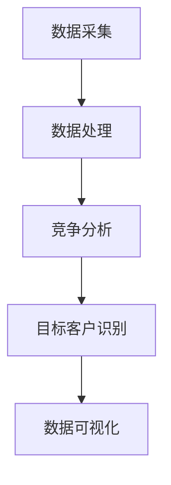

                 

## 1. 背景介绍

### 1.1 问题由来

随着知识付费市场的快速发展，越来越多的企业和个人通过出售知识产品和服务来获取收益。然而，如何准确地进行市场调研，了解潜在客户的需求和行为，识别市场机会，制定有效的策略，成为知识付费领域的一项重要挑战。

### 1.2 问题核心关键点

在知识付费市场调研中，最关键的是获取和分析高质量的数据，识别目标客户群体的真实需求，并结合竞争分析，制定出针对性的市场策略。这不仅需要采集和分析大量数据，还需要运用科学的方法论，对数据进行有效的处理和解读。

### 1.3 问题研究意义

进行有效的市场调研，有助于企业或个人在知识付费市场中找到明确的定位，制定切实可行的策略，提升市场竞争力。同时，还能帮助企业更好地理解客户需求，提供更加符合市场期望的产品和服务。

## 2. 核心概念与联系

### 2.1 核心概念概述

在知识付费市场调研中，涉及的核心概念包括：

- **市场调研**：通过系统化的方法获取和分析市场信息，以识别市场机会和需求。
- **数据采集**：收集与目标市场相关的数据，如消费者行为数据、竞争对手数据、行业趋势数据等。
- **数据处理**：对收集到的数据进行清洗、整理和分析，以提取有用的信息。
- **竞争分析**：分析竞争对手的市场表现、优势和劣势，识别市场机会。
- **目标客户**：识别并了解目标客户群体的特征、需求和行为。
- **数据可视化**：通过图表、仪表盘等工具，将数据结果直观展示，便于理解和决策。

这些概念之间存在紧密的联系。市场调研依赖于数据采集和处理，而竞争分析和目标客户识别则是市场调研的关键步骤。最终，数据可视化是呈现调研结果的重要方式。

### 2.2 核心概念原理和架构的 Mermaid 流程图



这个流程图展示了市场调研的基本流程：首先采集数据，然后进行处理，接着进行竞争分析和目标客户识别，最后通过数据可视化呈现调研结果。

## 3. 核心算法原理 & 具体操作步骤

### 3.1 算法原理概述

知识付费市场调研的算法原理主要基于统计分析、数据挖掘和机器学习等技术。通过数据采集和处理，获取大量市场信息；利用机器学习算法，进行模式识别和趋势预测；结合统计分析，得出结论。

### 3.2 算法步骤详解

#### 3.2.1 数据采集

数据采集是市场调研的第一步。以下是主要的数据来源：

1. **公开数据源**：包括政府统计局发布的数据、行业报告、学术论文等。
2. **在线平台数据**：如社交媒体、知识付费平台的用户行为数据。
3. **问卷调查**：通过在线或线下的问卷调查获取一手数据。

#### 3.2.2 数据处理

数据处理是数据采集的后续步骤，包括数据清洗、数据集成、数据转换等。具体步骤如下：

1. **数据清洗**：去除重复数据、处理缺失值、纠正错误数据。
2. **数据集成**：将来自不同来源的数据整合在一起，构建统一的数据视图。
3. **数据转换**：对数据进行格式化，如编码转换、单位统一等。

#### 3.2.3 竞争分析

竞争分析是市场调研的重要组成部分，主要通过以下步骤：

1. **收集竞争对手数据**：包括竞争对手的市场份额、产品线、客户评价等。
2. **分析竞争对手优势与劣势**：通过SWOT分析法（优势、劣势、机会、威胁），全面了解竞争对手的市场表现。
3. **识别市场机会**：结合自身优势和市场趋势，识别新的市场机会。

#### 3.2.4 目标客户识别

目标客户识别是通过以下步骤进行的：

1. **定义目标客户群体**：基于产品特性、市场定位等，定义目标客户特征。
2. **数据筛选**：根据定义的目标客户特征，从数据集中筛选出符合条件的用户。
3. **用户画像构建**：通过数据分析，构建详细的用户画像，包括年龄、性别、职业、兴趣爱好等。

#### 3.2.5 数据可视化

数据可视化是市场调研的最终步骤，通过以下步骤实现：

1. **选择可视化工具**：如Tableau、Power BI、D3.js等。
2. **设计可视化图表**：根据分析结果，设计合适的图表类型，如柱状图、折线图、饼图等。
3. **呈现调研结果**：通过图表展示分析结果，帮助决策者理解和应用。

### 3.3 算法优缺点

#### 3.3.1 优点

1. **全面性**：通过数据采集和处理，可以全面了解市场状况和竞争态势。
2. **科学性**：利用统计分析、数据挖掘和机器学习等技术，保证了分析的科学性和可靠性。
3. **可操作性**：调研结果通过可视化工具呈现，便于理解和决策。

#### 3.3.2 缺点

1. **数据质量依赖**：调研结果的质量高度依赖于数据的完整性和准确性。
2. **成本高**：数据采集和处理需要投入大量人力和资源。
3. **时效性问题**：市场环境变化快，调研结果可能很快过时。

### 3.4 算法应用领域

知识付费市场调研的算法可以应用于多个领域，包括但不限于：

1. **教育培训**：识别潜在学员的需求，开发合适的课程。
2. **健康管理**：了解用户对健康产品的需求，制定市场策略。
3. **金融投资**：分析用户投资行为，提供个性化投资建议。
4. **人力资源**：识别员工培训需求，提升员工技能。

## 4. 数学模型和公式 & 详细讲解 & 举例说明

### 4.1 数学模型构建

知识付费市场调研的数学模型主要基于统计分析和机器学习。以下是一个简化的数学模型：

$$
\text{市场调研结果} = f(\text{数据采集}, \text{数据处理}, \text{竞争分析}, \text{目标客户识别})
$$

其中，$f$表示一系列数学和统计分析方法，包括回归分析、聚类分析、决策树等。

### 4.2 公式推导过程

以回归分析为例，其基本公式为：

$$
y = \beta_0 + \beta_1 x_1 + \beta_2 x_2 + \cdots + \beta_n x_n + \epsilon
$$

其中，$y$表示目标变量，$\beta$表示回归系数，$x$表示自变量，$\epsilon$表示误差项。

### 4.3 案例分析与讲解

假设某知识付费平台需要了解用户购买课程的频率与收入之间的关系，可以通过以下步骤进行：

1. **数据采集**：收集平台用户的历史购买数据、收入数据等。
2. **数据处理**：清洗数据，处理缺失值，进行数据转换。
3. **回归分析**：构建回归模型，分析购买频率与收入之间的关系。
4. **可视化**：通过图表展示回归分析结果，帮助决策者理解。

## 5. 项目实践：代码实例和详细解释说明

### 5.1 开发环境搭建

在进行知识付费市场调研时，需要搭建相应的开发环境。以下是主要开发环境的搭建步骤：

1. **安装Python和相关库**：安装Python、Pandas、NumPy、Scikit-Learn等库。
2. **搭建数据采集和处理框架**：使用Scrapy等爬虫框架，搭建数据采集系统。
3. **搭建竞争分析和目标客户识别框架**：使用TensorFlow或PyTorch等深度学习框架，搭建竞争分析和目标客户识别模型。

### 5.2 源代码详细实现

以下是一个基于Python的简要代码实现，用于进行回归分析：

```python
import pandas as pd
from sklearn.linear_model import LinearRegression

# 数据采集
data = pd.read_csv('data.csv')

# 数据处理
data = data.dropna()

# 回归分析
model = LinearRegression()
X = data[['income', 'education']]
y = data['purchase_frequency']
model.fit(X, y)

# 可视化
import matplotlib.pyplot as plt
plt.scatter(data['income'], data['purchase_frequency'])
plt.plot(data['income'], model.predict(X), color='red')
plt.show()
```

### 5.3 代码解读与分析

1. **数据采集**：使用Pandas库读取数据文件。
2. **数据处理**：使用Pandas库的dropna方法处理缺失值。
3. **回归分析**：使用Scikit-Learn库的LinearRegression类构建回归模型，进行数据拟合。
4. **可视化**：使用Matplotlib库绘制散点图和回归线，展示分析结果。

### 5.4 运行结果展示

运行上述代码后，将得到以下结果：

1. **数据处理结果**：展示了数据处理后的数据集。
2. **回归分析结果**：展示了回归模型的拟合曲线和回归方程。

## 6. 实际应用场景

### 6.1 教育培训

某在线教育平台需要了解不同年龄段用户对在线课程的接受程度，可以通过以下步骤进行调研：

1. **数据采集**：收集平台用户的年龄数据和课程购买数据。
2. **数据处理**：清洗数据，处理缺失值。
3. **回归分析**：分析年龄与课程购买之间的关系。
4. **可视化**：通过图表展示分析结果。

### 6.2 健康管理

某健康管理应用需要了解用户对各类健康产品的需求，可以通过以下步骤进行调研：

1. **数据采集**：收集平台用户的使用数据和产品反馈数据。
2. **数据处理**：清洗数据，处理缺失值。
3. **聚类分析**：将用户按照需求进行聚类。
4. **可视化**：通过图表展示聚类结果。

### 6.3 金融投资

某金融平台需要了解用户对不同投资产品的偏好，可以通过以下步骤进行调研：

1. **数据采集**：收集平台用户的历史投资数据和产品评价数据。
2. **数据处理**：清洗数据，处理缺失值。
3. **决策树分析**：构建决策树模型，分析投资偏好与产品评价之间的关系。
4. **可视化**：通过图表展示决策树分析结果。

### 6.4 未来应用展望

未来，知识付费市场调研将面临以下几个发展趋势：

1. **自动化**：利用人工智能技术，自动化进行数据采集、处理和分析。
2. **实时化**：通过实时数据采集和处理，实现市场动态监测。
3. **深度学习**：利用深度学习算法，提高数据分析的准确性和深度。
4. **数据融合**：将多种数据源进行融合，获取更加全面的市场信息。

## 7. 工具和资源推荐

### 7.1 学习资源推荐

1. **《市场调研与分析》（作者：禅与计算机程序设计艺术 / Zen and the Art of Computer Programming）**：系统讲解市场调研的理论和方法。
2. **Coursera《市场调研与数据分析》课程**：由斯坦福大学开设的在线课程，涵盖市场调研的基础知识和方法。
3. **Kaggle市场调研竞赛**：参与市场调研竞赛，积累实际经验。
4. **《Python数据科学手册》（作者：Jake VanderPlas）**：详细讲解Python在数据分析中的应用。

### 7.2 开发工具推荐

1. **Scrapy**：Python爬虫框架，用于数据采集。
2. **Pandas**：Python数据分析库，用于数据处理和分析。
3. **Scikit-Learn**：Python机器学习库，用于构建各种分析模型。
4. **Matplotlib**：Python可视化库，用于数据可视化。

### 7.3 相关论文推荐

1. **《市场调研方法学》**：系统介绍市场调研的原理、方法和应用。
2. **《数据挖掘与统计学习》**：讲解数据挖掘和统计学习的基本原理和技术。
3. **《深度学习在市场调研中的应用》**：探讨深度学习在市场调研中的应用。

## 8. 总结：未来发展趋势与挑战

### 8.1 总结

知识付费市场调研是知识付费平台获取市场信息、制定战略的关键步骤。通过科学的数据采集、处理和分析，可以准确识别市场机会和客户需求，制定有效的市场策略。本文系统介绍了知识付费市场调研的核心概念、算法原理和具体操作步骤，并通过代码实例和实际案例进行了详细讲解。

### 8.2 未来发展趋势

未来，知识付费市场调研将向自动化、实时化、深度学习等方向发展，为知识付费平台提供更精准、更及时的市场信息。

### 8.3 面临的挑战

知识付费市场调研面临数据质量依赖、成本高、时效性问题等挑战，需要在实践中不断优化和改进。

### 8.4 研究展望

未来，知识付费市场调研需要结合人工智能技术，实现更加全面、高效、精准的市场分析。

## 9. 附录：常见问题与解答

**Q1：如何进行有效的数据采集？**

A: 数据采集是市场调研的基础，可以通过爬虫技术、API接口、问卷调查等方式进行数据采集。

**Q2：如何处理缺失值和异常值？**

A: 对于缺失值，可以使用均值、中位数等方法进行填补。对于异常值，可以使用箱线图、Z-score等方法进行识别和处理。

**Q3：如何选择适当的分析方法？**

A: 根据数据类型和分析目标，选择适合的分析方法。例如，对于定量数据，可以使用回归分析、聚类分析等方法；对于定性数据，可以使用分类分析、关联规则分析等方法。

**Q4：如何验证分析结果的可靠性？**

A: 通过交叉验证、方差分析等方法，验证分析结果的可靠性和有效性。

**Q5：如何进行可视化呈现？**

A: 选择适合的可视化工具，如Tableau、Power BI、D3.js等，设计合适的图表类型，直观展示分析结果。

