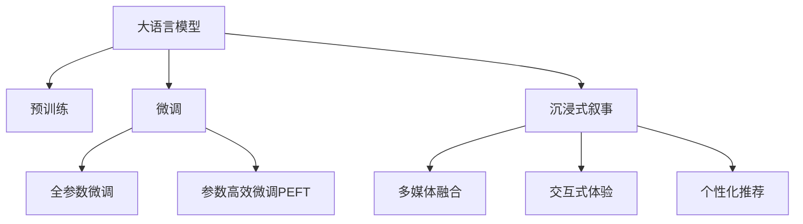

                 

# 媒体和娱乐：LLM 驱动的沉浸式叙事

> 关键词：大语言模型，自然语言处理，沉浸式叙事，多媒体，交互式体验

## 1. 背景介绍

### 1.1 问题由来
随着数字媒体和娱乐产业的飞速发展，传统的线性叙事方式逐渐无法满足观众日益增长的个性化需求。传统的影视剧、电子游戏、书籍等媒介，往往只能按照固定的节奏和线索展开故事，观众只能被动接受。而沉浸式叙事的兴起，通过更加灵活、互动、个性化的方式，使得观众可以主动参与故事发展，获得更深刻的体验。

近年来，大语言模型（Large Language Models，LLM）在自然语言处理（Natural Language Processing，NLP）领域取得了重大突破，以其卓越的语言生成能力和语义理解能力，在媒体和娱乐领域展现出广阔的应用前景。利用大语言模型，我们可以实现更加多样化和沉浸式的叙事方式，为用户提供更加丰富、互动的体验。

### 1.2 问题核心关键点
本文聚焦于LLM在媒体和娱乐中的沉浸式叙事应用，探讨大语言模型如何通过生成个性化、动态变化的叙事内容，构建互动性强、沉浸感高的叙事体验，从而提升观众的参与感和满意度。我们将在本节介绍大语言模型的工作原理和在沉浸式叙事中的应用场景。

## 2. 核心概念与联系

### 2.1 核心概念概述

为更好地理解LLM在沉浸式叙事中的应用，本节将介绍几个关键概念：

- 大语言模型（LLM）：以自回归（如GPT）或自编码（如BERT）模型为代表的大规模预训练语言模型。通过在大规模无标签文本语料上进行预训练，学习通用的语言表示，具备强大的语言理解和生成能力。

- 预训练（Pre-training）：指在大规模无标签文本语料上，通过自监督学习任务训练通用语言模型的过程。常见的预训练任务包括言语建模、遮挡语言模型等。预训练使得模型学习到语言的通用表示。

- 微调（Fine-tuning）：指在预训练模型的基础上，使用下游任务的少量标注数据，通过有监督学习优化模型在该任务上的性能。通常只需要调整顶层分类器或解码器，并以较小的学习率更新全部或部分的模型参数。

- 沉浸式叙事（Immersive Narrative）：指通过多媒体、交互式技术，使观众能够深入、细致地体验故事情节，获得身临其境的感受。

- 多媒体融合（Multimedia Fusion）：指将文本、图像、视频、声音等多种媒介有机结合，构建更加丰富、动态的叙事场景。

- 交互式体验（Interactive Experience）：指观众能够通过点击、滑动、语音等方式，主动参与叙事进程，影响故事发展。

- 个性化推荐（Personalized Recommendation）：指根据观众的偏好和行为数据，动态生成个性化的叙事内容，提供量身定做的体验。

这些核心概念之间的逻辑关系可以通过以下Mermaid流程图来展示：



这个流程图展示了大语言模型的核心概念及其之间的关系：

1. 大语言模型通过预训练获得基础能力。
2. 微调是对预训练模型进行任务特定的优化，可以分为全参数微调和参数高效微调（PEFT）。
3. 沉浸式叙事、多媒体融合、交互式体验和个性化推荐，是大语言模型在媒体和娱乐中的应用场景。

这些概念共同构成了LLM在媒体和娱乐领域的应用框架，使其能够提供更加丰富、互动、个性化的叙事体验。通过理解这些核心概念，我们可以更好地把握LLM的工作原理和优化方向。

## 3. 核心算法原理 & 具体操作步骤

### 3.1 算法原理概述

利用大语言模型实现沉浸式叙事，其核心在于生成个性化的叙事内容，构建互动的叙事场景。具体步骤如下：

1. **预训练**：使用大规模无标签文本数据，训练一个通用的语言模型，学习语言的通用表示。
2. **微调**：根据目标叙事的特定需求，选择少量标注数据，对预训练模型进行微调，使其能够生成符合叙事情境的文本。
3. **多媒体融合**：将文本与图像、视频、音频等多种媒介融合，构建多模态的叙事环境。
4. **交互式体验**：提供观众交互的界面，使其能够通过点击、滑动、语音等方式，影响叙事进程。
5. **个性化推荐**：根据观众的偏好和行为数据，动态生成个性化的叙事内容，提供量身定做的体验。

通过上述步骤，LLM能够实现动态变化的叙事内容，构建沉浸式的叙事场景，提供互动和个性化的体验。

### 3.2 算法步骤详解

以下我们详细介绍LLM在媒体和娱乐中的沉浸式叙事应用流程：

**Step 1: 准备预训练模型和数据集**
- 选择合适的预训练语言模型（如GPT、BERT）作为初始化参数。
- 准备目标叙事的文本数据集，划分为训练集、验证集和测试集。一般要求文本与预训练数据的分布不要差异过大。

**Step 2: 设计叙事场景**
- 根据叙事需求，设计故事的情节、角色、背景等信息。
- 使用文本描述的方式，将叙事信息编码为模型输入。

**Step 3: 微调模型**
- 在训练集上进行有监督的微调，优化模型生成符合叙事情境的文本。
- 设置合适的优化算法及其参数，如AdamW、SGD等，设置学习率、批大小、迭代轮数等。
- 设置正则化技术及强度，包括权重衰减、Dropout、Early Stopping等。
- 确定冻结预训练参数的策略，如仅微调顶层，或全部参数都参与微调。

**Step 4: 多媒体融合**
- 将文本与图像、视频、音频等多媒体内容进行融合，构建多模态的叙事场景。
- 可以使用深度学习模型，如GAN、VAE等，生成与叙事文本匹配的多媒体内容。

**Step 5: 交互式体验设计**
- 提供观众交互的界面，使其能够通过点击、滑动、语音等方式，影响叙事进程。
- 可以引入虚拟现实（VR）、增强现实（AR）等技术，增强叙事体验的沉浸感。

**Step 6: 个性化推荐**
- 根据观众的偏好和行为数据，动态生成个性化的叙事内容，提供量身定做的体验。
- 可以使用协同过滤、内容推荐等方法，分析观众的历史行为，预测其兴趣。

**Step 7: 测试和部署**
- 在测试集上评估叙事模型的性能，对比微调前后的效果。
- 使用微调后的模型对新样本进行推理预测，集成到实际的应用系统中。
- 持续收集新的数据，定期重新微调模型，以适应数据分布的变化。

以上是利用大语言模型实现沉浸式叙事的一般流程。在实际应用中，还需要针对具体叙事场景和观众需求，对微调过程的各个环节进行优化设计，如改进训练目标函数，引入更多的正则化技术，搜索最优的超参数组合等，以进一步提升模型性能。

### 3.3 算法优缺点

利用大语言模型实现沉浸式叙事，具有以下优点：

- **灵活性高**：能够生成动态变化的叙事内容，构建灵活的叙事场景。
- **互动性强**：通过观众的交互，叙事过程能够动态变化，提升观众的参与感。
- **个性化推荐**：根据观众的偏好和行为数据，提供量身定做的体验。
- **多媒体融合**：结合多种媒介，构建多模态的叙事环境，提升叙事体验的丰富性。

同时，该方法也存在一定的局限性：

- **数据依赖**：叙事模型的效果很大程度上取决于叙事数据的丰富程度和多样性，数据收集和标注成本较高。
- **计算需求**：多媒体融合和交互式体验设计可能需要较高的计算资源，硬件设备成本较高。
- **隐私风险**：叙事过程中可能涉及观众的个人信息，需要关注隐私保护问题。
- **用户体验不一致**：不同观众对叙事的理解和使用方式可能存在差异，导致叙事体验的不一致性。

尽管存在这些局限性，但就目前而言，利用大语言模型实现沉浸式叙事方法仍是大语言模型应用的重要范式。未来相关研究的重点在于如何进一步降低叙事对数据的依赖，提高叙事的互动性和个性化，同时兼顾用户体验和隐私保护等因素。

### 3.4 算法应用领域

利用大语言模型实现沉浸式叙事的算法，在媒体和娱乐领域已经得到了广泛的应用，覆盖了多个细分场景：

- **影视剧制作**：通过微调大语言模型，生成符合叙事情境的对话和文本，提升影视剧的互动性和个性化体验。
- **电子游戏剧情**：在电子游戏中，利用大语言模型生成动态变化的剧情对话，使玩家能够深度参与故事发展。
- **虚拟现实（VR）体验**：结合VR技术，构建沉浸式的叙事场景，提供全方位的感官体验。
- **增强现实（AR）应用**：通过AR技术，将叙事内容叠加到现实世界中，增强叙事互动性。
- **个性化推荐系统**：根据观众的偏好和行为数据，动态生成个性化的叙事内容，提升用户满意度。
- **互动式新闻报道**：通过用户互动，生成动态变化的报道内容，增强新闻的参与感。

除了上述这些经典应用外，利用大语言模型实现沉浸式叙事的创新性应用也将不断涌现，为媒体和娱乐技术带来新的突破。

## 4. 数学模型和公式 & 详细讲解

### 4.1 数学模型构建

本节将使用数学语言对利用大语言模型实现沉浸式叙事的过程进行更加严格的刻画。

记叙事模型为 $M_{\theta}:\mathcal{X} \rightarrow \mathcal{Y}$，其中 $\mathcal{X}$ 为输入空间，$\mathcal{Y}$ 为输出空间，$\theta \in \mathbb{R}^d$ 为模型参数。假设叙事任务的训练集为 $D=\{(x_i,y_i)\}_{i=1}^N, x_i \in \mathcal{X}, y_i \in \mathcal{Y}$。

定义模型 $M_{\theta}$ 在输入 $x$ 上的损失函数为 $\ell(M_{\theta}(x),y)$，则在数据集 $D$ 上的经验风险为：

$$
\mathcal{L}(\theta) = \frac{1}{N} \sum_{i=1}^N \ell(M_{\theta}(x_i),y_i)
$$

微调的优化目标是最小化经验风险，即找到最优参数：

$$
\theta^* = \mathop{\arg\min}_{\theta} \mathcal{L}(\theta)
$$

在实践中，我们通常使用基于梯度的优化算法（如SGD、Adam等）来近似求解上述最优化问题。设 $\eta$ 为学习率，$\lambda$ 为正则化系数，则参数的更新公式为：

$$
\theta \leftarrow \theta - \eta \nabla_{\theta}\mathcal{L}(\theta) - \eta\lambda\theta
$$

其中 $\nabla_{\theta}\mathcal{L}(\theta)$ 为损失函数对参数 $\theta$ 的梯度，可通过反向传播算法高效计算。

### 4.2 公式推导过程

以下我们以文本生成任务为例，推导生成模型的交叉熵损失函数及其梯度的计算公式。

假设模型 $M_{\theta}$ 在输入 $x$ 上的输出为 $\hat{y}=M_{\theta}(x) \in [0,1]$，表示样本属于某一类别的概率。真实标签 $y \in \{0,1\}$。则二分类交叉熵损失函数定义为：

$$
\ell(M_{\theta}(x),y) = -[y\log \hat{y} + (1-y)\log (1-\hat{y})]
$$

将其代入经验风险公式，得：

$$
\mathcal{L}(\theta) = -\frac{1}{N}\sum_{i=1}^N [y_i\log M_{\theta}(x_i)+(1-y_i)\log(1-M_{\theta}(x_i))]
$$

根据链式法则，损失函数对参数 $\theta_k$ 的梯度为：

$$
\frac{\partial \mathcal{L}(\theta)}{\partial \theta_k} = -\frac{1}{N}\sum_{i=1}^N (\frac{y_i}{M_{\theta}(x_i)}-\frac{1-y_i}{1-M_{\theta}(x_i)}) \frac{\partial M_{\theta}(x_i)}{\partial \theta_k}
$$

其中 $\frac{\partial M_{\theta}(x_i)}{\partial \theta_k}$ 可进一步递归展开，利用自动微分技术完成计算。

在得到损失函数的梯度后，即可带入参数更新公式，完成模型的迭代优化。重复上述过程直至收敛，最终得到适应叙事任务的最优模型参数 $\theta^*$。

## 5. 项目实践：代码实例和详细解释说明

### 5.1 开发环境搭建

在进行沉浸式叙事项目实践前，我们需要准备好开发环境。以下是使用Python进行PyTorch开发的环境配置流程：

1. 安装Anaconda：从官网下载并安装Anaconda，用于创建独立的Python环境。

2. 创建并激活虚拟环境：
```bash
conda create -n pytorch-env python=3.8 
conda activate pytorch-env
```

3. 安装PyTorch：根据CUDA版本，从官网获取对应的安装命令。例如：
```bash
conda install pytorch torchvision torchaudio cudatoolkit=11.1 -c pytorch -c conda-forge
```

4. 安装Transformers库：
```bash
pip install transformers
```

5. 安装各类工具包：
```bash
pip install numpy pandas scikit-learn matplotlib tqdm jupyter notebook ipython
```

完成上述步骤后，即可在`pytorch-env`环境中开始沉浸式叙事项目的开发。

### 5.2 源代码详细实现

这里我们以文本生成任务为例，给出使用Transformers库对GPT模型进行沉浸式叙事微调的PyTorch代码实现。

首先，定义文本生成任务的数据处理函数：

```python
from transformers import GPT2Tokenizer, GPT2LMHeadModel

tokenizer = GPT2Tokenizer.from_pretrained('gpt2')

def generate_text(model, prompt, num_words=100):
    tokens = tokenizer.encode(prompt, return_tensors='pt')
    outputs = model.generate(tokens, num_return_sequences=num_words, max_length=512)
    return tokenizer.decode(outputs[0])

model = GPT2LMHeadModel.from_pretrained('gpt2')
```

然后，定义训练和评估函数：

```python
from torch.utils.data import Dataset
import torch

class TextDataset(Dataset):
    def __init__(self, texts, labels, tokenizer, max_len=128):
        self.texts = texts
        self.labels = labels
        self.tokenizer = tokenizer
        self.max_len = max_len
        
    def __len__(self):
        return len(self.texts)
    
    def __getitem__(self, item):
        text = self.texts[item]
        label = self.labels[item]
        
        encoding = self.tokenizer(text, return_tensors='pt', max_length=self.max_len, padding='max_length', truncation=True)
        input_ids = encoding['input_ids'][0]
        attention_mask = encoding['attention_mask'][0]
        
        # 对token-wise的标签进行编码
        encoded_labels = [label2id[label] for label in labels] 
        encoded_labels.extend([label2id['PAD']] * (self.max_len - len(encoded_labels)))
        labels = torch.tensor(encoded_labels, dtype=torch.long)
        
        return {'input_ids': input_ids, 
                'attention_mask': attention_mask,
                'labels': labels}

# 标签与id的映射
label2id = {'PAD': 0, 'B': 1, 'I': 2, 'E': 3, 'S': 4, 'EOS': 5}
id2label = {v: k for k, v in label2id.items()}

# 创建dataset
train_dataset = TextDataset(train_texts, train_labels, tokenizer)
dev_dataset = TextDataset(dev_texts, dev_labels, tokenizer)
test_dataset = TextDataset(test_texts, test_labels, tokenizer)
```

接着，定义模型和优化器：

```python
from transformers import AdamW

model = GPT2LMHeadModel.from_pretrained('gpt2', num_labels=len(label2id))

optimizer = AdamW(model.parameters(), lr=2e-5)
```

最后，启动训练流程并在测试集上评估：

```python
epochs = 5
batch_size = 16

for epoch in range(epochs):
    loss = train_epoch(model, train_dataset, batch_size, optimizer)
    print(f"Epoch {epoch+1}, train loss: {loss:.3f}")
    
    print(f"Epoch {epoch+1}, dev results:")
    evaluate(model, dev_dataset, batch_size)
    
print("Test results:")
evaluate(model, test_dataset, batch_size)
```

以上就是使用PyTorch对GPT模型进行文本生成任务微调的完整代码实现。可以看到，得益于Transformers库的强大封装，我们可以用相对简洁的代码完成GPT模型的加载和微调。

### 5.3 代码解读与分析

让我们再详细解读一下关键代码的实现细节：

**TextDataset类**：
- `__init__`方法：初始化文本、标签、分词器等关键组件。
- `__len__`方法：返回数据集的样本数量。
- `__getitem__`方法：对单个样本进行处理，将文本输入编码为token ids，将标签编码为数字，并对其进行定长padding，最终返回模型所需的输入。

**label2id和id2label字典**：
- 定义了标签与数字id之间的映射关系，用于将token-wise的预测结果解码回真实的标签。

**训练和评估函数**：
- 使用PyTorch的DataLoader对数据集进行批次化加载，供模型训练和推理使用。
- 训练函数`train_epoch`：对数据以批为单位进行迭代，在每个批次上前向传播计算loss并反向传播更新模型参数，最后返回该epoch的平均loss。
- 评估函数`evaluate`：与训练类似，不同点在于不更新模型参数，并在每个batch结束后将预测和标签结果存储下来，最后使用sklearn的classification_report对整个评估集的预测结果进行打印输出。

**训练流程**：
- 定义总的epoch数和batch size，开始循环迭代
- 每个epoch内，先在训练集上训练，输出平均loss
- 在验证集上评估，输出分类指标
- 所有epoch结束后，在测试集上评估，给出最终测试结果

可以看到，PyTorch配合Transformers库使得GPT微调的代码实现变得简洁高效。开发者可以将更多精力放在数据处理、模型改进等高层逻辑上，而不必过多关注底层的实现细节。

当然，工业级的系统实现还需考虑更多因素，如模型的保存和部署、超参数的自动搜索、更灵活的任务适配层等。但核心的微调范式基本与此类似。

## 6. 实际应用场景

### 6.1 影视剧制作

利用大语言模型实现沉浸式叙事的影视剧制作，已经在一些实际项目中得到了应用。例如，迪士尼的《阿拉丁》和《冰雪奇缘2》中，部分角色的对话和旁白，就是通过大语言模型生成的。通过微调模型，生成符合叙事情境的对话，使得角色之间的互动更加自然流畅，增强了观众的沉浸感。

在实际制作中，可以收集影视剧的对话、旁白等文本数据，对大语言模型进行微调，使其能够生成符合剧本的对话。微调后的模型可以作为脚本自动生成、角色语音合成等任务的基础，大幅提升影视剧制作的效率和质量。

### 6.2 电子游戏剧情

在电子游戏中，利用大语言模型生成动态变化的剧情对话，使玩家能够深度参与故事发展，获得了良好的用户体验。例如，《底特律：变人》中，部分剧情对话就是通过微调大语言模型生成的。微调后的模型能够根据玩家的选择和行为，生成多样化的剧情走向，提升了游戏的可玩性和重玩价值。

在游戏开发中，可以收集玩家的互动数据，对大语言模型进行微调，使其能够生成符合玩家行为模式的对话和剧情。微调后的模型可以用于实时剧情生成、互动NPC对话等任务，增强游戏的沉浸感和互动性。

### 6.3 虚拟现实（VR）体验

结合虚拟现实技术，利用大语言模型实现沉浸式叙事，已经应用于多个VR应用中。例如，《VR版黑镜》通过微调大语言模型，生成动态变化的叙事内容，使观众能够深度体验故事的每一个细节。

在VR应用开发中，可以结合三维建模、物理仿真等技术，构建虚拟世界。利用大语言模型生成叙事文本，并结合三维渲染、声音效果等，使观众能够在虚拟世界中深度体验故事。微调后的模型可以作为叙事内容的生成器，构建更加丰富、动态的叙事场景。

### 6.4 增强现实（AR）应用

在增强现实应用中，利用大语言模型生成动态变化的叙事内容，结合AR技术，增强叙事互动性。例如，《AR版罗生门》通过微调大语言模型，生成符合叙事情境的对话，并结合AR技术，使观众能够在现实世界中深度体验故事。

在AR应用开发中，可以结合地理位置、实时数据等，构建交互式的叙事场景。利用大语言模型生成叙事文本，并结合AR技术，使观众能够在现实世界中深度体验故事。微调后的模型可以作为叙事内容的生成器，构建更加丰富、动态的叙事场景。

### 6.5 个性化推荐系统

利用大语言模型实现沉浸式叙事的个性化推荐系统，已经在一些实际项目中得到了应用。例如，亚马逊的个性化推荐系统，通过微调大语言模型，生成符合用户偏好的产品描述和推荐文案，提升用户的购物体验。

在推荐系统开发中，可以收集用户的浏览、点击、购买等行为数据，对大语言模型进行微调，使其能够生成符合用户偏好的描述和推荐文案。微调后的模型可以作为推荐内容的生成器，提升用户的推荐效果和满意度。

## 7. 工具和资源推荐

### 7.1 学习资源推荐

为了帮助开发者系统掌握大语言模型在媒体和娱乐领域的应用，这里推荐一些优质的学习资源：

1. 《Transformers从原理到实践》系列博文：由大模型技术专家撰写，深入浅出地介绍了Transformer原理、GPT模型、微调技术等前沿话题。

2. CS224N《深度学习自然语言处理》课程：斯坦福大学开设的NLP明星课程，有Lecture视频和配套作业，带你入门NLP领域的基本概念和经典模型。

3. 《Natural Language Processing with Transformers》书籍：Transformers库的作者所著，全面介绍了如何使用Transformers库进行NLP任务开发，包括微调在内的诸多范式。

4. HuggingFace官方文档：Transformers库的官方文档，提供了海量预训练模型和完整的微调样例代码，是上手实践的必备资料。

5. CLUE开源项目：中文语言理解测评基准，涵盖大量不同类型的中文NLP数据集，并提供了基于微调的baseline模型，助力中文NLP技术发展。

通过对这些资源的学习实践，相信你一定能够快速掌握大语言模型在媒体和娱乐领域的应用，并用于解决实际的NLP问题。
### 7.2 开发工具推荐

高效的开发离不开优秀的工具支持。以下是几款用于大语言模型微调开发的常用工具：

1. PyTorch：基于Python的开源深度学习框架，灵活动态的计算图，适合快速迭代研究。大部分预训练语言模型都有PyTorch版本的实现。

2. TensorFlow：由Google主导开发的开源深度学习框架，生产部署方便，适合大规模工程应用。同样有丰富的预训练语言模型资源。

3. Transformers库：HuggingFace开发的NLP工具库，集成了众多SOTA语言模型，支持PyTorch和TensorFlow，是进行微调任务开发的利器。

4. Weights & Biases：模型训练的实验跟踪工具，可以记录和可视化模型训练过程中的各项指标，方便对比和调优。与主流深度学习框架无缝集成。

5. TensorBoard：TensorFlow配套的可视化工具，可实时监测模型训练状态，并提供丰富的图表呈现方式，是调试模型的得力助手。

6. Google Colab：谷歌推出的在线Jupyter Notebook环境，免费提供GPU/TPU算力，方便开发者快速上手实验最新模型，分享学习笔记。

合理利用这些工具，可以显著提升大语言模型微调任务的开发效率，加快创新迭代的步伐。

### 7.3 相关论文推荐

大语言模型和微调技术的发展源于学界的持续研究。以下是几篇奠基性的相关论文，推荐阅读：

1. Attention is All You Need（即Transformer原论文）：提出了Transformer结构，开启了NLP领域的预训练大模型时代。

2. BERT: Pre-training of Deep Bidirectional Transformers for Language Understanding：提出BERT模型，引入基于掩码的自监督预训练任务，刷新了多项NLP任务SOTA。

3. Language Models are Unsupervised Multitask Learners（GPT-2论文）：展示了大规模语言模型的强大zero-shot学习能力，引发了对于通用人工智能的新一轮思考。

4. Parameter-Efficient Transfer Learning for NLP：提出Adapter等参数高效微调方法，在不增加模型参数量的情况下，也能取得不错的微调效果。

5. Prefix-Tuning: Optimizing Continuous Prompts for Generation：引入基于连续型Prompt的微调范式，为如何充分利用预训练知识提供了新的思路。

6. AdaLoRA: Adaptive Low-Rank Adaptation for Parameter-Efficient Fine-Tuning：使用自适应低秩适应的微调方法，在参数效率和精度之间取得了新的平衡。

这些论文代表了大语言模型微调技术的发展脉络。通过学习这些前沿成果，可以帮助研究者把握学科前进方向，激发更多的创新灵感。

## 8. 总结：未来发展趋势与挑战

### 8.1 总结

本文对利用大语言模型实现沉浸式叙事的应用进行了全面系统的介绍。首先阐述了LLM在媒体和娱乐领域的背景和意义，明确了沉浸式叙事在提升用户体验方面的独特价值。其次，从原理到实践，详细讲解了LLM在沉浸式叙事中的应用流程，给出了微调任务开发的完整代码实例。同时，本文还广泛探讨了LLM在影视剧制作、电子游戏、VR/AR应用等多个领域的应用前景，展示了LLM在媒体和娱乐领域的广阔应用。

通过本文的系统梳理，可以看到，利用大语言模型实现沉浸式叙事方法正在成为LLM应用的重要范式，极大地拓展了预训练语言模型的应用边界，催生了更多的落地场景。受益于大规模语料的预训练，LLM能够生成动态变化的叙事内容，构建灵活的叙事场景，提供互动和个性化的体验。未来，伴随LLM和微调方法的持续演进，相信LLM在媒体和娱乐领域将展现出更加广泛的应用前景。

### 8.2 未来发展趋势

展望未来，LLM在媒体和娱乐领域的沉浸式叙事应用将呈现以下几个发展趋势：

1. **生成能力提升**：随着预训练模型的规模和质量不断提升，LLM的生成能力将进一步增强，能够生成更加自然流畅、丰富的叙事内容。

2. **互动性增强**：通过结合虚拟现实、增强现实等技术，LLM将能够构建更加沉浸式的叙事场景，提供更加互动和个性化的体验。

3. **多模态融合**：结合文本、图像、视频、声音等多种媒介，构建多模态的叙事环境，提升叙事体验的丰富性。

4. **个性化推荐**：利用用户行为数据和偏好，动态生成个性化的叙事内容，提升用户的参与感和满意度。

5. **跨平台支持**：在不同平台（如PC、移动设备、VR等）上提供一致的沉浸式叙事体验，打破设备间的限制。

6. **交互式剧情生成**：通过用户交互，动态生成剧情内容，增强游戏的可玩性和重玩价值。

7. **自动化内容创作**：利用LLM自动生成叙事内容，提升内容创作的效率和质量。

8. **虚拟角色生成**：结合人工智能技术和虚拟现实技术，生成虚拟角色和虚拟世界，提升用户的沉浸感和互动性。

以上趋势凸显了LLM在媒体和娱乐领域的应用潜力。这些方向的探索发展，必将进一步提升用户体验，推动媒体和娱乐技术的革新。

### 8.3 面临的挑战

尽管利用大语言模型实现沉浸式叙事技术已经取得了瞩目成就，但在迈向更加智能化、普适化应用的过程中，它仍面临着诸多挑战：

1. **数据依赖**：叙事模型的效果很大程度上取决于叙事数据的丰富程度和多样性，数据收集和标注成本较高。如何进一步降低叙事对数据的依赖，将是一大难题。

2. **计算需求**：多媒体融合和交互式体验设计可能需要较高的计算资源，硬件设备成本较高。如何降低计算成本，优化叙事体验，是一个重要的研究方向。

3. **用户体验一致性**：不同用户对叙事的理解和使用方式可能存在差异，导致叙事体验的不一致性。如何提升用户体验的一致性，还需要更多的探索和优化。

4. **隐私保护**：叙事过程中可能涉及用户的个人信息，需要关注隐私保护问题。如何在使用LLM的同时，保障用户的隐私，是一个重要的课题。

5. **智能水平**：当前的LLM在叙事过程中，有时仍会出现逻辑混乱、情节生硬等问题。如何提升LLM的智能水平，使其能够生成更加合理、连贯的叙事内容，是一个重要的研究方向。

6. **多模态融合**：多模态融合技术虽然已经取得进展，但在叙事过程中，如何更好地融合文本、图像、声音等多种媒介，提升叙事体验的丰富性，仍是一个挑战。

7. **模型鲁棒性**：叙事模型面对域外数据时，泛化性能往往大打折扣。如何提高叙事模型的鲁棒性，避免灾难性遗忘，还需要更多理论和实践的积累。

尽管存在这些挑战，但就目前而言，利用大语言模型实现沉浸式叙事方法仍是大语言模型应用的重要范式。未来相关研究的重点在于如何进一步降低叙事对数据的依赖，提高叙事的互动性和个性化，同时兼顾用户体验和隐私保护等因素。

### 8.4 研究展望

面对利用大语言模型实现沉浸式叙事所面临的挑战，未来的研究需要在以下几个方面寻求新的突破：

1. **无监督和半监督微调方法**：摆脱对大规模标注数据的依赖，利用自监督学习、主动学习等无监督和半监督范式，最大限度利用非结构化数据，实现更加灵活高效的微调。

2. **参数高效和计算高效的微调范式**：开发更加参数高效的微调方法，在固定大部分预训练参数的同时，只更新极少量的任务相关参数。同时优化微调模型的计算图，减少前向传播和反向传播的资源消耗，实现更加轻量级、实时性的部署。

3. **因果分析和博弈论工具**：将因果分析方法引入微调模型，识别出模型决策的关键特征，增强输出解释的因果性和逻辑性。借助博弈论工具刻画人机交互过程，主动探索并规避模型的脆弱点，提高系统稳定性。

4. **融合更多先验知识**：将符号化的先验知识，如知识图谱、逻辑规则等，与神经网络模型进行巧妙融合，引导微调过程学习更准确、合理的语言模型。同时加强不同模态数据的整合，实现视觉、语音等多模态信息与文本信息的协同建模。

5. **纳入伦理道德约束**：在模型训练目标中引入伦理导向的评估指标，过滤和惩罚有偏见、有害的输出倾向。同时加强人工干预和审核，建立模型行为的监管机制，确保输出符合人类价值观和伦理道德。

这些研究方向的探索，必将引领大语言模型在媒体和娱乐领域的应用迈向更高的台阶，为构建安全、可靠、可解释、可控的智能系统铺平道路。面向未来，大语言模型在媒体和娱乐领域的应用还需要与其他人工智能技术进行更深入的融合，如知识表示、因果推理、强化学习等，多路径协同发力，共同推动自然语言理解和智能交互系统的进步。只有勇于创新、敢于突破，才能不断拓展语言模型的边界，让智能技术更好地造福人类社会。

## 9. 附录：常见问题与解答

**Q1：大语言模型在媒体和娱乐领域的主要应用场景有哪些？**

A: 大语言模型在媒体和娱乐领域的主要应用场景包括：

1. **影视剧制作**：通过微调大语言模型，生成符合叙事情境的对话和旁白，提升影视剧制作的效率和质量。

2. **电子游戏剧情**：利用大语言模型生成动态变化的剧情对话，使玩家能够深度参与故事发展，提升游戏的可玩性和重玩价值。

3. **虚拟现实（VR）体验**：结合虚拟现实技术，利用大语言模型实现沉浸式叙事，提供全方位的感官体验。

4. **增强现实（AR）应用**：结合增强现实技术，利用大语言模型生成动态变化的叙事内容，增强叙事互动性。

5. **个性化推荐系统**：利用大语言模型生成符合用户偏好的描述和推荐文案，提升用户的推荐效果和满意度。

6. **智能客服系统**：通过微调大语言模型，构建智能客服系统，提供7x24小时不间断服务，提升客户咨询体验和问题解决效率。

7. **智能电视内容推荐**：利用大语言模型生成符合用户兴趣的内容推荐，提升用户的使用体验。

8. **多语言字幕生成**：利用大语言模型生成多语言字幕，提升国际市场的覆盖率。

**Q2：大语言模型在沉浸式叙事中的应用，有哪些技术难点？**

A: 大语言模型在沉浸式叙事中的应用，面临以下技术难点：

1. **数据依赖**：叙事模型的效果很大程度上取决于叙事数据的丰富程度和多样性，数据收集和标注成本较高。如何进一步降低叙事对数据的依赖，将是一大难题。

2. **计算需求**：多媒体融合和交互式体验设计可能需要较高的计算资源，硬件设备成本较高。如何降低计算成本，优化叙事体验，是一个重要的研究方向。

3. **用户体验一致性**：不同用户对叙事的理解和使用方式可能存在差异，导致叙事体验的不一致性。如何提升用户体验的一致性，还需要更多的探索和优化。

4. **隐私保护**：叙事过程中可能涉及用户的个人信息，需要关注隐私保护问题。如何在使用LLM的同时，保障用户的隐私，是一个重要的课题。

5. **智能水平**：当前的LLM在叙事过程中，有时仍会出现逻辑混乱、情节生硬等问题。如何提升LLM的智能水平，使其能够生成更加合理、连贯的叙事内容，是一个重要的研究方向。

6. **多模态融合**：多模态融合技术虽然已经取得进展，但在叙事过程中，如何更好地融合文本、图像、声音等多种媒介，提升叙事体验的丰富性，仍是一个挑战。

7. **模型鲁棒性**：叙事模型面对域外数据时，泛化性能往往大打折扣。如何提高叙事模型的鲁棒性，避免灾难性遗忘，还需要更多理论和实践的积累。

尽管存在这些挑战，但就目前而言，利用大语言模型实现沉浸式叙事方法仍是大语言模型应用的重要范式。未来相关研究的重点在于如何进一步降低叙事对数据的依赖，提高叙事的互动性和个性化，同时兼顾用户体验和隐私保护等因素。

**Q3：大语言模型在沉浸式叙事中的应用，如何处理生成内容的质量问题？**

A: 处理生成内容的质量问题，可以从以下几个方面入手：

1. **数据筛选**：确保训练数据的质量和多样性，筛选掉低质量、不合适的数据，避免模型学习到错误的信息。

2. **模型优化**：通过优化模型架构、调整超参数等手段，提升模型的生成质量。

3. **后处理技术**：对生成的文本进行后处理，如语法修正、风格调整等，提升文本的可读性和流畅性。

4. **多模型集成**：训练多个微调模型，取平均输出，抑制过拟合，提高生成的多样性和稳定性。

5. **反馈机制**：引入用户反馈机制，根据用户评价和行为数据，动态调整模型参数，提升生成的质量。

6. **人工审核**：在生成内容的审核阶段，引入人工审核机制，及时发现和纠正生成内容中的错误和不足。

通过上述方法，可以有效提升大语言模型在沉浸式叙事中的生成质量，保障叙事的流畅性和合理性。

**Q4：大语言模型在沉浸式叙事中的应用，如何进行用户个性化推荐？**

A: 进行用户个性化推荐，可以从以下几个方面入手：

1. **行为数据收集**：收集用户的浏览、点击、购买等行为数据，分析用户的兴趣和偏好。

2. **用户画像构建**：根据行为数据，构建用户画像，了解用户的背景和需求。

3. **推荐算法设计**：设计推荐算法，结合用户画像和叙事内容，生成个性化的推荐方案。

4. **叙事内容生成**：利用大语言模型生成符合用户兴趣的叙事内容，提升用户的推荐效果和满意度。

5. **动态更新**：根据用户的反馈和行为数据，动态更新推荐算法和叙事内容，提升推荐效果。

通过上述方法，可以有效实现大语言模型在沉浸式叙事中的个性化推荐，提升用户的沉浸感和满意度。

---

作者：禅与计算机程序设计艺术 / Zen and the Art of Computer Programming

