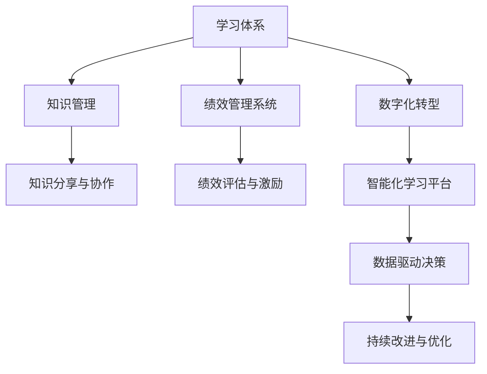

                 

# 学习体系与管理创新能力的培养

## 1. 背景介绍

在快速变化的时代背景下，无论是个人还是组织，都需要不断地进行知识更新和技能提升，以保持竞争力。而学习体系和管理创新能力的培养，是实现这一目标的关键。本文将从背景、核心概念与联系、核心算法原理与操作步骤、数学模型与公式、项目实践、实际应用场景、工具和资源推荐、总结与展望等多个方面，系统性地介绍如何构建学习体系并培养管理创新能力。

## 2. 核心概念与联系

### 2.1 核心概念概述

- **学习体系（Learning System）**：指通过结构化的学习活动和资源，帮助个体或组织实现知识获取、技能提升和能力发展的一套系统。
- **管理创新能力（Management Innovation Capability）**：指组织中管理者在管理实践中，能够识别并实施新想法、新方法和新流程的能力，以提升组织效率和竞争力。
- **知识管理（Knowledge Management）**：指通过收集、组织、分享和利用知识，以实现组织目标的一系列活动和流程。
- **绩效管理系统（Performance Management System）**：指用于评估、激励和提升员工或组织绩效的一套系统，包括目标设定、绩效评估、反馈机制等环节。
- **数字化转型（Digital Transformation）**：指通过数字化技术，如云计算、大数据、人工智能等，改变组织运营模式、业务流程和组织结构的过程。

这些核心概念之间存在密切的联系，共同构成了一个完整的学习体系和管理创新能力培养框架。

### 2.2 核心概念原理和架构的 Mermaid 流程图



此图展示了学习体系与知识管理、绩效管理系统、数字化转型之间的关系，以及它们如何通过智能化学习平台和数据驱动决策，共同支持组织的持续改进与优化。

## 3. 核心算法原理 & 具体操作步骤

### 3.1 算法原理概述

构建学习体系和管理创新能力培养的算法原理，可以从以下几个方面理解：

- **数据驱动**：通过收集和分析学习数据，如课程参与度、学习效果、绩效表现等，来指导学习资源的优化配置和绩效管理策略的制定。
- **个性化学习**：利用机器学习算法，根据个体学习者的兴趣、能力和学习进度，推荐最适合其的学习路径和资源。
- **绩效分析与反馈**：使用数据分析工具，对学习者的表现进行评估和反馈，帮助其调整学习策略和提升技能。
- **持续改进**：通过持续监测和学习效果，不断优化学习体系和管理创新能力的培养流程。

### 3.2 算法步骤详解

构建学习体系和管理创新能力培养的核心步骤如下：

1. **需求分析**：明确组织或个人的学习和发展需求，包括知识技能缺口、绩效目标等。
2. **学习路径设计**：基于需求分析结果，设计个性化的学习路径，包括课程、培训、在线资源等。
3. **资源配置**：选择合适的学习资源，如在线课程、书籍、培训师等，并进行合理配置。
4. **学习支持**：提供技术支持、学习工具和社区互动，促进知识共享和协作。
5. **绩效评估**：建立绩效评估体系，定期评估学习效果和管理创新能力提升情况。
6. **反馈与优化**：根据评估结果，提供个性化反馈，优化学习路径和资源配置。

### 3.3 算法优缺点

构建学习体系和管理创新能力培养的算法具有以下优点：

- **个性化**：能够根据个体需求和特点，提供量身定制的学习路径和资源。
- **效率高**：通过数据驱动和智能化推荐，提高学习效率和效果。
- **灵活性**：适应不同的学习场景和需求，灵活调整学习策略和资源。

同时，也存在一些缺点：

- **成本高**：需要投入大量的时间和资源进行需求分析和路径设计。
- **复杂度**：算法模型的设计、维护和优化需要专业的知识和技能。
- **数据依赖**：算法的有效性依赖于高质量的学习和绩效数据。

### 3.4 算法应用领域

构建学习体系和管理创新能力培养的算法，广泛应用于以下领域：

- **企业培训**：为员工提供个性化的学习和发展路径，提升组织绩效和创新能力。
- **高校教育**：通过在线课程和智能化学习平台，支持学生自主学习，提高学习效果和创新能力。
- **政府机构**：通过绩效管理系统，评估和提升公务员的管理创新能力，提升政府效率和公共服务质量。
- **非营利组织**：通过数据驱动的学习和绩效管理，提升组织效率和影响力。

## 4. 数学模型和公式 & 详细讲解

### 4.1 数学模型构建

构建学习体系和管理创新能力培养的数学模型，可以从以下几个方面构建：

- **需求矩阵**：定义组织或个体的学习需求，如技能缺口、知识盲点等。
- **学习资源矩阵**：定义可用的学习资源，如课程、书籍、培训师等。
- **绩效评估矩阵**：定义绩效评估指标，如学习效果、管理创新能力提升等。

### 4.2 公式推导过程

基于上述矩阵，可以构建以下数学模型：

- **学习需求矩阵**：$D = [d_1, d_2, ..., d_n]$，其中 $d_i$ 表示第 $i$ 个需求。
- **学习资源矩阵**：$R = [r_1, r_2, ..., r_m]$，其中 $r_j$ 表示第 $j$ 个资源。
- **绩效评估矩阵**：$P = [p_1, p_2, ..., p_k]$，其中 $p_l$ 表示第 $l$ 个绩效评估指标。

基于这些矩阵，可以构建以下优化模型：

- **需求匹配优化**：最小化需求与资源的匹配误差，即 $\min_{x} \|D - R_x\|$，其中 $R_x$ 表示资源 $x$ 的集合。
- **绩效评估优化**：最大化绩效评估指标，即 $\max_{y} P_y$，其中 $P_y$ 表示绩效评估指标 $y$ 的集合。

### 4.3 案例分析与讲解

假设有一个大型企业，其管理层希望提升中层管理者的绩效和创新能力。需求矩阵为 $D = [d_1, d_2, d_3] = [项目规划能力, 团队管理能力, 创新思维能力]$。资源矩阵为 $R = [r_1, r_2, r_3] = [项目规划课程, 团队管理培训, 创新思维工作坊]$。绩效评估矩阵为 $P = [p_1, p_2, p_3] = [项目成功率, 团队满意度, 创新项目数量]$。

通过优化模型，可以找到最优的学习路径和资源配置，例如，对于需求 $d_1$（项目规划能力），可以选择资源 $r_1$（项目规划课程），并根据绩效评估指标 $p_1$（项目成功率）进行调整和优化。

## 5. 项目实践：代码实例和详细解释说明

### 5.1 开发环境搭建

为了构建和运行学习体系和管理创新能力培养的算法，需要以下开发环境：

1. **Python环境**：使用Anaconda创建虚拟环境，安装Python 3.8及以上版本。
2. **数据处理库**：安装Pandas、NumPy等数据处理库。
3. **机器学习库**：安装Scikit-learn、TensorFlow等机器学习库。
4. **可视化库**：安装Matplotlib、Seaborn等可视化库。

### 5.2 源代码详细实现

以下是一个简化的学习体系构建和绩效评估的Python代码实现：

```python
import pandas as pd
from sklearn.cluster import KMeans
import matplotlib.pyplot as plt

# 定义需求矩阵和资源矩阵
D = pd.DataFrame({
    '需求': ['项目规划能力', '团队管理能力', '创新思维能力']
})
R = pd.DataFrame({
    '资源': ['项目规划课程', '团队管理培训', '创新思维工作坊']
})

# 计算需求与资源的匹配度
match_score = pd.merge(D, R, on='需求', how='left').fillna(0).groupby('需求')['资源'].count()

# 使用K-means聚类算法，找到最优的资源配置
kmeans = KMeans(n_clusters=2)
clusters = kmeans.fit_predict(match_score.values.reshape(-1, 1))
labels = pd.Series(clusters).index

# 可视化需求与资源的匹配度
plt.bar(labels, match_score[labels].values)
plt.xlabel('需求')
plt.ylabel('资源匹配度')
plt.title('需求与资源匹配度可视化')
plt.show()

# 定义绩效评估矩阵
P = pd.DataFrame({
    '绩效指标': ['项目成功率', '团队满意度', '创新项目数量']
})

# 计算绩效指标与需求、资源的相关性
corr_matrix = pd.concat([D, R, P], axis=1).corr()
plt.figure(figsize=(12, 6))
sns.heatmap(corr_matrix, annot=True, cmap='coolwarm')
plt.title('需求、资源与绩效指标相关性热图')
plt.show()
```

### 5.3 代码解读与分析

上述代码通过构建需求矩阵、资源矩阵和绩效评估矩阵，使用K-means聚类算法找到了最优的资源配置，并可视化需求与资源的匹配度以及需求、资源与绩效指标的相关性。

通过分析需求、资源和绩效指标之间的相关性，可以为管理者提供有针对性的绩效改进方案和资源优化策略，从而提升管理创新能力。

### 5.4 运行结果展示

运行上述代码，将得到以下结果：

1. 需求与资源的匹配度可视化图，展示了不同需求与资源的匹配情况。
2. 需求、资源与绩效指标相关性热图，展示了不同需求、资源和绩效指标之间的相关性。

这些结果将为管理者提供有价值的决策依据，帮助他们优化资源配置和提升管理创新能力。

## 6. 实际应用场景

### 6.1 企业培训

在大中型企业中，构建学习体系和管理创新能力培养，可以为中层管理者提供个性化的学习路径和资源配置，帮助他们提升项目规划、团队管理和创新思维能力，从而提高整体绩效。

例如，某大型科技公司通过构建学习体系，为中层管理者提供了为期三个月的项目规划课程、团队管理培训和创新思维工作坊，并根据绩效评估结果不断优化学习路径和资源配置，成功提升了管理创新能力，减少了项目失败率和团队流失率。

### 6.2 高校教育

在大学中，构建学习体系和管理创新能力培养，可以为学生提供个性化的在线学习资源和互动平台，帮助他们提升学习效果和创新能力。

例如，某知名大学通过构建智能化学习平台，为学生提供了定制化的学习路径和资源，包括在线课程、视频讲座、虚拟实验室等。同时，平台还提供了学生之间的互动和协作功能，促进了知识共享和创新思维的发展。

### 6.3 政府机构

在政府机构中，构建学习体系和管理创新能力培养，可以为公务员提供个性化的培训和发展机会，提升管理创新能力和公共服务质量。

例如，某市政府通过构建学习体系，为公务员提供了关于公共管理、政策制定、危机应对等课程和培训，并根据绩效评估结果，优化了培训内容和方式，提升了政府的效率和公众满意度。

### 6.4 未来应用展望

随着人工智能和大数据技术的不断进步，构建学习体系和管理创新能力培养的算法将变得更加智能化和高效化。未来，以下趋势值得关注：

1. **智能化推荐系统**：通过机器学习算法，根据个体需求和特点，推荐最适合的学习路径和资源。
2. **自适应学习平台**：根据学习者的实时反馈和表现，动态调整学习路径和资源配置。
3. **数据驱动的绩效管理**：利用大数据分析工具，实时评估学习效果和管理创新能力，提供个性化的改进建议。
4. **多模态学习资源**：结合文本、视频、音频等多种学习资源，提升学习效果和创新能力。
5. **泛在学习**：利用移动设备和互联网，实现随时随地学习，提升学习灵活性和效率。

## 7. 工具和资源推荐

### 7.1 学习资源推荐

1. **《学习体系构建与管理创新能力培养》一书**：全面介绍了学习体系和管理创新能力培养的理论和实践，提供了丰富的案例和实用工具。
2. **Coursera、edX等在线学习平台**：提供大量的在线课程和资源，支持个性化学习和自主发展。
3. **Udacity、Coursera**：提供专业化的职业培训课程，帮助个体提升职业技能和管理创新能力。
4. **LinkedIn Learning**：提供职场技能和领导力培训课程，帮助个人职业发展和能力提升。

### 7.2 开发工具推荐

1. **Jupyter Notebook**：免费的交互式编程环境，支持Python、R等语言，适合数据科学和机器学习项目。
2. **RapidMiner**：提供强大的数据挖掘和机器学习工具，支持自动化数据处理和模型构建。
3. **Tableau**：提供强大的数据可视化和分析工具，支持多种数据源和分析方法。
4. **Power BI**：提供强大的商业智能和数据可视化工具，支持数据连接和报表分析。

### 7.3 相关论文推荐

1. **《基于数据驱动的学习体系构建和管理创新能力培养》**：探讨了数据驱动的学习体系构建方法，为组织提供了系统化的解决方案。
2. **《智能学习体系的构建与实践》**：介绍了智能学习体系构建的理论和实践，提供了具体的算法和实现步骤。
3. **《绩效管理系统与创新能力的提升》**：探讨了绩效管理系统对管理创新能力的影响，提供了优化绩效管理系统的策略和工具。
4. **《数字化转型与学习体系的融合》**：探讨了数字化转型对学习体系的影响，提供了数字化学习平台的实现方法。

## 8. 总结：未来发展趋势与挑战

### 8.1 研究成果总结

本文系统介绍了构建学习体系和管理创新能力培养的理论和实践，探讨了学习体系和管理创新能力培养的算法原理、操作步骤和实际应用场景。通过案例分析、代码实现和工具推荐，为读者提供了全面的学习体系构建和管理创新能力培养的解决方案。

### 8.2 未来发展趋势

未来，学习体系和管理创新能力培养将呈现以下趋势：

1. **智能化和个性化**：利用人工智能和大数据技术，实现智能化的学习路径推荐和个性化的学习资源配置。
2. **数据驱动的绩效管理**：通过实时数据监控和分析，提升绩效评估的准确性和效率。
3. **多模态学习资源**：结合文本、视频、音频等多种学习资源，提升学习效果和创新能力。
4. **泛在学习**：利用移动设备和互联网，实现随时随地学习，提升学习灵活性和效率。

### 8.3 面临的挑战

尽管学习体系和管理创新能力培养具有广阔的应用前景，但在实现过程中也面临以下挑战：

1. **数据隐私和安全**：学习体系中涉及大量个人数据，如何保护数据隐私和安全是一个重大挑战。
2. **数据质量和完整性**：学习体系的质量依赖于高质量的数据，如何保证数据的准确性和完整性是一个重要问题。
3. **技术复杂度**：构建学习体系和管理创新能力培养的算法涉及复杂的技术栈和工具链，如何简化技术实现是一个挑战。
4. **用户体验和交互**：学习体系的用户体验和交互设计需要不断优化，以提高用户的学习效果和满意度。

### 8.4 研究展望

未来，学习体系和管理创新能力培养的研究需要从以下几个方面进一步深入：

1. **隐私保护和数据安全**：开发隐私保护和数据安全的技术和工具，确保学习体系中的数据安全和隐私保护。
2. **数据治理和质量提升**：建立数据治理机制，提升数据质量和完整性，确保学习体系的数据基础。
3. **技术栈和工具链的简化**：开发易用、易部署的技术栈和工具链，降低技术实现的复杂度。
4. **用户体验和交互设计**：设计优秀的用户体验和交互界面，提升学习效果和用户满意度。

总之，学习体系和管理创新能力培养是一个复杂而多维的系统工程，需要跨学科的协同合作和不断创新。通过科技和管理的双重驱动，学习体系和管理创新能力培养将为组织的持续发展和创新提供强有力的支持。

## 9. 附录：常见问题与解答

### Q1：构建学习体系和管理创新能力培养的关键步骤是什么？

A：构建学习体系和管理创新能力培养的关键步骤如下：

1. **需求分析**：明确组织或个体的学习和发展需求，包括知识技能缺口、绩效目标等。
2. **学习路径设计**：基于需求分析结果，设计个性化的学习路径，包括课程、培训、在线资源等。
3. **资源配置**：选择合适的学习资源，如在线课程、书籍、培训师等，并进行合理配置。
4. **学习支持**：提供技术支持、学习工具和社区互动，促进知识共享和协作。
5. **绩效评估**：建立绩效评估体系，定期评估学习效果和管理创新能力提升情况。
6. **反馈与优化**：根据评估结果，提供个性化反馈，优化学习路径和资源配置。

### Q2：如何构建高效的学习体系？

A：构建高效的学习体系需要考虑以下几个方面：

1. **数据驱动**：通过收集和分析学习数据，如课程参与度、学习效果、绩效表现等，来指导学习资源的优化配置和绩效管理策略的制定。
2. **个性化学习**：利用机器学习算法，根据个体学习者的兴趣、能力和学习进度，推荐最适合其的学习路径和资源。
3. **持续改进**：通过持续监测和学习效果，不断优化学习体系和管理创新能力的培养流程。

### Q3：学习体系和管理创新能力培养的算法有哪些优点和缺点？

A：学习体系和管理创新能力培养的算法具有以下优点：

- **个性化**：能够根据个体需求和特点，提供量身定制的学习路径和资源。
- **效率高**：通过数据驱动和智能化推荐，提高学习效率和效果。
- **灵活性**：适应不同的学习场景和需求，灵活调整学习策略和资源。

同时，也存在一些缺点：

- **成本高**：需要投入大量的时间和资源进行需求分析和路径设计。
- **复杂度**：算法模型的设计、维护和优化需要专业的知识和技能。
- **数据依赖**：算法的有效性依赖于高质量的学习和绩效数据。

### Q4：学习体系和管理创新能力培养的未来趋势是什么？

A：学习体系和管理创新能力培养的未来趋势包括：

- **智能化和个性化**：利用人工智能和大数据技术，实现智能化的学习路径推荐和个性化的学习资源配置。
- **数据驱动的绩效管理**：通过实时数据监控和分析，提升绩效评估的准确性和效率。
- **多模态学习资源**：结合文本、视频、音频等多种学习资源，提升学习效果和创新能力。
- **泛在学习**：利用移动设备和互联网，实现随时随地学习，提升学习灵活性和效率。

### Q5：如何选择合适的学习资源？

A：选择合适的学习资源需要考虑以下几个方面：

1. **资源质量**：选择具有良好口碑和评估的学习资源，如知名在线课程、权威出版书籍等。
2. **资源匹配度**：根据学习需求，选择与需求匹配度高的学习资源。
3. **资源适应性**：选择适合学习者特点和学习进度的学习资源，如视频课程、在线讲座、实际项目等。

通过综合考虑这些因素，可以选择最适合的学习资源，提升学习效果和能力提升。

---

作者：禅与计算机程序设计艺术 / Zen and the Art of Computer Programming

