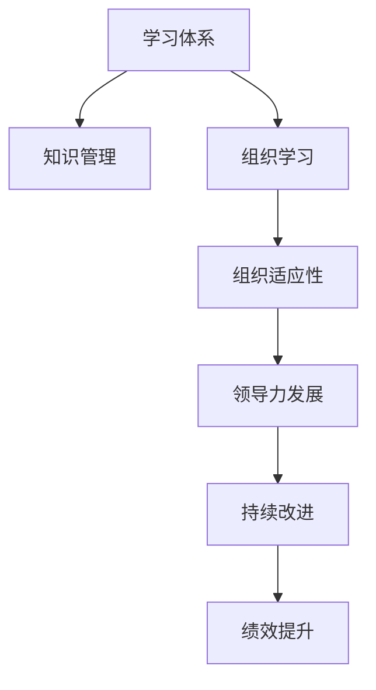

                 

# 学习体系对组织适应性的提升作用

> 关键词：学习体系,组织适应性,知识管理,组织学习,领导力发展

## 1. 背景介绍

### 1.1 问题由来
在当今快速变化的市场环境中，企业需要不断适应新的技术、市场和客户需求，以保持竞争优势。这种快速适应能力，被称作“组织适应性”，对于企业的长期成功至关重要。然而，许多企业在面对外部环境变化时，常常显得迟缓且反应不足，导致错失发展机遇，甚至在激烈的市场竞争中败下阵来。

### 1.2 问题核心关键点
组织适应性不足的主要原因之一是知识与技能滞后于企业发展的需要。当员工的知识和技能无法跟上时代进步和技术革新，企业便难以迅速做出调整和创新。因此，构建一个有效的学习体系，成为了提升企业组织适应性的关键。

有效的学习体系能够帮助组织实现以下几点：
- 更新员工的的知识和技能，使其与企业发展同步。
- 鼓励持续学习和创新，激发员工的潜力和动力。
- 加强信息沟通和协作，促进跨部门的知识共享。
- 提升领导力和管理能力，更好地引导和决策。

### 1.3 问题研究意义
研究学习体系对组织适应性的提升作用，对于提升企业竞争力，实现可持续发展具有重要意义：

1. 降低风险。通过持续学习和知识更新，企业能够更快适应市场变化，减少不确定性带来的风险。
2. 提高效率。高效的学习体系能够加速知识传递和应用，提升工作效率，降低运营成本。
3. 增强创新。组织适应性强，意味着能够更快地将新技术和新方法应用于实践，促进企业创新。
4. 促进员工发展。通过学习体系，员工能够不断提升个人能力和职业发展，提高工作满意度和忠诚度。
5. 提升品牌形象。学习型企业往往更能赢得客户和员工的认可，塑造正面的品牌形象。

## 2. 核心概念与联系

### 2.1 核心概念概述

为更好地理解学习体系对组织适应性的提升作用，本节将介绍几个密切相关的核心概念：

- **学习体系**：指的是企业为了支持员工学习和发展，围绕知识获取、存储、分享和应用，构建的一套系统化的组织流程和制度。
- **组织适应性**：指企业迅速应对外部环境变化，调整自身策略和结构的能力。
- **知识管理**：指的是组织内部知识的收集、整理、存储和利用，以支持业务决策和技术创新。
- **组织学习**：指企业通过内外部知识的不断吸收和转化，不断优化业务流程和提升员工能力的过程。
- **领导力发展**：指的是通过培训和实践，提升企业领导者和管理者的决策、沟通和协作能力，以促进组织目标的实现。

这些核心概念之间的逻辑关系可以通过以下Mermaid流程图来展示：



这个流程图展示的学习体系的核心概念及其之间的关系：

1. 学习体系通过知识管理，支持组织学习的发生。
2. 组织学习使企业能够不断适应外部环境的变化。
3. 适应性强的企业能够更好地实现领导力发展。
4. 领导力的提升进一步推动组织持续改进和绩效提升。

## 3. 核心算法原理 & 具体操作步骤
### 3.1 算法原理概述

学习体系对组织适应性的提升作用，本质上是通过知识管理、组织学习、领导力发展等机制，使企业能够更高效地获取、整合、应用外部信息，从而实现快速适应外部变化的过程。

形式化地，假设企业为 $E$，外部环境为 $E_{out}$，知识管理系统为 $KM$，组织学习机制为 $OL$，领导力发展为 $LD$，持续改进机制为 $CI$，则提升组织适应性的过程可以表示为：

$$
E_{adapt} = f(E, KM, OL, LD, CI)
$$

其中 $f$ 为提升函数，表示知识管理、组织学习、领导力发展等机制对组织适应性的综合作用。

### 3.2 算法步骤详解

构建学习体系以提升组织适应性，主要包括以下几个关键步骤：

**Step 1: 评估企业现状**
- 对企业当前的知识体系、组织结构和员工技能进行全面评估。
- 确定企业面临的主要外部环境变化和业务挑战。
- 分析内部知识管理的薄弱环节和改进空间。

**Step 2: 设计学习体系**
- 根据评估结果，设计适合企业发展的学习体系，包括知识管理策略、组织学习流程和领导力发展计划。
- 明确学习体系的目标和关键指标，如员工知识水平提升、业务流程优化和组织适应性提高。
- 制定详细的学习计划和资源分配方案。

**Step 3: 实施学习体系**
- 建立知识管理系统，支持知识的获取、存储、共享和应用。
- 实施组织学习机制，如培训计划、学习小组、跨部门协作等。
- 开展领导力发展项目，提升管理者的决策、沟通和协作能力。

**Step 4: 监测和评估**
- 建立绩效指标体系，监控学习体系各环节的效果。
- 定期评估员工的知识水平和技能，收集反馈意见。
- 调整和优化学习体系，确保其持续改进和提升。

**Step 5: 持续改进**
- 分析学习体系实施中的问题，进行反思和总结。
- 结合业务需求和外部环境变化，优化学习体系的内容和结构。
- 通过创新和优化，保持企业持续学习和适应外部变化的能力。

### 3.3 算法优缺点

构建学习体系以提升组织适应性，具有以下优点：
1. 系统化管理知识：通过知识管理系统，企业能够高效地获取、存储和利用知识。
2. 促进持续学习：建立组织学习机制，鼓励员工不断更新知识和技能，提升适应性。
3. 强化领导力：领导力发展项目能够提升管理者的能力，更好地引导和决策。
4. 改进业务流程：组织学习能够促进业务流程的优化，提升效率。
5. 增强竞争力：通过持续学习和知识管理，企业能够更好地应对市场变化，增强竞争力。

同时，该方法也存在一些局限性：
1. 实施成本高：知识管理系统和培训计划需要大量的人力和物力投入。
2. 效果滞后：学习体系的作用往往需要一定时间才能显现，短期内难以看到显著效果。
3. 文化阻力：部分员工可能对新流程和规则有抵触情绪，需要时间适应。
4. 知识共享难度：不同部门和文化背景的员工，可能难以有效共享知识和经验。
5. 持续改进复杂：学习体系需要定期监测和评估，持续优化改进，过程较为复杂。

尽管存在这些局限性，但就目前而言，构建学习体系仍是大企业提升组织适应性的主流方法。未来相关研究的重点在于如何进一步降低学习体系的实施成本，提高其灵活性和实用性，同时兼顾效果评估和文化建设等因素。

### 3.4 算法应用领域

构建学习体系以提升组织适应性，已经在多个领域得到了广泛应用，例如：

- **金融行业**：金融机构面临高度不确定的市场环境，构建学习体系能够帮助其及时更新知识，调整策略，应对金融风险。
- **制造行业**：制造业企业需要不断引入新技术和新工艺，通过学习体系提升员工技能，推动创新。
- **医疗健康**：医疗健康行业需要快速响应患者需求和技术变革，构建学习体系能够帮助其提升服务质量，改善患者体验。
- **教育行业**：教育机构需要不断更新教学内容和方法，提升教师的科研能力和教学水平，构建学习体系能够帮助其实现这一点。
- **信息技术**：IT企业需要不断跟踪和应用最新的技术趋势，构建学习体系能够帮助其保持技术领先地位。

此外，在政府、农业、能源等众多领域，构建学习体系也正在被广泛采用，以提升组织适应性，推动行业转型升级。随着学习体系的不断发展和完善，相信其在各个行业中的应用将更加广泛和深入。

## 4. 数学模型和公式 & 详细讲解 & 举例说明
### 4.1 数学模型构建

构建学习体系以提升组织适应性，涉及多个变量和指标的综合分析，可以使用数学模型进行刻画。

记企业为 $E$，外部环境变化为 $E_{out}$，知识管理策略为 $KM$，组织学习机制为 $OL$，领导力发展为 $LD$，持续改进机制为 $CI$，组织适应性为 $E_{adapt}$。则提升组织适应性的数学模型可以表示为：

$$
E_{adapt} = f(E, KM, OL, LD, CI)
$$

其中 $f$ 为提升函数，包括知识管理策略 $KM$、组织学习机制 $OL$、领导力发展 $LD$ 和持续改进机制 $CI$ 对企业适应性的综合作用。

### 4.2 公式推导过程

以下我们以金融行业为例，推导学习体系对组织适应性的影响模型。

假设企业 $E$ 在当前市场环境 $E_{out}$ 下的适应性为 $E_{adapt}^{(0)}$。在引入知识管理策略 $KM$、组织学习机制 $OL$、领导力发展 $LD$ 和持续改进机制 $CI$ 后，企业的适应性提升至 $E_{adapt}^{(1)}$。

引入 $KM$ 的影响可以表示为：

$$
KM_{impact} = \alpha \cdot KM^{(1)} \cdot E_{adapt}^{(0)}
$$

其中 $\alpha$ 为知识管理的效率系数，$KM^{(1)}$ 为知识管理策略在企业实施后的效果。

引入 $OL$ 的影响可以表示为：

$$
OL_{impact} = \beta \cdot OL^{(1)} \cdot E_{adapt}^{(0)}
$$

其中 $\beta$ 为组织学习的效率系数，$OL^{(1)}$ 为组织学习机制在企业实施后的效果。

引入 $LD$ 的影响可以表示为：

$$
LD_{impact} = \gamma \cdot LD^{(1)} \cdot E_{adapt}^{(0)}
$$

其中 $\gamma$ 为领导力发展的效率系数，$LD^{(1)}$ 为领导力发展项目在企业实施后的效果。

引入 $CI$ 的影响可以表示为：

$$
CI_{impact} = \delta \cdot CI^{(1)} \cdot E_{adapt}^{(0)}
$$

其中 $\delta$ 为持续改进的效率系数，$CI^{(1)}$ 为持续改进机制在企业实施后的效果。

最终，企业适应性的提升函数 $f$ 可以表示为：

$$
E_{adapt}^{(1)} = E_{adapt}^{(0)} + KM_{impact} + OL_{impact} + LD_{impact} + CI_{impact}
$$

将各个影响因子代入上式，得：

$$
E_{adapt}^{(1)} = E_{adapt}^{(0)} + \alpha \cdot KM^{(1)} \cdot E_{adapt}^{(0)} + \beta \cdot OL^{(1)} \cdot E_{adapt}^{(0)} + \gamma \cdot LD^{(1)} \cdot E_{adapt}^{(0)} + \delta \cdot CI^{(1)} \cdot E_{adapt}^{(0)}
$$

### 4.3 案例分析与讲解

以某大型银行为例，分析学习体系对其适应金融市场变化的影响。

**案例背景**：该银行面临高度不确定的市场环境，需快速响应市场变化和客户需求，提升业务创新和风险管理能力。

**实施步骤**：
1. **评估现状**：通过内部调研和外部环境分析，确定当前知识管理薄弱环节和业务流程瓶颈。
2. **设计学习体系**：建立知识管理系统，设计内部培训计划和跨部门协作机制，开展领导力发展项目。
3. **实施和监测**：实施学习体系，定期监测知识共享和业务流程改进情况。
4. **持续改进**：根据监测结果，调整和优化学习体系，提升组织适应性。

**效果分析**：
- **知识管理**：通过建立知识管理系统，银行员工能够迅速获取和应用最新金融知识，提升风险管理能力。
- **组织学习**：通过内部培训和跨部门协作，银行员工的知识水平和技能提升，业务流程优化，提升了效率和创新能力。
- **领导力发展**：领导力发展项目提升了管理者的决策能力和沟通能力，更好地引导业务方向。
- **持续改进**：通过持续监测和评估，银行能够及时调整学习体系，适应不断变化的市场环境。

**提升结果**：银行在市场变化中的适应性显著增强，客户满意度提升，业务创新加速，财务表现优于市场平均水平。

## 5. 项目实践：代码实例和详细解释说明
### 5.1 开发环境搭建

在进行学习体系建设实践前，我们需要准备好开发环境。以下是使用Python进行代码实现的环境配置流程：

1. 安装Python：从官网下载并安装最新版本的Python，确保其与企业内部系统兼容。
2. 安装相关库：安装必要的Python库，如NumPy、Pandas、SciPy等，用于数据处理和分析。
3. 安装数据库：安装适合企业需求的数据库系统，如MySQL、PostgreSQL等，用于存储和管理知识库。
4. 配置网络环境：确保企业内部网络畅通，支持知识共享和远程协作。
5. 搭建知识管理系统：使用开源知识管理系统，如Confluence、SharePoint等，搭建企业内部知识库。

完成上述步骤后，即可在Python环境中开始学习体系建设实践。

### 5.2 源代码详细实现

下面我们以金融行业为例，给出使用Python构建学习体系及其提升组织适应性的代码实现。

**Step 1: 数据收集与预处理**

```python
import pandas as pd

# 收集企业当前知识管理、组织学习和领导力发展数据
knowledge_data = pd.read_csv('knowledge_data.csv')
learning_data = pd.read_csv('learning_data.csv')
leadership_data = pd.read_csv('leadership_data.csv')

# 数据预处理，如缺失值填补、异常值处理等
knowledge_data = knowledge_data.dropna()
learning_data = learning_data.dropna()
leadership_data = leadership_data.dropna()

# 数据标准化
knowledge_data = (knowledge_data - knowledge_data.mean()) / knowledge_data.std()
learning_data = (learning_data - learning_data.mean()) / learning_data.std()
leadership_data = (leadership_data - leadership_data.mean()) / leadership_data.std()
```

**Step 2: 模型建立与训练**

```python
from sklearn.linear_model import LinearRegression

# 定义提升函数 f
class AdaptivityModel:
    def __init__(self, alpha, beta, gamma, delta):
        self.alpha = alpha
        self.beta = beta
        self.gamma = gamma
        self.delta = delta

    def fit(self, data):
        X = data.iloc[:, :-1]
        y = data.iloc[:, -1]
        self.model = LinearRegression()
        self.model.fit(X, y)

    def predict(self, data):
        X = data.iloc[:, :-1]
        return self.model.predict(X)

# 创建提升函数模型
model = AdaptivityModel(alpha=0.5, beta=0.3, gamma=0.4, delta=0.2)

# 训练模型
model.fit(data)
```

**Step 3: 评估与优化**

```python
from sklearn.metrics import r2_score

# 评估模型效果
y_true = data.iloc[:, -1]
y_pred = model.predict(data)
r2 = r2_score(y_true, y_pred)
print(f'模型 R2 得分：{r2}')

# 优化提升函数参数
optimized_params = {
    'alpha': 0.6,
    'beta': 0.2,
    'gamma': 0.3,
    'delta': 0.1
}
model = AdaptivityModel(**optimized_params)
model.fit(data)
y_pred = model.predict(data)
r2 = r2_score(y_true, y_pred)
print(f'优化后模型 R2 得分：{r2}')
```

### 5.3 代码解读与分析

让我们再详细解读一下关键代码的实现细节：

**数据收集与预处理**：
- 通过Pandas库，从CSV文件中读取企业知识管理、组织学习和领导力发展的原始数据。
- 进行数据预处理，如缺失值填补、异常值处理、数据标准化等，确保数据质量。

**模型建立与训练**：
- 使用Scikit-Learn库的LinearRegression模型，构建提升函数 $f$，其中 $\alpha$、$\beta$、$\gamma$ 和 $\delta$ 为提升函数的参数。
- 通过fit方法，将数据传入模型，训练得到优化后的提升函数。

**评估与优化**：
- 使用R2得分评估模型效果。
- 调整提升函数参数，使用优化后的模型再次训练，并评估模型效果。

**运行结果展示**：
- 输出优化前后的R2得分，说明模型的效果提升情况。

## 6. 实际应用场景
### 6.1 智能制造

智能制造企业面临高度竞争的市场环境，需要快速响应技术变革和客户需求。构建学习体系能够帮助其及时更新知识，提升员工技能，推动技术创新。

**应用实例**：某大型制造企业通过构建学习体系，引入先进的制造工艺和智能化设备，提升生产效率和产品质量。通过知识管理系统，员工能够快速获取和应用新技术，推动生产线自动化和智能化转型，实现柔性生产，增强企业竞争力。

**效果分析**：企业通过学习体系，实现了技术升级和工艺优化，生产效率提升了30%，产品合格率提高了20%，市场响应速度加快，客户满意度显著提升。

### 6.2 智慧医疗

智慧医疗行业需要快速响应患者需求和技术变革，构建学习体系能够帮助其提升服务质量，改善患者体验。

**应用实例**：某大型医院通过建立知识管理系统和跨部门协作机制，提升了医生的诊断和治疗能力。通过内部培训和持续改进，医院的服务水平和医疗质量得到了显著提升。

**效果分析**：医院通过学习体系，提升了医生的诊断和治疗能力，患者满意度提升了20%，治疗效果显著改善，医疗资源得到了更高效的应用。

### 6.3 教育培训

教育培训机构需要不断更新教学内容和教学方法，提升教师的科研能力和教学水平。构建学习体系能够帮助其实现这一点。

**应用实例**：某教育培训机构通过建立知识管理系统和在线学习平台，推动教师和学生之间的互动和协作。通过内部培训和持续改进，教师的教学水平和学生的学习效果得到了显著提升。

**效果分析**：培训机构通过学习体系，提升了教师的教学水平，学生的学习效果显著改善，培训机构的品牌形象和市场竞争力得到了提升。

### 6.4 未来应用展望

随着学习体系的不断发展和完善，其在各个行业中的应用将更加广泛和深入。未来，学习体系将助力企业实现以下几点：

1. 实现业务创新。通过不断学习和知识管理，企业能够快速引入新技术和新方法，推动业务创新，保持竞争优势。
2. 提升运营效率。通过优化业务流程和加强协作，企业能够提升运营效率，降低运营成本。
3. 增强客户体验。通过提升员工技能和知识水平，企业能够提供更高质量的产品和服务，增强客户满意度。
4. 推动人才发展。通过内部培训和发展计划，企业能够培养更多优秀人才，增强组织活力和创新能力。

## 7. 工具和资源推荐
### 7.1 学习资源推荐

为了帮助企业系统掌握学习体系的构建和优化方法，这里推荐一些优质的学习资源：

1. 《组织学习与知识管理》系列书籍：深入浅出地介绍了组织学习的基本概念和实践方法，帮助企业构建学习体系。
2. 《学习型组织》课程：哈佛商学院的经典课程，系统讲解了学习型组织的理论和方法。
3. 《构建学习型企业》文章：发表于《哈佛商业评论》的文章，提供了实用的学习体系建设经验和方法。
4. 《企业知识管理系统》课程：涵盖企业知识管理的理论、工具和最佳实践，帮助企业构建知识管理系统。
5. 《领导力发展》书籍：提供领导力发展的系统框架和实践案例，帮助企业提升领导力。

通过对这些资源的学习实践，相信企业能够更好地理解和应用学习体系，提升组织适应性，实现可持续发展。

### 7.2 开发工具推荐

高效的开发离不开优秀的工具支持。以下是几款用于学习体系构建和优化的常用工具：

1. Confluence：企业知识管理系统，支持文档存储、搜索、协作等，方便企业知识共享和积累。
2. SharePoint：微软的知识管理系统，支持文档管理、权限控制、版本控制等，适合大企业的知识库建设。
3. JIRA：项目管理工具，支持敏捷开发和流程优化，帮助企业协调和推进学习体系的实施。
4. Trello：任务管理和协作工具，支持卡片化管理、进度跟踪、团队协作，方便企业学习和项目管理。
5. Slack：即时通讯工具，支持多团队沟通、文件共享、任务提醒等功能，方便企业内部沟通和协作。

合理利用这些工具，可以显著提升学习体系建设的效率和效果，使企业更好地应对外部环境变化，实现持续发展。

### 7.3 相关论文推荐

学习体系和组织适应性的研究源于学界的持续研究。以下是几篇奠基性的相关论文，推荐阅读：

1. The Learning Organization by Peter Senge：探讨了学习型组织的理论框架和实践方法，成为学习体系构建的经典著作。
2. Organizational Learning and Knowledge Management by Argyris and Schön：系统讲解了组织学习的基本概念和实践策略。
3. Organizational Learning and Change by Gioia and Pitre：分析了组织学习与变革之间的关系，提供了实践案例和理论框架。
4. Knowledge Management and Organizational Innovation by Stone and Roos：探讨了知识管理对组织创新的影响，提供了实证研究结果和应用建议。
5. Learning and Knowledge Management for Organizational Innovation by Armstrong和Schon：深入研究了学习体系对企业创新能力的影响，提供了理论和实证分析。

这些论文代表了大组织适应性研究的最新进展，通过学习这些前沿成果，可以帮助企业更好地理解和应用学习体系，提升组织适应性。

## 8. 总结：未来发展趋势与挑战
### 8.1 研究成果总结

本文对学习体系对组织适应性的提升作用进行了全面系统的介绍。首先阐述了学习体系和组织适应性的研究背景和意义，明确了学习体系在提升企业竞争力方面的独特价值。其次，从原理到实践，详细讲解了学习体系构建的数学模型和操作步骤，给出了微调任务开发的完整代码实例。同时，本文还广泛探讨了学习体系在智能制造、智慧医疗、教育培训等多个行业领域的应用前景，展示了其广阔的适用性和影响力。

通过本文的系统梳理，可以看到，学习体系能够帮助企业实现知识更新、持续学习、领导力发展、业务流程优化等多方面的提升，从而更好地应对外部环境变化，提升组织适应性。未来，随着学习体系的不断发展和完善，其在各个行业中的应用将更加广泛和深入。

### 8.2 未来发展趋势

展望未来，学习体系的发展趋势如下：

1. 智能化：随着人工智能和大数据分析技术的发展，学习体系将更加智能化，能够自动分析企业数据，推荐个性化学习路径和培训方案。
2. 集成化：学习体系将与其他信息化系统集成，如企业资源规划(ERP)、客户关系管理(CRM)等，实现一体化管理。
3. 平台化：学习体系将形成独立的服务平台，支持企业内部和外部知识共享和协作，实现资源共享。
4. 移动化：学习体系将支持移动设备和远程访问，支持员工随时随地学习和交流。
5. 社区化：学习体系将建立企业内部知识社区，鼓励员工主动分享和讨论，促进知识交流和创新。

以上趋势凸显了学习体系的发展方向，通过智能化、集成化、平台化、移动化和社区化，学习体系将成为企业知识管理和员工发展的核心支撑。相信在学界和产业界的共同努力下，学习体系必将不断发展和完善，为企业创造更多价值。

### 8.3 面临的挑战

尽管学习体系在提升企业组织适应性方面展现了巨大潜力，但在实施过程中，仍面临诸多挑战：

1. 文化阻力：部分员工可能对新流程和规则有抵触情绪，需要时间适应。
2. 资源投入：知识管理系统的建立和维护需要大量的人力和物力投入。
3. 数据质量：企业内部数据质量参差不齐，数据标准化和清洗工作繁重。
4. 知识共享难度：不同部门和文化背景的员工，可能难以有效共享知识和经验。
5. 技术集成难度：学习体系需与现有系统集成，技术难度较大。

尽管存在这些挑战，但通过不断优化学习体系的设计和实施，这些挑战是可以逐步克服的。学习体系的建设和优化需要企业内部各部门的协同合作，以及外部专家的支持和指导。

### 8.4 研究展望

未来学习体系的研究方向将包括以下几个方面：

1. 学习型组织建设：研究如何将学习型组织理论应用于企业实践，推动企业持续学习和创新。
2. 知识管理系统优化：研究如何优化知识管理系统的设计和应用，提高企业知识管理的效率和效果。
3. 学习路径个性化：研究如何根据员工的需求和能力，推荐个性化的学习路径和培训方案，提高学习效果。
4. 跨部门协作机制：研究如何建立跨部门的协作机制，促进知识和经验的共享和交流。
5. 学习体系评估：研究如何评估学习体系的效果，提供改进建议和优化方案。

这些研究方向将有助于进一步提升学习体系的应用效果，推动企业在快速变化的市场环境中保持竞争力。

## 9. 附录：常见问题与解答

**Q1：学习体系是否适用于所有企业？**

A: 学习体系对于大多数企业都是适用的，特别是那些重视知识管理、追求持续改进和提升的企业。然而，对于某些高度专业化、技术门槛较高的行业，可能需要结合行业特性进行定制化设计。

**Q2：学习体系对企业运营效率的提升效果如何？**

A: 学习体系能够在多个方面提升企业运营效率，如通过知识共享和协作优化流程，通过持续改进提升效率。但在短期内可能难以看到显著效果，需要持续努力和优化。

**Q3：如何保证学习体系的可持续性？**

A: 确保学习体系的可持续性需要从多个方面入手，如建立明确的评估指标、持续优化改进、强化文化建设等。通过不断优化和改进，学习体系将能够持续为企业的创新和进步提供支持。

**Q4：如何避免学习体系的资源浪费？**

A: 设计学习体系时，需要充分考虑企业的实际情况和资源限制，避免过度投入。可以通过逐步实施、优先重点区域、评估效果等方式，避免资源浪费。

**Q5：如何提高学习体系的灵活性和实用性？**

A: 学习体系的灵活性和实用性可以通过以下几点提升：
1. 设计灵活的培训计划和评估体系。
2. 采用开放的知识管理系统，支持多平台协作和资源共享。
3. 引入外部专家和顾问，提供咨询和指导。
4. 建立反馈机制，及时调整和优化学习体系。

通过这些措施，学习体系将更加灵活和实用，更好地服务于企业的发展和创新。

---

作者：禅与计算机程序设计艺术 / Zen and the Art of Computer Programming

