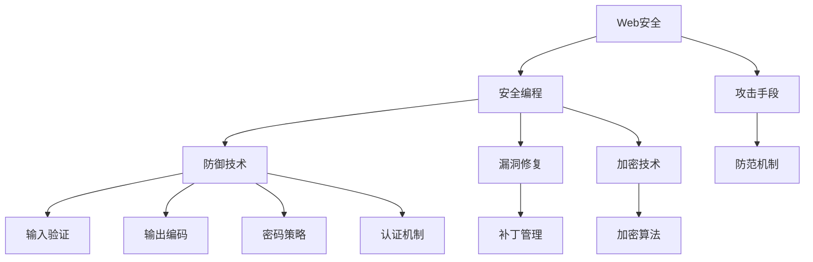

                 

# 安全编程实践：防御常见Web攻击

> 关键词：Web安全, 网络攻击, 安全编程, 防御技术, 漏洞修复, 加密技术

## 1. 背景介绍

在当今互联网时代，Web应用程序已成为各类网络攻击的主要目标。随着Web应用的普及和复杂度的提高，常见的Web攻击手段也越来越多，如SQL注入、XSS、CSRF等。安全编程实践已成为保障Web应用安全的重要环节。

Web攻击的常见手段包括：

- SQL注入：攻击者通过恶意SQL语句注入数据库，获取敏感信息或执行非法操作。
- XSS（跨站脚本攻击）：攻击者通过注入恶意脚本到Web页面中，窃取用户会话信息，实施钓鱼攻击等。
- CSRF（跨站请求伪造）：攻击者伪造合法请求，冒充用户执行非法操作。
- 文件上传漏洞：攻击者通过上传恶意文件，执行远程代码执行（RCE）等攻击。
- 认证和授权漏洞：如弱密码、未授权访问等，使得攻击者能够轻易获得系统访问权限。
- 中间件漏洞：如Spring框架的XML注入、Web逻辑漏洞等。

通过安全编程实践，我们可以有效地预防和应对这些攻击，保障Web应用程序的安全性和可靠性。

## 2. 核心概念与联系

### 2.1 核心概念概述

为更好地理解安全编程实践和防御常见Web攻击，本节将介绍几个密切相关的核心概念：

- Web安全（Web Security）：指通过安全机制和技术手段，保护Web应用程序免受各类网络攻击的过程。
- 安全编程（Secure Coding）：指在Web开发过程中，遵循安全规范和最佳实践，防范代码注入、跨站脚本等攻击的手段。
- 攻击手段（Attack Techniques）：如SQL注入、XSS、CSRF等，是Web安全防护的重点。
- 防御技术（Defense Techniques）：包括输入验证、输出编码、密码策略、认证机制等，是安全编程的基础。
- 漏洞修复（Vulnerability Patching）：通过更新程序和补丁，修补已知的漏洞，提高Web应用的安全性。
- 加密技术（Encryption Technology）：通过加密算法保护数据的机密性和完整性，如SSL/TLS协议、哈希算法等。

这些核心概念之间的逻辑关系可以通过以下Mermaid流程图来展示：



这个流程图展示了大语言模型的核心概念及其之间的关系：

1. Web安全是保护Web应用程序的核心目标。
2. 安全编程是实现Web安全的具体手段。
3. 攻击手段是Web安全的常见威胁。
4. 防御技术是安全编程的基础框架。
5. 漏洞修复和加密技术是提升Web应用安全性的关键技术。
6. 防范机制、输入验证、输出编码、密码策略、认证机制等，是实现Web安全的具体手段。

这些概念共同构成了Web安全防护的完整框架，使得开发者能够全面掌握安全编程的技巧和方法。

## 3. 核心算法原理 & 具体操作步骤

### 3.1 算法原理概述

基于Web安全的防御技术，本质上是一个预防和应对网络攻击的综合性策略。其核心思想是：在Web应用开发过程中，通过一系列的安全编程实践，构建起防范各种攻击的防御体系。具体来说，包括但不限于：

- 输入验证：确保所有输入数据都是预期的格式和范围。
- 输出编码：避免攻击者利用输出的数据执行恶意代码。
- 密码策略：设定强密码规则，防止弱密码被暴力破解。
- 认证机制：确保用户身份的真实性和完整性。
- 权限控制：根据用户身份，限制其访问权限。
- 加密技术：保护数据的机密性和完整性。
- 定期更新和补丁管理：修复已知漏洞，提升Web应用的安全性。

### 3.2 算法步骤详解

基于Web安全的防御技术，一般包括以下几个关键步骤：

**Step 1: 设计安全架构**
- 确定Web应用的安全需求和目标。
- 设计安全架构，包括身份认证、权限控制、数据加密等关键组件。
- 选择合适的安全框架和工具，如Spring Security、OWASP ESAPI等。

**Step 2: 实施安全编程实践**
- 遵循安全编程规范，如OWASP Top 10，定期进行代码审计。
- 实施输入验证，限制输入数据类型和长度，防止SQL注入、XSS等攻击。
- 使用输出编码技术，如HTML实体编码，避免恶意脚本注入。
- 设计强密码策略，防止弱密码被暴力破解。
- 实现认证和授权机制，如OAuth2、JWT等，确保用户身份的真实性和权限控制。

**Step 3: 加密和数据保护**
- 使用SSL/TLS协议，保护数据传输的安全性。
- 采用哈希算法，对敏感数据进行加密存储。
- 使用数字签名，验证数据的完整性和真实性。

**Step 4: 漏洞检测和修复**
- 定期进行漏洞扫描和安全测试，如使用OWASP ZAP、Burp Suite等工具。
- 根据漏洞扫描结果，及时更新和修复程序。
- 遵循补丁管理策略，确保及时应用安全补丁。

**Step 5: 监控和响应**
- 实时监控Web应用的安全状态，使用日志审计、异常检测等技术。
- 在发现异常情况时，及时采取应急响应措施，如封锁IP、重置密码等。
- 定期进行安全演练，提高安全团队的反应速度和应急处理能力。

以上是基于Web安全的防御技术的一般流程。在实际应用中，还需要根据具体的业务需求和安全威胁，灵活设计和优化防御策略。

### 3.3 算法优缺点

基于Web安全的防御技术，具有以下优点：
1. 系统性：通过全面的安全编程实践，可以系统地防范各类攻击手段。
2. 主动性：通过定期漏洞扫描和补丁管理，能够主动发现和修复已知漏洞，提升安全防护能力。
3. 通用性：适用于各类Web应用场景，如电商、社交、政府等，具有广泛的适用性。
4. 可扩展性：安全架构和工具可以灵活扩展和定制，适应不同的业务需求和安全场景。

同时，该方法也存在一定的局限性：
1. 复杂性：设计和实施安全编程实践，需要一定的技术储备和专业知识。
2. 维护成本：定期的漏洞扫描和补丁管理，需要持续的投入和维护。
3. 技术依赖：依赖于安全框架和工具，需要熟悉其功能和使用方法。
4. 静态防护：安全机制和策略，无法应对动态和未知的攻击手段。

尽管存在这些局限性，但就目前而言，基于Web安全的防御技术仍是最主流的安全防护范式。未来相关研究的重点在于如何进一步简化安全编程实践，提高安全防护的主动性和灵活性，同时兼顾安全性和业务效率。

### 3.4 算法应用领域

基于Web安全的防御技术，在Web应用开发和运维过程中得到了广泛应用，覆盖了几乎所有常见的Web应用场景，例如：

- 电商平台：如淘宝、京东、亚马逊等，保障用户数据和交易安全。
- 社交网络：如微信、微博、Facebook等，防范社交诈骗和数据泄露。
- 政府系统：如电子政务、税务、社保等，保障公民个人信息和政府数据安全。
- 金融服务：如银行、证券、保险等，保障用户资金和账户安全。
- 在线教育：如Coursera、edX等，防范学生隐私和教学数据泄露。
- 医疗健康：如电子病历、健康档案等，保护患者隐私和医疗数据安全。
- 在线娱乐：如视频、游戏等，防范版权侵犯和用户数据盗取。

除了上述这些经典应用外，Web安全的防御技术还被创新性地应用到更多场景中，如智能合约、区块链、物联网等，为Web应用安全带来新的思路和方法。

## 4. 数学模型和公式 & 详细讲解 & 举例说明

### 4.1 数学模型构建

基于Web安全的防御技术，涉及到多个数学模型和公式。以下是几个关键模型的构建：

- 输入验证模型：
  - 验证函数：$f(x) = \begin{cases} 
    0 & \text{if } x \in A \\
    1 & \text{otherwise}
  \end{cases}$
  其中 $A$ 为预期输入数据集合。
  
- 输出编码模型：
  - 编码函数：$g(x) = \text{HTML实体编码}(x)$
  - 解码函数：$h(x) = \text{实体解码}(x)$

- 密码强度模型：
  - 密码评分函数：$s(\text{password}) = \sum_{i=1}^{n} c_i \cdot v_i(\text{password})$
  - 评分标准：$c_i$ 为权重，$v_i(\text{password})$ 为密码强度函数，如密码长度、复杂度等。

- 认证机制模型：
  - 认证函数：$\text{Auth}(\text{username}, \text{password}) = \begin{cases} 
    \text{true} & \text{if } \text{user}(\text{username}) = \text{hash}(\text{password}) \\
    \text{false} & \text{otherwise}
  \end{cases}$
  其中 $\text{user}(\text{username})$ 为用户数据库中的用户名密码映射，$\text{hash}(\text{password})$ 为哈希函数对密码的加密结果。

### 4.2 公式推导过程

以下我们以密码强度模型为例，推导密码评分函数的计算公式。

假设密码长度为 $n$，包含数字 $d$、大小写字母 $l$、特殊字符 $s$，密码强度评分函数为：

$$
s(\text{password}) = c_1 \cdot \log(n) + c_2 \cdot d + c_3 \cdot l + c_4 \cdot s
$$

其中 $c_i$ 为权重，$\log$ 为自然对数。将公式展开得：

$$
s(\text{password}) = c_1 \cdot \log(n) + c_2 \cdot \sum_{i=1}^{n} d_i + c_3 \cdot \sum_{i=1}^{n} l_i + c_4 \cdot \sum_{i=1}^{n} s_i
$$

其中 $d_i = 1$ 当字符为数字时，$0$ 否则；$l_i$ 和 $s_i$ 同理。

通过定义密码评分函数，可以评估不同密码的强度，帮助用户设定强密码规则。

### 4.3 案例分析与讲解

以SQL注入为例，分析如何通过安全编程实践防范该攻击：

**Step 1: 输入验证**
- 在输入数据中，通过正则表达式或预定义的规范，确保数据符合预期格式和范围。如限制长度、类型、格式等。

**Step 2: 输出编码**
- 对输入数据进行HTML实体编码，避免恶意脚本注入。如将特殊字符转换为HTML实体。

**Step 3: 数据库查询**
- 使用参数化查询或预编译语句，防止SQL注入。如使用JDBC的PreparedStatement，使用$符号代替变量。

**Step 4: 错误处理**
- 对于异常情况，避免将错误信息直接返回给用户，避免泄露系统敏感信息。如使用日志记录错误信息，返回统一的错误提示。

通过以上步骤，可以有效防范SQL注入攻击，保护数据库和用户数据安全。

## 5. 项目实践：代码实例和详细解释说明

### 5.1 开发环境搭建

在进行Web安全实践前，我们需要准备好开发环境。以下是使用Java进行Spring Boot开发的环境配置流程：

1. 安装Java JDK：从官网下载并安装Java JDK，用于开发Web应用程序。
2. 安装Maven：从官网下载并安装Maven，用于项目构建和管理依赖。
3. 创建Maven项目：在IDE中创建Maven项目，配置pom.xml文件。
4. 安装Spring Boot：使用Maven插件安装Spring Boot，配置application.properties文件。
5. 安装依赖库：通过pom.xml文件依赖Spring Security、JWT等安全框架和工具。

完成上述步骤后，即可在Maven环境中开始Web安全实践。

### 5.2 源代码详细实现

这里我们以Spring Boot中的JWT认证为例，给出使用Spring Security的代码实现。

首先，定义用户实体类：

```java
@Entity
@Table(name = "users")
public class User {
    @Id
    @GeneratedValue(strategy = GenerationType.IDENTITY)
    private Long id;

    @Column(unique = true)
    private String username;

    @Column
    private String password;

    // getters and setters
}
```

然后，定义用户认证服务：

```java
@Service
public class JwtUserDetailsService implements UserDetailsService {
    @Autowired
    private UserRepository userRepository;

    @Override
    public UserDetails loadUserByUsername(String username) throws UsernameNotFoundException {
        User user = userRepository.findByUsername(username);
        if (user == null) {
            throw new UsernameNotFoundException("User not found with username: " + username);
        }
        return new JwtUser(user);
    }
}
```

接着，配置JWT认证和授权：

```java
@Configuration
@EnableWebSecurity
public class SecurityConfig extends WebSecurityConfigurerAdapter {
    @Autowired
    private JwtUserDetailsService jwtUserDetailsService;

    @Override
    protected void configure(HttpSecurity http) throws Exception {
        http.csrf().disable();
        http.authorizeRequests()
            .antMatchers("/public/**").permitAll()
            .anyRequest().authenticated()
            .and()
            .exceptionHandling().accessDeniedPage("/403");
        
        http.oauth2Login()
            .loginPage("/login")
            .and()
            .defaultSuccessPage("/home");
        
        http.sessionManagement().sessionCreationPolicy(SessionCreationPolicy.STATELESS);
    }

    @Override
    protected void configure(AuthenticationManagerBuilder auth) throws Exception {
        auth.oauth2Login().and().jwtAuthentication().jwtAuthenticationConverter(new JwtUserDetailsServiceConverter(jwtUserDetailsService));
    }
}
```

最后，实现JWT认证的自定义转换：

```java
@Component
public class JwtUserDetailsServiceConverter implements JwtUserDetailsConverter {
    @Autowired
    private JwtUserDetailsService jwtUserDetailsService;

    @Override
    public UserDetails convert(JwtAuthenticationToken authentication) {
        String username = ((JwtToken) authentication.getCredentials()).getTokenValue();
        UserDetails userDetails = jwtUserDetailsService.loadUserByUsername(username);
        return userDetails;
    }
}
```

这样，便完成了JWT认证的实现。开发者可以根据业务需求，进一步细化安全配置和验证逻辑，确保Web应用的安全性。

### 5.3 代码解读与分析

让我们再详细解读一下关键代码的实现细节：

**User类**：
- 定义了用户实体类，包含id、username、password等属性，并使用了JPA注解进行映射。

**JwtUserDetailsService类**：
- 实现了UserDetailsService接口，用于加载用户信息。
- 在loadUserByUsername方法中，根据用户名从数据库中查询用户信息，如果用户不存在，则抛出UsernameNotFoundException异常。
- 返回一个JwtUser对象，继承自UserDetails接口，包含JWT的解码信息。

**SecurityConfig类**：
- 实现了WebSecurityConfigurerAdapter接口，用于配置Spring Security的各个组件。
- 在configure方法中，首先禁用CSRF防护，允许所有公共请求（/public/**）访问。
- 对于其他请求，要求必须通过OAuth2认证，未授权时返回403错误。
- 配置JWT登录页和成功跳转页。
- 使用Sessionless方式管理会话，避免CSRF攻击。
- 在configure方法中，使用OAuth2LoginFilter处理JWT认证。
- 在configureAuth方法中，配置JWT认证转换器。

**JwtUserDetailsServiceConverter类**：
- 实现了JwtUserDetailsConverter接口，用于将JWT解码为用户信息。
- 在convert方法中，从JWT的tokenValue中获取用户名，调用jwtUserDetailsService.loadUserByUsername方法获取用户信息，返回UserDetails对象。

通过以上步骤，Spring Boot便实现了JWT认证功能，开发者可以根据实际需求进一步优化和扩展。

### 5.4 运行结果展示

运行Spring Boot应用程序后，访问/login页面输入正确的用户名和密码，系统将生成JWT令牌并返回登录成功的消息。用户访问/protected页面时，需要携带JWT令牌进行身份验证。

通过JWT认证，开发者可以实现用户身份的快速、高效、安全验证，同时简化登录逻辑，提高系统的安全性。

## 6. 实际应用场景
### 6.1 智能合约

在智能合约中，Web安全防护尤为重要。智能合约通常部署在区块链上，面临各类攻击风险，如重放攻击、回滚攻击、拒绝服务攻击等。

通过安全编程实践，智能合约可以避免常见的Web攻击，如SQL注入、XSS等。例如，在Solidity语言中，可以使用require函数进行输入验证，使用payable关键字控制资金流向，使用Merkle Tree等技术保护数据完整性。

### 6.2 区块链

区块链应用也需要面对Web安全攻击，如智能合约漏洞、交易回滚等。Web安全防护的原理和方法，在区块链上同样适用。例如，在比特币网络中，使用公钥和私钥加密技术，防止交易被篡改。

### 6.3 物联网

物联网设备面临各类攻击风险，如拒绝服务攻击、僵尸网络攻击等。Web安全防护的方法，如输入验证、输出编码等，也可以应用于物联网设备。

例如，物联网设备可以通过认证机制，限制外部访问，防止未授权操作。使用加密算法，保护数据传输和存储的安全性。

## 7. 工具和资源推荐
### 7.1 学习资源推荐

为了帮助开发者系统掌握Web安全编程的理论基础和实践技巧，这里推荐一些优质的学习资源：

1. OWASP Top 10：Web应用常见安全漏洞的总结和防范指南，是Web安全编程的重要参考资料。
2. Web应用安全实战（第二版）：国内顶尖安全专家撰写，系统讲解了Web应用安全的原理和实践。
3. Java Web安全编程：讲解Java Web应用的安全编程实践，涵盖输入验证、认证机制等。
4. Spring Security官方文档：Spring Security的安全配置和实现方法，是Spring Boot开发的重要工具。
5. OWASP ZAP：开源Web应用安全扫描工具，能够自动发现和修复安全漏洞。

通过对这些资源的学习实践，相信你一定能够快速掌握Web安全编程的技巧和方法，并用于解决实际的Web安全问题。
###  7.2 开发工具推荐

高效的开发离不开优秀的工具支持。以下是几款用于Web安全编程开发的常用工具：

1. IntelliJ IDEA：强大的Java IDE，提供代码自动补全、调试等功能，方便开发者进行安全编程实践。
2. Eclipse：开源Java IDE，支持多种编程语言和框架，适合进行安全编程练习。
3. Visual Studio Code：轻量级的IDE，支持多种编程语言和插件，适合进行Web安全开发。
4. OWASP ZAP：开源Web应用安全扫描工具，自动发现和修复安全漏洞。
5. Burp Suite：集成的Web应用安全测试平台，支持多种攻击手段和测试方法。
6. Wireshark：网络协议分析工具，帮助开发者进行网络安全分析和调试。

合理利用这些工具，可以显著提升Web安全编程的开发效率，加快创新迭代的步伐。

### 7.3 相关论文推荐

Web安全编程的研究源于学界的持续研究。以下是几篇奠基性的相关论文，推荐阅读：

1. A Survey on Secure Web Application Development（JIFS）：概述了Web安全编程的现状和趋势，是学习Web安全编程的重要参考资料。
2. Security for Software Architecture（IEEE）：讨论了安全架构的设计和实现方法，适合进行安全编程理论学习。
3. Web Application Security Conundrum：深入探讨了Web应用安全面临的挑战和解决方案，适合进行实际应用研究。
4. Secure Coding Guidelines for Web Applications：讲解了Web应用安全编程的规范和最佳实践，适合进行安全编程实践。
5. Web Security Testing Techniques（Springer）：介绍了Web应用安全测试的多种方法，适合进行安全编程实践。

这些论文代表了大语言模型微调技术的发展脉络。通过学习这些前沿成果，可以帮助研究者把握学科前进方向，激发更多的创新灵感。

## 8. 总结：未来发展趋势与挑战

### 8.1 总结

本文对基于Web安全的防御技术进行了全面系统的介绍。首先阐述了Web安全的重要性，明确了安全编程在Web应用开发中的核心地位。其次，从原理到实践，详细讲解了Web安全编程的数学模型和关键步骤，给出了安全编程任务开发的完整代码实例。同时，本文还广泛探讨了Web安全防护在智能合约、区块链、物联网等领域的创新应用，展示了Web安全编程的广泛适用性。

通过本文的系统梳理，可以看到，基于Web安全的防御技术是保障Web应用安全的重要手段。这些防御手段，在Web应用开发和运维过程中得到了广泛应用，为各类业务场景提供了可靠的安全保障。未来，伴随Web应用复杂度的进一步提高，Web安全防护的需求和挑战将更加严峻，这也将推动Web安全编程技术不断进步。

### 8.2 未来发展趋势

展望未来，Web安全编程技术将呈现以下几个发展趋势：

1. 自动化安全测试：引入自动化工具，如OWASP ZAP、Burp Suite等，快速发现和修复安全漏洞。
2. 持续安全集成：将安全测试和修复纳入持续集成流程，实现自动化安全管理。
3. 区块链安全防护：引入区块链技术和算法，提升智能合约和区块链应用的安全性。
4. 零信任架构：采用零信任架构，严格控制访问权限，增强系统安全性。
5. 数据隐私保护：引入数据加密和匿名化技术，保护用户隐私和数据安全。
6. 安全模型评估：引入安全模型评估技术，量化和评估Web应用的安全性。
7. 供应链安全：关注供应链安全问题，确保第三方组件的安全性。

以上趋势凸显了Web安全编程技术的广阔前景。这些方向的探索发展，必将进一步提升Web应用的的安全性，保障用户数据和业务系统的安全。

### 8.3 面临的挑战

尽管Web安全编程技术已经取得了显著成果，但在迈向更加智能化、普适化应用的过程中，它仍面临着诸多挑战：

1. 技术更新迅速：Web应用安全威胁和攻击手段不断演变，需要不断更新安全技术和管理方法。
2. 复杂度提高：Web应用功能越来越复杂，安全编程难度和复杂度不断增加。
3. 安全风险多样：Web应用面临的安全风险多样，包括输入验证、输出编码、身份认证等，需要全面考虑。
4. 成本高昂：安全编程和防护需要大量的技术储备和资金投入，中小企业面临巨大压力。
5. 技能短缺：安全编程和防护需要专业的安全团队，但安全人才短缺成为企业发展的瓶颈。
6. 用户意识不足：用户安全意识薄弱，容易成为攻击者利用漏洞的目标。

正视Web安全编程面临的这些挑战，积极应对并寻求突破，将是大语言模型微调走向成熟的必由之路。相信随着学界和产业界的共同努力，这些挑战终将一一被克服，Web安全编程必将在构建安全、可靠、可控的Web应用中扮演越来越重要的角色。

### 8.4 研究展望

面对Web安全编程所面临的种种挑战，未来的研究需要在以下几个方面寻求新的突破：

1. 引入人工智能技术：通过机器学习、深度学习等技术，提升安全检测和防护的效率和精度。
2. 加强多方协作：政府、企业、社区等多方协作，共同构建Web安全生态，提升整体安全水平。
3. 持续迭代优化：不断迭代和优化安全编程实践，提高Web应用的安全性和稳定性。
4. 引入先验知识：结合符号化知识库、规则库等专家知识，提升安全编程的智能化水平。
5. 提高用户意识：加强用户安全教育和培训，提高用户安全意识，构建安全的网络环境。

这些研究方向的探索，必将引领Web安全编程技术迈向更高的台阶，为构建安全、可靠、可控的Web应用提供新的思路和方法。面向未来，Web安全编程技术还需要与其他人工智能技术进行更深入的融合，如知识表示、因果推理、强化学习等，多路径协同发力，共同推动Web应用安全技术的进步。只有勇于创新、敢于突破，才能不断拓展Web应用的安全边界，让智能技术更好地造福人类社会。

## 9. 附录：常见问题与解答

**Q1：Web安全编程的必要性是什么？**

A: Web安全编程的必要性在于保障Web应用的安全性。由于Web应用暴露在互联网中，面临各类网络攻击和威胁，如SQL注入、XSS、CSRF等。通过安全编程实践，可以防范这些攻击，保护用户数据和业务系统的安全。

**Q2：Web安全编程的难点有哪些？**

A: Web安全编程的难点包括：
1. 攻击手段多样：Web应用面临的攻击手段多样，需要全面考虑。
2. 技术更新迅速：安全威胁和攻击手段不断演变，需要不断更新安全技术和管理方法。
3. 复杂度提高：Web应用功能越来越复杂，安全编程难度和复杂度不断增加。
4. 成本高昂：安全编程和防护需要大量的技术储备和资金投入，中小企业面临巨大压力。
5. 技能短缺：安全编程和防护需要专业的安全团队，但安全人才短缺成为企业发展的瓶颈。
6. 用户意识不足：用户安全意识薄弱，容易成为攻击者利用漏洞的目标。

**Q3：如何防范SQL注入攻击？**

A: 防范SQL注入攻击的措施包括：
1. 输入验证：通过正则表达式或预定义的规范，确保数据符合预期格式和范围。
2. 输出编码：对输入数据进行HTML实体编码，避免恶意脚本注入。
3. 参数化查询或预编译语句：使用参数化查询或预编译语句，防止SQL注入。
4. 错误处理：对于异常情况，避免将错误信息直接返回给用户，避免泄露系统敏感信息。

**Q4：如何防范XSS攻击？**

A: 防范XSS攻击的措施包括：
1. 输出编码：对用户输入进行HTML实体编码，防止恶意脚本注入。
2. 使用CSP：配置内容安全策略（CSP），限制脚本的执行方式和来源。
3. 使用HTTP Only Cookie：将Cookie标记为HTTP Only，防止JavaScript访问Cookie。
4. 用户教育：加强用户安全教育，防止用户主动访问恶意网站。

通过以上措施，可以有效防范XSS攻击，保护Web应用的安全性。

---

作者：禅与计算机程序设计艺术 / Zen and the Art of Computer Programming

