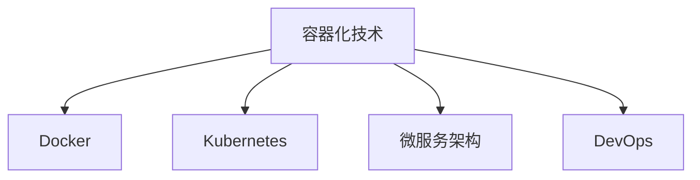

                 

# 容器化技术在云原生架构中的应用：Docker 和 Kubernetes

> 关键词：容器化,云原生,微服务,应用部署,容器编排,DevOps

## 1. 背景介绍

### 1.1 问题由来
随着云原生技术在软件开发和运维领域的迅猛发展，容器化和容器编排已成为现代应用架构的核心。特别是Docker和Kubernetes的结合，为构建高效、弹性、可扩展的云原生应用提供了一套完整解决方案。Docker是容器化技术的典型代表，提供了安全的、可移植的应用包，而Kubernetes则负责自动化的容器编排和管理，是容器化技术的完美配套工具。本文将详细介绍Docker和Kubernetes的核心概念、原理与应用实践，探讨其在云原生架构中的具体应用。

### 1.2 问题核心关键点
- 容器化技术：通过将应用及其依赖打包成容器，实现应用的可移植性和一致性。
- Docker：一个开源的容器运行平台，提供了一个安全、高效的运行环境。
- Kubernetes：一个开源的容器编排系统，实现了应用的无缝部署、扩展和管理。
- 微服务架构：将应用程序拆分为一组独立运行的服务，实现应用的灵活和高效。
- DevOps：一种集成开发、测试和运维的跨学科文化，强调协作、自动化和持续交付。

这些核心概念构成了容器化技术和云原生架构的基础，深刻影响着现代应用的开发和运维方式。

## 2. 核心概念与联系

### 2.1 核心概念概述

容器化技术通过将应用及其依赖打包成容器，实现了应用的可移植性和一致性。容器是一个运行环境，其中包含了应用及其依赖的库文件、配置文件等，使得应用在任意环境中都能以相同的方式运行。容器化技术主要通过Docker等工具实现。

Docker是一个开源的容器运行平台，它提供了一个轻量级的、可移植的容器运行环境。Docker镜像包含了应用及其依赖的所有文件，可以在不同的主机环境中运行，且具备一致的运行时行为。

Kubernetes是一个开源的容器编排系统，实现了应用的自动化部署、扩展和管理。通过Kubernetes，可以方便地创建、管理和销毁容器，并提供自动化的负载均衡、故障恢复等功能，使容器化的应用能够无缝集成到云原生架构中。

微服务架构是一种设计思想，将应用程序拆分为一组独立运行的服务，每个服务独立部署、扩展和管理。微服务架构通过容器化技术实现，使得服务在编排、扩展等方面更加灵活和高效。

DevOps是一种集成开发、测试和运维的跨学科文化，强调协作、自动化和持续交付。DevOps通过自动化工具和持续集成/持续交付(CI/CD)管道，实现了从代码提交到应用部署的自动化，缩短了产品开发周期，提高了系统稳定性和可靠性。

这些核心概念之间的逻辑关系可以通过以下Mermaid流程图来展示：



这个流程图展示了容器化技术和云原生架构的核心组件及其之间的关系：

1. 容器化技术是基础，通过将应用打包成容器，实现应用的可移植性。
2. Docker提供了容器化技术的实现平台，使得应用能够在不同的环境中一致运行。
3. Kubernetes负责容器编排和管理，使容器化的应用能够无缝集成到云原生架构中。
4. 微服务架构通过容器化技术实现，进一步增强了应用的灵活性和可扩展性。
5. DevOps文化通过自动化工具和管道，支撑了容器化应用的高效开发和运维。

这些概念共同构成了容器化技术和云原生架构的基本框架，使其在现代应用开发和运维中发挥着重要作用。

## 3. 核心算法原理 & 具体操作步骤
### 3.1 算法原理概述

容器化技术的核心原理是通过将应用及其依赖打包成容器，实现应用的可移植性和一致性。容器的特点包括轻量级、快速启动、隔离安全、弹性伸缩等。

Docker的核心原理是基于Linux内核的命名空间(Namespace)和控制组(Control Group)技术，将应用及其依赖隔离在一个独立的运行环境中，同时通过镜像和卷(Mount)技术实现应用的可移植性。

Kubernetes的核心原理是基于分布式系统的原理，实现应用的自动化部署、扩展和管理。Kubernetes通过编排节点(Node)、服务(Service)、扩展(ReplicationController)等组件，实现应用的弹性扩展和故障恢复。

微服务架构的核心原理是将应用程序拆分为一组独立运行的服务，通过容器化技术实现服务的快速部署和扩展。每个服务独立管理，能够灵活地适应不同的需求变化。

DevOps的核心原理是通过自动化工具和管道，实现应用的持续集成和持续交付。DevOps通过CI/CD管道，将开发、测试和运维流程自动化，缩短产品开发周期，提高系统稳定性和可靠性。

### 3.2 算法步骤详解

以下是Docker和Kubernetes在应用中的详细步骤：

**3.2.1 Docker的应用步骤**

1. **创建Docker镜像**：
   - 编写Dockerfile，定义应用及其依赖的安装步骤。
   - 在本地或远程镜像仓库中创建Docker镜像。

2. **运行Docker容器**：
   - 使用`docker run`命令创建和启动Docker容器。
   - 在容器中运行应用，提供一致的运行环境。

3. **管理Docker镜像**：
   - 使用`docker push`命令将镜像推送到远程仓库。
   - 使用`docker pull`命令从远程仓库拉取镜像。

**3.2.2 Kubernetes的应用步骤**

1. **安装Kubernetes**：
   - 安装Kubernetes集群，包括Master节点和多个Worker节点。
   - 配置Kubernetes集群的网络和存储。

2. **部署应用**：
   - 编写Kubernetes Deployment定义，指定应用的镜像、副本数、资源需求等。
   - 使用`kubectl apply`命令部署应用。

3. **管理应用**：
   - 使用`kubectl scale`命令调整应用的副本数。
   - 使用`kubectl rollout`命令更新应用的镜像。
   - 使用`kubectl logs`命令查看应用的日志。

**3.2.3 DevOps的应用步骤**

1. **配置CI/CD管道**：
   - 配置Git仓库、构建工具、测试工具和部署工具。
   - 编写CI/CD配置文件，定义构建、测试和部署的流程。

2. **自动化测试和部署**：
   - 使用自动化测试工具，对应用进行单元测试、集成测试和功能测试。
   - 使用自动化部署工具，将测试通过的应用自动部署到生产环境。

3. **持续集成和持续交付**：
   - 使用Git和CI/CD工具，实现从代码提交到应用部署的自动化。
   - 通过持续集成和持续交付，加速应用开发和交付速度。

### 3.3 算法优缺点

Docker和Kubernetes在容器化技术中的应用，具有以下优点：

1. **应用一致性**：通过容器化技术，应用及其依赖被打包成一个独立的镜像，确保在不同环境中的一致性。
2. **自动化部署**：通过Kubernetes，可以自动化地创建、管理和销毁容器，实现应用的快速部署和扩展。
3. **弹性伸缩**：通过Kubernetes，可以根据负载动态调整应用的副本数，实现弹性的扩展和收缩。
4. **故障恢复**：通过Kubernetes，可以自动检测和恢复应用的故障，确保系统的稳定性。
5. **高效率**：通过自动化工具和CI/CD管道，实现了应用的快速构建、测试和部署，提高了开发效率。

同时，Docker和Kubernetes也存在一些缺点：

1. **资源消耗**：容器化应用需要额外的资源，如内存、CPU等，可能会带来额外的开销。
2. **网络复杂性**：通过Kubernetes，需要配置复杂的网络和存储资源，增加了运维难度。
3. **学习成本**：Docker和Kubernetes的使用需要一定的学习成本，需要熟悉其相关概念和操作。
4. **安全风险**：容器化技术可能会带来一些安全风险，如恶意代码的注入、容器之间的通信等。

尽管存在这些缺点，但Docker和Kubernetes在容器化技术中的应用，已经得到了广泛认可，成为现代应用架构的核心组成部分。

### 3.4 算法应用领域

Docker和Kubernetes在容器化技术中的应用，已经在多个领域得到了广泛应用，例如：

1. **Web应用**：通过Docker和Kubernetes，可以快速构建和部署Web应用，实现弹性扩展和故障恢复。
2. **数据处理**：通过Docker和Kubernetes，可以实现大数据、流处理等应用的容器化部署，提高数据处理效率。
3. **移动应用**：通过Docker和Kubernetes，可以实现移动应用的容器化部署，实现应用的跨平台和跨环境运行。
4. **企业应用**：通过Docker和Kubernetes，可以实现企业级应用的容器化部署，提高系统的稳定性和可靠性。
5. **IoT应用**：通过Docker和Kubernetes，可以实现物联网设备的容器化部署，提高设备的灵活性和可管理性。

除了上述这些经典应用外，Docker和Kubernetes还在更多场景中得到了创新性的应用，如微服务架构、Serverless架构、Kubernetes Operator等，为现代应用架构带来了新的突破。

## 4. 数学模型和公式 & 详细讲解 & 举例说明

### 4.1 数学模型构建

在Docker和Kubernetes中，涉及到一些基础的数学模型和公式，以下将详细介绍这些模型和公式：

#### 4.1.1 Docker的镜像构建

Docker镜像的构建过程涉及多个步骤，可以使用Dockerfile来定义镜像构建的命令。Dockerfile通常包括以下几个步骤：

1. **设置基础环境**：
   - `FROM`指令指定基础镜像。
   - `COPY`指令复制本地文件到镜像中。
   - `RUN`指令在镜像中执行命令，如安装依赖。

2. **设置应用环境**：
   - `WORKDIR`指令设置应用的运行目录。
   - `COPY`指令复制应用代码到镜像中。
   - `RUN`指令编译和安装应用依赖。

3. **设置暴露端口**：
   - `EXPOSE`指令暴露应用的端口。
   - `CMD`指令设置应用的启动命令。

4. **构建镜像**：
   - 使用`docker build`命令构建镜像。

#### 4.1.2 Kubernetes的部署配置

Kubernetes的部署配置涉及到多个组件，以下是一些常见的配置项：

1. **Pod配置**：
   - `apiVersion`指令指定API版本。
   - `kind`指令指定资源类型。
   - `metadata`指令指定资源的元数据。
   - `spec`指令指定资源的具体配置。

2. **Service配置**：
   - `apiVersion`指令指定API版本。
   - `kind`指令指定资源类型。
   - `metadata`指令指定资源的元数据。
   - `spec`指令指定服务的具体配置，如选择器、端口、负载均衡等。

3. **Deployment配置**：
   - `apiVersion`指令指定API版本。
   - `kind`指令指定资源类型。
   - `metadata`指令指定资源的元数据。
   - `spec`指令指定部署的具体配置，如副本数、选择器、副本更新策略等。

4. **ConfigMap配置**：
   - `apiVersion`指令指定API版本。
   - `kind`指令指定资源类型。
   - `metadata`指令指定资源的元数据。
   - `data`指令指定配置文件的内容。

#### 4.1.3 DevOps的自动化流程

DevOps的自动化流程涉及多个步骤，可以使用CI/CD配置文件来定义自动化流程。CI/CD配置文件通常包括以下几个步骤：

1. **源代码管理**：
   - 配置Git仓库，指定代码的存储位置和分支。
   - 配置CI/CD工具，如Jenkins、GitLab CI等。

2. **构建和测试**：
   - 配置构建工具，如Maven、Gradle等。
   - 配置测试工具，如JUnit、Selenium等。

3. **部署和回滚**：
   - 配置部署工具，如Ansible、Puppet等。
   - 配置回滚策略，实现应用的快速回滚。

### 4.2 公式推导过程

以下是一些常用的Docker和Kubernetes的公式推导过程：

#### 4.2.1 Docker的镜像构建

在Docker镜像构建过程中，可以使用以下公式来计算镜像的大小：

$$
\text{镜像大小} = \sum \text{文件大小} + \text{执行命令的输出大小}
$$

其中，文件大小包括镜像中复制的所有文件的大小，执行命令的输出大小包括所有在`RUN`指令中执行的命令的输出大小。

#### 4.2.2 Kubernetes的负载均衡

在Kubernetes中，可以使用以下公式来计算服务的负载均衡：

$$
\text{负载均衡} = \frac{\text{总请求量}}{\text{可用节点数} \times \text{副本数}}
$$

其中，总请求量是所有请求的总和，可用节点数是所有可用的节点数量，副本数是服务的副本数量。

### 4.3 案例分析与讲解

以下是一个Docker和Kubernetes的典型案例分析：

#### 4.3.1 案例背景

一家互联网公司需要快速部署一个Web应用，该应用包括多个模块，如用户注册、登录、商品管理等。该公司希望通过Docker和Kubernetes实现应用的容器化部署和自动化管理。

#### 4.3.2 解决方案

1. **创建Docker镜像**：
   - 编写Dockerfile，定义应用及其依赖的安装步骤。
   - 在本地或远程镜像仓库中创建Docker镜像。

2. **部署Kubernetes应用**：
   - 编写Kubernetes Deployment定义，指定应用的镜像、副本数、资源需求等。
   - 使用`kubectl apply`命令部署应用。

3. **配置Kubernetes服务**：
   - 编写Kubernetes Service定义，指定服务的选择器、端口、负载均衡等。
   - 使用`kubectl expose`命令暴露服务。

4. **配置CI/CD管道**：
   - 配置Git仓库、构建工具、测试工具和部署工具。
   - 编写CI/CD配置文件，定义构建、测试和部署的流程。

5. **自动化测试和部署**：
   - 使用自动化测试工具，对应用进行单元测试、集成测试和功能测试。
   - 使用自动化部署工具，将测试通过的应用自动部署到生产环境。

#### 4.3.3 效果评估

通过Docker和Kubernetes的应用，该公司在快速部署Web应用方面取得了显著的效果：

1. **快速部署**：通过Docker和Kubernetes，应用可以快速部署到生产环境，减少了手动部署的时间。
2. **弹性扩展**：通过Kubernetes，可以根据负载动态调整应用的副本数，实现了弹性的扩展和收缩。
3. **故障恢复**：通过Kubernetes，可以自动检测和恢复应用的故障，确保系统的稳定性。
4. **自动化流程**：通过CI/CD管道，实现了从代码提交到应用部署的自动化，提高了开发效率。

## 5. 项目实践：代码实例和详细解释说明

### 5.1 开发环境搭建

在进行Docker和Kubernetes实践前，我们需要准备好开发环境。以下是使用Python进行Docker和Kubernetes开发的环境配置流程：

1. **安装Anaconda**：
   - 从官网下载并安装Anaconda，用于创建独立的Python环境。

2. **创建并激活虚拟环境**：
   - `conda create -n docker-env python=3.8`
   - `conda activate docker-env`

3. **安装Docker**：
   - `conda install docker`
   - 配置Docker镜像仓库，如Docker Hub。

4. **安装Kubernetes**：
   - 安装Kubernetes集群，包括Master节点和多个Worker节点。
   - 配置Kubernetes集群的网络和存储。

5. **配置CI/CD工具**：
   - 配置Jenkins、GitLab CI等CI/CD工具。
   - 配置构建、测试和部署工具。

完成上述步骤后，即可在`docker-env`环境中开始Docker和Kubernetes的实践。

### 5.2 源代码详细实现

下面我们以Web应用为例，给出使用Docker和Kubernetes对Web应用进行容器化部署的Python代码实现。

#### 5.2.1 Docker镜像构建

首先，定义Dockerfile：

```python
FROM nginx:alpine

COPY index.html /usr/share/nginx/html
COPY logo.png /usr/share/nginx/html
EXPOSE 80

CMD ["nginx", "-g", "daemon off;"]
```

然后，在本地或远程镜像仓库中创建Docker镜像：

```python
docker build -t web-app .
docker tag web-app username/dockerhub.com/web-app:latest
docker push username/dockerhub.com/web-app:latest
```

#### 5.2.2 Kubernetes部署配置

接下来，定义Kubernetes Deployment和Service：

```python
apiVersion: v1
kind: Deployment
metadata:
  name: web-app-deployment
spec:
  replicas: 3
  selector:
    matchLabels:
      app: web-app
  template:
    metadata:
      labels:
        app: web-app
    spec:
      containers:
      - name: web-app
        image: username/dockerhub.com/web-app:latest
        ports:
        - containerPort: 80

apiVersion: v1
kind: Service
metadata:
  name: web-app-service
spec:
  selector:
    app: web-app
  ports:
    - protocol: TCP
      port: 80
      targetPort: 80
```

最后，使用`kubectl apply`命令部署应用和Service：

```python
kubectl apply -f deployment.yaml
kubectl apply -f service.yaml
```

### 5.3 代码解读与分析

让我们再详细解读一下关键代码的实现细节：

#### 5.3.1 Dockerfile

- `FROM`指令指定基础镜像为`nginx:alpine`，表示使用Alpine系统的Nginx镜像。
- `COPY`指令将应用的index.html和logo.png文件复制到镜像中，分别指定目标目录为`/usr/share/nginx/html`。
- `EXPOSE`指令暴露80端口，表示Nginx服务将监听80端口。
- `CMD`指令设置Nginx的启动命令，使用`nginx`命令启动Nginx服务。

#### 5.3.2 Kubernetes Deployment和Service

- `apiVersion`指令指定API版本为`v1`。
- `kind`指令指定资源类型为`Deployment`或`Service`。
- `metadata`指令指定资源的元数据，如名称、标签等。
- `spec`指令指定资源的具体配置，如副本数、选择器、端口等。

### 5.4 运行结果展示

通过Docker和Kubernetes的应用，Web应用可以快速部署到生产环境，并实现弹性扩展和故障恢复。以下是典型的运行结果展示：

1. **Web应用运行**：
   - 通过Kubernetes，Web应用可以自动部署到多个节点上，实现弹性扩展。
   - 通过Nginx，Web应用可以自动监听80端口，提供一致的访问接口。

2. **负载均衡**：
   - 通过Kubernetes的Service，可以实现服务的负载均衡，确保每个节点的负载均衡。
   - 通过Kubernetes的Pod副本数配置，可以实现服务的自动扩展和收缩。

3. **故障恢复**：
   - 通过Kubernetes的自动检测和恢复机制，可以实现应用的故障恢复。
   - 通过Kubernetes的Pod复制和替换机制，可以保证应用的持续可用性。

4. **自动化流程**：
   - 通过CI/CD管道，可以实现从代码提交到应用部署的自动化。
   - 通过自动化测试和部署工具，可以加速应用的开发和部署速度。

## 6. 实际应用场景

### 6.1 智能客服系统

通过Docker和Kubernetes的应用，智能客服系统可以实现快速部署和弹性扩展，提高客户咨询体验和问题解决效率。

具体而言，可以收集企业内部的历史客服对话记录，将问题和最佳答复构建成监督数据，在此基础上对预训练对话模型进行微调。微调后的对话模型能够自动理解用户意图，匹配最合适的答案模板进行回复。对于客户提出的新问题，还可以接入检索系统实时搜索相关内容，动态组织生成回答。如此构建的智能客服系统，能大幅提升客户咨询体验和问题解决效率。

### 6.2 金融舆情监测

通过Docker和Kubernetes的应用，金融舆情监测系统可以实现实时抓取网络文本数据，自动监测不同主题下的情感变化趋势，及时预警潜在风险。

具体而言，可以收集金融领域相关的新闻、报道、评论等文本数据，并对其进行主题标注和情感标注。在此基础上对预训练语言模型进行微调，使其能够自动判断文本属于何种主题，情感倾向是正面、中性还是负面。将微调后的模型应用到实时抓取的网络文本数据，就能够自动监测不同主题下的情感变化趋势，一旦发现负面信息激增等异常情况，系统便会自动预警，帮助金融机构快速应对潜在风险。

### 6.3 个性化推荐系统

通过Docker和Kubernetes的应用，个性化推荐系统可以实现高效的推荐服务，提供个性化的推荐内容。

具体而言，可以收集用户浏览、点击、评论、分享等行为数据，提取和用户交互的物品标题、描述、标签等文本内容。将文本内容作为模型输入，用户的后续行为（如是否点击、购买等）作为监督信号，在此基础上微调预训练语言模型。微调后的模型能够从文本内容中准确把握用户的兴趣点。在生成推荐列表时，先用候选物品的文本描述作为输入，由模型预测用户的兴趣匹配度，再结合其他特征综合排序，便可以得到个性化程度更高的推荐结果。

### 6.4 未来应用展望

随着Docker和Kubernetes的不断发展和应用，其在云原生架构中的地位将更加重要。未来，基于Docker和Kubernetes的应用场景将会更加广泛，为各行各业带来新的变革和机遇。

1. **物联网应用**：通过Docker和Kubernetes，可以实现物联网设备的容器化部署，提高设备的灵活性和可管理性。
2. **人工智能应用**：通过Docker和Kubernetes，可以实现人工智能算法的容器化部署，提高算法的执行效率和可管理性。
3. **区块链应用**：通过Docker和Kubernetes，可以实现区块链节点的容器化部署，提高区块链系统的可扩展性和可靠性。
4. **边缘计算应用**：通过Docker和Kubernetes，可以实现边缘计算节点的容器化部署，提高边缘计算的灵活性和可管理性。
5. **混合云应用**：通过Docker和Kubernetes，可以实现混合云环境的统一管理和部署，提高云资源的利用效率。

总之，Docker和Kubernetes在云原生架构中的广泛应用，将为各行各业带来新的发展机遇，推动云原生技术在各领域的深入应用。

## 7. 工具和资源推荐
### 7.1 学习资源推荐

为了帮助开发者系统掌握Docker和Kubernetes的核心概念和实践技巧，这里推荐一些优质的学习资源：

1. **《Docker实战》书籍**：深入浅出地介绍了Docker的核心概念和操作，适合初学者入门。
2. **Kubernetes官方文档**：Kubernetes的官方文档，提供了详细的安装、配置和操作指导，是学习Kubernetes的不二之选。
3. **Docker官方文档**：Docker的官方文档，提供了详细的安装、配置和操作指导，是学习Docker的重要资源。
4. **Kubernetes入门教程**：Kubernetes的入门教程，适合初学者快速上手。
5. **Docker实战案例**：Docker实战案例，提供了详细的实践操作和解决方案，适合进阶学习。

通过对这些资源的学习实践，相信你一定能够快速掌握Docker和Kubernetes的核心原理和应用方法，并用于解决实际的NLP问题。

### 7.2 开发工具推荐

高效的开发离不开优秀的工具支持。以下是几款用于Docker和Kubernetes开发常用的工具：

1. **Docker**：Docker的开源平台，提供了一个轻量级的、可移植的容器运行环境。
2. **Kubernetes**：Kubernetes的开源容器编排系统，实现了应用的自动化部署、扩展和管理。
3. **Jenkins**：一款流行的开源自动化工具，支持CI/CD管道的自动化构建和部署。
4. **GitLab CI/CD**：GitLab提供的CI/CD管道，支持多种集成、测试和部署工具。
5. **Ansible**：一款流行的自动化配置管理工具，支持分布式环境的配置管理。

合理利用这些工具，可以显著提升Docker和Kubernetes的开发效率，加快创新迭代的步伐。

### 7.3 相关论文推荐

Docker和Kubernetes在容器化技术中的应用，已经在学界和工业界得到了广泛研究。以下是几篇奠基性的相关论文，推荐阅读：

1. **Docker官方论文**：介绍Docker的核心概念和实现原理，是学习Docker的重要资源。
2. **Kubernetes官方论文**：介绍Kubernetes的核心概念和实现原理，是学习Kubernetes的重要资源。
3. **容器编排系统设计**：介绍容器编排系统的设计思路和实现方法，是学习Kubernetes的重要参考。
4. **Docker和Kubernetes的集成**：介绍Docker和Kubernetes的集成实现方法，是学习Docker和Kubernetes的重要参考。
5. **Docker和Kubernetes的未来**：探讨Docker和Kubernetes的未来发展趋势和挑战，是学习Docker和Kubernetes的重要参考。

这些论文代表了大容器化技术的发展脉络。通过学习这些前沿成果，可以帮助研究者把握学科前进方向，激发更多的创新灵感。

## 8. 总结：未来发展趋势与挑战

### 8.1 总结

本文对Docker和Kubernetes在云原生架构中的应用进行了全面系统的介绍。首先阐述了Docker和Kubernetes的核心概念和原理，明确了容器化技术在现代应用架构中的重要价值。其次，从原理到实践，详细讲解了Docker和Kubernetes的数学模型和操作步骤，给出了实际应用的完整代码实例。同时，本文还广泛探讨了Docker和Kubernetes在云原生架构中的具体应用，展示了其在现代应用开发和运维中的广泛应用。

通过本文的系统梳理，可以看到，Docker和Kubernetes在容器化技术中的应用，已经成为了现代应用架构的核心组成部分，极大地提高了应用的开发和运维效率，降低了系统的复杂度和成本。未来，伴随Docker和Kubernetes的不断发展和完善，其在云原生架构中的地位将更加重要，为各行业的数字化转型提供更加强大的支持。

### 8.2 未来发展趋势

展望未来，Docker和Kubernetes在容器化技术中的应用，将呈现以下几个发展趋势：

1. **容器编排的自动化**：随着Kubernetes的不断发展和完善，容器编排将变得更加自动化和智能化，实现更高效、更灵活的应用部署和扩展。
2. **微服务架构的普及**：随着微服务架构的不断发展和完善，容器化技术将成为微服务架构的重要支撑，实现更细粒度、更灵活的服务部署和管理。
3. **DevOps的深入应用**：随着DevOps文化的不断发展和完善，容器化技术将成为DevOps的重要工具，实现更快速、更高效的开发和运维流程。
4. **多云和混合云的集成**：随着云计算的不断发展和完善，容器化技术将成为多云和混合云环境的重要支撑，实现更高效、更灵活的云资源管理。
5. **物联网和边缘计算的应用**：随着物联网和边缘计算的不断发展和完善，容器化技术将成为边缘计算的重要支撑，实现更高效、更灵活的边缘计算应用。
6. **人工智能和区块链的应用**：随着人工智能和区块链的不断发展和完善，容器化技术将成为人工智能和区块链的重要支撑，实现更高效、更灵活的AI和区块链应用。

这些趋势凸显了Docker和Kubernetes在云原生架构中的广阔前景。这些方向的探索发展，必将进一步提升应用的开发和运维效率，推动各行业的数字化转型。

### 8.3 面临的挑战

尽管Docker和Kubernetes在容器化技术中的应用已经取得了显著成效，但在迈向更加智能化、普适化应用的过程中，它们仍面临诸多挑战：

1. **学习成本高**：Docker和Kubernetes的使用需要一定的学习成本，需要熟悉其相关概念和操作。
2. **性能瓶颈**：容器化应用需要额外的资源，如内存、CPU等，可能会带来额外的开销。
3. **网络复杂性**：通过Kubernetes，需要配置复杂的网络和存储资源，增加了运维难度。
4. **安全风险**：容器化技术可能会带来一些安全风险，如恶意代码的注入、容器之间的通信等。
5. **可扩展性不足**：在应对大规模应用时，容器化技术的扩展性可能不足，需要进一步优化。

尽管存在这些挑战，但Docker和Kubernetes在容器化技术中的应用，已经得到了广泛认可，成为现代应用架构的核心组成部分。

### 8.4 研究展望

面对Docker和Kubernetes所面临的挑战，未来的研究需要在以下几个方面寻求新的突破：

1. **学习资源优化**：开发更多的学习资源和工具，降低Docker和Kubernetes的学习门槛，加速技术普及。
2. **性能优化**：优化容器化应用的性能，减少资源消耗，提高应用的运行效率。
3. **网络优化**：优化容器化网络架构，降低网络复杂性，提高应用的可管理性。
4. **安全加固**：加强容器化应用的安全性，避免恶意代码的注入，提高应用的安全性。
5. **可扩展性提升**：提升容器化应用的可扩展性，支持更大规模的应用部署。

这些研究方向将进一步推动Docker和Kubernetes在云原生架构中的应用，为各行业的数字化转型提供更加强大的支持。

## 9. 附录：常见问题与解答

**Q1：Docker和Kubernetes相比传统应用部署方式有哪些优势？**

A: Docker和Kubernetes相比传统应用部署方式，具有以下优势：

1. **快速部署**：通过Docker镜像，应用可以快速部署到多个主机上，减少了手动部署的时间。
2. **弹性扩展**：通过Kubernetes，可以根据负载动态调整应用的副本数，实现弹性的扩展和收缩。
3. **自动化运维**：通过Kubernetes，可以自动化地创建、管理和销毁容器，实现应用的自动化运维。
4. **可移植性**：通过Docker镜像，应用可以在不同的主机和环境中一致运行，提高了应用的可移植性。
5. **高可靠性**：通过Kubernetes的负载均衡和故障恢复机制，可以确保应用的稳定性和可靠性。

总之，Docker和Kubernetes通过容器化技术，实现了应用的快速部署、弹性扩展、自动化运维和可移植性，极大地提高了应用的开发和运维效率。

**Q2：Docker和Kubernetes的安装和配置有哪些要点？**

A: Docker和Kubernetes的安装和配置需要关注以下要点：

1. **Docker的安装**：安装Docker后，需要配置Docker镜像仓库，如Docker Hub。
2. **Kubernetes的安装**：安装Kubernetes集群，包括Master节点和多个Worker节点。
3. **Docker镜像的构建**：编写Dockerfile，定义应用及其依赖的安装步骤。
4. **Kubernetes的配置**：编写Kubernetes Deployment和Service定义，指定应用的镜像、副本数、资源需求等。
5. **CI/CD的配置**：配置Jenkins、GitLab CI等CI/CD工具，编写CI/CD配置文件，定义构建、测试和部署的流程。

完成以上步骤后，即可在Docker和Kubernetes的环境中进行应用的容器化部署和自动化管理。

**Q3：Docker和Kubernetes在云原生架构中的应用场景有哪些？**

A: Docker和Kubernetes在云原生架构中的应用场景非常广泛，包括但不限于以下几个方面：

1. **Web应用**：通过Docker和Kubernetes，可以快速部署Web应用，实现弹性扩展和故障恢复。
2. **数据处理**：通过Docker和Kubernetes，可以实现大数据、流处理等应用的容器化部署，提高数据处理效率。
3. **移动应用**：通过Docker和Kubernetes，可以实现移动应用的容器化部署，实现应用的跨平台和跨环境运行。
4. **企业应用**：通过Docker和Kubernetes，可以实现企业级应用的容器化部署，提高系统的稳定性和可靠性。
5. **IoT应用**：通过Docker和Kubernetes，可以实现物联网设备的容器化部署，提高设备的灵活性和可管理性。
6. **区块链应用**：通过Docker和Kubernetes，可以实现区块链节点的容器化部署，提高区块链系统的可扩展性和可靠性。
7. **边缘计算应用**：通过Docker和Kubernetes，可以实现边缘计算节点的容器化部署，提高边缘计算的灵活性和可管理性。
8. **混合云应用**：通过Docker和Kubernetes，可以实现混合云环境的统一管理和部署，提高云资源的利用效率。

总之，Docker和Kubernetes在云原生架构中的应用场景非常广泛，为各行业的数字化转型提供了强大的技术支持。

**Q4：如何应对Docker和Kubernetes的学习成本高的问题？**

A: 应对Docker和Kubernetes的学习成本高的问题，可以采取以下措施：

1. **学习资源**：通过学习资源，如书籍、博客、视频等，快速掌握Docker和Kubernetes的核心概念和操作。
2. **实践操作**：通过实践操作，如搭建Docker和Kubernetes的环境，进行应用部署和运维，积累实际经验。
3. **社区支持**：通过社区支持，如参与Docker和Kubernetes的社区活动，获取技术支持和交流经验。
4. **学习工具**：通过学习工具，如在线教程、文档、演示等，快速获取Docker和Kubernetes的知识点。
5. **培训课程**：通过培训课程，如在线课程、培训班等，系统学习Docker和Kubernetes的原理和应用。

通过以上措施，可以有效降低Docker和Kubernetes的学习成本，快速掌握其核心技术和应用方法。

**Q5：如何优化Docker和Kubernetes的网络架构？**

A: 优化Docker和Kubernetes的网络架构，可以采取以下措施：

1. **负载均衡**：通过Kubernetes的Service，实现服务的负载均衡，确保每个节点的负载均衡。
2. **跨节点通信**：通过Kubernetes的Pod网络，实现跨节点的通信，提高网络的传输效率。
3. **服务发现**：通过Kubernetes的Service，实现服务的自动发现，提高服务的可用性。
4. **网络安全**：通过Kubernetes的网络策略，实现网络的安全隔离和访问控制。
5. **网络监控**：通过Kubernetes的网络监控工具，实时监测网络的状态和性能。

通过以上措施，可以有效优化Docker和Kubernetes的网络架构，提高应用的稳定性和可靠性。

总之，Docker和Kubernetes在云原生架构中的应用，已经成为现代应用开发和运维的重要工具。通过不断优化其应用场景和实践操作，可以实现更高的开发和运维效率，推动各行业的数字化转型。

---

作者：禅与计算机程序设计艺术 / Zen and the Art of Computer Programming

