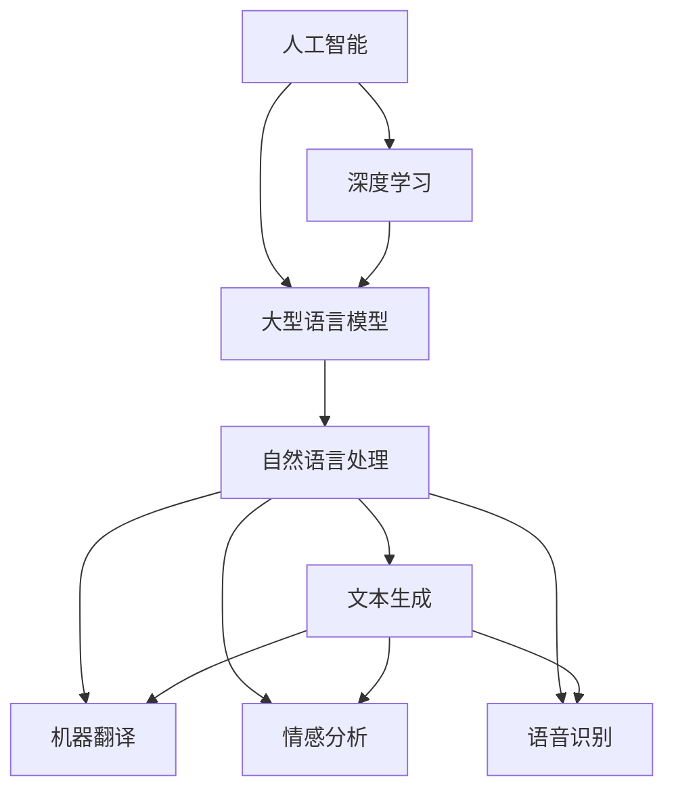

                 

# 对 AI、LLMs 和深度学习有深入了解

## 1. 背景介绍

### 1.1 问题由来
人工智能（AI）、大型语言模型（LLMs）和深度学习（Deep Learning）是当今科技和工业领域最为热门的话题。近年来，随着深度学习技术的发展，这些领域取得了巨大的突破。大型语言模型作为深度学习的重要分支，以其在自然语言处理（NLP）任务中的卓越表现而受到广泛关注。深度学习领域的许多最新成果，例如GPT-3、BERT等模型，都是基于大型语言模型的思想和架构构建的。

### 1.2 问题核心关键点
本文旨在深入探讨AI、LLMs和深度学习的核心概念和应用，并结合最新的研究成果和实践经验，对这一领域的未来发展方向和面临的挑战进行分析和展望。

## 2. 核心概念与联系

### 2.1 核心概念概述

本文将介绍以下几个核心概念，这些概念构成了AI、LLMs和深度学习的基本框架：

- **AI（人工智能）**：人工智能是计算机科学的一个分支，旨在创建能够执行智能行为的机器系统。AI的目标是使计算机能够模拟人类的思维过程，解决复杂问题，甚至超越人类在某些领域的表现。

- **深度学习**：深度学习是一种特殊形式的机器学习算法，它基于人工神经网络模型，特别是深度神经网络（DNN）模型，通过多层非线性变换来自动学习和提取特征，从而实现对数据的高度抽象和处理。

- **大型语言模型（LLMs）**：大型语言模型是指基于深度学习架构构建的模型，其参数量巨大，通常有数十亿个参数。这些模型通过对大规模无标签文本数据进行预训练，学习到丰富的语言知识，能够理解和生成自然语言。

这些概念之间的联系可以通过以下Mermaid流程图来展示：



这个流程图展示了人工智能、深度学习和大型语言模型之间的层次关系，以及它们在自然语言处理领域的应用。

## 3. 核心算法原理 & 具体操作步骤
### 3.1 算法原理概述

深度学习算法原理的核心是多层神经网络，其通过反向传播算法自动调整权重，从而最小化损失函数。深度学习模型通过多层次的非线性变换，逐步提取出输入数据的高级特征，并进行分类或回归等任务。

对于大型语言模型，其算法原理与普通的深度学习模型类似，但在数据规模、模型结构和训练策略上有着显著的差异。大型语言模型的核心在于通过预训练在大规模无标签文本数据上学习到语言的知识，然后通过微调在有标签数据上进一步优化，从而适用于特定的NLP任务。

### 3.2 算法步骤详解

深度学习模型的训练过程通常包括以下几个关键步骤：

1. **数据准备**：收集并处理用于训练的数据集，包括文本数据、图像数据等，并进行预处理，如分词、归一化等。
2. **模型构建**：选择合适的神经网络结构，如卷积神经网络（CNN）、递归神经网络（RNN）或变分自编码器（VAE）等，并初始化权重。
3. **模型训练**：通过前向传播和反向传播算法，不断调整模型参数，最小化损失函数。
4. **模型评估**：在验证集上评估模型性能，根据结果调整模型参数或训练策略。
5. **模型部署**：将训练好的模型部署到实际应用中，进行推理和预测。

对于大型语言模型的训练，其步骤大致相同，但在数据规模和模型架构上有着更高的要求。例如，GPT-3等模型在训练过程中，需要消耗大量的计算资源和数据资源。

### 3.3 算法优缺点

深度学习算法的优点包括：

- **自动特征提取**：通过多层次的神经网络，能够自动提取数据的高级特征，无需手工设计特征。
- **泛化能力强**：能够处理大量不同类型的数据，并在新的数据上表现良好。
- **可解释性强**：许多深度学习模型具有良好的可解释性，可以通过可视化手段理解模型的内部机制。

然而，深度学习算法也存在一些缺点：

- **训练时间长**：深度学习模型通常需要大量的计算资源和时间进行训练。
- **模型复杂度高**：深度学习模型结构复杂，参数量巨大，导致模型难以解释和调试。
- **数据依赖性高**：深度学习模型需要大量的标注数据进行训练，数据质量的优劣直接影响模型性能。

### 3.4 算法应用领域

深度学习算法在许多领域都得到了广泛应用，例如：

- **计算机视觉**：用于图像分类、目标检测、图像生成等任务。
- **自然语言处理**：用于文本分类、情感分析、机器翻译等任务。
- **语音识别**：用于语音识别、语音合成等任务。
- **推荐系统**：用于个性化推荐、广告投放等任务。
- **医疗健康**：用于疾病诊断、医学图像分析等任务。

## 4. 数学模型和公式 & 详细讲解 & 举例说明

### 4.1 数学模型构建

深度学习模型通常基于人工神经网络构建，其核心数学模型包括前向传播和反向传播算法。对于大型语言模型，其数学模型更加复杂，通常包含多层Transformer或BERT等架构。

### 4.2 公式推导过程

深度学习模型的核心公式包括损失函数和梯度下降算法。假设模型的输出为 $y$，真实标签为 $t$，损失函数为 $L(y,t)$，则梯度下降算法可以表示为：

$$
\theta \leftarrow \theta - \eta \nabla_{\theta}L(y,t)
$$

其中，$\theta$ 为模型参数，$\eta$ 为学习率，$\nabla_{\theta}L(y,t)$ 为损失函数对参数 $\theta$ 的梯度。

对于大型语言模型，其损失函数通常为交叉熵损失，即：

$$
L(y,t) = -\frac{1}{N}\sum_{i=1}^N t_i\log y_i + (1-t_i)\log(1-y_i)
$$

其中，$N$ 为样本数量，$y_i$ 为模型对第 $i$ 个样本的预测概率。

### 4.3 案例分析与讲解

以文本分类任务为例，我们可以使用基于深度学习的卷积神经网络（CNN）或长短时记忆网络（LSTM）等模型。假设模型接收的输入文本为 $x$，输出分类概率为 $y$，则训练过程可以表示为：

1. **数据预处理**：将文本数据转换为数值形式，并进行归一化、截断等处理。
2. **模型构建**：构建一个多层卷积神经网络，每个卷积层后跟池化层和全连接层。
3. **模型训练**：使用交叉熵损失函数，通过前向传播和反向传播算法，调整模型参数，最小化损失函数。
4. **模型评估**：在验证集上评估模型性能，根据结果调整模型参数或训练策略。
5. **模型部署**：将训练好的模型部署到实际应用中，进行推理和预测。

## 5. 项目实践：代码实例和详细解释说明
### 5.1 开发环境搭建

在进行深度学习项目实践前，需要准备开发环境。以下是使用Python进行TensorFlow开发的环境配置流程：

1. 安装Anaconda：从官网下载并安装Anaconda，用于创建独立的Python环境。

2. 创建并激活虚拟环境：
```bash
conda create -n tf-env python=3.7 
conda activate tf-env
```

3. 安装TensorFlow：根据CUDA版本，从官网获取对应的安装命令。例如：
```bash
conda install tensorflow=2.7 cudatoolkit=11.1 -c pytorch -c conda-forge
```

4. 安装各类工具包：
```bash
pip install numpy pandas scikit-learn matplotlib tqdm jupyter notebook ipython
```

完成上述步骤后，即可在`tf-env`环境中开始深度学习项目实践。

### 5.2 源代码详细实现

以下是使用TensorFlow构建卷积神经网络进行文本分类的代码实现：

```python
import tensorflow as tf
from tensorflow.keras import layers

# 定义模型
model = tf.keras.Sequential([
    layers.Embedding(input_dim=10000, output_dim=64),
    layers.Conv1D(64, 3, activation='relu'),
    layers.MaxPooling1D(pool_size=2),
    layers.LSTM(64),
    layers.Dense(10, activation='softmax')
])

# 编译模型
model.compile(optimizer='adam', loss='categorical_crossentropy', metrics=['accuracy'])

# 训练模型
model.fit(train_dataset, epochs=10, validation_data=val_dataset)

# 评估模型
model.evaluate(test_dataset)
```

### 5.3 代码解读与分析

让我们再详细解读一下关键代码的实现细节：

- `layers.Embedding`层：用于将文本数据转换为词嵌入形式，输入维度为词汇表大小，输出维度为词嵌入维度。
- `layers.Conv1D`层：用于提取文本中的局部特征，卷积核大小为3，激活函数为ReLU。
- `layers.MaxPooling1D`层：用于提取卷积层的最大池化特征。
- `layers.LSTM`层：用于对文本序列进行建模，捕捉序列中的长期依赖关系。
- `layers.Dense`层：用于对文本分类进行最后的输出，激活函数为Softmax。

## 6. 实际应用场景
### 6.1 智能客服系统

深度学习在智能客服系统中得到了广泛应用。传统的客服系统依赖于人工处理，响应速度慢，且质量不稳定。深度学习模型能够处理大规模客户数据，快速响应客户咨询，并提供高质量的自动回复。

在技术实现上，可以通过深度学习模型对历史客服对话数据进行训练，学习客户问题与回复之间的映射关系。微调后的模型能够在新的客户咨询中快速生成合适的回复，提高客户满意度。

### 6.2 金融舆情监测

金融机构需要实时监测市场舆情，以规避金融风险。传统的舆情监测方式依赖于人工处理，成本高、效率低。深度学习模型能够自动处理大量的新闻、报道、评论等文本数据，快速识别市场舆情变化，并发出预警。

在实践应用中，可以收集金融领域相关的新闻、报道、评论等文本数据，对其进行情感分析，学习市场情绪变化趋势，及时发现负面信息激增等异常情况，从而帮助金融机构快速应对潜在风险。

### 6.3 个性化推荐系统

推荐系统通常依赖用户的历史行为数据进行推荐，难以深入理解用户的真实兴趣偏好。深度学习模型能够自动处理用户浏览、点击、评论、分享等行为数据，从中学习用户兴趣点，生成个性化推荐。

在具体实现中，可以使用深度学习模型对用户行为数据进行建模，学习用户兴趣与推荐物品之间的关系，生成个性化的推荐列表，提升用户体验。

### 6.4 未来应用展望

随着深度学习模型的不断演进，其应用领域将不断扩展。未来，深度学习将在更多领域得到应用，为各行各业带来变革性影响。

在智慧医疗领域，深度学习模型可以辅助医生进行疾病诊断、医学图像分析等任务，提高医疗服务的智能化水平。

在智能教育领域，深度学习模型能够进行作业批改、学情分析、知识推荐等任务，因材施教，促进教育公平。

在智慧城市治理中，深度学习模型可以用于城市事件监测、舆情分析、应急指挥等环节，提高城市管理的自动化和智能化水平。

此外，深度学习模型在企业生产、社会治理、文娱传媒等众多领域也将不断涌现，为各行各业带来新的技术突破和应用场景。

## 7. 工具和资源推荐
### 7.1 学习资源推荐

为了帮助开发者系统掌握深度学习技术，这里推荐一些优质的学习资源：

1. 《深度学习》书籍：由Ian Goodfellow等人所著，是深度学习领域的经典教材，涵盖深度学习的基本概念和算法。

2. DeepLearning.AI课程：由Andrew Ng等人开设的深度学习课程，提供从基础到高级的深度学习知识，适合不同层次的学习者。

3. TensorFlow官方文档：TensorFlow的官方文档，提供了丰富的教程和示例代码，是学习和使用TensorFlow的重要资源。

4. PyTorch官方文档：PyTorch的官方文档，提供了详细的API文档和示例代码，是学习和使用PyTorch的重要参考。

5. Kaggle竞赛：Kaggle是一个数据科学竞赛平台，提供丰富的数据集和挑战任务，适合实践深度学习项目。

通过这些资源的学习实践，相信你一定能够快速掌握深度学习技术，并用于解决实际的NLP问题。

### 7.2 开发工具推荐

高效的开发离不开优秀的工具支持。以下是几款用于深度学习项目开发的常用工具：

1. TensorFlow：由Google主导开发的开源深度学习框架，生产部署方便，适合大规模工程应用。

2. PyTorch：由Facebook主导开发的开源深度学习框架，灵活动态的计算图，适合快速迭代研究。

3. Keras：基于TensorFlow和Theano的高级API，提供了便捷的深度学习模型构建接口，适合初学者使用。

4. Jupyter Notebook：一个开源的Web应用，提供了交互式的编程环境，支持多种编程语言和库。

5. Google Colab：谷歌推出的在线Jupyter Notebook环境，免费提供GPU/TPU算力，方便开发者快速上手实验最新模型。

合理利用这些工具，可以显著提升深度学习项目开发的效率，加快创新迭代的步伐。

### 7.3 相关论文推荐

深度学习领域的许多最新研究成果都是通过论文发表的。以下是几篇奠基性的相关论文，推荐阅读：

1. AlexNet：ImageNet大挑战赛的冠军算法，提出了卷积神经网络（CNN）架构，开创了深度学习时代。

2. ResNet：Google提出的残差网络架构，解决了深度学习模型退化的问题，使深度网络可以更深更宽。

3. BERT：Google提出的基于Transformer的预训练语言模型，通过大规模无标签文本数据预训练，在自然语言处理任务中取得了卓越的性能。

4. GPT-3：OpenAI提出的基于Transformer的预训练语言模型，参数量达数十亿，在多种NLP任务中刷新了最先进的性能指标。

这些论文代表了大深度学习技术的发展脉络。通过学习这些前沿成果，可以帮助研究者把握学科前进方向，激发更多的创新灵感。

## 8. 总结：未来发展趋势与挑战

### 8.1 总结

本文对深度学习、大型语言模型和人工智能的核心概念和应用进行了全面系统的介绍。首先，探讨了深度学习的基本原理和算法步骤，展示了其在NLP领域的广泛应用。其次，介绍了大型语言模型预训练和微调的方法，展示了其在NLP任务中的强大能力。最后，讨论了深度学习在未来应用场景中的前景和面临的挑战。

通过本文的系统梳理，可以看到，深度学习、大型语言模型和人工智能技术在当前科技和工业领域的重要性，以及其在NLP领域的应用前景。未来，这些技术将进一步融合，为更多行业带来变革性影响。

### 8.2 未来发展趋势

展望未来，深度学习技术将呈现以下几个发展趋势：

1. **模型规模持续增大**：随着算力成本的下降和数据规模的扩张，深度学习模型的参数量还将持续增长。超大规模深度学习模型蕴含的丰富知识，有望支撑更加复杂多变的NLP任务。

2. **训练效率提升**：随着硬件技术的进步和算法优化，深度学习模型的训练速度将大幅提升，实时训练和推理变得更加可行。

3. **跨领域知识融合**：深度学习模型能够从多个领域学习知识，并将其融合到模型中，提升模型的泛化能力和表现。

4. **自动化模型设计**：自动化模型设计工具将帮助开发者更快速地构建和优化深度学习模型，提高模型开发效率。

5. **元学习与迁移学习**：通过元学习和迁移学习，深度学习模型能够快速适应新任务和新数据，减少对标注数据的依赖。

这些趋势凸显了深度学习技术的广阔前景，其未来应用将更加广泛和深入。

### 8.3 面临的挑战

尽管深度学习技术已经取得了显著的成就，但在迈向更加智能化、普适化应用的过程中，仍面临诸多挑战：

1. **数据质量问题**：深度学习模型的性能高度依赖于训练数据的质量和数量，获取高质量、多样化的数据仍然是一个挑战。

2. **模型可解释性不足**：深度学习模型通常被视为“黑盒”系统，难以解释其内部工作机制和决策逻辑。

3. **计算资源消耗大**：深度学习模型在训练和推理过程中需要消耗大量的计算资源和存储空间。

4. **泛化能力受限**：深度学习模型在特定数据集上表现良好，但在新的数据集上泛化性能可能较差。

5. **公平性和鲁棒性**：深度学习模型在处理复杂数据时容易产生偏差和错误，需要进一步提高模型的公平性和鲁棒性。

6. **安全性问题**：深度学习模型可能被恶意攻击或误用，需要加强模型的安全性和隐私保护。

这些挑战将需要在算法、技术和管理等多个层面进行综合应对。只有解决这些问题，深度学习技术才能更加成熟和可靠。

### 8.4 研究展望

未来的深度学习研究需要在以下几个方面进行探索：

1. **模型压缩与优化**：通过模型压缩、量化等技术，减少深度学习模型的计算和存储空间，提高推理速度。

2. **自适应学习算法**：开发自适应学习算法，使深度学习模型能够自动适应新数据和新任务。

3. **多模态学习**：融合视觉、听觉等多种模态信息，提高深度学习模型的泛化能力和表现。

4. **元学习与迁移学习**：通过元学习和迁移学习，使深度学习模型能够快速适应新任务和新数据。

5. **跨领域知识融合**：将符号化的先验知识与神经网络模型进行融合，提升深度学习模型的知识整合能力。

6. **安全与隐私保护**：研究深度学习模型的安全性和隐私保护技术，确保模型的公平性和鲁棒性。

这些研究方向将引领深度学习技术的发展，为构建安全、可靠、可解释、可控的智能系统铺平道路。

## 9. 附录：常见问题与解答

**Q1：深度学习模型是否适用于所有NLP任务？**

A: 深度学习模型在许多NLP任务上都能取得不错的效果，特别是对于数据量较大的任务。但对于一些特定领域的任务，如医学、法律等，仅仅依靠通用语料预训练的模型可能难以很好地适应。此时需要在特定领域语料上进一步预训练，再进行微调，才能获得理想效果。此外，对于一些需要时效性、个性化很强的任务，如对话、推荐等，深度学习模型也需要针对性的改进优化。

**Q2：如何选择合适的深度学习框架？**

A: 选择合适的深度学习框架需要考虑多方面因素，包括算力、数据规模、开发效率等。TensorFlow适合大规模工程应用，PyTorch适合快速迭代研究，Keras适合初学者入门。

**Q3：深度学习模型在落地部署时需要注意哪些问题？**

A: 将深度学习模型转化为实际应用，还需要考虑以下因素：

1. **模型裁剪**：去除不必要的层和参数，减小模型尺寸，加快推理速度。
2. **量化加速**：将浮点模型转为定点模型，压缩存储空间，提高计算效率。
3. **服务化封装**：将模型封装为标准化服务接口，便于集成调用。
4. **弹性伸缩**：根据请求流量动态调整资源配置，平衡服务质量和成本。
5. **监控告警**：实时采集系统指标，设置异常告警阈值，确保服务稳定性。
6. **安全防护**：采用访问鉴权、数据脱敏等措施，保障数据和模型安全。

深度学习模型在实际部署中需要综合考虑性能、效率和安全等方面的因素，确保其在实际应用中的稳定性和可靠性。

---

作者：禅与计算机程序设计艺术 / Zen and the Art of Computer Programming

