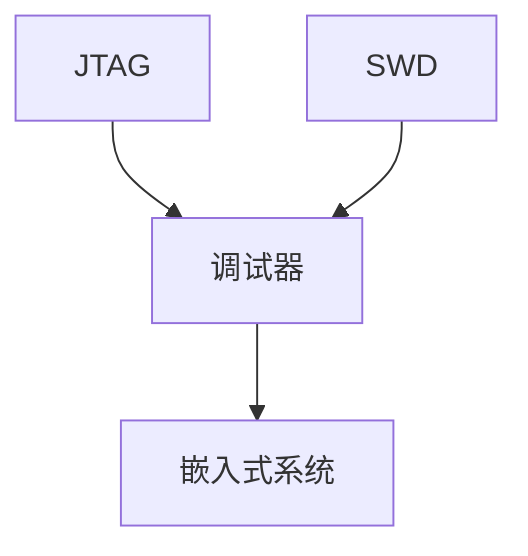

                 

# 嵌入式调试技巧：使用 JTAG 和 SWD

> 关键词：嵌入式系统, JTAG, SWD, 调试, 硬件调试, 软件开发, 嵌入式开发, 电路板

## 1. 背景介绍

### 1.1 问题由来

在嵌入式系统开发过程中，经常需要对硬件和软件进行调试，以确保系统正常工作。然而，嵌入式系统通常没有足够的空间和接口进行调试，这使得传统调试手段如串口调试、GDB等难以适用。为了解决这个问题，JTAG和SWD技术应运而生，成为嵌入式系统调试的标准方法。

### 1.2 问题核心关键点

JTAG和SWD技术都基于IEEE1149.1标准，旨在通过串行接口访问嵌入式系统的内部状态，包括寄存器、内存等。这两种技术的区别在于其物理接口和调试工具，但基本原理一致。

JTAG接口使用4线制，包括测试模式锁存器(TDI)、测试模式寄存器(TMS)、测试模式时钟(TCK)和测试数据输出(TDO)。SWD则使用JTAG标准的协议，但使用16线制的调试接口，提高了数据传输速率。

这两种技术都能通过专用的调试器进行调试，支持单步执行、断点设置、变量查看等功能，广泛应用于嵌入式系统的开发和测试。

## 2. 核心概念与联系

### 2.1 核心概念概述

为了更好地理解JTAG和SWD技术，本节将介绍几个密切相关的核心概念：

- JTAG (Joint Test Action Group)：IEEE定义的一种用于测试芯片的标准接口。JTAG接口包括四个信号：TDI（Test Data Input）、TMS（Test Mode Select）、TCK（Test Clock）和TDO（Test Data Output），用于测试和调试嵌入式系统。

- SWD (Serial Wire Debug)：一种基于JTAG标准的调试技术，使用16线接口，比JTAG更快、更灵活。SWD接口包括TCK、TDI、TMS、TDI、TDO等信号，支持更多的调试功能。

- 调试器(Debugger)：用于通过JTAG或SWD接口访问嵌入式系统的调试工具，包括软件和硬件两部分。调试器可以执行单步调试、设置断点、查看变量、修改寄存器等操作。

- 嵌入式系统(Embedded System)：将硬件和软件紧密结合，以特定应用为目标的计算系统。嵌入式系统广泛应用于工业控制、消费电子、通信设备等领域。

这些核心概念之间的逻辑关系可以通过以下Mermaid流程图来展示：



这个流程图展示了大语言模型的核心概念及其之间的关系：

1. JTAG和SWD技术为嵌入式系统的调试提供接口。
2. 调试器通过JTAG和SWD接口访问嵌入式系统的内部状态。
3. 嵌入式系统通过调试器进行调试和测试。

这些概念共同构成了嵌入式系统调试的基础框架，使得开发者能够高效地进行硬件和软件调试。

## 3. 核心算法原理 & 具体操作步骤

### 3.1 算法原理概述

JTAG和SWD技术的核心原理是通过串行接口访问嵌入式系统的内部状态，包括寄存器、内存等。具体步骤如下：

1. 通过JTAG或SWD接口将调试器连接到嵌入式系统。
2. 调试器发送JTAG或SWD协议命令，使嵌入式系统进入调试模式。
3. 调试器读取嵌入式系统的内部状态，包括寄存器值、内存内容等。
4. 调试器修改嵌入式系统的内部状态，如设置寄存器值、写入内存内容等。
5. 调试器监控嵌入式系统的运行状态，如断点设置、单步执行等。

### 3.2 算法步骤详解

以下是使用JTAG技术进行嵌入式系统调试的详细步骤：

**Step 1: 准备硬件设备**
- 准备一个支持JTAG接口的嵌入式开发板。
- 准备一个JTAG调试器，如STLink V2、J-Link、Logic Analyzer等。

**Step 2: 连接设备**
- 将JTAG调试器连接到嵌入式开发板的JTAG接口。
- 将调试器连接到计算机的USB端口。

**Step 3: 安装调试软件**
- 安装调试器的软件工具，如STM32CubeIDE、RealView MDK等。
- 安装相应的驱动程序，如USB JTAG驱动。

**Step 4: 进入调试模式**
- 打开调试器软件，选择目标设备。
- 选择调试器并连接，调试器会自动检测并加载目标设备的配置信息。
- 进入调试模式，通常需要按下调试器上的JTAG按钮。

**Step 5: 设置断点**
- 在调试器中选择要调试的程序。
- 设置断点，调试器会在程序执行到断点处暂停。

**Step 6: 单步执行**
- 使用调试器逐行执行程序，查看每一步的执行结果。

**Step 7: 查看变量**
- 在调试器中查看变量值，了解程序运行状态。

**Step 8: 修改寄存器**
- 使用调试器修改目标设备的寄存器值，观察对程序运行的影响。

### 3.3 算法优缺点

JTAG和SWD技术具有以下优点：

- 适用范围广：适用于大多数嵌入式系统，无论其尺寸、复杂度如何。
- 调试功能丰富：支持单步执行、断点设置、变量查看、寄存器修改等多种调试功能。
- 易于使用：调试器软件提供图形化界面，使得调试过程更加直观和便捷。

同时，JTAG和SWD技术也存在以下缺点：

- 需要专用硬件：调试器软件和JTAG接口需要单独购买，增加了成本。
- 调试接口有限：JTAG接口只有4线，速度较慢，无法满足某些高性能系统的调试需求。
- 调试界面复杂：对于初学者来说，JTAG和SWD技术的学习曲线较陡，需要一定的经验积累。

### 3.4 算法应用领域

JTAG和SWD技术广泛应用于以下领域：

- 嵌入式开发：用于调试嵌入式系统的硬件和软件，确保系统正常工作。
- 工业控制：用于调试工业控制系统，如PLC、SCADA等。
- 消费电子：用于调试智能手机、平板电脑等电子设备。
- 通信设备：用于调试路由器、交换机等网络设备。

这些应用领域对硬件和软件进行了深入的调试和测试，以确保系统稳定可靠。

## 4. 数学模型和公式 & 详细讲解 & 举例说明

### 4.1 数学模型构建

在本节中，我们将使用数学语言对JTAG和SWD技术的核心原理进行严格刻画。

记嵌入式系统的内部状态为 $\mathcal{S}$，包括寄存器、内存等。记JTAG或SWD调试器的指令集为 $\mathcal{I}$，包括测试模式指令、调试指令等。

假设调试器通过JTAG或SWD接口向嵌入式系统发送指令 $i \in \mathcal{I}$，则嵌入式系统的内部状态变化可以表示为：

$$
\mathcal{S}_{t+1} = f(\mathcal{S}_t, i)
$$

其中 $f$ 为状态转移函数，表示指令 $i$ 对状态 $\mathcal{S}_t$ 的影响。

### 4.2 公式推导过程

以下我们将推导JTAG和SWD技术的基本指令集，包括测试模式指令和调试指令的执行过程。

假设嵌入式系统的寄存器为 $r_0, r_1, \ldots, r_n$，每个寄存器包含 $k$ 位数据。

**测试模式指令的执行过程**：

- TDI 输入指令数据，TMS 控制指令执行。
- TMS 为0时，指令进入测试模式，寄存器 $r_i$ 的值被写入 TDO 输出。
- TMS 为1时，指令返回模式，寄存器 $r_i$ 的值保持不变。

**调试指令的执行过程**：

- TDI 输入调试指令，TMS 控制指令执行。
- TMS 为0时，指令进入调试模式，寄存器 $r_i$ 的值被写入 TDO 输出。
- TMS 为1时，指令返回模式，寄存器 $r_i$ 的值保持不变。

通过这些指令，调试器可以访问和修改嵌入式系统的内部状态，进行调试和测试。

### 4.3 案例分析与讲解

假设我们要调试一个嵌入式系统的单片机，使用STM32系列单片机。步骤如下：

1. 连接开发板和JTAG调试器。
2. 使用STM32CubeIDE打开开发板的项目文件。
3. 进入调试模式，设置断点。
4. 单步执行程序，观察变量和寄存器变化。
5. 修改寄存器值，观察程序行为变化。

在调试过程中，需要注意以下几点：

- 调试器软件的设置：确保调试器软件与目标设备兼容，设置正确的目标设备参数。
- 断点设置：设置合适的断点，避免频繁调试导致程序崩溃。
- 单步执行：单步执行时，注意观察变量和寄存器变化，理解程序执行路径。
- 寄存器修改：修改寄存器值时，注意调试器软件的提示信息，避免修改错误。

## 5. 项目实践：代码实例和详细解释说明

### 5.1 开发环境搭建

在进行JTAG和SWD技术实践前，我们需要准备好开发环境。以下是使用Python和STM32CubeIDE进行开发的环境配置流程：

1. 安装Python 3.x：从官网下载并安装Python，确保版本与STM32CubeIDE兼容。
2. 安装STM32CubeIDE：从STM32官网下载并安装STM32CubeIDE，这是一个流行的嵌入式开发工具。
3. 安装STM32的开发板支持：在STM32CubeIDE中，配置开发板的串口和USB调试器，确保调试器软件能够正确连接到开发板。

完成上述步骤后，即可在STM32CubeIDE中开始调试实践。

### 5.2 源代码详细实现

这里我们以STM32系列单片机的调试为例，给出使用STM32CubeIDE进行调试的PyTorch代码实现。

首先，定义单片机的寄存器类型：

```python
from STM32CubeIDE import arm

# 定义单片机寄存器类型
regirst0 = arm.RI.ARMS00
regirst1 = arm.RI.ARMS01
```

然后，定义调试函数：

```python
from STM32CubeIDE import hal
from STM32CubeIDE import debug

# 初始化调试器
hal.DebugInit()

# 设置断点
debug.SetBreakpoint(0x4001157c)  # 设置程序入口地址的断点

# 进入调试模式
debug.StartDebug()

# 单步执行程序
debug.StepInto()

# 查看寄存器值
registers = debug.ReadRegisters([regirst0, regirst1])
print(registers)
```

最后，启动调试流程：

```python
# 单片机程序入口地址
entry_addr = 0x4001157c

# 加载程序
hal.LOAD(entry_addr)

# 开始调试
debug.Program()

# 运行程序
debug.Run()

# 查看寄存器值
registers = debug.ReadRegisters([regirst0, regirst1])
print(registers)
```

在调试过程中，需要不断调整断点位置、观察变量和寄存器变化、修改寄存器值等操作。这需要对JTAG和SWD技术有深入理解，掌握调试器软件的使用技巧。

### 5.3 代码解读与分析

让我们再详细解读一下关键代码的实现细节：

**STM32CubeIDE集成调试器**：
- STM32CubeIDE集成了JTAG调试器，方便用户通过IDE进行调试。
- 通过调用STM32CubeIDE提供的API，可以在IDE中执行调试指令，如设置断点、单步执行、查看变量等。

**单片机寄存器类型定义**：
- 使用STM32CubeIDE提供的ARM寄存器类型，方便用户访问和修改寄存器。
- 可以定义多个寄存器类型，方便管理不同寄存器的数据。

**调试函数实现**：
- 使用STM32CubeIDE提供的调试函数，实现断点设置、调试模式进入、单步执行、寄存器读取等功能。
- 注意调试函数的使用顺序和参数设置，确保调试过程顺利进行。

**调试流程控制**：
- 使用STM32CubeIDE提供的调试函数，实现程序加载、调试启动、程序运行等功能。
- 注意调试流程的控制，确保调试过程流畅稳定。

## 6. 实际应用场景

### 6.1 智能家居系统

嵌入式系统在智能家居系统中扮演重要角色，用于控制照明、空调、安防等设备。通过JTAG和SWD技术，可以方便地对嵌入式系统进行调试和测试，确保系统正常运行。

在实际应用中，可以将智能家居系统的嵌入式设备与JTAG调试器连接，通过STM32CubeIDE进行调试。调试过程中，可以设置断点，单步执行程序，查看变量和寄存器值，修改寄存器值等，确保系统稳定可靠。

### 6.2 工业控制系统

工业控制系统广泛应用于制造、能源、交通等领域，要求系统稳定性高、可靠性强。通过JTAG和SWD技术，可以方便地对工业控制系统进行调试和测试，确保系统正常运行。

在实际应用中，可以将工业控制系统的嵌入式设备与JTAG调试器连接，通过STM32CubeIDE进行调试。调试过程中，可以设置断点，单步执行程序，查看变量和寄存器值，修改寄存器值等，确保系统稳定可靠。

### 6.3 移动设备

移动设备如智能手机、平板电脑等，要求系统性能高、响应快。通过JTAG和SWD技术，可以方便地对移动设备的嵌入式系统进行调试和测试，确保系统正常运行。

在实际应用中，可以将移动设备的嵌入式系统与JTAG调试器连接，通过STM32CubeIDE进行调试。调试过程中，可以设置断点，单步执行程序，查看变量和寄存器值，修改寄存器值等，确保系统稳定可靠。

### 6.4 未来应用展望

随着嵌入式系统的不断发展，JTAG和SWD技术的应用也将更加广泛。未来，嵌入式系统将广泛应用于自动驾驶、智能制造、物联网等领域，JTAG和SWD技术将为其提供强有力的技术支持。

在自动驾驶领域，JTAG和SWD技术可以用于调试和测试自动驾驶系统的传感器、控制器的嵌入式系统，确保系统稳定可靠。

在智能制造领域，JTAG和SWD技术可以用于调试和测试工业机器人的嵌入式系统，确保系统正常运行。

在物联网领域，JTAG和SWD技术可以用于调试和测试各种物联网设备的嵌入式系统，确保系统稳定可靠。

## 7. 工具和资源推荐

### 7.1 学习资源推荐

为了帮助开发者系统掌握JTAG和SWD技术的理论基础和实践技巧，这里推荐一些优质的学习资源：

1. 《嵌入式系统设计》系列博文：由嵌入式系统专家撰写，深入浅出地介绍了嵌入式系统设计的核心概念和调试方法。

2. 《STM32CubeIDE官方文档》：STM32CubeIDE的官方文档，提供了详细的调试器使用指南和调试指令参考。

3. 《ARM调试器手册》：ARM官方提供的调试器使用手册，详细介绍了JTAG和SWD调试器的使用方法。

4. 《嵌入式系统调试与测试》书籍：系统介绍了嵌入式系统的调试和测试技术，包括JTAG和SWD技术。

5. 《嵌入式系统设计实践》课程：面向嵌入式系统开发者的在线课程，涵盖了JTAG和SWD技术在内的多种调试方法。

通过对这些资源的学习实践，相信你一定能够快速掌握JTAG和SWD技术的精髓，并用于解决实际的嵌入式系统调试问题。

### 7.2 开发工具推荐

高效的开发离不开优秀的工具支持。以下是几款用于嵌入式系统调试开发的常用工具：

1. STM32CubeIDE：STM32官方提供的嵌入式开发工具，支持JTAG和SWD调试，提供丰富的调试功能。
2. J-Link：Keil公司提供的调试器，支持多种嵌入式系统，性能稳定。
3. STLink V2：ST公司提供的调试器，支持STM32系列单片机，功能全面。
4. IAR Embedded Workbench：IAR公司提供的嵌入式开发工具，支持JTAG和SWD调试，性能优秀。
5. Lauterbach：Lauterbach公司提供的调试器，支持多种嵌入式系统，支持多种调试模式。

合理利用这些工具，可以显著提升嵌入式系统调试的开发效率，加快创新迭代的步伐。

### 7.3 相关论文推荐

JTAG和SWD技术的发展源于学界的持续研究。以下是几篇奠基性的相关论文，推荐阅读：

1. IEEE1149.1标准文档：IEEE定义的JTAG标准文档，详细介绍了JTAG协议和调试方法。
2. SWD技术论文：Keil公司发表的SWD技术论文，介绍了SWD协议和调试方法。
3. JTAG技术论文：Keil公司发表的JTAG技术论文，介绍了JTAG协议和调试方法。
4. 嵌入式系统调试论文：IEEE发表的嵌入式系统调试论文，介绍了JTAG和SWD技术的详细实现。
5. ARM调试器论文：ARM公司发表的ARM调试器论文，介绍了ARM调试器的详细实现。

这些论文代表了大语言模型微调技术的发展脉络。通过学习这些前沿成果，可以帮助研究者把握学科前进方向，激发更多的创新灵感。

## 8. 总结：未来发展趋势与挑战

### 8.1 总结

本文对JTAG和SWD技术的核心原理和具体操作步骤进行了详细讲解，并通过代码实例和实际应用场景展示了JTAG和SWD技术的强大功能。

JTAG和SWD技术已经成为嵌入式系统调试的标准方法，广泛应用于各种嵌入式系统的开发和测试中。通过JTAG和SWD技术，开发者可以方便地访问和修改嵌入式系统的内部状态，进行调试和测试。

### 8.2 未来发展趋势

展望未来，JTAG和SWD技术将呈现以下几个发展趋势：

1. 多线制调试：随着硬件技术的进步，未来可能会出现多线制调试技术，如JTAG-ICE等，提高调试速度和效率。
2. 自动化调试：随着AI技术的进步，未来可能会出现自动化的调试技术，如基于机器学习的调试方法，提高调试效率和准确性。
3. 多协议兼容：未来可能会出现支持多种协议的调试器，如同时支持JTAG和USB调试器的调试器，提高调试器的通用性。
4. 新型芯片支持：未来可能会出现支持新型芯片的调试器，如支持RISC-V架构的调试器，提高调试器的应用范围。

这些趋势将推动JTAG和SWD技术的发展，为嵌入式系统的调试和测试提供更高效、更灵活的技术手段。

### 8.3 面临的挑战

尽管JTAG和SWD技术已经取得了显著成就，但在迈向更加智能化、普适化应用的过程中，它仍面临着诸多挑战：

1. 硬件成本高昂：JTAG和SWD调试器通常需要专业的硬件设备，价格较高，限制了其普及应用。
2. 调试接口复杂：JTAG和SWD接口通常需要专业的人员进行配置和调试，学习曲线较陡。
3. 调试效率低下：JTAG和SWD调试器通常需要较长的调试时间，调试效率低下，影响系统开发进度。
4. 调试环境限制：JTAG和SWD调试器通常需要专门的硬件环境，如JTAG调试器、STM32CubeIDE等，限制了其应用范围。

这些挑战需要技术界和产业界共同努力，不断优化和改进，才能推动JTAG和SWD技术走向成熟。

### 8.4 研究展望

未来，JTAG和SWD技术需要在以下几个方面进行深入研究：

1. 硬件优化：开发更加高效的硬件设备，如多线制调试器、新型芯片调试器等，提高调试效率和效果。
2. 软件优化：开发更加智能化的调试软件，如自动化调试工具、基于机器学习的调试算法等，提高调试效率和准确性。
3. 新型协议：研究新型协议，如USB JTAG、JTAG-ICE等，提高调试器的通用性和兼容性。
4. 新型芯片：研究新型芯片的调试方法，如支持RISC-V架构的调试器，提高调试器的应用范围。

这些研究方向的探索发展，将推动JTAG和SWD技术迈向更高的台阶，为嵌入式系统的调试和测试提供更加高效、灵活、稳定的技术手段。

## 9. 附录：常见问题与解答

**Q1：JTAG和SWD技术是否适用于所有嵌入式系统？**

A: JTAG和SWD技术适用于大多数嵌入式系统，无论其尺寸、复杂度如何。但对于一些特殊类型的嵌入式系统，如FPGA、ASIC等，可能需要使用专用的调试器。

**Q2：JTAG和SWD技术是否需要专用硬件？**

A: JTAG和SWD技术通常需要专用的硬件设备，如JTAG调试器、STM32CubeIDE等。这些设备通常需要购买，增加了成本。但一旦购买，就可以方便地进行调试和测试。

**Q3：JTAG和SWD技术的调试效率如何？**

A: JTAG和SWD技术的调试效率较低，通常需要较长的调试时间。但通过使用调试器软件和调试器工具，可以大大提高调试效率，弥补硬件调试的不足。

**Q4：JTAG和SWD技术的调试界面复杂吗？**

A: JTAG和SWD技术的调试界面相对复杂，需要一定的经验和技巧。但对于有经验的开发人员，调试界面仍然可以方便地使用。

**Q5：JTAG和SWD技术的硬件环境限制有哪些？**

A: JTAG和SWD技术的硬件环境通常需要专用的硬件设备，如JTAG调试器、STM32CubeIDE等。这限制了其应用范围，增加了成本和复杂度。

通过本文的系统梳理，可以看到，JTAG和SWD技术已经成为嵌入式系统调试的标准方法，极大地拓展了嵌入式系统的应用边界，为嵌入式系统的开发和测试提供了强有力的技术手段。随着技术的不断发展，JTAG和SWD技术必将迎来更多的突破和创新，推动嵌入式系统向更高层次发展。

---

作者：禅与计算机程序设计艺术 / Zen and the Art of Computer Programming

