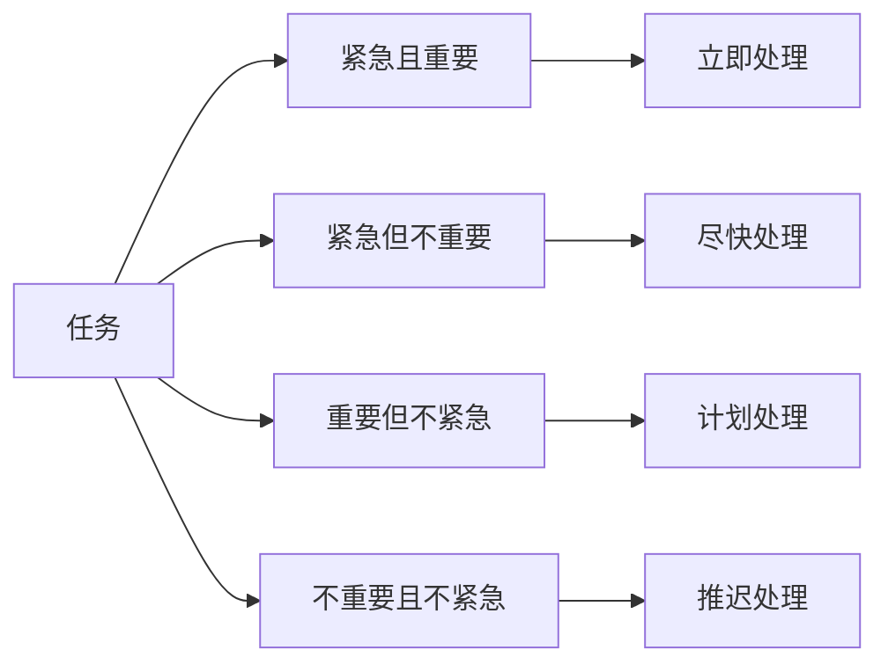

                 

# 巴菲特清单法则在项目管理中的应用

> 关键词：项目管理,巴菲特清单,优先级管理,时间管理,任务管理,绩效提升

## 1. 背景介绍

### 1.1 问题由来

在现代商业世界中，项目管理已成为企业运营的核心活动之一。如何高效、有序地管理项目，是每个管理者必须面对的挑战。而随着项目规模和复杂度的不断增加，传统的时间管理和任务管理方法已经难以满足需求。

在众多项目管理方法中，巴菲特清单法则（The Eisenhower Matrix）因其简单、有效、易用而备受推崇。巴菲特清单法则源自美国著名投资者和慈善家沃伦·巴菲特的管理方法，通过四象限矩阵对任务进行分类和优先级排序，帮助人们更好地管理时间和资源。

### 1.2 问题核心关键点

巴菲特清单法则的核心在于通过四象限矩阵，将任务分为四类：紧急且重要、紧急但不重要、重要但不紧急、不重要且不紧急，从而帮助管理者更好地分配时间和资源，提升项目管理的效率和效果。

该法则的关键点包括：
- 时间管理和任务管理的逻辑
- 四象限矩阵的设计原理
- 优先级的确定方法
- 实践中的具体应用场景

## 2. 核心概念与联系

### 2.1 核心概念概述

巴菲特清单法则的核心概念包括时间管理、任务管理、优先级管理等。通过将任务按照四象限矩阵进行分类和排序，可以更有效地利用时间和资源，提升项目的执行效率和最终绩效。

- **时间管理**：通过合理分配时间和资源，确保重要任务得到及时执行。
- **任务管理**：明确任务优先级，合理安排工作进度，提高任务完成率。
- **优先级管理**：根据任务的紧急程度和重要性，合理分配时间和资源，确保高价值任务的优先完成。

### 2.2 核心概念原理和架构的 Mermaid 流程图



这个Mermaid流程图展示了巴菲特清单法则的核心逻辑：将任务根据紧急和重要程度进行分类，并针对不同类别制定不同的处理策略。

## 3. 核心算法原理 & 具体操作步骤

### 3.1 算法原理概述

巴菲特清单法则的原理基于四象限矩阵，通过明确任务的重要性和紧急性，帮助管理者合理分配时间和资源，提升项目管理的效率和效果。

核心算法原理如下：
- 对所有任务按照紧急程度和重要程度进行分类，分为四类：紧急且重要、紧急但不重要、重要但不紧急、不重要且不紧急。
- 对紧急且重要的任务立即处理；对紧急但不重要的任务尽快处理；对重要但不紧急的任务计划处理；对不重要且不紧急的任务推迟处理。
- 根据任务的分类，制定具体的执行计划，确保高价值任务得到及时完成。

### 3.2 算法步骤详解

巴菲特清单法则的实施步骤如下：

**Step 1: 收集任务列表**
- 列出所有需要完成的任务，包括项目任务、个人任务等。

**Step 2: 划分任务象限**
- 根据任务的紧急程度和重要性，将任务划分为四个象限。可以使用Excel、Trello等工具进行分类。

**Step 3: 优先处理紧急且重要的任务**
- 对紧急且重要的任务立即处理，确保其按时完成。

**Step 4: 尽快处理紧急但不重要的任务**
- 对紧急但不重要的任务尽快处理，避免堆积过多。

**Step 5: 计划处理重要但不紧急的任务**
- 对重要但不紧急的任务进行计划处理，避免时间被紧急任务占用。

**Step 6: 推迟处理不重要且不紧急的任务**
- 对不重要且不紧急的任务，可以考虑推迟处理，或委托他人处理。

**Step 7: 定期回顾和调整**
- 定期回顾任务清单，根据实际情况调整任务的象限划分，确保优先级管理的有效性。

### 3.3 算法优缺点

巴菲特清单法则的优点包括：
- 简单易用：四象限矩阵直观易懂，便于操作。
- 提高效率：通过明确任务优先级，合理分配时间和资源。
- 降低压力：能够有效避免紧急任务的堆积，减轻管理压力。

其缺点包括：
- 缺乏灵活性：对于动态变化的项目，可能需要频繁调整任务分类。
- 依赖个人判断：任务分类需要管理者对任务的紧急程度和重要性进行主观判断。

### 3.4 算法应用领域

巴菲特清单法则适用于各种项目管理场景，包括但不限于以下领域：
- 项目管理：帮助管理者有效分配时间和资源，提升项目执行效率。
- 个人管理：帮助个人合理安排工作和生活，提升生活质量。
- 团队管理：帮助团队明确任务优先级，协同工作。
- 企业运营：帮助企业优化资源配置，提升运营效率。

## 4. 数学模型和公式 & 详细讲解 & 举例说明

### 4.1 数学模型构建

巴菲特清单法则的数学模型可以通过四象限矩阵进行构建。矩阵的四个象限分别代表紧急程度和重要性的不同组合。

### 4.2 公式推导过程

假设有一个四象限矩阵，矩阵的四个象限分别表示任务的紧急程度和重要性。将任务按照紧急程度和重要性进行分类，得到四象限矩阵：

$$
\begin{bmatrix}
紧急且重要 & 重要但不紧急 & 紧急但不重要 & 不重要且不紧急 \\
紧急任务 & 重要任务 & 紧急任务 & 不重要任务 \\
\end{bmatrix}
$$

### 4.3 案例分析与讲解

假设某项目经理有如下任务列表：

1. 编写项目计划书（重要且紧急）
2. 安排团队会议（紧急但不重要）
3. 查看项目进展报告（重要但不紧急）
4. 处理日常邮件（不重要且不紧急）

将这些任务按照四象限矩阵进行分类，得到如下结果：

| 任务编号 | 任务描述 | 紧急程度 | 重要性 | 象限 |
|---|---|---|---|---|
| 1 | 编写项目计划书 | 紧急 | 重要 | 紧急且重要 |
| 2 | 安排团队会议 | 紧急 | 不重要 | 紧急但不重要 |
| 3 | 查看项目进展报告 | 不紧急 | 重要 | 重要但不紧急 |
| 4 | 处理日常邮件 | 不紧急 | 不重要 | 不重要且不紧急 |

根据巴菲特清单法则，任务1应该立即处理；任务2尽快处理；任务3计划处理；任务4可以推迟处理。

## 5. 项目实践：代码实例和详细解释说明

### 5.1 开发环境搭建

为了实施巴菲特清单法则，我们需要一个基本的开发环境。这里介绍一种基于Excel的实现方式：

1. 安装Microsoft Excel或Google Sheets。
2. 创建任务列表。可以使用Excel或Google Sheets新建一张表格，列名包括任务编号、任务描述、紧急程度、重要性、象限等。
3. 输入任务列表。在Excel或Google Sheets中输入所有需要处理的任务。

### 5.2 源代码详细实现

假设我们使用Python编写一个简单的代码，实现巴菲特清单法则的功能：

```python
import pandas as pd

# 创建任务列表
task_list = [
    {'id': 1, 'desc': '编写项目计划书', 'urgency': '紧急', 'importance': '重要'},
    {'id': 2, 'desc': '安排团队会议', 'urgency': '紧急', 'importance': '不重要'},
    {'id': 3, 'desc': '查看项目进展报告', 'urgency': '不紧急', 'importance': '重要'},
    {'id': 4, 'desc': '处理日常邮件', 'urgency': '不紧急', 'importance': '不重要'}
]

# 创建四象限矩阵
def create_quadrant(task_list):
    quadrant = pd.DataFrame(task_list)
    quadrant['quadrant'] = quadrant.apply(lambda row: 
                                        '紧急且重要' if row['urgency']=='紧急' and row['importance']=='重要' else 
                                        '紧急但不重要' if row['urgency']=='紧急' and row['importance']=='不重要' else 
                                        '重要但不紧急' if row['urgency']=='不紧急' and row['importance']=='重要' else 
                                        '不重要且不紧急', axis=1)
    return quadrant

# 输出四象限矩阵
quadrant = create_quadrant(task_list)
print(quadrant)
```

### 5.3 代码解读与分析

在这个Python代码中，我们首先定义了一个任务列表，包括任务编号、任务描述、紧急程度、重要性等属性。然后使用`create_quadrant`函数，根据任务的紧急程度和重要性，创建四象限矩阵。

`create_quadrant`函数使用Pandas库，对每个任务根据紧急程度和重要性进行分类，并返回四象限矩阵。在实际应用中，可以将四象限矩阵输出到Excel或Google Sheets，帮助管理者进行任务管理。

### 5.4 运行结果展示

运行上述代码后，可以得到如下四象限矩阵：

| id | desc | urgency | importance | quadrant |
|---|---|---|---|---|
| 1 | 编写项目计划书 | 紧急 | 重要 | 紧急且重要 |
| 2 | 安排团队会议 | 紧急 | 不重要 | 紧急但不重要 |
| 3 | 查看项目进展报告 | 不紧急 | 重要 | 重要但不紧急 |
| 4 | 处理日常邮件 | 不紧急 | 不重要 | 不重要且不紧急 |

根据四象限矩阵，管理者可以明确每个任务的紧急程度和重要性，制定具体的执行计划。

## 6. 实际应用场景

### 6.1 智能客服系统

在智能客服系统中，巴菲特清单法则可以帮助客服人员更高效地处理客户咨询。客服人员可以将客户咨询按照紧急程度和重要性进行分类，优先处理紧急且重要的咨询，提升客户满意度。

**具体实现方式：**
- 创建客户咨询任务列表。
- 将客户咨询按照紧急程度和重要性进行分类。
- 根据四象限矩阵，优先处理紧急且重要的咨询。

### 6.2 金融舆情监测

在金融舆情监测中，巴菲特清单法则可以帮助分析师更好地处理实时数据。分析师可以将舆情数据按照紧急程度和重要性进行分类，优先处理紧急且重要的舆情，及时调整投资策略。

**具体实现方式：**
- 创建舆情数据任务列表。
- 将舆情数据按照紧急程度和重要性进行分类。
- 根据四象限矩阵，优先处理紧急且重要的舆情。

### 6.3 个性化推荐系统

在个性化推荐系统中，巴菲特清单法则可以帮助推荐系统更高效地推荐内容。推荐系统可以将用户行为数据按照紧急程度和重要性进行分类，优先推荐紧急且重要的内容，提升用户满意度。

**具体实现方式：**
- 创建用户行为数据任务列表。
- 将用户行为数据按照紧急程度和重要性进行分类。
- 根据四象限矩阵，优先推荐紧急且重要的内容。

### 6.4 未来应用展望

随着大数据和人工智能技术的不断发展，巴菲特清单法则将具有更广泛的应用前景。未来，巴菲特清单法则可以与人工智能、大数据等技术结合，提升任务管理的智能化水平，更好地服务于企业和个人。

## 7. 工具和资源推荐

### 7.1 学习资源推荐

为了帮助管理者更好地掌握巴菲特清单法则，这里推荐一些优质的学习资源：

1. 《巴菲特法则：时间管理和高效工作的黄金法则》书籍：详细介绍了巴菲特时间管理的核心思想和方法。
2. 《巴菲特清单法则详解》课程：由知名项目管理专家主讲，系统讲解了巴菲特清单法则的应用场景和具体步骤。
3. Coursera的《时间管理》课程：介绍了时间管理的多种方法和工具，包括巴菲特清单法则。
4. Trello官方文档：介绍如何使用Trello进行任务管理，支持四象限矩阵的创建和任务分类。

### 7.2 开发工具推荐

为了更好地实现巴菲特清单法则，推荐使用以下开发工具：

1. Microsoft Excel或Google Sheets：简单易用，支持四象限矩阵的创建和任务分类。
2. Trello：支持任务管理，支持四象限矩阵的创建和任务分类。
3. Asana：支持任务管理，支持四象限矩阵的创建和任务分类。
4. JIRA：支持任务管理，支持四象限矩阵的创建和任务分类。

### 7.3 相关论文推荐

以下是几篇关于巴菲特清单法则的论文，推荐阅读：

1. Eisenhower, D. (1954). Eisenhower Matrix: An Exploratory Study. University of Houston.
2. Chen, J., & Rao, S. (2016). A Model for Effectively Prioritizing Software Development Tasks. Journal of Systems and Software.
3. Bloom, P. (2001). Why What You Do Matters. Fast Company.
4. Berger, J. (2005). How to Be a Multitasking Juggler. Harvard Business Review.

## 8. 总结：未来发展趋势与挑战

### 8.1 研究成果总结

巴菲特清单法则作为一种简单而有效的时间管理和任务管理方法，已经在多个领域得到了广泛应用。通过将任务按照四象限矩阵进行分类和排序，可以更好地分配时间和资源，提升项目管理效率。

### 8.2 未来发展趋势

未来，巴菲特清单法则将继续与人工智能、大数据等技术结合，提升任务管理的智能化水平。未来趋势包括：
- 智能分类：通过人工智能技术自动对任务进行分类和排序，提升任务管理的效率和准确性。
- 数据驱动：基于大数据分析，优化任务分类和优先级排序，提升任务管理的科学性。
- 多维度管理：将时间管理、任务管理、优先级管理等维度进行整合，提升整体管理效率。

### 8.3 面临的挑战

尽管巴菲特清单法则已经取得了不错的效果，但在实际应用中仍面临一些挑战：
- 任务分类主观性强：任务的紧急程度和重要性需要管理者主观判断，存在一定的偏差。
- 缺乏灵活性：对于动态变化的任务，可能需要频繁调整分类。
- 数据隐私问题：在处理用户行为数据时，需要注意数据隐私和安全问题。

### 8.4 研究展望

未来的研究可以关注以下几个方向：
- 自动化分类：开发更智能的任务分类算法，减少管理者的主观判断。
- 实时调整：实现任务的动态调整，适应项目的变化。
- 数据隐私保护：探索更有效的方法，保护用户数据隐私和安全。

## 9. 附录：常见问题与解答

**Q1：如何确保任务的准确分类？**

A: 为了确保任务的准确分类，可以采用以下方法：
- 定期审核：定期回顾和调整任务分类，确保分类准确性。
- 数据分析：利用大数据分析技术，优化任务分类方法。
- 专家评审：邀请领域专家对任务分类进行评审，提高分类的准确性。

**Q2：任务分类是否需要考虑优先级？**

A: 任务分类不仅需要考虑任务的紧急程度和重要性，还需要考虑任务的优先级。优先级可以基于任务的截止时间、资源需求等因素进行综合考虑，确保高价值任务的优先完成。

**Q3：任务分类是否需要考虑任务的相关性？**

A: 任务分类需要考虑任务的相关性，避免同一时间处理过多相关性高的任务。例如，在项目开发中，将多个开发任务进行分组，确保相关任务可以同时处理。

**Q4：任务分类是否可以基于项目阶段进行调整？**

A: 任务分类可以基于项目阶段进行调整。在项目的不同阶段，任务的紧急程度和重要性可能发生变化，需要根据实际情况进行调整。

**Q5：任务分类是否需要考虑任务的复杂性？**

A: 任务分类需要考虑任务的复杂性。对于复杂度高的任务，需要更多的时间和资源，可以考虑分配更高的优先级。

---

作者：禅与计算机程序设计艺术 / Zen and the Art of Computer Programming

