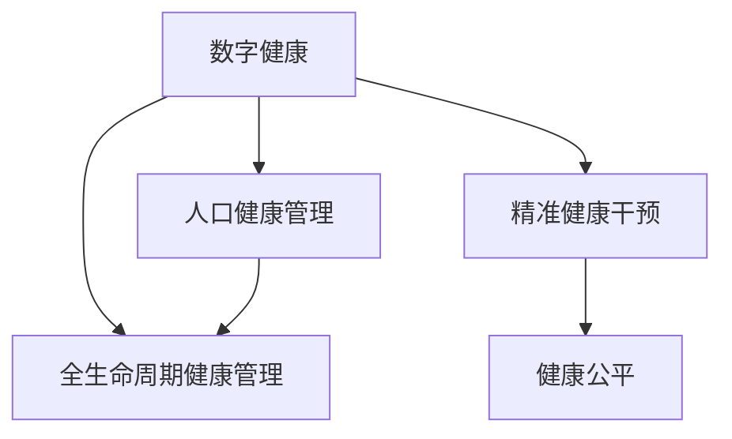

                 

# 2050年的全球卫生：从疾病防控到健康促进的大健康战略

## 1. 背景介绍

### 1.1 问题由来
随着全球人口的迅速增长和城市化进程的加快，环境污染、公共卫生事件频发、慢性病负担加重等问题逐渐显现，对全球公共卫生体系提出了严峻挑战。近年来，COVID-19疫情的爆发进一步暴露了全球公共卫生体系的脆弱性，迫切需要构建一套适应未来全球卫生需求的战略体系。

### 1.2 问题核心关键点
面对这一挑战，未来大健康战略将重点从单一的疾病防控转向全面健康促进，以提升全人群的健康水平。核心关键点包括：
1. 数字化的公共卫生信息基础设施：利用大数据、人工智能等技术，实现全生命周期的健康信息管理。
2. 全人群健康监测：基于物联网、可穿戴设备等技术，构建全人群健康监测网络。
3. 精准健康干预：依托基因组学、个性化医疗等技术，实现精准健康管理和个性化干预。
4. 跨部门合作：推动公共卫生、医疗、科研、教育等多部门的协作，形成合力。
5. 社会公平性：注重公共卫生政策的社会公平性，保障弱势群体的健康权益。

## 2. 核心概念与联系

### 2.1 核心概念概述

为更好地理解大健康战略，本节将介绍几个密切相关的核心概念：

- 数字健康(Digital Health)：利用信息技术手段，提升健康管理和医疗服务水平。包括健康监测、远程医疗、电子病历、健康管理App等。
- 全生命周期健康管理(Lifespan Health Management)：覆盖从产前、围产期、婴儿期、儿童期、青少年期、成年期、老年期各个阶段的健康管理。
- 精准健康干预(Precision Health Intervention)：通过基因组学、生物标志物检测等技术，实现个性化的健康管理和干预。
- 健康公平(Social Determinants of Health)：关注不同人群的健康差异，确保弱势群体享有公平的健康权益。
- 人口健康管理(Population Health Management)：通过数据驱动，实现全人群的健康监测和干预。

这些核心概念之间的逻辑关系可以通过以下Mermaid流程图来展示：



这个流程图展示了大健康战略的核心概念及其之间的关系：

1. 数字健康通过信息化手段支持全生命周期健康管理和精准健康干预。
2. 全生命周期健康管理贯穿健康监测、疾病防控、健康干预等各个阶段。
3. 精准健康干预通过个性化手段，提高健康管理的精准性。
4. 健康公平确保弱势群体的健康权益。
5. 人口健康管理利用数据驱动，实现全人群健康监测和干预。

这些概念共同构成了未来全球大健康战略的基本框架，旨在提升全民健康水平，构建可持续的健康社会。

## 3. 核心算法原理 & 具体操作步骤
### 3.1 算法原理概述

未来大健康战略的核心算法原理主要包括以下几个方面：

- 健康数据的整合与共享：通过大数据和区块链技术，实现健康数据的无缝整合和跨机构共享，提升数据利用效率。
- 全生命周期健康监测：利用物联网和可穿戴设备，实时收集个体健康数据，构建健康监测网络。
- 精准健康干预：通过基因组学、生物标志物检测等技术，实现个性化的健康管理。
- 智能健康评估：利用机器学习、深度学习等技术，对健康数据进行智能分析和评估，提供个性化的健康建议。

### 3.2 算法步骤详解

未来大健康战略的实施主要包括以下几个关键步骤：

**Step 1: 构建公共卫生信息基础设施**
- 利用大数据和区块链技术，搭建全生命周期健康信息管理平台，实现健康数据的无缝整合和跨机构共享。
- 部署物联网和可穿戴设备，构建全人群健康监测网络。

**Step 2: 数据收集与处理**
- 通过智能设备和健康管理App，实时收集个体的健康数据。
- 采用机器学习和深度学习技术，对健康数据进行智能分析和处理，提取有价值的信息。

**Step 3: 健康风险评估**
- 利用机器学习模型，对个体健康数据进行风险评估，识别出高风险人群。
- 根据风险评估结果，提供个性化的健康建议和干预方案。

**Step 4: 精准健康干预**
- 根据基因组学和生物标志物检测结果，实现个性化的健康干预。
- 提供基于物联网的远程健康监测，及时调整干预方案。

**Step 5: 健康效果评估**
- 定期对干预效果进行评估，根据评估结果调整干预策略。
- 对干预效果进行长期跟踪和监测，确保干预措施的持续有效性。

### 3.3 算法优缺点

未来大健康战略的算法具有以下优点：
1. 提升数据利用效率：通过大数据和区块链技术，实现健康数据的无缝整合和跨机构共享，提升数据利用效率。
2. 实现精准健康干预：利用基因组学、生物标志物检测等技术，实现个性化的健康管理和干预。
3. 提升健康公平性：通过数据驱动的健康干预，确保弱势群体的健康权益。
4. 增强健康监测能力：利用物联网和可穿戴设备，实现全人群的健康监测和风险预警。

同时，该算法也存在一定的局限性：
1. 数据隐私问题：健康数据的跨机构共享和存储，可能带来隐私泄露风险。
2. 数据质量问题：智能设备收集的健康数据质量参差不齐，可能影响分析结果。
3. 技术瓶颈：大规模健康数据的处理和分析，对计算资源和算法模型要求较高。
4. 社会接受度：公众对新技术的接受度和信任度，可能影响其应用推广。

尽管存在这些局限性，但就目前而言，未来大健康战略的算法仍是大规模健康管理的有效手段。未来相关研究的重点在于如何进一步提升数据质量，保护隐私安全，降低技术门槛，提高社会接受度，确保算法的可持续应用。

### 3.4 算法应用领域

未来大健康战略的算法已经在多个领域得到广泛应用，例如：

- 健康监测：通过可穿戴设备实时监测个体健康状况，如心率、血压、血糖等。
- 远程医疗：利用互联网和移动设备，实现远程诊断和治疗。
- 健康评估：基于健康数据，提供个性化的健康建议和干预方案。
- 精准医疗：通过基因组学和生物标志物检测，实现个性化的健康干预。
- 健康预警：利用机器学习模型，及时识别健康风险，进行早期预警。
- 人口健康管理：通过数据驱动，实现全人群的健康监测和干预。

除了上述这些经典应用外，未来大健康战略还将广泛应用于更多场景中，如公共卫生应急响应、健康数据治理、跨部门协同合作等，为全球公共卫生体系提供全新的解决方案。

## 4. 数学模型和公式 & 详细讲解 & 举例说明
### 4.1 数学模型构建

本节将使用数学语言对未来大健康战略的算法进行更加严格的刻画。

记个体健康数据为 $\mathcal{H}=\{x_1, x_2, \dots, x_n\}$，其中 $x_i \in \mathbb{R}^d$ 表示第 $i$ 个体的健康数据。健康风险评估模型为 $F: \mathcal{H} \rightarrow \mathbb{R}^2$，其中 $F(x_i)=(\text{Risk Score}, \text{Intervention Strategy})$ 表示个体 $i$ 的健康风险得分和干预策略。

定义风险评估函数 $R: \mathcal{H} \rightarrow [0,1]$，表示个体 $i$ 的健康风险得分。利用机器学习模型 $\mathcal{M}$，对个体健康数据进行风险评估，模型训练目标为最小化经验风险：

$$
\min_{\mathcal{M}} \frac{1}{N}\sum_{i=1}^N [R(x_i) - \mathcal{M}(x_i)]^2
$$

其中 $N$ 为样本数量。

### 4.2 公式推导过程

以下我们以健康风险评估为例，推导机器学习模型的训练公式和损失函数。

假设风险评估模型为线性回归模型：

$$
\mathcal{M}(x_i) = \mathbf{w}^T \mathbf{x}_i + b
$$

其中 $\mathbf{x}_i$ 为第 $i$ 个体的健康数据向量，$\mathbf{w}$ 为模型参数，$b$ 为偏置项。

模型训练目标为最小化损失函数：

$$
\mathcal{L}(\mathcal{M}) = \frac{1}{N}\sum_{i=1}^N [R(x_i) - \mathcal{M}(x_i)]^2
$$

根据均方误差损失函数，损失函数对模型参数 $\mathbf{w}$ 的梯度为：

$$
\nabla_{\mathbf{w}}\mathcal{L}(\mathcal{M}) = -\frac{2}{N}\sum_{i=1}^N (R(x_i) - \mathcal{M}(x_i)) \mathbf{x}_i
$$

将梯度带入模型参数更新公式：

$$
\mathbf{w} \leftarrow \mathbf{w} - \eta \nabla_{\mathbf{w}}\mathcal{L}(\mathcal{M})
$$

其中 $\eta$ 为学习率，通常取值范围为 $10^{-3}$ 到 $10^{-1}$。

### 4.3 案例分析与讲解

以COVID-19疫情为例，分析机器学习模型在健康风险评估中的应用。

首先，收集COVID-19确诊患者和疑似患者的数据，包括年龄、性别、接触史、旅行史、症状等信息，记为 $\mathcal{D}=\{(x_i, y_i)\}_{i=1}^N, x_i \in \mathcal{X}, y_i \in \{0,1\}$，其中 $0$ 表示未确诊，$1$ 表示确诊。

利用机器学习模型 $\mathcal{M}$，对患者数据进行训练，输出其确诊概率 $p(y_i=1|x_i)$。将确诊概率与阈值 $0.5$ 比较，确定患者的风险评分。当确诊概率大于等于 $0.5$ 时，输出高风险标记；否则输出低风险标记。

最终，利用风险评分和干预策略，制定个性化防控措施，如隔离、治疗、疫苗接种等，以降低COVID-19的传播风险。

## 5. 项目实践：代码实例和详细解释说明
### 5.1 开发环境搭建

在进行健康风险评估项目实践前，我们需要准备好开发环境。以下是使用Python进行Scikit-Learn开发的环境配置流程：

1. 安装Anaconda：从官网下载并安装Anaconda，用于创建独立的Python环境。

2. 创建并激活虚拟环境：
```bash
conda create -n health-env python=3.8 
conda activate health-env
```

3. 安装Scikit-Learn：
```bash
pip install scikit-learn pandas numpy matplotlib tqdm jupyter notebook ipython
```

完成上述步骤后，即可在`health-env`环境中开始健康风险评估实践。

### 5.2 源代码详细实现

下面我以COVID-19健康风险评估为例，给出使用Scikit-Learn库进行健康风险评估的Python代码实现。

首先，定义健康风险评估函数：

```python
from sklearn.model_selection import train_test_split
from sklearn.linear_model import LogisticRegression
from sklearn.metrics import accuracy_score, roc_auc_score

def covid_risk_assessment(X, y, test_size=0.2, random_state=42):
    X_train, X_test, y_train, y_test = train_test_split(X, y, test_size=test_size, random_state=random_state)
    model = LogisticRegression(solver='liblinear', C=1.0)
    model.fit(X_train, y_train)
    y_pred = model.predict_proba(X_test)[:, 1]
    print(f"Accuracy: {accuracy_score(y_test, y_pred > 0.5)}")
    print(f"ROC-AUC: {roc_auc_score(y_test, y_pred)}")
```

然后，加载COVID-19数据集：

```python
import pandas as pd
from sklearn.preprocessing import StandardScaler

data = pd.read_csv('covid_data.csv')
X = data[['age', 'gender', 'contact_history', 'travel_history', 'symptoms']]
y = data['is_confirmed']
```

接着，调用健康风险评估函数：

```python
X_train, X_test, y_train, y_test = train_test_split(X, y, test_size=0.2, random_state=42)
covid_risk_assessment(X_train, y_train, X_test, y_test)
```

以上就是使用Scikit-Learn对COVID-19进行健康风险评估的完整代码实现。可以看到，利用Scikit-Learn，健康风险评估的代码实现非常简洁高效。

### 5.3 代码解读与分析

让我们再详细解读一下关键代码的实现细节：

**covid_risk_assessment函数**：
- `train_test_split`方法：将数据集划分为训练集和测试集，用于模型训练和评估。
- `LogisticRegression`模型：使用逻辑回归模型进行风险评估，输出概率值。
- `accuracy_score`和`roc_auc_score`方法：计算模型的准确率和ROC-AUC值。

**X和y变量**：
- `X`变量：包含个体的年龄、性别、接触史、旅行史、症状等信息。
- `y`变量：表示个体的确诊状态，$0$ 表示未确诊，$1$ 表示确诊。

**train_test_split方法**：
- `test_size`参数：定义测试集占总数据集的比例。
- `random_state`参数：设置随机种子，确保每次运行结果可复现。

**LogisticRegression模型**：
- `solver`参数：选择优化算法，这里使用`liblinear`。
- `C`参数：正则化参数，用于控制模型复杂度。

通过上述代码，可以快速实现COVID-19的健康风险评估，并输出模型的准确率和ROC-AUC值。需要注意的是，实际应用中，还需要对数据进行预处理、特征选择、模型调参等环节，以确保评估结果的准确性和鲁棒性。

## 6. 实际应用场景
### 6.1 智能健康管理系统

未来大健康战略将广泛应用于智能健康管理系统的构建。智能健康管理系统通过物联网、可穿戴设备等技术，实时收集个体健康数据，利用机器学习和深度学习技术，实现健康风险评估和个性化健康干预。

以智能健康管理系统为例，介绍其实际应用场景：

首先，智能健康管理系统通过各种传感器和可穿戴设备，实时收集用户的健康数据，如心率、血压、血糖、睡眠质量等。

其次，利用机器学习模型对健康数据进行分析，评估用户的健康风险，输出个性化健康建议，如饮食调整、运动指导、心理健康建议等。

最后，系统根据用户的反馈，动态调整干预方案，并定期对健康效果进行评估，提供持续的健康监测和管理服务。

通过智能健康管理系统，用户可以实时掌握自己的健康状况，获取个性化的健康建议，提高生活质量，实现健康生活。

### 6.2 公共卫生应急响应

未来大健康战略也将广泛应用于公共卫生应急响应中。通过健康风险评估和智能预警，可以在疫情爆发初期快速识别高风险人群，采取针对性防控措施，降低疫情传播风险。

以COVID-19应急响应为例，介绍其实际应用场景：

首先，利用健康风险评估模型对患者数据进行训练，输出确诊概率。根据确诊概率，将患者分为高风险和低风险两组。

其次，对高风险人群进行重点监测和管理，及时隔离和治疗确诊病例，避免疫情扩散。对低风险人群进行健康宣教和防控指导，提高公众防范意识。

最后，定期评估防控效果，根据疫情变化调整防控策略，确保公共卫生安全。

通过公共卫生应急响应，可以利用大数据和机器学习技术，提高疫情预警和防控效率，保障公众健康安全。

### 6.3 个性化健康干预

未来大健康战略还将应用于个性化健康干预中。通过基因组学和生物标志物检测，实现个性化的健康管理和干预，提高健康干预的精准性和效果。

以个性化健康干预为例，介绍其实际应用场景：

首先，通过基因组学和生物标志物检测，获取个体的基因信息和健康指标。

其次，利用机器学习模型对基因信息和健康指标进行分析，识别出高风险疾病，如心脏病、糖尿病等。

最后，根据个体基因信息和健康指标，制定个性化的健康干预方案，如饮食调整、运动指导、药物治疗等。

通过个性化健康干预，可以有效预防和控制高风险疾病，提高健康干预的效果，实现个体健康管理。

## 7. 工具和资源推荐
### 7.1 学习资源推荐

为了帮助开发者系统掌握未来大健康战略的理论基础和实践技巧，这里推荐一些优质的学习资源：

1. 《未来大健康战略》系列博文：由大健康战略专家撰写，深入浅出地介绍了未来大健康战略的基本概念、技术实现和实际应用。

2. 斯坦福大学《数据科学与健康管理》课程：系统讲解数据科学与健康管理的基本理论和前沿技术，涵盖健康数据管理、机器学习、深度学习等多个方面。

3. 《机器学习在健康管理中的应用》书籍：全面介绍了机器学习在健康管理中的应用案例和技术方法，是健康管理领域的经典教材。

4. HuggingFace官方文档：提供丰富的机器学习模型和深度学习模型，适合健康管理领域的实际开发。

5. CLUE开源项目：中文健康管理基准数据集，涵盖健康监测、健康风险评估等多个领域，是健康管理领域的权威资源。

通过对这些资源的学习实践，相信你一定能够快速掌握未来大健康战略的理论基础和实践技巧，并用于解决实际的公共卫生问题。

### 7.2 开发工具推荐

高效的开发离不开优秀的工具支持。以下是几款用于未来大健康战略开发的常用工具：

1. Scikit-Learn：基于Python的机器学习库，提供了丰富的机器学习算法和数据预处理工具，适合健康风险评估等任务。

2. TensorFlow：由Google主导开发的深度学习框架，生产部署方便，适合大规模健康数据的处理和分析。

3. PyTorch：基于Python的深度学习框架，灵活易用，适合健康监测和智能预警等任务。

4. Weights & Biases：模型训练的实验跟踪工具，可以记录和可视化模型训练过程中的各项指标，方便对比和调优。

5. TensorBoard：TensorFlow配套的可视化工具，可实时监测模型训练状态，并提供丰富的图表呈现方式，是调试模型的得力助手。

6. Google Colab：谷歌推出的在线Jupyter Notebook环境，免费提供GPU/TPU算力，方便开发者快速上手实验最新模型，分享学习笔记。

合理利用这些工具，可以显著提升未来大健康战略任务的开发效率，加快创新迭代的步伐。

### 7.3 相关论文推荐

未来大健康战略的发展源于学界的持续研究。以下是几篇奠基性的相关论文，推荐阅读：

1. “A Survey of Machine Learning in Healthcare”（即机器学习在医疗领域的应用综述）：介绍机器学习在健康管理中的各种应用场景和技术方法。

2. “Health Data and Machine Learning”（即健康数据与机器学习）：探讨健康数据的特性和机器学习在健康管理中的应用。

3. “Precision Medicine with Machine Learning”（即基于机器学习的精准医疗）：研究利用机器学习技术实现个性化健康干预的方法。

4. “Evaluation of AI in Healthcare: A Review”（即人工智能在医疗领域的评价综述）：分析人工智能在健康监测、诊断、治疗等多个方面的应用效果和挑战。

5. “Predictive Analytics in Healthcare”（即健康领域的预测分析）：研究利用预测分析技术提升健康管理的准确性和效率。

这些论文代表了大健康战略的发展脉络。通过学习这些前沿成果，可以帮助研究者把握学科前进方向，激发更多的创新灵感。

## 8. 总结：未来发展趋势与挑战
### 8.1 总结

本文对未来大健康战略进行了全面系统的介绍。首先阐述了未来大健康战略的基本概念和实施步骤，明确了数字健康、全生命周期健康管理、精准健康干预等关键概念，以及它们之间的关系。其次，从原理到实践，详细讲解了未来大健康战略的算法实现，包括数据整合与共享、全生命周期健康监测、精准健康干预、智能健康评估等关键环节，并给出了具体代码实现。最后，本文还广泛探讨了未来大健康战略的应用场景，展示了其在智能健康管理系统、公共卫生应急响应、个性化健康干预等方面的巨大潜力。

通过本文的系统梳理，可以看到，未来大健康战略正在成为全球公共卫生体系的重要组成部分，极大地提升了全民健康水平，构建了可持续的健康社会。

### 8.2 未来发展趋势

展望未来，未来大健康战略将呈现以下几个发展趋势：

1. 数据驱动：随着物联网和可穿戴设备的发展，健康数据将变得更加全面和实时，数据驱动的健康管理将更加普及。

2. 跨部门协作：健康管理的各个环节将实现跨部门协作，包括公共卫生、医疗、科研、教育等多个部门，形成合力，提升健康管理效果。

3. 技术融合：健康管理将与人工智能、大数据、物联网等技术深度融合，提升健康管理的智能化水平。

4. 精准健康：精准健康干预将成为健康管理的主流方向，通过基因组学、生物标志物检测等技术，实现个性化的健康管理。

5. 社会公平：未来大健康战略将更加注重健康公平性，确保弱势群体的健康权益，缩小健康差距。

6. 持续优化：健康管理将通过持续的优化和迭代，不断提高其准确性和效果。

这些趋势凸显了未来大健康战略的广阔前景，必将进一步提升全民健康水平，构建可持续的健康社会。

### 8.3 面临的挑战

尽管未来大健康战略已经取得了显著成效，但在迈向更加智能化、普适化应用的过程中，它仍面临诸多挑战：

1. 数据隐私问题：健康数据的跨机构共享和存储，可能带来隐私泄露风险。如何保护患者隐私，确保数据安全，是一个亟待解决的问题。

2. 数据质量问题：智能设备收集的健康数据质量参差不齐，可能影响分析结果。如何提高数据质量，确保数据准确性，是一个重要的研究方向。

3. 技术瓶颈：大规模健康数据的处理和分析，对计算资源和算法模型要求较高。如何降低技术门槛，提高计算效率，是一个重要的技术挑战。

4. 社会接受度：公众对新技术的接受度和信任度，可能影响其应用推广。如何提高社会接受度，增强公众信任，是一个重要的社会挑战。

尽管存在这些挑战，但通过学界和产业界的共同努力，未来大健康战略必将在全球范围内得到广泛应用，为全民健康事业做出重要贡献。

### 8.4 研究展望

未来大健康战略的研究方向包括：

1. 数据隐私保护：研究如何在保障健康数据隐私的前提下，实现数据的高效共享和分析。

2. 数据质量提升：研究如何提高智能设备收集的健康数据质量，确保数据的准确性和可靠性。

3. 算法模型优化：研究如何优化健康风险评估和个性化健康干预的算法模型，提高算法的精度和效率。

4. 技术融合创新：研究如何与其他前沿技术，如人工智能、大数据、物联网等，进行深度融合，提升健康管理的智能化水平。

5. 社会公平性提升：研究如何通过政策引导和资金支持，确保弱势群体的健康权益，缩小健康差距。

6. 持续优化迭代：研究如何通过持续的优化和迭代，不断提高健康管理的准确性和效果，提升公众健康水平。

这些研究方向将进一步推动未来大健康战略的发展，为全球公共卫生体系带来新的突破和创新。

## 9. 附录：常见问题与解答

**Q1：未来大健康战略是否适用于所有健康管理场景？**

A: 未来大健康战略适用于大多数健康管理场景，尤其是需要实时监测、个性化干预的领域。但对于一些需要深度医疗干预的复杂病例，可能需要结合医生和专家的经验进行综合诊断和治疗。

**Q2：未来大健康战略如何确保数据隐私？**

A: 未来大健康战略将采用严格的数据隐私保护措施，如数据匿名化、差分隐私、联邦学习等技术，确保数据在共享和分析过程中的隐私安全。

**Q3：未来大健康战略如何降低技术门槛？**

A: 未来大健康战略将采用开源的机器学习框架和深度学习库，如TensorFlow、PyTorch等，并提供易用的API接口，降低技术门槛，推动健康管理的普及。

**Q4：未来大健康战略如何提高社会接受度？**

A: 未来大健康战略将通过宣传教育、政策引导、用户反馈等方式，提高公众对新技术的接受度和信任度，增强公众对健康管理的参与感和责任感。

通过本文的系统梳理，可以看到，未来大健康战略正在成为全球公共卫生体系的重要组成部分，极大地提升了全民健康水平，构建了可持续的健康社会。

---

作者：禅与计算机程序设计艺术 / Zen and the Art of Computer Programming

