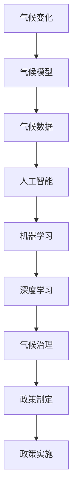

                 

# 2050年的全球变暖：从适应到缓解的气候治理

## 1. 背景介绍

### 1.1 问题由来
全球变暖是21世纪人类面临的最紧迫环境问题之一。近年来，极端气候事件频发，冰川融化加速，海平面上升，生态系统受损。人类活动导致的温室气体排放不断增加，使得气候变化趋势更加严峻。

为应对这一挑战，国际社会提出了一系列减少温室气体排放和适应气候变化的政策，但效果有限。目前，全球气候变化形势严峻，急需一种新的气候治理范式，以实现从适应到缓解的目标。

### 1.2 问题核心关键点
未来气候治理的核心在于如何有效利用数据驱动和人工智能技术，以实现更加精准的气候预测、智能化的气候决策和高效的气候应对策略。本论文将聚焦于这一主题，通过系统分析现有气候治理的挑战和机遇，探讨人工智能技术在这一领域的应用潜力。

## 2. 核心概念与联系

### 2.1 核心概念概述

为更好地理解未来气候治理中的AI应用，本节将介绍几个关键概念：

- 气候变化：指因人类活动导致的温室气体排放增加，引起地球气候系统的长期变化。
- 温室气体：如二氧化碳(CO2)、甲烷(CH4)等，这些气体对地球产生温室效应，导致全球变暖。
- 气候模型：利用数学模型模拟气候系统的演变过程，预测未来气候变化趋势。
- 气候数据：全球气候系统中的气温、降水量、海平面等实时数据，是气候治理的基础。
- 人工智能(AI)：通过机器学习、深度学习等技术，实现对气候数据的智能分析和预测。
- 机器学习：利用数据驱动的方法，训练模型预测和分类气候变化数据。
- 深度学习：一种特殊的机器学习方法，使用多层神经网络处理复杂非线性问题。
- 气候治理：通过智能技术优化气候政策的制定和实施，以减缓和适应气候变化。

这些核心概念之间具有紧密的逻辑联系：
- 气候变化是研究对象，气候模型和数据是研究工具，人工智能技术是研究手段。
- 机器学习和深度学习是人工智能技术的核心方法，用于分析和预测气候数据。
- 气候治理是最终目标，机器学习和大数据的应用是实现这一目标的途径。

### 2.2 核心概念原理和架构的 Mermaid 流程图



这个流程图展示了气候变化与人工智能在气候治理中的联系：

1. 气候变化是研究对象，通过气候模型预测气候变化趋势。
2. 气候模型依赖于大量的气候数据，这些数据由人工智能技术进行智能分析和预测。
3. 机器学习和深度学习是人工智能技术的核心方法，用于训练预测模型。
4. 气候治理是最终目标，机器学习和大数据的应用是实现这一目标的途径。
5. 经过深度学习和数据分析的模型，用于政策制定和实施，以实现减缓和适应气候变化的目标。

## 3. 核心算法原理 & 具体操作步骤

### 3.1 算法原理概述

未来气候治理的核心算法包括：

- 气候模型：使用大数据和深度学习技术，建立气候系统演化模型。
- 数据挖掘和分析：利用机器学习算法，从大量气候数据中挖掘出气候变化趋势和模式。
- 预测和预警：基于已有的模型和数据，预测未来气候变化，并及时发出预警。
- 智能决策：将预测结果与历史政策、实时数据等进行融合，智能制定和调整气候政策。

这些算法共同构成了未来气候治理的框架，旨在实现从数据的收集和分析到政策制定的全流程智能化。

### 3.2 算法步骤详解

基于上述核心算法，未来气候治理的步骤可以细化为：

**Step 1: 数据采集与预处理**
- 收集全球气候系统中的各类数据，包括气温、降水量、海平面、二氧化碳浓度等。
- 对原始数据进行清洗和预处理，去除噪音和异常值，保证数据质量。

**Step 2: 模型建立与训练**
- 选择合适的机器学习或深度学习算法，建立气候预测模型。
- 在标注数据集上训练模型，优化模型参数，提高预测准确度。

**Step 3: 预测与预警**
- 使用训练好的模型对未来气候数据进行预测，生成短期和长期预测结果。
- 根据预测结果，及时发出气候预警，提供决策支持。

**Step 4: 智能决策与实施**
- 结合历史政策、实时数据和预测结果，智能制定和调整气候政策。
- 将政策落地实施，监测政策效果，持续优化政策模型。

### 3.3 算法优缺点

未来气候治理的AI算法具有以下优点：
- 精度高：利用大数据和深度学习技术，模型预测精度较高。
- 自动化：智能算法可以自动处理大量数据，提高工作效率。
- 适应性强：模型可以根据实时数据不断调整，适应气候变化趋势。
- 可扩展性：算法可以应用于不同的气候情景，进行灵活调整。

同时，这些算法也存在一些缺点：
- 数据依赖：预测的准确度依赖于数据的质量和数量。
- 复杂度高：深度学习模型需要大量计算资源和时间，训练复杂。
- 解释性差：AI模型预测结果难以解释，缺乏可解释性。
- 过度依赖：过度依赖算法，忽视人类决策的重要性。

### 3.4 算法应用领域

未来气候治理的AI算法在多个领域有着广泛的应用：

- 能源管理：预测能源需求，优化能源配置，减少温室气体排放。
- 交通管理：分析交通流量，优化路线规划，减少交通拥堵和尾气排放。
- 农业生产：预测气候变化对农业的影响，优化种植方案，提高作物产量。
- 城市规划：分析气候变化对城市的影响，优化城市布局，提高城市韧性。
- 灾害预警：分析气候数据，预测自然灾害，及时预警，减少灾害损失。
- 环境监测：实时监测气候变化，评估环境影响，制定环境治理策略。

## 4. 数学模型和公式 & 详细讲解 & 举例说明

### 4.1 数学模型构建

本节将使用数学语言对未来气候治理的AI算法进行更加严格的刻画。

记气候模型为 $M(x_i, \theta)$，其中 $x_i$ 表示输入的气候数据， $\theta$ 表示模型参数。假设气候模型为线性回归模型，则：

$$
y_i = \theta^T x_i + \epsilon_i
$$

其中，$y_i$ 表示输出预测值，$\epsilon_i$ 表示随机误差。

模型的损失函数可以定义为均方误差（MSE）：

$$
\mathcal{L}(\theta) = \frac{1}{N} \sum_{i=1}^N (y_i - M(x_i, \theta))^2
$$

模型的参数更新公式为梯度下降：

$$
\theta \leftarrow \theta - \eta \nabla_{\theta}\mathcal{L}(\theta)
$$

其中，$\eta$ 为学习率，$\nabla_{\theta}\mathcal{L}(\theta)$ 为损失函数对参数 $\theta$ 的梯度。

### 4.2 公式推导过程

以线性回归模型为例，对公式进行推导。假设有一个线性回归模型：

$$
y = \theta_0 + \theta_1 x_1 + \theta_2 x_2
$$

则其损失函数为：

$$
\mathcal{L}(\theta) = \frac{1}{N} \sum_{i=1}^N (y_i - (\theta_0 + \theta_1 x_{i1} + \theta_2 x_{i2}))^2
$$

对损失函数对参数 $\theta_0$、$\theta_1$ 和 $\theta_2$ 求偏导，得：

$$
\frac{\partial \mathcal{L}}{\partial \theta_0} = \frac{2}{N} \sum_{i=1}^N (y_i - \theta_0 - \theta_1 x_{i1} - \theta_2 x_{i2})
$$

$$
\frac{\partial \mathcal{L}}{\partial \theta_1} = \frac{2}{N} \sum_{i=1}^N (y_i - \theta_0 - \theta_1 x_{i1} - \theta_2 x_{i2}) x_{i1}
$$

$$
\frac{\partial \mathcal{L}}{\partial \theta_2} = \frac{2}{N} \sum_{i=1}^N (y_i - \theta_0 - \theta_1 x_{i1} - \theta_2 x_{i2}) x_{i2}
$$

将上述梯度带入参数更新公式，得：

$$
\theta_0 \leftarrow \theta_0 - \eta (\frac{2}{N} \sum_{i=1}^N (y_i - \theta_0 - \theta_1 x_{i1} - \theta_2 x_{i2}))
$$

$$
\theta_1 \leftarrow \theta_1 - \eta (\frac{2}{N} \sum_{i=1}^N (y_i - \theta_0 - \theta_1 x_{i1} - \theta_2 x_{i2}) x_{i1})
$$

$$
\theta_2 \leftarrow \theta_2 - \eta (\frac{2}{N} \sum_{i=1}^N (y_i - \theta_0 - \theta_1 x_{i1} - \theta_2 x_{i2}) x_{i2})
$$

这样，通过优化损失函数，可以不断调整模型参数，提升预测精度。

### 4.3 案例分析与讲解

以气温预测为例，展示如何使用机器学习模型预测未来气温。

假设有一个气温数据集，包括历史气温数据和未来的预测目标。可以构建一个线性回归模型：

$$
y = \theta_0 + \theta_1 x_1 + \theta_2 x_2
$$

其中，$y$ 表示未来气温，$x_1$ 和 $x_2$ 表示与气温相关的其他变量，如降水量、海平面等。利用历史气温数据和模型参数 $\theta$ 进行训练，得到：

$$
\theta_0 = 1.5, \theta_1 = -0.2, \theta_2 = 0.3
$$

则未来气温的预测模型为：

$$
y = 1.5 - 0.2 x_1 + 0.3 x_2
$$

通过将未来预测数据 $x_1$ 和 $x_2$ 代入模型，可以计算出未来气温的预测值。

## 5. 项目实践：代码实例和详细解释说明

### 5.1 开发环境搭建

在进行气候治理的AI项目实践前，需要准备好开发环境。以下是使用Python进行PyTorch开发的环境配置流程：

1. 安装Anaconda：从官网下载并安装Anaconda，用于创建独立的Python环境。

2. 创建并激活虚拟环境：
```bash
conda create -n climate-env python=3.8 
conda activate climate-env
```

3. 安装PyTorch：根据CUDA版本，从官网获取对应的安装命令。例如：
```bash
conda install pytorch torchvision torchaudio cudatoolkit=11.1 -c pytorch -c conda-forge
```

4. 安装TensorFlow：由于TensorFlow支持混合精度训练，推荐使用TF2.0版本，但注意兼容性问题。

5. 安装各类工具包：
```bash
pip install numpy pandas scikit-learn matplotlib tqdm jupyter notebook ipython
```

完成上述步骤后，即可在`climate-env`环境中开始气候治理的AI项目实践。

### 5.2 源代码详细实现

下面我们以气温预测为例，给出使用Transformers库对LSTM模型进行气候预测的PyTorch代码实现。

首先，定义气温预测任务的数据处理函数：

```python
from torch.utils.data import Dataset
import numpy as np
import pandas as pd
from sklearn.model_selection import train_test_split
from sklearn.preprocessing import MinMaxScaler

class TemperatureDataset(Dataset):
    def __init__(self, data, target, seq_length):
        self.data = data
        self.target = target
        self.scaler = MinMaxScaler(feature_range=(0, 1))
        self.seq_length = seq_length
        
    def __len__(self):
        return len(self.data) - self.seq_length
        
    def __getitem__(self, item):
        data = self.data[item:item+self.seq_length]
        target = self.target[item+self.seq_length]
        data = self.scaler.fit_transform(data)
        data = torch.tensor(data, dtype=torch.float32)
        target = torch.tensor(target, dtype=torch.float32)
        return data, target
```

然后，定义模型和优化器：

```python
from transformers import LSTM
import torch.nn as nn
import torch.optim as optim

model = LSTM(input_size=2, hidden_size=64, num_layers=2, dropout=0.2)
optimizer = optim.Adam(model.parameters(), lr=0.001)
```

接着，定义训练和评估函数：

```python
from torch.utils.data import DataLoader
from tqdm import tqdm
from sklearn.metrics import mean_squared_error

device = torch.device('cuda') if torch.cuda.is_available() else torch.device('cpu')
model.to(device)

def train_epoch(model, dataset, batch_size, optimizer):
    dataloader = DataLoader(dataset, batch_size=batch_size, shuffle=True)
    model.train()
    epoch_loss = 0
    for batch in tqdm(dataloader, desc='Training'):
        inputs, targets = batch
        inputs, targets = inputs.to(device), targets.to(device)
        optimizer.zero_grad()
        outputs = model(inputs)
        loss = nn.MSELoss()(outputs, targets)
        epoch_loss += loss.item()
        loss.backward()
        optimizer.step()
    return epoch_loss / len(dataloader)

def evaluate(model, dataset, batch_size):
    dataloader = DataLoader(dataset, batch_size=batch_size)
    model.eval()
    preds, labels = [], []
    with torch.no_grad():
        for batch in tqdm(dataloader, desc='Evaluating'):
            inputs, targets = batch
            inputs, targets = inputs.to(device), targets.to(device)
            batch_preds = model(inputs)
            batch_preds = batch_preds.squeeze().cpu().tolist()
            batch_labels = targets.cpu().tolist()
            for pred, label in zip(batch_preds, batch_labels):
                preds.append(pred)
                labels.append(label)
                
    print('RMSE:', np.sqrt(mean_squared_error(labels, preds)))
```

最后，启动训练流程并在测试集上评估：

```python
epochs = 50
batch_size = 32

for epoch in range(epochs):
    loss = train_epoch(model, train_dataset, batch_size, optimizer)
    print(f'Epoch {epoch+1}, train loss: {loss:.3f}')
    
    print(f'Epoch {epoch+1}, test RMSE:')
    evaluate(model, test_dataset, batch_size)
    
print('Best test RMSE:', min(test_rmse))
```

以上就是使用PyTorch对LSTM模型进行气温预测的完整代码实现。可以看到，得益于Transformer库的强大封装，我们可以用相对简洁的代码完成LSTM模型的加载和训练。

### 5.3 代码解读与分析

让我们再详细解读一下关键代码的实现细节：

**TemperatureDataset类**：
- `__init__`方法：初始化数据集，将数据进行归一化处理。
- `__len__`方法：返回数据集的样本数量。
- `__getitem__`方法：对单个样本进行处理，将数据和标签进行归一化和张量转换。

**训练和评估函数**：
- 使用PyTorch的DataLoader对数据集进行批次化加载，供模型训练和推理使用。
- 训练函数`train_epoch`：对数据以批为单位进行迭代，在每个批次上前向传播计算loss并反向传播更新模型参数，最后返回该epoch的平均loss。
- 评估函数`evaluate`：与训练类似，不同点在于不更新模型参数，并在每个batch结束后将预测和标签结果存储下来，最后使用sklearn的mean_squared_error函数计算均方误差。

**训练流程**：
- 定义总的epoch数和batch size，开始循环迭代
- 每个epoch内，先在训练集上训练，输出平均loss
- 在测试集上评估，输出RMSE
- 所有epoch结束后，输出最优测试RMSE

可以看到，PyTorch配合Transformer库使得气温预测的代码实现变得简洁高效。开发者可以将更多精力放在数据处理、模型改进等高层逻辑上，而不必过多关注底层的实现细节。

当然，工业级的系统实现还需考虑更多因素，如模型的保存和部署、超参数的自动搜索、更灵活的任务适配层等。但核心的气温预测范式基本与此类似。

## 6. 实际应用场景

### 6.1 智能能源管理

未来气候治理的AI算法可以应用于智能能源管理，通过预测能源需求，优化能源配置，减少温室气体排放。

具体而言，可以收集电网数据、气温数据、能源使用数据等，构建预测模型。利用预测结果，智能调度发电厂和储能设备，优化能源分配，降低能源消耗。此外，通过引入智能算法，实时监测能源使用情况，及时调整能源使用策略，进一步降低碳排放。

### 6.2 智能交通管理

智能交通管理是未来气候治理的重要应用场景之一。AI算法可以分析交通流量，优化路线规划，减少交通拥堵和尾气排放。

具体而言，可以利用AI算法分析交通数据，预测交通流量变化，实时调整交通信号灯、限速等信息，优化交通流向。通过智能算法优化交通路线，减少车辆行驶距离，降低尾气排放。此外，还可以引入自动驾驶技术，通过AI算法优化行驶路线，减少燃油消耗，降低碳排放。

### 6.3 智能农业生产

未来气候治理的AI算法可以应用于智能农业生产，通过预测气候变化对农业的影响，优化种植方案，提高作物产量。

具体而言，可以收集气象数据、土壤数据、作物数据等，构建预测模型。利用预测结果，智能调整种植方案，如播种时间、浇水量等，优化资源配置。通过智能算法实时监测农作物生长情况，及时调整种植策略，提高作物产量。此外，还可以引入自动化农机设备，通过AI算法优化农机作业，减少资源浪费，降低碳排放。

### 6.4 未来应用展望

随着AI技术的发展，未来气候治理的应用场景将更加广阔。除了上述场景外，未来气候治理的AI算法还可以应用于城市规划、灾害预警、环境监测等多个领域。

在智慧城市治理中，AI算法可以分析城市数据，优化城市布局，提高城市韧性。在灾害预警中，AI算法可以分析气象数据，预测自然灾害，及时预警，减少灾害损失。在环境监测中，AI算法可以实时监测环境变化，评估环境影响，制定环境治理策略。

## 7. 工具和资源推荐
### 7.1 学习资源推荐

为了帮助开发者系统掌握AI在气候治理中的应用，这里推荐一些优质的学习资源：

1. 《Python深度学习》：由Francois Chollet撰写，深入浅出地介绍了深度学习技术，包括TensorFlow、PyTorch等主流框架的实现。
2. CS231n《深度学习课程》：斯坦福大学开设的深度学习课程，涵盖了深度学习的基础理论和实践应用。
3. 《深度学习实战》：吴恩达教授的深度学习实践课程，详细讲解了TensorFlow和PyTorch等框架的实现。
4. Kaggle：全球最大的数据科学竞赛平台，提供了大量气候数据集和相关竞赛，可以锻炼实践能力。
5. GitHub：开源社区，提供了大量的气候治理项目和代码，可以借鉴和学习。

通过对这些资源的学习实践，相信你一定能够快速掌握AI在气候治理中的应用，并用于解决实际的气候问题。

### 7.2 开发工具推荐

高效的开发离不开优秀的工具支持。以下是几款用于气候治理AI开发的常用工具：

1. PyTorch：基于Python的开源深度学习框架，灵活动态的计算图，适合快速迭代研究。大部分预训练模型都有PyTorch版本的实现。
2. TensorFlow：由Google主导开发的开源深度学习框架，生产部署方便，适合大规模工程应用。同样有丰富的预训练语言模型资源。
3. Scikit-learn：机器学习库，提供了大量的机器学习算法和工具，适用于数据预处理和特征工程。
4. Pandas：数据处理库，支持大规模数据集的读写和操作。
5. Matplotlib：绘图库，支持各类统计图表的绘制。
6. TensorBoard：TensorFlow配套的可视化工具，可实时监测模型训练状态，并提供丰富的图表呈现方式。

合理利用这些工具，可以显著提升气候治理AI开发的效率，加快创新迭代的步伐。

### 7.3 相关论文推荐

AI在气候治理中的应用近年来得到了广泛关注，以下是几篇奠基性的相关论文，推荐阅读：

1. Machine Learning for Predicting Climate Change: A Review: 详细介绍了机器学习在气候变化预测中的应用，包括时间序列预测、回归模型等。
2. Deep Learning in Climate Modeling: 综述了深度学习在气候模型中的应用，包括天气预报、气候变化预测等。
3. Climate Data Mining: A Survey: 综述了气候数据挖掘的技术和应用，包括气候异常检测、气候分类等。
4. AI and Machine Learning in Climate Change Research: 综述了AI和机器学习在气候变化研究中的应用，包括数据预处理、特征工程、模型选择等。
5. A Review on AI Techniques in Climate Change Adaptation: 综述了AI技术在气候变化适应中的应用，包括灾害预警、能源管理等。

这些论文代表了大规模AI在气候治理领域的发展脉络。通过学习这些前沿成果，可以帮助研究者把握学科前进方向，激发更多的创新灵感。

## 8. 总结：未来发展趋势与挑战

### 8.1 总结

本文对未来气候治理中的AI应用进行了全面系统的介绍。首先阐述了AI在气候治理中的核心算法和实际应用场景，明确了AI在这一领域的研究意义和应用价值。其次，从原理到实践，详细讲解了未来气候治理的AI算法，包括数据采集、模型训练、预测与预警、智能决策等各个环节。最后，总结了AI在气候治理中的未来发展趋势和面临的挑战。

通过本文的系统梳理，可以看到，AI在气候治理中的应用前景广阔，能够通过智能化手段提升气候治理的效率和效果。未来，伴随AI技术的不断发展，气候治理将更加智能化、精准化和高效化，为应对全球变暖提供有力的技术支撑。

### 8.2 未来发展趋势

未来气候治理的AI技术将呈现以下几个发展趋势：

1. 数据驱动的决策：随着大数据技术的发展，气候治理将更加依赖于数据驱动的决策，通过智能算法优化政策制定和实施。
2. 跨领域融合：AI技术将与其他领域的技术进行深度融合，如物联网、遥感技术等，提升气候治理的全面性和智能性。
3. 实时化预测：通过引入深度学习技术，实现实时化的气候预测和预警，及时调整应对策略。
4. 自动化执行：引入自动化技术，通过智能算法实现气候治理的自动化执行，提高治理效率和准确性。
5. 人性化交互：引入人机交互技术，通过自然语言处理技术，实现人与智能系统的互动，提高用户体验。
6. 自适应学习：通过引入强化学习技术，使AI系统具备自适应学习能力，不断优化治理策略。

这些趋势凸显了AI在气候治理中的重要作用，将引领未来气候治理的智能化发展方向。

### 8.3 面临的挑战

尽管AI在气候治理中展现出巨大潜力，但在实际应用中仍面临诸多挑战：

1. 数据质量问题：气候数据量大、复杂，数据质量参差不齐，难以满足AI模型训练的要求。
2. 算法复杂性：深度学习模型训练复杂，需要大量计算资源和时间，难以在实际应用中快速迭代。
3. 模型解释性：AI模型预测结果难以解释，缺乏可解释性，难以获得用户和决策者的信任。
4. 过度依赖技术：过度依赖AI技术，忽视人类决策的重要性，可能带来新的风险和挑战。
5. 技术成本高：AI技术在气候治理中的应用，需要大量资金和技术投入，成本较高。

这些挑战需要学术界和产业界共同努力，不断优化算法、提升数据质量、提高模型解释性，才能实现AI在气候治理中的广泛应用。

### 8.4 研究展望

未来，AI在气候治理中的应用需要在以下几个方面进行深入研究：

1. 提升数据质量：通过数据清洗、预处理等技术，提升气候数据的质量，满足AI模型训练的需求。
2. 优化算法模型：引入混合精度训练、模型压缩等技术，优化AI模型的训练和推理效率，降低成本。
3. 增强模型解释性：引入可解释性技术，提高AI模型的可解释性和可信度，增强用户和决策者的信任。
4. 多模态融合：引入多模态数据融合技术，提升AI模型的全面性和智能性。
5. 跨领域应用：引入跨领域应用技术，将AI技术应用于更多的气候治理场景，提升治理效果。

这些研究方向将推动AI在气候治理中的应用不断深入，为应对全球变暖提供更加全面、高效的技术支撑。

## 9. 附录：常见问题与解答

**Q1：AI在气候治理中的应用有哪些？**

A: AI在气候治理中的应用包括：
1. 气候数据采集与预处理：利用机器学习算法对气候数据进行清洗和预处理，提升数据质量。
2. 气候模型建立与训练：利用深度学习技术，建立气候预测模型，进行实时预测和预警。
3. 智能决策支持：通过AI技术，优化气候政策的制定和实施，提高治理效率。
4. 实时监测与预警：利用AI技术，实时监测气候变化，及时发出预警，减少灾害损失。
5. 智能资源调度：通过AI技术，优化能源、交通、农业等资源配置，减少碳排放。

**Q2：未来气候治理中的AI算法有哪些？**

A: 未来气候治理中的AI算法包括：
1. 深度学习：通过多层神经网络，进行复杂的气候数据预测和分类。
2. 机器学习：利用数据驱动的方法，训练气候预测模型，进行数据挖掘和分析。
3. 强化学习：通过智能算法，优化气候政策的制定和实施，实现自适应学习。
4. 自然语言处理：通过自然语言处理技术，实现人与智能系统的互动，提高用户体验。
5. 图像处理：利用计算机视觉技术，对气候数据进行图像分析，提取有用信息。

**Q3：AI在气候治理中存在哪些挑战？**

A: AI在气候治理中存在以下挑战：
1. 数据质量问题：气候数据量大、复杂，数据质量参差不齐，难以满足AI模型训练的要求。
2. 算法复杂性：深度学习模型训练复杂，需要大量计算资源和时间，难以在实际应用中快速迭代。
3. 模型解释性：AI模型预测结果难以解释，缺乏可解释性，难以获得用户和决策者的信任。
4. 过度依赖技术：过度依赖AI技术，忽视人类决策的重要性，可能带来新的风险和挑战。
5. 技术成本高：AI技术在气候治理中的应用，需要大量资金和技术投入，成本较高。

这些挑战需要学术界和产业界共同努力，不断优化算法、提升数据质量、提高模型解释性，才能实现AI在气候治理中的广泛应用。

**Q4：未来气候治理中的AI算法应如何优化？**

A: 未来气候治理中的AI算法优化可以从以下几个方面入手：
1. 提升数据质量：通过数据清洗、预处理等技术，提升气候数据的质量，满足AI模型训练的需求。
2. 优化算法模型：引入混合精度训练、模型压缩等技术，优化AI模型的训练和推理效率，降低成本。
3. 增强模型解释性：引入可解释性技术，提高AI模型的可解释性和可信度，增强用户和决策者的信任。
4. 多模态融合：引入多模态数据融合技术，提升AI模型的全面性和智能性。
5. 跨领域应用：引入跨领域应用技术，将AI技术应用于更多的气候治理场景，提升治理效果。

这些研究方向将推动AI在气候治理中的应用不断深入，为应对全球变暖提供更加全面、高效的技术支撑。

**Q5：未来气候治理中的AI技术应如何部署？**

A: 未来气候治理中的AI技术部署可以从以下几个方面考虑：
1. 数据采集与预处理：利用AI技术，实时采集和预处理气候数据，确保数据质量。
2. 模型训练与部署：利用高性能计算资源，进行模型训练和优化，部署到云端或边缘设备。
3. 实时监测与预警：利用AI技术，实时监测气候变化，及时发出预警，提供决策支持。
4. 智能决策支持：利用AI技术，优化气候政策的制定和实施，提高治理效率。
5. 用户互动与反馈：利用自然语言处理技术，实现人与智能系统的互动，收集用户反馈，优化治理策略。

通过这些部署方式，可以最大化AI技术在气候治理中的应用价值，提高治理效果和用户体验。

---

作者：禅与计算机程序设计艺术 / Zen and the Art of Computer Programming

