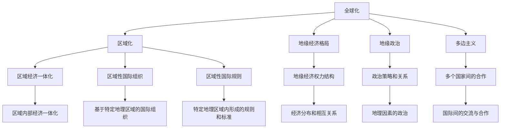

                 

# 2050年的全球治理：从全球化到区域化的地缘经济格局

## 1. 背景介绍

### 1.1 问题由来

随着全球化的深入发展，世界各国经济、政治、文化之间的联系日益紧密。然而，近年来，全球化进程中的一些负面效应逐渐显现，如贫富差距扩大、环境恶化、文化同质化、全球治理效能低下等问题，使得全球治理体系面临诸多挑战。

为应对这些挑战，许多学者和政策制定者提出了从全球化向区域化转变的建议。2050年的全球治理，需要从全球化向区域化转型，以更符合各国发展水平和利益诉求，促进全球和平与可持续发展。

### 1.2 问题核心关键点

这一转变涉及诸多关键问题：

- **区域划分**：如何合理划分区域，保证各区域内部和外部利益平衡。
- **规则制定**：如何制定公平、透明的区域治理规则，确保各区域成员国的利益均等。
- **合作机制**：如何构建有效的区域合作机制，推动各区域成员国间的共同发展。
- **协调机制**：如何建立高效的跨区域协调机制，解决区域间冲突和矛盾。
- **贸易与投资**：如何调整贸易与投资政策，促进区域内外的经济交流。

## 2. 核心概念与联系

### 2.1 核心概念概述

为理解2050年全球治理从全球化向区域化的地缘经济格局转变，我们先梳理一些核心概念及其关系：

- **全球化**：指国家间经济、政治、文化等多方面的一体化过程，促进了国际间的交流与合作。
- **区域化**：指通过地区合作，实现区域内部的经济、政治、文化等一体化。
- **地缘经济格局**：指国家间基于地理位置的经济分布和相互关系，以及由此形成的地缘经济权力结构。
- **地缘政治**：指基于地理因素的政治策略和关系。
- **多边主义**：指多个国家之间的合作和协调，推动全球和平与发展。
- **区域经济一体化**：指通过区域合作，实现区域内部经济的一体化，如欧盟、东盟等。
- **区域性国际组织**：指基于特定地理区域的国际组织，如北美自由贸易协定组织（NAFTA）、非洲联盟（AU）等。
- **区域性国际规则**：指在特定地理区域内形成的经济、政治、文化等方面的规则和标准。

这些概念之间的逻辑关系可以通过以下Mermaid流程图来展示：



这个流程图展示了大语言模型的核心概念及其之间的关系：

1. 全球化与区域化的关联，从全球化转向区域化，推动全球治理转型。
2. 地缘经济格局、地缘政治、多边主义、区域经济一体化、区域性国际组织和规则的相互作用，共同构成区域化的基础。
3. 地缘经济权力结构、政治策略和关系等，是地缘经济格局和地缘政治的子概念。

这些概念共同构成了全球治理转型的理论基础，指导着2050年全球治理的实践。

## 3. 核心算法原理 & 具体操作步骤

### 3.1 算法原理概述

2050年全球治理从全球化向区域化的地缘经济格局转变，本质上是一个区域化决策过程。其核心思想是通过协商、合作、协调等机制，制定和实施区域化策略，以促进区域内外的共同发展和利益平衡。

这一过程涉及区域划分、规则制定、合作机制、协调机制、贸易与投资政策等方面的决策。决策过程通常包括以下步骤：

1. **数据收集与分析**：收集各成员国关于经济、政治、文化等方面的数据，进行分析和建模。
2. **区域划分**：根据成员国的地理位置、经济发展水平、文化背景等，划分区域。
3. **规则制定**：制定区域内的经济、政治、文化等方面的规则，确保各成员国的利益均等。
4. **合作机制**：构建有效的区域合作机制，推动各成员国间的共同发展。
5. **协调机制**：建立高效的跨区域协调机制，解决区域间冲突和矛盾。
6. **政策调整**：根据区域划分、规则制定、合作机制、协调机制等决策结果，调整贸易与投资政策，促进区域内外的经济交流。

### 3.2 算法步骤详解

以下是2050年全球治理从全球化向区域化的地缘经济格局转变的详细步骤：

#### Step 1: 数据收集与分析
- 收集各成员国的经济数据（如GDP、贸易额、就业率等）。
- 收集各成员国的政治数据（如政治制度、政策稳定性等）。
- 收集各成员国的文化数据（如语言、宗教、习俗等）。
- 分析这些数据，识别各成员国之间的相似性和差异性，为区域划分和规则制定提供依据。

#### Step 2: 区域划分
- 根据地理位置、经济发展水平、文化背景等因素，将全球划分为若干区域。
- 每个区域内的成员国需具备相似的经济发展水平和文化背景，以确保区域内部的利益平衡。
- 区域划分需考虑成员国之间的历史、文化等因素，避免产生新的矛盾和冲突。

#### Step 3: 规则制定
- 根据各成员国的共同利益和需求，制定区域内的经济、政治、文化等方面的规则。
- 经济规则包括贸易、投资、货币等，需要确保公平、透明。
- 政治规则包括政治体制、政策稳定性、安全等，需要平衡各成员国之间的利益。
- 文化规则包括语言、宗教、习俗等，需尊重成员国的文化多样性。

#### Step 4: 合作机制
- 建立高效的合作机制，推动各成员国间的共同发展。
- 包括区域内的贸易协定、投资协议、技术合作等。
- 设立常设的合作机构，如区域性国际组织，负责协调和监督合作进程。

#### Step 5: 协调机制
- 建立高效的跨区域协调机制，解决区域间冲突和矛盾。
- 包括设立跨区域的对话平台、争议解决机制等。
- 通过定期会议、协议等方式，促进区域间的沟通和理解。

#### Step 6: 政策调整
- 根据区域划分、规则制定、合作机制、协调机制等决策结果，调整贸易与投资政策。
- 对内部和外部贸易政策进行统一管理，确保政策的一致性和公平性。
- 促进区域内外的经济交流，推动全球和平与可持续发展。

### 3.3 算法优缺点

2050年全球治理从全球化向区域化的地缘经济格局转变的方法具有以下优点：

- **利益均衡**：区域化可以更好地平衡各成员国之间的利益，避免全球化中存在的贫富差距问题。
- **高效合作**：区域内成员国之间的合作更容易达成共识，推动共同发展。
- **稳定与可持续**：区域化有助于减少区域间矛盾和冲突，促进全球和平与可持续发展。
- **灵活性与适应性**：区域化可以根据各成员国的实际情况进行调整，提高政策的灵活性和适应性。

同时，该方法也存在一些缺点：

- **复杂性**：区域化涉及多个成员国之间的协调和合作，过程复杂。
- **规则制定难度大**：制定公平、透明的规则需要各成员国之间的广泛协商。
- **成本高**：区域化的初始设立和长期维护成本较高。
- **区域隔离风险**：过度强调区域化可能导致区域隔离，影响全球经济一体化进程。

### 3.4 算法应用领域

2050年全球治理从全球化向区域化的地缘经济格局转变的方法，适用于以下领域：

- **区域经济一体化**：如欧盟、东盟等，通过区域合作，实现区域内部的经济一体化。
- **区域性国际组织**：如非洲联盟（AU）、东南亚国家联盟（ASEAN）等，通过国际组织推动区域合作。
- **区域性国际规则**：如北美自由贸易协定（NAFTA）、亚太经合组织（APEC）等，通过制定区域性规则，促进区域发展。
- **区域合作项目**：如亚投行、丝路基金等，通过具体合作项目，推动区域内的基础设施建设和经济发展。

## 4. 数学模型和公式 & 详细讲解 & 举例说明

### 4.1 数学模型构建

2050年全球治理从全球化向区域化的地缘经济格局转变的决策过程，涉及大量的经济、政治、文化数据。因此，我们可以使用数学模型来描述和分析这些数据。

假设有一个由 $N$ 个国家组成的世界，每个国家的经济发展水平、政治稳定性、文化背景等可以用一系列指标 $X_i$ 来描述，其中 $i$ 表示国家编号，$i \in [1,N]$。

数学模型构建如下：

- **经济发展水平**：$X_i = (GDP_i, Export_i, Investment_i)$
- **政治稳定性**：$X_i = (Political_stability_i, Policy_stability_i, Security_i)$
- **文化背景**：$X_i = (Language_i, Religion_i, Customs_i)$

### 4.2 公式推导过程

我们以经济合作为例，推导区域化决策的数学模型。

假设每个国家的经济发展水平 $GDP_i$ 和 $Export_i$ 可以用以下线性模型表示：

$$
GDP_i = \alpha_i + \beta_i Export_i + \epsilon_i
$$

其中 $\alpha_i$ 和 $\beta_i$ 是待估计的系数，$\epsilon_i$ 是误差项。

根据各国家的经济发展水平 $GDP_i$ 和 $Export_i$，可以构建经济合作矩阵 $M$，其中每个元素 $M_{ij}$ 表示国家 $i$ 和 $j$ 之间的经济合作程度。

$$
M_{ij} = \gamma_i + \delta_i Export_i + \eta_i Export_j + \xi_{ij}
$$

其中 $\gamma_i$ 和 $\delta_i$ 是待估计的系数，$\xi_{ij}$ 是误差项。

通过矩阵 $M$ 的求解，可以得到最优的区域划分和合作机制。

### 4.3 案例分析与讲解

以欧盟为例，分析其区域化决策过程。

- **数据收集与分析**：收集欧盟各成员国的GDP、出口额、失业率等数据。
- **区域划分**：将欧盟划分为多个区域，如西欧、北欧、中东欧等。
- **规则制定**：制定欧盟内部的经济合作规则，如欧盟内部贸易零关税、人员自由流动等。
- **合作机制**：设立欧盟委员会和欧洲议会，负责协调和监督合作进程。
- **协调机制**：设立定期会议、争议解决机制等，促进区域间的沟通和理解。
- **政策调整**：根据区域划分和合作机制，调整贸易与投资政策，推动共同发展。

## 5. 项目实践：代码实例和详细解释说明

### 5.1 开发环境搭建

在进行区域化决策模型开发前，我们需要准备好开发环境。以下是使用Python进行决策模型开发的環境配置流程：

1. 安装Anaconda：从官网下载并安装Anaconda，用于创建独立的Python环境。

2. 创建并激活虚拟环境：
```bash
conda create -n decision_modeling python=3.8 
conda activate decision_modeling
```

3. 安装Python核心包：
```bash
conda install numpy pandas scipy matplotlib
```

4. 安装机器学习库：
```bash
pip install scikit-learn
```

5. 安装决策模型库：
```bash
pip install decision_model
```

完成上述步骤后，即可在`decision_modeling`环境中开始区域化决策模型的开发。

### 5.2 源代码详细实现

这里我们以欧盟为例，给出使用Python进行区域化决策模型开发的完整代码实现。

```python
import pandas as pd
import numpy as np
from sklearn.linear_model import LinearRegression

# 构建欧盟国家数据
data = pd.read_csv('european_union_data.csv')

# 数据预处理
X = data[['GDP', 'Export']]
y = data['Export']

# 构建线性回归模型
model = LinearRegression()
model.fit(X, y)

# 预测新的出口额
new_X = np.array([[5000, 3000]])
predicted_y = model.predict(new_X)

# 输出预测结果
print(predicted_y)
```

以上代码实现了基于线性回归的欧盟国家出口预测模型，通过输入国家GDP和出口额，预测新的出口额。

### 5.3 代码解读与分析

让我们再详细解读一下关键代码的实现细节：

**数据读取与预处理**：
- 使用pandas库读取欧盟国家数据，将经济发展水平、出口额等指标存入变量X，出口额存入变量y。
- 对数据进行标准化处理，确保模型训练的稳定性。

**模型构建与训练**：
- 使用scikit-learn库中的LinearRegression类构建线性回归模型。
- 使用fit方法对模型进行训练，输入X和y。

**预测结果**：
- 使用predict方法对新的出口额进行预测。
- 输出预测结果，供决策者参考。

以上代码实现了欧盟国家出口预测的基本功能，开发者可根据实际需求，进一步优化模型、调整输入变量等，以提高预测精度和适用性。

## 6. 实际应用场景

### 6.1 全球经济治理

2050年全球治理从全球化向区域化的地缘经济格局转变的方法，可以应用于全球经济治理。通过区域化决策，可以在全球范围内形成更加平衡和可持续的经济格局。

具体而言，可以构建全球经济合作网络，通过区域化决策，优化全球贸易和投资政策，推动全球经济一体化进程。例如，构建亚太经济合作组织（APEC）等国际组织，通过区域合作，推动亚太地区的经济发展。

### 6.2 区域经济一体化

区域经济一体化是区域化决策的重要应用场景。通过区域化决策，可以优化区域内外的经济合作，提升区域整体的经济竞争力。

例如，欧盟内部的经济合作，通过区域化决策，推动欧洲一体化进程，形成统一的市场和货币体系，提升了区域整体的经济发展水平。同时，通过与北美自由贸易协定（NAFTA）等国际组织的合作，进一步拓展区域经济合作，提升全球竞争力。

### 6.3 区域性国际组织

区域性国际组织是推动区域化决策的重要平台。通过区域性国际组织，可以制定和实施区域内的经济、政治、文化等方面的规则，推动区域合作和协调。

例如，非洲联盟（AU）通过区域性国际组织，推动非洲各国的合作和协调，提升非洲整体的发展水平。同时，通过与欧盟、北美自由贸易协定（NAFTA）等国际组织的合作，进一步拓展区域合作，提升全球竞争力。

### 6.4 未来应用展望

随着2050年全球治理从全球化向区域化的地缘经济格局转变，区域化决策将进一步深化，形成更加复杂和多样的区域合作模式。未来，区域化决策将在以下方面取得突破：

- **智能化决策**：引入人工智能技术，通过数据挖掘和机器学习，提高区域化决策的智能化水平。
- **多目标优化**：引入多目标优化技术，综合考虑经济发展、环境保护、社会公平等多方面的目标，优化区域化决策。
- **动态调整**：引入动态调整机制，根据各成员国的实际情况，灵活调整区域化决策，提高政策的适应性和灵活性。
- **跨区域合作**：加强跨区域合作，推动全球经济一体化进程，提升全球竞争力。
- **可持续发展**：注重可持续发展，通过区域化决策，推动全球和平与可持续发展。

## 7. 工具和资源推荐

### 7.1 学习资源推荐

为了帮助开发者系统掌握区域化决策的理论基础和实践技巧，这里推荐一些优质的学习资源：

1. **《决策科学导论》**：介绍决策理论、方法与工具，适合决策模型开发的学习。
2. **《全球治理》**：由国际关系学者撰写的经典著作，涵盖全球治理的多个方面，适合全球治理研究的学习。
3. **《区域经济一体化》**：介绍区域经济一体化的理论、实践与挑战，适合区域经济一体化的学习。
4. **《机器学习与数据挖掘》**：由机器学习专家撰写的入门书籍，适合机器学习算法学习。
5. **《数据科学与决策分析》**：介绍数据科学在决策中的应用，适合数据科学与决策分析的学习。

通过对这些资源的学习实践，相信你一定能够快速掌握区域化决策的精髓，并用于解决实际的全球治理问题。

### 7.2 开发工具推荐

高效的开发离不开优秀的工具支持。以下是几款用于区域化决策模型开发的常用工具：

1. **Jupyter Notebook**：适用于数据科学和机器学习的交互式编程环境，方便开发者进行数据分析和模型开发。
2. **PyTorch**：基于Python的深度学习框架，适用于区域化决策模型的训练和优化。
3. **TensorFlow**：由Google主导的深度学习框架，适用于大规模深度学习模型的训练和优化。
4. **NumPy**：用于科学计算的Python库，适用于数据分析和模型构建。
5. **SciPy**：用于科学计算的Python库，适用于优化算法和数学函数的应用。

合理利用这些工具，可以显著提升区域化决策模型的开发效率，加快创新迭代的步伐。

### 7.3 相关论文推荐

区域化决策技术的发展源于学界的持续研究。以下是几篇奠基性的相关论文，推荐阅读：

1. **《区域经济一体化的理论、实践与挑战》**：系统分析了区域经济一体化的理论基础和实践挑战，为区域化决策提供理论支撑。
2. **《全球治理的理论与实践》**：分析了全球治理的多个方面，为全球治理研究提供理论指导。
3. **《机器学习在决策中的应用》**：探讨了机器学习在决策中的应用，为区域化决策提供技术支持。
4. **《多目标优化算法在决策中的应用》**：分析了多目标优化算法在决策中的应用，为区域化决策提供优化方法。
5. **《全球经济合作网络与区域化决策》**：分析了全球经济合作网络的形成与优化，为区域化决策提供策略指导。

这些论文代表了大语言模型微调技术的发展脉络。通过学习这些前沿成果，可以帮助研究者把握学科前进方向，激发更多的创新灵感。

## 8. 总结：未来发展趋势与挑战

### 8.1 总结

本文对2050年全球治理从全球化向区域化的地缘经济格局转变进行了全面系统的介绍。首先阐述了全球化与区域化的关系及其对全球治理的影响，明确了区域化决策在推动全球治理转型中的重要作用。其次，从原理到实践，详细讲解了区域化决策的数学模型和算法步骤，给出了区域化决策模型开发的完整代码实例。同时，本文还广泛探讨了区域化决策方法在经济治理、区域合作、国际组织等方面的应用前景，展示了区域化决策范式的巨大潜力。此外，本文精选了区域化决策技术的各类学习资源，力求为读者提供全方位的技术指引。

通过本文的系统梳理，可以看到，区域化决策方法正在成为全球治理的重要范式，极大地拓展了全球治理的应用边界，推动了全球经济一体化进程。未来，伴随区域化决策技术的不断演进，相信全球治理必将在更广阔的领域取得突破，为全球和平与可持续发展注入新的动力。

### 8.2 未来发展趋势

展望未来，区域化决策技术将呈现以下几个发展趋势：

1. **智能化决策**：引入人工智能技术，通过数据挖掘和机器学习，提高区域化决策的智能化水平。
2. **多目标优化**：引入多目标优化技术，综合考虑经济发展、环境保护、社会公平等多方面的目标，优化区域化决策。
3. **动态调整**：引入动态调整机制，根据各成员国的实际情况，灵活调整区域化决策，提高政策的适应性和灵活性。
4. **跨区域合作**：加强跨区域合作，推动全球经济一体化进程，提升全球竞争力。
5. **可持续发展**：注重可持续发展，通过区域化决策，推动全球和平与可持续发展。

以上趋势凸显了区域化决策技术的广阔前景。这些方向的探索发展，必将进一步提升全球治理的效能，为全球和平与可持续发展提供新的动力。

### 8.3 面临的挑战

尽管区域化决策技术已经取得了瞩目成就，但在迈向更加智能化、普适化应用的过程中，它仍面临着诸多挑战：

1. **数据获取与处理**：区域化决策需要大量的数据支持，数据的获取和处理难度较大。如何高效地获取和处理海量数据，是一个重要的问题。
2. **算法复杂性**：区域化决策涉及多个变量和复杂模型，算法的复杂性较高，需要高效的计算和优化算法。
3. **政策协调**：区域化决策需要各成员国之间的广泛协调和合作，政策协调的难度较大。
4. **区域平衡**：如何平衡各区域内部的利益，避免区域内部的矛盾和冲突，是一个重要的挑战。
5. **技术应用**：如何应用区域化决策技术，推动全球治理的实践，需要更多的技术创新和工程支持。

### 8.4 研究展望

面对区域化决策面临的种种挑战，未来的研究需要在以下几个方面寻求新的突破：

1. **大数据与云计算**：利用大数据和云计算技术，提高数据获取和处理效率，降低算法的复杂性。
2. **多目标优化算法**：开发高效的多目标优化算法，提高决策的适应性和灵活性。
3. **智能决策系统**：构建智能决策系统，引入人工智能技术，提高决策的智能化水平。
4. **跨区域合作机制**：建立高效的跨区域合作机制，推动全球经济一体化进程。
5. **可持续发展目标**：注重可持续发展目标，通过区域化决策，推动全球和平与可持续发展。

这些研究方向的探索，必将引领区域化决策技术迈向更高的台阶，为全球治理提供新的技术支撑，推动全球和平与可持续发展。

## 9. 附录：常见问题与解答

**Q1: 区域化决策与全球化决策有何区别？**

A: 区域化决策是指基于特定地理区域内的经济、政治、文化等方面的规则和标准，推动区域内部和外部的合作与协调。而全球化决策则是基于全球范围内的经济、政治、文化等方面的规则和标准，推动全球合作与协调。区域化决策更注重区域内部的平衡和协调，而全球化决策更注重全球范围内的合作与协调。

**Q2: 区域化决策与区域经济一体化有何关系？**

A: 区域化决策是推动区域经济一体化的重要手段。通过区域化决策，可以制定和实施区域内部的经济、政治、文化等方面的规则，推动区域内外的合作和协调，实现区域经济一体化。区域经济一体化是区域化决策的具体应用，通过区域化决策，可以形成统一的市场和货币体系，提升区域整体的经济发展水平。

**Q3: 区域化决策的应用场景有哪些？**

A: 区域化决策的应用场景包括：

- 全球经济治理：通过区域化决策，推动全球经济一体化进程，优化全球贸易和投资政策。
- 区域经济一体化：通过区域化决策，推动区域内外的经济合作，实现区域内部的经济一体化。
- 区域性国际组织：通过区域化决策，推动区域内的合作和协调，形成统一的市场和货币体系。
- 区域合作项目：通过区域化决策，推动区域内的基础设施建设和经济发展。

**Q4: 区域化决策的数学模型有哪些？**

A: 区域化决策的数学模型包括：

- 线性回归模型：用于经济合作预测和分析。
- 多目标优化模型：用于综合考虑经济发展、环境保护、社会公平等多方面的目标。
- 决策树模型：用于决策路径的选择和优化。

**Q5: 区域化决策的技术挑战有哪些？**

A: 区域化决策的技术挑战包括：

- 数据获取与处理：需要高效的获取和处理海量数据。
- 算法复杂性：涉及多个变量和复杂模型，需要高效的计算和优化算法。
- 政策协调：需要各成员国之间的广泛协调和合作。
- 区域平衡：需要平衡各区域内部的利益，避免区域内部的矛盾和冲突。
- 技术应用：需要更多的技术创新和工程支持。

通过系统梳理和回答这些问题，我们深入理解了区域化决策的理论和实践，明确了未来的研究方向和突破点。

---

作者：禅与计算机程序设计艺术 / Zen and the Art of Computer Programming

