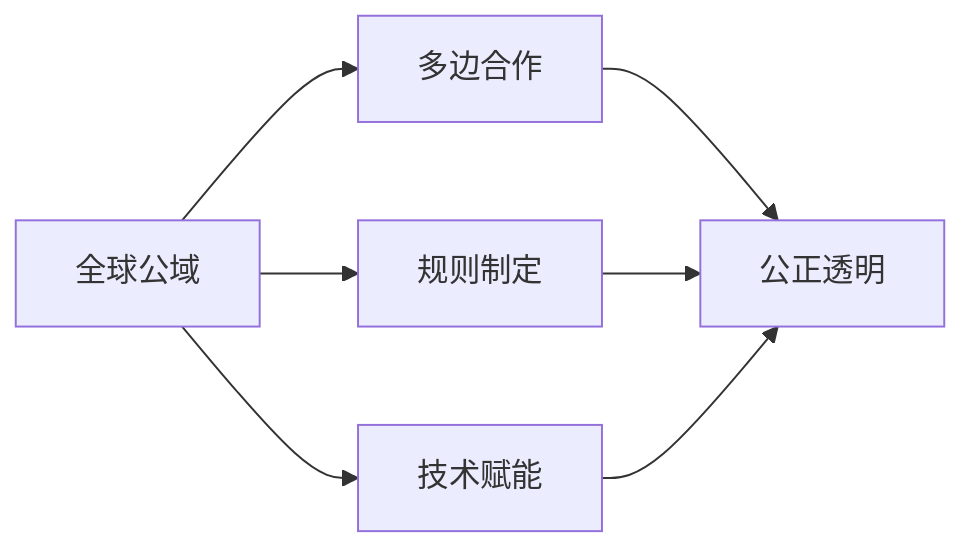

                 

# 2050年的全球治理：从国家主权到全球公域的治理创新

## 1. 背景介绍

在全球化进程加速、技术变革迅猛的21世纪，国际政治经济格局经历着深刻的重塑。国家间的关系更加紧密，相互依存度日益加深。同时，跨国公司、国际组织、社交媒体等非国家行为体在影响全球治理中的作用不断增强。在这样的背景下，传统的国家主权治理模式逐渐向全球公域治理转变。2050年的全球治理将面临一系列新的挑战与机遇，需要通过创新性的治理机制来应对。

### 1.1 问题由来

传统的国家主权治理模式基于领土、经济、文化等国家属性，通过法律、行政、军事等手段维护国家利益。然而，随着全球化的发展，跨国问题和非国家行为体的作用日益凸显，国家主权治理模式逐渐暴露出其局限性。首先，跨国问题如气候变化、传染病、网络安全等挑战，需要全球合作来解决。其次，非国家行为体在经济发展、信息传播等方面的影响，改变了传统的国家权力结构。这些变化要求构建更为包容、协调的全球公域治理机制。

### 1.2 问题核心关键点

构建全球公域治理机制的核心在于：
- **跨国合作**：全球问题往往跨越国家界限，需要多边合作来解决。
- **规则制定**：在共同面临的挑战面前，制定统一的国际规则和标准至关重要。
- **资源共享**：全球公域治理需要国际社会共享资源和信息，实现协同治理。
- **技术赋能**：技术的发展为全球治理提供了新的工具和方法，如区块链、人工智能等。
- **公正透明**：全球公域治理应注重公平性，确保所有利益相关者都能参与决策过程，并保持治理过程的透明。

这些关键点构成了未来全球治理的基础，需要在多边合作、规则制定、资源共享、技术赋能和公正透明等方面不断创新。

## 2. 核心概念与联系

### 2.1 核心概念概述

在探讨2050年的全球治理创新时，以下几个概念至关重要：

- **全球公域**：指那些不受任何国家主权控制的全球性区域或事务，如太空、网络空间、大气等。
- **多边合作**：指多个国家或国际组织共同参与的国际合作形式，旨在解决跨国问题。
- **规则制定**：指在国际层面上制定并实施具有普遍约束力的法律、标准和规范。
- **技术赋能**：指利用先进技术手段提升全球治理的效率和效果。
- **公正透明**：指全球治理过程中确保所有利益相关者公平参与，并公开治理信息。

这些概念相互联系，共同构成未来全球治理的基础框架。

### 2.2 核心概念原理和架构的 Mermaid 流程图



这个流程图展示了全球公域与多边合作、规则制定、技术赋能和公正透明的相互关系。全球公域是治理的出发点，多边合作是实现治理的手段，规则制定是治理的基础，技术赋能是提升治理效率的方法，公正透明则是确保治理公平和可持续的关键。

## 3. 核心算法原理 & 具体操作步骤

### 3.1 算法原理概述

全球治理的创新需要建立在坚实的算法原理基础上，确保治理过程的科学性和有效性。主要包括以下几个方面：

- **数据驱动**：利用大数据技术，分析和预测全球事务的趋势和模式。
- **模型优化**：通过优化算法，提升全球治理的效率和效果。
- **仿真模拟**：利用仿真技术，对全球治理方案进行测试和验证。
- **智能决策**：引入人工智能算法，实现自动化的决策支持。

这些算法原理的结合，将为未来全球治理提供坚实的技术支持。

### 3.2 算法步骤详解

以下是一个全球公域治理创新的算法步骤详解：

1. **数据收集与处理**：
   - 收集全球公域相关的数据，如环境监测数据、经济统计数据、社交媒体数据等。
   - 数据预处理，包括清洗、归一化、特征提取等。

2. **建模与预测**：
   - 构建模型，如回归模型、分类模型、聚类模型等，进行数据建模。
   - 利用模型对全球公域问题进行预测和趋势分析。

3. **规则制定与优化**：
   - 根据模型预测结果和专家意见，制定或优化国际规则和标准。
   - 确保规则的公正性和透明度，供国际社会审议和采纳。

4. **仿真模拟与评估**：
   - 利用仿真技术，对治理方案进行模拟和评估，测试其可行性和效果。
   - 根据评估结果调整方案，确保治理的有效性。

5. **智能决策支持**：
   - 引入人工智能算法，辅助决策者进行分析和决策。
   - 提供智能决策支持和预警机制，提升治理的自动化水平。

### 3.3 算法优缺点

全球治理算法具有以下优点：

- **效率高**：通过模型和仿真技术，可以迅速分析和预测全球事务，提高决策效率。
- **客观性**：基于数据和模型，减少了主观偏见，提升治理的科学性。
- **灵活性**：通过智能决策支持，治理方案可以根据实际情况进行调整和优化。

同时，算法也存在一些局限性：

- **数据质量**：模型的准确性依赖于数据的质量，低质量数据可能导致误导性结论。
- **规则制定复杂**：国际规则的制定需要多方协调，过程复杂且耗时。
- **技术依赖**：算法的应用依赖于技术基础设施，一些发展中国家可能面临技术壁垒。
- **公平性**：算法可能加剧数据和资源的不均衡分配，需要特别注意公平性问题。

### 3.4 算法应用领域

全球治理算法在多个领域具有广泛的应用前景，如：

- **环境保护**：利用大数据和人工智能技术，监测和预测全球环境变化，制定环境保护政策。
- **公共卫生**：通过分析疫情数据，预测疫情发展趋势，制定防控措施。
- **经济合作**：利用数据分析，优化全球贸易规则，促进经济发展。
- **信息安全**：通过网络安全数据分析，预防和应对网络攻击。
- **能源治理**：利用能源数据，优化全球能源管理，促进可持续发展。

## 4. 数学模型和公式 & 详细讲解 & 举例说明

### 4.1 数学模型构建

构建全球治理算法的数学模型，需要考虑以下几个方面：

- **数据模型**：基于统计学、机器学习等理论，构建数据模型。
- **规则模型**：利用逻辑推理、规则引擎等技术，制定国际规则。
- **仿真模型**：利用系统动力学、代理模型等技术，模拟治理过程。

### 4.2 公式推导过程

以全球环境治理为例，利用回归模型进行数据分析和预测。假设有一个全球环境监测数据集 $\{(x_i, y_i)\}_{i=1}^N$，其中 $x_i$ 为第 $i$ 次监测数据，$y_i$ 为对应环境指标（如二氧化碳浓度）。回归模型可表示为：

$$
y = f(x; \theta) = \theta_0 + \sum_{j=1}^p \theta_j x_j + \epsilon
$$

其中 $\theta = (\theta_0, \theta_1, \ldots, \theta_p)$ 为模型参数，$\epsilon$ 为误差项。通过最小二乘法求解最优参数 $\theta$，得到环境指标的预测模型。

### 4.3 案例分析与讲解

假设有一个全球气候变化监测数据集，需要利用回归模型预测未来的气温变化趋势。通过数据预处理、模型训练和参数优化，可以得到一个准确的预测模型。这个模型可以用于制定应对气候变化的国际规则，如碳排放限制、能源转型政策等。

## 5. 项目实践：代码实例和详细解释说明

### 5.1 开发环境搭建

开发环境搭建是项目实践的基础。以下是一个全球公域治理项目的开发环境搭建步骤：

1. **环境配置**：安装Python、R、MATLAB等开发工具。
2. **数据收集**：从联合国、国际能源署、世界卫生组织等机构获取相关数据。
3. **环境部署**：搭建本地或云端的计算环境，确保数据存储和处理的安全性。

### 5.2 源代码详细实现

以下是一个基于Python的全球环境治理项目源代码实现：

```python
import pandas as pd
from sklearn.linear_model import LinearRegression

# 数据收集与处理
data = pd.read_csv('global_environment_data.csv')
data = data.dropna()

# 建模与预测
X = data[['temperature', 'CO2_concentration', 'population']]  # 特征
y = data['temperature']  # 目标变量

model = LinearRegression()
model.fit(X, y)

# 规则制定与优化
def get_optimal_rule(model, X, y, alpha=0.05):
    # 计算回归系数及置信区间
    coef = model.coef_
    std_err = model.coef_.std()
    z = 1.96  # 置信水平为95%
    lower_bound = coef - z * std_err
    upper_bound = coef + z * std_err
    
    # 判断参数是否在置信区间内
    if lower_bound < 0 and upper_bound > 0:
        return True
    else:
        return False

# 仿真模拟与评估
from sklearn.model_selection import train_test_split
X_train, X_test, y_train, y_test = train_test_split(X, y, test_size=0.2)

# 智能决策支持
from sklearn.metrics import mean_squared_error

# 计算模型预测误差
y_pred = model.predict(X_test)
mse = mean_squared_error(y_test, y_pred)
print(f'预测误差: {mse:.2f}')
```

### 5.3 代码解读与分析

**数据收集与处理**：
- 使用Pandas库读取全球环境监测数据，进行缺失值处理。
- 从数据集中提取特征和目标变量，进行建模。

**建模与预测**：
- 使用线性回归模型进行数据分析和预测。
- 通过模型训练和参数优化，得到环境指标的预测模型。

**规则制定与优化**：
- 根据模型参数的置信区间，判断规则的合理性。
- 确保规则的公正性和透明度。

**仿真模拟与评估**：
- 使用train_test_split函数，将数据集划分为训练集和测试集。
- 计算模型预测误差，评估模型效果。

**智能决策支持**：
- 利用sklearn库计算预测误差，支持智能决策。

## 6. 实际应用场景

### 6.1 智能城市治理

智能城市治理是全球公域治理的重要应用场景之一。通过大数据和人工智能技术，可以实现智能交通、智慧能源、智能环境监测等功能，提升城市管理效率和居民生活质量。

### 6.2 国际供应链管理

全球供应链管理是经济合作的重要领域。通过全球治理算法，可以优化供应链网络，提高物流效率，降低成本，促进全球经济合作。

### 6.3 全球健康危机应对

面对全球健康危机（如新冠疫情），全球治理算法可以提供决策支持，优化防控措施，协调国际资源，提高应对效率。

### 6.4 未来应用展望

未来，全球公域治理将进一步深化，涵盖更多领域，如太空探索、深海资源开发等。通过算法和技术创新，实现更加全面、高效、公正的全球治理。

## 7. 工具和资源推荐

### 7.1 学习资源推荐

1. **《全球治理与国际合作》**：系统介绍全球治理的基本概念、历史演变和未来趋势。
2. **《数据科学与机器学习》**：提供数据科学和机器学习的基础知识和实践技能。
3. **《智能城市建设与管理》**：讲解智能城市治理的创新技术和应用案例。
4. **《公共卫生危机管理》**：探讨全球健康危机应对的策略和措施。
5. **《多边合作与国际规则制定》**：研究多边合作和国际规则制定的理论和实践。

### 7.2 开发工具推荐

1. **Python**：全球治理算法开发的主流编程语言，具有丰富的科学计算库和数据处理工具。
2. **R语言**：适用于统计分析和数据建模，适合处理大规模数据集。
3. **MATLAB**：强大的数值计算和仿真工具，适用于复杂的系统动力学模拟。
4. **Jupyter Notebook**：交互式编程环境，方便数据处理和模型验证。
5. **GitHub**：代码托管平台，支持团队协作和版本控制。

### 7.3 相关论文推荐

1. **《全球环境治理：理论与实践》**：深入分析全球环境治理的现状与挑战。
2. **《智能城市治理技术框架》**：构建智能城市治理的技术框架和实现路径。
3. **《国际供应链优化与管理》**：研究全球供应链管理的优化技术和案例。
4. **《全球健康危机应对策略》**：探讨全球健康危机的应对措施和经验。
5. **《多边合作与国际规则制定的创新》**：研究多边合作和国际规则制定的前沿进展。

## 8. 总结：未来发展趋势与挑战

### 8.1 总结

本文探讨了2050年的全球治理创新，从国家主权到全球公域的治理转型。通过数据驱动、模型优化、仿真模拟和智能决策等算法原理，构建了全球治理的创新框架。全球公域治理涉及跨国合作、规则制定、技术赋能和公正透明等多个方面，需要多学科、多技术手段协同配合。

### 8.2 未来发展趋势

未来全球治理将呈现以下几个发展趋势：

- **多边合作深化**：国际合作机制将更加完善，促进跨国问题的解决。
- **规则制定标准化**：国际规则将更加标准化和统一化，提高治理效率。
- **技术赋能多样化**：新技术如区块链、物联网、人工智能等将广泛应用，提升治理效果。
- **公平透明普遍化**：治理过程将更加透明和公正，确保所有利益相关者公平参与。

### 8.3 面临的挑战

尽管全球治理创新取得了一定的进展，但仍面临诸多挑战：

- **数据质量**：全球数据的收集和处理面临技术和资源限制。
- **规则复杂性**：国际规则的制定和执行需要多方协调，过程复杂。
- **技术依赖**：技术基础设施的普及和应用需要更多投入。
- **公平性**：全球治理可能加剧不平等，需要特别关注公平性问题。

### 8.4 研究展望

未来研究应在以下方面进行深入探索：

- **数据质量提升**：探索高效的数据收集和处理方法，提升数据质量。
- **规则制定简化**：研究简单高效的国际规则制定技术。
- **技术普惠性**：推动技术普惠，降低技术壁垒。
- **公平性保障**：建立公平透明的治理机制，保障所有利益相关者的权益。

## 9. 附录：常见问题与解答

**Q1：如何提升全球数据的质量和可用性？**

A: 提升全球数据的质量和可用性，需要从以下几个方面入手：
- **数据标准化**：制定全球数据标准，统一数据格式和采集方法。
- **技术支持**：提供技术培训和支持，提升数据采集和处理的能力。
- **多源数据融合**：采用多源数据融合技术，提高数据准确性和完整性。

**Q2：如何在国际规则制定中平衡多方利益？**

A: 在国际规则制定中平衡多方利益，需要采用以下策略：
- **利益相关者参与**：邀请各方代表参与规则制定，确保不同利益诉求得到充分表达。
- **协商机制设计**：设计合理的协商机制，促进各方达成共识。
- **透明度保障**：确保规则制定过程透明，接受各方监督。

**Q3：如何降低技术在治理中的壁垒？**

A: 降低技术在治理中的壁垒，需要从以下几个方面努力：
- **技术普及教育**：提供技术普及和教育，提升各方的技术水平。
- **技术合作平台**：建立技术合作平台，促进技术交流和共享。
- **资源分配均衡**：确保技术资源的公平分配，缩小技术鸿沟。

**Q4：如何保障全球治理的公平性？**

A: 保障全球治理的公平性，需要采取以下措施：
- **多元参与机制**：确保各方代表公平参与，提升治理的包容性。
- **透明度和公开性**：确保治理过程透明，接受各方监督。
- **公平性指标设定**：设定公平性指标，对治理效果进行评估和改进。

---

作者：禅与计算机程序设计艺术 / Zen and the Art of Computer Programming

