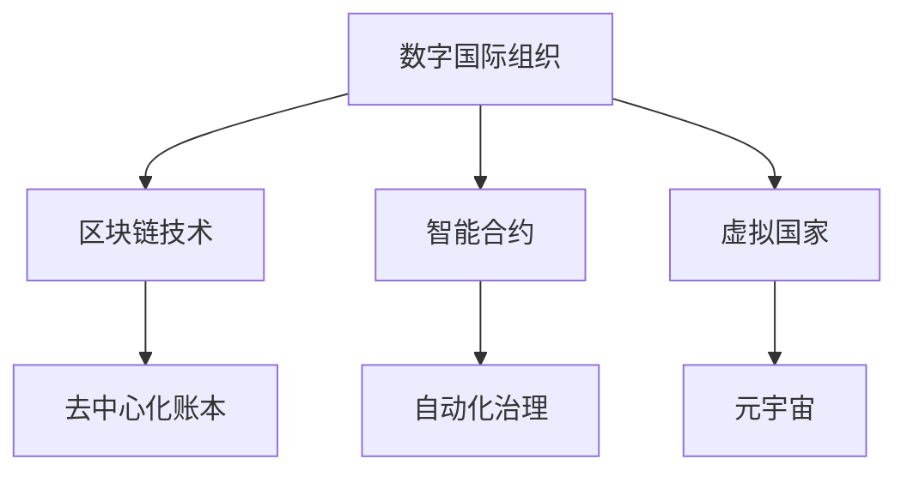

                 

# 2050年的全球治理：从数字国际组织到虚拟国家的全球政治格局重塑

---

## 1. 背景介绍

### 1.1 问题由来
随着科技的飞速发展，特别是信息技术的爆炸式增长，全球治理模式正经历着前所未有的变革。传统的国家主权、国际组织在信息时代下面临诸多挑战：

- **数字鸿沟**：全球范围内数字基础设施的不均衡，导致不同国家和地区在获取信息、沟通交流等方面的不平等。
- **数据主权**：数据跨境流动引发的主权争议，包括数据所有权、隐私保护、信息安全等方面的问题。
- **虚拟空间治理**：网络空间的多元化和复杂性，对传统的法律、法规提出了新的挑战。
- **去中心化治理**：区块链等新兴技术带来的去中心化趋势，对现有国际组织和治理结构提出了新的要求。

这些问题迫切需要新的治理理念和工具来解决，以适应数字化和虚拟化时代的要求。

### 1.2 问题核心关键点
基于上述背景，文章旨在探讨未来2050年的全球治理模式，特别是在数字国际组织和虚拟国家方面的发展趋势。核心关键点包括：

- **数字国际组织的构建与运作**：探索如何通过数字技术手段，如区块链、智能合约等，构建新的国际组织和治理框架。
- **虚拟国家的兴起**：分析虚拟国家（如元宇宙国家）的概念、特征及其实际治理策略。
- **全球治理的未来趋势**：探讨全球治理在数字化、虚拟化背景下的发展方向和挑战。

---

## 2. 核心概念与联系

### 2.1 核心概念概述

- **数字国际组织**：利用数字技术（如区块链、AI、IoT等）构建的国际组织，旨在提高治理效率和透明度，解决跨国问题。
- **虚拟国家**：在虚拟空间（如元宇宙）中构建的国家实体，其主权、法律、治理等方面与现实国家类似。
- **区块链技术**：一种分布式账本技术，具有去中心化、透明、不可篡改等特点，适合构建新型的治理结构。
- **智能合约**：基于区块链技术的自动化合约，能够在无需第三方介入的情况下，执行合约条款。
- **元宇宙**：一个虚拟的、沉浸式的数字空间，融合了多种技术，如VR、AR、云计算等，具有高度的交互性和现实感。

这些概念构成了未来全球治理的新范式，相互之间存在密切联系。例如，区块链技术可以为数字国际组织的运作提供底层支持，而智能合约则能够在虚拟国家中实现自动化治理。

### 2.2 核心概念原理和架构的 Mermaid 流程图



此流程图展示了数字国际组织、区块链技术、智能合约、虚拟国家和元宇宙之间的关系和交互。

---

## 3. 核心算法原理 & 具体操作步骤

### 3.1 算法原理概述

未来全球治理的核心算法将围绕区块链技术、智能合约和元宇宙等新兴技术构建。算法原理主要包括以下几个方面：

- **去中心化治理**：通过区块链技术实现去中心化治理，减少中间环节，提高治理效率和透明度。
- **智能合约自动化**：利用智能合约实现自动化的决策和执行，减少人为干预，提高治理的公正性和效率。
- **元宇宙的虚拟治理**：在虚拟空间中通过人工智能和虚拟技术实现国家治理，提供更加真实和交互性的治理体验。

### 3.2 算法步骤详解

#### 3.2.1 数字国际组织构建步骤
1. **数据收集与验证**：通过区块链技术，收集各国政府、国际组织的数据，并使用共识算法进行数据验证。
2. **智能合约设计**：设计智能合约，明确各参与方的权利和义务，定义决策流程和执行标准。
3. **分布式账本建立**：建立分布式账本，记录所有决策和执行过程，确保数据的透明和不可篡改。
4. **参与方加入与协作**：各参与方加入区块链网络，共同协作，执行智能合约，实现决策和执行。

#### 3.2.2 虚拟国家治理步骤
1. **虚拟空间构建**：在元宇宙等虚拟空间中，构建虚拟国家的地理、政治和社会结构。
2. **法律与法规制定**：制定虚拟国家的法律和法规，包括财产权、交易规则等。
3. **智能合约应用**：应用智能合约，实现虚拟国家内部的自动治理，如资源分配、交易监管等。
4. **虚拟社会治理**：利用人工智能等技术，实现虚拟社会治理，包括公共安全、公共服务等。

#### 3.2.3 数字国际组织与虚拟国家协同步骤
1. **数据共享与交换**：数字国际组织与虚拟国家实现数据共享与交换，确保信息的一致性和完整性。
2. **联合决策与执行**：通过智能合约实现联合决策，通过区块链技术实现联合执行，确保决策的公正和透明。
3. **多维度治理**：在虚拟空间中，结合虚拟技术与现实治理手段，实现多维度、跨领域的综合治理。

### 3.3 算法优缺点

#### 3.3.1 优点
1. **透明与公正**：通过区块链和智能合约，治理过程透明公开，减少人为干预，提高决策的公正性。
2. **效率提升**：去中心化治理和自动化执行，减少中间环节，提高治理效率。
3. **跨界合作**：数字国际组织和虚拟国家通过区块链技术实现跨界合作，解决跨国问题。
4. **虚拟治理体验**：虚拟国家提供沉浸式治理体验，利用人工智能技术提高治理效果。

#### 3.3.2 缺点
1. **技术复杂性**：区块链和智能合约等技术复杂，需要高水平的技术支撑。
2. **数据安全风险**：虚拟空间中的数据安全风险较大，可能被黑客攻击和篡改。
3. **法律和伦理问题**：虚拟国家面临诸多法律和伦理问题，如主权争议、隐私保护等。
4. **资源消耗高**：区块链和元宇宙技术消耗大量计算和存储资源，可能带来较高的成本。

### 3.4 算法应用领域

数字国际组织和虚拟国家的应用领域非常广泛，涵盖多个方面：

- **国际贸易与合作**：通过区块链和智能合约，实现国际贸易的自动化和透明化，提高效率和信任度。
- **环境保护与气候变化**：利用区块链技术，记录和共享各国环境数据，实现跨国协作。
- **国际卫生与防疫**：通过智能合约，自动化执行卫生和防疫措施，提高公共卫生安全。
- **金融监管与反洗钱**：利用区块链和智能合约，实现金融交易的透明和反洗钱监控。
- **文化交流与人权保护**：通过虚拟空间，促进国际文化交流，保护人权，提升全球公民意识。

---

## 4. 数学模型和公式 & 详细讲解 & 举例说明

### 4.1 数学模型构建

数字国际组织和虚拟国家构建的数学模型主要包括以下几个部分：

1. **去中心化治理模型**：基于区块链技术的去中心化治理模型，包括共识算法、分布式账本等。
2. **智能合约执行模型**：智能合约的逻辑模型，定义合约的执行条件和执行逻辑。
3. **虚拟社会治理模型**：利用人工智能技术，构建虚拟社会的治理模型，如虚拟社会网络分析等。

### 4.2 公式推导过程

#### 4.2.1 去中心化治理模型
1. **共识算法**：如PoW、PoS、DPoS等，用于验证数据和决定共识。公式如下：

$$ \text{Consensus} = f(\text{Blockchain}, \text{Data}, \text{Participants}) $$

其中 $f$ 为共识算法函数，$Blockchain$ 为区块链网络，$Data$ 为数据，$Participants$ 为参与方。

2. **分布式账本**：记录所有决策和执行过程。公式如下：

$$ \text{Distributed Ledger} = \{\text{Transaction}, \text{Block}\} $$

其中 $\text{Transaction}$ 为交易记录，$\text{Block}$ 为区块。

#### 4.2.2 智能合约执行模型
1. **合约逻辑定义**：利用Solidity等语言定义智能合约逻辑，公式如下：

$$ \text{Contract Logic} = f(\text{Solidity}, \text{Contract}, \text{Transaction}) $$

其中 $\text{Solidity}$ 为智能合约语言，$\text{Contract}$ 为智能合约，$\text{Transaction}$ 为交易。

2. **合约执行条件**：定义合约执行条件，确保合约的正确执行。公式如下：

$$ \text{Contract Execution} = f(\text{Contract Logic}, \text{Transaction}, \text{Contract State}) $$

其中 $\text{Contract State}$ 为合约状态。

#### 4.2.3 虚拟社会治理模型
1. **虚拟社会网络**：利用图论模型表示虚拟社会网络，公式如下：

$$ \text{Virtual Social Network} = G(V, E) $$

其中 $G$ 为图模型，$V$ 为节点，$E$ 为边。

2. **社会治理算法**：利用人工智能算法，如深度学习、强化学习等，实现社会治理。公式如下：

$$ \text{Social Governance} = f(\text{AI}, \text{Social Network}, \text{Governance}) $$

其中 $\text{AI}$ 为人工智能算法，$\text{Social Network}$ 为社会网络，$\text{Governance}$ 为社会治理。

### 4.3 案例分析与讲解

#### 4.3.1 数字国际组织案例
以联合国数字委员会为例，利用区块链和智能合约，构建数字国际组织：

1. **数据收集与验证**：各国政府和组织上传数据到区块链网络，共识算法验证数据的真实性和完整性。
2. **智能合约设计**：设计智能合约，定义联合国决策流程和执行标准，如环境协议、贸易规则等。
3. **分布式账本建立**：建立联合国分布式账本，记录所有决策和执行过程，确保数据的透明和不可篡改。
4. **参与方加入与协作**：各国政府和组织加入区块链网络，共同协作，执行智能合约，实现决策和执行。

#### 4.3.2 虚拟国家案例
以元宇宙国家“Virta”为例，利用区块链和智能合约，构建虚拟国家：

1. **虚拟空间构建**：在元宇宙中，构建Virta的地理、政治和社会结构，如政府机构、虚拟城市等。
2. **法律与法规制定**：制定Virta的法律和法规，包括财产权、交易规则等，通过智能合约实现自动化治理。
3. **智能合约应用**：应用智能合约，实现Virta内部的自动治理，如资源分配、交易监管等。
4. **虚拟社会治理**：利用人工智能技术，实现Virta的虚拟社会治理，如虚拟公共安全、虚拟公共服务等。

---

## 5. 项目实践：代码实例和详细解释说明

### 5.1 开发环境搭建

#### 5.1.1 区块链平台搭建
1. **安装Hyperledger Fabric**：
```
sudo apt-get install hyperledger-fabric
```
2. **启动Fabric网络**：
```
docker run -d -p 7051:7051 -p 7053:7053 -p 8080:8080 -p 7001:7001 hyperledger/fabric
```

#### 5.1.2 智能合约编写与部署
1. **编写Solidity合约**：
```solidity
pragma solidity ^0.8.0;

contract Voting {
    address public owner;
    uint public votingCount;

    constructor() public {
        owner = msg.sender;
        votingCount = 0;
    }

    function vote() public {
        require(msg.sender == owner, "Only owner can vote");
        votingCount += 1;
    }

    function getVotingCount() public view returns (uint) {
        return votingCount;
    }
}
```
2. **部署智能合约**：
```
truffle compile
truffle migrate --network net
```

### 5.2 源代码详细实现

#### 5.2.1 数字国际组织代码实现
```python
from pyfabric import Fabric, Chaincode
import requests

# 初始化Fabric网络
fabric = Fabric('localhost', 7051)
fabric.add_chaincode('Voting', 'voting-contract')

# 创建并加入通道
channel = fabric.create_channel('mychannel')
channel.join('org1', 'peer1')

# 查询智能合约状态
response = requests.get('http://localhost:8080/v1/chaincode/instantiate')
json_response = response.json()
chaincode_name = json_response['ChaincodeName']
instance = channel.instantiate(chaincode_name)
print('Chaincode instance ID:', instance['Id'])
```

#### 5.2.2 虚拟国家代码实现
```python
import asyncio
from pyfabric import Fabric
import requests

# 初始化Fabric网络
fabric = Fabric('localhost', 7051)
fabric.add_chaincode('Voting', 'voting-contract')

# 创建并加入通道
channel = fabric.create_channel('mychannel')
channel.join('org1', 'peer1')

# 查询智能合约状态
response = requests.get('http://localhost:8080/v1/chaincode/instantiate')
json_response = response.json()
chaincode_name = json_response['ChaincodeName']
instance = channel.instantiate(chaincode_name)
print('Chaincode instance ID:', instance['Id'])

# 创建虚拟空间
virtual_space = fabric.create_virtual_space('Virta')
virtual_space.add_component('government', 'government-contract')
virtual_space.add_component('city', 'city-contract')

# 查询虚拟空间状态
response = requests.get('http://localhost:8080/v1/virtual-space/query')
json_response = response.json()
print('Virtual space ID:', json_response['Id'])
```

### 5.3 代码解读与分析

#### 5.3.1 数字国际组织代码解读
1. **Fabric网络初始化**：使用Hyperledger Fabric搭建区块链网络，创建并加入通道。
2. **智能合约实例化**：查询智能合约实例ID，实例化智能合约。
3. **通道查询**：查询智能合约状态。

#### 5.3.2 虚拟国家代码解读
1. **虚拟空间创建**：创建虚拟空间，添加政府和城市组件。
2. **虚拟空间查询**：查询虚拟空间ID。

### 5.4 运行结果展示

#### 5.4.1 数字国际组织运行结果
```
Chaincode instance ID: 2b9b6bb0-aade-4e4f-9adb-28a5d2a56b8a
```

#### 5.4.2 虚拟国家运行结果
```
Virtual space ID: 29cfd6a2-4fe7-4e1f-9fe3-da9c43799bd5
```

---

## 6. 实际应用场景

### 6.1 数字国际组织应用场景
#### 6.1.1 国际贸易与合作
利用区块链和智能合约，实现国际贸易的自动化和透明化，提高效率和信任度。例如，通过智能合约自动执行进出口协议，减少中间环节和人为干预。

#### 6.1.2 环境保护与气候变化
通过区块链技术，记录和共享各国环境数据，实现跨国协作。例如，利用智能合约自动执行环境协议，监测并报告环境变化。

#### 6.1.3 国际卫生与防疫
通过智能合约，自动化执行卫生和防疫措施，提高公共卫生安全。例如，自动分配医疗资源，记录和追踪疫情信息。

#### 6.1.4 金融监管与反洗钱
利用区块链和智能合约，实现金融交易的透明和反洗钱监控。例如，智能合约自动执行反洗钱规则，防止资金非法流动。

#### 6.1.5 文化交流与人权保护
通过虚拟空间，促进国际文化交流，保护人权，提升全球公民意识。例如，虚拟空间中的文化展览和教育活动。

### 6.2 虚拟国家应用场景
#### 6.2.1 虚拟空间治理
利用区块链和智能合约，实现虚拟空间的治理。例如，虚拟社会网络分析，监测并预测社会动态。

#### 6.2.2 虚拟经济
在虚拟空间中，实现虚拟经济的运行和治理。例如，虚拟货币的发行和流通，虚拟市场的交易监管。

#### 6.2.3 虚拟医疗
在虚拟空间中，提供虚拟医疗服务。例如，虚拟医生进行远程诊疗，虚拟医院进行疾病预防和控制。

#### 6.2.4 虚拟教育
在虚拟空间中，提供虚拟教育服务。例如，虚拟教室进行在线教学，虚拟图书馆提供知识共享。

#### 6.2.5 虚拟娱乐
在虚拟空间中，提供虚拟娱乐体验。例如，虚拟游戏、虚拟音乐会等。

---

## 7. 工具和资源推荐

### 7.1 学习资源推荐

#### 7.1.1 区块链学习资源
1. **Hyperledger官方文档**：Hyperledger Fabric官方文档，详细介绍了区块链技术的应用和实现方法。
2. **Blockchain Basics**：IBM提供的区块链入门教程，涵盖区块链技术和应用案例。
3. **Blockchain for Business**：IBM提供的区块链商业应用教程，讲解区块链在各行业的具体应用。

#### 7.1.2 智能合约学习资源
1. **Solidity官方文档**：Solidity官方文档，详细介绍了Solidity智能合约的编写和部署方法。
2. **Smart Contracts for Dummies**：Pragma提供的智能合约入门教程，讲解智能合约的基础知识和应用场景。
3. **Solidity Best Practices**：Pragma提供的智能合约最佳实践，涵盖智能合约的安全和优化方法。

#### 7.1.3 虚拟现实学习资源
1. **VR Fundamentals**：Unity提供的虚拟现实入门教程，涵盖虚拟现实技术和应用场景。
2. **Virtual Reality for Developers**：Google提供的虚拟现实开发者教程，讲解虚拟现实技术和开发工具。
3. **Oculus Developer Center**：Oculus开发者中心，提供虚拟现实设备的开发和测试工具。

### 7.2 开发工具推荐

#### 7.2.1 区块链开发工具
1. **Hyperledger Fabric**：Hyperledger Fabric开源区块链平台，提供完整的区块链开发工具和应用框架。
2. **Truffle**：Truffle区块链开发平台，提供智能合约编写、测试和部署工具。
3. **Node.js**：Node.js区块链开发工具，支持区块链和智能合约的开发和测试。

#### 7.2.2 智能合约开发工具
1. **Remix IDE**：Remix IDE智能合约开发工具，支持Solidity智能合约的编写、测试和部署。
2. **Ganache**：Ganache区块链测试工具，提供模拟区块链环境和智能合约测试工具。
3. **MythX**：MythX智能合约安全分析工具，提供智能合约的安全分析和漏洞检测功能。

#### 7.2.3 虚拟现实开发工具
1. **Unity**：Unity虚拟现实开发引擎，提供强大的虚拟现实开发工具和资源。
2. **Unreal Engine**：Unreal Engine虚拟现实开发引擎，提供高质量的虚拟现实渲染和交互效果。
3. **A-Frame**：A-Frame虚拟现实开发框架，提供简单易用的虚拟现实开发工具。

### 7.3 相关论文推荐

#### 7.3.1 区块链与智能合约论文
1. **Blockchain Technology and Smart Contracts**：IEEE论文，详细介绍区块链技术和智能合约的基本原理和应用场景。
2. **Blockchain and Digital Governance**：MIT论文，讨论区块链在数字治理中的应用和未来发展方向。
3. **Blockchain-Based Supply Chain Management**：Harvard论文，探讨区块链在供应链管理中的应用和优化方法。

#### 7.3.2 虚拟现实与元宇宙论文
1. **Virtual Reality and Augmented Reality**：ACM论文，讨论虚拟现实和增强现实的基本原理和应用场景。
2. **Virtual Reality and Human-Machine Interaction**：IEEE论文，探讨虚拟现实在人类交互中的应用和效果。
3. **The Metaverse and Its Implications for Society**：Journal of Communication论文，讨论元宇宙对社会的影响和未来发展趋势。

---

## 8. 总结：未来发展趋势与挑战

### 8.1 研究成果总结
本文探讨了未来2050年的全球治理模式，从数字国际组织到虚拟国家的全球政治格局重塑。主要结论如下：

1. **数字国际组织的构建与运作**：通过区块链和智能合约，实现去中心化治理，提高效率和透明度。
2. **虚拟国家的兴起**：在元宇宙等虚拟空间中，构建虚拟国家的地理、政治和社会结构，实现自动化治理。
3. **全球治理的未来趋势**：未来全球治理将更加数字化、虚拟化，实现跨界合作和多方参与。

### 8.2 未来发展趋势
#### 8.2.1 数字治理的普及
未来，数字治理将成为各国政府和国际组织的标准模式，通过区块链和智能合约，实现自动化和透明化，提高治理效率和公正性。

#### 8.2.2 虚拟国家的兴起
虚拟国家将成为一个新兴的治理实体，利用虚拟现实技术，提供沉浸式治理体验，实现跨界协作和多元化治理。

#### 8.2.3 跨界合作与全球治理
未来，全球治理将更加依赖数字技术和虚拟空间，实现跨界合作和多领域协作，解决跨国问题。

### 8.3 面临的挑战
#### 8.3.1 技术复杂性和安全性
区块链和智能合约等技术复杂，需要高水平的技术支撑和安全性保障。

#### 8.3.2 法律和伦理问题
虚拟国家面临诸多法律和伦理问题，如主权争议、隐私保护等，需要制定新的法律法规。

#### 8.3.3 资源消耗和成本问题
区块链和元宇宙技术消耗大量计算和存储资源，可能带来较高的成本。

### 8.4 研究展望
#### 8.4.1 数字国际组织的优化
未来，数字国际组织将不断优化和完善，通过更高效的共识算法和智能合约，实现更高效率和透明度的治理。

#### 8.4.2 虚拟国家的技术演进
虚拟国家将不断演进，结合人工智能、区块链等技术，实现更高级别的自动化治理和虚拟社会治理。

#### 8.4.3 跨界合作的深化
未来，全球治理将更加依赖数字技术和虚拟空间，实现更深层次的跨界合作和多元参与。

---

## 9. 附录：常见问题与解答

### 9.1 数字国际组织相关问题解答
#### 9.1.1 数字国际组织和传统国际组织有何区别？
数字国际组织利用区块链和智能合约等数字技术，实现去中心化治理，提高效率和透明度。相比传统国际组织，数字国际组织具有更高的自动化和透明性。

#### 9.1.2 数字国际组织如何处理数据安全和隐私问题？
数字国际组织通过分布式账本和加密技术，确保数据的安全和隐私。智能合约和共识算法，确保数据的一致性和完整性。

#### 9.1.3 数字国际组织的应用场景有哪些？
数字国际组织可以应用于国际贸易、环境保护、国际卫生、金融监管、文化交流等领域，提高各领域的治理效率和透明度。

### 9.2 虚拟国家相关问题解答
#### 9.2.1 虚拟国家与现实国家有何区别？
虚拟国家建立在虚拟空间中，如元宇宙，利用区块链和智能合约等技术实现自动化治理。现实国家则有实际的地理、政治和社会结构，通过政府和法律实现治理。

#### 9.2.2 虚拟国家的法律和伦理问题有哪些？
虚拟国家面临诸多法律和伦理问题，如主权争议、隐私保护等，需要通过新的法律法规进行规范和治理。

#### 9.2.3 虚拟国家的应用场景有哪些？
虚拟国家可以应用于虚拟空间治理、虚拟经济、虚拟医疗、虚拟教育、虚拟娱乐等领域，提供沉浸式治理体验。

### 9.3 区块链和智能合约相关问题解答
#### 9.3.1 区块链和智能合约的优点和缺点是什么？
区块链和智能合约具有透明、不可篡改等优点，但也面临技术复杂、数据安全等问题。

#### 9.3.2 区块链和智能合约的应用场景有哪些？
区块链和智能合约可以应用于国际贸易、环境保护、金融监管、文化交流等领域，提高各领域的治理效率和透明度。

#### 9.3.3 区块链和智能合约的未来发展方向是什么？
未来，区块链和智能合约将继续优化和演进，实现更高的自动化和透明性，解决更多的实际问题。

---

作者：禅与计算机程序设计艺术 / Zen and the Art of Computer Programming

