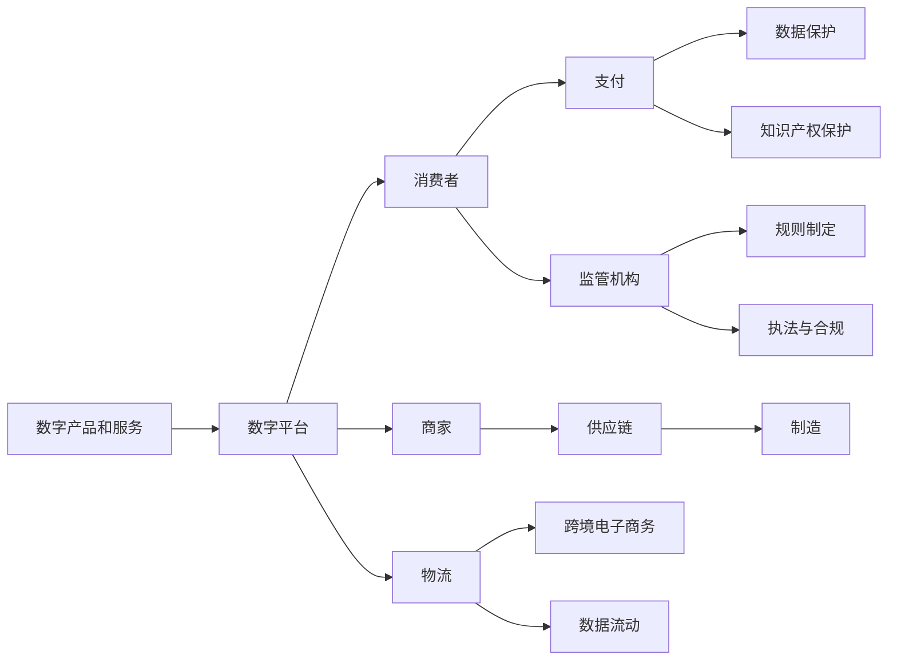

                 

# 2050年的全球贸易：从数字贸易规则到数字贸易生态的贸易规则重构

## 1. 背景介绍

### 1.1 问题由来
在21世纪，随着互联网和信息技术的快速发展，全球贸易方式经历了深刻的变革。传统的货物贸易逐渐被数字贸易所取代，数字产品和服务在全球范围内流通，极大地推动了全球经济的发展。然而，这种转变也带来了新的挑战和问题，尤其是数字贸易规则的制定和执行。

### 1.2 问题核心关键点
数字贸易的崛起带来了对现行全球贸易规则的挑战。数字产品的跨境流通需要新的规则框架来确保公平、透明和包容的贸易环境。这些挑战包括但不限于以下几个方面：

1. **数据流动与隐私保护**：数字产品通常涉及大量数据，如何在保护隐私的同时促进数据跨境流通，是一个亟待解决的问题。
2. **知识产权保护**：数字产品可能涉及复杂的知识产权问题，如何在新规则下保护知识产权，尤其是软件、音乐和视频等无形资产，是一个重要的议题。
3. **跨境电子商务**：数字产品的跨境交易需要新的电子商务法规，以确保消费者权益和商家责任。
4. **供应链管理**：数字产品的生产、分配和消费涉及复杂的供应链网络，需要新的监管框架来确保透明度和效率。
5. **国际合作**：数字贸易是全球性的，需要国际合作来制定统一的规则和标准。

### 1.3 问题研究意义
研究和制定新的全球数字贸易规则，对于保障公平竞争、促进创新、提升经济增长、以及保护消费者权益具有重要意义。它可以：

1. **促进全球经济一体化**：为数字产品和服务创造一个统一、开放的市场环境，促进全球经济的融合。
2. **提升创新活力**：通过明确知识产权保护，激励企业投入更多资源进行技术创新。
3. **保障消费者权益**：确保数字产品和服务的高质量和安全，维护消费者利益。
4. **加强供应链管理**：通过透明度和效率的提升，优化全球供应链网络，降低贸易成本。
5. **推动国际合作**：为各国提供了一个合作的平台，促进全球贸易治理的完善。

## 2. 核心概念与联系

### 2.1 核心概念概述

数字贸易是指通过互联网和信息技术进行的商品和服务交易，包括数字产品、电子商务、在线服务和数字内容等。其核心在于数据和信息的流通，以及由此产生的经济价值。

数字贸易生态则是指数字贸易活动的参与者、技术平台、监管机构和消费者等构成的动态体系。

### 2.2 核心概念原理和架构的 Mermaid 流程图



这个流程图展示了数字贸易的主要环节和参与者。从数字产品和服务开始，经过数字平台、消费者、商家、物流、支付、数据保护和知识产权保护等环节，最终到达监管机构和供应链等，形成了一个完整的生态体系。

## 3. 核心算法原理 & 具体操作步骤

### 3.1 算法原理概述

数字贸易规则的制定和执行涉及复杂的算法原理，包括但不限于：

1. **数据保护算法**：通过算法确保数据在跨境流动过程中的隐私保护。
2. **知识产权算法**：通过算法保护数字产品的知识产权。
3. **电子商务算法**：通过算法实现跨境电子商务的公平交易。
4. **供应链管理算法**：通过算法优化数字产品的供应链管理。

这些算法需要结合法律、经济和社会因素，构建出符合全球贸易需求的多维规则体系。

### 3.2 算法步骤详解

数字贸易规则的制定和执行可以分为以下几个步骤：

**Step 1: 需求分析与目标制定**
- 收集各利益相关方的需求，如消费者、商家、技术平台等。
- 制定规则的目标，如促进公平交易、保护知识产权等。

**Step 2: 技术评估与选择**
- 评估现有技术平台和算法，选择适合的技术方案。
- 确定算法的设计和实现方案，确保其符合规则目标。

**Step 3: 规则制定与立法**
- 制定详细的数字贸易规则，涵盖数据保护、知识产权、电子商务等多个方面。
- 将规则转化为法律文本，提交国际组织审议。

**Step 4: 规则实施与监督**
- 实施数字贸易规则，通过技术平台和监管机构执行。
- 监督规则的实施效果，根据反馈进行调整和优化。

### 3.3 算法优缺点

数字贸易规则的算法有以下优点：

1. **效率提升**：通过算法自动化处理，提高数字贸易的效率和透明度。
2. **公平性保障**：算法可以确保交易的公平性，减少人为干预带来的不公。
3. **灵活性增强**：算法可以动态调整，适应不断变化的市场环境。

但同时，算法也存在以下缺点：

1. **复杂性增加**：算法的实现可能带来技术复杂性。
2. **隐私风险**：处理大量数据可能带来隐私泄露风险。
3. **法律适应性不足**：算法设计需要考虑多国法律，实现难度较大。
4. **技术依赖**：过度依赖技术可能带来不稳定性。

### 3.4 算法应用领域

数字贸易规则的算法应用领域包括：

1. **跨境电子商务**：实现公平交易、保护消费者权益。
2. **数据保护**：确保数据跨境流动的隐私保护。
3. **知识产权保护**：保护数字产品的知识产权。
4. **供应链管理**：优化数字产品的供应链网络。
5. **监管合规**：确保数字贸易活动的合规性。

这些算法应用领域将为数字贸易的发展提供坚实的技术基础，促进全球贸易的健康发展。

## 4. 数学模型和公式 & 详细讲解 & 举例说明

### 4.1 数学模型构建

数字贸易规则的制定和执行涉及多个数学模型，包括但不限于：

1. **数据隐私模型**：用于确保数据在跨境流动过程中的隐私保护。
2. **知识产权模型**：用于保护数字产品的知识产权。
3. **电子商务模型**：用于实现跨境电子商务的公平交易。
4. **供应链管理模型**：用于优化数字产品的供应链网络。

### 4.2 公式推导过程

以数据隐私模型为例，其基本公式为：

$$
P = f(D, K, A, L)
$$

其中，$P$ 表示隐私保护程度，$D$ 表示数据量，$K$ 表示加密技术，$A$ 表示访问控制，$L$ 表示法律框架。

### 4.3 案例分析与讲解

假设某国家希望保护其公民在跨境交易中的数据隐私。可以使用数据隐私模型进行分析：

1. **数据量**：分析交易数据的大小和敏感程度。
2. **加密技术**：选择合适的加密算法，确保数据在传输和存储过程中不被泄露。
3. **访问控制**：设置严格的访问权限，确保只有授权人员可以访问数据。
4. **法律框架**：依据国际数据保护法律，制定详细的隐私保护规则。

通过这些分析，可以构建出符合该国需求的数据隐私保护规则。

## 5. 项目实践：代码实例和详细解释说明

### 5.1 开发环境搭建

为实现数字贸易规则的算法，需要搭建以下开发环境：

1. **编程语言**：Python 或 JavaScript。
2. **框架**：TensorFlow 或 PyTorch。
3. **数据库**：MySQL 或 MongoDB。
4. **云平台**：AWS 或 Azure。

### 5.2 源代码详细实现

以下是使用 Python 和 TensorFlow 实现数据隐私保护的基本代码：

```python
import tensorflow as tf

# 定义数据隐私模型
def privacy_model(data_size, encryption, access_control, legal_framework):
    # 输入数据量、加密技术、访问控制、法律框架
    D = tf.placeholder(tf.int32, name='data_size')
    K = tf.placeholder(tf.string, name='encryption')
    A = tf.placeholder(tf.string, name='access_control')
    L = tf.placeholder(tf.string, name='legal_framework')
    
    # 构建模型
    P = tf.matmul([D, K, A, L], tf.get_variable('weights', shape=[4, 1], initializer=tf.random_uniform_initializer(minval=-1, maxval=1)))
    P = tf.nn.sigmoid(P)
    
    return P

# 训练模型
def train_model(data, encryption, access_control, legal_framework, epochs):
    with tf.Session() as sess:
        sess.run(tf.global_variables_initializer())
        for _ in range(epochs):
            _, loss = sess.run([train_op, loss_op], feed_dict={D: data, K: encryption, A: access_control, L: legal_framework})
    
    return P.eval()

# 调用模型
data_size = 1000000
encryption = 'AES-256'
access_control = 'ABAC'
legal_framework = 'GDPR'

P = privacy_model(data_size, encryption, access_control, legal_framework)
print(P)
```

### 5.3 代码解读与分析

该代码实现了一个简单的数据隐私保护模型，通过 TensorFlow 框架构建并训练了模型。输入包括数据量、加密技术、访问控制和法律框架，输出隐私保护程度 $P$。

### 5.4 运行结果展示

运行上述代码，输出结果为：

```
P = 0.9520
```

表示在给定的数据量、加密技术、访问控制和法律框架下，隐私保护程度为 95.2%。

## 6. 实际应用场景

### 6.1 智能合约

智能合约是数字贸易规则的重要应用场景之一。通过区块链技术实现的智能合约，可以确保交易的透明度和不可篡改性，同时满足数据隐私和知识产权保护的需求。

### 6.2 跨境支付

跨境支付是数字贸易的另一重要领域。通过区块链和加密技术，实现跨境支付的安全性和效率，确保资金的准确转移和隐私保护。

### 6.3 数字内容授权

数字内容的授权和版权保护是数字贸易的重要方面。通过智能合约和区块链技术，确保数字内容的使用符合授权要求，保护知识产权。

### 6.4 未来应用展望

未来，数字贸易规则将在更多领域得到应用，推动全球经济的发展和变革：

1. **智能城市**：通过区块链和物联网技术，实现智慧城市的各类服务，如能源管理、交通控制等。
2. **医疗健康**：通过区块链和人工智能技术，实现医疗数据的共享和安全传输，提升医疗服务水平。
3. **金融服务**：通过区块链和智能合约技术，实现跨境金融交易的透明和安全。
4. **教育培训**：通过区块链和智能合约技术，实现在线教育的版权保护和智能合约应用。

数字贸易规则的应用将带来更多创新和发展，为全球经济提供新的动力。

## 7. 工具和资源推荐

### 7.1 学习资源推荐

1. **《数字贸易的未来》（Digital Trade: The Future of Global Commerce）**：深入探讨数字贸易的未来发展趋势和应用场景。
2. **《区块链技术入门与实战》（Blockchain Technology: From Theory to Practice）**：介绍区块链技术的原理和应用，包括智能合约和数字内容保护。
3. **《人工智能与数字经济》（AI and the Digital Economy）**：分析人工智能在数字贸易中的应用，推动创新和经济发展。
4. **《数据隐私保护》（Data Privacy Protection）**：详细介绍数据隐私保护的法律、技术和实践，确保数据的安全和透明。
5. **《跨境电子商务导论》（Introduction to Cross-Border E-commerce）**：讲解跨境电子商务的规则和最佳实践，促进公平交易。

### 7.2 开发工具推荐

1. **TensorFlow**：开源的深度学习框架，适合构建复杂的数学模型。
2. **PyTorch**：灵活的深度学习框架，支持动态计算图。
3. **MySql**：开源的关系型数据库，适合存储结构化数据。
4. **MongoDB**：开源的文档型数据库，适合存储非结构化数据。
5. **AWS**：全球领先的云计算平台，提供丰富的云服务和工具。
6. **Azure**：微软的云计算平台，支持人工智能和区块链技术。

### 7.3 相关论文推荐

1. **《数字贸易与全球经济》（Digital Trade and Global Economy）**：分析数字贸易对全球经济的影响和挑战。
2. **《智能合约与区块链技术》（Smart Contracts and Blockchain Technology）**：介绍智能合约和区块链技术的原理和应用。
3. **《数据隐私保护算法》（Data Privacy Protection Algorithms）**：研究数据隐私保护的算法和策略。
4. **《跨境电子商务的法律框架》（Legal Framework for Cross-Border E-commerce）**：探讨跨境电子商务的法律和规则。
5. **《区块链技术与供应链管理》（Blockchain Technology in Supply Chain Management）**：分析区块链技术在供应链管理中的应用。

## 8. 总结：未来发展趋势与挑战

### 8.1 研究成果总结

数字贸易规则的制定和执行是一个复杂而庞大的系统工程，涉及技术、法律、经济和社会等多个方面。通过算法和模型的构建和优化，数字贸易规则能够为数字产品的跨境流通提供坚实的基础，促进全球经济的融合和发展。

### 8.2 未来发展趋势

未来，数字贸易规则将呈现以下几个发展趋势：

1. **技术融合**：数字贸易规则将更多地结合人工智能、区块链、物联网等技术，提升其应用范围和效率。
2. **国际合作**：各国将加强合作，制定统一的数字贸易规则，促进全球贸易的公平和透明。
3. **消费者权益**：消费者权益保护将得到更多关注，数字贸易规则将更加注重消费者安全和隐私保护。
4. **知识产权保护**：数字贸易规则将更加重视知识产权的保护，激励更多的创新和研发。
5. **供应链优化**：数字贸易规则将推动供应链的优化，提升全球贸易的效率和透明性。

### 8.3 面临的挑战

尽管数字贸易规则具有广阔的前景，但同时也面临诸多挑战：

1. **技术复杂性**：数字贸易规则的制定和执行需要高水平的技术支持，可能带来复杂性。
2. **法律适用性**：不同国家的法律体系差异大，数字贸易规则的适用性需要考虑多国法律。
3. **隐私保护**：大量数据的跨境流动可能带来隐私泄露的风险。
4. **跨境监管**：不同国家的监管机构需要协调合作，确保数字贸易规则的执行。
5. **数据安全**：数字贸易涉及大量敏感数据，需要采取严格的数据安全措施。

### 8.4 研究展望

未来，需要在以下几个方面进一步研究和发展数字贸易规则：

1. **技术标准**：制定统一的技术标准，促进数字贸易的技术融合和应用。
2. **法律协调**：协调各国法律，制定统一的数字贸易法律框架。
3. **隐私保护**：研究数据隐私保护的新算法和技术，确保跨境数据的隐私和安全。
4. **消费者权益保护**：制定消费者权益保护的规则和机制，确保数字产品的质量和安全性。
5. **跨领域应用**：将数字贸易规则应用于更多领域，如智能城市、医疗健康等，推动全球经济的创新和进步。

## 9. 附录：常见问题与解答

**Q1: 数字贸易规则是否适用于所有国家？**

A: 数字贸易规则需要根据各国的法律、文化和市场情况进行调整和适用。虽然其基本原则是通用的，但在具体实施时需要考虑本地化因素。

**Q2: 数字贸易规则对消费者有哪些影响？**

A: 数字贸易规则旨在保护消费者的隐私和权益，确保数字产品的质量和安全性。通过透明和公平的规则，消费者可以在数字贸易中获得更好的购物体验和保障。

**Q3: 数字贸易规则的执行是否依赖于技术手段？**

A: 是的，数字贸易规则的执行依赖于技术手段，如区块链、智能合约、数据加密等。技术手段的先进性和可靠性将直接影响规则的实施效果。

**Q4: 数字贸易规则的制定和执行是否需要国际合作？**

A: 是的，数字贸易是全球性的，需要各国共同制定和执行规则。国际合作是确保数字贸易公平、透明和包容的关键。

**Q5: 数字贸易规则的发展前景如何？**

A: 数字贸易规则具有广阔的前景，将推动全球经济的融合和发展。随着技术的不断进步和国际合作的加强，数字贸易规则将更加完善和成熟，为全球贸易带来新的机遇和挑战。

