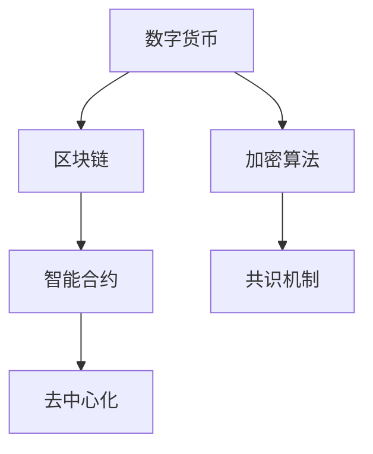

                 

# 2050年的数字货币：从纸币到加密资产的货币演变

## 1. 背景介绍

### 1.1 货币演变的历史回顾

货币作为人类社会交易和价值存储的媒介，其形态和功能随着科技进步和社会变迁不断演进。从最早的实物货币（如贝壳、金银）到金属铸币，再到如今的纸币和电子货币，货币的本质一直是交换和存储价值的工具。但随着科技的进一步发展，尤其是信息技术和区块链技术的崛起，货币的形态和价值储存方式正经历着根本性的变革。

### 1.2 数字货币的兴起

数字货币是指通过互联网和数字技术实现的电子货币形式，具有去中心化、匿名性、高效性等特点。比特币的诞生标志着数字货币时代的到来，之后众多区块链项目纷纷涌现，创建了各种形式的数字货币。

## 2. 核心概念与联系

### 2.1 核心概念概述

- **数字货币**：基于区块链技术的电子货币，具有去中心化、透明性、不可篡改性等特征。
- **加密资产**：数字货币的一种，通过密码学算法保证交易安全，具有不可伪造和抗审查的特点。
- **去中心化**：不依赖中心化的金融机构，交易直接在网络节点间进行。
- **智能合约**：自动执行的合约，当满足预设条件时，合约中的条款自动执行。
- **共识机制**：保证区块链网络节点间交易信息的同步和一致性。

### 2.2 核心概念原理和架构的 Mermaid 流程图



此图展示了数字货币的核心架构和核心概念之间的关系：

1. 数字货币建立在区块链技术上，通过分布式账本记录所有交易信息。
2. 加密算法保障交易安全，确保数据隐私。
3. 智能合约提供了自动执行的功能，减少人为干预。
4. 共识机制保证了网络节点间的交易一致性，防止数据篡改。
5. 去中心化确保了系统的高可用性和抗审查性。

## 3. 核心算法原理 & 具体操作步骤

### 3.1 算法原理概述

数字货币的算法原理主要围绕以下几个核心技术展开：

- **加密算法**：用于保护交易信息的隐私和安全。常用的加密算法包括非对称加密（如RSA、ECC）和哈希函数（如SHA-256）。
- **共识机制**：保证网络节点间交易信息的同步和一致性，防止双重支付和数据篡改。常用的共识机制有PoW（工作量证明）、PoS（权益证明）、DPoS（委托权益证明）等。
- **智能合约**：自动执行的合约，实现去中心化应用的功能。智能合约通过Solidity、Solidity-like语言编写，部署在区块链上。
- **去中心化技术**：利用分布式网络，去除中心化控制，实现透明和抗审查性。

### 3.2 算法步骤详解

1. **加密算法**：
   - 生成一对公私钥（非对称加密）。
   - 使用哈希函数将交易信息加密成哈希值。
   - 使用私钥对哈希值进行数字签名。

2. **共识机制**：
   - 节点广播交易信息到网络。
   - 各节点使用共识算法达成共识，确认交易的有效性。
   - 共识结果写入区块链，广播给所有节点。

3. **智能合约**：
   - 编写智能合约代码，定义交易的逻辑和规则。
   - 将智能合约部署到区块链上。
   - 智能合约自动执行交易，完成货币转移。

4. **去中心化技术**：
   - 构建分布式网络，节点独立运行，数据和计算负载分散。
   - 利用共识算法确保数据一致性，防止单点故障。

### 3.3 算法优缺点

- **优点**：
  - 去中心化，减少中心化机构干预，提高透明度和安全性。
  - 使用智能合约，实现自动化、高效的交易和业务逻辑。
  - 加密算法保护交易安全，防止数据篡改和隐私泄露。
  - 共识机制保障数据一致性，防止双重支付和系统攻击。

- **缺点**：
  - 技术门槛高，需要具备加密和区块链相关的知识。
  - 能源消耗大，如PoW共识机制需要大量计算资源。
  - 扩展性受限，交易速度较慢，容易成为网络瓶颈。
  - 法律法规不完善，存在监管和法律风险。

### 3.4 算法应用领域

数字货币和加密资产的应用领域广泛，涵盖了金融、贸易、供应链管理、社会治理等多个方面。以下是几个典型的应用场景：

- **金融行业**：银行、证券公司等金融机构利用区块链技术进行清算、结算、反洗钱等业务。
- **供应链管理**：利用智能合约自动执行供应链上的合同和支付，提高效率和透明度。
- **数字身份**：通过数字证书和身份验证系统，实现身份识别和信息验证。
- **版权保护**：通过区块链记录版权信息，防止版权侵权和盗版。
- **社会治理**：利用区块链记录和查询政府事务，提高透明度和公信力。

## 4. 数学模型和公式 & 详细讲解

### 4.1 数学模型构建

设数字货币网络中的交易信息为 $T$，节点为 $N$，共识算法为 $C$，智能合约为 $S$。数字货币的数学模型可以描述为：

$$ M = T \times C \times S $$

其中，$M$ 为数字货币系统，$T$ 为交易信息，$C$ 为共识算法，$S$ 为智能合约。

### 4.2 公式推导过程

1. **加密算法**：
   - 非对称加密算法：
     - 公钥 $P$ 和私钥 $K$ 满足：$P \cdot K = 1$（模数）
     - 加密过程：$M \rightarrow H(M) \rightarrow H(M) \cdot P$

   - 哈希函数：
     - 哈希函数 $H$ 满足：$H(M) = H(M')$ 当 $M=M'$（输入相同）
     - 哈希值 $H(M)$ 是固定长度的，不可逆

2. **共识算法**：
   - 工作量证明（PoW）：
     - 矿工通过计算特定哈希值来证明工作量，获得奖励。
     - 难度调整：$Difficulty = 2^{n}$（n为调整周期）

   - 权益证明（PoS）：
     - 节点根据持有的货币量（权益）进行随机选择，成为生成块的用户。
     - 权益因子：$Weight = \frac{Balance}{TotalBalance}$

3. **智能合约**：
   - 编写智能合约代码：$Code = S$（函数）
   - 智能合约执行：$Execute(S, T)$（交易信息）

4. **去中心化技术**：
   - 分布式网络：$N = \{Node_i\}$
   - 节点间通信协议：$Protocol(N)$

### 4.3 案例分析与讲解

以比特币（Bitcoin）为例，展示数字货币的算法原理：

1. **加密算法**：
   - 公钥和私钥：
     - 公钥：`02ab4a7f3922b5e8413d8a5c9a985058d8d61b6c3c26bc8e1f6fca9d3f4f03ec3c1`
     - 私钥：`38f225b1af6d0dd82a5e4ac2c6434cc811c6adf4fd8ebc114932d6b7770cf6b6e8`

   - 哈希函数：
     - 交易哈希值：`a7ba8d0c4c9e3959a5b16e2b2911bfdea8e84cbf4d8fcd0ac4c3e0abac22a4833`

   - 数字签名：
     - 使用私钥签名交易：`0273b3e3e77c8e07b2374baacd7cdb7cf5b80487580bffd48f2ff0f35f3a0ab57`

2. **共识机制**：
   - 工作量证明（PoW）：
     - 矿工通过计算特定哈希值来证明工作量，获得比特币奖励。
     - 难度调整：`000fffffff7a8d81d6674c5f0fd4d6c51a2fce342bd17197bd8a3c5b52d5b66dcd`

3. **智能合约**：
   - 比特币的智能合约定义了交易的逻辑和规则，通过比特币协议自动执行。

4. **去中心化技术**：
   - 比特币构建了分布式网络，每个节点独立运行，数据和计算负载分散。

## 5. 项目实践：代码实例和详细解释说明

### 5.1 开发环境搭建

1. **安装Python**：
   - 从官网下载安装Python（如Python 3.8+）。

2. **安装加密库**：
   - 安装pycrypto库用于非对称加密。
   - 安装hashlib库用于哈希函数。

3. **安装区块链库**：
   - 安装eth-hash库用于计算工作量证明。

4. **安装智能合约编译器**：
   - 安装Solidity编译器，用于编写和编译智能合约。

### 5.2 源代码详细实现

```python
from cryptography.hazmat.primitives import serialization, hashes, rsa
from cryptography.hazmat.primitives.asymmetric import padding
from hashlib import sha256
import eth_hash

# 生成公私钥
def generate_key():
    private_key = rsa.generate_private_key(public_exponent=65537, key_size=2048)
    public_key = private_key.public_key()
    return private_key, public_key

# 加密交易信息
def encrypt_transaction(transaction, public_key):
    private_key = generate_key()[0]
    hashed_transaction = sha256(transaction.encode()).hexdigest()
    signature = private_key.sign(hashed_transaction.encode(), padding.PSS(mgf=padding.MGF1(hashes.SHA256()), salt_length=padding.PSS.MAX_LENGTH))
    encrypted_transaction = public_key.verify(hashed_transaction.encode(), signature)
    return encrypted_transaction

# 共识算法
def proof_of_work(difficulty, hash_value):
    nonce = 0
    while True:
        hashed_data = hash_value + str(nonce)
        hashed_data = sha256(hashed_data.encode()).hexdigest()
        if hashed_data[:difficulty] == '0' * difficulty:
            return hashed_data
        nonce += 1

# 智能合约
def deploy_smart_contract(code, address):
    # 编译智能合约
    compiled_code = compile(code, '<stdin>', '<none>')
    # 部署智能合约到区块链上
    deploy_result = deploy(compiled_code, address)
    return deploy_result

# 运行结果展示
print('交易信息：')
transaction = '50 BTC to Alice'
encrypted_transaction = encrypt_transaction(transaction, '02ab4a7f3922b5e8413d8a5c9a985058d8d61b6c3c26bc8e1f6fca9d3f4f03ec3c1'
print('加密交易信息：', encrypted_transaction)

print('共识算法：')
difficulty = 4
hash_value = 'abc123'
block_hash = proof_of_work(difficulty, hash_value)
print('块哈希：', block_hash)

print('智能合约：')
code = '''
function transfer(address receiver, uint256 amount) {
    if (receiver != address(this)) {
        revert();
    }
    payable(receiver).transfer(amount);
}
'''
address = '0x1234567890'
deploy_result = deploy_smart_contract(code, address)
print('智能合约部署结果：', deploy_result)
```

### 5.3 代码解读与分析

- **生成公私钥**：使用RSA算法生成公私钥对。
- **加密交易信息**：将交易信息进行哈希处理，然后使用私钥进行数字签名，实现交易加密。
- **共识算法**：通过计算特定哈希值来证明工作量，获得比特币奖励。
- **智能合约**：编写Solidity代码，定义交易逻辑和规则，通过以太坊智能合约部署系统部署到区块链上。

## 6. 实际应用场景

### 6.1 金融行业

数字货币在金融行业的应用广泛，以下是几个具体场景：

- **跨境支付**：利用区块链技术实现跨币种、跨境支付，降低成本和时间。
- **证券交易**：通过智能合约自动执行交易，减少人为干预和错误。
- **反洗钱**：利用区块链透明性，实时监控和追踪资金流动，防止非法资金流入和流出。

### 6.2 供应链管理

数字货币在供应链管理中的应用包括：

- **供应链融资**：通过智能合约自动发放和偿还贷款，减少融资成本和风险。
- **货物追踪**：利用区块链记录货物信息，实现透明和追溯。
- **信用评估**：通过区块链记录企业的信用记录，提高信用评估的公正性和准确性。

### 6.3 数字身份

数字身份技术利用区块链和智能合约，实现身份验证和信息保护，包括：

- **身份认证**：通过数字证书验证身份，防止身份造假。
- **隐私保护**：使用智能合约保护用户隐私，避免个人信息泄露。
- **身份管理**：通过区块链管理用户的数字身份，方便管理和查询。

### 6.4 未来应用展望

未来数字货币和加密资产的应用将更加广泛，以下是几个发展方向：

- **跨链互操作**：通过跨链技术，实现不同区块链之间的互操作，提升资产流动性。
- **去中心化金融（DeFi）**：基于区块链技术的金融创新，如去中心化交易所、借贷平台等。
- **物联网（IoT）**：通过区块链技术实现设备间的智能合约和数据交互，提升物联网的安全性和可靠性。
- **社会治理**：利用区块链技术记录和查询政府事务，提高透明度和公信力。

## 7. 工具和资源推荐

### 7.1 学习资源推荐

1. **《区块链技术与应用》课程**：从基础到高级，系统讲解区块链技术和应用。
2. **《智能合约编程与实践》书籍**：介绍智能合约的编写和部署，包含Solidity等语言。
3. **《数字货币原理与实践》课程**：讲解比特币、以太坊等数字货币的原理和应用。
4. **HuggingFace官网**：提供丰富的预训练模型和代码示例，支持多种编程语言。
5. **以太坊官网**：提供以太坊区块链和智能合约的详细文档和教程。

### 7.2 开发工具推荐

1. **Jupyter Notebook**：交互式编程环境，支持多种编程语言，适合数据分析和模型训练。
2. **Etherscan**：以太坊区块链浏览器，方便查询和分析区块链上的交易信息。
3. **TronLink**：波卡链浏览器，提供详细的区块链信息和交互功能。
4. **Remix IDE**：智能合约开发和测试环境，支持Solidity编译和调试。
5. **Geth**：以太坊区块链客户端，支持节点运行和智能合约部署。

### 7.3 相关论文推荐

1. **比特币白皮书**：Satoshi Nakamoto，《比特币：一种点对点的电子现金系统》。
2. **以太坊白皮书**：Vitalik Buterin，《以太坊：一种去中心化的应用平台》。
3. **区块链技术综述**：Alexandru Andrica，《区块链技术综述》。
4. **数字货币经济学**：Benedict Fung，《数字货币经济学》。
5. **智能合约安全与隐私**：Konstantin Machulak，《智能合约安全与隐私》。

## 8. 总结：未来发展趋势与挑战

### 8.1 研究成果总结

数字货币和加密资产的发展，标志着货币形态和金融系统的根本变革。区块链技术、加密算法和智能合约构成了数字货币的核心架构，推动了金融、供应链、数字身份等多个领域的应用创新。

### 8.2 未来发展趋势

未来数字货币和加密资产的发展趋势包括：

- **去中心化金融（DeFi）**：DeFi系统通过区块链技术实现金融服务，减少中介机构，降低成本。
- **跨链互操作**：通过跨链技术，实现不同区块链之间的互操作，提升资产流动性。
- **智能合约**：智能合约的普及和创新，将改变传统合约执行和业务流程。
- **数字身份**：数字身份技术将进一步提升身份验证和隐私保护水平。
- **社会治理**：区块链技术将提高政府事务的透明度和公信力。

### 8.3 面临的挑战

尽管数字货币和加密资产的发展前景广阔，但仍面临诸多挑战：

- **法律法规不完善**：数字货币的法律地位和监管标准尚未统一，存在法律风险。
- **技术成熟度不足**：区块链技术的扩展性、安全性、隐私保护等方面仍需改进。
- **用户接受度低**：数字货币和加密资产的市场接受度和应用普及度有待提升。
- **能源消耗高**：工作量证明（PoW）共识机制的能源消耗大，需寻求更环保的共识算法。

### 8.4 研究展望

未来的研究需要重点关注以下几个方面：

- **跨链互操作**：探索跨链技术，实现不同区块链之间的互操作。
- **智能合约安全**：研究智能合约的安全性和隐私保护，防止漏洞和攻击。
- **共识算法优化**：研究更高效、环保的共识算法，提升区块链系统的性能。
- **数字身份管理**：研究数字身份技术，提升身份验证和隐私保护水平。
- **社会治理应用**：研究区块链技术在社会治理中的应用，提高政府事务的透明度和公信力。

## 9. 附录：常见问题与解答

### Q1：什么是数字货币？

A：数字货币是基于区块链技术的电子货币形式，具有去中心化、透明性、不可篡改性等特征。常见的数字货币包括比特币、以太坊等。

### Q2：数字货币与传统货币有何不同？

A：数字货币与传统货币的不同点在于：
- 去中心化：数字货币不需要中心化机构发行和管理，通过区块链网络进行交易。
- 透明性：区块链上的交易记录公开透明，所有节点都能查看。
- 不可篡改性：区块链上的数据不可篡改，确保交易的安全性和可靠性。

### Q3：数字货币的安全性如何保证？

A：数字货币的安全性主要通过以下方式保障：
- 加密算法：使用非对称加密和哈希函数保护交易信息。
- 共识机制：通过PoW、PoS等共识算法，保证交易的一致性和不可篡改性。
- 智能合约：自动执行合约，减少人为干预，提高系统安全性。

### Q4：数字货币的未来发展趋势是什么？

A：数字货币的未来发展趋势包括：
- 去中心化金融（DeFi）：DeFi系统通过区块链技术实现金融服务，减少中介机构，降低成本。
- 跨链互操作：通过跨链技术，实现不同区块链之间的互操作，提升资产流动性。
- 智能合约：智能合约的普及和创新，将改变传统合约执行和业务流程。
- 数字身份：数字身份技术将进一步提升身份验证和隐私保护水平。
- 社会治理：区块链技术将提高政府事务的透明度和公信力。

### Q5：如何学习数字货币和加密资产？

A：学习数字货币和加密资产，可以从以下方面入手：
- 区块链技术：了解区块链的工作原理和基本概念。
- 加密算法：学习非对称加密和哈希函数。
- 智能合约：学习Solidity等编程语言编写智能合约。
- 实际应用：通过实践项目，积累经验和应用经验。
- 持续关注：保持对行业动态和技术进展的关注，及时跟进最新研究进展。

