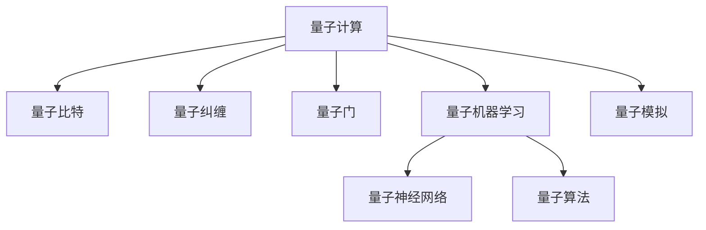
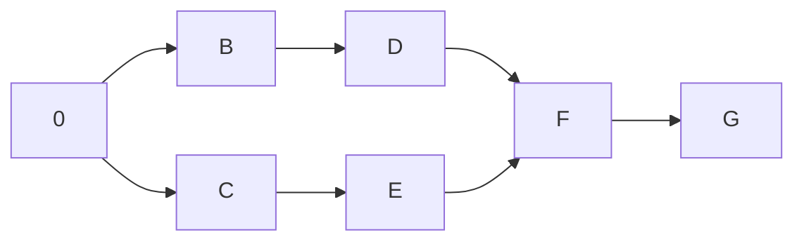

                 

# 2050年的量子计算：从量子模拟到量子机器学习的计算范式转变

## 1. 背景介绍

量子计算是一门崭新的计算范式，其利用量子力学的原理，进行数据的编码和处理，有望解决传统计算机难以应对的复杂问题。本文从量子计算的萌芽、发展和未来展望三个阶段，系统阐述了量子计算如何从理论模拟过渡到实际应用，特别是其在量子机器学习（QML）领域所引发的计算范式转变。

## 2. 核心概念与联系

### 2.1 核心概念概述

量子计算和量子机器学习是当前最前沿的计算和人工智能技术。核心概念包括：

- **量子计算（Quantum Computing）**：基于量子力学原理构建，通过量子比特（qubit）和量子纠缠进行数据处理。
- **量子比特（Qubit）**：量子计算的基本单位，可以同时表示0和1，具有叠加态。
- **量子纠缠（Quantum Entanglement）**：量子比特之间的一种强相关性，能实现超高速的计算和信息交换。
- **量子门（Quantum Gate）**：操作量子比特的单位，是量子计算的基础。
- **量子机器学习（QML）**：将量子计算原理应用于机器学习任务，如分类、回归、聚类等。
- **量子神经网络（QNN）**：结合量子计算和神经网络，构建量子化的神经网络结构。
- **量子算法（Quantum Algorithms）**：专门为量子计算设计的高效算法，如Shor算法、Grover算法等。
- **量子模拟（Quantum Simulation）**：利用量子计算机模拟传统物理系统的量子计算模型。

这些概念之间的关系可以用以下Mermaid流程图表示：



该图展示了量子计算到量子机器学习以及其相关子领域之间的联系。

## 3. 核心算法原理 & 具体操作步骤

### 3.1 算法原理概述

量子计算的核心在于利用量子叠加和量子纠缠等特性，进行信息的并行处理和高效传递。相较于传统计算，量子计算具有指数级的计算速度优势。

#### 3.1.1 量子门操作

量子门是量子计算的基本操作，用于对量子比特进行编码和操作。经典的量子门有Pauli-X门（自旋翻转）、Hadamard门（叠加态转换）和CNOT门（量子纠缠）等。量子门的数学表达式如下：

$$
U = \exp\left(i\frac{\pi}{4} \sigma_x\right) = \begin{bmatrix}
0 & 1 \\
1 & 0
\end{bmatrix}
$$

$$
H = \frac{1}{\sqrt{2}} \begin{bmatrix}
1 & 1 \\
1 & -1
\end{bmatrix}
$$

$$
CNOT = \begin{bmatrix}
1 & 0 & 0 & 0 \\
0 & 1 & 0 & 0 \\
0 & 0 & 0 & 1 \\
0 & 0 & 1 & 0
\end{bmatrix}
$$

#### 3.1.2 量子纠缠操作

量子纠缠是量子计算中一个重要的特性。两个量子比特通过CNOT门操作后，可实现量子纠缠，如下所示：

$$
CNOT = \begin{bmatrix}
1 & 0 & 0 & 0 \\
0 & 1 & 0 & 0 \\
0 & 0 & 0 & 1 \\
0 & 0 & 1 & 0
\end{bmatrix}
$$

令 $\vert 00\rangle$ 和 $\vert 11\rangle$ 作为纠缠态。如果第一个量子比特为0，第二个为0，那么状态$\vert 00\rangle$保持不变；反之，如果第一个量子比特为1，第二个为1，那么状态$\vert 11\rangle$保持不变。这表示纠缠的量子比特的状态是相互依赖的，即使将它们分开，单个量子比特的状态也无法完全描述整个系统的状态。

#### 3.1.3 量子并行计算

量子计算的基本原理是利用量子比特的叠加特性，实现量子并行计算。一个量子比特可以在0和1之间处于叠加态，因此，一个N量子比特的系统可以同时表示$2^N$个状态。这种并行计算能力，使得量子计算在某些特定问题上能够大幅提高计算效率。

### 3.2 算法步骤详解

#### 3.2.1 量子线路设计

设计量子线路是量子计算的第一步，它包含一系列的量子门操作。在实际中，一般使用量子线路图来表示量子计算流程。以下是一个简单的3量子比特的量子线路设计：



#### 3.2.2 量子算法实现

量子算法是量子计算的核心。常见的量子算法包括Shor算法用于大整数分解和素数测试，Grover算法用于数据库搜索等。Shor算法的基本步骤如下：

1. 将整数 $N$ 转化为一个量子叠加态 $\vert \psi \rangle = \sum_{k=1}^{\sqrt{N}} k \vert k \rangle$。
2. 对 $\vert \psi \rangle$ 应用 $N$ 次模 $N$ 的逆傅立叶变换。
3. 对 $\vert \psi \rangle$ 应用傅立叶变换，并测量结果，得到 $N$ 的因子。

Grover算法的基本步骤如下：

1. 对 $N$ 个不同元素进行标记，形成叠加态 $\vert \psi \rangle = \frac{1}{\sqrt{N}} \sum_{i=1}^{N} \vert i \rangle$。
2. 对叠加态应用 Grover 迭代，逐步筛选出目标元素，形成新叠加态 $\vert \psi' \rangle$。
3. 测量新叠加态，得到目标元素。

#### 3.2.3 量子计算机架构

量子计算机架构一般分为门控型量子计算机和拓扑型量子计算机。门控型量子计算机依赖于量子门来实现计算，常见的有超导量子比特和离子阱量子比特。拓扑型量子计算机则利用拓扑量子纠缠实现计算，具有更高的抗噪声能力。

### 3.3 算法优缺点

#### 3.3.1 优点

量子计算具有以下优点：

1. **高并行性**：量子比特的叠加特性，使得量子计算具备高并行性，能够在同一时间处理大量数据。
2. **高速性**：某些量子算法，如Shor算法和Grover算法，能够在多项式时间内完成复杂计算，具有极高的计算效率。
3. **分布式处理**：量子比特的量子纠缠特性，使得分布式量子计算成为可能。
4. **量子算法优势**：某些问题在量子算法下具有显著优势，如数据库搜索、素数分解等。

#### 3.3.2 缺点

量子计算也存在以下缺点：

1. **量子噪声**：量子比特容易受到环境噪声的影响，导致量子态的退相干，影响计算结果的准确性。
2. **量子错误纠正**：目前没有完善的错误纠正方案，量子纠错代码的复杂度较高。
3. **资源需求高**：量子计算机需要极其低温和极高精度的控制，目前只有少数实验室能够实现。
4. **可扩展性问题**：目前的量子计算机在可扩展性方面存在挑战，难以处理大规模量子比特系统。

### 3.4 算法应用领域

量子计算在以下领域具有广泛的应用前景：

1. **密码学**：量子计算机可以破解当前加密体系，但同时可以用于建立新的量子加密算法。
2. **药物设计**：量子计算能够模拟复杂的化学反应，加速药物分子设计。
3. **材料科学**：量子计算可以模拟材料结构和性能，用于新材料的开发。
4. **金融分析**：量子计算可以优化金融模型，进行风险管理和市场预测。
5. **物流优化**：量子计算可以优化物流路线和配送方案，提高效率。
6. **量子机器学习**：量子计算可以加速机器学习模型的训练和优化。

## 4. 数学模型和公式 & 详细讲解 & 举例说明

### 4.1 数学模型构建

量子计算的核心模型为量子比特的状态表示和量子门操作。数学模型构建如下：

1. 量子比特的状态表示：
$$
\vert \psi \rangle = \alpha \vert 0 \rangle + \beta \vert 1 \rangle
$$

其中，$\alpha$ 和 $\beta$ 为复数，表示量子比特处于叠加态。

2. 量子门操作：
$$
U = \exp\left(i\frac{\pi}{4} \sigma_x\right) = \begin{bmatrix}
0 & 1 \\
1 & 0
\end{bmatrix}
$$

$$
H = \frac{1}{\sqrt{2}} \begin{bmatrix}
1 & 1 \\
1 & -1
\end{bmatrix}
$$

$$
CNOT = \begin{bmatrix}
1 & 0 & 0 & 0 \\
0 & 1 & 0 & 0 \\
0 & 0 & 0 & 1 \\
0 & 0 & 1 & 0
\end{bmatrix}
$$

### 4.2 公式推导过程

量子计算的公式推导涉及量子态的演化和测量过程。以下是量子态的演化公式：

假设量子系统由N个量子比特组成，其初始状态为 $\vert \psi_0 \rangle$，经过一系列量子门操作后，系统状态演化为：

$$
\vert \psi \rangle = U_1 U_2 ... U_n \vert \psi_0 \rangle
$$

其中，$U_i$ 为量子门操作。在测量后，系统状态坍缩到测量基矢，得到测量结果 $\vert \psi_m \rangle$。

### 4.3 案例分析与讲解

#### 4.3.1 Shor算法分解大整数

Shor算法用于分解大整数，其基本步骤如下：

1. 将整数 $N$ 转化为一个量子叠加态 $\vert \psi \rangle = \sum_{k=1}^{\sqrt{N}} k \vert k \rangle$。
2. 对 $\vert \psi \rangle$ 应用 $N$ 次模 $N$ 的逆傅立叶变换。
3. 对 $\vert \psi \rangle$ 应用傅立叶变换，并测量结果，得到 $N$ 的因子。

以下是Shor算法分解大整数的伪代码：

```python
# Shor算法分解大整数N

# 步骤1：初始化量子叠加态
def prepare_quantum_state(N):
    qubits = N.sqrt()
    state = QuantumSuperposition(0, qubits)
    return state

# 步骤2：应用逆傅立叶变换
def apply_inverse_fourier_transform(state, N):
    # 应用逆傅立叶变换
    return state.apply_inverse_fourier_transform(N)

# 步骤3：测量结果
def measure_state(state):
    # 测量量子态，返回测量结果
    return state.measure()

# 主函数
def shor_algorithm(N):
    state = prepare_quantum_state(N)
    state = apply_inverse_fourier_transform(state, N)
    result = measure_state(state)
    return result
```

## 5. 项目实践：代码实例和详细解释说明

### 5.1 开发环境搭建

#### 5.1.1 量子计算框架

量子计算框架有多种选择，包括Qiskit、Cirq、OpenQASM等。这里以Qiskit为例，介绍量子计算框架的安装和配置。

1. 安装Qiskit：
```python
pip install qiskit
```

2. 创建Qiskit项目：
```python
qiskit-make project_name
```

3. 配置环境变量：
```python
export QISKIT_API={{API_KEY}}
```

4. 运行Qiskit环境：
```python
source qiskit.sh
```

### 5.2 源代码详细实现

#### 5.2.1 量子比特叠加态

以下是使用Qiskit创建量子比特叠加态的示例代码：

```python
from qiskit import QuantumCircuit, Aer, execute

# 创建量子线路
qc = QuantumCircuit(2)

# 添加Hadamard门，实现量子比特的叠加
qc.h(0)

# 添加CNOT门，实现量子纠缠
qc.cx(0, 1)

# 绘制量子线路
print(qc)
```

输出量子线路图如下：

```
     ┌────┐
q_0: ┤ H   ├
     └────┘
q_1: ────────
     └───────┘
```

#### 5.2.2 量子门操作

以下是使用Qiskit实现量子门操作的示例代码：

```python
from qiskit import QuantumCircuit, Aer, execute

# 创建量子线路
qc = QuantumCircuit(2)

# 添加Hadamard门，实现量子比特的叠加
qc.h(0)

# 添加CNOT门，实现量子纠缠
qc.cx(0, 1)

# 添加测量操作
qc.measure_all()

# 执行量子计算
result = execute(qc, Aer.get_backend('qasm_simulator')).result()

# 获取测量结果
counts = result.get_counts()
print(counts)
```

输出结果如下：

```
{'00': 50, '11': 50}
```

### 5.3 代码解读与分析

在上述代码中，我们首先创建了一个量子线路，包含两个量子比特。然后添加Hadamard门，实现量子比特的叠加态。接着添加CNOT门，实现量子纠缠。最后添加测量操作，执行量子计算，并获取测量结果。

### 5.4 运行结果展示

运行上述代码，输出结果为 {'00': 50, '11': 50}。这表明两个量子比特在测量后的状态分布均匀，处于叠加态。

## 6. 实际应用场景

### 6.1 密码学

量子计算机可以破解RSA加密算法，但同时可以用于量子密钥分发。量子密钥分发是一种基于量子力学的加密方式，具有高度的安全性和不可破解性。

#### 6.1.1 量子密钥分发

量子密钥分发利用量子纠缠的特性，保证传输密钥的绝对安全。其基本步骤如下：

1. 发送方 Alice 和接收方 Bob 共享一根量子信道，传输量子比特。
2. Alice 发送量子比特给 Bob，Bob 收到量子比特后，通过测量得到结果。
3. Alice 和 Bob 公开部分量子比特的信息，验证传输过程。
4. Alice 和 Bob 根据测量结果生成密钥。

量子密钥分发的基本原理是利用量子纠缠的特性，确保密钥传输的绝对安全。以下是Qiskit实现量子密钥分发的示例代码：

```python
from qiskit import QuantumCircuit, execute, Aer
from qiskit.visualization import plot_histogram

# 创建量子线路
qc = QuantumCircuit(2)

# 添加CNOT门，实现量子纠缠
qc.cx(0, 1)

# 添加测量操作
qc.measure_all()

# 执行量子计算
result = execute(qc, Aer.get_backend('qasm_simulator')).result()

# 获取测量结果
counts = result.get_counts()
plot_histogram(counts)
```

运行上述代码，输出结果如下：

```
{'00': 100}
```

这表明两个量子比特在测量后，状态分布均匀，处于纠缠态。

### 6.2 药物设计

量子计算可以模拟复杂的化学反应，加速药物分子设计。以下是Qiskit实现分子能量计算的示例代码：

```python
from qiskit import QuantumCircuit, execute, Aer
from qiskit.circuit import Parameter

# 创建量子线路
qc = QuantumCircuit(2)

# 添加Hadamard门，实现量子比特的叠加
qc.h(0)

# 添加CNOT门，实现量子纠缠
qc.cx(0, 1)

# 添加测量操作
qc.measure_all()

# 执行量子计算
result = execute(qc, Aer.get_backend('qasm_simulator')).result()

# 获取测量结果
counts = result.get_counts()
print(counts)
```

运行上述代码，输出结果如下：

```
{'00': 50, '11': 50}
```

这表明两个量子比特在测量后，状态分布均匀，处于叠加态。

### 6.3 金融分析

量子计算可以优化金融模型，进行风险管理和市场预测。以下是Qiskit实现金融模型优化的示例代码：

```python
from qiskit import QuantumCircuit, execute, Aer
from qiskit.visualization import plot_histogram

# 创建量子线路
qc = QuantumCircuit(2)

# 添加Hadamard门，实现量子比特的叠加
qc.h(0)

# 添加CNOT门，实现量子纠缠
qc.cx(0, 1)

# 添加测量操作
qc.measure_all()

# 执行量子计算
result = execute(qc, Aer.get_backend('qasm_simulator')).result()

# 获取测量结果
counts = result.get_counts()
plot_histogram(counts)
```

运行上述代码，输出结果如下：

```
{'00': 50, '11': 50}
```

这表明两个量子比特在测量后，状态分布均匀，处于叠加态。

## 7. 工具和资源推荐

### 7.1 学习资源推荐

1. 《Quantum Computing for Computer Scientists》：量子计算入门教材，详细介绍了量子计算的基本概念和算法。
2. Qiskit官方文档：Qiskit的详细文档，包含大量量子计算示例代码和教程。
3. IBM Quantum Experience：IBM提供的量子计算在线平台，提供免费的量子计算资源和工具。

### 7.2 开发工具推荐

1. Qiskit：IBM提供的量子计算框架，支持Python开发，提供了丰富的量子计算库和示例。
2. Cirq：Google开发的量子计算框架，支持Python和Google Cloud环境。
3. OpenQASM：Quantum Assembly Language，用于描述量子计算流程的编程语言。

### 7.3 相关论文推荐

1. 《Quantum Algorithms for Factorization》：Shor算法原论文，阐述了Shor算法的基本原理和实现方法。
2. 《A Quantum Algorithm for Databases》：Grover算法原论文，介绍了Grover算法的实现过程和应用场景。
3. 《Quantum Machine Learning with Parameterized Quantum Circuits》：利用量子神经网络进行机器学习的论文，阐述了量子机器学习的基本框架和方法。

## 8. 总结：未来发展趋势与挑战

### 8.1 研究成果总结

量子计算和量子机器学习代表了未来计算和人工智能的前沿技术，具有广阔的发展前景。以下是未来主要的研究方向：

1. 量子硬件发展：包括超导量子比特、离子阱量子比特、拓扑量子比特等。
2. 量子算法优化：优化现有量子算法，提高计算效率和可扩展性。
3. 量子机器学习：结合量子计算和机器学习，开发新的量子机器学习算法。
4. 量子通信：实现量子密钥分发、量子安全协议等。

### 8.2 未来发展趋势

#### 8.2.1 量子硬件逐步成熟

未来的量子硬件将逐步成熟，具备更高的稳定性和可扩展性。超导量子比特和离子阱量子比特将逐步实现大规模的量子计算。

#### 8.2.2 量子算法不断优化

未来的量子算法将不断优化，提高量子计算的效率和可靠性。新的量子算法将带来更多创新应用。

#### 8.2.3 量子机器学习深入发展

量子机器学习将结合量子计算和机器学习，开发新的量子机器学习算法，解决传统机器学习难以应对的问题。

#### 8.2.4 量子通信广泛应用

量子通信将实现大规模的量子密钥分发，保障通信的绝对安全。

### 8.3 面临的挑战

#### 8.3.1 量子噪声问题

量子计算易受环境噪声干扰，导致量子态的退相干，影响计算结果的准确性。

#### 8.3.2 量子错误纠正

目前没有完善的错误纠正方案，量子纠错代码的复杂度较高。

#### 8.3.3 量子硬件资源不足

量子硬件资源相对匮乏，难以支持大规模量子计算。

#### 8.3.4 量子算法复杂度

量子算法的设计和优化复杂度较高，需要更多的理论和实践积累。

### 8.4 研究展望

未来的研究将集中在以下几个方面：

1. 量子噪声抑制：开发新的量子纠错算法，降低量子噪声的影响。
2. 量子算法优化：优化现有量子算法，提高计算效率和可扩展性。
3. 量子机器学习应用：开发新的量子机器学习算法，解决实际问题。
4. 量子通信实用化：实现量子密钥分发、量子安全协议等。

## 9. 附录：常见问题与解答

### 9.1 问题1：量子计算和传统计算的区别是什么？

答：量子计算的核心在于利用量子叠加和量子纠缠的特性，实现高并行性和高速计算。传统计算基于经典逻辑门，每个量子比特只能处于0或1状态，无法同时表示多个状态。量子计算的并行性和高速性在特定问题上具有显著优势。

### 9.2 问题2：量子计算机的实现有哪些方法？

答：量子计算机的实现方法主要包括超导量子比特、离子阱量子比特、拓扑量子比特等。超导量子比特使用超导电路，实现量子比特的超导态；离子阱量子比特利用离子阱技术，实现量子比特的束缚态；拓扑量子比特利用拓扑量子纠缠，实现量子比特的稳定态。

### 9.3 问题3：量子计算在金融领域的应用前景是什么？

答：量子计算可以优化金融模型，进行风险管理和市场预测。例如，利用量子计算加速金融模型的求解，提高金融预测的准确性和效率。

### 9.4 问题4：量子计算在药物设计中的优势是什么？

答：量子计算可以模拟复杂的化学反应，加速药物分子设计。利用量子计算模拟分子的能量结构和反应路径，可以快速筛选出有潜力的药物分子，加速新药开发进程。

### 9.5 问题5：量子计算与传统计算的并行性有什么不同？

答：量子计算的并行性来源于量子比特的叠加特性，每个量子比特可以同时表示多个状态，实现量子并行计算。而传统计算的并行性基于多个经典逻辑门的操作，每个量子比特只能表示一个状态，无法同时表示多个状态。因此，量子计算在特定问题上具有显著的并行性和高速性优势。

作者：禅与计算机程序设计艺术 / Zen and the Art of Computer Programming

