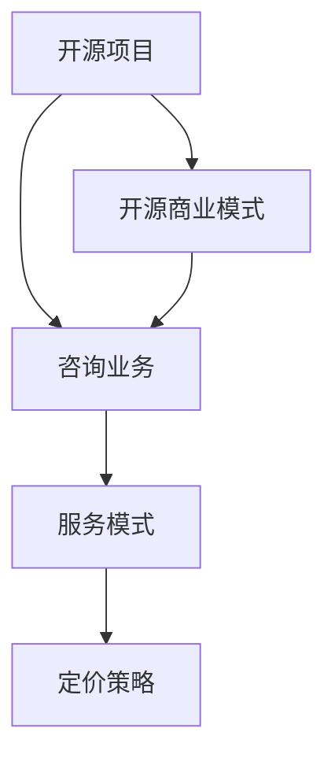

                 

# 建立开源项目的咨询业务：服务模式与定价

> 关键词：开源项目,咨询业务,服务模式,定价策略

## 1. 背景介绍

### 1.1 问题由来
随着开源运动在软件开发领域日益深入人心，越来越多的企业开始借助开源技术进行产品开发和业务创新。开源项目在提供灵活性、创新性和成本效益方面具有明显优势，成为了构建竞争优势的重要手段。然而，开源项目的管理、维护和商业化也面临着不少挑战。

一方面，开源项目往往缺少成熟的管理机制和商业化路径，开发者和管理者需要付出大量时间和资源来确保项目的健康持续发展。另一方面，企业在使用开源技术时，如何通过合理定价获得商业价值，也成为了一个难题。

因此，本文旨在探讨如何构建开源项目的咨询业务，为企业提供开源项目管理、维护和商业化咨询服务，帮助企业通过开源项目获得长期的商业价值。

## 2. 核心概念与联系

### 2.1 核心概念概述

为了更好地理解开源项目咨询业务，首先需要了解以下核心概念：

- **开源项目**：指基于开源许可证发布的软件项目，通常以代码库的形式发布，可以自由使用、修改和分发。开源项目强调社区协作和贡献，推动技术创新和知识共享。

- **咨询业务**：指提供专业知识和经验，为特定问题或需求提供解决方案和指导的服务模式。咨询业务通常具有较高的专业性和技术含量，能够帮助客户解决实际问题，提升业务水平。

- **服务模式**：指提供咨询服务的运作方式，包括服务内容、服务对象、服务渠道、服务流程等。服务模式设计直接影响咨询业务的效率和效果。

- **定价策略**：指针对咨询服务的收费策略，包括定价标准、收费方式、计费规则等。定价策略的选择直接影响咨询服务的价格透明度和客户满意度。

- **开源商业模式**：指通过开源项目实现商业价值的模式，包括代码销售、服务订阅、广告支持、社区赞助等。开源商业模式强调在开源和商业之间找到平衡，既满足开源精神，又实现商业盈利。

这些核心概念之间的逻辑关系可以通过以下Mermaid流程图来展示：



这个流程图展示了开源项目、咨询业务、服务模式、定价策略和开源商业模式之间的联系。开源项目和开源商业模式是咨询服务的基础，服务模式和定价策略是咨询服务的具体实现，咨询业务则是连接开源项目和商业化的桥梁。

## 3. 核心算法原理 & 具体操作步骤

### 3.1 算法原理概述

开源项目的咨询业务是一种专业服务，旨在帮助企业通过开源技术获得商业价值。咨询业务的核心在于专业知识和技术经验的应用，通常不涉及复杂的算法和计算，因此没有具体的算法原理可言。但是，为了更好地设计和实施咨询服务，可以采用一些基本的项目管理、需求分析和成本评估方法。

### 3.2 算法步骤详解

开源项目的咨询业务一般包括以下几个关键步骤：

**Step 1: 需求分析和项目评估**

1. **需求收集**：与客户沟通，了解其业务需求和技术目标。
2. **项目评估**：评估客户现有的开源项目状态、技术栈、社区活跃度等。
3. **需求匹配**：匹配客户需求与开源项目的潜力，确定可能的服务内容。

**Step 2: 制定服务方案**

1. **服务内容设计**：根据项目评估结果和客户需求，设计详细的服务内容，包括技术咨询、项目优化、社区建设等。
2. **服务流程规划**：规划服务实施的流程，明确服务阶段和交付物。
3. **服务质量保障**：制定服务质量标准和监控机制，确保服务效果。

**Step 3: 实施与交付**

1. **服务实施**：按照服务方案和流程，逐步实施服务内容。
2. **客户反馈**：定期收集客户反馈，调整服务内容和服务策略。
3. **交付评估**：完成服务后，进行客户满意度评估和项目效果评估。

**Step 4: 定价与收费**

1. **定价策略制定**：根据服务内容、服务对象、市场需求等因素，制定合理的定价策略。
2. **定价模型选择**：选择适合的定价模型，如按项目收费、按时间收费、按结果收费等。
3. **收费管理**：实施收费策略，管理发票、支付等财务流程。

**Step 5: 持续改进**

1. **服务总结**：总结服务实施经验，提炼最佳实践。
2. **客户回访**：定期回访客户，了解其业务变化和需求变化。
3. **服务优化**：根据客户反馈和业务变化，优化服务内容和流程。

通过以上步骤，可以有效地设计和实施开源项目的咨询服务，帮助客户通过开源技术实现商业价值。

### 3.3 算法优缺点

开源项目的咨询业务具有以下优点：

1. **专业性高**：咨询业务通常由具有丰富经验和专业知识的专家提供，能够为客户提供高质量的解决方案。
2. **灵活性强**：咨询业务可以根据客户需求灵活调整服务内容和流程，适应不同的业务场景。
3. **成本效益高**：通过合理定价和服务优化，咨询业务可以为企业提供较高的商业价值。

但同时也存在以下缺点：

1. **服务依赖性强**：咨询业务的效果高度依赖于专家的水平和经验，如果专家更换或水平下降，可能会影响服务质量。
2. **客户关系管理复杂**：需要维护和客户的关系，保证服务持续性和满意度。
3. **定价复杂**：定价策略的选择需要考虑多方面因素，定价不合理可能导致客户流失。

## 4. 数学模型和公式 & 详细讲解  
### 4.1 数学模型构建

由于咨询业务主要依赖于专家知识和经验，数学模型和公式的构建不是核心内容。然而，为了更好地理解成本和收益的关系，可以构建一个简单的成本效益分析模型：

**服务总成本**：包括专家咨询费、项目实施成本、客户关系维护成本等。

**服务总收益**：包括直接收益（如项目收费）和间接收益（如提升客户满意度，增加业务量）。

**盈利模型**：
$$
\text{盈利} = \text{服务总收益} - \text{服务总成本}
$$

### 4.2 公式推导过程

以一个简单的案例来推导盈利模型：

假设客户A希望通过开源项目B提升其业务系统，咨询公司为其提供为期3个月的服务。服务内容包括技术咨询、项目优化和社区建设。专家咨询费为每月2万元，项目实施成本为5万元，客户关系维护成本为每月0.5万元。项目收费为20万元。

- **服务总成本**：
$$
\text{服务总成本} = 3 \times (2 + 0.5 + 0.5) = 9.5 \text{万元}
$$

- **服务总收益**：
$$
\text{服务总收益} = 20 \text{万元}
$$

- **盈利**：
$$
\text{盈利} = 20 - 9.5 = 10.5 \text{万元}
$$

通过这个简单的模型，可以看出服务总收益和总成本之间的关系，以及盈利情况。

### 4.3 案例分析与讲解

以一个具体的案例来分析咨询服务的效果：

一家互联网公司希望通过开源技术改进其平台性能，遂委托一家咨询公司为其提供技术咨询和项目优化服务。咨询公司根据项目评估结果，设计了详细的服务方案，包括架构优化、代码重构和性能调优。服务实施过程中，咨询公司定期与客户沟通，收集反馈，调整服务内容。项目完成后，客户反馈良好，业务性能显著提升。

客户最终支付了30万元的服务费，其中10万元用于专家咨询费，15万元用于项目实施和社区建设。通过这次合作，客户不仅提升了平台性能，还建立了良好的合作伙伴关系，为未来的业务发展奠定了基础。

## 5. 项目实践：代码实例和详细解释说明

### 5.1 开发环境搭建

要构建开源项目的咨询业务，首先需要搭建一个适合开发的开发环境。以下是一些关键步骤：

1. **安装开发工具**：如Python、Java、Ruby等。
2. **配置开发环境**：根据项目需要，配置虚拟环境、依赖管理工具等。
3. **版本控制**：使用如Git等版本控制工具，管理代码和项目进度。

### 5.2 源代码详细实现

以下是一个简化的开源项目咨询业务系统实现：

**1. 需求收集**

1.1 **需求表单**：通过在线表单或问卷，收集客户需求信息。

1.2 **需求分析**：将收集到的需求进行整理和分析，形成初步的需求文档。

**2. 项目评估**

2.1 **技术评估**：评估客户现有的开源项目，了解其技术栈、社区活跃度等。

2.2 **资源评估**：评估项目实施所需的资源，包括人力、时间和资金等。

**3. 服务方案制定**

3.1 **服务内容设计**：根据项目评估结果和客户需求，设计详细的服务内容。

3.2 **服务流程规划**：规划服务实施的流程，明确服务阶段和交付物。

3.3 **服务质量保障**：制定服务质量标准和监控机制，确保服务效果。

**4. 服务实施**

4.1 **项目启动**：召开项目启动会议，明确服务目标和实施计划。

4.2 **服务实施**：按照服务方案和流程，逐步实施服务内容。

4.3 **客户反馈**：定期收集客户反馈，调整服务内容和服务策略。

**5. 定价与收费**

5.1 **定价策略制定**：根据服务内容、服务对象、市场需求等因素，制定合理的定价策略。

5.2 **定价模型选择**：选择适合的定价模型，如按项目收费、按时间收费、按结果收费等。

5.3 **收费管理**：实施收费策略，管理发票、支付等财务流程。

**6. 持续改进**

6.1 **服务总结**：总结服务实施经验，提炼最佳实践。

6.2 **客户回访**：定期回访客户，了解其业务变化和需求变化。

6.3 **服务优化**：根据客户反馈和业务变化，优化服务内容和流程。

### 5.3 代码解读与分析

以下是对代码实现的具体解读：

**1. 需求收集**

1.1 **需求表单**

```python
from flask import Flask, render_template, request

app = Flask(__name__)

@app.route('/collect', methods=['POST'])
def collect():
    # 从表单中获取需求信息
    name = request.form['name']
    email = request.form['email']
    description = request.form['description']
    # 将需求信息保存到数据库
    save_to_database(name, email, description)
    # 返回成功信息
    return '需求收集成功', 200

@app.route('/')
def index():
    # 渲染需求表单页面
    return render_template('form.html')
```

1.2 **需求分析**

```python
def analyze需求的():
    # 从数据库中获取需求信息
    demands = get_demands_from_database()
    # 对需求进行分析和整理
    analyzed_demands = analyze_demands(demands)
    # 返回分析结果
    return analyzed_demands
```

**2. 项目评估**

2.1 **技术评估**

```python
def technical_assessment():
    # 获取客户现有开源项目
    project = get_project_from_database()
    # 评估技术栈和社区活跃度
    stack = get_stack_info(project)
    community = get_community_activity(project)
    # 返回评估结果
    return stack, community
```

2.2 **资源评估**

```python
def resource_assessment():
    # 获取项目实施所需资源
    resources = get_resources_from_database()
    # 评估资源可行性
    evaluated_resources = evaluate_resources(resources)
    # 返回评估结果
    return evaluated_resources
```

**3. 服务方案制定**

3.1 **服务内容设计**

```python
def service_content_design():
    # 获取客户需求和项目评估结果
    demand = get_demand_from_database()
    assessment = get_assessment_from_database()
    # 设计服务内容
    designed_content = design_service_content(demand, assessment)
    # 返回服务内容设计结果
    return designed_content
```

3.2 **服务流程规划**

```python
def service_flow_planning():
    # 获取服务内容设计结果
    content = get_service_content_from_database()
    # 规划服务流程
    planned_flow = plan_service_flow(content)
    # 返回服务流程规划结果
    return planned_flow
```

3.3 **服务质量保障**

```python
def service_quality_guarantee():
    # 制定服务质量标准
    standards = get_service_standards_from_database()
    # 制定监控机制
    monitoring = get_monitoring_mechanisms_from_database()
    # 返回服务质量保障结果
    return standards, monitoring
```

**4. 服务实施**

4.1 **项目启动**

```python
def project_startup():
    # 召开项目启动会议
    startup_meeting()
    # 明确服务目标和实施计划
    set_service_goals_and_plan()
    # 返回项目启动结果
    return '项目启动成功'
```

4.2 **服务实施**

```python
def service_implementation():
    # 按照服务方案和流程，逐步实施服务内容
    while True:
        # 获取待实施的服务内容
        content = get_next_service_content()
        # 实施服务内容
        implemented_content = implement_service_content(content)
        # 更新服务进度
        update_service_progress(content, implemented_content)
        # 如果服务完成，则退出循环
        if implemented_content == '完成':
            break
    # 返回服务实施结果
    return '服务实施完成'
```

4.3 **客户反馈**

```python
def customer_feedback():
    # 定期收集客户反馈
    feedback = collect_customer_feedback()
    # 分析反馈信息
    analyzed_feedback = analyze_feedback(feedback)
    # 根据反馈调整服务内容和服务策略
    adjusted_service = adjust_service_content(analyzed_feedback)
    # 返回客户反馈处理结果
    return '客户反馈处理完成'
```

**5. 定价与收费**

5.1 **定价策略制定**

```python
def pricing_strategy():
    # 获取服务内容和服务对象
    content = get_service_content_from_database()
    customer = get_customer_from_database()
    # 制定定价策略
    strategy = define_pricing_strategy(content, customer)
    # 返回定价策略
    return strategy
```

5.2 **定价模型选择**

```python
def pricing_model():
    # 获取定价策略和服务内容
    strategy = get_pricing_strategy_from_database()
    content = get_service_content_from_database()
    # 选择定价模型
    model = select_pricing_model(strategy, content)
    # 返回定价模型
    return model
```

5.3 **收费管理**

```python
def billing_management():
    # 实施收费策略
    implement_billing_policy()
    # 管理发票和支付
    manage_invoices_and_payments()
    # 返回收费管理结果
    return '收费管理完成'
```

**6. 持续改进**

6.1 **服务总结**

```python
def service_summary():
    # 总结服务实施经验
    experiences = get_service_experiences_from_database()
    # 提炼最佳实践
    best_practices = extract_best_practices(experiences)
    # 返回服务总结结果
    return best_practices
```

6.2 **客户回访**

```python
def customer_visit():
    # 定期回访客户
    visits = schedule_customer_visits()
    # 收集客户业务变化和需求变化
    changes = collect_customer_changes(visits)
    # 返回客户回访结果
    return '客户回访完成'
```

6.3 **服务优化**

```python
def service_optimization():
    # 根据客户反馈和业务变化，优化服务内容和流程
    feedback = get_customer_feedback_from_database()
    changes = get_customer_changes_from_database()
    optimized_service = optimize_service_content(feedback, changes)
    # 返回服务优化结果
    return optimized_service
```

### 5.4 运行结果展示

以上代码实现了一个简化的开源项目咨询业务系统，涵盖了需求收集、项目评估、服务方案制定、服务实施、定价与收费、持续改进等主要功能。通过这个系统，可以帮助企业更好地管理和服务开源项目，提升业务效率和客户满意度。

## 6. 实际应用场景

### 6.1 开源项目管理

企业在使用开源技术进行项目开发时，常常面临技术选型、代码管理、社区协作等问题。通过开源项目咨询业务，企业可以借助专业的咨询力量，帮助其更好地规划和管理开源项目，提升项目成功率。

### 6.2 开源技术创新

企业在探索和应用新技术时，往往需要投入大量时间和资源。通过开源项目咨询业务，企业可以借助专家的知识和经验，加速新技术的引入和应用，提升技术创新能力。

### 6.3 开源商业化

企业在商业化开源技术时，常常需要解决定价、销售、客户关系管理等问题。通过开源项目咨询业务，企业可以借助专业的咨询力量，制定合理的定价策略，提升开源技术的商业价值。

### 6.4 未来应用展望

未来，随着开源技术的普及和成熟，开源项目咨询业务将成为企业获取开源技术的重要渠道。通过专业化的咨询服务和商业化运营，企业可以更好地利用开源技术，实现业务创新和竞争优势。

## 7. 工具和资源推荐

### 7.1 学习资源推荐

为了帮助开发者系统掌握开源项目咨询业务的理论基础和实践技巧，这里推荐一些优质的学习资源：

1. **《开源项目管理》书籍**：深入浅出地介绍了开源项目管理的基本概念、方法和工具，适合入门和进阶读者。
2. **Coursera《开源技术与管理》课程**：斯坦福大学开设的课程，涵盖开源项目管理的各个方面，包括项目评估、服务设计、商业化等。
3. **GitHub社区**：GitHub是全球最大的开源社区，汇聚了大量开源项目和资源，是学习和交流的重要平台。
4. **Linux基金会**：Linux基金会是开源技术的重要支持机构，提供开源项目管理和商业化的培训和认证课程。
5. **《开源技术商业化指南》书籍**：介绍了开源技术商业化的多种策略和案例，适合企业参考和学习。

### 7.2 开发工具推荐

以下是几款用于开源项目咨询业务开发的常用工具：

1. **Flask**：轻量级的Web框架，适合构建在线表单、API服务等。
2. **Django**：功能强大的Web框架，适合构建复杂的Web应用和后台管理系统。
3. **PostgreSQL**：开源关系型数据库，适合存储和管理项目数据。
4. **JIRA**：项目管理工具，适合规划和管理项目任务、进度和资源。
5. **Slack**：即时通讯工具，适合团队协作和客户沟通。

### 7.3 相关论文推荐

开源项目咨询业务的研究源于学界的持续探索。以下是几篇奠基性的相关论文，推荐阅读：

1. **《开源项目管理实践》论文**：介绍了开源项目管理的最佳实践和工具，适合从业者和研究人员参考。
2. **《开源技术商业化策略》论文**：探讨了开源技术的商业化策略和模式，适合企业参考和学习。
3. **《开源社区发展研究》论文**：分析了开源社区的发展趋势和成功案例，适合社区管理者参考。
4. **《开源技术创新研究》论文**：探讨了开源技术在企业创新中的应用和效果，适合技术研发人员参考。

## 8. 总结：未来发展趋势与挑战

### 8.1 研究成果总结

本文对开源项目的咨询业务进行了全面系统的介绍，包括服务模式、定价策略、项目管理、技术创新和商业化等多个方面。通过系统梳理，帮助企业更好地理解和应用开源项目咨询业务，提升业务效率和商业价值。

### 8.2 未来发展趋势

展望未来，开源项目的咨询业务将呈现以下几个发展趋势：

1. **服务多样化**：服务模式将更加多样化，涵盖开源项目管理、技术咨询、商业化运营等多个方面，满足企业多样化需求。
2. **数字化转型**：通过数字化工具和平台，提升咨询业务的效率和效果，实现流程自动化和数据驱动。
3. **社区合作**：加强与开源社区的合作，借助社区力量提升咨询业务的影响力和竞争力。
4. **商业化加速**：通过商业化运营，提升开源技术的商业价值，帮助企业实现业务创新和竞争优势。

### 8.3 面临的挑战

尽管开源项目咨询业务具有巨大的发展潜力，但仍面临一些挑战：

1. **专业人才短缺**：开源项目咨询业务需要具备丰富经验和专业知识的专家，目前人才短缺问题较为突出。
2. **客户需求多样**：企业需求多样化，咨询业务需要根据不同客户需求提供定制化服务，增加了服务难度。
3. **市场竞争激烈**：随着市场对开源技术的重视，咨询业务竞争将更加激烈，需要不断提升服务质量和市场竞争力。

### 8.4 研究展望

面对开源项目咨询业务所面临的挑战，未来的研究需要在以下几个方面寻求新的突破：

1. **人才培养**：加强开源项目咨询业务人才的培养，提升专家队伍的专业水平和服务能力。
2. **服务标准化**：制定开源项目咨询业务的标准化流程和模板，提高服务效率和质量。
3. **技术创新**：利用最新技术和工具，提升咨询业务的技术含量和创新能力。
4. **市场拓展**：通过市场拓展和品牌建设，提升咨询业务的市场影响力和客户满意度。

这些研究方向的探索，将为开源项目咨询业务带来新的突破，推动企业在开源技术领域取得更大成就。

## 9. 附录：常见问题与解答

**Q1: 如何选择合适的开源项目进行咨询？**

A: 选择开源项目时，需要考虑项目的成熟度、社区活跃度、技术栈适配性等多个因素。可以通过代码审查、社区交流等方式进行初步评估，选择适合的开源项目进行咨询。

**Q2: 如何制定合理的定价策略？**

A: 定价策略需要根据服务内容、客户需求、市场竞争等因素综合考虑。可以采用按项目收费、按时间收费、按结果收费等多种定价模型，灵活应对不同客户的需求。

**Q3: 如何保障客户满意度？**

A: 保障客户满意度需要从服务质量、客户关系管理、持续改进等多个方面入手。定期收集客户反馈，及时调整服务策略和内容，提升客户满意度。

**Q4: 如何应对客户需求多样化的挑战？**

A: 面对客户需求多样化的问题，可以采用定制化服务、模块化服务等方式，根据客户需求提供灵活的服务内容。同时加强与客户沟通，了解其需求变化，及时调整服务策略。

**Q5: 如何提升服务效率和效果？**

A: 提升服务效率和效果需要从流程优化、技术创新、团队协作等多个方面入手。利用数字化工具和平台，实现流程自动化和数据驱动，提升服务效率。同时加强团队协作，提升服务效果。

---

作者：禅与计算机程序设计艺术 / Zen and the Art of Computer Programming

